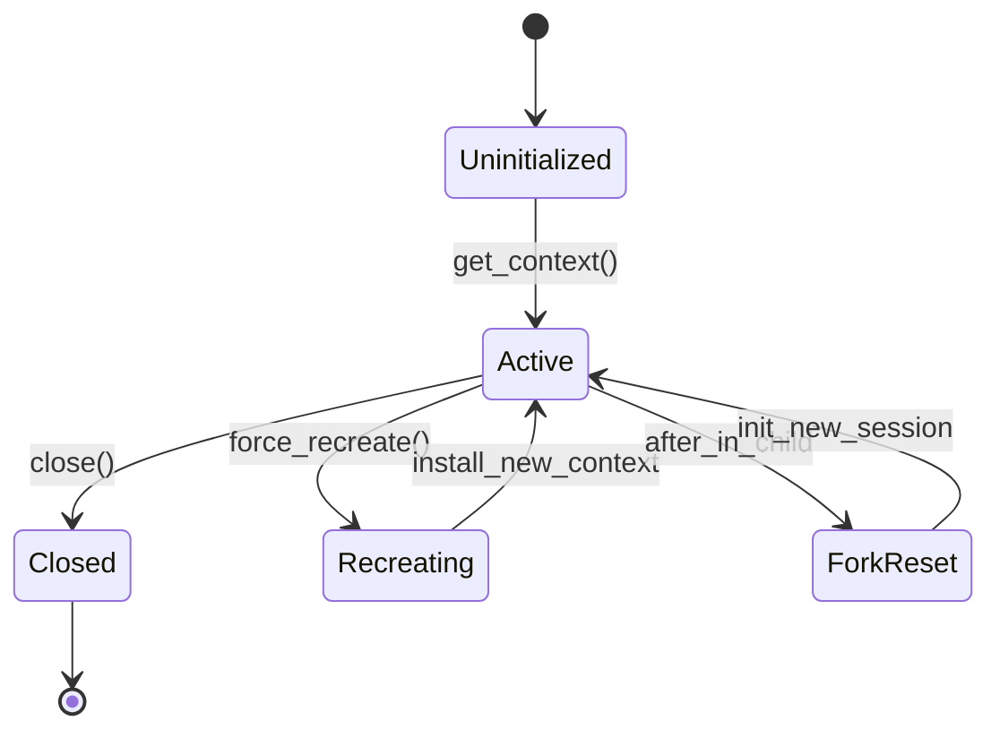
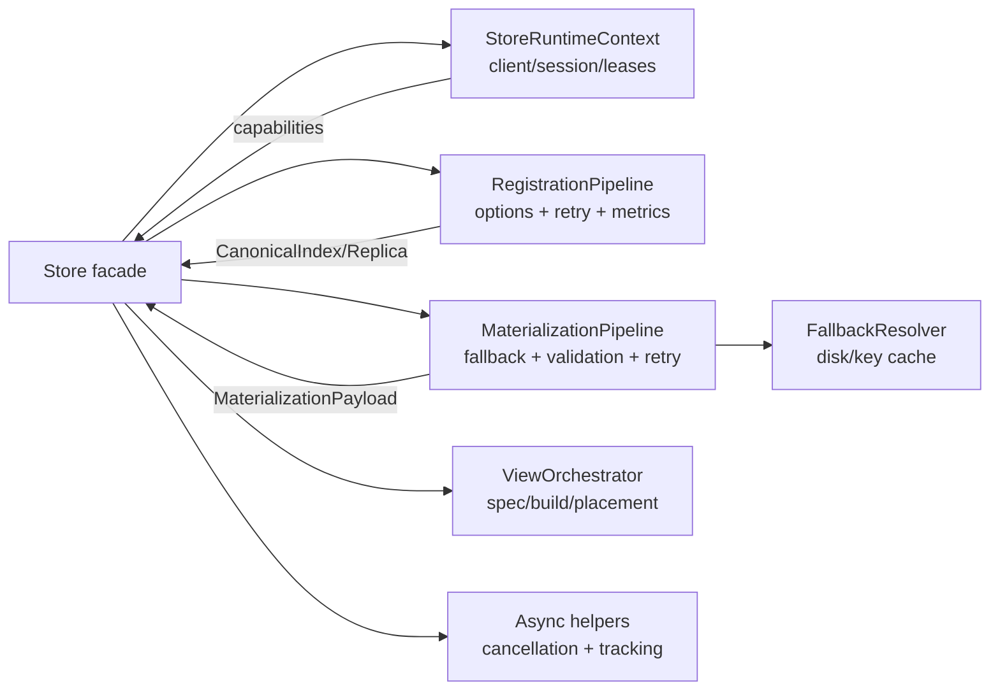

# Summary

`tensorcast/api/store.py` has accreted more than 3,200 lines of mixed concerns: process-wide session lifecycle, retry policy construction, tracing/metrics plumbing, disk fallback resolution, view spec translation, sync/async orchestration, and direct registration/materialization calls. The file’s current structure makes ownership unclear, raises the cost of change, and complicates correctness reviews because critical invariants (lease tracking, key cache eviction, cancellation, fallback expectations) are interleaved. This design proposes a modular split into a `tensorcast/api/store/` subpackage that preserves the public SDK surface while carving the Store into explicit pipelines with testable seams and shared retry/error-handling primitives.

# Goals / Non-Goals

Goals
- Reduce `store.py` into composable modules with clear ownership: lifecycle/runtime, registration, materialization/fallback, view handling, and async orchestration.
- Unify sync/async verb behavior through shared pipelines and cancellation points instead of duplicative per-method logic.
- Centralize retry/error mapping and span/metric attribution to eliminate drift between register/put/get/get_into/view flows.
- Make key caches, lease tracking, and session metadata updates explicit and unit-testable without daemon dependencies.
- Prepare the SDK for future client-side transforms and lazy handles (Design 0036) without expanding the Store class further.

Non-Goals
- No public API or wire-level changes; verb signatures and semantics stay stable.
- No daemon/global_store protocol changes.
- No schema updates or new configuration flags beyond what already exists in `StoreOptions`.

# Architecture & Interfaces

## Module boundaries

- `tensorcast/api/store/types.py`: Pure dataclasses and type aliases currently defined in `store.py` (e.g., `RetryPolicy`, `FallbackOptions`, `StoreOptions`, `CanonicalIndex*`, `ReplicaInfo`, `LeaseHandle`, `ArtifactError`, `ArtifactStatusCode`, `TensorDict`). This remains the public import surface for immutable types.
- `tensorcast/api/store/handles.py`: Lightweight wrappers for daemon-backed handles that carry behavior (e.g., `RegisteredArtifact`, `RegisteredLease`); keeps behavioral logic out of `types.py`.
- `tensorcast/api/store/runtime.py`: Process/runtime plumbing: daemon client creation, fork-handling, session record persistence, and capability introspection. Exports `StoreRuntimeContext` and helpers that replace the current `_ensure_client`, `_install_at_fork`, `_init_session_record`, and process-store globals.
- `tensorcast/api/store/registration.py`: Registration pipeline (`register`, `register_async`, `put`, `register_view`) with shared option normalization, device selection, TTL/lease handling, and retry/error mapping. Exposes `RegistrationPipeline` that depends on `StoreRuntimeContext` and `_register_artifact_core`.
- `tensorcast/api/store/materialization.py`: Retrieval pipeline (`get`, `get_into`, `get_view*`) plus disk/P2P fallback resolution, canonical index parsing, target validation, and release semantics. Provides `MaterializationPipeline` and `FallbackResolver`.
- `tensorcast/api/store/views.py`: View-specific orchestration (delegation to `_view_ops`, placement resolution, plan metadata computation) to keep view code out of the core Store orchestration.
- `tensorcast/api/store/async_ops.py` (thin): Shared async helpers (`TrackedExecutor`, `ArtifactFuture` wrapper, cancel hooks) so async verbs reuse the same cancellation semantics and session-record updates.
- `tensorcast/api/store/__init__.py`: Re-export public symbols for backward compatibility; `tensorcast/api/store.py` becomes a slim façade that delegates to the subpackage while preserving legacy import paths (`tensorcast.api.store`).
 - Cross-cutting helpers: retry/metrics/error-mapping utilities live alongside `registration.py`/`materialization.py` (either in a small `retry.py` helper or as shared functions within `registration.py`), with a single mapping table for gRPC/SDK errors reused by both pipelines.

### Runtime and session registry

- `StoreRuntimeContext` is a process-global singleton owned by `runtime.py`; it encapsulates the daemon client factory, at-fork refresh, session record persistence, key cache, and capability cache. The runtime module exposes accessor helpers that ensure a single instance per process (mirroring today’s `_ensure_process_store` behavior but centralized).
- `StoreRuntimeContext` consumes `tensorcast/store_session_registry.py` as a dependency to persist session metadata. The registry remains a standalone utility (used by CLI/ops tooling); runtime simply delegates to it rather than inlining registry code. No migration of registry logic into the runtime module is planned in this refactor.

#### Runtime lifecycle, concurrency, and fork handling

- **Singleton acquisition**: `runtime.get_context(opts, force_recreate=False)` returns the singleton; under the hood it guards mutations with a process-wide RW lock: reads (normal acquisition) run under a shared/read lock; mutations (recreate/force_recreate/fork reset) take a write lock.
- **Thread safety**: per-context internal locks protect (a) client/channel instance (recreated lazily on error or fork), (b) key cache map, (c) session record mutation, (d) lease/active handle sets. Lock granularity mirrors current `store.py` but lives in runtime; pipelines call runtime APIs that are already synchronized.
- **Force recreate / config change**: `force_recreate=True` acquires the write lock, closes the old client, clears caches (key cache, capabilities, pending futures/leass bookkeeping), then installs the new context before releasing. Configuration changes without `force_recreate` are rejected to avoid mixed semantics.
- **Fork hooks**: `os.register_at_fork` hooks live in runtime; `before` grabs the client lock; `after_in_parent` releases it; `after_in_child` runs under the write lock and resets client/channel, executor handles, key cache, capabilities, session id/labels, and active lease tracking to empty so no pre-fork leases/handles are reused. Session records are reinitialized post-fork with a new session id.
- **State diagram (simplified)**:

- **Cache invalidation**: on `force_recreate` and `after_in_child`, key cache and capability cache are cleared; pending futures set is reset; leases set is emptied without reuse to avoid leaking pre-fork handles.

## Flow outline

## Naming compliance

- Classes/structs: `StoreRuntimeContext`, `RegistrationPipeline`, `MaterializationPipeline`, `FallbackResolver`, `ViewOrchestrator`, `TrackedExecutor` (PascalCase).
- Functions/helpers: `build_retry_policies`, `resolve_device_selector`, `materialize_with_fallback`, `validate_targets`, `resolve_view_inputs` (snake_case).
- Constants: reuse existing `TransformPlacement`, `_DEFAULT_LEASE_TTL_MS`, etc. (ALL_CAPS).

# Schema Changes (if any)

None.

# Trade-offs & Risks

- Splitting the module introduces more files/imports; careful dependency boundaries are needed to avoid cycles (especially between view orchestration and registration).
- Async flows rely on shared executor and cancellation; regressions could surface if lifecycle hooks are missed when migrating code.
- Key cache and session-record updates must remain consistent across pipelines; missing updates would reduce observability or leak leases.
- Test coverage is skewed toward integration; adding unit seams reduces risk but requires new targeted tests to guard invariants (lease tracking, cache TTL, fallback paths).

## Dependency boundary guardrails (cycle avoidance)

- Key cache and key resolution move into `StoreRuntimeContext` so both materialization and view orchestration depend only on runtime, not on each other (`Materialization -> Runtime`, `Views -> Runtime`). `Materialization` may depend on `Views` for get_view spec building, but `Views` must not depend on `Materialization` (no fallback logic).
- `Views` is a logic leaf: it builds/validates specs and placement decisions and can call into runtime/daemon via injected clients. It must not import `registration` or `materialization` pipelines.
- `Registration` depends on `Views` for view registration, but `Views` does not depend on `Registration`.
- `types.py` stays pure (no behavioral handles); behavioral handle wrappers live in `handles.py` to avoid pulling runtime/daemon dependencies into the type surface.
- Dependency ordering (expected DAG): `types -> handles -> runtime`; `views -> (types, runtime)`; `registration -> (types, handles, runtime, views)`; `materialization -> (types, handles, runtime, views)`; `async_ops -> (types, handles, runtime)`; façade (`store.py`/`store/__init__.py`) depends on all pipelines for wiring only. This ordering should be enforced via lightweight import-cycle checks in CI (e.g., `import-linter` or a custom pytest guard).

## Async orchestration semantics (testable hooks)

- `async_ops.py` exposes `TrackedExecutor` that takes callbacks for: (a) on-submit (record pending future count), (b) on-complete (decrement pending count, persist session record), (c) on-cancel (invoke pipeline-specific cancel hook, release leases/materialized artifacts via runtime).
- `ArtifactFuture` wraps executor futures and ensures `confirm()`/`result()` call any daemon-side confirm hook before surfacing results, matching current behavior.
- Cancellation contracts: cancel sets a shared event, invokes pipeline abort (e.g., `_register_handle.abort` or materialized release), then updates session metadata via runtime. These hooks are explicit methods on the pipeline so they can be unit-tested without real daemon calls (using fakes/mocks).
- Cancel callbacks return `bool` to signal whether they consumed the cancellation request; side-effect-only callbacks (e.g., setting an event) should explicitly return `True` so executor bookkeeping and runtime session metadata stay consistent without falling back to raw future cancellation.
- Session-record binding: executor lifecycle integrates with runtime to update `pending_futures` and `active_leases` counts; failures to persist are logged but non-fatal.

## Relationship to existing modules (`_register`, `_materialize`, `_view_ops`)

- `_register.py`: ` _register_artifact_core` remains the low-level primitive for daemon registration and stays in place. `Store._perform_registration` and all retry/device/lease orchestration move into `store/registration.py`, which calls `_register_artifact_core` via injected runtime/client. Long term, helper functions in `_register.py` that are only used by the Store may migrate into the `store` subpackage, but this refactor keeps the primitive module stable to avoid churn.
- `_materialize.py`: `materialize_artifact_v2` and related helper functions remain the foundational materialization primitive and stay in their module. `store/materialization.py` wraps them with fallback, retry, and validation logic. Future cleanups can consider moving narrowly scoped helpers if they become Store-only, but the primitive stays to avoid changing wire logic.
- `_view_ops.py`: Typed view-spec builders introduced in Plan/Design 0035 stay as the canonical implementation. `store/views.py` will delegate to `_view_ops` for spec building and validation; no code is duplicated. Any store-specific glue (placement defaults, canonical index resolution) lives in `store/views.py`.
- Consolidation stance: this refactor does not merge `_register.py`, `_materialize.py`, or `_view_ops.py` into the `store` subpackage; it layers the Store-facing orchestration on top of these stable primitives while keeping import boundaries explicit.

# Compatibility & Acceptance Criteria

- Public API (`Store` methods and module-level helpers) remains source-compatible; type aliases stay importable from `tensorcast.api.store`.
- Observability parity: OTEL spans/attributes and metrics counters preserve existing keys and values for each verb.
- Behavior parity for disk fallback, retry budgets, cancellation, and view placement defaults.
- New modules include local AGENTS/README pointers if norms deviate; doc sync rule satisfied with this design and a paired plan.

# References

- Current implementation: `tensorcast/api/store.py` (session lifecycle, retry/metering, fallback, view handling).
- Design 0014: Store Session API Modernization.
- Design 0033: Store Runtime Unification.
- Design 0035/Plan 0035: ViewSpec Builder Refactor (shared view orchestration patterns).
