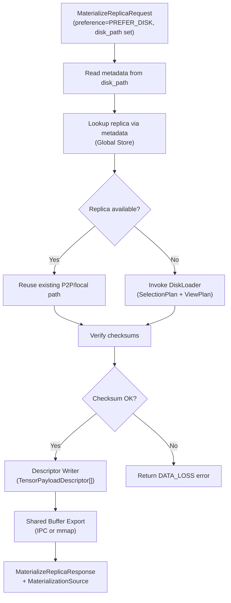
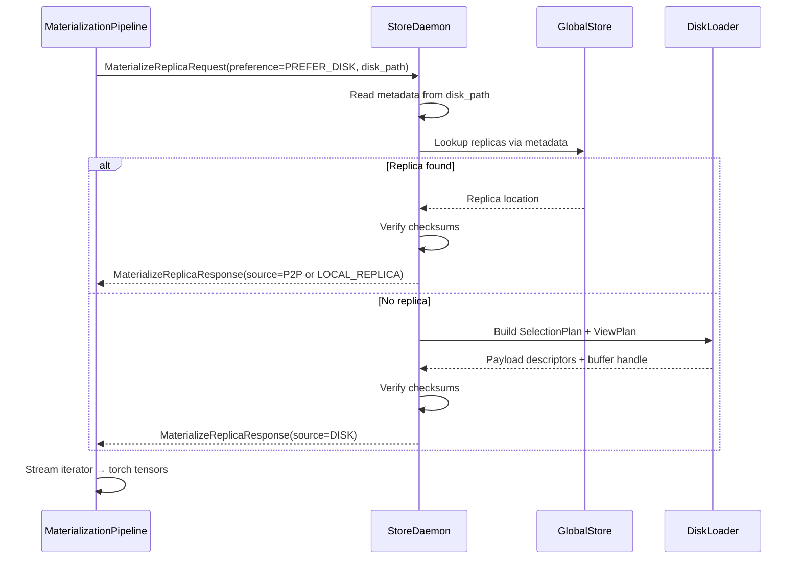

# Summary

All disk materialization flows must traverse the Store daemon so that descriptor streaming, view slicing, metrics, and retries are identical to P2P paths. Today, whenever callers set `FallbackOptions.prefer_disk` or provide `disk_path`, the Python SDK bypasses the daemon, calls `_materialize_from_disk()`, and eagerly reconstructs a CPU `state_dict` via `load_dict_from_disk()`. This bypass undermines telemetry, selective tensor hydration, and iterator reuse. This design replaces the bypass with daemon-backed RPCs and confines `load_dict_from_disk()` to tests only. We assume daemon availability; if the daemon fails to read disk, the SDK simply reports the daemon error without retrying locally.

# Goals / Non-Goals

## Goals
1. Extend the existing v1 `MaterializeReplicaRequest` with a `SourcePreference` enum field; reuse the existing `disk_path` field for disk hints without introducing new hint messages.
2. Update the daemon to respect `SourcePreference`: when set to `PREFER_DISK`, daemon reads canonical metadata from `disk_path`, performs checksum verification (always enabled), and chooses the optimal source (existing replica, remote peer, or local disk).
3. Replace `_materialize_from_disk()` with a daemon RPC call inside `MaterializationPipeline`, ensuring `get()`, `get_into()`, `artifact.tensor_dict()`, and `tc.from_disk()` all share the iterator contract.
4. Preserve observability (traces, metrics, structured logs) by running every disk load through the existing spans and counters while recording the actual source selected by the daemon.
5. Restrict `tensorcast.api._io_disk.load_dict_from_disk()` to test helpers only; production code never calls it directly.
6. Assume single-version deployments (SDK, daemon, and proto are released together), so no backward-compatibility shims are required in this change.

## Non-Goals
- Offline disk loading without a daemon (legacy helper remains available for tests only).
- Redesigning the canonical index format or ArtifactCache semantics.
- Making checksum verification optional (always enabled for daemon-backed disk loads).
- Resolving filesystem-namespace differences between SDK hosts and the daemon (assume shared namespace for now).

# Current State

- `_perform_get_with_retry()` diverts to `_materialize_from_disk()` whenever disk fallback is requested, never touching the daemon path.

```560:607:tensorcast/api/store/materialization.py
        if fallback_opts.prefer_disk or fallback_opts.disk_path or not fallback_opts.allow_p2p:
            ...
            result = self._materialize_from_disk(...)
            return result
```

- `_materialize_from_disk()` calls `load_dict_from_disk()` and eagerly builds a `MaterializedArtifact`, so it cannot stream descriptors or respect `tensor_names`.

```666:703:tensorcast/api/store/materialization.py
        state_dict = load_dict_from_disk(raw_path, device_id=device_id)
        return MaterializedArtifact(...)
```

- The `MaterializeReplicaRequest` already has `disk_path` (field 10), but the SDK never populates it for daemon-routed flows; `DiskLoader` is invoked only by legacy code paths.

# Architecture & Interfaces

## RPC Surface Changes

- `MaterializeReplicaRequest` (v1) gains:
  - `SourcePreference preference` enum with values `{UNSPECIFIED, AUTO, PREFER_P2P, PREFER_DISK}` (defaults to `AUTO` when unset). This is a hint—not a hard requirement. When `preference=PREFER_DISK`, the daemon should still prefer faster replicas if they exist and are healthy, falling back to disk only when other sources are unavailable.
  - No new `DiskFallbackHint` message is needed. The existing `disk_path` field (tag 10) carries the on-disk path. All necessary metadata (`canonical_index`, `descriptor`, checksums) are derived by the daemon from `disk_path` contents. Checksum verification is always performed; no separate flag required.
- `MaterializeReplicaResponse` gains a `MaterializationSource source` enum field indicating the actual source selected so metrics/logs capture real behavior.

### Proto Additions

```protobuf
// Source preference hint for materialization requests.
enum SourcePreference {
  SOURCE_PREFERENCE_UNSPECIFIED = 0; // Equivalent to AUTO
  SOURCE_PREFERENCE_AUTO = 1;        // Daemon picks optimal source
  SOURCE_PREFERENCE_PREFER_P2P = 2;  // Prefer P2P/existing replicas
  SOURCE_PREFERENCE_PREFER_DISK = 3; // Prefer disk when disk_path is set
}

// Actual source used for materialization (response field).
enum MaterializationSource {
  MATERIALIZATION_SOURCE_UNSPECIFIED = 0;
  MATERIALIZATION_SOURCE_DISK = 1;
  MATERIALIZATION_SOURCE_P2P = 2;
  MATERIALIZATION_SOURCE_LOCAL_REPLICA = 3;
}

message MaterializeReplicaRequest {
  // ... existing fields ...
  SourcePreference preference = 11;
}

message MaterializeReplicaResponse {
  // ... existing fields ...
  MaterializationSource source = 4;
  optional string artifact_id = 5; // Canonical artifact identifier resolved by daemon
}

// Parity for key-based materialization responses.
message MaterializeByKeyResponse {
  // ... existing fields ...
  MaterializationSource source = 5;
}
```

The daemon also echoes the canonical `artifact_id` on `MaterializeReplicaResponse` so SDK callers that only provide a `disk_path` can fetch canonical indices without re-parsing local metadata.

### Relationship to Existing Fields

| Existing Field | Role After Change |
|----------------|-------------------|
| `disk_path` (tag 10) | Carries on-disk path for disk loads; unchanged semantics |
| `target_device_type` | Specifies target memory type (CPU/GPU); orthogonal to `SourcePreference` |
| `DeviceType.DEVICE_TYPE_DISK` | Retained for compatibility; `SourcePreference` is the new hint mechanism |

### Naming Compliance
| Symbol | Kind | Compliance |
|--------|------|------------|
| `SourcePreference` | Proto enum | PascalCase ✓ |
| `MaterializationSource` | Proto enum (response field) | PascalCase ✓ |

### Disk Metadata Handling

When `disk_path` is set and `preference=PREFER_DISK`, the daemon performs:

1. **Metadata extraction**: Reads `tensor_index.json` and `artifact_descriptor.json` from `disk_path` to identify the artifact.
2. **Replica lookup**: Queries Global Store using extracted metadata. If an existing replica is available and healthy, the daemon may satisfy the request via P2P/local-replica path.
3. **Disk fallback**: If no replica is available, invokes `DiskLoader` to stream payloads from disk.
4. **Checksum verification**: Always performed. If checksums mismatch, daemon returns `DATA_LOSS` error.
5. **Source reporting**: Sets `MaterializationSource` on response so SDK can log/metric the actual path.

Metadata consistency is enforced by the daemon. If the disk directory contents have changed since the artifact was first registered (e.g., files rewritten), the daemon detects the mismatch via checksum verification and returns a `DATA_LOSS` or `FAILED_PRECONDITION` error. The SDK propagates this error without local retry.

## Daemon Materialization Flow



- When `preference=PREFER_DISK` and `disk_path` is set, the daemon:
  1. Reads `tensor_index.json` and `artifact_descriptor.json` from `disk_path` to extract canonical metadata.
  2. Queries Global Store for an existing replica matching the artifact. If one exists and is healthy, the daemon serves the request from that replica, setting `source=MATERIALIZATION_SOURCE_P2P` or `MATERIALIZATION_SOURCE_LOCAL_REPLICA`.
  3. If no replica is available, invokes `DiskLoader`, `FilePartitionSource`, and `ViewPlanSource` to stream payload descriptors, setting `source=MATERIALIZATION_SOURCE_DISK`.
  4. Performs checksum verification (always enabled). On mismatch, returns `DATA_LOSS` error.
  5. Emits `MaterializeReplicaResponse` with `source` field so clients know the actual data path.

### Disk Path Whitelist Enforcement
- The daemon loads a `disk_path_whitelist` (flag or config entry) consisting of absolute path prefixes.
- Every incoming `disk_path` is canonicalized (e.g., `realpath`) and must begin with one of the configured prefixes.
- A non-empty whitelist restricts disk access strictly to those prefixes. An empty whitelist explicitly grants full access (legacy behavior) and should only be used in trusted environments.
- Violations are rejected with `INVALID_ARGUMENT`, and the daemon emits structured logs plus counters (e.g., `store.materialization.denied_disk_path`) so operators can detect misconfiguration quickly.
- The SDK surfaces the daemon error directly; it never retries locally, ensuring whitelist mistakes are corrected rather than bypassed.
- Configuration surface: `engine.disk_path_whitelist` in `DaemonConfig` (YAML/JSON) maps directly into the daemon service options.

## SDK Changes

1. **MaterializationPipeline**
   - Remove `_materialize_from_disk()` and its direct `load_dict_from_disk()` calls.
   - When disk fallback is requested (`FallbackOptions.prefer_disk=True` or `disk_path` set), build the same `MaterializeReplicaRequest` as P2P flows, set `preference=PREFER_DISK`, and populate the existing `disk_path` field.
   - When a disk path is resolved from a key, strip the key before invoking `materialize_artifact` so the daemon receives a single identifier (avoids artifact_id+key rejection).
   - Extend `MaterializedArtifact` with a `source` field and plumb the daemon's `MaterializationSource` through `_materialize_fn` so higher layers know the actual data path.
   - Always receive a `MaterializationPayload` iterator; legacy `load_dict_from_disk()` remains only under `tensorcast/api/_io_disk.py` for tests.

2. **FallbackOptions**
   - `FallbackOptions` retains existing fields (`disk_path`, `prefer_disk`, `allow_p2p`). The `verify_checksums` field becomes a no-op since daemon always verifies; it may be deprecated in a future release.
   - `FallbackResolver` forwards `disk_path` to the daemon via the RPC `disk_path` field and does not perform local metadata extraction or policy checks.

3. **Artifact & Store Runtime**
   - `tc.from_disk()` sets `preference=PREFER_DISK` and populates `disk_path`, then delegates to the unified pipeline. All metadata extraction, verification, and source selection happen daemon-side.
   - `Artifact` stores `_disk_path_hint` purely for logging/metrics. Actual data transfer depends on the daemon's selected source.

4. **Observability**
   - Existing spans (`Client/MaterializeArtifact`) stay intact; new attributes are derived from the daemon's `MaterializationSource` response. For example, `_perform_get_with_retry()` sets `tc.store.source` based on the response and `tc.store.disk_path_present` based on whether `disk_path` was provided.
   - Metrics differentiate source types using the daemon-reported dimension (`store_metrics.materialization_latency_ms{source="disk"|"p2p"|"local_replica"}`) and structured logs include `tc.store.source` so dashboards reflect real behavior instead of caller intent.

## Sequence Overview



The SDK sends a simple RPC with `disk_path` and `preference`; all metadata extraction, replica lookup, checksum verification, and source selection happen daemon-side. The daemon reports the actual source via `MaterializationSource` so the SDK can log and metric real behavior.

# Invariants & Error Model

- All tensor payload transfers originate from the daemon; the SDK never reads disk directly for materialization.
- All metadata extraction and checksum verification happen daemon-side.
- `load_dict_from_disk()` is only callable from tests; production modules import it solely under `if TYPE_CHECKING` or test harnesses.
- If the daemon reports an error (`NOT_FOUND`, `DATA_LOSS`, `FAILED_PRECONDITION`, etc.), the SDK propagates the error without attempting local fallback.
- When `fallback.allow_p2p=False`, the SDK rejects materializations served from P2P or reused replicas even if the daemon attempted a fallback after a disk error.
- `MaterializeReplicaResponse.source` reflects the true path (disk, existing replica, remote peer); telemetry uses this field rather than inferring from request preferences.
- `SourcePreference` is honored end-to-end: `PREFER_DISK` attempts disk first (then P2P only if an artifact_id is available), `PREFER_P2P` requires a canonical artifact_id and keeps P2P-first ordering, and AUTO preserves existing behavior.

## Error Code Mapping

| Daemon gRPC Status | Condition | SDK Behavior |
|--------------------|-----------|--------------|
| `NOT_FOUND` | `disk_path` does not exist or artifact not found | Propagate as `ArtifactError`, retryable=false |
| `DATA_LOSS` | Checksum verification failed | Propagate as `ArtifactError`, retryable=false |
| `FAILED_PRECONDITION` | Metadata inconsistent or malformed | Propagate as `ArtifactError`, retryable=false |
| `UNAVAILABLE` | Daemon temporarily unavailable | Propagate as `ArtifactError`, retryable=true |

# Trade-offs & Risks

| Risk | Mitigation |
|------|------------|
| **Higher latency when daemon and disk share a node** | Reuse existing `DiskLoader` zero-copy mmap path and enable selective tensor lists to limit IO. |
| **Daemon regression affects disk-only workflows** | Add dedicated Bazel tests plus Python integration tests to cover disk preference paths. |
| **Temporary lack of offline loader** | Keep `tensorcast.api._io_disk.load_dict_from_disk()` for regression tests; document that production flows require a daemon. |
| **Increased daemon responsibilities** | Disk flows already existed in C++; this change simply exposes them through the unified RPC path. |
| **disk_path whitelist misconfiguration** | Provide counters/logs for denied paths and document that an empty whitelist restores full access. |
| **SDK/daemon version mismatch** | Out of scope: single-version deployments mean all components update together. |

# Compatibility & Acceptance Criteria

1. **Proto parity**: `buf lint` + Bazel proto tests pass with the new `SourcePreference` and `MaterializationSource` fields; no backward-compatibility layer is required because all components roll forward together.
2. **Daemon tests**: `bazel test //daemon:materialization_v2_test //daemon:disk_loader_materialization_test --define=use_fake_cuda=true`.
3. **Python tests**:
   - `uv run pytest tests/python/api/test_disk_materialization_v2.py`
   - `uv run pytest tests/python/test_streaming_save.py`
4. **Observability**: Trace fixtures confirm `tc.store.source` attribute reflects daemon-reported source and per-source latency metrics are populated.
5. **Code cleanup**: No production module imports `load_dict_from_disk`; `git grep` only finds it inside tests.
6. **Docs updated**: `0036-0x` series references daemon-only disk flows; README/AGENTS reflect the new invariant.

## Test Scenarios

| Scenario | Expected Behavior |
|----------|-------------------|
| `disk_path` valid, replica exists | Daemon returns `source=P2P` or `LOCAL_REPLICA` |
| `disk_path` valid, no replica | Daemon returns `source=DISK` |
| `disk_path` invalid or missing | Daemon returns `NOT_FOUND` |
| `disk_path` valid, checksum mismatch | Daemon returns `DATA_LOSS` |
| `preference=PREFER_DISK` without `disk_path` | Daemon uses default source selection (AUTO) |
| `disk_path` outside whitelist prefixes | Daemon returns `INVALID_ARGUMENT` and emits denial metrics/logs |
| Whitelist configured as empty | Daemon accepts all disk paths (still verifying metadata and checksums) |

# References

- `tensorcast/api/store/materialization.py`
- `tensorcast/api/store/runtime.py`
- `tensorcast/api/store/__init__.py`
- `tensorcast/api/_io_disk.py`
- `daemon/materialization/dataplane/loaders/disk_loader.h`
- `proto/tensorcast/daemon/v1/store_daemon.proto`
