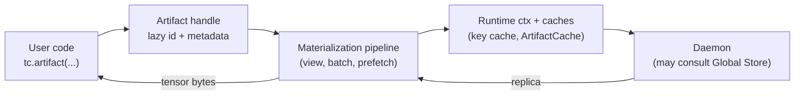

# Summary

Define a single, artifact-first Python SDK surface that is easy to learn, consistent, and free of redundant entry points. The SDK assumes one daemon per process and exposes functional helpers plus a single **retrieval** handle type (`Artifact`). Retrieval flows are handle-driven; legacy eager verbs (`get`, `get_into`, `get_view`, etc.) will be removed after the migration in favor of `artifact(...).tensor_*`. Ingestion remains explicit via `register`/`put` and view registration. For client-owned inplace binding (vLLM-style meta-init and weight swap), the SDK additionally exposes `DeferredLoader` and `InplaceSlot` via `Artifact.deferred_loader(...)`. Region-backed flows stay available but clearly separated as lifecycle utilities.

Update (2026-02-03): the preferred inplace-update surface is now `Binding` (`Artifact.bind` / `bind_into`); `DeferredLoader`/`InplaceSlot` remain available for advanced workflows. See `docs/designs/0063-binding-first-inplace-updates.md`.

# Goals / Non-Goals

Goals
- One-concept-per-interface: each user goal maps to exactly one public function or method.
- Artifact-first retrieval: all fetch, view, batch, async, and prefetch flows hang off `Artifact`.
- Minimal, user-friendly parameters: hide internal knobs; keep enums small and intention-based.
- Default “just works”: per-process daemon launch via `tc.init(mode="create")`, lazy resolution, P2P-by-default retrieval with safe fallbacks.
- Clean slate: remove redundant/legacy verbs once the new surface ships (no compatibility constraints).

Non-Goals
- Changing daemon/Global Store RPC schemas or wire formats (reuse existing v2 flows).
- Altering C++ core, UMA, or transport internals.
- Adding new persistence schemas (no `schema.sql` changes).

# Architecture & Interfaces

## Top-Level API (functional)

- `tc.init(mode="connect", address="local")`  
- `tc.init(mode="create", daemon_config_path=None, show_daemon_logs=True, install_signal_handlers=False, fate_share_sigterm=False)`  
  Connects to an existing daemon (`connect`) or launches a new per-process daemon (`create`); sets the global daemon address used by the process Store.  
  **Default config:** if no config path is provided, the SDK uses the discovered config (env or `examples/config/store_daemon_config.yaml` when available); if none is found, initialization fails with a config error.
- `tc.shutdown()`, `tc.is_initialized()`.
- `tc.artifact(key=None, artifact_id=None, disk_path=None, fallback=None) -> Artifact`  
  Lazy handle factory; no data transfer; resolves key/disk lazily on first touch. `artifact_async(...)` mirrors it.
- `tc.from_disk(path, *, fallback=None) -> Artifact`  
  Convenience wrapper for `disk_path=...`.
- Ingestion:
  - `tc.register(tensors, *, key=None, artifact_id=None, options=None, ttl_ms=None)` / `register_async(...)`.
  - `tc.put(tensors, *, key=None, artifact_id=None, options=None, device=None)` / `put_async(...)`.
  - `tc.register_view(tensors, *, key=None, artifact_id=None, slices=None, transpose=None, view_id=None, placement=None, ttl_ms=None, options=None, canonical_index_bytes=None, registration_kind=None)`.
  - `tc.register_piece(tensors, *, assembly_id, key=None, slices=None, canonical_index_bytes=None, placement=None, ttl_ms=None, options=None)`.
- Region & lifecycle (advanced):
  - `tc.register_vram_region(device_id, base_ptr, size_bytes, ttl_ms, name=None) -> VramRegionHandle`.
  - `tc.unregister_vram_region(region_id, *, force=None) -> bool`.
  - `tc.deregister_artifact(artifact_id, *, wait=True, drain_timeout_s=None, extend_ttl_ms=None, device_id=None, keep_shared_disk_copy=False) -> DeregisterArtifactOutcome`.
  - `tc.seal_assembly(assembly_id, *, publish_canonical=True, timeout_s=120.0)`.

Removed after migration: module-level `get`, `get_into`, `get_view`, `get_view_into` (sync/async); `store()` remains for advanced callers but is not required for common flows.

## Artifact Handle (single retrieval surface)

- Identity & metadata: `.artifact_id`, `.key`, `.tensor_names`, `.tensor_meta(name)`, `.describe()`, `.exists()`, `.is_valid`, `.release()`.
- Materialization (sync): `.tensor_dict(device, names=None)`, `.tensor(name, device)`, `.tensor_dict_into(target, device=None)`.
- Symmetry convenience: `.tensor_into(name, target_tensor, device=None)` streams a single tensor directly into the provided buffer without requiring placeholders for every tensor in the artifact.
- Materialization (async): `.tensor_async(name, device)`, `.tensor_dict_async(device, names=None)`.
- Views/composition: `.view(slices=None, transpose=None, names=None)`, `.subset(names)`, `.slice({...})`, `.view_builder()`.
- Performance helpers: `.batch(device=...) -> BatchContext`, `.prefetch(device=..., ctx=None) -> Operation[PrefetchedReplica]` for daemon-owned cache warm with unified `status/wait/cancel` semantics.
- Deferred inplace binding: `.deferred_loader(device=..., packing="byte_space" | "append" | "plan", capacity_bytes=None) -> DeferredLoader` returns CUDA placeholders backed by a client-owned arena; `.commit() -> InplaceSlot` performs a single region-backed materialization into the arena. `InplaceSlot.swap(artifact_or_ref, ...)` safely retires any published replica (if present) before overwrite and can optionally `publish_replica()` after refill. Swap always preserves the slot’s tensor storage pointers and reuses the slot’s selection (including any `.view(...)` slices) so callers do not need to restate slices on every swap.
- Policy override: `.with_fallback(FallbackOptions(...))`.
- Serialization (process-local): `.to_dict()`, `.from_dict(data, store)`.

All retrieval flows pass through `MaterializationPipeline` with canonical index caching (`ArtifactCache`) and optional view metadata caching.

## Region-Backed Layout Reuse (no KV-only helper)

- Region registration (`register_vram_region` / `unregister_vram_region`) remains the single mechanism for reusing GPU slabs across multiple artifacts, regardless of payload type (KV blocks, rolling weights, activations).
- Standard `register`/`put` automatically detect registered regions and emit region-backed leases; there is no KV-specific helper. Users publish multiple artifacts (e.g., weight v1/v2 on the same base_ptr) by calling `register` with different `artifact_id`/`key`; the runtime maps storages to regions and avoids duplicate handle exports.
- For repeated updates of the same layout, callers should choose stable `artifact_id`/`key` conventions (e.g., `model:latest`, `model:v2`, `cgid:...`) and rely on region reuse rather than special-purpose APIs.

## Options and Enums (user-friendly)

- `FallbackOptions`: `prefer` = `"auto" | "local" | "p2p" | "disk"` (default `"auto"`); `disk_path`; `allow_p2p` (default `True`); `verify_checksums` (default `True`); `replica_uuid` (prefetch reuse). Helpers: `for_disk(path, verify=True)`, `local_only()`. Accept string shortcuts at the surface (e.g., `fallback="disk:/tmp/foo"` → `for_disk`).
- `PlanType`: user-facing strings `plan="lease" | "copy"` (default `lease`), coerced internally to `PlanType.VRAM_LEASED` / `PlanType.VRAM_COALESCED`; enum remains for power users.
- `RegisterArtifactOptions`: public-facing fields `plan`, `lease_in_place`, `max_inflight_bytes`, `release_on_tensor_commit`; accept string `plan` and map to enum internally; keep advanced knobs optional.
- `GetArtifactOptions`: execution-only options such as `wait_for_completion` (default `True`), `enable_verification` (default `True`), and `transport_hold_ms` (advanced). Source selection belongs to `FallbackOptions`.
- Devices: accept `str | torch.device`; retrieval defaults to the current CUDA device if available (otherwise require explicit CPU with disk fallback). For `put`, CUDA inputs target their device unless `device` is provided (must match); CPU inputs are not supported yet.

## Behavioral Notes

- Lazy resolution: `artifact()` creates a handle; first access may resolve key→artifact_id via daemon (and GS behind it) and hydrate canonical index into `ArtifactCache`. No tensor bytes move until `tensor*`/`tensor_dict*`.
- Lazy views: chaining `.view().slice().transpose()` builds view specs only; no RPCs or data transfer occur until `.tensor*`/`.tensor_dict*`/`.exists()`.
- Single-process Store: all functional helpers delegate to the process Store (singleton); initialization flows through `StoreRuntimeContext` with `get_daemon_client`.
- View composition: uses `ViewSpecComposer` and `ViewMetadataCache`; derived handles keep parent hints and share caches.
- Prefetch: returns an `Operation[PrefetchedReplica]` with daemon-side operation tracking and operation-scoped wait/cancel. The on-wire `replica_uuid` is treated as an operation id (not replica identity).
- Region-backed registration: unchanged semantics per [region-backed](../architecture/api/region-backed.md); clearly scoped as an advanced lifecycle path.
- Error surfaces: constructing an `Artifact` handle never raises `NOT_FOUND`; `ArtifactError` is raised on materialization (`tensor*`, `tensor_dict*`, `tensor_dict_into`, `tensor_into`) or explicit checks (`exists()`) when identity/metadata resolution fails.

## Naming Compliance (Python)

- Public functions/methods use `snake_case`; classes use `PascalCase`; constants use `ALL_CAPS`, matching repo Python standards.
- No relative imports in user-facing examples; absolute imports (`import tensorcast as tc`) remain canonical.

## Flow Diagram

# Schema Changes

None. No persistent schema or proto schema changes are required; reuse existing materialization and registration RPCs.

# Trade-offs & Risks

- Removing `get`/`get_into` means users must adopt `Artifact` flows; mitigated by clearer, smaller surface and improved composability.
- Lazy resolution can surprise users expecting pure local construction; mitigate by documenting `.exists()` / `.describe()` as explicit lightweight checks.
- Coercing string enums improves ergonomics but risks typos; mitigate with validation and clear `ArtifactError` messages.

# Compatibility & Acceptance Criteria

- No backward-compatibility promise (project not yet GA); redundant verbs removed from public surface once this design is implemented.
- Acceptance:
  - Functional API limited to the set above; retrieval only via `Artifact` methods.
  - `tc.init(mode="create")` defaults to launch-per-process; docs updated accordingly.
  - Options enforce small, intention-based enums with validation and clear errors.
  - All public docs/README/AGENTS updated to reflect the new surface; legacy examples removed.
  - Tests cover handle flows (sync/async), views, deferred loaders + inplace slots (commit/swap/publish/retire), batch, prefetch, region lifecycle, and init/shutdown paths.

# References

- [api-design](../architecture/api/api-design.md)
- [artifact-views-and-retrieval](../architecture/artifact-views-and-retrieval.md)
- [region-backed](../architecture/api/region-backed.md)
- [materialization-flow](../architecture/api/materialization-flow.md)
- [api-design](../architecture/api/api-design.md)
- 0037-store-py-refactor.md
- 0061-slot-based-inplace-binding-and-swap.md
- `tensorcast/api/store/__init__.py`, `tensorcast/api/store/artifact.py`, `tensorcast/startup.py`
