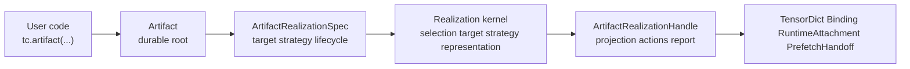

# Summary

Define the single public SDK entrance for TensorCast: `Artifact`.

The SDK should be easy to learn, consistent, and free of redundant data-movement
entry points. Functional helpers exist only to initialize the process, locate or
create artifact subjects, and return an `Artifact` handle. All reads, writes
into caller targets, binding realization, retained prefetch, model-runtime
attachment, publication, and TP target-set startup hang off that artifact root.

The target SDK is realization-first under the artifact root. TensorDict reads,
caller-owned tensor writes, binding, retained prefetch, runtime attachment,
publication, and TP target-set startup are all expressed as artifact
realization. Legacy eager verbs (`get`, `get_into`, `get_view`, etc.) are
removed rather than preserved as parallel public concepts. Ingestion remains
explicit via `register`/`put` and view registration, but those APIs also return
artifact handles. Region-backed flows stay available as target/lifecycle
utilities under the realization kernel rather than as a separate public data
path.

# Target-State Alignment With `0120` / `0121`

This design owns the public SDK entrance. `0120` owns the artifact-centered
runtime vocabulary, and `0121` owns the shared realization kernel behind the
entrance.

The target model is deeper than a retrieval-only handle. `Artifact` is the
public root, while `0120` and `0121` define artifact realization as the shared
path for TensorDict reads, caller-owned tensor writes, binding, prefetch,
runtime attachment, publication, and TP target sets.

The long-term interpretation of this document is:

- `artifact(...).tensor_*` methods may remain convenience APIs, but they must
  lower to `Artifact.realize(...)` rather than own materialization logic;
- source-selection, fallback, verification, retry, and locality choices become
  realization strategy policy, not public handle identity and not a
  TensorDict-only option plane;
- `Binding` remains a local realization projection, not a second artifact root;
- disk paths and mounted sources must resolve into artifact subjects or source
  artifact profiles before realization; they are not retrieval identity;
- region-backed flows remain target/lifecycle utilities under the realization
  kernel.

# Goals / Non-Goals

Goals
- One-concept-per-interface: each user goal maps to exactly one public function
  or method family.
- One external root: the object users keep, pass around, serialize
  process-locally, realize, bind, prefetch, attach, or publish from is
  `Artifact`.
- Artifact-first realization: all fetch, view, batch, async, prefetch, binding,
  runtime attachment, publication, and TP target-set flows hang off `Artifact`
  or an `ArtifactRealizationHandle`.
- Minimal, user-friendly parameters: hide internal knobs; keep enums small and intention-based.
- Default "just works": per-process daemon launch via `tc.init(mode="create")`,
  lazy resolution, and realization strategy defaults that prefer fast local/P2P
  sources while making fallback explicit.
- Clean slate: remove redundant/legacy verbs once the new surface ships (no compatibility constraints).
- No path-as-identity shortcuts: filesystem paths are import/source inputs that
  produce artifact subjects, never retrieval fallback handles.

Non-Goals
- Prescribing exact daemon/Global Store RPC schema changes. `0121` owns any
  daemon-mediated API changes needed to remove SDK direct Global Store access.
- Altering C++ core, UMA, or transport internals.
- Adding new persistence schemas (no `schema.sql` changes).

# Architecture & Interfaces

## Top-Level API (functional)

- `tc.init(mode="connect", address="local")`  
- `tc.init(mode="create", daemon_config_path=None, show_daemon_logs=True, install_signal_handlers=False, fate_share_sigterm=False)`  
  Connects to an existing daemon (`connect`) or launches a new per-process daemon (`create`); sets the global daemon address used by the process Store.  
  **Default config:** if no config path is provided, the SDK uses the discovered config (env or `examples/config/store_daemon_config.yaml` when available); if none is found, initialization fails with a config error.
- `tc.shutdown()`, `tc.is_initialized()`.
- `tc.artifact(key=None, artifact_id=None) -> Artifact`
  Lazy durable handle factory; no data transfer. It resolves key to artifact id
  on first realization or explicit metadata check. `artifact_async(...)` mirrors
  it if async construction remains useful.
- `tc.from_disk(path, *, key=None, artifact_id=None, source_profile=None, trust=None) -> Artifact`
  Explicit source/import entrance. It resolves or creates an artifact subject
  for a disk or mounted source and returns an `Artifact`. It must not create a
  path-backed retrieval identity or fallback policy.
- Ingestion:
  - `tc.register(tensors, *, key=None, artifact_id=None, options=None, ttl_ms=None)` / `register_async(...)`.
  - `tc.put(tensors, *, key=None, artifact_id=None, options=None, device=None)` / `put_async(...)`.
  - `tc.register_view(tensors, *, key=None, artifact_id=None, slices=None, transpose=None, view_id=None, placement=None, ttl_ms=None, options=None, canonical_index_bytes=None, registration_kind=None)`.
  - `tc.register_piece(tensors, *, assembly_id, key=None, slices=None, canonical_index_bytes=None, placement=None, ttl_ms=None, options=None)`.
- Region & lifecycle (advanced):
  - `tc.register_vram_region(device_id, base_ptr, size_bytes, ttl_ms, name=None) -> VramRegionHandle`.
  - `tc.unregister_vram_region(region_id, *, force=None) -> bool`.
  - `tc.deregister_artifact(artifact_id, *, wait=True, drain_timeout_s=None, extend_ttl_ms=None, device_id=None, keep_shared_disk_copy=False) -> DeregisterArtifactOutcome`.
  - `tc.seal_assembly(assembly_id, *, publish_canonical=True, timeout_s=120.0)`.

Removed after migration: module-level `get`, `get_into`, `get_view`,
`get_view_into` (sync/async), public `FallbackOptions`, `fallback=...`
parameters, and `artifact(disk_path=...)`. `store()` remains for advanced
callers but is not required for common flows.

## Artifact Handle (single realization surface)

- Identity & metadata: `.artifact_id`, `.key`, `.tensor_names`, `.tensor_meta(name)`, `.describe()`, `.exists()`, `.is_valid`, `.release()`.
- Realization: `.realize(spec=ArtifactRealizationSpec(...), ctx=None) -> ArtifactRealizationHandle`.
- TensorDict convenience: `.tensor_dict(device, names=None)`, `.tensor(name, device)`,
  `.tensor_dict_into(target, device=None)`, and `.tensor_into(...)` lower to
  TensorDict or caller-tensor realization targets.
- Async convenience: `.tensor_async(...)` and `.tensor_dict_async(...)` lower to
  async realization handles or futures.
- Views/composition: `.view(slices=None, transpose=None, names=None)`, `.subset(names)`, `.slice({...})`, `.view_builder()`.
- Performance helpers: `.batch(device=...)` and `.prefetch(...)` lower to
  realization strategy and lifecycle policies.
- Binding convenience: `.bind(...)` and `.bind_into(...)` lower to binding
  target realization and return the binding projection from the realization
  handle.
- Model runtime: runtime-specific helpers should build
  `ArtifactRealizationSpec.model_runtime(...)` and attach through
  `ArtifactRealizationHandle.attach(adapter=...)`.
- Policy override: `.with_options(...)` or realization spec fields express
  source policy, strategy, fallback, retention, and diagnostics. These policies
  must not remain TensorDict-only retrieval options and must not be serialized
  as artifact identity.
- Serialization (process-local): `.to_dict()`, `.from_dict(data, store)`.

All realization flows pass through the `0121` realization kernel, including
canonical selection resolution, target planning, strategy planning,
representation admission, lifecycle planning, execution lowering, and report
generation. Legacy `MaterializationPipeline` code may remain temporarily as an
internal lowering, but it must not own public SDK concepts, fallback semantics,
selection identity, lifecycle policy, or diagnostics shape.

## Region-Backed Layout Reuse (no KV-only helper)

- Region registration (`register_vram_region` / `unregister_vram_region`) remains the single mechanism for reusing GPU slabs across multiple artifacts, regardless of payload type (KV blocks, rolling weights, activations).
- Standard `register`/`put` automatically detect registered regions and emit region-backed leases; there is no KV-specific helper. Users publish multiple artifacts (e.g., weight v1/v2 on the same base_ptr) by calling `register` with different `artifact_id`/`key`; the runtime maps storages to regions and avoids duplicate handle exports.
- For repeated updates of the same layout, callers should choose stable `artifact_id`/`key` conventions (e.g., `model:latest`, `model:v2`, `cgid:...`) and rely on region reuse rather than special-purpose APIs.

## Options and Strategy (user-friendly)

- Source and fallback policy are realization strategy fields. Public
  target-state APIs express intent through `ArtifactRealizationSpec`; legacy
  options may exist only as temporary internal adapters during migration.
- `PlanType`: user-facing strings `plan="lease" | "copy"` (default `lease`), coerced internally to `PlanType.VRAM_LEASED` / `PlanType.VRAM_COALESCED`; enum remains for power users.
- `RegisterArtifactOptions`: public-facing fields `plan`, `lease_in_place`, `max_inflight_bytes`, `release_on_tensor_commit`; accept string `plan` and map to enum internally; keep advanced knobs optional.
- `ArtifactRealizationSpec`: target-state owner for target kind, source policy,
  verification, retention, deadline, report level, and runtime profile.
- Devices: accept `str | torch.device`; realization targets choose their device
  explicitly or by documented defaults. For `put`, CUDA inputs target their
  device unless `device` is provided (must match); CPU inputs are not supported
  yet.

## Behavioral Notes

- Lazy resolution: `artifact()` creates a durable handle; first realization or metadata
  check may resolve key to artifact id via daemon and hydrate canonical index
  into `ArtifactCache`. No tensor bytes move until `realize(...)` or a
  convenience method that lowers to it.
- Disk/source entrance: `from_disk(...)` performs source/import resolution into
  an artifact subject or source artifact profile. After that point the user
  still holds an `Artifact`, and all data movement uses the same realization
  path as key/artifact-id handles.
- Lazy views: chaining `.view().slice().transpose()` builds view specs only; no
  data transfer occurs until realization or explicit checks.
- Single-process Store: all functional helpers delegate to the process Store (singleton); initialization flows through `StoreRuntimeContext` with `get_daemon_client`.
- View composition: uses `ViewSpecComposer` and `ViewMetadataCache`; derived handles keep parent hints and share caches.
- Prefetch: lowers to realization lifecycle policy. Ordinary replica prefetch
  and retained runtime prefetch share the same realization kernel and differ by
  target/lifecycle configuration.
- Region-backed registration: unchanged semantics per [region-backed](../architecture/api/region-backed.md); clearly scoped as an advanced lifecycle path.
- Error surfaces: constructing an `Artifact` handle never raises `NOT_FOUND`;
  `ArtifactError` is raised on realization, convenience methods, or explicit
  checks (`exists()`, `describe()`) when identity/metadata resolution fails.

## Naming Compliance (Python)

- Public functions/methods use `snake_case`; classes use `PascalCase`; constants use `ALL_CAPS`, matching repo Python standards.
- No relative imports in user-facing examples; absolute imports (`import tensorcast as tc`) remain canonical.

## Flow Diagram

# Schema Changes

No persistent schema change is required by this SDK design. Proto or daemon API
changes may still be introduced by `0121` when needed to make SDK artifact
metadata, layout provisioning, publication, and realization authority fully
daemon-mediated.

# Trade-offs & Risks

- Removing `get`/`get_into` means users must adopt `Artifact` flows; mitigated by clearer, smaller surface and improved composability.
- Lazy resolution can surprise users expecting pure local construction; mitigate by documenting `.exists()` / `.describe()` as explicit lightweight checks.
- Coercing string enums improves ergonomics but risks typos; mitigate with validation and clear `ArtifactError` messages.

# Compatibility & Acceptance Criteria

- No backward-compatibility promise (project not yet GA); redundant verbs removed from public surface once this design is implemented.
- Acceptance:
  - Functional API limited to the set above; data movement only via `Artifact`
    methods or `ArtifactRealizationHandle` projections/actions.
  - All external artifact entry paths (`artifact`, `from_disk`, `register`,
    `put`, views, and pieces) return or produce an `Artifact`; none produce a
    separate retrieval, serving, binding, or disk-path root.
  - TensorDict, caller-owned tensor writes, binding, prefetch, runtime attach,
    publication, and TP target sets lower through the same realization kernel.
  - No public fallback/path-based retrieval identity remains; source policy is
    execution-scoped realization strategy.
  - `tc.init(mode="create")` defaults to launch-per-process; docs updated accordingly.
  - Options enforce small, intention-based enums with validation and clear errors.
  - All public docs/README/AGENTS updated to reflect the new surface; legacy examples removed.
  - Tests cover handle flows (sync/async), views, TensorDict projections,
    caller-tensor targets, bindings and mapped bindings, retained prefetch,
    runtime attachment, TP target sets, region lifecycle, and init/shutdown
    paths.

# References

- [api-design](../architecture/api/api-design.md)
- [artifact-views-and-retrieval](../architecture/artifact-views-and-retrieval.md)
- [region-backed](../architecture/api/region-backed.md)
- [materialization-flow](../architecture/api/materialization-flow.md)
- 0037-store-py-refactor.md
- 0084-binding-unified-model-and-contract.md
- `tensorcast/api/store/__init__.py`, `tensorcast/api/store/artifact.py`, `tensorcast/startup.py`
