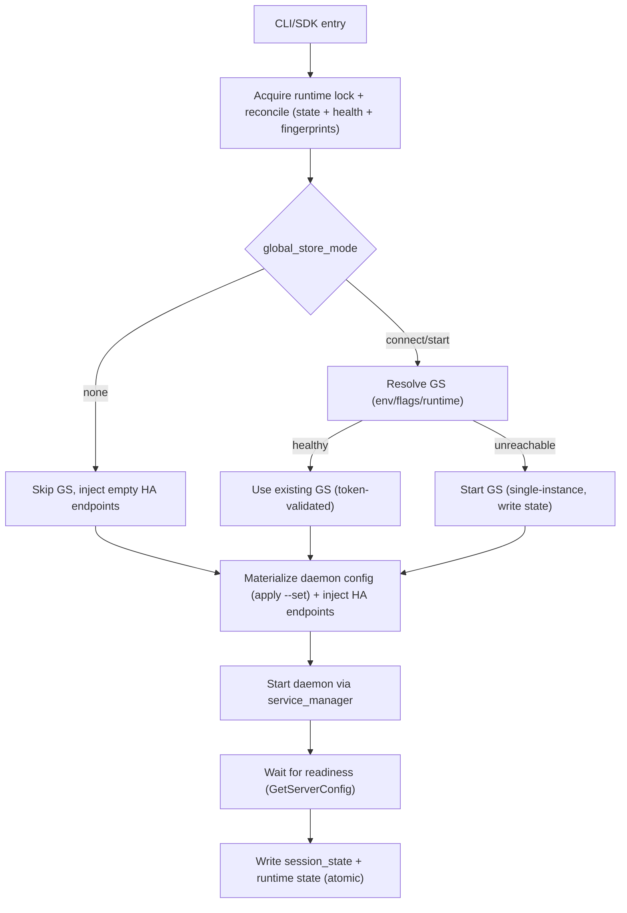

# Summary

TensorCast now ships a unified runtime orchestrator shared by the CLI and SDK. The CLI surface is split into `tensorcast daemon` and `tensorcast global` subcommands with a minimal command set (`start`, `stop`, `status`, `logs`, `restart`). When HA is enabled, every daemon launch is two-phase: resolve or start a single Global Store first, validate the cluster token to avoid split-brain, then inject the resolved endpoint into the daemon HA config before startup. Runtime state is authoritative, versioned, and reconciled under a strict lock order so stale PIDs and pointers are cleaned without dropping cluster identity. SDK `tensorcast.init(mode="connect"|"create")` forwards into the orchestrator (create) or binds to an existing daemon (connect), preserving CLI semantics including `global_store_mode` and ownership behavior for created sessions.

# Goals / Non-Goals

- **Goals**
  - Single orchestrator for CLI + SDK covering Global Store resolution/start and daemon startup/stop.
  - Deterministic filesystem contract (`~/.tensorcast`) with versioned state, append-only PID records, and atomic current-session pointers.
  - Hard split-brain guard: implicit cluster token recorded in runtime state and echoed by health/version probes.
  - Minimal, predictable commands: `start`, `stop`, `status`, `logs`, `restart` for both daemon and Global Store.
  - Owner-aware stop: the daemon stop path tears down the Global Store only if this session started it.
- **Non-Goals**
  - Multi-session orchestration for the Global Store (one instance per `$TENSORCAST_HOME`).
  - Remote cluster lifecycle management; CLI only manages local processes.
  - Compatibility shims for legacy flat CLI flags or pre-refactor layouts.
  - Hot-reload of daemon or Global Store configs.

# Architecture & Interfaces

## CLI surface (current)

```
tensorcast
├── daemon
│   ├── start [--config PATH] [--set KEY=VALUE] [--stable-bytes SIZE]
│   │        [--mem-pool-size-bytes SIZE] [--enable-rdma]
│   │        [--log-level LEVEL] [--global-store-endpoints HOST:PORT]
│   │        [--global-store-mode connect|start|none]
│   │        [--global-store-address HOST:PORT] [--session SID] [--json] [--blocking]
│   ├── stop [--force] [--session SID]
│   ├── status [--session SID] [--json]
│   ├── logs [-f/--follow] [--stderr] [--session SID]
│   └── restart [...]
└── global
    ├── start [--config PATH] [--listen-host HOST] [--listen-port PORT]
    │        [--gs-session GID] [--json] [--blocking]
    ├── stop [--force] [--gs-session GID]
    ├── status [--gs-session GID] [--json]
    └── logs [-f/--follow] [--stderr] [--gs-session GID]
```

- Default UX: `tensorcast global start` (if needed) → `tensorcast daemon start` with an explicit `global_store_mode` (`connect`/`start`). Start always waits for readiness (no startup timeout). Use `--blocking` to keep the process attached and stop it when the CLI exits; otherwise starts are detached. Daemon commands respect `current_session`; Global Store commands respect `current_global_session`.
- `global_store_mode`: `connect` (must reach an existing GS), `start` (start a local GS if needed), `none` (skip HA). Default is `none`. `--global-store-address` implies `connect`.
- `--set KEY=VALUE` overlays daemon config values using dot-paths (proto field names). Values are YAML-parsed and applied before HA injection and port backfill; repeat to set multiple fields.
- Convenience flags (`--stable-bytes`, `--mem-pool-size-bytes`, `--enable-rdma`, `--log-level`) are translated into config overlays. `--global-store-endpoints` seeds both GS resolution (connect-only) and HA endpoint injection.
- Cluster identity is implicit. The runtime refuses to start a new GS when a cluster token already exists but is unreachable unless the caller explicitly cleans state.

## Runtime orchestrator (CLI + SDK)

`tensorcast.runtime.start()` is the single entry used by CLI and SDK:

```python
RuntimeSession start(
    daemon_config: Path | None,
    session_id: str | None,
    global_store_mode: Literal["connect","start","none"],
    global_store_address: str | None,
    ha_endpoints: list[str] | None = None,
    allow_gs_fallback: bool = False,
    cluster_id: str | None = None,
    reuse_existing: bool = False,
    fate_share: bool = True,
    blocking: bool = False,
    to_console: bool = True,
)
```

- Two-phase launch: reconcile state → resolve/start Global Store (health + cluster token) → materialize daemon config with HA endpoints → start daemon via `service_manager` → write session/runtime state atomically.
- Startup readiness is always awaited; there is no `no-wait` mode and no global startup timeout. In foreground (`blocking`) mode the call remains attached until the service exits.
- Owner stop: `runtime.stop()` checks `session_state.global_store.owner`; if true, it stops the Global Store before stopping the daemon.
- When `session_id` is omitted, `runtime.stop()` resolves the active daemon from `runtime/state.json` first, then falls back to `current_session`.
- SDK `tensorcast.init(mode="create")` forwards `global_store_mode/address/cluster_id/session_id` into `runtime.start`, preserving CLI semantics. Ephemeral/private sessions are supported by passing an explicit `session_id` and skipping `current_session` writes.

## Runtime layout & state contracts

Rooted at `$TENSORCAST_HOME` (default `~/.tensorcast`):

```
runtime/state.json         # authority: daemon + global_store + fingerprints + cluster_token
locks/runtime.lock         # global lock
locks/global_store.lock    # single GS guard
sessions/<sid>/
  logs/daemon.out|err
  pids.json                # append-only, schema_version=1, role="daemon"
  session/meta.json
  session/session_state.json
global_sessions/<gid>/
  logs/global_store.out|err
  pids.json                # append-only, schema_version=1, role="global_store"
  session/state.json
current_session            # text pointer to daemon session
current_global_session     # text pointer to GS session
```

Key schemas (schema_version=1):

- `runtime/state.json` (authority for discovery):
  ```json
  {
    "schema_version": 1,
    "daemon": {
      "session_id": "20250304-120000-1a2b",
      "pid": 12345,
      "address": "127.0.0.1:50052",
      "p2p_address": "127.0.0.1:50053",
      "owner": true,
      "instance_fingerprint": {"host_id": "...", "boot_id": "...", "pid": 12345}
    },
    "global_store": {
      "session_id": "gs-20250304-1159-33cc",
      "pid": 22345,
      "address": "127.0.0.1:50051",
      "listen_host": "127.0.0.1",
      "listen_port": 50051,
      "metrics_port": 8000,
      "db_file": ".../global_store.duckdb",
      "cluster_token": "abcdef...",
      "owner": true,
      "instance_fingerprint": {"host_id": "...", "boot_id": "...", "pid": 22345}
    }
  }
  ```
- `sessions/<sid>/session/session_state.json` (daemon view):
  ```json
  {
    "schema_version": 1,
    "session_id": "20250304-120000-1a2b",
    "started_at": 1741000000.0,
    "daemon": {
      "pid": 12345,
      "address": "127.0.0.1:50052",
      "p2p_address": "127.0.0.1:50053",
      "config_path": ".../effective_daemon_config.yaml"
    },
    "global_store": {
      "mode": "start",
      "address": "127.0.0.1:50051",
      "session": "gs-20250304-1159-33cc",
      "owner": true,
      "cluster_token": "abcdef..."
    },
    "logs_dir": ".../logs"
  }
  ```
- `global_sessions/<gid>/session/state.json` mirrors pid/address/ports/cluster_token for the Global Store. All PID files are append-only and carry `role` plus the original command argv.

## Locking and reconciliation

- Lock order is strict: `runtime.lock` → `global_store.lock` → per-session `pids.lock`. All entry points (CLI + SDK) respect this order to avoid cross-deadlocks.
- Reconcile on every CLI/SDK entry: read state, check PID liveness, compare instance fingerprints (host_id + boot_id + pid), and gRPC health (`ping_daemon` / `ping_global_store`). Stale entries are pruned; cluster tokens are retained to prevent accidental cluster re-creation.
- `current_session`/`current_global_session` writes are atomic (0600) and updated only under the relevant locks.

## Global Store lifecycle

- Single instance per `$TENSORCAST_HOME`, guarded by `global_store.lock` and runtime state. Healthy instances are reused; unhealthy records are cleaned before launching a new `gs-*` session.
- Start command: `["uv", "run", "-m", "tensorcast.global_store", "--config", <path>]`, with stdout/stderr pumped to `logs/global_store.out|err`.
- Listen host/port honor config and CLI overrides; port `0` is supported and the actual port is written back to state after `add_insecure_port`.
- Health/readiness: gRPC health service plus a lightweight `GetVersion` fallback. Responses echo `listen_host`, `listen_port`, `metrics_port`, and `cluster_token` for split-brain detection.
- Cluster token is implicit and persisted in runtime state; a mismatch between runtime and probed token fails fast. If a token exists but no healthy GS is reachable, the orchestrator refuses to create a new cluster unless the caller explicitly cleans state.

## Daemon lifecycle and HA injection

- Daemon config is materialized per session into `effective_daemon_config.yaml`; CLI overlays apply first, ports may be user-set or discovered, and `ha_endpoints` is injected from the resolved Global Store address unless `global_store_mode="none"`.
- Startup waits for daemon readiness via `GetServerConfig` and does not treat an open TCP port as ready, then writes runtime and session state atomically. PID records are append-only and include role, argv, and log paths.
- Only one daemon instance is allowed per `$TENSORCAST_HOME`; `daemon start` refuses to launch a second instance and instead surfaces the existing session details.
- CLI launches are detached from the caller process so daemons (and any CLI-started Global Store) stay running after the command returns unless `--blocking` is used.
- Blocking-mode shutdown handlers are idempotent to avoid duplicate stop attempts when signals and `atexit` both fire.
- In blocking mode, Ctrl+C triggers a SIGTERM and the CLI waits for a graceful shutdown (up to ~35s) before escalating to SIGKILL so workers can unregister cleanly.
- Stop honors ownership: if the session owns the GS, `stop_global_store` is invoked before `stop_service`. Non-owners only clear current-session pointers.

## SDK integration

- `tensorcast.init(mode="create")` and `tensorcast.shutdown()` delegate to `runtime.start/stop`, exposing `global_store_mode`, `global_store_address`, `cluster_id`, `session_id`, and `allow_gs_fallback`. Initialization is blocking and returns only when the daemon is ready (or on error).
- Clients reading daemon addresses first consult runtime state, then `current_session`, preserving behavior consistency with the CLI.
- Private sessions are supported for tests by passing a custom `session_id` and skipping `register_current`.

## Flow overview



# Schema Changes

- No database schema changes. Runtime contracts for `runtime/state.json`, daemon `session_state.json`, and `global_sessions/.../state.json` are versioned (`schema_version=1`) and now treated as authoritative sources for CLI/SDK discovery.

# Trade-offs & Risks

- Single embedded Global Store per home: simplifies orchestration but requires separate `$TENSORCAST_HOME` for multi-tenant use.
- Cluster token strictness means unreachable-but-recorded clusters block automatic recreation; manual cleanup is required to form a new cluster.
- `global_store_mode="none"` disables HA and is meant only for offline/local flows; users must opt in explicitly to avoid surprising partial HA.
- Port discovery relies on daemon/GS reporting bound ports; misconfigured binaries that omit these fields will degrade diagnostics.
- Ownership signals are critical: incorrect owner flags could tear down a shared GS. State now records ownership to reduce this risk.

# Compatibility & Acceptance Criteria

- CLI exposes only `daemon` and `global` groups with the shared runtime semantics described above; legacy flat commands are removed.
- Runtime state is the single source of truth; `status` and SDK discovery read it first, falling back to session files only when absent.
- Two-phase startup is enforced: GS resolution/start (token validated) precedes daemon launch and HA injection. No daemon starts with unknown GS endpoints.
- Reconciliation on every entry clears stale PIDs while preserving cluster tokens; instance fingerprints protect against boot/host drift.
- Single-instance guards hold: one daemon per session, one GS per home, both enforced by locks + health checks + append-only PID records.
- Owner-aware stop cascades: a daemon session that owns the GS stops it first; borrowed GS instances are never stopped by non-owners.
- Logs and status are separated: `tensorcast daemon logs/status` target daemon data only; `tensorcast global logs/status` target GS data with health and metrics info.
- Blocking starts propagate child exit status so callers can detect failed daemon/GS startups.
- SDK `init()` matches CLI behavior for modes, addresses, and ownership, including optional fallback to `none` when `allow_gs_fallback` is set.

# References

- Plans: `docs/plans/0040-01-unified-cli-runtime-foundation.md`, `docs/plans/0040-02-unified-cli-runtime-global-store.md`, `docs/plans/0040-03-unified-cli-runtime-cli-sdk.md`.
- CLI/runtime code: `tensorcast/cli.py`, `tensorcast/runtime.py`, `tensorcast/cli_utils/global_store_manager.py`, `tensorcast/cli_utils/service_manager.py`.
- Tests: `tests/python/cli/test_paths_and_state.py`, `tests/python/cli/test_reconcile.py`, `tests/python/cli/test_global_store_config.py`, `tests/python/cli/test_global_store_health.py`, `tests/python/cli/test_global_store_manager.py`, `tests/python/cli/test_runtime_orchestrator.py`, `tests/python/cli/test_cli_surface.py`.
