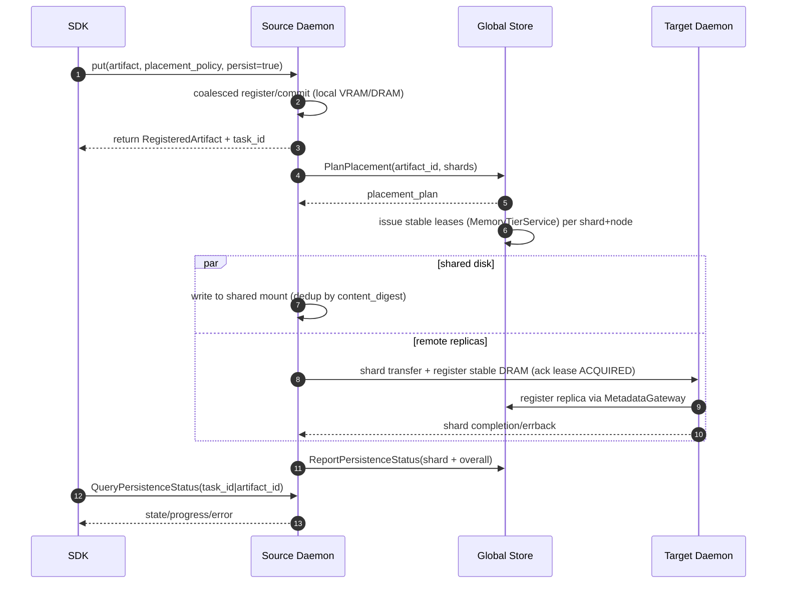
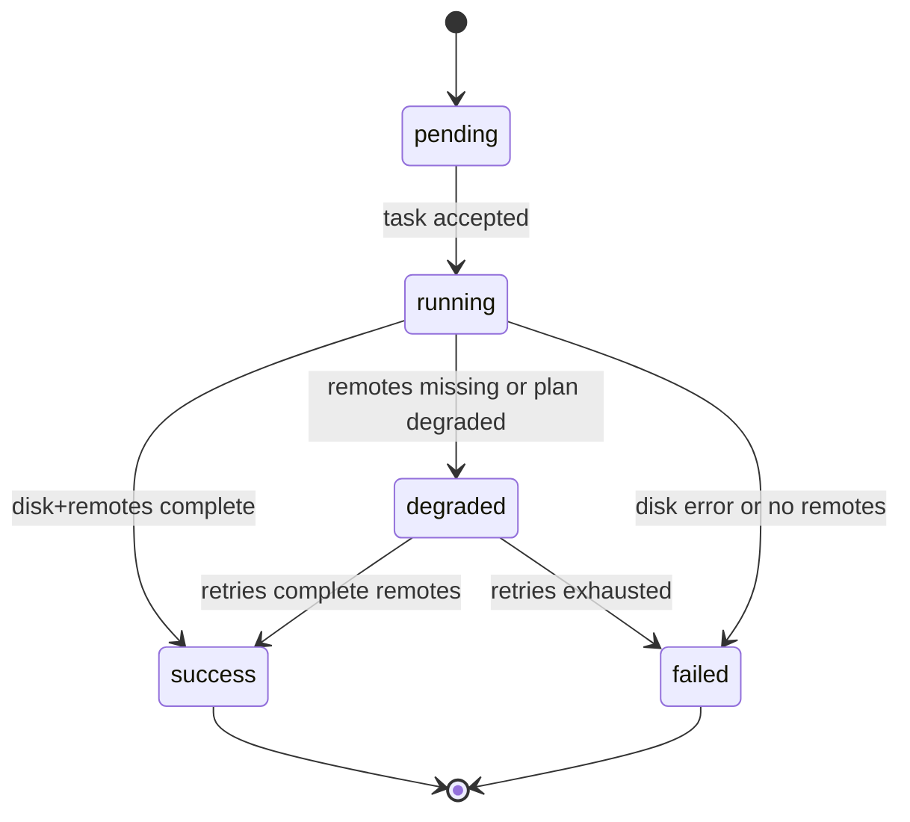

# Summary

Introduce an opt-in distributed persistence path for `tensorcast.put`: callers can request persistence and a placement policy per call, while the daemon and Global Store coordinate remote stable-DRAM replicas and shared-disk durability in the background. The default `put` behavior (local daemon VRAM) remains unchanged; persistence adds asynchronous replication plus shared-disk spill with content-addressed de-duplication.

# Problem & Context
- Current `put` semantics stop at local VRAM/DRAM; durability depends on the originating daemon staying alive.
- Registration code has no shard-aware planner and no daemon-owned state machine for background replication or shared-disk writes.
- Global Store owns placement RPCs and tables but today only stores status scaffolding; there is no durable link between shard plans, leases, and daemon execution.
- Operators need observability (metrics/logging/status queries) to see when persistence succeeds, degrades, or fails; the status API is stubbed.

# Goals / Non-Goals

## Goals
- Add per-call `placement_policy` (local_only, replicated, sharded) and `persist` boolean to `put` without breaking existing callers.
- Provide asynchronous persistence: return to the caller after the local replica commits; daemon continues shared-disk write and remote stable-DRAM replicas.
- Enable Global Store to issue placement plans (node selection, optional sharding) and ingest daemon-reported persistence status.
- Support large artifacts via chunk-aware sharding once size exceeds a threshold; avoid sharding small artifacts.
- Expose a client-facing status query API (via daemon) for persistence tasks; emit logs/metrics for retries/failures.
- Target remote replicas to stable DRAM only; preemptible memory is excluded for persistence.
- Status queries accept either `task_id` or `artifact_id` and are single-shot (no polling helper in SDK).

## Non-Goals
- Do not expose per-node hints or exact replica counts to the SDK in this phase.
- Do not add topology/rail-aware placement logic yet; keep the interface extensible for future policies.
- Do not introduce preemptible DRAM participation; only stable DRAM and shared disk are used for persistence.
- Do not require the Global Store to orchestrate per-chunk task execution; daemons own execution and reporting.

# Architecture & Interfaces

## Shard vs. Chunk Terminology
- **UMA chunk** (~4MB): VS/UMA unit tracked in `chunk_directory`; governs residency/eviction.
- **Persistence shard** (64–256MB): placement/lease/transfer unit derived from `CoalescedLayout.unique_chunks`; used only for persistence and status. Sharding is enabled when `total_size_bytes >= 128MB`; small artifacts stay unsharded.
- **Thresholds (canonicalized)**:
  - Unsharded when `total_size_bytes < 128MB` (single shard per artifact).
  - Sharded when `total_size_bytes >= 128MB`; shards are reblocked to stay within 64–256MB caps to avoid explosion in shard count.

## Shard Planning Details
- Shards derive from `CoalescedLayout.unique_chunks` in canonical order so digest/range are reproducible for retries and cross-daemon comparisons.
- For unsharded artifacts, emit a single shard that spans `[0, total_size_bytes)` with the full chunk list; this is used even when callers request `sharded` but the artifact is below the threshold.
- For sharded artifacts, accumulate chunks until reaching the 64–256MB window; if adding the next chunk would exceed 256MB, start a new shard boundary at that chunk. We do not split UMA chunks.
- Each shard carries: deterministic `shard_id` (artifact_id + zero-padded index), `byte_range_start`/`byte_range_length`, `size_bytes` (exact content length), `content_digest` (content-address over the shard range), and `covered_chunk_ids` for verification and lease requests.
- Digest drives shared-disk dedup and remote verification; shard count stays bounded even for very large artifacts without losing chunk provenance.

## Client API (SDK)
- `tensorcast.api._config.RegisterArtifactOptions` gains:
  - `placement_policy: Literal["local_only","replicated","sharded"]` (default `local_only`).
  - `persist: bool` (default `False`).
- `tensorcast.api.store.Store.put/put_async` accept/forward the new fields; plan remains `VRAM_COALESCED`.
- After commit, if `persist=True`, SDK triggers daemon RPC `StartPersistence` (new) and returns immediately with a `persistence_task_id`.
- New SDK helper `query_persistence_status(task_id|artifact_id)` calls daemon `QueryPersistenceStatus`; SDK never contacts Global Store directly. SDK never talks to Global Store; all GS traffic is initiated by the daemon. This is a single-shot query; callers drive any polling themselves.

## RPC Ownership & Call Chain
- `PlanPlacement` and `ReportPersistenceStatus` are Global Store RPCs only; the daemon calls them via the GS client stub. Do not duplicate these RPCs in the daemon proto.
- SDK → daemon (`StartPersistence`/`QueryPersistenceStatus`) → daemon → Global Store (`PlanPlacement`/`ReportPersistenceStatus`).

## Daemon: Persistence Manager
- Hooked after `CommitRegisteredArtifact` (C++ side) when `persist=True`.
- Steps:
  1. Determine shard plan:
     - If `total_size_bytes < 128MB`, treat as unsharded (`replicated` or `local_only` fallback for `sharded`).
     - Otherwise, derive shards from canonical layout chunks (`CoalescedLayout.unique_chunks`), optionally re-blocking very large artifacts into 64–256MB slices to cap shard count. Every shard records: `shard_id` (artifact_id + index), `byte_range`, `content_digest`, and the source chunk ids it covers; targets verify by digest/size on registration.
  2. Call Global Store `PlanPlacement` RPC with `artifact_id`, `placement_policy`, shard summary (with shard ids/digests/size), and node identity. Response: target node set per shard (at least local + one remote for replicated/sharded). If the cluster cannot offer a remote target with sufficient stable headroom, the plan degrades explicitly to `local_only` + shared disk and marks the placement as `degraded_reason=insufficient_remote_capacity`.
  3. Before any remote copy, request stable-memory leases per shard+target via existing `MemoryTierService.RequestMemoryTierLease` (kind=stable). The request carries shard chunk_ids/range and bytes. Remote daemons must ACK acquisition via `AcknowledgeMemoryTierLease(action=ACQUIRED)` once UMA binding succeeds, and must send `RELEASED` on failure or after cleanup. Lease ids tie back into placement/status for auditability.
  4. Start background task: copy shards to target daemons (stable DRAM only, lease-held) via existing P2P/registration flows; in parallel, write shared disk to the configured mount if `content_digest` not already present (local index check). Shared disk is per-daemon but globally unique (one mount per daemon); dedup scope is that mount, not cross-daemon.
  5. Register every successfully materialized remote replica through `MetadataGateway::register_replica` so GS updates `artifact_replicas` and chunk directory entries; chunk_sync_loop then publishes chunk states. Do not rely solely on persistence status tables.
  6. For each shard/replica completion, the source daemon reports status (with lease ids, digest, and any degraded flags) to Global Store via `ReportPersistenceStatus`; target daemons only ACK leases/register replicas and send completion/errbacks to the source. Release leases on failure/cleanup.
- Initial cut (implemented): shard planning uses UMA chunking with a 128MB sharding threshold and 64–256MB shard caps; `StartPersistence` now calls Global Store `PlanPlacement`, binds targets with stable leases, and reports shard/task status plus metrics. Remote copy/materialization is still stubbed (targets complete after lease) until replica transfer and shared-disk writer land.
- Task bookkeeping: table keyed by `task_id`/`plan_id` with progress, timestamps, last_error; persisted locally (append-only log) so daemon restart can resume/reattempt outstanding tasks.
- Retry: bounded retries with jittered exponential backoff (reuse store retry defaults) for copy/write/lease failures; failures update status and metrics. If lease acquisition keeps failing, degrade to local-only + shared disk and surface the reason.
- Status semantics: tasks can surface partial success; shard-level state and aggregated task state both report successes/failures. Remote replica failures do not block shared-disk success reporting, but degraded placement is surfaced explicitly. States: `pending`, `running`, `degraded` (disk ok but missing replicas or plan degraded), `success`, `failed` (disk failed or no replicas succeeded).

## Global Store: Placement & Status
- New service `PlacementService` (Python) and proto endpoints:
  - `PlanPlacement(artifact_id, placement_policy, shards[]) -> placement_plan` (node list per shard; includes reserved fields for topology/rail hints).
  - `ReportPersistenceStatus(task_id, artifact_id, plan_id, shard_summary, state, error?, degraded_reason?)` ingests daemon-reported outcomes.
- Node selection: filter workers by fresh heartbeat/accepting flag and stable DRAM availability (`node_memory_tier_latest.stable_total_bytes - stable_used_bytes > shard size`); simple spread (round-robin or random) for now. Placement also reserves a stable lease budget by issuing `MemoryTierService.RequestMemoryTierLease` requests per shard+node so the plan does not overcommit; failure to lease causes the plan to fall back to local-only + shared disk.
- GS stores only summarized shard mappings plus lease ids to avoid per-chunk explosion; detailed execution stays in daemons.

## Lease and Replica Execution
- PlanPlacement performs a provisional lease check; the source daemon still issues concrete `RequestMemoryTierLease` calls when executing, binding `lease_id` to each `(shard, node)` before transfer. ACQUIRED ACKs are required before copying; RELEASED is sent when the shard commit or failure is finalized.
- Remote replicas are registered via `MetadataGateway::register_replica` after the shard lands in stable DRAM under the lease. Registration uses the shard digest and byte range so chunk_directory reflects real residency.
- Shared-disk writes are scoped to the daemon’s configured mount and keyed by `(content_digest, size_bytes)`; on hit, disk copy is skipped but status still records the shard as satisfied by disk.
- Degradation rules: if no remote lease succeeds, the task degrades to `local_only` and still writes shared disk; if disk write fails, the task transitions to `failed` even if remotes succeeded.

## Data Flow (persist=True)

# Task State Machine & Recovery
- States: `pending` (task accepted), `running` (leases/plans active), `degraded` (disk success but missing remote targets or plan already degraded), `success` (disk + required remotes done), `failed` (disk write failure or zero remote success when policy demanded it).
- Per-shard tracking rolls up to task state; shard targets carry `pending|copying|complete|failed|skipped` to distinguish degraded-but-satisfied-by-disk from outright failure.
- Progress is `(shards_completed + shards_skipped_due_to_dedup) / shard_count`; retries update `last_error` with the latest failure reason.
- Append-only local task log (daemon disk) stores `task_id`, `plan_id`, `artifact_id`, placement policy, shard summaries, target list, attempts, last_error, and last reported shard/target states. On restart, the daemon replays the log, re-issues missing ReportPersistenceStatus calls, and resumes any shard not in a terminal state.
- Retries use jittered exponential backoff with a bounded attempt count per shard per target; lease denials may trigger target re-selection only if GS plan allows alternates, otherwise the task degrades to shared-disk-only.

## Naming Compliance (new interfaces)
- SDK fields: `placement_policy`, `persist` (snake_case).
- Daemon/GS RPCs: `PlanPlacement`, `StartPersistence`, `QueryPersistenceStatus`, `ReportPersistenceStatus` (PascalCase messages; snake_case fields per proto style).
- Metrics: `tc_persist_tasks_active`, `tc_persist_errors_total`, `tc_persist_retries_total`, `tc_persist_progress_ratio` (snake_case).

# Observability & Telemetry
- Metrics:
  - `tc_persist_tasks_active{state}` gauge from the daemon task table.
  - `tc_persist_errors_total{stage=lease|copy|disk|plan,reason}` counter on terminal failures and degraded downgrades.
  - `tc_persist_retries_total{stage}` counter for bounded retries.
  - `tc_persist_progress_ratio{task_id}` gauge reflecting aggregate shard completion.
  - GS emits `tc_gs_plan_requests_total{outcome}` and lease issuance counters to track placement load and degradation frequency.
- Structured logs at task start/transition/finish include `task_id`, `plan_id`, `artifact_id`, `shard_id`, `target_node`, `lease_id`, `degraded_reason`, and `attempt`.
- QueryPersistenceStatus returns shard- and task-level states plus `degraded_reason`, `last_error`, `progress`, and the per-target `target_nodes`/`lease_ids` pairs (index aligned, empty lease means pending); it does not back off or poll automatically, keeping SDK behavior single-shot.

# Schema Changes

Proposed additions to `schema.sql` (normalized + lightweight summary):
  - `artifact_placements`  
    - `plan_id TEXT PRIMARY KEY`  
    - `artifact_id TEXT NOT NULL`  
    - `policy TEXT CHECK (policy IN ('local_only','replicated','sharded')) NOT NULL`  
    - `shard_count INTEGER NOT NULL`  
    - `created_at TIMESTAMP WITH TIME ZONE DEFAULT CURRENT_TIMESTAMP`
    - `UNIQUE(artifact_id)` for last-plan wins lookups.
  - `artifact_placement_shards`  
    - `plan_id TEXT NOT NULL`  
    - `shard_idx INTEGER NOT NULL`  
    - `shard_id TEXT NOT NULL`  
    - `size_bytes BIGINT NOT NULL`  
    - `content_digest TEXT NOT NULL`  
    - `byte_range_start BIGINT NOT NULL`  
    - `byte_range_length BIGINT NOT NULL`  
    - `chunk_ids JSON NOT NULL`  -- source UMA chunk ids covered by this shard  
    - `PRIMARY KEY(plan_id, shard_idx)`; index on `(content_digest)` for dedup queries; FK(plan_id) -> artifact_placements.
  - `artifact_placement_targets`  
    - `plan_id TEXT NOT NULL`  
    - `shard_idx INTEGER NOT NULL`  
    - `node_id TEXT NOT NULL`  
    - `lease_id TEXT NULL`  
    - `target_state TEXT CHECK (target_state IN ('pending','copying','complete','failed','skipped')) NOT NULL`  
    - `degraded_reason TEXT NULL`  
    - `PRIMARY KEY(plan_id, shard_idx, node_id)`; indexes on `(node_id)` for per-node queries and `(plan_id, target_state)`.
  - `artifact_placement_summary` (optional cached JSON)  
    - `plan_id TEXT PRIMARY KEY`  
    - `plan_json TEXT NOT NULL`  -- summary list of `{shard_id, size_bytes, content_digest, nodes:[worker_id...], lease_ids:[...], degraded_reason?}` for quick fetch; canonical data lives in normalized tables above.
  - `artifact_persistence_status`  
    - `task_id TEXT PRIMARY KEY`  
    - `plan_id TEXT NOT NULL`  
    - `artifact_id TEXT NOT NULL`  
    - `state TEXT CHECK (state IN ('pending','running','success','failed','degraded')) NOT NULL`  
    - `progress REAL NOT NULL DEFAULT 0.0`  
    - `last_error TEXT NULL`  
    - `degraded_reason TEXT NULL`  
    - `updated_at TIMESTAMP WITH TIME ZONE DEFAULT CURRENT_TIMESTAMP`
    - Index on `(artifact_id, state)` for status lookups.
  - Foreign keys are aligned with existing tables: `artifact_id` references `artifacts`, `node_id` references `workers` (soft FK if strict FK not desired in DuckDB).

No change to existing `chunk_directory`; chunk-level placement remains there. Persistence shards/targets coexist to answer “which nodes hold shard N of plan_id” and “which shards a node owns”. Shared-disk deduplication keys off `{content_digest, size_bytes}` (content-addressed), not `artifact_id`, so cross-artifact dedup works and id reuse cannot collide.

## Cleanup & GC
- Shared-disk entries are keyed by content digest; GC may drop files once the local dedup index shows zero refs.
- Remote replicas registered via MetadataGateway follow existing deregister/eviction flows; persistence tasks must release stable leases on failure/cleanup.
- `artifact_placements`/`artifact_persistence_status` are append-only by `plan_id`; operators may prune history (e.g., keep latest plan per artifact) while preserving recent task rows for audit.

# Testing Strategy
- Shard planner unit tests: `<128MB` stays unsharded; `>=128MB` yields multiple shards bounded by 64–256MB; shard digest/byte ranges align with input chunks and reblocking rules.
- Lease + placement tests: GS placement filters capacity, issues provisional leases, and degrades to local-only when remotes cannot satisfy; daemon lease failures trigger degraded status and RELEASED ACKs.
- State machine tests: pending→running→{success,degraded,failed}; degraded promoted to success after retries; disk failure forces failed even if remotes succeed; progress math honors dedup hits.
- Metadata registration tests: successful remote shard replication calls `MetadataGateway::register_replica` and produces chunk_directory updates via sync loop.
- Restart/recovery tests: persisted task log replays to resume in-flight shards, re-issue ReportPersistenceStatus, and avoid double-registration.
- Integration smoke: SDK `put(persist=True)` returns task id; mock daemon completes shards/shared disk; QueryPersistenceStatus surfaces progress/errors; GS tables populated with placements and statuses.

# Trade-offs & Risks
- GS load: summarizing shards avoids chunk-level explosion but reduces query granularity; mitigated by optional shard summaries in status.
- Placement simplicity vs. future topology: initial spread is naïve; design reserves fields to add topology/rail-aware selection without breaking callers.
- Asynchrony: caller returns before persistence completes; mitigated by status API and metrics; risk of false sense of durability until tasks finish.
- Shared disk single path: single mount may be a SPOF; future work could add multiple paths/tiers.
- Retry storms: bounded retries with backoff required to avoid cascading load when shared disk or remote nodes are unhealthy.
- Local task log on daemon disk adds I/O, but enables restart recovery without GS; must keep writes append-only and compact periodically.

# Compatibility & Acceptance Criteria
- Backward compatible SDK: `placement_policy`/`persist` are optional and default to current behavior.
- No behavior change when `persist=False` or `placement_policy=local_only`.
- Acceptance:  
  - `put(persist=True, placement_policy=replicated)` returns immediately; background tasks create at least one remote stable-DRAM replica and shared-disk entry; status reports `success`.  
  - `sharded` on large artifacts spreads shards across multiple nodes per plan and still reports aggregated success.  
  - Status API reflects progress/errors; metrics/logs emitted for retries/failures.  
  - GS tables populate with placement plan and status rows.

# References
- `docs/architecture/architecture-overview.md`
- `docs/architecture/high-availability-design.md`
- `docs/designs/0034-stable-memory-tiers.md`
- `docs/designs/0022-distributed-preemptible-memory.md`
- `schema.sql`
