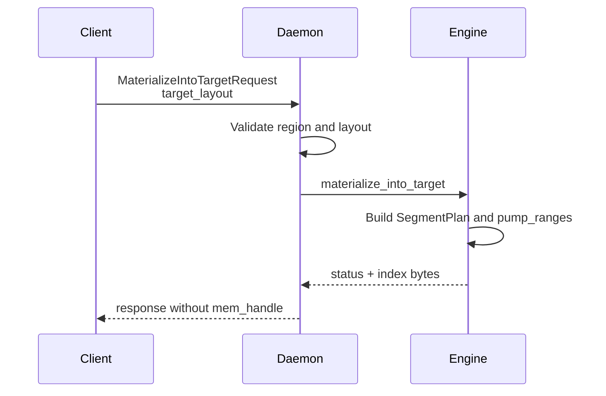
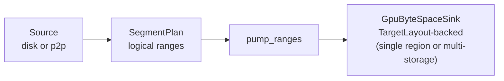

# Summary

Introduce a TargetLayout-backed `tensor_dict_into` RPC (`MaterializeIntoTarget`) that streams artifact bytes directly into a client-registered CUDA region, bypassing daemon replica allocation and `mem_handle` export. Phase 1 is canonical + COALESCED and intentionally restrictive. Phase 2+ expands the same foundation to support view-indexed layouts (`INDEX_KIND_VIEW` + `view/view_id`), selective subsets (`tensor_names` / `view_subset_hash`) via a packed view ByteSpace, multi-storage COALESCED (ordered concatenation), and optional external-target verification. These Phase 2+ primitives are also the shared lower-layer dependency for daemon-owned placeholder/“deferred fill” sessions (see `docs/designs/0052-deferred-slice-materialization.md`).

# Goals / Non-Goals

## Goals (Phase 1)
1. Provide a dedicated, long-lived RPC for region-backed get-into that does not rely on `mem_handle`.
2. Zero extra VRAM on the daemon for region-backed targets.
3. Keep IPC handle count minimal (typically one region handle plus a compact offset table).
4. Reuse the existing daemon data-path abstractions (sources, sinks, buffer pools, pump).
5. Reject any region-backed layout whose logical space does not match the target layout.

## Goals (Phase 2+)
1. Support view-indexed logical layouts (`INDEX_KIND_VIEW`) for region-backed targets using existing core view planning/execution (`ViewPlanner` + `ViewPlanSource`).
2. Support selective materialization into a packed ByteSpace (subset-by-name), with explicit, deterministic padding semantics (PAD bytes are defined as zeros).
3. Support multi-storage COALESCED layouts by defining a stable “ordered concatenation” rule for storages and implementing a multi-storage GPU sink (so the logical ByteSpace can be backed by multiple regions/allocations without scatter logic in the pump).
4. Add optional external-target verification using plan-based hashing primitives so Phase 1’s “verification skipped” becomes an explicit, configurable trade-off.
5. Keep `TargetLayout` and logical ByteSpace semantics reusable by daemon-owned placeholder sessions (the session/RPC surface remains out of scope for this design).

## Non-Goals
- Replace `tensor_dict()` or `get()` flows (they continue to materialize a daemon-owned replica).
- Apply `region_backed_mode` to `get` / `get_view` or change their semantics; those calls always use the daemon-owned replica path.
- Enable cross-node GPU direct write (RDMA into client GPU) beyond current infrastructure.
- Support arbitrary strided targets in the first release; non-contiguous tensors fall back.
- Introduce Global Store schema changes or replica tracking for `tensor_dict_into` targets.
- Modify vLLM itself or define vLLM-facing APIs (covered by `docs/designs/0052-deferred-slice-materialization.md`).

## Phase 1 Scope
- Artifact identity must be `artifact_id` (key-based requests are reserved for a later phase).
- `disk_fallback` may be provided as a source hint but never as the sole identity.
- `index_kind=CANONICAL` only; `INDEX_KIND_VIEW` is deferred to Phase 2.
- View-based requests (`view` / `view_id`) are not supported for region-backed targets.
- Subset selection is not supported: `tensor_names` / `view_subset_hash` must be empty, and the layout must cover the full canonical byte space.
- `device_uuid` is required and authoritative; `device_id` is treated as a local ordinal only.
- `region_backed_mode` is consulted only by `tensor_dict_into` / `tensor_into` / `get_into`; `get` / `get_view` ignore it.

## Phase 2+ Scope (planned)
- `index_kind=VIEW` is supported; requests may carry `view` or `view_id` (same semantics as other v2 materialization RPCs).
- Selective layouts are supported: request `tensor_names` and/or `view_subset_hash` and provide a target layout covering only the selected tensors in a packed view ByteSpace.
- COALESCED supports multiple storages via ordered concatenation (to span multiple regions or multiple daemon allocations).
- Optional external-target verification is supported (configurable; may remain off by default for performance).

# Current State

Phase 1 is already wired as a dedicated v2 RPC (`MaterializeIntoTarget`) with region registration (`RegisterVramRegion`) and a controller-level validation gate (`daemon/service/controllers/materialization_controller.cc`). The current implementation is intentionally strict:
- Requires `artifact_id` and a COALESCED single-storage target; rejects `view/view_id`, `tensor_names/view_subset_hash`, and multi-storage layouts.
- Streams bytes via the existing core dataplane (`SeekableSource → pump_ranges → GpuMemorySink`) into a mapped client region, then releases the region ref.
- Skips external-target verification and treats failures as potentially partial writes (region is poisoned).

This leaves two gaps that block higher-level integrations such as daemon-owned placeholders and vLLM-style deferred slice loading:
- No view-indexed / packed subset ByteSpace for into-target.
- No multi-storage sink for mapping a single logical ByteSpace onto multiple region/allocations.

# Architecture & Interfaces

## Target Layout and Data Organization

Region-backed `tensor_dict_into` needs a compact description of where each tensor should land inside one or more registered regions. The layout is defined in a **logical byte space** anchored to the canonical or view index; the daemon maps that logical space onto region-backed storages.

### Logical Byte Space
- The logical destination offsets are canonical (or view) offsets, not raw region offsets.
- Each tensor defines a contiguous logical range; the layout maps that range to a storage
  and then to a region base pointer.
- This keeps the pump interface stable: it only sees logical offsets, and a sink maps
  logical offsets to the underlying region and device pointer.
- The logical total size is defined as `max(offset + logical_length)` across the canonical
  (or view) index entries, not the sum of lengths; COALESCED storages must span this size.
- **Padding semantics are normative**: any logical ByteSpace may contain PAD gaps, and PAD bytes are defined as zero. Implementations may avoid copying PAD ranges only if they provably leave the corresponding destination bytes as zero.

**TargetLayout** (new v2 wrapper message)
- `repeated tensorcast.daemon.v2.StorageEntry storages`
- `repeated tensorcast.daemon.v2.TensorAlias aliases`
- `repeated TargetTensorOffset offsets`
- `enum LayoutKind { LAYOUT_KIND_COALESCED_UNSPECIFIED = 0; LAYOUT_KIND_TENSOR_TABLE = 1; }`
- `LayoutKind layout_kind`
- `enum IndexKind { INDEX_KIND_CANONICAL_UNSPECIFIED = 0; INDEX_KIND_VIEW = 1; }`
- `IndexKind index_kind`
- `string view_id` (required when index_kind is VIEW)
- `enum TensorSpecKind { TENSOR_SPEC_KIND_ALIAS_UNSPECIFIED = 0; TENSOR_SPEC_KIND_OFFSETS = 1; }`
- `TensorSpecKind tensor_spec_kind`
- `bytes logical_layout_hash` (optional, for diagnostics; Phase 1 does not require it)

**TargetTensorOffset** (new v2 message)
- `name`, `storage_id`, `storage_offset`, `logical_length`

**StorageEntry** (existing, v1)
- `storage_id`, `device_id`, `storage_length`
- `vram_region_id` (required for region-backed target)
- `mapping_base_offset` (required)

**TensorAlias** (existing, v1)
- `name`, `storage_id`, `storage_offset`, `logical_length`
- `shape`, `stride`, `dtype`

The **offset table** maps each tensor's logical offset to a region offset:
`logical_offset (canonical or view) -> region_id + mapping_base_offset + storage_offset`.

### Layout Compaction
- `TENSOR_SPEC_KIND_OFFSETS` sends only `TargetTensorOffset` entries; dtype/shape/stride come
  from the canonical or view index to avoid duplication.
- `TENSOR_SPEC_KIND_ALIAS_UNSPECIFIED` is a verbose mode (debug or compatibility) that duplicates the
  index metadata in `TensorAlias`.

### Logical Layout Hash (Phase 1 optional)
`logical_layout_hash` is a SHA-256 digest over the logical byte space only:
- Derive it from canonical (or view) index bytes plus `index_kind`; prefer `index_multihash`
  when present to avoid re-hashing large indices.
- Exclude physical binding fields (`storage_id`, `vram_region_id`, `mapping_base_offset`,
  `storage_offset`) so the hash stays stable across region bindings.
- In Phase 1 the on-wire field is optional and diagnostic; SegmentPlan caching should
  key on `index_multihash` (or a locally computed `logical_layout_hash`) plus
  `generation`, not on physical layout.
- If a physical-binding hash is ever needed, define it separately (e.g., `binding_hash`)
  so it does not affect plan caching.

### Selection Identity (Phase 2+)
Once view/subset support is enabled, “which bytes to produce” must be a first-class identity
separate from “where to write them”. Cache keys and observability should use:

- `logical_layout_hash`: identity of the base index ByteSpace (canonical index bytes + `index_kind`).
- `selection_hash`: identity of the selection applied on top (view + subset).

`selection_hash` is computed from a stable serialization of:
- view identity: `view_id` **or** canonicalized `view` spec (+ placement when relevant)
- subset identity: `tensor_names` (sorted, unique, stable) **or** caller-provided `view_subset_hash`

Phase 1 keeps selection empty and treats `selection_hash` as absent.

### Index Anchoring
- `index_kind=CANONICAL` means logical offsets are canonical offsets.
- `index_kind=VIEW` means logical offsets are view offsets; `view_id` or `view` must be
  present in the request to resolve the view plan.
- Phase 1 only supports `INDEX_KIND_CANONICAL_UNSPECIFIED`; Phase 2+ enables `INDEX_KIND_VIEW`.

### Device Identity
- `device_uuid` is the authoritative device identity across processes.
- `device_id` is a local ordinal that may vary across processes; it is validated against
  the daemon-resolved UUID but is never used to establish identity on its own.
- SDKs must always populate `device_uuid` and treat any UUID mismatch as a hard error
  when `region_backed_mode=require`.

### Layout Modes
1. **COALESCED (single storage; Phase 1)**: the target region is arranged in logical order
   (canonical or view). The daemon verifies `storage_offset == logical_offset` for each
   tensor, and a single storage entry spans the logical space
   (`storage_length == logical_total_size`). The `mapping_base_offset` acts as the base of
   the coalesced buffer slice in the region. This lets the pipeline stream ranges
   without extra scatter logic and reuse `pump_ranges`.

2. **COALESCED (multi-storage; Phase 2+)**: the logical ByteSpace is still linear, but is
   backed by multiple storages using **ordered concatenation**:
   - Storages are interpreted in list order.
   - Storage `i` covers logical offsets `[base_i, base_i + storage_length_i)`, where
     `base_i = sum(storage_length_j for j < i)`.
   - The sink maps `write_at(logical_offset, ...)` into the owning storage and performs
     the copy at `mapped_base_ptr(storage) + mapping_base_offset + (logical_offset - base_i)`.

   This enables spanning multiple registered regions (or multiple daemon allocations)
   while keeping the pump interface purely linear.

`TENSOR_TABLE` remains reserved for a future extension where the logical space is defined
by a per-tensor table (no packed ByteSpace). Phase 1 rejects any non-COALESCED or
multi-storage layout; Phase 2+ may still reject `TENSOR_TABLE` until the sink and
validation rules are implemented.

## SDK: Client-Side Shape and Validation

The SDK preserves `tensor_dict_into` semantics by validating targets before any
daemon-side write. It builds a `TargetLayout` only when it can prove the write is safe,
bounded, and deterministic.

**Phase 1 constraints (canonical, full layout)**
- Request uses `artifact_id` (Phase 1 does not support key-based targets).
- Every target tensor is CUDA and on the selected device.
- Every target storage is fully covered by a registered region in the client cache.
- Every target tensor is contiguous (or matches a supported contiguous stride pattern).
- Canonical index is available to compute offsets.
- Subset selection is disabled: `tensor_names` / `view_subset_hash` must be empty (or
  `tensor_names` must include all canonical names) and the layout must cover the full
  canonical logical ByteSpace.
- View selection is disabled: `view` / `view_id` are rejected for region-backed targets.
- `device_uuid` is required and authoritative; `device_id` is a local ordinal validated
  against the daemon-resolved UUID.

**Phase 2+ extensions (view-indexed + packed subset)**
- `index_kind=VIEW` is allowed, and the request may include `view` or `view_id`.
- Selective layouts are allowed: `tensor_names` may be a strict subset, and the target
  layout may cover only the selected tensors in a packed view ByteSpace (with PAD=0
  semantics).
- The same safety validation applies; unsupported combinations still fall back under
  `region_backed_mode=auto` and hard-error under `region_backed_mode=require`.

**Construction steps**
1. Resolve artifact identity and fetch canonical index bytes (already cached).
2. Determine the logical ByteSpace:
   - Phase 1: canonical only (`index_kind=CANONICAL`).
   - Phase 2+: canonical or view (`index_kind=VIEW` + `view/view_id`), including packed
     subset layouts.
3. Compute `logical_total_size = max(offset + logical_length)` from the *selected* index
   bytes (canonical for Phase 1; view index bytes for Phase 2+ packed layouts).
4. Validate target dtype/shape/stride against the relevant index (canonical or view)
   without relying on daemon-provided tensors.
5. Group target tensors by storage; assign deterministic `storage_id` (e.g., hash of base
   pointer + size).
6. For each storage, find the covering region and compute `mapping_base_offset`.
7. Emit `StorageEntry` records with `vram_region_id`, `mapping_base_offset`, and `storage_length`
   (Phase 1: one storage spans `logical_total_size`; Phase 2+: multiple storages may be used and
   must sum to `logical_total_size` under ordered concatenation).
8. Emit tensor table records (`TargetTensorOffset` preferred) for the selected tensors.
9. Validate COALESCED constraints:
   - Phase 1: `len(storages) == 1` and `storage_length == logical_total_size`, and
     `storage_offset == logical_offset` for all tensors.
   - Phase 2+: COALESCED may span multiple storages via ordered concatenation; the
     concatenation must span `logical_total_size` and each tensor must map within bounds.
10. Optionally compute `logical_layout_hash` from index bytes + `index_kind` (exclude any
    region binding). Phase 2+ may additionally compute `selection_hash` for cache keys.
11. Send `MaterializeIntoTarget` only if all constraints hold; otherwise fall back to
    normal `materialize + client copy` under `region_backed_mode=auto` (or raise under
    `region_backed_mode=require`).

**Phase 1 behavior**
- COALESCED layouts require full canonical coverage: the single storage spans the full
  canonical logical ByteSpace and every canonical tensor is present.
- Subset and view requests fall back (or error) based on `region_backed_mode`.

**Phase 2+ behavior**
- COALESCED layouts may be canonical or view-indexed, and may cover a strict subset of
  tensors when the layout is defined in the corresponding packed view ByteSpace.
- The SDK remains responsible for building targets that match the selected ByteSpace
  (canonical or view) and for validating bounds before issuing the RPC.

### Client API Surface
- `tensor_dict_into(...)`, `tensor_into(...)`, and `get_into(...)` use `MaterializeIntoTarget`
  when `region_backed_mode` allows and `artifact_id` is available. `get` /
  `get_view` always use the existing daemon-owned replica path and ignore
  `region_backed_mode`.
- Phase 1 requires a full canonical COALESCED layout; Phase 2+ allows view-indexed and
  packed subset layouts when the SDK can construct and validate them.
- Region-backed results use a dedicated SDK return type (no `mem_handle`, no
  `UnloadReplica`) to avoid mixing into-target semantics with legacy payloads.
- `get_into_async.cancel()` returns `False` once a region-backed transfer has started;
  before start, the SDK may fall back to the legacy path if `region_backed_mode=auto`.
- `region_backed_mode` is defined via the unified runtime config system. In Phase 1 it
  is read only by into paths; a future API split introduces `GetIntoOptions` /
  `TargetSpec` so into-specific options do not affect `get`.
- When `region_backed_mode=require`, the SDK errors instead of falling back.

### Capabilities and Config Integration
- Extend `ClientConfig.defaults` with `region_backed_mode` so the default path is
  driven by the unified runtime config system.
- `region_backed_mode` defaults to the configured value and can be overridden per call,
  but into paths are the only consumers until `GetIntoOptions` is introduced.

## RPC Changes (v2)

Add a dedicated RPC to `proto/tensorcast/daemon/v2/store_daemon.proto`:

```proto
service StoreDaemonService {
  ...
  rpc MaterializeIntoTarget(MaterializeIntoTargetRequest) returns (MaterializeIntoTargetResponse) {}
}

message MaterializeIntoTargetRequest {
  oneof artifact_ref {
    string artifact_id = 1;
    string key = 2; // reserved for Phase 2
  }
  DiskFallbackHint disk_fallback = 3; // optional source hint, not identity

  TargetLayout target_layout = 4;
  int32 pid = 5;
  string device_uuid = 6;

  tensorcast.daemon.v2.SourcePreference preference = 7;

  // Selective materialization (Phase 2+)
  repeated string tensor_names = 8;
  bytes view_subset_hash = 9;

  oneof view_identity {
    tensorcast.daemon.v2.ViewSpec view = 1001;
    string view_id = 1002;
  }

  tensorcast.daemon.v2.TransformPlacement placement = 1003;
}

message MaterializeIntoTargetResponse {
  string artifact_id = 1;
  tensorcast.daemon.v2.MaterializeReplicaStatus status = 2;
  tensorcast.daemon.v2.MaterializationSource source = 3;
  bytes canonical_index_bytes = 4;
  ViewSubset view_subset = 5;
  bytes view_index_bytes = 6;
  uint64 generation = 7;
}

```

When `MaterializeIntoTarget` is used:
- The daemon writes directly into the provided regions.
- `mem_handle` is not returned.
- `canonical_index_bytes` is returned for validation; when view/subset is applied, the
  daemon also returns `view_index_bytes` and `view_subset`.
- `disk_fallback` is a source hint (not identity).
- **Phase 1** rejects key-based requests, `tensor_names` / `view_subset_hash`, any view
  identity, `index_kind != CANONICAL`, `layout_kind != COALESCED`, `len(storages) != 1`,
  or non-full canonical layouts.
- **Phase 2+** allows view identity + subset selection and may allow multi-storage
  COALESCED layouts under ordered concatenation (see “Layout Modes”).
- `device_uuid` must be present and resolves the target device; `device_id` is validated
  against the resolved UUID but is not authoritative across processes.
- Transfers are synchronous in this design; there is no transfer ticket or async completion.

## Examples

### Example A: COALESCED canonical, single region (supported)

Canonical index (JSON, simplified):

```json
{
  "w1": [0, 1024, [256], [1], "float16", 0],
  "w2": [1024, 2048, [1024], [1], "float16", 0]
}
```

Target layout (compact offsets):

```text
target_layout {
  storages: {
    storage_id: "s0"
    device_id: 0
    vram_region_id: "region:0001"
    mapping_base_offset: 0
    storage_length: 3072
  }
  offsets: [
    { name: "w1", storage_id: "s0", storage_offset: 0,    logical_length: 1024 },
    { name: "w2", storage_id: "s0", storage_offset: 1024, logical_length: 2048 }
  ]
  layout_kind: COALESCED
  index_kind: INDEX_KIND_CANONICAL_UNSPECIFIED
  tensor_spec_kind: TENSOR_SPEC_KIND_OFFSETS
}
```

`storage_offset == logical_offset` and a single storage spans the logical space, so
the daemon uses `pump_ranges` with a SegmentPlan derived from the canonical index.

### Example B: COALESCED view, single region (Phase 2+)

Phase 1 rejects `INDEX_KIND_VIEW`; Phase 2+ enables it.

Canonical index (JSON, simplified):

```json
{
  "k": [0, 4096, [1024], [1], "float16", 0],
  "q": [4096, 4096, [1024], [1], "float16", 0]
}
```

View index for `view:swap` (JSON, simplified) reorders `q` then `k`:

```json
{
  "q": [0, 4096, [1024], [1], "float16", 0],
  "k": [4096, 4096, [1024], [1], "float16", 0]
}
```

Target layout (view-indexed, still COALESCED):

```text
target_layout {
  storages: {
    storage_id: "s0"
    device_id: 0
    vram_region_id: "region:0002"
    mapping_base_offset: 0
    storage_length: 8192
  }
  offsets: [
    { name: "q", storage_id: "s0", storage_offset: 0,    logical_length: 4096 },
    { name: "k", storage_id: "s0", storage_offset: 4096, logical_length: 4096 }
  ]
  layout_kind: COALESCED
  index_kind: INDEX_KIND_VIEW
  view_id: "view:swap"
  tensor_spec_kind: TENSOR_SPEC_KIND_OFFSETS
}
```

Logical offsets follow the view index, so `storage_offset == logical_offset` still holds.

### Example C: Packed subset view ByteSpace (Phase 2+)

Phase 2+ supports writing a strict subset of tensors into a *packed* view ByteSpace, so
the target region does not need to span the full canonical artifact size.

Request intent (illustrative):
- `tensor_names = ["q"]`
- `view_subset_hash = SHA256("q")` (stable, SDK-defined)
- `index_kind = INDEX_KIND_VIEW`
- `view_id = "subset:<view_subset_hash_hex>"` (or another stable derivation)

The daemon returns `view_index_bytes` describing the packed layout (JSON simplified):

```json
{
  "q": [0, 4096, [1024], [1], "float16", 0]
}
```

Target layout then spans only the packed ByteSpace:

```text
target_layout {
  storages: {
    storage_id: "s0"
    device_id: 0
    vram_region_id: "region:0003"
    mapping_base_offset: 0
    storage_length: 4096
  }
  offsets: [
    { name: "q", storage_id: "s0", storage_offset: 0, logical_length: 4096 }
  ]
  layout_kind: COALESCED
  index_kind: INDEX_KIND_VIEW
  view_id: "subset:<...>"
  tensor_spec_kind: TENSOR_SPEC_KIND_OFFSETS
}
```

### Example D: Unsupported layouts (error)

Case 1: offsets do not match logical space:

```text
offsets: [
  { name: "q", storage_id: "s0", storage_offset: 8192, logical_length: 4096 }
]
```

Case 2: multiple storages:

```text
storages: [ { storage_id: "s0", ... }, { storage_id: "s1", ... } ]
```

- Case 1 is rejected with `INVALID_ARGUMENT` (layout mismatch).
- Case 2 is rejected in Phase 1. In Phase 2+, multiple storages are only accepted when
  they satisfy the ordered-concatenation COALESCED rules; otherwise it remains
  `INVALID_ARGUMENT`.

## Daemon Pipeline Integration

The daemon controller should remain thin: it validates inputs and delegates to a
new `StoreEngine::materialize_into_target` entrypoint (via `MaterializationFacade`)
so the data-path stays in core and shares scheduling, buffer pools, and loaders.

### Validation
`MaterializationController` validates:
- `artifact_id` is present (key-based requests remain deferred for this RPC).
- `target_layout` is present and non-empty.
- `target_layout.storages` are region-backed (`vram_region_id`); inline IPC handles are rejected.
- `device_uuid` is present and resolves to a device; each storage entry `device_id`
  matches the resolved UUID (device_id is not authoritative across processes).
- `layout_kind == COALESCED` (until `TENSOR_TABLE` rules are implemented).
- For each storage: `mapping_base_offset + storage_length <= region.size_bytes`.
- `owner_pid` matches the session (via `IpcRegionRegistry::acquire`).
- Region is not poisoned (fail fast if the registry marks the region as invalid).
- Tensor table entries are consistent with the selected index (canonical for Phase 1; view
  index for Phase 2+), including bounds and `logical_length`.
- Phase 1 gating: `len(storages) == 1`, `index_kind == CANONICAL`, no view identity, and
  no subset selection.
- Phase 2+ gating: `index_kind` may be `VIEW`, view identity may be present, subset
  selection may be present, and storages may be multiple under ordered concatenation.

### Coalesced Data Path
For COALESCED layouts, the daemon treats the destination as a linear logical ByteSpace
and streams it end-to-end using the existing dataplane.

Proposed source composition (Phase 2+):
- Open the underlying loader source (disk / P2P).
- Normalize canonical PAD semantics via a canonical SegmentPlan wrapper (PAD=0).
- If `index_kind=VIEW`, compute a view plan (optionally subset-packed) and wrap the
  canonical source with `ViewPlanSource` to produce the view ByteSpace (PAD=0).

Destination:
- Phase 1: single-storage `GpuMemorySink` into a single mapped region window.
- Phase 2+: a multi-storage “TargetLayoutGpuSink” (conceptual) that maps `write_at` into
  ordered-concatenation storages, and implements `AsyncPositionedSink` so `pump_ranges`
  overlaps I/O + H2D.

Execution:
- Use `pump_ranges` over `[0, logical_total_size)` (or a per-range optimization that
  skips PAD/tensor-excluded ranges when safe).

### External GPU Target
Introduce an external GPU target in the materialization pipeline:
- Bypass `AllocationStage` and `HandleStage`; no daemon-owned replica or IPC export.
- Open each region IPC handle and map to one or more storage windows.
- For Phase 1, pass `gpu_base_ptr = region_base + mapping_base_offset` into `GpuMemorySink`.
- For Phase 2+ multi-storage, pass per-storage base pointers into the multi-storage sink.
- Acquire the region via `IpcRegionRegistry::acquire` to extend TTL and enforce ownership,
  then release on completion to decrement the refcount.
- Phase 1 skips verification for external targets (TODO: add plan-based verification via
  `compute_data_multihash_from_gpu_plan` and view/subset equivalents).
- Phase 1 ignores `enable_verification`; Phase 2+ may optionally enable external-target
  verification with explicit metrics for on/off.
- If transfer starts and later fails, mark the region as poisoned so further writes are
  rejected until the client unregisters and re-registers the region.

Region refs are released immediately after the copy completes.

Implementation note: extend `IpcRegionRegistry` to track region state
(active/poisoned) alongside refcounts; `UnregisterVramRegion` clears poison.

### Fast Paths and Caching
- **Local replica copy (deferred)**: copy from an existing local replica into the target
  region once a range-based GPU→external target copy helper exists. Phase 1 always streams
  via loaders/pump, even when a local replica is present.
- **SegmentPlan cache**: cache `logical_layout_hash` (or `index_multihash`) + `generation`
  to reuse computed plans across calls; exclude physical binding fields.
- **IPC mapping cache**: reuse `cuda::IpcMapping` per region for the duration of a request
  batch to avoid repeated open/close overhead.

## Control Flow





# Invariants & Error Model

## Invariants
- Only region-backed storages are accepted (no inline IPC handles / `cuda_ipc_handle`).
- Every tensor in the request maps to a canonical or view entry by name.
- Writes are bounded to the declared storage length and region size.
- PAD bytes in the selected ByteSpace are defined as zeros; the implementation must either write zeros or prove the
  destination bytes are already zero before skipping a write.
- When `layout_kind=COALESCED`, the destination logical space is linear `[0, logical_total_size)` and the `storages`
  list defines how that logical space is backed:
  - Single-storage (Phase 1): one storage spans `logical_total_size` and each tensor offset obeys
    `storage_offset == logical_offset`.
  - Ordered-concatenation multi-storage (Phase 2+): storage `i` owns
    `[base_i, base_i + storage_length_i)`, with `base_i = sum(storage_length_j for j < i)`. Each tensor offset obeys
    `storage_offset == logical_offset - base(storage_id)`, and `sum(storage_length_i) == logical_total_size`.
- Phase 1 gating requires full canonical coverage and rejects view/subset selection and multi-storage layouts.
- Phase 2+ allows view identity + subset selection and may allow multi-storage COALESCED layouts under ordered
  concatenation.
- `artifact_id` is required in Phase 1; `disk_fallback` is a source hint only (never identity).
- `device_uuid` is authoritative for device identity; `device_id` is validated but not trusted across processes.
- Region references are held for the duration of the transfer only.
- Region-backed transfers are non-cancelable once the pump starts; daemon-side cancellation
  checks only occur before transfer to avoid partial writes.
- `tensor_spec_kind` determines which tensor table is authoritative.

## Idempotency & Retry Semantics
- `MaterializeIntoTarget` is not idempotent; failures can leave partial writes in the
  target region.
- Callers must treat target bytes as undefined on any error; region-backed failures mark
  the target region as poisoned and are non-retryable for that region until it is
  re-registered.
- SDKs must mark region-backed failures as non-retryable (`retryable=false`).
- `region_backed_mode=require` must surface failures to the caller (fatal to the request);
  optional fatal-exit behavior, if desired, must be wired through the unified config.

## Error Mapping
- `INVALID_ARGUMENT`: malformed `target_layout` (missing storage source / missing tensor table),
  unknown tensor names, duplicate tensor entries, out-of-bounds `storage_offset + logical_length`,
  `layout_kind != COALESCED` (until `TENSOR_TABLE` is implemented), invalid ordered-concatenation storages
  (storages do not cover a linear `[0, logical_total_size)` space), missing `artifact_id` (Phase 1),
  `disk_fallback` without `artifact_id` (Phase 1), and Phase 1 gating violations (`tensor_names` / `view_subset_hash`,
  view identity, `index_kind != CANONICAL`, multi-storage, or non-full canonical coverage).
- `FAILED_PRECONDITION`: region not found, region poisoned, TTL expired, owner_pid mismatch,
  bounds violation, or device UUID mismatch.
- `DATA_LOSS`: transfer started but failed (partial writes possible); retryable=false.
- `CANCELLED`: client cancellation before transfer start (no bytes written).
- `RESOURCE_EXHAUSTED`: pinned buffer pool exhausted.

## Observability
- Daemon counter: `tc_store_materialize_into_target_total{result,reason,source}` where
  `reason` is low-cardinality (layout_mismatch, region_missing, ttl_expired,
  owner_pid_mismatch, bounds, capability_missing, selection_not_supported,
  device_uuid_mismatch, region_poisoned, transfer_failed).
- SDK counters:
  - `tc_store_region_backed_fallback_total{reason}`
  - `tc_store_region_backed_verification_skipped_total`
- SDK reuses `tc_store_operation_latency_seconds` with `selection=region_backed|fallback`
  to keep latency trends visible alongside legacy paths.

# Schema Changes

Proto API changes only (new v2 RPC and messages); `schema.sql` is unchanged. Breaking
updates are acceptable in this pre-launch phase.

# Trade-offs & Risks

- **Phase 1 is intentionally restrictive**: single-storage + full canonical COALESCED keeps the first release safe but
  increases fallback frequency. Mitigate by implementing the Phase 2+ primitives in this design (view/subset and
  multi-storage COALESCED).
- **Non-contiguous tensors**: strided layouts are deferred. SDK must detect and fall
  back to the current path to preserve semantics.
- **No external-target verification in Phase 1**: integrity checks are skipped for
  region-backed writes. Mitigate by adding plan-based verification in Phase 2 and
  instrumenting a metric that flags verification skips.
- **Packed subset identity mismatch risk (Phase 2+)**: if the SDK and daemon disagree on subset identity/packing, the
  client can allocate an unsafe target. Mitigate by making the daemon authoritative for `view_index_bytes` and
  returning it (plus `view_subset`) so clients can validate what was actually written.
- **Multi-storage mapping bugs (Phase 2+)**: ordered concatenation is simple but still easy to get wrong at boundaries.
  Mitigate with targeted unit tests for the sink mapping and end-to-end daemon tests exercising multi-storage writes.
- **Retry behavior**: region-backed failures poison the region and are non-retryable
  until the region is re-registered.
- **Plan caching**: stale cache entries must be invalidated on generation changes.
- **Compact offsets**: reduced on-wire metadata shifts more validation to the index;
  debugging may require optional alias mode.

# Compatibility & Acceptance Criteria

## Compatibility
- Compatibility is not a primary constraint pre-launch; proto changes may be breaking.
- Region-backed writes use `MaterializeIntoTarget`; existing get/get_into paths remain
  available but are not extended with `target_layout`.
- `region_backed_mode` affects only into paths; `get` / `get_view` remain unchanged.

## Acceptance Criteria
**Phase 1 (current)**
- Daemon VRAM usage does not exceed the target region size during `tensor_dict_into`.
- IPC handle count per `tensor_dict_into` is limited to region handles only.
- Phase 1 skips external-target verification and reports the skip via metrics.
- Observability: counters for region-backed success/failure and fallback reasons (no region, layout mismatch, etc).
- Region-backed transfers are non-cancelable once started; failures mark the region poisoned and return
  `DATA_LOSS`/`FAILED_PRECONDITION` (non-retryable).
- Key-based requests, `INDEX_KIND_VIEW`, view identity, subset selection, non-full canonical layouts, and multi-storage
  layouts return `INVALID_ARGUMENT`.

**Phase 2+ (planned)**
- View-indexed writes succeed when `index_kind=VIEW` and `view/view_id` is provided; the daemon returns `view_index_bytes`
  and `view_subset` when selection is applied.
- Packed subset writes succeed when `tensor_names` is a strict subset and the target layout matches the packed
  `view_index_bytes` ByteSpace, including PAD=0 semantics.
- Multi-storage COALESCED writes succeed when storages satisfy ordered concatenation and span the selected ByteSpace.
- External-target verification can be enabled explicitly (configurable) and reports verification on/off via metrics.

# Naming Compliance

Proposed API and type names follow repository conventions:
- **Proto messages**: `TargetLayout`, `TargetTensorOffset` (PascalCase)
- **Proto messages**: `MaterializeIntoTargetRequest`, `MaterializeIntoTargetResponse` (PascalCase)
- **Proto fields**: `target_layout`, `layout_kind`, `mapping_base_offset` (snake_case)
- **RPCs**: `MaterializeIntoTarget` (PascalCase)
- **C++ functions**: `materialize_into_target` (snake_case)
- **Python types**: `RegionBackedMode`, `TargetLayout` (PascalCase)
- **Constants/enums**: `LAYOUT_KIND_COALESCED_UNSPECIFIED` (ALL_CAPS for generated enum values)

# References

- `docs/architecture/api/region-backed.md`
- `docs/internals/tensor_dict_into_dataflow.md`
- `core/store/materialization/dataplane/runtime/pump.h`
- `daemon/service/controllers/materialization_controller.cc`
