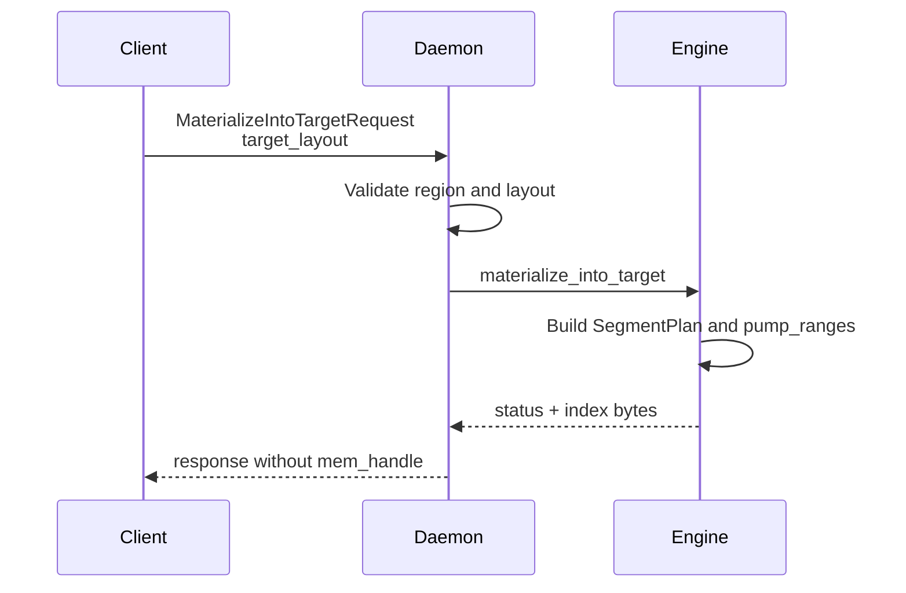
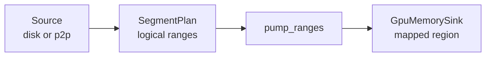

# Summary

Introduce a dedicated region-backed `tensor_dict_into` RPC (`MaterializeIntoTarget`) that streams artifact bytes directly into a client-registered CUDA region, bypassing daemon replica allocation and `mem_handle` export. Phase 1 requires `artifact_id`, COALESCED single-storage, and a full logical layout (no subset); `disk_fallback` is a source hint only. External-target verification is deferred. The daemon reuses the existing materialization dataplane (sources, sinks, pump) but writes into an external GPU region and releases region refs after completion. Region-backed mode applies only to `tensor_dict_into` / `tensor_into` / `get_into`; `get` / `get_view` always use the existing daemon-owned replica path.

# Goals / Non-Goals

## Goals
1. Provide a dedicated, long-lived RPC for region-backed get-into that does not rely on `mem_handle`.
2. Zero extra VRAM on the daemon for region-backed targets.
3. Keep IPC handle count minimal (typically one region handle plus a compact offset table).
4. Reuse the existing daemon data-path abstractions (sources, sinks, buffer pools, pump).
5. Reject any region-backed layout whose logical space does not match the target layout.

## Non-Goals
- Replace `tensor_dict()` or `get()` flows (they continue to materialize a daemon-owned replica).
- Apply `region_backed_mode` to `get` / `get_view` or change their semantics; those calls always use the daemon-owned replica path.
- Enable cross-node GPU direct write (RDMA into client GPU) beyond current infrastructure.
- Support arbitrary strided targets in the first release; non-contiguous tensors fall back.
- Support subset materialization for region-backed targets (`tensor_names` / `view_subset_hash` are deferred).
- Introduce Global Store schema changes or replica tracking for `tensor_dict_into` targets.
- Support multi-storage COALESCED layouts or any TENSOR_TABLE layout in this phase.
- Perform verification for external targets in Phase 1.

## Phase 1 Scope
- Artifact identity must be `artifact_id` (key-based requests are reserved for a later phase).
- `disk_fallback` may be provided as a source hint but never as the sole identity.
- `index_kind=CANONICAL` only; `INDEX_KIND_VIEW` is deferred to Phase 2.
- View-based requests (`view` / `view_id`) are not supported for region-backed targets.
- Subset selection is not supported: `tensor_names` / `view_subset_hash` must be empty, and the layout must cover the full canonical byte space.
- `device_uuid` is required and authoritative; `device_id` is treated as a local ordinal only.
- `region_backed_mode` is consulted only by `tensor_dict_into` / `tensor_into` / `get_into`; `get` / `get_view` ignore it.

# Current State

`tensor_dict_into` currently materializes a daemon-owned replica, exports a single IPC handle, and lets the client copy into target tensors before calling `UnloadReplica`. The v2 materialization path expects `mem_handle` on completion, so there is no RPC that writes directly into client regions. Region-backed registration exists for LIP and transport locks but is not used by `tensor_dict_into`.

# Architecture & Interfaces

## Target Layout and Data Organization

Region-backed `tensor_dict_into` needs a compact description of where each tensor should land inside one or more registered regions. The layout is defined in a **logical byte space** anchored to the canonical or view index; the daemon maps that logical space onto region-backed storages.

### Logical Byte Space
- The logical destination offsets are canonical (or view) offsets, not raw region offsets.
- Each tensor defines a contiguous logical range; the layout maps that range to a storage
  and then to a region base pointer.
- This keeps the pump interface stable: it only sees logical offsets, and a sink maps
  logical offsets to the underlying region and device pointer.
- The logical total size is defined as `max(offset + logical_length)` across the canonical
  (or view) index entries, not the sum of lengths; COALESCED storages must span this size.

**TargetLayout** (new v2 wrapper message)
- `repeated tensorcast.daemon.v2.StorageEntry storages`
- `repeated tensorcast.daemon.v2.TensorAlias aliases`
- `repeated TargetTensorOffset offsets`
- `enum LayoutKind { LAYOUT_KIND_COALESCED_UNSPECIFIED = 0; LAYOUT_KIND_TENSOR_TABLE = 1; }`
- `LayoutKind layout_kind`
- `enum IndexKind { INDEX_KIND_CANONICAL_UNSPECIFIED = 0; INDEX_KIND_VIEW = 1; }`
- `IndexKind index_kind`
- `string view_id` (required when index_kind is VIEW)
- `enum TensorSpecKind { TENSOR_SPEC_KIND_ALIAS_UNSPECIFIED = 0; TENSOR_SPEC_KIND_OFFSETS = 1; }`
- `TensorSpecKind tensor_spec_kind`
- `bytes logical_layout_hash` (optional, for diagnostics; Phase 1 does not require it)

**TargetTensorOffset** (new v2 message)
- `name`, `storage_id`, `storage_offset`, `logical_length`

**StorageEntry** (existing, v1)
- `storage_id`, `device_id`, `storage_length`
- `vram_region_id` (required for region-backed target)
- `mapping_base_offset` (required)

**TensorAlias** (existing, v1)
- `name`, `storage_id`, `storage_offset`, `logical_length`
- `shape`, `stride`, `dtype`

The **offset table** maps each tensor's logical offset to a region offset:
`logical_offset (canonical or view) -> region_id + mapping_base_offset + storage_offset`.

### Layout Compaction
- `TENSOR_SPEC_KIND_OFFSETS` sends only `TargetTensorOffset` entries; dtype/shape/stride come
  from the canonical or view index to avoid duplication.
- `TENSOR_SPEC_KIND_ALIAS_UNSPECIFIED` is a verbose mode (debug or compatibility) that duplicates the
  index metadata in `TensorAlias`.

### Logical Layout Hash (Phase 1 optional)
`logical_layout_hash` is a SHA-256 digest over the logical byte space only:
- Derive it from canonical (or view) index bytes plus `index_kind`; prefer `index_multihash`
  when present to avoid re-hashing large indices.
- Exclude physical binding fields (`storage_id`, `vram_region_id`, `mapping_base_offset`,
  `storage_offset`) so the hash stays stable across region bindings.
- In Phase 1 the on-wire field is optional and diagnostic; SegmentPlan caching should
  key on `index_multihash` (or a locally computed `logical_layout_hash`) plus
  `generation`, not on physical layout.
- If a physical-binding hash is ever needed, define it separately (e.g., `binding_hash`)
  so it does not affect plan caching.

### Future: Selection Hash (Phase 2+)
When view/subset support is added, plan identity becomes:
`logical_layout_hash + selection_hash`. `selection_hash` encodes view identity and
subset selection (`view_id` or canonicalized `view` spec, plus `tensor_names` /
`view_subset_hash`) using a stable serialization. Phase 1 keeps selection empty and
does not implement this logic.

### Index Anchoring
- `index_kind=CANONICAL` means logical offsets are canonical offsets.
- `index_kind=VIEW` means logical offsets are view offsets; `view_id` or `view` must be
  present in the request to resolve the view plan.
- Phase 1 only supports `INDEX_KIND_CANONICAL_UNSPECIFIED`; `INDEX_KIND_VIEW` is reserved for Phase 2.

### Device Identity
- `device_uuid` is the authoritative device identity across processes.
- `device_id` is a local ordinal that may vary across processes; it is validated against
  the daemon-resolved UUID but is never used to establish identity on its own.
- SDKs must always populate `device_uuid` and treat any UUID mismatch as a hard error
  when `region_backed_mode=require`.

### Layout Modes
1. **COALESCED**: the target region is arranged in logical order (canonical or view).
   The daemon verifies `storage_offset == logical_offset` for each tensor, and a single
   storage entry spans the logical space (`storage_length == logical_total_size`). The `mapping_base_offset` acts as the base of
   the coalesced buffer slice in the region. This lets the pipeline stream ranges
   without extra scatter logic and reuse `pump_ranges`.
   COALESCED implies the storage covers the full logical space and includes every tensor
   in the canonical index; packed subset layouts are not supported in Phase 1.

`TENSOR_TABLE` is reserved for a future extension. For now, any non-COALESCED layout
or multi-storage layout is rejected with `INVALID_ARGUMENT`.

## SDK: Client-Side Shape and Validation

The SDK preserves `tensor_dict_into` semantics by validating targets before any
daemon-side write. It builds a `TargetLayout` only when all of the following are true:
- The request uses `artifact_id` (Phase 1 does not support key-based targets).
- Every target tensor is CUDA and on the selected device.
- Every target storage is fully covered by a registered region in the client cache.
- Every target tensor is contiguous (or matches a supported contiguous stride pattern).
- The canonical index is available to compute offsets (view index support is deferred).
- Subset selection is disabled: `tensor_names` / `view_subset_hash` must be empty (or
  `tensor_names` must include all canonical names) and the layout must cover the full
  logical byte space.
- Phase 1 rejects view requests (`view` / `view_id`) for region-backed targets.
- `device_uuid` is required and treated as authoritative for device identity; `device_id`
  is carried only as a local ordinal and must match the daemon-resolved UUID.
- The SDK assumes region-backed `MaterializeIntoTarget` support; fallback is still
  controlled by `region_backed_mode`.

**Construction steps**
1. Resolve artifact identity and fetch canonical index bytes (already cached).
2. Parse the canonical index and compute `logical_total_size = max(offset + logical_length)`;
   `logical_length` reflects storage segments (max alias length), not a sum of tensor sizes.
3. Validate target dtype/shape/stride against the canonical index without relying on
   daemon-provided tensors, and ensure the target covers every canonical entry.
4. Enforce subset rules: `tensor_names` must be empty (or include all canonical names)
   and `view_subset_hash` must be empty for Phase 1.
5. Group target tensors by storage; assign deterministic `storage_id` (e.g., hash of base
   pointer + size).
6. For each storage, find the covering region and compute `mapping_base_offset`.
7. Emit `StorageEntry` records with `vram_region_id`, `mapping_base_offset`, and
   `storage_length == logical_total_size`.
8. Emit `TargetTensorOffset` records for each tensor with `storage_offset` and
   `logical_length` (use `TensorAlias` only when `tensor_spec_kind=ALIAS`).
9. Set `index_kind` to CANONICAL (VIEW is deferred to Phase 2).
10. Enforce COALESCED constraints:
   - `len(storages) == 1`
   - `storage_offset == logical_offset` for all tensors
   - `storage_length == logical_total_size`
   If any check fails, either fall back (when `region_backed_mode=auto`) or raise
   `INVALID_ARGUMENT` (when `region_backed_mode=require`).
11. Set `layout_kind = COALESCED` and optionally compute `logical_layout_hash` from
   canonical index bytes + `index_kind` (exclude any region binding). Selection hashing
   is reserved for Phase 2+.
12. Send `MaterializeIntoTarget` only if all constraints hold; otherwise fall back to
   normal `materialize + client copy`.

Phase 1 COALESCED layouts require a full canonical layout: the storage spans the full
logical byte space and every canonical tensor is present. Subset requests are rejected
by the region-backed path and fall back (or error) based on `region_backed_mode`.

Phase 1 does not support view-indexed layouts. If a view is requested and the client
cannot build a canonical layout, the SDK falls back or errors based on
`region_backed_mode`.

### Client API Surface
- `tensor_dict_into(...)`, `tensor_into(...)`, and `get_into(...)` use `MaterializeIntoTarget`
  when `region_backed_mode` allows and `artifact_id` is available (Phase 1). `get` /
  `get_view` always use the existing daemon-owned replica path and ignore
  `region_backed_mode`.
- Region-backed paths require full materialization. If callers pass `tensor_names` that
  do not include all canonical tensors, the SDK must not invoke `MaterializeIntoTarget`
  (fallback in `auto`, error in `require`).
- Region-backed results use a dedicated SDK return type (no `mem_handle`, no
  `UnloadReplica`) to avoid mixing into-target semantics with legacy payloads.
- `get_into_async.cancel()` returns `False` once a region-backed transfer has started;
  before start, the SDK may fall back to the legacy path if `region_backed_mode=auto`.
- `region_backed_mode` is defined via the unified runtime config system. In Phase 1 it
  is read only by into paths; a future API split introduces `GetIntoOptions` /
  `TargetSpec` so into-specific options do not affect `get`.
- When `region_backed_mode=require`, the SDK errors instead of falling back.

### Capabilities and Config Integration
- Extend `ClientConfig.defaults` with `region_backed_mode` so the default path is
  driven by the unified runtime config system.
- `region_backed_mode` defaults to the configured value and can be overridden per call,
  but into paths are the only consumers until `GetIntoOptions` is introduced.

## RPC Changes (v2)

Add a dedicated RPC to `proto/tensorcast/daemon/v2/store_daemon.proto`:

```proto
service StoreDaemonService {
  ...
  rpc MaterializeIntoTarget(MaterializeIntoTargetRequest) returns (MaterializeIntoTargetResponse) {}
}

message MaterializeIntoTargetRequest {
  oneof artifact_ref {
    string artifact_id = 1;
    string key = 2; // reserved for Phase 2
  }
  DiskFallbackHint disk_fallback = 3; // optional source hint, not identity

  TargetLayout target_layout = 4;
  int32 pid = 5;
  string device_uuid = 6;

  tensorcast.daemon.v2.SourcePreference preference = 7;

  // Selective materialization (reserved for Phase 2)
  repeated string tensor_names = 8;
  bytes view_subset_hash = 9;

  oneof view_identity {
    tensorcast.daemon.v2.ViewSpec view = 1001;
    string view_id = 1002;
  }

  tensorcast.daemon.v2.TransformPlacement placement = 1003;
}

message MaterializeIntoTargetResponse {
  string artifact_id = 1;
  tensorcast.daemon.v2.MaterializeReplicaStatus status = 2;
  tensorcast.daemon.v2.MaterializationSource source = 3;
  bytes canonical_index_bytes = 4;
  ViewSubset view_subset = 5;
  bytes view_index_bytes = 6;
  uint64 generation = 7;
}

```

When `MaterializeIntoTarget` is used:
- The daemon writes directly into the provided regions.
- `mem_handle` is not returned.
- `canonical_index_bytes` (and `view_index_bytes` when available) are returned for validation.
- Phase 1 requires `artifact_id` and treats `disk_fallback` as a source hint only.
- Phase 1 rejects key-based requests, `tensor_names` / `view_subset_hash`, `index_kind != CANONICAL`,
  `layout_kind != COALESCED`, `len(storages) != 1`, or `storage_length != logical_total_size`
  with `INVALID_ARGUMENT`.
- `device_uuid` must be present and resolves the target device; `device_id` is validated
  against the resolved UUID but is not authoritative across processes.
- Phase 1 is synchronous; there is no transfer ticket or async completion.

## Examples

### Example A: COALESCED canonical, single region (supported)

Canonical index (JSON, simplified):

```json
{
  "w1": [0, 1024, [256], [1], "float16", 0],
  "w2": [1024, 2048, [1024], [1], "float16", 0]
}
```

Target layout (compact offsets):

```text
target_layout {
  storages: {
    storage_id: "s0"
    device_id: 0
    vram_region_id: "region:0001"
    mapping_base_offset: 0
    storage_length: 3072
  }
  offsets: [
    { name: "w1", storage_id: "s0", storage_offset: 0,    logical_length: 1024 },
    { name: "w2", storage_id: "s0", storage_offset: 1024, logical_length: 2048 }
  ]
  layout_kind: COALESCED
  index_kind: INDEX_KIND_CANONICAL_UNSPECIFIED
  tensor_spec_kind: TENSOR_SPEC_KIND_OFFSETS
}
```

`storage_offset == logical_offset` and a single storage spans the logical space, so
the daemon uses `pump_ranges` with a SegmentPlan derived from the canonical index.

### Example B: COALESCED view, single region (planned, Phase 2)

Phase 1 rejects `INDEX_KIND_VIEW`.

Canonical index (JSON, simplified):

```json
{
  "k": [0, 4096, [1024], [1], "float16", 0],
  "q": [4096, 4096, [1024], [1], "float16", 0]
}
```

View index for `view:swap` (JSON, simplified) reorders `q` then `k`:

```json
{
  "q": [0, 4096, [1024], [1], "float16", 0],
  "k": [4096, 4096, [1024], [1], "float16", 0]
}
```

Target layout (view-indexed, still COALESCED):

```text
target_layout {
  storages: {
    storage_id: "s0"
    device_id: 0
    vram_region_id: "region:0002"
    mapping_base_offset: 0
    storage_length: 8192
  }
  offsets: [
    { name: "q", storage_id: "s0", storage_offset: 0,    logical_length: 4096 },
    { name: "k", storage_id: "s0", storage_offset: 4096, logical_length: 4096 }
  ]
  layout_kind: COALESCED
  index_kind: INDEX_KIND_VIEW
  view_id: "view:swap"
  tensor_spec_kind: TENSOR_SPEC_KIND_OFFSETS
}
```

Logical offsets follow the view index, so `storage_offset == logical_offset` still holds.

### Example C: Unsupported layouts (error)

Case 1: offsets do not match logical space:

```text
offsets: [
  { name: "q", storage_id: "s0", storage_offset: 8192, logical_length: 4096 }
]
```

Case 2: multiple storages:

```text
storages: [ { storage_id: "s0", ... }, { storage_id: "s1", ... } ]
```

Both cases are rejected with `INVALID_ARGUMENT` because only COALESCED single-storage
layouts are supported.

## Daemon Pipeline Integration

The daemon controller should remain thin: it validates inputs and delegates to a
new `StoreEngine::materialize_into_target` entrypoint (via `MaterializationFacade`)
so the data-path stays in core and shares scheduling, buffer pools, and loaders.

### Validation
`MaterializationController` validates:
- `artifact_id` is present (Phase 1 rejects key-based requests and disk-only requests).
- `target_layout` is present and non-empty.
- `target_layout.storages` are region-backed (no inline handles).
- `device_uuid` is present and resolves to a device; each storage entry `device_id`
  matches the resolved UUID (device_id is not authoritative across processes).
- `layout_kind == COALESCED` and `len(storages) == 1`.
- `mapping_base_offset + storage_length <= region.size_bytes`.
- `owner_pid` matches the session (via `IpcRegionRegistry::acquire`).
- Region is not poisoned (fail fast if the registry marks the region as invalid).
- `TensorAlias` or `TargetTensorOffset` matches canonical entry (length, name).
- `tensor_names` and `view_subset_hash` are empty in Phase 1.
- `view` / `view_id` are not set (Phase 1 rejects view materialization).
- `index_kind == INDEX_KIND_CANONICAL_UNSPECIFIED` (Phase 1 rejects view layouts).
- For COALESCED, `storage_offset == logical_offset` for all entries.
- For COALESCED, the storage table spans the logical space (`storage_length == logical_total_size`).

### Coalesced Data Path
For COALESCED layouts, the logical offsets match the destination offsets. The daemon:

- Builds a SegmentPlan from the canonical (Phase 1) or view (Phase 2) index that spans
  the full logical byte space.
- Uses `pump_ranges` to stream the logical ranges directly into the region-backed sink.
- Avoids any scatter plan or additional copy-plan machinery.

### External GPU Target
Introduce an external GPU target in the materialization pipeline:
- Bypass `AllocationStage` and `HandleStage`; no daemon-owned replica or IPC export.
- Open the single region IPC handle and pass `gpu_base_ptr = region_base + mapping_base_offset`
  into `GpuMemorySink`, with `total_size = logical_total_size` to enforce a full copy.
- Acquire the region via `IpcRegionRegistry::acquire` to extend TTL and enforce ownership,
  then release on completion to decrement the refcount.
- Phase 1 skips verification for external targets (TODO: add plan-based verification
  via `compute_data_multihash_from_gpu_plan`).
- Region-backed ignores `enable_verification`; do not start `_monitor_verification`, and
  emit `verification_skipped` metrics.
- If transfer starts and later fails, mark the region as poisoned so further writes are
  rejected until the client unregisters and re-registers the region.

Region refs are released immediately after the copy completes.

Implementation note: extend `IpcRegionRegistry` to track region state
(active/poisoned) alongside refcounts; `UnregisterVramRegion` clears poison.

### Fast Paths and Caching
- **Local replica copy (deferred)**: copy from an existing local replica into the target
  region once a range-based GPU→external target copy helper exists. Phase 1 always streams
  via loaders/pump, even when a local replica is present.
- **SegmentPlan cache**: cache `logical_layout_hash` (or `index_multihash`) + `generation`
  to reuse computed plans across calls; exclude physical binding fields.
- **IPC mapping cache**: reuse `cuda::IpcMapping` per region for the duration of a request
  batch to avoid repeated open/close overhead.

## Control Flow





# Invariants & Error Model

## Invariants
- Only region-backed storages are accepted (no inline IPC handles).
- Every tensor in the request maps to a canonical or view entry by name.
- Writes are bounded to the declared storage length and region size.
- When `layout_kind=COALESCED`, `storage_offset == logical_offset` and the storage spans the logical space.
- Phase 1 requires full canonical coverage; subset requests are rejected.
- Phase 1 requires `index_kind=CANONICAL` and skips verification for external targets.
- Phase 1 requires `artifact_id`; `disk_fallback` is a source hint only.
- `device_uuid` is authoritative for device identity; `device_id` is validated but not trusted across processes.
- Region references are held for the duration of the transfer only.
- Region-backed transfers are non-cancelable once the pump starts; daemon-side cancellation
  checks only occur before transfer to avoid partial writes.
- `tensor_spec_kind` determines which tensor table is authoritative.

## Idempotency & Retry Semantics
- `MaterializeIntoTarget` is not idempotent; failures can leave partial writes in the
  target region.
- Callers must treat target bytes as undefined on any error; region-backed failures mark
  the target region as poisoned and are non-retryable for that region until it is
  re-registered.
- SDKs must mark region-backed failures as non-retryable (`retryable=false`).
- `region_backed_mode=require` must surface failures to the caller (fatal to the request);
  optional fatal-exit behavior, if desired, must be wired through the unified config.

## Error Mapping
- `INVALID_ARGUMENT`: missing layout entries, dtype/shape mismatch, both region and
  handle fields set, tensor_spec_kind mismatch, non-COALESCED layout, multiple storages,
  key-based requests, missing `artifact_id`, `disk_fallback` without `artifact_id`,
  missing/invalid `device_uuid` or device mismatch, `tensor_names` / `view_subset_hash` set,
  `index_kind != CANONICAL`, view identity set, non-full layouts, or `tensor_names`
  mismatch (Phase 1).
- `FAILED_PRECONDITION`: region not found, region poisoned, TTL expired, owner_pid mismatch,
  bounds violation, or non-contiguous targets when required.
- `DATA_LOSS`: transfer started but failed (partial writes possible); retryable=false.
- `CANCELLED`: client cancellation before transfer start (no bytes written).
- `RESOURCE_EXHAUSTED`: pinned buffer pool exhausted.

## Observability
- Daemon counter: `tc_store_materialize_into_target_total{result,reason,source}` where
  `reason` is low-cardinality (layout_mismatch, region_missing, ttl_expired,
  owner_pid_mismatch, bounds, non_contiguous, capability_missing, subset_not_supported,
  device_uuid_mismatch, region_poisoned, transfer_failed).
- SDK counters:
  - `tc_store_region_backed_fallback_total{reason}`
  - `tc_store_region_backed_verification_skipped_total`
- SDK reuses `tc_store_operation_latency_seconds` with `selection=region_backed|fallback`
  to keep latency trends visible alongside legacy paths.

# Schema Changes

Proto API changes only (new v2 RPC and messages); `schema.sql` is unchanged. Breaking
updates are acceptable in this pre-launch phase.

# Trade-offs & Risks

- **COALESCED single-storage only**: simplifies implementation but rejects multi-storage
  or packed layouts. Mitigate by retaining fallback and reserving TENSOR_TABLE for a
  later design.
- **Non-contiguous tensors**: strided layouts are deferred. SDK must detect and fall
  back to the current path to preserve semantics.
- **No external-target verification in Phase 1**: integrity checks are skipped for
  region-backed writes. Mitigate by adding plan-based verification in Phase 2 and
  instrumenting a metric that flags verification skips.
- **Retry behavior**: region-backed failures poison the region and are non-retryable
  until the region is re-registered.
- **Plan caching**: stale cache entries must be invalidated on generation changes.
- **Compact offsets**: reduced on-wire metadata shifts more validation to the index;
  debugging may require optional alias mode.

# Compatibility & Acceptance Criteria

## Compatibility
- Compatibility is not a primary constraint pre-launch; proto changes may be breaking.
- Region-backed writes use `MaterializeIntoTarget`; existing get/get_into paths remain
  available but are not extended with `target_layout`.
- `region_backed_mode` affects only into paths; `get` / `get_view` remain unchanged.

## Acceptance Criteria
- Daemon VRAM usage does not exceed target region size during `tensor_dict_into`.
- IPC handle count per `tensor_dict_into` is limited to region handles only.
- Phase 1 skips external-target verification and reports the skip via metrics.
- Observability: new counters for region-backed get-into success/failure and fallback
  reasons (no region, non-contiguous, layout mismatch).
- Region-backed transfers are non-cancelable once started; failures mark the region
  poisoned and return `DATA_LOSS`/`FAILED_PRECONDITION` (non-retryable).
- Key-based requests or `INDEX_KIND_VIEW` return `INVALID_ARGUMENT` in Phase 1.
- Subset layouts or non-full `tensor_names` return `INVALID_ARGUMENT` in Phase 1.
- Non-COALESCED or multi-storage layouts return `INVALID_ARGUMENT`.

# Naming Compliance

Proposed API and type names follow repository conventions:
- **Proto messages**: `TargetLayout`, `TargetTensorOffset` (PascalCase)
- **Proto messages**: `MaterializeIntoTargetRequest`, `MaterializeIntoTargetResponse` (PascalCase)
- **Proto fields**: `target_layout`, `layout_kind`, `mapping_base_offset` (snake_case)
- **RPCs**: `MaterializeIntoTarget` (PascalCase)
- **C++ functions**: `materialize_into_target` (snake_case)
- **Python types**: `RegionBackedMode`, `TargetLayout` (PascalCase)
- **Constants/enums**: `LAYOUT_KIND_COALESCED_UNSPECIFIED` (ALL_CAPS for generated enum values)

# References

- `docs/architecture/api/region-backed.md`
- `docs/internals/tensor_dict_into_dataflow.md`
- `core/store/materialization/dataplane/runtime/pump.h`
- `daemon/service/controllers/materialization_controller.cc`
