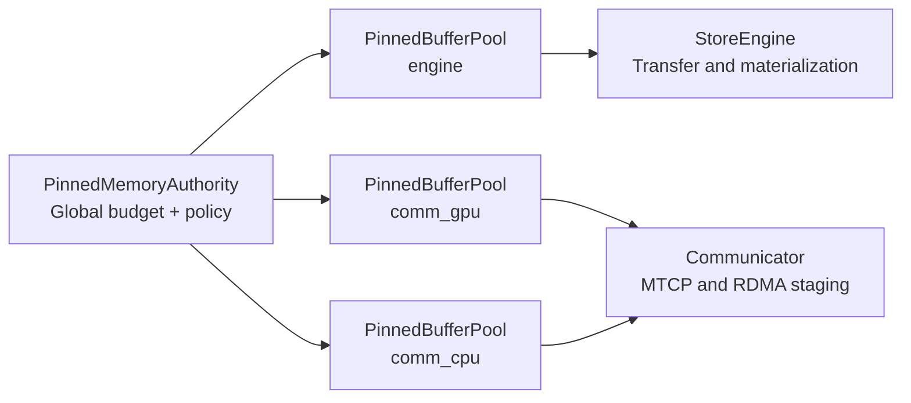

# Summary

Unify all daemon-side pinned memory usage behind a single Pinned Memory Authority (PMA) that owns pinned memory budgets and exposes named, per-class pinned pools. Replace per-component pool sizing with a single `pinned_memory` budget and a small set of size classes (each class has a fixed `slice_bytes`). Remove redundant pool fields from runtime config, make pinned allocation behavior consistent across components, and route daemon-owned streaming flows through the shared authority so pinned memory reuse is real (not per-component).

# Problem Statement

- Pinned memory is split across multiple component-owned pools, which causes oversubscription, uneven backpressure, and no true reuse between subsystems.
- Configuration is fragmented across `engine.*` and `communicator.pool.*`, which leads to tuning drift and unclear ownership.
- The SDK's local disk save/load helpers historically allocated pinned memory via per-call configuration rather than daemon runtime config, which made it easy to misinterpret pinned budgeting and ownership.
- RDMA preregistration scales with per-slice registration today, which is expensive and opaque to operators.
- Allocation timeouts and logging are inconsistent, making stalls hard to diagnose and recover from.

# Goals / Non-Goals

## Goals

- Single pinned memory authority in the daemon process that owns all pinned budgets and policies.
- Share pinned pages across StoreEngine and Communicator via the same authority, with per-class `slice_bytes`.
- Simplify configuration to one pinned budget and a small number of class definitions (no per-component pool sizing).
- Make pinned usage visible and enforceable with consistent backpressure, metrics, and diagnostics.
- Remove redundant pool fields and hard-coded streaming buffer depths.

## Non-Goals

- Cross-process pinned pool sharing. Full sharing is achieved by moving streaming into the daemon.
- Making test-only local disk helpers participate in daemon pinned budgeting. Test helpers may allocate pinned memory independently.
- Hot reload or dynamic schema merges beyond the single config file.
- Changing UMA chunk semantics or RDMA transport protocol details.
- NUMA-aware pinned pool routing beyond today's communicator `simple_numa` behavior. (Kept as a follow-up once the single authority is stable.)

# Architecture and Interfaces



## Core Components

- **PinnedMemoryAuthority**: validates pinned config and exposes named per-class pinned pools.
- **PinnedBufferPool (per class)**: fixed, preallocated slice pool sized to `pool_bytes` with `slice_bytes` slices.
- **StreamingPinnedBuffer**: streaming ring backed by a shared pinned pool (daemon: typically the `engine` class pool).

### PinnedMemoryAuthority API (Phase 1: fixed preallocated pools)

```cpp
class PinnedMemoryAuthority {
 public:
  struct ClassConfig {
    std::string name;
    size_t slice_bytes;
    size_t pool_bytes;
    bool rdma_preregister;
  };

  struct Config {
    size_t total_bytes;
    absl::Duration allocation_timeout;
    std::vector<ClassConfig> classes;
  };

  static absl::StatusOr<std::shared_ptr<PinnedMemoryAuthority>> create(Config cfg);
  // Returns InvalidArgument if class_name is unknown. Daemon startup validates
  // all required class names upfront.
  absl::StatusOr<std::shared_ptr<PinnedBufferPool>> get_class_pool(std::string_view class_name) const;
  absl::StatusOr<ClassConfig> get_class_config(std::string_view class_name) const;
};
```

### StreamingPinnedBuffer API sketch

```cpp
class StreamingPinnedBuffer {
 public:
  StreamingPinnedBuffer(size_t num_chunks, size_t chunk_size, std::shared_ptr<PinnedBufferPool> pool);
  absl::Status initialize(std::chrono::milliseconds timeout);
  absl::Status release();
};
```

## Allocation Model

This design chooses the simplest model: **Option B (per-class pools)**.

- PMA enforces a global pinned budget derived as `sum(pinned_memory.classes[].pool_bytes)` and owns a set of named class pools.
- Each class pool pre-allocates pinned memory up to `pool_bytes`, in one or more contiguous slabs (not per-slice `aligned_alloc`).
  - Each slab is registered once with CUDA (host pin) for its full length.
  - Slices are addressed as `slab_base + i * slice_bytes` and returned as pointers to slice bases.
- Phase 1: class pools are fixed-size and do not grow above `pool_bytes`.
- Allocation uses a bounded wait (timeout); if slices are unavailable by the deadline, return `absl::DeadlineExceeded`
  or `absl::ResourceExhausted` with diagnostics.
- **RDMA preregistration** is only applied to pinned pools that are used for RDMA and only for classes with `rdma_preregister=true`.
  - RDMA preregistration is only meaningful when `communicator.enable_rdma=true`. When RDMA is disabled, `rdma_preregister` is ignored.
  - RDMA preregistration applies to staged RDMA only (host-pinned staging buffers). Direct RDMA reads use device memory MRs and do not consume pinned staging pools.
  - For prereg classes, each slab is registered once per NIC/PD (not once per slice) so RDMA can use `base_ptr + offset` within the slab.
  - To keep preregistration stable and predictable in the initial cut, classes with `rdma_preregister=true` preregister the full `pool_bytes` reservation at startup.

## Configuration Model

Introduce a single pinned memory section with a small number of well-known class names. To minimize config surface area, components bind to these class names by convention (startup validates they exist).

- Communicator "chunk size" becomes the class `slice_bytes` for the class it uses (GPU staging vs CPU staging are separate classes).
- This design deliberately avoids introducing a second `chunk_bytes` concept inside a class; different chunk sizes are expressed as different classes.

### Proto schema sketch (normative)

```proto
message PinnedMemory {
  reserved 1;
  reserved "total_bytes";
  google.protobuf.Duration allocation_timeout = 2;
  repeated PinnedClass classes = 3;
}

message PinnedClass {
  string name = 1;
  uint64 slice_bytes = 2;
  uint64 pool_bytes = 3;
  reserved 4;
  reserved "min_bytes", "max_bytes";
  bool rdma_preregister = 5;
}
```

### Class bindings (normative)

The daemon validates that these well-known classes exist and are used consistently:

| Class name | Primary consumers | Purpose | RDMA preregistered? |
| --- | --- | --- | --- |
| `engine` | StoreEngine transfer + pump | Pinned transfer slices (`tx_slice_bytes`) used by streaming loads/copies | No |
| `comm_gpu` | Communicator staging | Host-pinned staging buffers backing MTCP and staged RDMA (GPU-side flows) | Optional (`rdma_preregister=true` only when `communicator.enable_rdma=true`) |
| `comm_cpu` | Communicator staging | Host-pinned staging buffers for CPU-side staging (and RDMA staging when applicable) | Optional (`rdma_preregister=true` only when `communicator.enable_rdma=true`) |

### Derived sizing and validation (normative)

The daemon must validate that pinned classes have enough capacity for the configured steady-state staging behavior.

- **Engine transfer**:
  - `engine.slice_bytes` is the canonical `tx_slice_bytes` (pinned transfer slice).
  - Require `engine.artifact_chunk_bytes % engine.slice_bytes == 0` so transfer slices never cross UMA chunk boundaries.
- **Communicator staging**:
  - Define `comm_gpu.slice_bytes` as the GPU staging chunk size.
  - Define `comm_cpu.slice_bytes` as the CPU staging chunk size.
  - When MTCP is enabled for GPU flows, Communicator requires a minimum number of GPU staging slices to cover:
    - one in-flight window per flow (`buffers_per_flow`)
    - plus receive-side buffers proportional to `transport.tcp_conn_count`
  - The implementation must fail fast at startup if `comm_gpu.pool_bytes` cannot satisfy the computed minimum slices, rather than blocking indefinitely on staging buffers.
- **Direct RDMA window chunking**:
  - Direct RDMA does not use pinned staging pools, but it still uses a chunk size for window segmentation (`direct_rdma_chunk_bytes` today).
  - To avoid reintroducing per-component chunk knobs, the initial cut sets `direct_rdma_chunk_bytes = comm_gpu.slice_bytes`. If a future tuning need emerges, add a separate pinned class (e.g., `comm_direct`) rather than reintroducing ad-hoc `direct_chunk_mb` fields.

### Startup validation checklist (normative)

- Required classes exist: `engine`, `comm_gpu`, `comm_cpu`.
- **Fixed-allocation mode (Phase 1):** all pinned pools are fully preallocated at daemon startup (no runtime growth).
  - Total pinned bytes is derived as `sum(classes[].pool_bytes)`.
- `classes[].slice_bytes % 4096 == 0` (page aligned; implies 512 B O_DIRECT alignment).
- `engine.artifact_chunk_bytes % engine.slice_bytes == 0`.
- `communicator.enable_rdma=false` ignores `rdma_preregister` (no preregistration performed).
- `comm_gpu.pool_bytes` and `comm_cpu.pool_bytes` cover minimum staging slices derived from `buffers_per_flow` and `transport.tcp_conn_count`.

### Defaulting rules

- If `pinned_memory` is present and `allocation_timeout` is unset, default to 30s.
- If `streaming_buffer_chunks` is unset, default to 16 (engine-owned streaming buffers).

```yaml
pinned_memory:
  # Derived total pinned bytes = sum(classes[].pool_bytes) = 9GB in this example.
  allocation_timeout: 30s
  classes:
    - name: engine
      slice_bytes: 256MB
      pool_bytes: 4GB
    - name: comm_gpu
      slice_bytes: 16MB
      pool_bytes: 4GB
      rdma_preregister: true
    - name: comm_cpu
      slice_bytes: 4MB
      pool_bytes: 1GB
      rdma_preregister: true

engine:
  artifact_chunk_bytes: 256MB
  streaming_buffer_chunks: 16

communicator:
  stager:
    buffers_per_flow: 4
```

## Naming Compliance

| Category | Names | Compliance |
| --- | --- | --- |
| Classes | `PinnedMemoryAuthority`, `PinnedBufferPool`, `StreamingPinnedBuffer` | PascalCase |
| Methods | `get_class_pool`, `get_class_config`, `allocate`, `deallocate`, `list_buffers`, `list_slabs`, `slice_bytes` | snake_case |
| Constants | `kMemoryAlignment`, `kDirectIOAlignment` | `k` prefixed const per core C++ style |

# Invariants and Error Model

- **Fixed-allocation mode (Phase 1):** total pinned bytes is derived as `sum(classes[].pool_bytes)` and pinned pools are fully preallocated at startup.
- Each class `slice_bytes` must be a multiple of 4096 bytes (page aligned; implies 512 B alignment required by O_DIRECT).
- `engine.artifact_chunk_bytes` must be a multiple of `pinned_memory.classes[name=engine].slice_bytes` so each artifact chunk is composed of an integral number of transfer slices and transfer ranges never cross chunk boundaries.
- Communicator staging chunk size equals `pinned_memory.classes[name=comm_gpu].slice_bytes` (GPU staging) and `pinned_memory.classes[name=comm_cpu].slice_bytes` (CPU staging).
- UMA capacity deductions use total pinned bytes (`sum(pinned_memory.classes[].pool_bytes)`) as the conservative pinned reservation.
- Allocation timeouts return `absl::ResourceExhausted` with diagnostics (class name, requested slices, free slices).
- Invalid config returns `absl::InvalidArgumentError` and fails startup.

### Error and log expectations

- Pinned budget exhausted: `absl::ResourceExhaustedError` with class name and requested slice count.
- Deadline exceeded: `absl::DeadlineExceededError` with waiters/free/total slices.
- Misalignment or missing classes: `absl::InvalidArgumentError` with the offending field.
- Periodic stall logs include class name, waiters, free/total slices, and deadline.

## Backpressure and deadlock avoidance (required)

Pinned allocation stalls are one of the most operationally painful failure modes. To make issues diagnosable and to avoid thread-pool starvation deadlocks:

- **No unbounded waits.** Any wait for pinned slices must be bounded by `pinned_memory.allocation_timeout` (or a tighter call-site deadline).
- **Avoid blocking cpu_executor()/serial_executor().** Call sites must not perform bounded waits on shared CPU executors; if a wait is required, do it on a dedicated blocking context.
- Sustained waits emit periodic "no progress" warnings including: class, waiters, free/total slices, and deadline.
- If deadlines expire, return `absl::ResourceExhausted` or `absl::DeadlineExceededError` (depending on call site) and include the same diagnostics in the status message.
- Cleanup paths must be ops-safe: release/shutdown of shared streaming buffers and pools must return an error status (never `LOG(FATAL)` in production code paths).

### MTCP staging (daemon: Communicator)

To ensure the configured deadline actually applies, MTCP staging must not block inside `MemoryStager::stage()` when pinned buffers are exhausted:

- `MemoryStager::stage(..., StageMode::kTry)` returns `Unavailable/ResourceExhausted` when no staging buffers are available.
- The MTCP staging loop owns the wait policy (backoff + deadline) and must bound retries by `pinned_memory.allocation_timeout`.
- On deadline expiry, the request fails with a diagnosable `ResourceExhausted` error (rather than hanging indefinitely).

## Observability (required)

Expose, at minimum:

- Per-class: `capacity_slices`, `in_use_slices`, `free_slices`, `waiters`, `acquire_timeouts_total`.
- Global: `pinned_total_bytes`, `pinned_committed_bytes` (sum of class allocations), and `pinned_budget_exhausted_total`.
- If `rdma_preregister=true`: per NIC/PD preregistered bytes and preregistration latency/failures.

### Metric naming and labels (normative)

To keep dashboards and alerts stable across implementations, metrics should use a single `class` label and avoid per-caller high-cardinality labels.

- Per-class (labels: `{class}`):
  - `tc_pinned_class_capacity_slices`
  - `tc_pinned_class_in_use_slices`
  - `tc_pinned_class_free_slices`
  - `tc_pinned_class_waiters`
  - `tc_pinned_class_acquire_timeouts_total{class}`
- Global (no `class` label):
  - `tc_pinned_total_bytes`
  - `tc_pinned_committed_bytes`
  - `tc_pinned_budget_exhausted_total`
- RDMA preregistration (labels: `{class, nic, pd}` or `{class, nic}` if PD is not enumerable safely):
  - `tc_pinned_rdma_prereg_bytes`
  - `tc_pinned_rdma_prereg_failures_total`
  - `tc_pinned_rdma_prereg_latency_ms` (histogram)

# Operational guidance

## Sizing heuristics

- Start with `engine.slice_bytes == engine.artifact_chunk_bytes` to minimize chunk splits during transfer.
- For communicator staging, ensure `comm_gpu.pool_bytes >= (buffers_per_flow + transport.tcp_conn_count) * comm_gpu.slice_bytes`.
- For preregistered classes, keep `pool_bytes` stable to bound RDMA registration time.

## Diagnostic checklist

- If staging stalls, inspect `tc_pinned_class_waiters` and `tc_pinned_class_free_slices` for the class in use.
- If preregistration is slow or failing, confirm RDMA is enabled and class budgets are fixed.
- If UMA capacity shrinks unexpectedly, verify total pinned bytes (`sum(pinned_memory.classes[].pool_bytes)`) against host DRAM sizing and tier config.

# Schema Changes

- Add `PinnedMemory` to `DaemonConfig`.
- Use `PinnedClass.pool_bytes` as the per-class pinned pool capacity (replaces `min_bytes`/`max_bytes` in Phase 1 fixed-allocation).
- Add `engine.streaming_buffer_chunks`.
- Remove `engine.mem_pool_size_bytes`, `engine.tx_slice_bytes`, `engine.pinned_allocation_timeout`, `engine.streaming_buffer_max_concurrent_sessions`.
- Remove `communicator.pool`, `communicator.stager.stage_chunk_mb_gpu`, `communicator.stager.stage_chunk_mb_cpu`, and `communicator.stager.direct_chunk_mb` from `CommunicatorConfig`.
- No `schema.sql` changes.

# Alternatives and rationale

- Chosen: per-class pinned pools with slab allocation (simplest mental model, stable ops surface, predictable preregistration bounds).
- Rejected: single arena with variable-size extents (fragmentation/compaction complexity and harder debugging).
- Rejected: adding `chunk_bytes` sub-slicing inside a class (reintroduces multiple knobs and makes stalls/leaks harder to diagnose; different chunk sizes are expressed as separate classes such as `comm_gpu` and `comm_cpu`).

# Migration strategy

- Replace `PinnedBufferPool` creation sites with `PinnedMemoryAuthority` class pools.
- Replace per-component streaming buffers with `StreamingPinnedBuffer` backed by a class pool.
- If an older streaming buffer type must temporarily coexist, rename it to `LegacyStreamingPinnedBuffer` and document its deletion in the paired plan.

# Trade-offs & Risks

- Implementation complexity increases due to shared allocation and class accounting.
- Size-class fragmentation is bounded within each class (fixed-size slices); poor class sizing can still waste budget.
- RDMA preregistration cost moves to class level and must be bounded by class reservation; preregister only RDMA-used classes.
- Communicator staging chunk tuning is done via the `comm_gpu`/`comm_cpu` class `slice_bytes` rather than separate stage-chunk fields.
- Test-only local disk helpers remain separate by design.

# Compatibility and Acceptance Criteria

- No backward compatibility. Legacy pool fields are removed and rejected.
- Acceptance criteria:
  - Only one PMA exists in the daemon; all daemon-owned pinned allocations are mediated by it.
  - StoreEngine and Communicator allocate from PMA class pools.
  - Configuration uses `pinned_memory` only; per-component pinned pool sizing fields do not exist.
  - Communicator uses `comm_gpu` and `comm_cpu` classes for staging; RDMA prereg only applies to RDMA-used classes.
  - UMA budget uses total pinned bytes (`sum(pinned_memory.classes[].pool_bytes)`) for capacity deduction.
  - Metrics expose per-class pinned usage and global pinned usage; pinned allocation stalls are diagnosable from metrics/logs alone.

## SDK local disk helpers (test-only)

Local disk save/load utilities are intentionally **test-only** and are not part of the daemon's pinned memory budgeting:

- Test API surface: `tensorcast.testing.io_disk.save_dict()` / `tensorcast.testing.io_disk.load_dict_from_disk()`.
- Internal implementation: `tensorcast.api._io_disk` functions are guarded and require an internal escape hatch to call.

This keeps daemon pinned ownership unambiguous: production persistence and materialization are daemon-routed (see `docs/architecture/api/materialization-flow.md`).

# References

- `docs/designs/0004-unified-runtime-config.md`
- `docs/architecture/api/materialization-flow.md`
- `core/store/README.md`
- `core/communicator/README.md`
