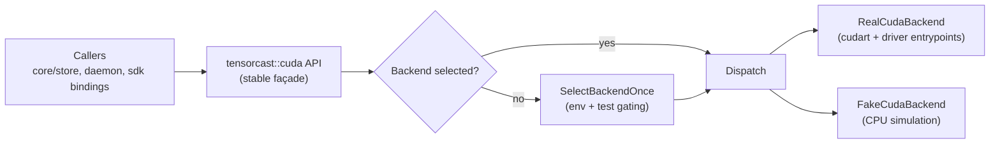
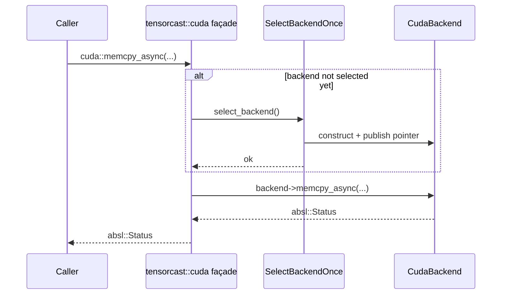

# Summary

Replace TensorCast’s **compile-time** FakeCuda/RealCuda split (`USE_FAKE_CUDA` + Bazel `--define use_fake_cuda=true`) with a **single binary** that supports both backends, selected at **runtime**.

Key changes:
- **Backends**: `real` (default) and `fake` (test-only). `fake` is enabled only via an explicit environment variable and emits an unmistakable warning log.
- **No conditional compilation for fake/real**: remove the `USE_FAKE_CUDA` macro branching in code; keep feature differences behind a runtime backend boundary.
- **Lazy NVRTC**: refactor GPU hashing to load NVRTC and (driver) module APIs lazily at runtime, inspired by PyTorch’s `LazyNVRTC` pattern.

This design assumes **Linux-only** and **CUDA Toolkit 12.4+** (`CUDA_VERSION >= 12040`).

Important: TensorCast will continue to **always link and depend on** the CUDA Runtime (`libcudart.so`). “CPU-only” in this design means **no NVIDIA driver / no GPU / no NVRTC present**, while still having the CUDA runtime available so the single binary can load and the fake backend can run.

## Implementation Status (2026-01-02)

- Runtime backend selection and dispatch live in `core/cuda/cuda_backend.cc`, with test-only gating and the error banner; fake/real are compiled together via `core/cuda/BUILD`.
- Driver entrypoints are centralized in `core/cuda/cuda_driver_api.{h,cc}` and NVRTC is lazy-loaded via `core/cuda/lazy_nvrtc.{h,cc}` + `core/cuda/dynamic_library.{h,cc}`.
- NVRTC GPU hashing now falls back to CPU hashing when unavailable in `core/common/artifact_hash_gpu.cc`.
- Call-site runtime behavior replaces `#ifdef USE_FAKE_CUDA` in `core/checkpoint/checkpoint.cc`, view executors, and `tensorcast/csrc/checkpoint_py.cc`.
- Backend selection tests are covered in `core/cuda/cuda_backend_selection_test.cc` (includes fake-mode driver-load guard).
- Validated on a CUDA-enabled host with `bazel test //core/... --verbose_failures --test_tag_filters="-stress,-rdma,-multi_gpu" --test_output=errors --test_summary=detailed` (all tests passed; Bazel noted size-filter warnings).

## Runtime dependency model (Linux)

- Always required (all backends): `libcudart.so`
- Optional (real backend only; used via `DriverApi`): NVIDIA driver (`libcuda.so.1`)
- Optional (real backend only; used via `LazyNvrtc`): NVRTC (`libnvrtc.so.12` or `libnvrtc.so`)

## Baseline enforcement

We should enforce the toolkit baseline at compile time in the CUDA backend implementation layer:
- `static_assert(CUDA_VERSION >= 12040, "TensorCast requires CUDA Toolkit 12.4+");`

This keeps the codebase honest about the supported surface and avoids accidentally depending on older-toolkit behavior.

# Problem Statement

The current approach makes FakeCuda an alternate *build* rather than an alternate *runtime mode*:
- Header-level type splitting (`core/cuda/cuda_api.h:14`) creates ongoing maintenance burden and semantic drift.
- Multiple call sites compile different behavior under `#ifdef USE_FAKE_CUDA` (e.g., `core/checkpoint/checkpoint.cc:462`, `core/store/materialization/dataplane/view/view_transform_executor.cc:56`), making it hard to reason about correctness and test coverage.
- GPU hashing duplicates driver loading logic and hard-links NVRTC (`core/common/artifact_hash_gpu.cc:28`), making driverless / NVRTC-missing test environments brittle.

We want FakeCuda to be a **test-only runtime backend** with a single build artifact and clear invariants.

# Goals / Non-Goals

## Goals

1. Ship one C++ core + daemon build that can run with `real` or `fake` CUDA behavior.
2. Default to `real` backend; `fake` must be explicitly requested and emits a very visible log.
3. Enforce “fake is test-only” at runtime (fail fast if enabled outside a recognized test environment).
4. Eliminate the type-level `#ifdef USE_FAKE_CUDA` split in `core/cuda/cuda_api.h` so fake/real share the same CUDA types.
5. Make NVRTC an optional, lazily loaded capability so driverless / NVRTC-missing test environments can still load the binary and use the fake backend.
6. Centralize CUDA driver symbol resolution so VMM, NVRTC module loading, and other driver features share one loader.

## Non-Goals

- Support CUDA versions older than 12.4.
- Support Windows or ROCm/HIP.
- Make `fake` suitable for production. `fake` exists only to enable hermetic tests and driverless (no NVIDIA driver) development validation.
- Preserve existing `USE_FAKE_CUDA` behavior as a long-term compatibility mode.

# Current State

TensorCast currently chooses fake/real CUDA at **build time**:

- Legacy build-time selection in `core/cuda/BUILD` used to select `cuda_fake.cc` vs `cuda_real.cc` and define `USE_FAKE_CUDA`; runtime dispatch now lives in `cuda_backend_fake.cc` + `cuda_backend_real.cc`.
- `core/cuda/cuda_api.h:14` switches between real CUDA headers and a hand-rolled “minimal CUDA” type surface under `#ifndef USE_FAKE_CUDA`.
- Many codepaths are conditionally compiled:
  - Checkpoint restore behavior: `core/checkpoint/checkpoint.cc:462`.
  - View transform/ingest tensor device placement: `core/store/materialization/dataplane/view/view_transform_executor.cc:56`, `core/store/materialization/dataplane/view/view_ingest_executor.cc:58`.
  - GPU hashing (NVRTC + driver module path) is compiled out under fake: `core/common/artifact_hash_gpu.cc:28`.
  - CUDA error name/string helpers branch on `USE_FAKE_CUDA`: `core/cuda/error_handling.h:37`.
  - Python extension exports build-time `is_fake_cuda()` and warns under `#ifdef USE_FAKE_CUDA`: `tensorcast/csrc/checkpoint_py.cc:919`.

This approach forces two different builds to exist and creates drift between fake/real semantics.

## Build graph coupling (must be addressed)

`use_fake_cuda` is not scoped to `core/common`; it appears in multiple Bazel packages:
- `core/cuda/BUILD:5`
- `core/checkpoint/BUILD:6`
- `core/communicator/BUILD:7`
- `core/store/BUILD:6`
- `core/store/replica/BUILD:6`
- `core/store/materialization/benchmarks/BUILD:5`
- `core/store/materialization/dataplane/BUILD:369`

Some of these uses are *not* actually CUDA-backend selection (e.g., communicator IB verbs mocking in `core/communicator/BUILD` + `core/communicator/misc/ibv_wrap.h:11`). This design’s end state requires:
- Eliminating `USE_FAKE_CUDA` as a cross-cutting macro.
- Decoupling any non-CUDA test mocks from “CUDA backend selection.”

# Architecture & Interfaces

## Backend boundary

Introduce an internal backend interface and a single global selection point:



- The existing `tensorcast::cuda::*` functions remain as the primary call surface, but become forwarding wrappers to the selected backend.
- Backend selection is process-global and happens once (first use or explicit init).
- `fake` backend must emit a loud log once per process (see “Logging” below).

### Proposed runtime selection contract

- Environment variable: `TENSORCAST_CUDA_BACKEND`
  - `fake`: select fake backend (test-only; see below).
  - `real` or unset: select real backend.
  - Any other value: fail fast with `absl::InvalidArgumentError` (avoid silent misconfiguration).
- Default backend is always `real`.
- **Test-only enforcement**: if `TENSORCAST_CUDA_BACKEND=fake` is set and the process does not look like a test (Bazel test or PyTest), initialization fails with `absl::FailedPreconditionError` (and logs a clear error).

Recognized test environment heuristics (all runtime-only):
- Bazel C++ tests: `TEST_SRCDIR` or `TEST_TMPDIR` is present.
- PyTest: `PYTEST_CURRENT_TEST` is present.

This is intentionally strict: enabling fake in production should be noisy and blocked.

### Logging

When fake is selected, log at startup/first selection with maximal visibility:
- `LOG(ERROR)` with a banner (multiple lines) stating this is **FAKE CUDA** and **TEST ONLY**.
- Include the selected backend, the reason (env var), and the test gating signals detected.

Recommended banner format (must be stable and grep-friendly):

```
==================== TENSORCAST FAKE CUDA ENABLED ====================
This mode is TEST ONLY. GPU operations are simulated and may be incorrect
for performance, concurrency, and driver/IPC semantics.
TENSORCAST_CUDA_BACKEND=fake
Detected test env: <yes|no> (TEST_SRCDIR=<set|unset>, TEST_TMPDIR=<set|unset>, PYTEST_CURRENT_TEST=<set|unset>)
======================================================================
```

## Backend selection algorithm (precise)

Selection occurs once per process via `std::call_once`:

1. Read `TENSORCAST_CUDA_BACKEND`.
2. If unset or `real`:
   - Select `real`.
3. If `fake`:
   - Verify test environment heuristics (see above).
   - If not a test environment: return `absl::FailedPreconditionError` with a remediation message.
   - Select `fake` and emit the banner.
4. Otherwise: return `absl::InvalidArgumentError`.

The public `tensorcast::cuda::*` façade must not read environment variables directly; it delegates to a single selector helper.

## Public façade contract (unchanged call sites)

The design keeps the existing `tensorcast::cuda::*` API stable (`core/cuda/cuda_api.h`) but changes its implementation model:

- Today: backend implementations live in `cuda_backend_real.cc` and `cuda_backend_fake.cc`, dispatched at runtime.
- Target: one set of free functions that dispatch to either a `RealCudaBackend` or `FakeCudaBackend` instance.

### Explicitly in-scope operations

The backend boundary must cover all operations currently exposed in `core/cuda/cuda_api.h`, including:
- Runtime API wrappers: device selection, malloc/free, host malloc/free, memcpy/memset sync+async, pointer attributes, streams, events, device sync, error query, peer access, CUDA IPC handles.
- Driver API wrappers (VMM subset): `cu_mem_*` functions.

Direct use of `<cuda.h>`, `<cuda_runtime_api.h>`, `<nvrtc.h>`, and driver `dlopen/dlsym` in non-backend code is out of scope after this change (see “Call site migrations”).

## Implementation sketch (dispatch without ODR conflicts)

The final build must compile both backend implementations into the same binary. This requires avoiding duplicate global free-function symbol definitions (ODR).

Recommended approach:

- Keep `tensorcast::cuda::*` as the **only** exported symbol set.
- Implement backends as classes with identical method sets and dispatch through a single pointer:
  - `class RealCudaBackend final : public CudaBackend { ... }`
  - `class FakeCudaBackend final : public CudaBackend { ... }`
- Store the selected backend in a `NoDestructor` + `std::atomic<CudaBackend*>` or a `std::variant<RealCudaBackend, FakeCudaBackend>` behind `std::call_once`.

Dispatch pattern:



Rationale:
- Prevents link-time conflicts and keeps call sites unchanged.
- Keeps fake/real differences behind an interface boundary (no `#ifdef` at call sites).

## Implementation quality bar (PyTorch-style elegance)

To meet “at least as elegant as PyTorch” expectations, the implementation should adopt these structural constraints:

1. **X-macro symbol catalogs** (avoid repetitive boilerplate and drift)
   - Define the driver entrypoints list once as an X-macro and use it to:
     - declare members in a struct, and
     - generate resolution code with uniform error handling.
   - Do the same for NVRTC entrypoints.
   - This mirrors PyTorch’s `C10_LIBCUDA_DRIVER_API_REQUIRED(_)` pattern (`/data/workspace/pytorch/c10/cuda/driver_api.h`).

2. **Single DynamicLibrary helper** (no scattered `dlopen/dlsym`)
   - Provide a small `DynamicLibrary` wrapper in `core/cuda/` (Linux-only) and use it for:
     - NVRTC library loading (`libnvrtc.so.12`, then fallback to `libnvrtc.so`)
     - any optional libraries in the future.
   - Keep `dlopen/dlsym` usage isolated to this helper.
   - This mirrors PyTorch’s `at::DynamicLibrary` usage in `LazyNVRTC`.

3. **One-time initialization + cached function pointers**
   - Both `DriverApi` and `LazyNvrtc` should:
     - resolve function pointers once (thread-safe),
     - store them in a struct, and
     - never re-resolve on hot paths.

4. **Uniform error conversion**
   - Centralize driver error formatting (name + string) and NVRTC error formatting (`nvrtcGetErrorString`) so call sites don’t reimplement conversions.

5. **Backend boundary is “deep”**
   - Only the backend (and its helpers) may touch CUDA runtime/driver/NVRTC APIs.
   - Higher layers must remain backend-agnostic and use `tensorcast::cuda::*` only.

## CUDA types and headers

To avoid the “fake defines its own CUDA types” maintenance trap, **always include** CUDA headers for types:
- `#include <cuda.h>`
- `#include <cuda_runtime_api.h>`

The fake backend does not require a working driver/GPU; it only needs the type declarations available at compile time. The process still depends on `libcudart.so`, but runtime driver dependencies are addressed via lazy loading (NVRTC, driver module symbols), and the fake backend must not attempt to use driver-backed CUDA runtime/driver APIs.

## Fake backend semantics (what must be simulated)

FakeCuda is required to preserve *logical correctness expectations* of existing tests, not performance parity:
- `cuda::get_device_count` must report a fixed positive count (current fake uses 4 GPUs).
- Stream/event APIs must be asynchronous enough to exercise ordering logic (current fake uses a worker thread per stream).
- IPC handle APIs:
  - “String IPC” (`get_ipc_handle/open_ipc_handle`) is a same-process mapping in fake.
  - “Native IPC mem handle” (`get_ipc_mem_handle/open_ipc_mem_handle`) is implemented via shm-backed mappings in fake.
- VMM:
  - Only the subset used by TensorCast is required; unsupported APIs must return `absl::UnimplementedError` (instead of compile-time `SC_RETURN_IF_FAKE_CUDA_UNSUPPORTED`).

The intent is to keep FakeCuda as a deterministic test harness, not a production fallback.

## Driver API loading (centralized)

Today, driver symbol loading is duplicated:
- Legacy VMM loader in `core/cuda/cuda_real.cc` used `dlopen("libcuda.so") + dlsym` (now replaced by `DriverApi` in `core/cuda/cuda_backend_real.cc`).
- GPU hashing in `core/common/artifact_hash_gpu.cc` implements its own driver loader (`core/common/artifact_hash_gpu.cc:45`).

Replace both with a single `DriverApi` loader that:
- Resolves required driver entrypoints once (thread-safe).
- Provides typed function pointers for both VMM and module APIs.
- Uses `cudaGetDriverEntryPoint(...)` (available since CUDA 12.4) as the primary resolution mechanism to avoid hard dependency on `dlopen` and to reduce driver/loader mismatch risks.
  - If resolution fails, return `absl::UnavailableError` with actionable details.

### Resolution mechanics (CUDA 12.4 baseline)

`cudaGetDriverEntryPoint` resolves a CUDA Driver API symbol name into a callable function pointer via the CUDA Runtime library. This avoids hardcoding `libcuda.so` names and reduces duplication of `dlopen/dlsym` logic.

Requirements and edge cases:
- On hosts without an NVIDIA driver (`libcuda.so.1` missing), `cudaGetDriverEntryPoint` calls must fail gracefully; callers should see `absl::UnavailableError("NVIDIA driver not available ...")`.
- The resolution path must be used only in the `real` backend and only when the driver feature is needed.

### Required driver entrypoints catalog (grounded in current code)

The initial `DriverApi` must resolve the union of symbols currently used by:
- `core/cuda/cuda_backend_real.cc` VMM wrappers (via `DriverApi`).
- `core/common/artifact_hash_gpu.cc` NVRTC module load and launch (see `CudaDriverSymbols`).

Required symbols (v1):
- VMM: `cuInit`, `cuDeviceGet`, `cuDeviceGetAttribute`, `cuMemGetAllocationGranularity`, `cuMemAddressReserve`, `cuMemCreate`, `cuMemMap`, `cuMemSetAccess`, `cuMemUnmap`, `cuMemRelease`, `cuMemAddressFree`, `cuMemGetHandleForAddressRange`
- Modules/kernels: `cuModuleLoadData`, `cuModuleGetFunction`, `cuLaunchKernel`, `cuModuleUnload`
- Errors: `cuGetErrorName`, `cuGetErrorString`

Notes:
- `cuInit` must be invoked (once) before using other driver entrypoints.
- Errors must be surfaced as `absl::Status` with the driver-provided error name/string when available.

### Implementation sketch (entrypoint table)

`DriverApi` should expose a single typed table of function pointers and a single initialization path:
- `absl::Status DriverApi::ensure_loaded()`
- `const DriverApi& DriverApi::get()` (returns a singleton; `ensure_loaded()` must have succeeded)

Load sequence (real backend only):
1. Resolve `cuGetErrorName`/`cuGetErrorString` first (best-effort) so later failures can be formatted.
2. Resolve all required symbols for the features TensorCast uses.
3. Call `cuInit(0)` once.

If any required symbol cannot be resolved:
- Return `absl::UnavailableError("missing CUDA driver entrypoint: <name>")` with the underlying CUDA runtime error string if available.

## Lazy NVRTC loading (inspired by PyTorch)

GPU hashing needs NVRTC to compile an internal kernel. NVRTC should be optional:
- In real backend, attempt to load NVRTC lazily when GPU hashing is requested.
- If NVRTC is missing or compilation fails, fall back to CPU hashing (consistent with `docs/designs/0007-content-addressed-artifact-id.md`).
- In fake backend, GPU hashing is never used; CPU hashing is the only path.

Adopt key ideas from PyTorch `aten/src/ATen/cuda/detail/LazyNVRTC.cpp`:
- Compute the NVRTC soname suffix from `CUDA_VERSION`:
  - For CUDA 12.x, use `libnvrtc.so.<major>` (e.g., `libnvrtc.so.12`).
- Use a lazy symbol-resolving stub pattern:
  - On first call to an NVRTC function, resolve the symbol and cache the function pointer for subsequent calls.
- Keep the loader isolated so the main binary can load on hosts without NVRTC present.

### NVRTC library name strategy (Linux, CUDA 12.x)

For CUDA 12.4+ on Linux, the primary expected soname is:
- `libnvrtc.so.12`

Recommended fallback attempts (in order):
- `libnvrtc.so.12` (preferred; stable across 12.x)
- `libnvrtc.so` (last resort; supports non-standard packaging)

### Required NVRTC entrypoints catalog (grounded in current code)

The initial `LazyNvrtc` loader must cover the functions used today in GPU hashing:
- `nvrtcVersion`, `nvrtcCreateProgram`, `nvrtcCompileProgram`, `nvrtcGetPTXSize`, `nvrtcGetPTX`,
  `nvrtcGetProgramLogSize`, `nvrtcGetProgramLog`, `nvrtcDestroyProgram`, `nvrtcGetErrorString`

### Implementation sketch (PyTorch-style stub caching)

The loader should:
- Load the NVRTC shared library once (via `dlopen` or an internal dynamic library helper).
- Resolve individual symbols lazily (`dlsym`) the first time each function is called.
- Cache the resolved pointer for subsequent calls.

This mirrors the key property of PyTorch’s approach: **headers/types are available at compile time, but the NVRTC shared library is optional at runtime**.

Recommended structure:
- `struct NvrtcApi { decltype(&nvrtcCreateProgram) nvrtcCreateProgram = nullptr; ... }`
- `NvrtcApi& nvrtc_api()` returns a singleton.
- Each wrapper:
  1. Ensures the NVRTC library handle is opened.
  2. Resolves the symbol into `NvrtcApi` if missing.
  3. Calls through the function pointer.

Failure model:
- If the library cannot be opened or a symbol is missing, return `absl::UnavailableError` (not fatal) and let the caller fall back to CPU hashing.

Preserve existing “driver vs NVRTC mismatch” diagnostics:
- `core/common/artifact_hash_gpu.cc` currently detects `CUDA_ERROR_UNSUPPORTED_PTX_VERSION` and logs a hint including the NVRTC and driver versions (`core/common/artifact_hash_gpu.cc:61`).
- After refactoring to lazy NVRTC, keep equivalent diagnostics when NVRTC compilation or module load fails so users can self-diagnose mismatched toolkit/driver installs.

## Call site migrations (remove `#ifdef USE_FAKE_CUDA` usage)

The end state requires no `#ifdef USE_FAKE_CUDA` selection logic in code. The following are the “must migrate” sites:

- Header-level type splitting:
  - `core/cuda/cuda_api.h:14`
- Error name/string selection:
  - `core/cuda/error_handling.h:37`
- Checkpoint restore behavior selection:
  - `core/checkpoint/checkpoint.cc:462`
- View executor device selection:
  - `core/store/materialization/dataplane/view/view_transform_executor.cc:56`
  - `core/store/materialization/dataplane/view/view_ingest_executor.cc:58`
- GPU hashing conditional compilation:
  - `core/common/artifact_hash_gpu.cc:28`
- Python extension build-time “is_fake_cuda” and warning:
  - `tensorcast/csrc/checkpoint_py.cc:919`

Migration rule:
- Replace `#ifdef USE_FAKE_CUDA` behavior splits with runtime queries (`tensorcast::cuda::is_fake()`) and/or backend capability checks.

## Naming Compliance

New internal interfaces proposed by this design must follow repository naming rules:

- Classes/structs (PascalCase):
  - `CudaBackend`
  - `RealCudaBackend`
  - `FakeCudaBackend`
  - `DriverApi`
  - `LazyNvrtc`
- Functions (snake_case):
  - `select_cuda_backend_from_env()`
  - `is_test_environment()`
  - `load_nvrtc_library()`
  - `resolve_driver_entrypoints()`
- Constants/macros (ALL_CAPS):
  - `TENSORCAST_CUDA_BACKEND_ENV`

# Invariants & Error Model

- Backend selection is process-global and happens once.
- `fake` backend:
  - Must not touch CUDA runtime/driver APIs (including “convenience” helpers such as error-name formatting).
  - Must not invoke any `cudart` entrypoints that can transitively require an NVIDIA driver; all driver-backed `cuda*` usage must be confined to the real backend.
  - Must provide deterministic semantics for the subset TensorCast uses (streams/events/IPC/memcpy), sufficient for unit/integration tests.
- `real` backend:
  - May return `absl::UnavailableError` for missing driver/GPU (e.g., `cudaGetDeviceCount` fails).
  - May return `absl::UnimplementedError` when a requested capability is not available (e.g., NVRTC missing).
- NVRTC and driver module APIs are optional capabilities; failure must not crash the process unless the caller explicitly requires GPU hashing.

# Trade-offs & Risks

- **Stricter configuration behavior**: invalid `TENSORCAST_CUDA_BACKEND` values fail fast (intentional), which may surprise users who previously relied on build-time defaults.
- **CUDA 13+ forward work**: `cudaGetDriverEntryPoint` is deprecated in CUDA 13 (PyTorch notes this). Our baseline is CUDA 12.4, but if TensorCast later moves to CUDA 13, `DriverApi` should add a follow-up design to adopt the versioned entrypoint API.
- **Non-CUDA coupling**: `USE_FAKE_CUDA` is currently reused for non-CUDA mocks (IBV). Removing it requires an explicit decoupling step (tracked in the plan).
- **NVRTC packaging variance**: some environments may not ship `libnvrtc.so.12`; the lazy loader must produce actionable errors and reliably fall back to CPU hashing.

# Packaging and Python extension considerations

- `tensorcast/csrc/checkpoint_py.cc` currently exposes a build-time `is_fake_cuda()` and emits a Python warning under `#ifdef USE_FAKE_CUDA` (`tensorcast/csrc/checkpoint_py.cc:919`).
- After this change, `is_fake_cuda()` must become a **runtime** query that reflects `TENSORCAST_CUDA_BACKEND`, and the Python warning must become conditional on runtime backend selection (and preserve “very visible” semantics for fake).
- `tensorcast/_build_config.py` currently guards against “extension built fake but torch has real CUDA”; this will need to pivot to “runtime fake selected while torch.cuda is available” and remain strict (test-only).

# Interaction with unified runtime config

`docs/designs/0004-unified-runtime-config.md:18` states that environment variables should not influence runtime behavior in production. This design constrains `TENSORCAST_CUDA_BACKEND=fake` to test environments only (fail fast otherwise) to preserve that philosophy.

If a future need arises to run “fake” outside tests (not planned), it must be introduced as an explicit config field in the unified config system and reviewed as a separate design.

# Alternatives Considered

1. Keep compile-time selection (`USE_FAKE_CUDA`) and add runtime flags inside each build.
   - Rejected: still requires two builds and preserves type-level drift in `cuda_api.h`.
2. Default to `auto` and silently fall back to fake when real fails.
   - Rejected: fake is test-only and should never be a silent production fallback.
3. Introduce a unified config field only (no env var).
   - Rejected for this change: the requirement is explicit env-based forcing of fake. See “Compatibility” for how we keep this aligned with the unified config philosophy.

# Compatibility & Acceptance Criteria

Acceptance criteria:
- No `#ifdef USE_FAKE_CUDA` branches remain in the C++ codebase for CUDA backend selection.
- `TENSORCAST_CUDA_BACKEND=fake` selects fake backend **only** in tests; outside tests it fails fast with a clear message.
- When fake is selected, an unmistakable `LOG(ERROR)` banner is emitted once.
- `core/common/artifact_hash_gpu.cc` no longer hard-links NVRTC; NVRTC is loaded lazily and can fail over to CPU hashing.
- All existing `tensorcast::cuda::*` call sites remain source-compatible.
- CUDA Toolkit baseline is 12.4+; any missing driver entrypoints are treated as unsupported and reported clearly.

Config philosophy compatibility:
- `docs/designs/0004-unified-runtime-config.md` forbids environment variables for production behavior. This design treats `TENSORCAST_CUDA_BACKEND=fake` as a **test-only escape hatch**; production daemons/clients should not rely on it.

# References

- TensorCast current CUDA abstraction and selection:
  - `core/cuda/BUILD` (current build-time select)
  - `core/cuda/cuda_api.h` (type-level `#ifdef USE_FAKE_CUDA`)
  - `core/cuda/cuda_backend_real.cc` / `core/cuda/cuda_backend_fake.cc`
  - `core/common/artifact_hash_gpu.cc` (NVRTC + driver module loader)
- Unified config philosophy:
  - `docs/designs/0004-unified-runtime-config.md`
- PyTorch Lazy NVRTC pattern (reference implementation):
  - `/data/workspace/pytorch/aten/src/ATen/cuda/detail/LazyNVRTC.cpp`

# Open Questions

- Should we allow `TENSORCAST_CUDA_BACKEND=fake` under `bazel run` for local dev, or keep the gate strictly to test runners only?
- Do we want to standardize a single dynamic-library helper (like PyTorch `at::DynamicLibrary`) in `core/cuda/` for reuse by NVRTC and other optional deps?
