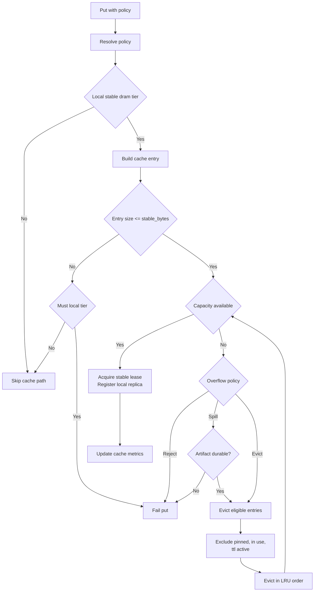

# Summary

Replace the legacy `put` option set (`persist` + `placement_policy`) with a single policy-based interface that supports both simple profiles and advanced composition. The policy defines required and optional durability tiers, local retention behavior for stable DRAM, and maps onto the persistence and placement pipeline in `0041`.

# Problem Statement

The current API surface makes durability and placement hard to reason about because:

- The per-call knobs are already overloaded (`persist`, `placement_policy`) and are expected to grow (retention, overflow, “HA” profiles), but there is no single composition model.
- The cluster’s current behavior is “best-effort remote”: Global Store placement degrades to local-only when there is no remote stable capacity, rather than failing the request. This is not representable as a first-class user contract in today’s API.
- Historically, daemon persistence depended on a LIP lease being present; `Store.put` uses the stable DRAM registration plan, so `persist=True` could not reliably work for `put`. This design requires an explicit stable-DRAM source path so persistence can start from the locally committed CPU replica when no LIP lease exists.

These gaps increase onboarding cost, make failure semantics ambiguous, and complicate future extensions (new tiers, retention modes, and topology policies).

## Current Repo Grounding (Why this design must change)

- Python SDK options: `RegisterArtifactOptions` exposes `policy` as the single durability/placement control; `Store.put` uses the stable DRAM plan (`PlanType.DRAM_STABLE`) (`tensorcast/api/_config.py`, `tensorcast/api/store/registration.py`).
- Persistence wire-up: after commit, the SDK calls daemon RPC `StartPersistence` with `StorePolicy` and returns a `persistence_task_id` when available (`tensorcast/api/store/registration.py`).
- Daemon persistence: `StartPersistence` resolves `StorePolicy` and delegates to `PersistenceManager::start_task(...)`. Tasks start from an active LIP lease when present or fall back to the locally committed stable-DRAM CPU replica; if neither source exists, the call fails with `FAILED_PRECONDITION` (`daemon/grpc_service_impl.cc`, `daemon/persistence_manager.cc`).
- Global Store placement: `PlacementService.plan_placement()` always includes the source node; for `replicated/sharded` it attempts to add one remote stable-DRAM target and degrades when none is available (`tensorcast/global_store/services/placement_service.py`).
- Global Store schema: `artifact_placements.policy` is constrained to `local_only|replicated|sharded`, so a higher-level profile string cannot be stored there without a schema change (`tensorcast/global_store/init.sql`).

# Goals / Non-Goals

## Goals
1. Provide a single `policy` entry point that is easy for new users and composable for advanced users.
2. Make success, degraded, and failed outcomes deterministic via `must`, `should`, `may` semantics, aligned to how the system reports *persistence task* state today.
3. Resolve policies centrally on the daemon, reading resource budgets from `docs/designs/0004-unified-runtime-config.md` while keeping stable-cache behavior free of new `stable_cache_*` knobs.
4. Map policies onto the existing persistence and placement pipeline described in `docs/designs/0041-distributed-persistence-placement.md`.
5. Remove legacy options and update all call sites to the new interface.
6. Unblock persistence for `Store.put` by removing the hard dependency on LIP leases in the daemon persistence implementation.

## Non-Goals
- Backward compatibility with legacy `put` parameters or proto fields.
- Introducing new storage tiers beyond stable DRAM and shared disk in the first cut.
- Topology-aware placement (rack, zone, region) in this iteration.
- Rewriting persistence state machines or Global Store placement logic.

# Architecture & Interfaces

## Policy Model

`policy` is the only user-facing control surface for `put`.

```
StorePolicy
  profile: "cache" | "durable" | "ha" | "cold" | "pinned" | null
  must: list[TierSpec]
  should: list[TierSpec]
  may: list[TierSpec]
  overflow_policy: "evict" | "spill" | "reject"
  layout: "auto" | "unsharded" | "sharded"

TierSpec
  tier: "stable_dram" | "shared_disk"
  scope: "local" | "remote" | "any"
  min_replicas: int
  retention_policy: "best_effort" | "ttl" | "pinned"
  retention_ttl_ms: int | null
```

Rules:
- `profile` is a convenience preset. If any of `must/should/may` are set, `profile` must be unset.
- `overflow_policy` applies only to the local stable DRAM cache tier.
- `layout=auto` follows the sharding thresholds from `0041`.

### Field Semantics and Validation (repo-aligned)

The model above is intentionally richer than what the current `0041` wire format accepts. To keep behavior deterministic and grounded in the existing pipeline:

- `TierSpec.tier=shared_disk`
  - `scope` MUST be `any` (or omitted); `min_replicas` MUST be `1`.
  - Hard validation (no silent ignore): retention fields MUST NOT be set for `shared_disk` tiers; disk durability is modeled via persistence tasks, not cache retention.
- `TierSpec.tier=stable_dram`
  - `scope=local|remote|any` is meaningful.
  - `retention_policy` is meaningful only for `scope=local` (local retention/eviction); remote stable DRAM is governed by Global Store stable-lease lifecycle.
  - Hard validation (no silent downgrade):
    - `min_replicas` is currently supported only as `1` (for `local`, `remote`, and `any`); values other than `1` MUST be rejected with `INVALID_ARGUMENT`.
    - If `scope` excludes `local` (i.e., `scope=remote`), retention fields MUST NOT be set:
      - `retention_policy` MUST be unset/`best_effort`.
      - `retention_ttl_ms` MUST be unset.
- `overflow_policy=spill` is only valid if the policy includes `shared_disk` in `must` or `should` (spill requires an on-disk copy path).

## Profiles

Profiles expand into tier sets and defaults:
- `cache`: local retention only: `may` local `stable_dram` with `best_effort` retention; no persistence requirements.
- `durable`: disk required: `must` `shared_disk`; local `stable_dram` is optional (`should`) for faster reads.
- `ha`: **repo-aligned** HA in this cut: `must` `shared_disk`; `should` remote `stable_dram` (`min_replicas=1`); `should` local `stable_dram`.
  - Rationale: Global Store placement currently degrades when remote stable capacity is unavailable; making remote stable a `must` would require changing Global Store to fail placement rather than degrade.
- `cold`: disk required: `must` `shared_disk`; local `stable_dram` is optional with short TTL (a deterministic profile default; no stable-cache-specific daemon config is introduced in this design).
- `pinned`: local retention required: `must` local `stable_dram` with `pinned` retention; `overflow_policy=reject`.

Defaults should remain deterministic and daemon-resolved. This design intentionally avoids adding stable-cache-specific runtime config fields; the stable tier size (`engine.memory_tiers.stable_bytes`) is the cache budget.

## Policy Resolution

1. Validate the policy shape and constraints (unknown tiers, unsupported `min_replicas`, negative replicas, TTL without `ttl` retention, retention fields on remote-only tiers). Validation must fail fast and MUST NOT silently coerce unsupported user intent.
2. Expand the profile if used, then apply deterministic daemon-side defaults (use unified runtime config only where a corresponding knob already exists; otherwise use code defaults to avoid config bloat).
3. Produce a `ResolvedPolicy` that the daemon executes:
   - `must` tiers drive required actions (shared disk write, remote stable DRAM placement).
   - `should` tiers are best-effort and may report `degraded` if unsatisfied.
   - `may` tiers are opportunistic and do not affect status.
4. `layout=auto` uses the sharding rules defined in `0041`.

## Status Semantics (What “success/degraded/failed” applies to)

In TensorCast today, the local registration/commit is synchronous, while persistence is an asynchronous background task started post-commit (`StartPersistence` / `QueryPersistenceStatus`). Therefore:

- `must/should/may` semantics apply to the *persistence task state* (the state returned by `QueryPersistenceStatus`), not the `put()` return value.
- `put()` should continue to return after the local registration succeeds. It may return a `persistence_task_id` for the caller to query.

## Mapping to the Existing 0041 Pipeline (Lowering)

The existing daemon RPC surface (0041) models persistence requests as:

- `placement_policy`: `local_only|replicated|sharded`
- `persist_to_shared_disk`: boolean

Policy lowering must map a `ResolvedPolicy` onto these fields:

- Any `shared_disk` in `must|should|may` → `persist_to_shared_disk=true`
  - `shared_disk` in `must` → disk failures are task-level `failed`.
  - `shared_disk` in `should` → disk failures are task-level `degraded`.
  - `shared_disk` in `may` → disk failures do not affect task state (still recorded for debugging/metrics).
- Any `stable_dram` with `scope=remote` in `must|should|may` → `placement_policy` is at least `replicated` (or `sharded` when `layout=sharded`/`auto` chooses sharding).
- No remote stable tier requested → `placement_policy=local_only`

Important: profiles (`cache/durable/ha/...`) are **not** stored in `artifact_placements.policy` (which is constrained to `local_only|replicated|sharded`). Profiles are an SDK/daemon interface concern and may be embedded only in the plan JSON summary for debugging.

## Persistence Source Requirements (Fixing the LIP-only coupling)

Daemon persistence must support at least two sources:

1. **LIP source**: persistence starts from an active LIP lease when available.
2. **Stable-DRAM source**: persistence starts from the locally committed CPU replica (stable DRAM plan) when no LIP lease exists.

The API rejects persistence with a clear `FAILED_PRECONDITION` if neither source is available (e.g., artifact not locally present).

## Stable DRAM Retention (Policy-managed “cache”)

StoreEngine supports stable DRAM registrations (`PlanType.DRAM_STABLE`) and implements a policy-driven retention contract (TTL/pinning/overflow). A policy-managed stable DRAM “cache” layer defines:

- which local CPU replicas are eligible for eviction,
- how TTL/pinning is represented and enforced, and
- how “spill” interacts with shared-disk persistence.

The implementation should reuse existing building blocks (UMA, MemoryTierBudget, ReplicaRegistry LRU, eviction helpers) instead of building a parallel cache subsystem.



### Cache Manager

- Add a `StableDramCacheManager` in the StoreEngine/daemon runtime that:
  - tracks per-artifact local retention metadata (`retention_policy`, `deadline`, pin/in-use guards),
  - participates in eviction decisions by filtering candidates (LRU stays the ordering source),
  - optionally acquires/release UMA stable leases as part of “pinned” semantics (but does not rely on stable leases alone for eviction exclusion).

### Eviction & Admission

- Candidate ordering is LRU as provided by `ReplicaRegistry::get_lru_instances()`. The cache manager filters out ineligible keys before attempting releases.
- TTL and pinned entries must not be evicted before their policy allows it.
- Admission and capacity accounting must be consistent with `MemoryTierBudget` and `engine.memory_tiers.stable_bytes`:
  - `stable_bytes` is the total stable (and cache) budget; pinned replicas consume the same budget as best-effort cache entries.
  - eviction is demand-driven: run only when a `put` admission needs space (no high/low watermark loops or separate `stable_cache_*` budgets).
  - `overflow_policy` determines how to react when admission cannot be satisfied within the stable budget.

### Retention Policies
- `best_effort`: immediately eligible for eviction.
- `ttl`: ineligible until `retention_deadline_ns`.
- `pinned`: never evicted except explicit delete/cleanup.

### Overflow Policy
- `evict`: evict eligible entries until capacity is available; fail if still insufficient.
- `spill`: only evict entries that are already `durable` (as defined below) with respect to the resolved policy’s non-local durability tiers. If an entry is not yet durable, eviction is disallowed and the admission behaves like `reject`/backpressure (`RESOURCE_EXHAUSTED`). The stable cache must never initiate disk writes or remote replication as part of spill (no hidden durability).
- `reject`: fail `put` with `RESOURCE_EXHAUSTED` and an actionable error.

### Interaction with Persistence
- Local stable DRAM replicas are a cache by default; durability is satisfied by non-local tiers (`shared_disk` and/or remote `stable_dram`) as specified by policy.
- **`must` is long-lived**: after the daemon reports the policy as satisfied, the system must continue to satisfy `must` tiers for the lifetime of the artifact (until explicit delete/cleanup).
  - `must` local stable DRAM is enforced as pinned retention (`retention_policy=pinned`) and must not be evicted by cache pressure.
  - `must` shared disk is enforced by the persistence writer (disk existence is durable by construction).
  - `must` remote stable DRAM is enforced by the persistence manager via stable-lease acquisition; loss of the required remote state is a policy violation (future work: reconcile/re-materialize).
- `spill` relies on an explicit `durability index` updated by the persistence pipeline; it does not trigger writes.
- **Eventual consistency on eviction**: eviction removes the local replica from the daemon’s replica registry immediately. Global Store metadata is updated asynchronously via existing chunk/state sync, so there may be a short window where Global Store routing is stale. Daemon materialization/routing must treat Global Store placement as a hint and fall back safely when a planned local replica is missing.

### Durability Index (Required for `spill`)

To make `overflow_policy=spill` safe without introducing hidden durability, the daemon runtime must expose a queryable durability state:

- **Purpose**: answer “is it safe to evict local stable DRAM for this artifact without violating the requested durability tiers?”
- **Update source**: only the persistence pipeline updates this state (shared disk completion/dedup-hit, and/or remote stable target completion per shard).
- **Query semantics** (repo-aligned first cut):
  - The index tracks tier-level completion at an artifact granularity:
    - `shared_disk_complete`: the daemon has observed shared-disk persistence satisfied for all shards (including dedup-hit).
    - `remote_stable_complete`: the daemon has observed remote stable targets satisfied for all shards (and `min_replicas` requirements, once supported).
  - An artifact is `durable` for spill if at least one non-local tier has completed: `shared_disk_complete || remote_stable_complete`.
  - Additionally, `must` tiers are long-lived contracts and must not be violated:
    - If the resolved policy requires shared disk (`shared_disk` in `must`), then `shared_disk_complete` MUST be true before spill-eviction is allowed.
    - If the resolved policy requires remote stable (`stable_dram(scope=remote)` in `must`), then `remote_stable_complete` MUST be true before spill-eviction is allowed.
  - If a `must` tier becomes unsatisfied after being satisfied, it is a policy violation (future work: reconciliation and re-materialization).

### Observability
- Add metrics: `tc_stable_cache_bytes_used`, `tc_stable_cache_evictions_total`, `tc_stable_cache_hits_total`, `tc_stable_cache_misses_total`, `tc_stable_cache_ttl_expirations_total`.
- Emit structured logs on admission, eviction, spill, and reject decisions (include `artifact_id`, `size_bytes`, and `policy`).

## Runtime Config (No Stable Cache Knobs)

If we introduce any new runtime policy defaults, they must be added to the unified config (Protobuf-first) per `docs/designs/0004-unified-runtime-config.md`. In particular:

This design intentionally does **not** add stable-cache-specific fields (no `stable_cache_bytes`, no `stable_cache_{high,low}_watermark_ratio`, no `stable_cache_max_entry_bytes`). The existing stable tier budget is the cache budget:

- `tensorcast.config.v1.DaemonConfig.Engine.MemoryTiers.stable_bytes` is the sole capacity knob, and eviction is triggered only on new `put` admission pressure.
- **Shard planning thresholds** should either:
  - remain code constants (and the design must not claim they come from config), or
  - move into daemon config with defaults matching current constants.

### Config Invariants (must be validated at startup)
- No new cache-specific invariants are introduced beyond existing StoreEngine validation for `engine.memory_tiers.stable_bytes` (see `MemoryTierBudget::from_config`).

## Status Semantics

- If any `must` tier fails, the task state is `failed`.
- If all `must` tiers succeed but one or more `should` tiers fail, the task state is `degraded`.
- `may` tier failures never change the task state.

## Naming Compliance

Proposed public API names follow repository conventions:
- Classes/structs: `StorePolicy`, `TierSpec` (PascalCase).
- Functions: `put`, `put_async`, `query_persistence_status`, `resolve_policy`, `policy_from_profile` (snake_case).
- Fields: `must`, `should`, `may`, `overflow_policy`, `retention_policy`, `retention_ttl_ms`, `layout` (snake_case).
- Constants: `PROFILE_CACHE`, `PROFILE_DURABLE`, `PROFILE_HA`, `PROFILE_COLD`, `PROFILE_PINNED` (ALL_CAPS) if materialized.
- Internal cache components: `StableDramCacheManager`, `CacheEntry` (PascalCase).

# Invariants & Error Model

## Invariants
- Policy resolution and validation must be single-source-of-truth (prefer daemon-side resolution using daemon config; SDK may perform shape validation only).
- `spill` must never start a disk write or trigger remote replication; it only gates eviction on durability state maintained by the persistence pipeline (no hidden durability).
- Remote placement defaults to best-effort unless explicitly requested as strict; current system behavior is “degrade to local-only when insufficient remote capacity”.
- Persistence must be runnable for both LIP-based registrations and stable-DRAM puts; otherwise profiles like `durable/ha/cold` are not implementable for `put`.

## Error Model (selected)
- Invalid policy shape/constraints → `INVALID_ARGUMENT` (SDK-side and daemon-side validation should agree).
- Unsupported stable DRAM `min_replicas`, retention fields on `shared_disk`, or retention fields on remote-only tiers → `INVALID_ARGUMENT` (no silent downgrade).
- Persistence requested but no eligible source (no LIP lease and no local stable-DRAM replica) → `FAILED_PRECONDITION`.
- `overflow_policy=reject` on insufficient capacity → `RESOURCE_EXHAUSTED` with actionable message (include which tier failed).
- Task state transitions must remain deterministic and observable via `QueryPersistenceStatus`.

# Schema Changes

No new database tables are required: the existing 0041 normalized tables remain the storage for the lowered placement/durability plan. Specifically:

- `artifact_placements.policy` continues to store the lowered placement policy (`local_only|replicated|sharded`).
- Any richer policy metadata (profile name, must/should/may breakdown) must be embedded only in the plan JSON summary for debugging/operational visibility, not in the constrained `policy` column.

RPC and SDK APIs replace legacy `persist` and `placement_policy` fields with a single `StorePolicy` message that carries the policy model above (with daemon-side resolution using unified runtime config).

# Alternatives & Rationale

- **Keep `persist` + `placement_policy` and add more knobs**: rejected; it repeats the same combinatorial ambiguity and makes it hard to extend (retention/overflow/HA).
- **Profiles only (no composable tiers)**: rejected; advanced users need explicit must/should semantics and future tier composition.
- **Resolve policy only in the SDK**: rejected; the daemon owns runtime defaults and enforcement (unified runtime config) and must be able to validate/reject invalid combinations consistently across clients.
- **Treat remote stable as always-`must` for “HA”**: rejected for this cut; current Global Store placement is best-effort and degrades when remote stable capacity is missing. A strict mode can be added later with explicit Global Store behavior changes.

# Trade-offs & Risks

- A richer policy model introduces validation complexity; incorrect defaults can cause unexpected failures.
- `must/should/may` semantics require consistent enforcement across SDK, daemon, and Global Store; divergence is a correctness bug.
- Unblocking persistence for stable-DRAM puts requires adding a non-LIP source path in daemon persistence; this is the key structural change.
- Cache/retention semantics intersect with eviction and memory tier accounting; implement as a thin layer over existing UMA/registry/eviction primitives to avoid a second lifecycle system.
- Removing legacy options is a breaking change; adoption depends on coordinated updates.

# Compatibility & Acceptance Criteria

## Compatibility
- No backward compatibility. All call sites must migrate to the new `policy` interface.

## Acceptance Criteria
1. `put` accepts only `policy` and rejects legacy options.
2. Profile policies map to the expected durability and placement behavior.
3. `must/should/may` semantics produce deterministic `success`, `degraded`, and `failed` states.
4. `layout=auto` follows the sharding thresholds in `0041`.
5. Defaults are deterministic and daemon-resolved; resource budgets (e.g., `engine.memory_tiers.stable_bytes`) come from unified runtime config without introducing `stable_cache_*` knobs.
6. Persistence works for both LIP-based registrations and stable-DRAM puts (no LIP-only coupling).
7. Stable DRAM retention implements admission, TTL, and eviction rules defined above, without violating existing memory tier accounting.

# References

- `docs/designs/0041-distributed-persistence-placement.md`
- `docs/designs/0004-unified-runtime-config.md`
- `tensorcast/api/store/__init__.py`
