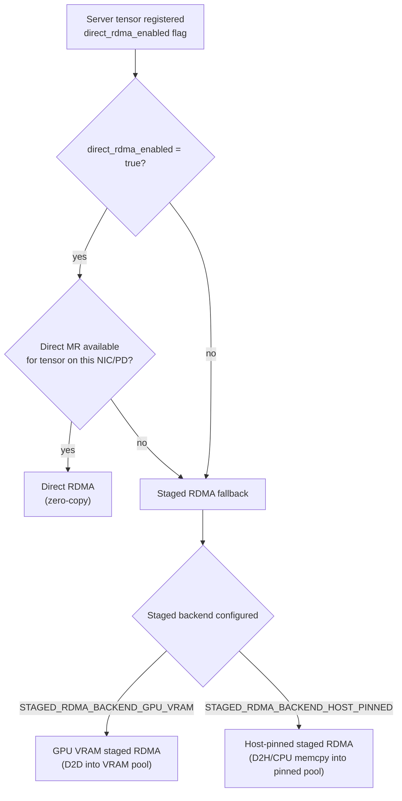

# Summary

Add a GPU VRAM staged-RDMA backend (bounce buffers in device memory) for non-direct workloads where RDMA is desired but staging through host-pinned memory is suboptimal. Fix and complete the existing RDMA preregistration story so `rdma_preregister` materially reduces staging overhead for both CPU and GPU host-pinned staging. Clarify and de-ambiguate the staged-RDMA “pointer” contract by using `StageLease::exposed_ptr()` (renamed from `StageLease::host_ptr()`) to reflect that it may be a host pointer (host-pinned staging) or a device pointer (direct RDMA and GPU VRAM staging).

This design is explicitly compatible with TensorCast’s user-driven **direct vs non-direct** modes:
- **Direct mode** (e.g., region-backed): prefer direct RDMA when enabled and MR is available; otherwise fall back to staged RDMA.
- **Non-direct mode**: provide high-throughput staged RDMA, including an explicit GPU VRAM staging backend when configured.

# Problem Statement

TensorCast currently has:

- A staged-RDMA path that stages server-side responses into **host-pinned** buffers (via `MemoryStager`) and exposes those buffers to the client for RDMA READ. This is correct and broadly compatible, but for GPU tensors it incurs **GPU→CPU** copies via `HostPinnedGpuStager` (`cudaMemcpyDeviceToHost`), which is avoidable on GPUDirect RDMA capable systems.
- A slab-level RDMA preregistration mechanism (`PinnedBufferPool::list_slabs()` preregistered once per NIC/PD) that is intended to reduce runtime registration cost. Historically, only `HostPinnedCpuStager`-backed staging reliably exploited this because `HostPinnedGpuStager` staging did not normalize MR registrations to slab bases; this design fixes that via stager-provided slab lookup (`MemoryStager::mr_slab_for_ptr(...)`).
- A naming/contract mismatch in the lease/pointer path: `StageLease::exposed_ptr()` (formerly `host_ptr()`) already carries a device pointer in the direct RDMA path (zero-copy). This makes it hard to safely extend staged RDMA to device memory without confusion in code and docs.

We want:

1. **P0**: `rdma_preregister` actually reduces staged-RDMA overhead for GPU host-pinned staging as well as CPU host-pinned staging.
2. **P1**: a staged-RDMA backend that uses **GPU VRAM** bounce buffers (D2D) instead of host-pinned bounce buffers (D2H), selected explicitly by configuration and validated at initialization time (no runtime fallback).

# Goals / Non-Goals

## Goals

- Preserve the existing transport protocol and credit/ACK semantics for RDMA windows (`RDMA_READ_DONE_EX` releases `StageLease`).
- Keep MTCP/TCP semantics unchanged; any new staging backend must not regress TCP paths.
- Make `pinned_memory.classes[comm_*].rdma_preregister` measurably effective for staged RDMA, including GPU-side staging where the underlying slices live in host-pinned slabs.
- Add an explicit GPU VRAM staged-RDMA backend with clear prerequisites and failure behavior (init-time validation; no runtime fallback when configured).
- De-ambiguate the lease pointer contract by renaming `StageLease::host_ptr()` to `StageLease::exposed_ptr()` and updating docs accordingly.
- Follow unified runtime config rules: no ad-hoc env vars; configuration lives in protobuf-backed config (`DaemonConfig.communicator`).

## Non-Goals

- Changing the wire protocol messages or handshake machinery (no new opcodes, no new response types).
- Forcing “direct” behavior in non-direct user scenarios; mode selection remains user-driven.
- Introducing new global allocators/budgets outside the unified config system.
- Making GPU VRAM staging available on systems without GPUDirect RDMA or where GPU MR registration is not supported.
- Solving end-to-end cross-process policy (e.g., “never expose any GPU MR to peers”) beyond explicit configuration.
- Supporting dma-buf MR registration or CUDA VMM/backed registrations in this design iteration.

# Current State (Grounded in Code)

## Stagers and staging buffers

- `HostPinnedCpuStager` (formerly `DRAMStager`) stages CPU tensors into **host-pinned** slices allocated from `PinnedBufferPool` and uses `memcpy`:
  - `core/communicator/engine/host_pinned_cpu_stager.cc` (`PinnedBufferPool::allocate` → `std::memcpy`)
- `HostPinnedGpuStager` (formerly `GpuNetStager`) stages GPU tensors into **host-pinned** slices allocated from `PinnedBufferPool` and uses `cudaMemcpyDeviceToHost`:
  - `core/communicator/engine/host_pinned_gpu_stager.h`
- `PinnedBufferPool` allocations are host memory that is pinned via CUDA (`cudaHostRegister`) at pool construction time:
  - `core/common/memory/pinned_buffer_pool.cc`

## Staged RDMA vs direct RDMA in Communicator

In `core/communicator/engine/engine.cc`, the RDMA response path uses `MakeStageFunction(...)`:
- **Direct RDMA**: `StageLease` references the tensor’s device pointer + MR (no staging buffer). This pointer is carried via `StageLease::exposed_ptr()`.
- **Staged RDMA**: `fallback_stager->stage(...)` yields a staged pointer and registers an MR for that region (via `MrCache`).

## Preregistration

On startup (when `enable_rdma=true`), the Communicator preregisters MRs for selected staging pools at slab granularity (one MR per slab per NIC/PD) and caches them in `MrCache`:
- `core/communicator/engine/engine.cc` prereg loop over `PinnedBufferPool::list_slabs()`

Staged-RDMA MR selection normalizes to slab bases via the `MemoryStager::mr_slab_for_ptr(...)` hook (implemented by `HostPinnedCpuStager` and `HostPinnedGpuStager`), so preregistered slab MRs are reused for both CPU and GPU host-pinned staging.

# Terminology and Naming (Contract Clarification)

This design makes the “RDMA-exposed address” explicit in naming:

- **`StageLease` pointer contract**: `StageLease::exposed_ptr()` (formerly `host_ptr()`) reflects that the returned address may refer to:
  - host-pinned memory (host-pinned staged RDMA), or
  - device memory (direct RDMA and GPU VRAM staged RDMA).
  - The returned value is an exposed transport address; it must not be dereferenced by the server process.
- **`ProtoReadResponseExHeader.staged` semantics**: treat `staged=1` as “the client must ACK (`RDMA_READ_DONE_EX`) so the server can release the corresponding `StageLease` and return staging credit”, not as “host-pinned vs device staging”. (In current code, RDMA windows use `staged=1` even for direct RDMA.)

We also rename staging classes to make “where the staged buffer lives” self-evident:

- `HostPinnedCpuStager` (formerly `DRAMStager`)
- `HostPinnedGpuStager` (formerly `GpuNetStager`)
- `GpuVramRdmaStager` (RDMA-only; stages into GPU VRAM)

# Architecture & Interfaces

## Overview

We introduce a staged-RDMA backend selection that is **explicitly** separate from user-level “direct vs non-direct” mode:

- User-level mode determines whether direct writes / region-backed flows are used.
- RDMA staging backend determines *how staged RDMA behaves when it is selected by the transport and policy*.



## User Scenarios and Expected Behavior

TensorCast exposes user-driven “direct vs non-direct” choices (for example, backed-region flows). This design makes staged-RDMA backend selection orthogonal and predictable:

| User scenario | Typical data-plane behavior | Communicator policy expectation |
| --- | --- | --- |
| Direct (region-backed) | `pump_ranges()` uses direct write tokens (`read_into`) | Prefer direct RDMA when enabled; staged backend rarely used |
| Non-direct (not region-backed) | source reads into caller buffers | staged RDMA is common for large reads; backend choice matters |

The key invariant is that staged backend selection must never “force direct mode”; it only optimizes the staged fallback behavior within a scenario.

## Error Model and Failure Mapping

This design intentionally preserves existing error surfaces (including `ENGINE_OP_READ_FAILED`) while making failures more diagnosable.

### Staged RDMA failures

- **Host-pinned pool exhaustion / staging credit exhaustion**: return `absl::ResourceExhaustedError(...)` and map to `TENSORCAST_READ_FAILED_RESOURCE_EXHAUSTED` on the control channel when serving a request.
- **VRAM pool exhaustion** (P1): return `absl::ResourceExhaustedError(...)` with a stable message including `device_id`, `slice_bytes`, and `pool_bytes_per_gpu`.
- **MR registration failure**:
  - If direct mode was requested (`direct_rdma_enabled=true`) and MR registration fails, record a “direct fallback” reason and continue via staged backend selection.
  - If staged backend MR registration fails, surface `absl::InternalError(...)` and map to `TENSORCAST_READ_FAILED_MEM_MISMATCH` (status quo), while incrementing a dedicated `tc_rdma_mr_register_failures_total` metric.

## Security and Policy Model

### Threat model (scoped)

- RDMA exposes memory ranges to remote peers via rkeys. Even with short lifetimes, exposing device memory MRs can be considered higher risk than exposing host-pinned staging MRs because:
  - device memory may contain sensitive model weights/activations depending on workload;
  - device memory access patterns can have different isolation and auditing properties than host memory.

### Policy principles

- Default behavior must not increase exposure surface: GPU VRAM staging is not enabled unless explicitly configured.
- In non-direct scenarios, GPU VRAM staging must be explicitly enabled and bounded; it must not “accidentally” expose arbitrary primary pointers.
- Observability must make exposure mode explicit (backend, method, bytes).

### Policy knobs (config-level)

- `rdma.staging_backend` is the explicit selector; `STAGED_RDMA_BACKEND_UNSPECIFIED` behaves as `STAGED_RDMA_BACKEND_HOST_PINNED`.
- There is no `AUTO` mode: operators must choose `STAGED_RDMA_BACKEND_HOST_PINNED` or `STAGED_RDMA_BACKEND_GPU_VRAM` explicitly.
- When `STAGED_RDMA_BACKEND_GPU_VRAM` is selected, the Communicator must validate support at initialization time and fail fast if unsupported. Runtime fallback is not permitted.

## Integration Points (Code-Level)

- `core/communicator/engine/engine.cc`
  - P0: update staged-RDMA MR normalization inside `MakeStageFunction(...)` to consult `MemoryStager` for slab-base normalization (no type-specific `dynamic_cast`).
  - P1: extend staged backend selection for RDMA to choose `GpuVramRdmaStager` when configured.
  - P1: add init-time validation and preregistration for GPU VRAM pool MRs using `ibv_reg_mr` (fail-fast; no runtime fallback).
- `core/communicator/engine/memory_stager.h`
  - P0: add an optional “MR slab lookup” capability so `MakeStageFunction(...)` can normalize MR bases independent of concrete stager type.
- `core/communicator/engine/host_pinned_gpu_stager.h` / `core/communicator/engine/host_pinned_cpu_stager.{h,cc}`
  - P0: implement the slab lookup capability (host-pinned pool slab base).

## P0: Make preregistration effective for GPU host-pinned staging

### Change

Generalize MR-base normalization for staged buffers so that staged slices map to their containing slab base for both host-pinned CPU staging and host-pinned GPU staging:

- Add an optional “MR slab lookup” hook to `MemoryStager` (default: no slab).
- Implement it in:
  - `HostPinnedCpuStager` (formerly `DRAMStager`)
  - `HostPinnedGpuStager` (formerly `GpuNetStager`)
- In `MakeStageFunction` (staged path), normalize `(mr_base, mr_bytes)` using the stager-provided slab when available, so `MrCache` is keyed by slab base, not per-slice pointers.

### Expected outcome

When `pinned_memory.classes[name=comm_gpu].rdma_preregister=true`:
- preregistration registers slab MRs once per NIC/PD
- staged-RDMA uses those preregistered slab MRs (no per-slice registration churn)

## P1: GPU VRAM staged-RDMA backend (bounce buffer in device memory)

### Motivation

For non-direct workloads where we cannot (or choose not to) expose the artifact’s primary device pointer for RDMA, staged RDMA currently requires GPU→CPU staging for GPU tensors. On GPUDirect RDMA capable systems, we can instead stage into GPU VRAM and let the NIC read the staged GPU memory directly (D2D staging).

### New components (daemon / Communicator)

- **GpuVramStagingPool**: per-device fixed-size pool of device allocations carved into slices of size `communicator.rdma.vram_slice_bytes`.
  - Supports non-blocking acquire (try) and release, mirroring the “do not block inside stage” philosophy.
  - Required preregistration of pool MRs per NIC/PD at Communicator init when `STAGED_RDMA_BACKEND_GPU_VRAM` is selected (fail-fast; no runtime fallback).
- **GpuVramRdmaStager**: RDMA-only staging implementation that stages a `(tensor, offset, bytes)` range into a slice from `GpuVramStagingPool` via D2D copy.
  - Produces `StageLease` objects whose `exposed_ptr()` is a **device pointer**.
  - Uses `ibv_reg_mr` only (no dma-buf path in this iteration).

### Interface choice: reuse existing staging abstractions

We keep the existing `StageFn` / `StagingWindow` / `StageLease` pipeline and implement GPU VRAM staging by:

- Making `StageLease`’s address contract explicit (`exposed_ptr()`).
- Implementing an RDMA-only `MemoryStager` (`GpuVramRdmaStager`) that returns a device pointer as the exposed address.

MTCP staging remains untouched because MTCP is wired to the host-pinned stagers (`HostPinnedGpuStager` / `HostPinnedCpuStager`) at transport construction time.

### Invariants

- GPU VRAM staging is used **only** for RDMA staged fallback, never for MTCP.
- Credit and lifecycle remain unchanged:
  - Each staged segment corresponds to one `StageLease` in the per-channel registry.
  - Release still occurs on `RDMA_READ_DONE_EX` and returns credit + buffer.
- Buffer sizing is fixed and derived from unified config; no unbounded growth.

### Init-time validation (required; no runtime fallback)

When `communicator.rdma.staging_backend=STAGED_RDMA_BACKEND_GPU_VRAM`, initialization must:

- allocate the configured per-GPU VRAM pool;
- preregister the pool memory with `ibv_reg_mr` for every active NIC/PD;
- fail fast if any required preregistration step fails (daemon startup fails; no runtime fallback).

If initialization succeeds, runtime staging must not fall back to `STAGED_RDMA_BACKEND_HOST_PINNED` in response to capability or MR failures; failures are surfaced as request failures (or fatal errors if invariant-breaking).

# Configuration

We extend the typed communicator config (embedded under `DaemonConfig.communicator`) with an explicit staged-RDMA backend selection.

Proto additions in `proto/tensorcast/communicator/v1/communicator_config.proto`:

```proto
message RdmaConfig {
  ...
  enum StagedRdmaBackend {
    STAGED_RDMA_BACKEND_UNSPECIFIED = 0; // treated as STAGED_RDMA_BACKEND_HOST_PINNED (no behavior change by default)
    STAGED_RDMA_BACKEND_HOST_PINNED = 1;                     // current behavior
    STAGED_RDMA_BACKEND_GPU_VRAM = 2;                        // new P1 behavior (requires init-time validation)
  }
  StagedRdmaBackend staging_backend = 6;
  uint64 vram_pool_bytes_per_gpu = 7; // required when staging_backend=STAGED_RDMA_BACKEND_GPU_VRAM
  uint64 vram_slice_bytes = 8;        // required when staging_backend=STAGED_RDMA_BACKEND_GPU_VRAM
}
```

Notes:
- Host-pinned sizing remains under `DaemonConfig.pinned_memory.classes[comm_gpu/comm_cpu]`.
- GPU VRAM staging sizing is separate because it is not pinned host memory and should not consume `pinned_memory` budget.

## Configuration Examples

### Keep current behavior (default)

No config changes required; `STAGED_RDMA_BACKEND_UNSPECIFIED` behaves as `STAGED_RDMA_BACKEND_HOST_PINNED`.

### Enable P0 preregistration for host-pinned staging (recommended with RDMA)

`rdma_preregister` lives under daemon-wide pinned memory classes (not under `communicator.rdma`). When enabled and RDMA is on, the daemon preregisters pinned slabs once per NIC/PD so staged RDMA reuses slab MRs.

```yaml
communicator:
  enable_rdma: true

pinned_memory:
  classes:
    - name: comm_gpu
      slice_bytes: 16MB
      pool_bytes: 8GB
      rdma_preregister: true
    - name: comm_cpu
      slice_bytes: 16MB
      pool_bytes: 2GB
      rdma_preregister: true
```

### Enable GPU VRAM staged RDMA (explicit)

```yaml
communicator:
  enable_rdma: true
  rdma:
    staging_backend: STAGED_RDMA_BACKEND_GPU_VRAM
    vram_pool_bytes_per_gpu: 2GB
    vram_slice_bytes: 16MB

# Still required for MTCP and host-pinned staging paths (and for CPU tensors).
pinned_memory:
  classes:
    - name: comm_gpu
      slice_bytes: 16MB
      pool_bytes: 8GB
      rdma_preregister: true
    - name: comm_cpu
      slice_bytes: 16MB
      pool_bytes: 2GB
      rdma_preregister: true
```

## VRAM pool semantics and constraints (forced mode)

When `communicator.rdma.staging_backend=STAGED_RDMA_BACKEND_GPU_VRAM`:

- **One pool per GPU**: the daemon allocates exactly one contiguous VRAM pool per initialized CUDA device. Total reserved VRAM is approximately `vram_pool_bytes_per_gpu * num_initialized_gpus` (plus allocator overhead).
- **MR preregistration is not “one pool per NIC”**: the same per-GPU pool is preregistered once per NIC/PD (multiple MRs referencing the same pool). This scales the *number of MRs* with NIC/PD count, but does not multiply VRAM allocation.
- **Sizing rules**:
  - `vram_pool_bytes_per_gpu > 0` and `vram_slice_bytes > 0` are required.
  - `vram_pool_bytes_per_gpu >= vram_slice_bytes` is required.
  - `vram_pool_bytes_per_gpu / vram_slice_bytes` determines the number of usable slices; if the division has a remainder, the implementation truncates the remainder and logs a warning.
- **Segment bound**: staged RDMA segments into VRAM must satisfy `0 < bytes <= vram_slice_bytes`.

# Observability

Add/extend metrics (low cardinality):
- `tc_rdma_staged_backend_total{backend="host_pinned|gpu_vram", mem="cpu|gpu"}` (segments)
- `tc_rdma_staged_bytes_total{backend=..., mem=...}`
- `tc_rdma_mr_register_total{method="ibv_reg_mr", location="host_pinned|gpu_vram"}`
- `tc_rdma_mr_register_failures_total{method="ibv_reg_mr", reason=...}`
- Keep existing `tc_pinned_rdma_prereg_*` for host-pinned pools.
- VRAM preregistration exposes:
  - `tc_vram_rdma_prereg_failures_total`
  - `tc_vram_rdma_prereg_latency_ms`
  - `tc_vram_rdma_prereg_bytes`

# Naming Compliance (C++ APIs)

All proposed new interfaces obey repository naming conventions:

| Kind | Examples | Convention |
| --- | --- | --- |
| Class/struct | `GpuVramStagingPool`, `GpuVramRdmaStager`, `HostPinnedGpuStager`, `HostPinnedCpuStager` | `PascalCase` |
| Proto msg/enum | `RdmaConfig::StagedRdmaBackend` | generated `PascalCase` |
| Methods | `acquire_slice(...)`, `release_slice(...)`, `preregister_slabs(...)` | `snake_case` |
| Constants/macros | `IBV_ACCESS_REMOTE_READ` (existing) | `ALL_CAPS` |

# Trade-offs & Risks

- **GPU VRAM staging increases GPU memory pressure**: requires careful sizing; can compete with model memory.
- **Capability variability**: GPU device-memory MR registration support varies by driver/kernel/NIC; `STAGED_RDMA_BACKEND_GPU_VRAM` must validate at initialization and fail fast if unsupported.
- **Non-direct semantics**: “non-direct” user scenarios may intentionally avoid exposing primary GPU pointers; GPU VRAM staging still exposes a GPU MR to peers (temporary). This must be explicitly configured and documented.

## Alternatives Considered

- **Keep host-pinned staged RDMA only**: simplest, but forces GPU→CPU staging (`cudaMemcpyDeviceToHost`) and higher CPU involvement in GPU workloads.
- **Always require direct RDMA for GPU tensors**: incompatible with non-direct user scenarios where exposing primary pointers is not desired or feasible.
- **Use a separate RDMA-only staging interface**: reduces risk of accidentally using VRAM staging for MTCP, but introduces a parallel abstraction stack. We instead keep one stack and encode “RDMA-only” explicitly via naming (`GpuVramRdmaStager`) and wiring.
- **Rely on MTCP for GPU transfers**: avoids RDMA staging complexity, but does not meet latency/bandwidth goals in RDMA environments.

# Compatibility & Acceptance Criteria

- No behavior change when config remains default (STAGED_RDMA_BACKEND_HOST_PINNED, preregistration as today).
- With `rdma_preregister=true` for `comm_gpu`:
  - staged-RDMA for GPU tensors should reuse slab MRs rather than per-slice registrations.
- With `communicator.rdma.staging_backend=STAGED_RDMA_BACKEND_GPU_VRAM`:
  - communicator initialization fails fast if GPU device-memory MR preregistration fails for any required NIC/PD.
  - staged-RDMA for GPU tensors performs D2D staging (no D2H) and remains bounded by configured pool size.
  - runtime does not fall back to STAGED_RDMA_BACKEND_HOST_PINNED due to capability detection (forced mode).

# Protobuf and Build Hygiene

- This design introduces only additive protobuf fields; it is wire/backward compatible for config parsing.
- After modifying `proto/tensorcast/communicator/v1/communicator_config.proto`, regenerate code:
  - `bash tools/build_proto_python.sh`

# References

- `core/communicator/engine/engine.cc` (RDMA stage policy and preregistration)
- `core/communicator/engine/host_pinned_gpu_stager.h` / `core/communicator/engine/host_pinned_cpu_stager.cc` (host-pinned stagers)
- `core/common/memory/pinned_buffer_pool.cc`
- `core/communicator/misc/ibv_wrap.{h,cc}` (`ibv_reg_mr` wrapper)
