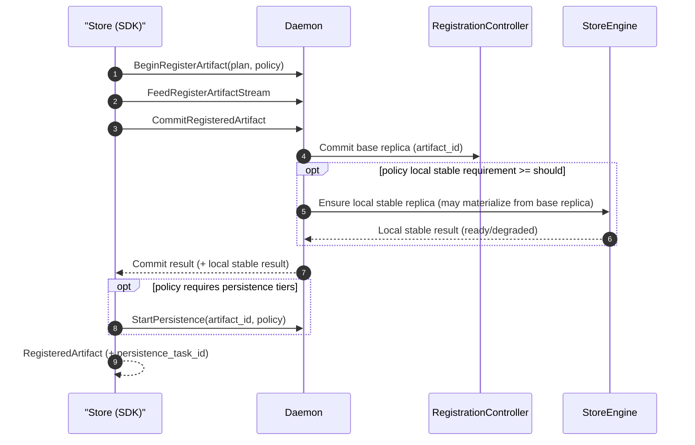

# Summary

This design makes `StorePolicy` the single, unified declaration of an artifact’s cluster-wide durability/placement intent for both `register` and `put` (Design 0044). Concretely:

- `register` continues to commit a VRAM replica (typically LIP/lease), but **also** synchronously satisfies `stable_dram(scope=local)` when requested by policy (via a daemon-owned materialization step).
- `put` continues to commit a stable-DRAM (CPU) replica, and now shares the same first-class `policy` parameter surface as `register`.
- Remote stable-DRAM and shared-disk tiers are still satisfied asynchronously via the persistence pipeline (Design 0041) and surfaced via persistence task status; local stable-DRAM is the only tier that can be satisfied synchronously within the commit boundary.

Internally, the “local mirror” is just one implementation path for satisfying the policy’s local stable tier when the source replica is a VRAM lease. It does not appear in the public API or in user-facing terminology.

# Problem Statement

Today:

- `register` commits a VRAM lease/coalesced replica but does not create a local stable-DRAM replica, so it cannot satisfy user intent like “also keep a local stable copy”.
- Users must manually chain `register` → `put` or re-register from CPU to keep a local copy, adding complexity and potentially producing surprising behavior differences across verbs.
- The current SDK exposes policy primarily through `RegisterArtifactOptions(policy=...)`, and `put`/`register` do not share a single, obvious first-class policy argument, weakening the “one policy surface” goal in Design 0044.

The proposed “local=mirror|pinned” entrance in the prior 0045 draft introduces a second, verb-specific mental model and a new user concept (“mirror”) that does not generalize across `register` and `put`.

# Goals / Non-Goals

## Goals

- Keep `StorePolicy` (Design 0044) as the **only** user contract for durability/placement across `register` and `put`.
- Make `register` able to satisfy `stable_dram(scope=local)` when requested by policy, without changing artifact id computation.
- Make `register` and `put` accept the same first-class `policy: StorePolicy | str | None` surface to reduce conceptual/ergonomic drift.
- Clarify where `must/should/may` apply:
  - local stable tier: synchronous (commit-time) enforcement and reporting;
  - remote stable/shared disk tiers: asynchronous persistence-task enforcement and reporting (Design 0041/0044).
- Avoid new ad-hoc runtime knobs; reuse `engine.memory_tiers.stable_bytes` and `StableDramCacheManager`.
- Ensure persistence prefers a daemon-owned source (stable DRAM) when present to avoid reading from preemptible/user-owned VRAM lease memory.

## Non-Goals

- Introduce new storage tiers or add a VRAM tier to `StorePolicy`.
- Change canonical indexing, hashing, or artifact id semantics.
- Redesign persistence state machines; this design reuses Design 0041 and only tightens the local-source selection when available.
- Change Global Store schema.

# North Star Model (Global Consistency)

Treat both `register` and `put` as two phases over a single contract (`StorePolicy`):

1. **Synchronous commit phase**: commit an immediately usable local replica (VRAM or stable DRAM, depending on plan).
2. **Policy satisfaction phase**:
   - **Synchronous**: satisfy `stable_dram(scope=local)` when the resolved policy requires/suggests it and the committed replica is not already stable.
   - **Asynchronous**: satisfy remote stable and/or shared disk tiers via the persistence pipeline (Design 0041) and surface results via persistence task status (Design 0044).

“Mirror” is not a policy concept; it is a possible mechanism to satisfy the local stable tier when the committed source is a VRAM lease.

## Terminology

- **Base replica**: the replica committed by the chosen registration plan (`vram_leased`, `vram_coalesced`, or `dram_stable`).
- **Local stable tier**: the `stable_dram(scope=local)` requirement in `StorePolicy`.
- **Local stable materialization**: a daemon-side copy into stable DRAM performed to satisfy the local stable tier when the base replica is not stable.
- **Persistence tiers**: `shared_disk` and `stable_dram(scope=remote|any)`.

# SDK API Surface (Unified)

## First-class `policy` for both verbs

Add a first-class `policy` parameter to both `register` and `put` (and async variants), while keeping `options` as an advanced escape hatch.

```python
def register(
    tensors: TensorDict,
    *,
    key: str | None = None,
    policy: StorePolicy | str | None = None,
    options: RegisterArtifactOptions | None = None,
) -> RegisteredArtifact: ...

def register_async(
    tensors: TensorDict,
    *,
    key: str | None = None,
    policy: StorePolicy | str | None = None,
    options: RegisterArtifactOptions | None = None,
) -> ArtifactFuture[RegisteredArtifact]: ...

def put(
    tensors: TensorDict,
    *,
    key: str | None = None,
    policy: StorePolicy | str | None = None,
    options: RegisterArtifactOptions | None = None,
) -> RegisteredArtifact: ...

def put_async(
    tensors: TensorDict,
    *,
    key: str | None = None,
    policy: StorePolicy | str | None = None,
    options: RegisterArtifactOptions | None = None,
) -> ArtifactFuture[RegisteredArtifact]: ...
```

Precedence and validation:

- If `policy` is provided, it must be forwarded to the daemon as the call’s effective policy (prefer daemon-side resolution per Design 0044).
- If both `policy` and `options.policy` are provided, they must be identical after normalization; otherwise raise `INVALID_ARGUMENT` (SDK-side) to avoid silent divergence.

## Profiles for common workflows

To keep common workflows ergonomic while preserving a single policy surface, prefer policy profiles over verb-specific flags. Existing profiles from Design 0044 remain, and this design proposes adding one profile:

- `warm` (new): “keep a local stable copy when possible”
  - expands to: `should stable_dram(scope=local, retention=best_effort)`
  - default `overflow_policy=reject` (do not evict other entries just to satisfy a `should`)
  - no persistence tiers

This profile is the user-facing replacement for the prior “local=mirror” idea, but it is expressed entirely as a policy profile.

Implementation note: adding `warm` requires extending `PolicyProfile` in `proto/tensorcast/daemon/v1/store_daemon.proto` and regenerating Python stubs via `bash tools/build_proto_python.sh`.

`pinned` remains the strict profile:

- `pinned`: `must stable_dram(scope=local, retention=pinned)`, `overflow_policy=reject`

## Migration note (if an alias exists)

If the SDK previously exposed `local="mirror"|"pinned"`:

- Mark it deprecated and map it to policy:
  - `local="mirror"` → `policy="warm"`
  - `local="pinned"` → `policy="pinned"`

The documentation and examples should standardize on `policy=...` only.

# Execution Flow

Local stable tier satisfaction is part of the commit boundary. Persistence remains an explicit post-commit action initiated by the SDK (as today), based on the same `StorePolicy` (Design 0044).



# Daemon Behavior

## Policy resolution

The daemon remains the single source of truth for resolving `StorePolicy` (Design 0044). `daemon/store_policy_resolver.*` already derives:

- local stable requirement level (`may/should/must`)
- local retention mode (`best_effort/ttl/pinned`) and TTL
- overflow policy (`evict/spill/reject`)
- persistence lowering inputs (shared disk and remote stable requirements, layout)

This design extends enforcement into the `CommitRegisteredArtifact` path so the local stable tier can be satisfied synchronously for `register`. The effective `StorePolicy` is supplied at begin time (`BeginRegisterArtifactRequest.policy`) and must be preserved by the daemon for commit-time enforcement.

## Satisfying the local stable tier

During `CommitRegisteredArtifact` (using the policy captured from `BeginRegisterArtifactRequest.policy`):

1. Commit the base replica and compute `artifact_id` once.
2. Resolve `StorePolicy` and extract the local stable tier intent:
   - If local requirement is `< should` (i.e., `none|may`), return `SKIPPED`.
   - If local requirement is `should|must`, ensure a local stable replica exists and is admitted with the resolved stable-cache policy.
3. Implementation choices (daemon/core):
   - If a local CPU stable replica already exists for the artifact, apply/upgrade the retention contract (e.g., best_effort → pinned) and return `READY`.
   - If the base replica is already stable (`dram_stable` plan), apply/upgrade retention and return `READY`.
   - Otherwise, materialize a stable replica from the base replica:
     - Prefer a daemon-owned VRAM source (coalesced VRAM) when available.
     - Otherwise use the LIP/lease source (seekable reader over committed lease segments).
     - Call `StableDramCacheManager::admit(...)` with the resolved policy.

Error mapping:

- If the local stable tier is `must`, failures MUST fail the RPC (no partial success).
- If it is `should`, failures MUST be surfaced as `DEGRADED` in the response while the commit remains successful.
- `may` never triggers proactive local materialization and therefore never degrades.

## Region-backed registration (Design 0021)

For LIP sources that are region-backed:

- Local stable materialization MUST resolve segments through `storage_id` and must not depend on per-segment CUDA handle bytes.
- The daemon must hold the relevant IPC region registry references for the duration of the copy so the source cannot be unregistered mid-copy.

Error handling follows region-backed preconditions:

- `PERMISSION_DENIED` when `owner_pid` does not own the referenced region.
- `FAILED_PRECONDITION` when region bounds/poisoned state/TTL invalidates the source.
- Map these to `DEGRADED` for `should`, and to RPC failure for `must`.

# Persistence Integration (Design 0041)

`StartPersistence` is still driven solely by `StorePolicy` (Design 0044). When multiple sources are available:

- Prefer local stable DRAM as the persistence source.
- Fall back to an active VRAM lease source only when no stable local source exists.

This prevents persistence from reading from preemptible/user-owned VRAM memory when a daemon-owned stable source exists.

# Proto and Result Shape

No new standalone RPC is introduced; local stable tier satisfaction is executed within `CommitRegisteredArtifact`.

```proto
message CommitRegisteredArtifactResponse {
  ...
  optional LocalStableTierResult local_stable_tier = 2000;
}

message LocalStableTierResult {
  LocalStableTierStatus status = 1;
  optional string message = 2;
}

enum LocalStableTierStatus {
  LOCAL_STABLE_TIER_STATUS_UNSPECIFIED = 0;
  LOCAL_STABLE_TIER_STATUS_READY = 1;
  // Requested as `should` but could not be satisfied.
  LOCAL_STABLE_TIER_STATUS_DEGRADED = 2;
  // Not requested by the resolved policy (or requested only as `may`).
  LOCAL_STABLE_TIER_STATUS_SKIPPED = 3;
}
```

SDK surface:

- Expose the local stable tier outcome on `RegisteredArtifact` (or nested under an existing `registration_result`) using the same terminology (`local_stable_tier`).

# Observability

Prefer policy-level terminology in metrics and logs:

- `tc_local_stable_tier_total{op,status,requirement}`
- `tc_local_stable_tier_seconds{op,status}`

Structured logs include `artifact_id`, resolved local requirement (`must/should`), retention policy, overflow policy, and the outcome.

# Invariants and Error Model

## Invariants

- `artifact_id` is computed once at commit; local stable materialization must not rehash or create a new artifact id.
- A `must stable_dram(scope=local)` tier implies pinned retention for the artifact lifetime unless explicitly deleted/deregistered (enforced by policy validation and cache manager behavior).
- No new config knobs are introduced; stable tier budget remains `engine.memory_tiers.stable_bytes`.

## Errors

Note: for local stable tier `should`, these errors must be surfaced as `LOCAL_STABLE_TIER_STATUS_DEGRADED` (while the commit RPC remains successful); only `must` propagates them as commit-RPC failures.

- `INVALID_ARGUMENT` for invalid/conflicting policy shapes (daemon is authoritative).
- `FAILED_PRECONDITION` when a required local stable copy has no eligible source.
- `RESOURCE_EXHAUSTED` when stable tier admission fails under the resolved overflow policy.
- `UNAVAILABLE` for daemon/transport failures.

# Schema Changes

None.

# Naming Compliance

- Proto messages/enums: `LocalStableTierResult`, `LocalStableTierStatus`.
- SDK methods: `register`, `register_async`, `put`, `put_async`.
- Fields: `local_stable_tier`, `persistence_task_id`.

# Alternatives and Rationale

- **Verb-specific `local="mirror"` flag**: rejected because it creates a second policy model and a non-generalizable user concept. Policy intent must be expressed as `StorePolicy`.
- **New `register_and_put` verb**: rejected due to API bloat; `StorePolicy` already expresses intent.
- **Extend `StorePolicy` with a VRAM tier**: rejected; it conflates ingest/source-plan details with durability intent.
- **Add a `CreateLocalReplica` RPC**: rejected; it weakens atomicity and duplicates policy enforcement context.

# Trade-offs and Risks

- Higher latency for `register` when policy requests local stable.
- Increased stable DRAM usage may raise cache pressure.
- Introducing the `warm` profile expands the policy surface; must remain daemon-resolved to avoid SDK/daemon drift.

# Compatibility & Acceptance Criteria

## Compatibility

- Calls that do not request local stable (policy local requirement `none|may`) see no behavior change.
- Existing persistence lowering and task semantics from Design 0041/0044 remain unchanged.

## Acceptance Criteria

- `register(policy="warm")` attempts to create a local stable-DRAM replica and returns `local_stable_tier.status=READY` on success.
- If local stable admission fails under `overflow_policy=reject`, `register(policy="warm")` still succeeds but returns `local_stable_tier.status=DEGRADED` with an actionable message.
- `register(policy="pinned")` fails if the local stable replica cannot be created/admitted.
- `put(policy=...)` accepts a first-class `policy` argument with the same semantics as `register`.
- `StartPersistence` prefers the local stable replica as a source when it exists.
- Region-backed lease registrations (Design 0021) can satisfy the local stable tier without per-segment CUDA handle bytes.

# References

- docs/designs/0014-store-session-api-modernization.md
- docs/designs/0003-unified-memory-registration-avbs-lip.md
- docs/designs/0021-region‑backed-registration.md
- docs/designs/0044-unified-put-policy-interface.md
- docs/designs/0041-distributed-persistence-placement.md
- daemon/store_policy_resolver.*
- tensorcast/api/_config.py
- tensorcast/api/store/registration.py
- proto/tensorcast/daemon/v1/store_daemon.proto
