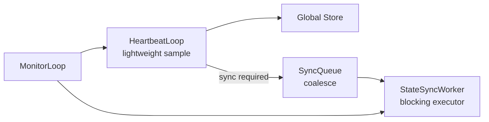

# Summary

Decouple heartbeat sampling from state synchronization so the daemon can keep heartbeats timely, avoid self-heal deadlocks, and recover from stalls without blocking the monitor loop. Add per-RPC timeout policies and cancellation/generation controls so stalled work exits quickly and can be replaced safely.

# Problem Statement

`WorkerLifecycleManager::heartbeat_loop` currently performs both heartbeats and full state synchronization. If the loop blocks in RPCs or sync/unload paths, heartbeats stall and the monitor thread attempts to restart by `join`ing the stuck thread. This can deadlock the monitor and remove self-heal. In addition, a single long RPC can make heartbeats appear dead even when the process is healthy.

# Goals / Non-Goals

## Goals

- Keep the heartbeat loop lightweight and predictable in latency.
- Ensure monitor restart does not block indefinitely on `join`.
- Run state synchronization in a background worker that can be cancelled or coalesced.
- Apply short timeouts to heartbeat RPCs and longer timeouts to sync RPCs with explicit retry policies.
- Preserve current protocol semantics and error handling behavior.

## Non-Goals

- Changing Global Store protobuf contracts or heartbeat payload shapes.
- Reworking the Store Engine data model or unload behavior.
- Introducing new thread pools outside `AsyncRuntime`.

# Architecture & Interfaces

## High-level flow

## Loop responsibilities

- Heartbeat loop
  - Sample lightweight state (accepting flag, inventory summary, cached checksum).
  - Send heartbeat RPC with short deadline and no or minimal retries.
  - Enqueue a sync request when `state_sync_required` or version mismatch is observed.
- State sync worker
  - Perform `synchronize_worker_state` and `request_full_state_sync` with longer timeouts.
  - Coalesce requests so only the latest sync request executes when multiple are queued.
  - Bound concurrency to one in-flight sync per worker.
- Monitor loop
  - Detect stalls via progress budget derived from RPC timeouts.
  - Request cancellation and restart without blocking the monitor thread on `join`.

## RPC policy support

Add a per-RPC policy to `GlobalStoreClient` so heartbeat and sync can use different deadlines and retry behavior.

Proposed interface changes (C++):

- `struct RpcOptions` with `timeout`, `max_retries`, and `retry_backoff`.
- `execute_rpc_with_retry(...)` accepts an optional `RpcOptions` override.
- `send_heartbeat_enhanced(...)` and `synchronize_worker_state(...)` accept `RpcOptions`.

## Configuration

Add per-RPC timeout fields to `tensorcast.config.v1.HighAvailability` and wire them into the daemon client configuration (per unified runtime config design):

- `heartbeat_rpc_timeout`
- `heartbeat_rpc_max_retries`
- `state_sync_rpc_timeout`
- `state_sync_rpc_max_retries`
- `full_sync_rpc_timeout`
- `full_sync_rpc_max_retries`

Defaults preserve existing behavior unless explicitly set.

## Invariants and error model

- Heartbeat loop must not block on sync work.
- At most one sync operation runs at a time per worker.
- Sync RPCs carry a monotonic `(sync_epoch, sync_request_id)` token; stale tokens are ignored.
- Restart requests must not block the monitor loop; cancellations are best-effort and bounded by RPC deadlines.
- Heartbeat RPCs must always have a deadline; retry count must be explicit and low.
- Sync failures do not change local state version or checksum and are logged with context.

## Naming Compliance (C++ APIs)

- `RpcOptions` (struct, PascalCase)
- `execute_rpc_with_retry` (function, snake_case)
- `send_heartbeat_enhanced` overload with `RpcOptions` (function, snake_case)
- `synchronize_worker_state` overload with `RpcOptions` (function, snake_case)
- `enqueue_state_sync` (function, snake_case)

# Schema Changes

None.

# Trade-offs & Risks

- More moving parts (queue, cancellation) increase complexity; mitigate with clear ownership and metrics.
- Short heartbeat deadlines may raise false negatives under transient GC or CPU stalls; mitigate with retry limits and backoff tuning.
- Coalescing sync requests can drop intermediate states; acceptable because the latest state is authoritative.

# Compatibility & Acceptance Criteria

- No protobuf contract changes.
- Heartbeat cadence remains within configured interval even under slow sync.
- Monitor loop can restart stalled work without blocking for unbounded time.
- Sync uses separate RPC policy and does not impact heartbeat liveness.

# References

- `daemon/ha/worker_lifecycle_manager.cc`
- `core/store/components/global_store_client.cc`
- `docs/designs/0004-unified-runtime-config.md`
