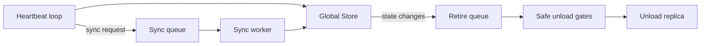

# Summary

Define a strict replica visibility model and a safe retire pipeline so HA reconciliation never deletes in-use replicas or advertises non-resident inventory. This design builds on the heartbeat/sync decoupling and persistent state versioning work and focuses on correctness of inventory, deletion semantics, and safe unload gates.

# Problem Statement

The current HA flow conflates "present in registry" with "resident and publishable". `WorkerLifecycleManager` builds inventory from `get_all_replicas_info()` and maps any non-CPU/GPU entry to DISK, which advertises replicas that are not actually resident. In addition, the heartbeat path computes `obsolete_replicas` by artifact id and the daemon unloads immediately, bypassing ref-count, lease, and transport lock safety gates. These issues can lead to false routing, premature eviction, and data-plane failures when replicas are still referenced by clients.

# Goals / Non-Goals

## Goals

- Publish only replicas that are resident and intended for Global Store routing.
- Remove any implicit "delete by diff" semantics from heartbeats.
- Ensure all HA-triggered unloads are gated by ref counts, lease pins, and transport locks.
- Preserve protocol compatibility while allowing the Global Store to reconcile to the daemon's authoritative inventory.

## Non-Goals

- Changing the heartbeat or sync protobuf schema.
- Introducing new storage backends or new persistent replica types.
- Reworking materialization pipelines or UMA memory management.

# Architecture & Interfaces

## Overview

The heartbeat loop remains lightweight (per 0046). It enqueues sync work when GS reports drift or when local publish state changes. The sync worker builds a publishable inventory and performs `SynchronizeWorkerState`. Removal requests enter a retire queue and are only unloaded after safety gates pass.

## Replica publish state

Introduce a local-only publish state for each replica key:

- `LOCAL_ONLY`: do not advertise to GS and do not include in HA inventory.
- `PUBLISH_PENDING`: should be advertised; GS may not have it yet.
- `PUBLISHED`: successfully registered or reconciled via sync.
- `RETIRING`: GS requested removal; do not advertise; unload when safe.

The publish state is stored locally (daemon/core) and is not persisted in the Global Store. It is derived from materialization intent and HA sync outcomes.

## Inventory snapshot

The sync worker builds an inventory snapshot using these rules:

- Only include `PUBLISH_PENDING` and `PUBLISHED` replicas.
- Only include replicas with CPU or GPU residency; never map non-resident entries to DISK.
- Do not include replicas that are `RETIRING` or `LOCAL_ONLY`.

This snapshot becomes `WorkerLocalState.local_replicas` for `SynchronizeWorkerState`. It is the only source of truth for additions and removals.

## Safe retire pipeline

- `StateChange::REMOVE_REPLICA` transitions the matching local replica to `RETIRING`.
- The daemon disables remote access for GPU replicas (best effort) and removes the replica from the publishable inventory immediately.
- A retire worker periodically checks safety gates and performs unload when safe.

Safety gates must all be satisfied before unload:

- `RefTracker` ref_count is zero.
- `SessionLifecycleManager` use_count and placement_pins are zero.
- `TransportLockManager` does not hold a lock for the replica key.

If any gate is non-zero, the replica remains `RETIRING` and is retried later.

## Heartbeat semantics

`obsolete_replicas` is treated as a diagnostic signal only. It may still trigger a sync request, but it must not lead to immediate unloads.

## Interfaces (C++)

New or adjusted interfaces are expected in daemon/core:

- `enum class ReplicaPublishState`
- `struct ReplicaInventoryEntry` (includes remote_memory_keys/buffer_sizes for HA P2P metadata)
- `get_ha_inventory()` in `ReplicaRuntime` or `StoreEngine`
- `set_replica_publish_state(...)` for per-replica updates
- `mark_replica_retiring(...)` for transition into retire queue

### Naming Compliance (C++ APIs)

- Types use PascalCase: `ReplicaPublishState`, `ReplicaInventoryEntry`.
- Functions use snake_case: `get_ha_inventory`, `set_replica_publish_state`, `mark_replica_retiring`.
- No new constants or macros are introduced in this design.

## Invariants and Error Model

- A replica is advertised to GS only if it is resident and publishable.
- Heartbeat processing never triggers unload directly.
- Unload never happens while any ref, lease, or lock remains.
- If sync fails, publish state does not advance to `PUBLISHED` and version/checksum are not modified (per 0047).
- If unload fails due to in-flight load, the replica remains `RETIRING` and is retried.

# Schema Changes

None. This design relies on the persistent state versioning in 0047 but does not add new database columns.

# Alternatives and Rationale

- Keep `obsolete_replicas` and add guard checks: reduces risk but still conflates local-only replicas and retains false DISK advertisement.
- Add explicit Retire/Ack RPCs: clean semantics but requires proto changes and coordination across releases. This design defers that complexity.
- Represent disk replicas locally and publish them: not supported by current store runtime and would require new data paths.

# Trade-offs & Risks

- `RETIRING` replicas become invisible to GS immediately, so remote routing will not use them even if local memory still exists.
- Additional local state tracking adds complexity but is contained within daemon/core.
- Sync correctness depends on accurate publish state; incorrect transitions can lead to missing replicas until the next sync.

# Compatibility & Acceptance Criteria

- No protobuf schema changes; existing fields remain compatible.
- Heartbeats remain lightweight and use cached version/checksum (per 0046/0047).
- GS no longer deletes local replicas based solely on heartbeat diff.
- HA inventory never advertises non-resident replicas as DISK.
- Unload paths respect ref counts, lease pins, and transport locks.

# References

- `docs/designs/0046-ha-heartbeat-sync-decoupling.md`
- `docs/designs/0047-persistent-worker-state-version.md`
- `docs/architecture/high-availability-design.md`
