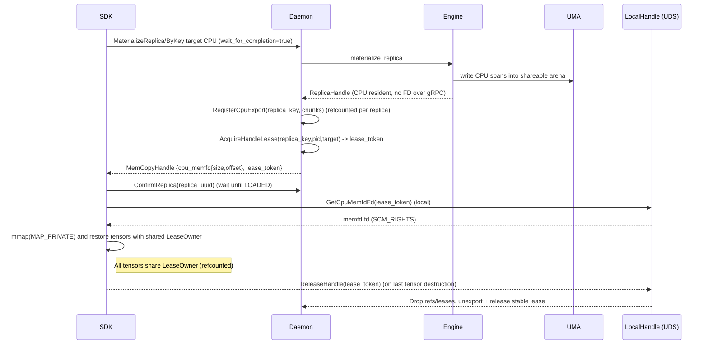

# Summary

Enable Artifact.tensor_dict to return CPU tensors without extra copies by backing UMA CPU allocations with shareable,
memfd-backed memory and exporting a local CPU handle alongside the existing CUDA IPC handle.

**Critical addition vs. the initial draft**: introduce a **handle lease** model so the daemon retains and protects the
exported backing **for exactly as long as the client tensors live**. The SDK binds the daemon-side lease lifetime to the
returned `torch.Tensor` objects (RAII): when the last tensor view is destroyed, the client releases the lease; only then
may the daemon drop export pins / stable leases and reclaim.

This is intentionally **pythonic**: users do not manage leases explicitly. Users simply drop tensor references
(`del`, scope exit) and the C++ extension releases the daemon lease as part of the tensor storage lifetime (no Python
`__del__` hooks or context managers required).

This design is **local-only**: both CUDA IPC and memfd handles are only meaningful on the same host. Local-only UDS
control is used for (a) FD handoff and (b) lease release signals; gRPC is used for materialization control and metadata.

# Goals / Non-Goals

## Goals
- Support `Artifact.tensor_dict(device="cpu")` and CPU-target materialization with zero-copy CPU tensors.
- Bind the daemon export lifetime to client tensor lifetime (no eager unload before returning tensors).
- Keep UMA chunk ledger and transfer pipelines unchanged; do not introduce a second CPU buffer.
- Provide a cross-process CPU handle that can be used by SDK to map and restore tensors (local-only).
- Preserve existing GPU behavior and compatibility for CUDA IPC paths (but align lifetime semantics via the same lease model).
- Decide shared-DRAM enablement and pool sizing at daemon startup; fail fast when required resources are unavailable.

## Non-Goals
- Cross-host CPU tensor access. CPU local exports are host-local only.
- Changing region-backed tensor_dict_into semantics.
- Supporting non-memfd shared-memory backends. This design is memfd-only.
- Introducing ad-hoc environment variables or scattered flags. Any knobs must go through the unified runtime config
  system (`docs/designs/0004-unified-runtime-config.md`).

# Architecture and Interfaces

## Key idea

UMA already manages a contiguous CPU region and chunk metadata. Replace the CPU backing allocation from
anonymous mmap to a shareable, memfd-backed mmap (`memfd_create` + `mmap(MAP_SHARED)`), and export a local CPU handle.
All ingestion and copy paths already write into UMA using offsets, so no extra copies are added.

To make this correct with today’s SDK behavior, we must also make the export lifetime explicit:

- The daemon returns a `MemCopyHandle` with:
  - a data handle (`cuda_ipc_handle` or `cpu_memfd`)
  - a **`lease_token`** (opaque capability) representing the daemon-side retention/protection of that data handle
- The SDK maps the data handle and reconstructs tensors, attaching a shared RAII owner to all tensors.
- When the last tensor is destroyed, the owner releases the `lease_token` to the daemon over a **local** IPC channel.
- The daemon’s `lease_token` finalizer drops PID refs / UseLease (GPU) and CPU export pins + stable leases (CPU).

Because gRPC cannot transfer file descriptors, the `memfd` path uses a local-only side channel (Unix domain socket +
`SCM_RIGHTS`) to hand the FD to the SDK. The gRPC response carries an opaque lease token + size/offset metadata, and
the SDK discovers the local socket path via `GetServerConfigResponse` (backed by unified daemon config).

## User-facing SDK semantics (pythonic)

- `Artifact.tensor_dict(...)` continues to return `dict[str, torch.Tensor]` (no wrapper object, no context manager
  required).
- No explicit “lease object” is exposed to users. The only action required to release resources is to drop references to
  returned tensors (`del`, scope exit, container cleanup).
- Lifetime binding is implemented in the C++ extension: all returned tensors share a refcounted owner. When the last
  tensor is destroyed, the owner releases the daemon `lease_token` (best-effort) and unmaps/closes any client-side
  mappings (CUDA IPC mapping or CPU memfd mapping).
- If Python GC delays destruction (e.g., reference cycles), the daemon’s PID-exit / TTL cleanup remains the safety net.

## Data flow



## UMA CPU backing

- Replace CpuArena::allocate_region to create a shareable mapping using `memfd_create` + `ftruncate` + `mmap(MAP_SHARED)`.
- Store backing metadata in `ReplicaAllocation::CpuRegion` so it can be exported later (memfd fd, size, offset).
- Keep the chunk ledger unchanged. Chunk offsets are still computed as
  va_offset = chunk_idx * chunk_size and flow into write_cpu_span.
- Use stable leases and export tracking to prevent eviction during export.
- Export shape (v1): use **one memfd per exported replica** (`offset_bytes == 0`), so the FD is a narrow capability for
  exactly one artifact replica. `offset_bytes` exists to keep a forward-compatible path to a shared-arena design, but a
  single shared memfd would widen the capability boundary (a leaked FD could reveal multiple replicas), so it is deferred.

### Startup validation and pool sizing (fail-fast)

Shared-DRAM enablement and pool sizing are decided at daemon startup and wired through the unified runtime config:

- Pool sizing source of truth: `DaemonConfig.engine.memory_tiers.stable_bytes` (stable DRAM budget).
- CPU shared memory enablement: `DaemonConfig.engine.cpu_shared_memory.enabled`.
- Local handle plane config (required for lease release; also used for CPU FD handoff): `DaemonConfig.lifecycle.handle_leases`
  section (socket path + TTL/auth knobs). TTL is optional and **disabled by default** (`ttl` unset/0s); live clients
  release leases explicitly when tensors are freed, and crash safety relies on PID-exit cleanup. If desired as a
  bug/crash backstop, operators may set a non-zero TTL.
- Runtime admission control: stable DRAM is a **hard budget** in UMA via stable leases
  (`MemoryTierBudget::try_acquire_stable`). When CPU shared memory is enabled, the daemon must acquire (or reuse) a stable
  lease covering the exported CPU chunk ranges **before returning** a CPU handle. If the stable budget is exhausted, the
  request fails with `RESOURCE_EXHAUSTED` (no silent fallbacks).

To avoid “use-then-OOM” failure modes, we add an explicit fail-fast posture:

- The daemon must validate stable budget against host/cgroup limits (best-effort but fail-closed when finite limits are
  detected).
- Optionally (configurable), the daemon may **prefault** a probe allocation at startup and/or prefault pages on export to
  move allocation failures into controlled code paths (rather than random OOM during inference).

At startup, the daemon must fail fast (clear error + non-zero exit) when CPU shared memory is enabled but prerequisites
are not satisfied:

- Validate `stable_bytes` against UMA capacity (already enforced today during runtime option validation).
- Do not attempt to size-check `/dev/shm`: memfd allocations are not backed by a named tmpfs mount and are instead
  charged to the host/cgroup shmem budget. Capacity validation is therefore expressed in terms of UMA capacity and
  (when present) the memory cgroup limit.
- Additionally fail startup if:
  - `memfd_create` is unavailable/blocked (e.g., seccomp) or `ftruncate`/`mmap(MAP_SHARED)` fails on a probe allocation
    (at least one page).
  - The process is running under a memory-cgroup limit that is smaller than the configured stable pool (best-effort
    check; fail closed when a finite `memory.max` is detected and `stable_bytes` exceeds the remaining budget after
    pinned pools and headroom).
  - the daemon cannot bind/listen on the configured local handle socket path (UDS) with secure permissions (`0600`).

This makes shared-DRAM deployment failures deterministic and early, rather than failing after partial work or after
producing handles that the client cannot map.

### Eviction semantics
- Exported CPU chunks must not be reclaimed (preempted/evicted/overwritten) while a client mapping is in use.
- The daemon enforces this by holding:
  - `UMA::set_exported(..., CPU, chunks, on=true)` keepalive (pin leases)
  - a stable lease covering the same chunk indices
  - a daemon-side handle lease (`lease_token`) that is only released when the client signals it (tensor lifetime ends)
- After lease release, the daemon may drop the export pin and stable lease; **the memfd mapping cannot be revoked**
  retroactively, so correctness is only guaranteed while the lease is held.
- For shareable/file-backed mappings:
  - Do not use “anonymous remap” fallbacks (e.g., `MAP_FIXED|MAP_ANONYMOUS`) in write paths; this breaks
    cross-process sharing by silently replacing file-backed pages.
  - Prefer `MADV_DONTNEED`/`MADV_PAGEOUT` (when supported) for non-exported chunks; avoid `MADV_FREE` on shareable
    mappings.

## Handle lease model (required for correctness)

This design introduces an explicit handle lease to align daemon retention with the client tensor lifetime.

### Terms

- **lease_token**: the sole capability representing “daemon guarantees this handle is safe to use”. While the lease is
  active, the daemon must keep the underlying backing stable/pinned and must not evict/preempt exported ranges. For CPU
  memfd exports, the same `lease_token` is also presented over local IPC (`SCM_RIGHTS`) to exchange for the backing FD
  (gRPC cannot transmit FDs). This token is not exposed in the Python user API; it is an internal capability used by the
  SDK/extension to coordinate lifetime. When the lease ends, the daemon may reclaim.

### Handle validity and readiness (ConfirmReplica)

Today the daemon returns `MemCopyHandle` as soon as allocation succeeds (status `MATERIALIZE_REPLICA_STATUS_ALLOCATED`),
even though loading may still be in progress. Readiness is instead enforced via `ConfirmReplica`, which waits on the
daemon session’s `ReadySignal` (see `daemon/service/controllers/materialization_controller.cc`).

**Invariant (required): the SDK MUST NOT create zero-copy tensors until the replica is confirmed LOADED for the target
device.**

Concretely:
- For any API that returns `torch.Tensor` views (GPU CUDA IPC or CPU memfd), the SDK must request
  `wait_for_completion=true` and/or explicitly call `ConfirmReplica` before mapping/importing handles.
- For CPU memfd, the SDK must perform FD exchange (`GetCpuMemfdFd`) and `mmap` only after readiness is confirmed;
  otherwise the mapping may observe partially-written data.
- If an async/non-blocking API is desired (`wait_for_completion=false`), it must not expose a usable `torch.Tensor`
  view directly; it must return a waitable/future first (future work; out of scope for this design).

### Important semantic note

The daemon **cannot** observe “the client closed the FD” nor can it force existing client mappings to invalidate. For
correctness, the client must explicitly release the lease (best-effort) and the daemon must also have crash/expiry
cleanup (PID exit + TTL). After lease expiry, a buggy/leaky client may still hold stale mappings; that is treated as a
client bug and not a correctness contract.

### Daemon implementation (reuse existing lifecycle managers)

To avoid adding a second lease/liveness system, handle leases should reuse the existing daemon lifecycle machinery:

- Represent each `lease_token` as a `daemon::SessionLifecycleManager` Use lease (PID liveness guard + optional TTL guard).
- Keep `lease_token` **unguessable** (bytes). Internally map it to a `SessionLifecycleManager::LeaseId` (uint64).
- Extend `SessionLifecycleManager` to support non-GPU subjects (CPU) and to allow attaching additional finalizers at
  lease creation (for CPU export cleanup):
  - **Subject identity must be the full `store::loading::ReplicaKey`** (includes `view_id` and `device.uuid`), not just
    `{artifact_id, device_id}`. This avoids collisions between canonical vs view variants and avoids mismatches when
    GPUs are selected by UUID (see `core/store/materialization/contracts/loading_spec.h` and `daemon/state/ref_tracker.h`).
  - Finalizers must act on the exact `ReplicaKey` used for `RefTracker::add_ref` (not a reconstructed key), otherwise
    PID-exit/TTL cleanup can leak references.
  - Keep GPU reclaim behavior GPU-only (`maybe_unload_daemon_replica_`); CPU handle leases use finalizers to drop export
    pins and stable leases instead of unloading immediately.
- Reuse the `daemon::IpcRegionRegistry` pattern (token+TTL+refcount) for the CPU-export bookkeeping:
  - A per-replica export record holds `memfd` FD + UMA export keepalive + stable lease and is refcounted across multiple
    `lease_token`s.
  - A per-lease record binds `lease_token -> (replica_key, lease_id, created_at, last_touched_at, bound_uid?)`.

**OS credentials vs. gRPC metadata**

The daemon cannot reliably learn the caller UID/PID from gRPC. If we need to bind a handle lease to a specific UID/PID,
the binding must happen via the local IPC plane using `SO_PEERCRED` (see Local IPC section). Otherwise, treat the
`lease_token` as a capability and rely on local socket filesystem permissions (`0600`) for access control.

With this structure, there is a single TTL/PID cleanup loop (`SessionLifecycleTask`), and `ReleaseHandle(lease_token)`
becomes a thin call that retires the underlying Use lease and runs finalizers idempotently.

## Unified zero-copy handle contract (GPU + CPU)

This is a project-wide correctness contract, not a CPU-only feature:

- Any `MemCopyHandle` that implies **zero-copy tensor views** (CUDA IPC or CPU memfd) must include a `lease_token`.
- The daemon guarantees that the underlying backing will not be reclaimed/overwritten while the handle lease is active.
- The SDK must not eagerly call `UnloadReplica` after reconstructing tensors for `tensor_dict()`. Instead, it relies on
  the C++ owner to release the `lease_token` when the last tensor is destroyed.
- Wire compatibility: `lease_token` is additive; older clients ignore it.
- Correctness note: zero-copy tensor lifetime safety requires honoring `lease_token`. Older clients that eagerly call
  `UnloadReplica` may still observe use-after-free if the daemon reclaims/evicts while tensors are live.

### Borrowed vs owned semantics (SDK)

- **Borrowed view**: APIs that return tensors backed by daemon-managed memory (e.g., `tensorcast.get()`, `get_view()`,
  `Artifact.tensor_dict()`) are governed by `lease_token`. The SDK must hold the lease until the last tensor is
  destroyed.
- **Owned copy**: APIs that copy into caller-provided buffers (e.g., `tensor_dict_into()`, `get_into()`) do not require a
  handle lease; after the copy completes the daemon may release/evict the replica.

## Stable budget semantics (`stable_bytes`)

This design relies on `DaemonConfig.engine.memory_tiers.stable_bytes` as a **hard, node-level admission budget** for
**CPU shared-memory exports** (UMA stable leases). The intent is to keep the daemon out of “random runtime OOM” by
enforcing:

- **No CPU export without stable capacity**: the daemon must hold a stable lease covering the exported CPU chunk ranges
  for the entire handle lease lifetime. If stable capacity is exhausted, materialization fails with
  `RESOURCE_EXHAUSTED`.
- **Charge per unique exported replica, not per consumer**: multiple client processes may map the same exported replica.
  Stable bytes must not be double-counted per client. The daemon holds the stable lease once per exported replica and
  refcounts it across `lease_token`s.
- **Export scope (v1)**: a CPU memfd handle exposes a mapping for the entire replica region (`size_bytes == artifact_size`).
  For simplicity and correctness, the daemon treats this as “export the whole replica” and holds stable+pin for all
  replica chunks while any lease token is active. (A future optimization may lease only the subset chunk ranges required
  by the returned payload descriptors.)

**Cache vs export policy (global)**

`stable_bytes` is shared across correctness-critical exports and performance-only stable cache consumers (e.g.,
`StableDramCacheManager`). Exports have priority: when stable lease acquisition for an export fails with
`RESOURCE_EXHAUSTED`, the daemon may preempt stable cache entries (even pinned/TTL) to free stable capacity and retry.

GPU CUDA IPC handles do not consume `stable_bytes`; they are protected by the existing GPU retention/eviction machinery
(RefTracker + lifecycle leases) and by the handle lease itself.

**Avoiding runtime OOM**

Stable budgets reduce OOM risk but do not eliminate it. To “use memory early” and fail in controlled code paths:

- Startup must validate stable_bytes against host/cgroup limits and fail fast on invalid configs.
- Optionally (configurable), the daemon may prefault pages on export (or run a larger probe at startup) so allocation
  failures surface as `RESOURCE_EXHAUSTED`/startup failures rather than deferred OOM.

## Protocol changes

Add a CPU local-export handle to `MemCopyHandle` and allow CPU targeting in by-key requests.

Proposed proto additions in proto/tensorcast/daemon/v2/store_daemon.proto:

- `CpuMemfdHandle`:
  - `uint64 size_bytes`
  - `uint64 offset_bytes` (reserved; 0 for now)

- `GetServerConfigResponse`:
  - `bool cpu_shared_memory_enabled`
  - `string local_handle_socket_path` (used for local FD exchange + lease release)

- MaterializeByKeyRequest:
  - DeviceType target_device_type (default unspecified means GPU, CPU ignores device_id)

The server sets exactly one of `cuda_ipc_handle` or `cpu_memfd`. The CPU handle is populated only when
the target device is CPU and the replica is loaded in CPU memory. For MaterializeReplicaRequest,
target_device_type already exists and must be set to DEVICE_TYPE_CPU with an empty device_uuid.
MaterializeByKeyRequest should skip GPU ordinal validation when target_device_type is CPU; device_id
is ignored in that case.

### CPU memfd handle token

`lease_token` is daemon-minted and unguessable. It is not derived from artifact_id or replica_uuid. The daemon stores
two layers of state:

- **Handle lease record** (keyed by `lease_token`): `lease_token -> (replica_key, lease_id, created_at, bound_uid?)`
  where `lease_id` is an internal `SessionLifecycleManager::LeaseId` that enforces TTL guards and runs finalizers. If we
  bind leases to OS identities, the binding must be learned from the local IPC peer (`SO_PEERCRED`); gRPC does not
  reliably provide UID/PID.
- **CPU export record** (keyed by `replica_key`, refcounted across leases): `replica_key -> (memfd_fd, size, offset,
  stable_lease, uma_export_keepalive, refcount)`.

For CPU memfd exports, `lease_token` is presented over the local IPC channel to exchange for a file descriptor via
`SCM_RIGHTS`. The daemon must authenticate the peer (see Local IPC section below) and reject unknown/expired tokens.

Proto sketch (field numbers fixed for compatibility):

```proto
message MemCopyHandle {
  oneof handle {
    bytes cuda_ipc_handle = 1;
    CpuMemfdHandle cpu_memfd = 2;
  }
  bytes lease_token = 3;
}

message CpuMemfdHandle {
  uint64 size_bytes = 1;
  uint64 offset_bytes = 2;
}

message MaterializeByKeyRequest {
  string key = 1;
  int32 device_id = 2;
  int32 pinned_allocation_timeout_ms = 3;
  string replica_uuid = 4;
  int32 pid = 5;
  DeviceType target_device_type = 6;
  // existing fields unchanged...
}
```

## Local IPC: FD handoff + lease release (required)

Because gRPC cannot transmit file descriptors, the daemon exposes a local-only Unix domain socket endpoint for FD
handoff and lease release. The SDK uses this endpoint:

- when it receives a `CpuMemfdHandle` (FD exchange)
- when it needs to release a `lease_token` (tensor lifetime ended)

`ReleaseHandle` is supported whenever `lease_token` is returned (GPU + CPU). `GetCpuMemfdFd` is only supported when
`cpu_shared_memory_enabled` is true; otherwise it returns `FAILED_PRECONDITION`.

Server behavior:
- Listen on `local_handle_socket_path` (from `GetServerConfigResponse`); bind with permissions `0600`.
  - If a stale socket file exists at startup, the daemon may `unlink` it **only if** it is a socket and is owned by the
    daemon user; otherwise fail closed (do not delete arbitrary files).
- Maintain:
  - a **per-replica CPU export registry** (CPU FD handoff; refcounted across leases)
  - a **handle lease registry** keyed by `lease_token` (lifetime / retention / cleanup; also used to request the FD)
- Apply guardrails:
  - Rate-limit new handle-lease mints (best-effort; configured) to reduce impact of buggy/abusive clients.
- Authenticate peers:
  - Primary access control is filesystem permissions: the daemon must create the socket at `local_handle_socket_path`
    with mode `0600` and ensure the parent directory is owned and writable only by the daemon user.
  - Use `SO_PEERCRED` (Linux) to obtain peer UID/PID for defense in depth.
  - Reject peers whose UID does not match the daemon effective UID.
  - Optionally bind `lease_token -> bound_uid` on first successful request and require the same UID for subsequent
    `GetCpuMemfdFd`/`ReleaseHandle` calls.
  - Use peer PID for logging and (optional) pid-liveness cleanup; do not rely on the gRPC request PID for security.
- For `GetCpuMemfdFd(lease_token)`:
  - Send the backing `memfd` FD via `SCM_RIGHTS`.
  - The daemon holds its own FD as long as the per-replica export record is alive (refcounted across active leases; TTL
    cleanup is a crash-safety fallback).
- For `ReleaseHandle(lease_token)`:
  - Retire the underlying Use lease (idempotent). The lease finalizer performs cleanup:
    - GPU: drop daemon refs / UseLease and trigger reclaim when no refs remain.
    - CPU: decrement the per-replica export refcount; when the last lease is gone, drop `UMA::set_exported` keepalive +
      stable lease and allow eviction/preemptible policies to apply again.
- Always have crash/expiry cleanup: PID-exit (via `PidMonitor`) and TTL sweep (via `BackgroundScheduler`).

Client behavior (SDK):
- Connect to `local_handle_socket_path`, send `lease_token`, receive FD.
- `mmap` with `MAP_PRIVATE|PROT_READ|PROT_WRITE` so user writes do not corrupt the daemon’s cache (copy-on-write). Note:
  `MAP_PRIVATE` does **not** provide snapshot isolation from daemon writes; correctness still relies on the handle lease
  contract (“daemon does not overwrite while lease is active”).
- Keep the FD and mapping alive inside the shared C++ owner for the tensor lifetime (no Python-level caching required).
- Bind lease release to tensor lifetime:
  - All returned tensors share a C++ owner object that remembers `(lease_token, local_handle_socket_path)` and releases
    the lease (best-effort) when the last tensor is destroyed.

## memfd best practices

- Use `memfd_create(MFD_CLOEXEC|MFD_ALLOW_SEALING)` and a recognizable name (debuggable but not sensitive).
- Set the final size with `ftruncate`, then add seals for resize prevention (`F_SEAL_SHRINK|F_SEAL_GROW`).
- When receiving an FD via `SCM_RIGHTS`, ensure it is `CLOEXEC` in the **receiver** (use `recvmsg(..., MSG_CMSG_CLOEXEC)`
  or `fcntl(F_SETFD, FD_CLOEXEC)`). `MFD_CLOEXEC` only applies to the daemon-owned FD; the duplicated FD in the client
  does not inherit `CLOEXEC` unless set explicitly.
- Optionally (deployment hardening), once an artifact is fully materialized and treated as immutable, add `F_SEAL_WRITE`
  to prevent further *file-backed* writes to the memfd (e.g., `pwrite`, or `mmap(MAP_SHARED|PROT_WRITE)`). Clients may
  still use `mmap(MAP_PRIVATE|PROT_WRITE)` to allow in-process copy-on-write updates without corrupting the daemon’s
  cache. Note: adding `F_SEAL_WRITE` fails (`EBUSY`) if the daemon still has any writable shared mappings of the memfd;
  only apply it after the daemon no longer needs to write (or after rematerialization allocates a fresh memfd).
- Keep daemon writes inside the mapped region only; do not rely on remapping tricks that would break sharing.
- Use the local FD handoff channel with peer credential checks; do not expose memfd via global filesystem names.

## C++ core changes

- UnifiedMemoryAuthority::CpuArena::allocate_region
  - Use shareable memfd-backed mapping.
  - Record backing metadata in ReplicaAllocation::CpuRegion.
- UnifiedMemoryAuthority::get_cpu_memfd_region (new accessor)
  - Returns an internal CpuMemfdRegion for the replica CPU region (fd, size_bytes, offset_bytes).
- loading::ReplicaHandle
  - Add CpuMemfdRegion so handle_stage can export CPU metadata to the daemon.
- UnifiedMemoryAuthority::CpuArena::write_span
  - Remove/forbid anonymous `MAP_FIXED` remap fallback when CPU arena is shareable; treat failures as errors.

## Daemon changes

- DeviceResolver already supports CPU type. MaterializationController should accept CPU targets
  and route to StoreEngine::materialize_replica with DeviceType::CPU.
- Ensure the LIP fast path remains GPU-only (it assumes GPU ordinals and returns CUDA IPC); skip LIP when the target
  device is CPU.
- Populate `MemCopyHandle.cpu_memfd` when target is CPU and shared DRAM is enabled.
- Populate `MemCopyHandle.lease_token` for both CPU and GPU handles.
- Run startup validation and fail-fast on insufficient resources.
- Add a LocalHandle service (UDS) to:
  - exchange CPU memfd FDs (`lease_token`)
  - release handle leases (`lease_token`)
- Add a handle lease registry integrated with `SessionLifecycleManager`/`PidMonitor`:
  - GPU lease release drops UseLease + PID ref and triggers reclaim when no refs remain.
  - CPU lease release drops stable lease + export pin and allows preemptible/evict policies to apply again.
- Keep the existing CUDA IPC data handle intact for GPU, but align retention to the lease model (no eager unload).

## SDK changes

- Device selection:
  - Accept device="cpu" without requiring disk fallback.
  - Pass target_device_type=CPU for materialize_by_key and materialize_replica.
- Materialization payload:
  - If cpu export handle is present, exchange `lease_token` for an FD over the local IPC socket, then map and restore
    tensors.
  - Apply offset_bytes as a base offset when computing tensor pointers (0 initially).
  - Preserve existing CUDA IPC mapping, but do not eagerly `UnloadReplica` for `tensor_dict`; release via lease token.
- Lifecycle:
  - `tensor_dict(...)` returns tensors whose lifetime is tied to `lease_token` (released on last tensor destruction).
  - `tensor_dict_into(...)` / region-backed flows continue to “copy then unload” and do not require handle leases.

## C++ extension changes

Add a CPU local-export restore path to avoid copies, and unify lifetime ownership across CUDA IPC and CPU memfd.

Proposed API in tensorcast._C:
- restore_tensors_from_cpu_fd(meta_state_dict, fd, mapping_size_bytes, base_offset_bytes, tensor_offsets)
  - Maps the FD-backed region, builds CPU tensors with from_blob, and owns the mapping so unmap happens on tensor
    destruction.
- restore_tensors_from_cpu_fd_with_lease(meta_state_dict, fd, mapping_size_bytes, base_offset_bytes, tensor_offsets, lease_token, local_handle_socket_path)
  - Same as above, but also releases the daemon `lease_token` (best-effort) when the last tensor is destroyed.

Implementation note: the CUDA IPC restore path already attaches a shared C++ owner to tensor storage to close the IPC
mapping on last-tensor destruction. Extend that owner into a single `LeaseOwner` abstraction that can additionally:

- send `ReleaseHandle(lease_token)` over the local socket
- own either a CUDA IPC mapping or a CPU `mmap` region (or both, in the future)

## Error model and invariants

- If CPU export is requested but shared DRAM is disabled or unsupported, return FAILED_PRECONDITION and do not fall back
  to GPU silently.
- `wait_for_completion=true` materialization is local-only (loopback/UDS): non-loopback peers are rejected, since any
  zero-copy `MemCopyHandle` (CUDA IPC or CPU memfd) is host-local.
- If memfd-based exports are enabled but the daemon cannot create memfd-backed arenas or bind the local handle socket,
  fail fast at startup (no silent fallback).
- CPU tensors are only guaranteed correct while the **handle lease** is active. The daemon cannot revoke already-mapped
  memfd pages; correctness relies on explicit lease release + PID-exit/TTL cleanup.
- Exported CPU chunks must be stable and pinned until lease release, PID exit, or TTL expiry.
- Exported chunks must never be preempted/evicted/overwritten while a lease is active.

## Naming Compliance

Proto additions
- CpuMemfdHandle (PascalCase message)
- cpu_memfd, size_bytes, offset_bytes (snake_case fields)
- lease_token (snake_case field)

C++ additions
- CpuMemfdRegion (PascalCase struct)
- get_cpu_memfd_region (snake_case method)
- restore_tensors_from_cpu_fd (snake_case function)
- restore_tensors_from_cpu_fd_with_lease (snake_case function)

Python additions
- restore_tensors_from_cpu_fd (snake_case wrapper)
- restore_tensors_from_cpu_fd_with_lease (snake_case wrapper)

# Schema Changes

None.

# Alternatives

- Copy into a separate shared buffer after load. Rejected because it doubles CPU bandwidth and memory.
- Region-backed CPU get_into only. Rejected because it does not support tensor_dict without a target buffer.

# Trade-offs and Risks

- Shared mappings make CPU data accessible cross-process, so exports must be explicit capability grants (tokens) with
  strict lifecycle + peer checks. Token leaks become data leaks within the local host boundary.
- The memfd FD is a strong capability: a client that receives the FD can pass it to other processes with the same UID.
  This design assumes a single trust domain per daemon (typical per-user deployment). Multi-tenant isolation requires
  separate daemons (or a future access-controlled export mechanism).
- Exported chunks must be pinned + covered by stable leases to prevent eviction while mapped; this increases pressure on
  the stable DRAM budget and can cause `RESOURCE_EXHAUSTED` under high concurrency.
- Leases are explicit: if a client leaks tensors (never releases), the daemon must rely on TTL/ PID-exit cleanup. TTL
  expiry may break a buggy client holding stale mappings; this is an acceptable failure mode to protect daemon health.
- `memfd_create` may be blocked by container seccomp policies; this design fails fast, so operators must explicitly
  allow memfd syscalls in hardened environments.
- The local handle socket is a new availability dependency; stale-path collisions, permission mistakes, or runtime dir
  cleanup can prevent startup. The daemon must bind with `0600`, validate ownership, and fail closed on conflicts.
- FD/token lifecycle must be managed carefully to avoid leaks. Lease expiry and PID-exit cleanup must unexport and
  release stable leases to avoid stable budget leaks.
- Fork-safety: a process that forks after mapping may duplicate mappings into children. If the parent releases the
  `lease_token`, children may retain stale mappings. Mitigation options: document “not fork-safe” and/or apply
  `MADV_DONTFORK` on client mappings in the C++ extension (preferred).
- FD pressure: per-export memfd implies per-process FD consumption; large fan-out workloads can hit `RLIMIT_NOFILE`.
  Mitigate with metrics + clear errors (`RESOURCE_EXHAUSTED`) and consider long-term pooling/arena designs.
- DoS resistance: if the daemon gRPC endpoint is exposed beyond localhost, a remote caller could trigger exports that
  pin stable bytes but cannot access the local IPC plane to release. Mitigation: require loopback-only access for
  `lease_token` issuance (or reject lease-bearing handles for non-loopback peers) and keep TTLs bounded.
- CPU mappings are local-only; cross-host uses still require P2P or disk.

# Compatibility and Acceptance Criteria

## Compatibility
- Existing GPU materialization remains wire-compatible; `lease_token` is additive and old clients can continue to use
  `UnloadReplica`.
- Old clients ignore new MemCopyHandle CPU fields and will continue to operate for GPU-only flows.
- New clients talking to old daemons should treat missing CPU handles as unsupported and error
  when device="cpu" is requested.

## Acceptance criteria
- Artifact.tensor_dict(device="cpu") returns a dict of CPU tensors with no extra copy.
- The daemon retains and protects exported CPU ranges for the lifetime of the returned tensors; once all tensors are
  destroyed, the daemon releases the export pin + stable lease (best-effort, with TTL/PID-exit backup).
- CPU materialization succeeds for disk and P2P sources when allowed by source policy.
- Exported CPU chunks remain stable until the handle lease is released (or PID exit / TTL expiry).
- Existing CUDA IPC path remains wire-compatible, and its lifetime semantics are corrected via the same lease model.

# References

- docs/architecture/api/materialization-flow.md
- core/store/replica/unified_memory_authority.h
- core/store/materialization/runtime/pipeline/handle_stage.cc
- daemon/service/controllers/materialization_controller.cc
- proto/tensorcast/daemon/v2/store_daemon.proto
- tensorcast/api/_materialize.py
