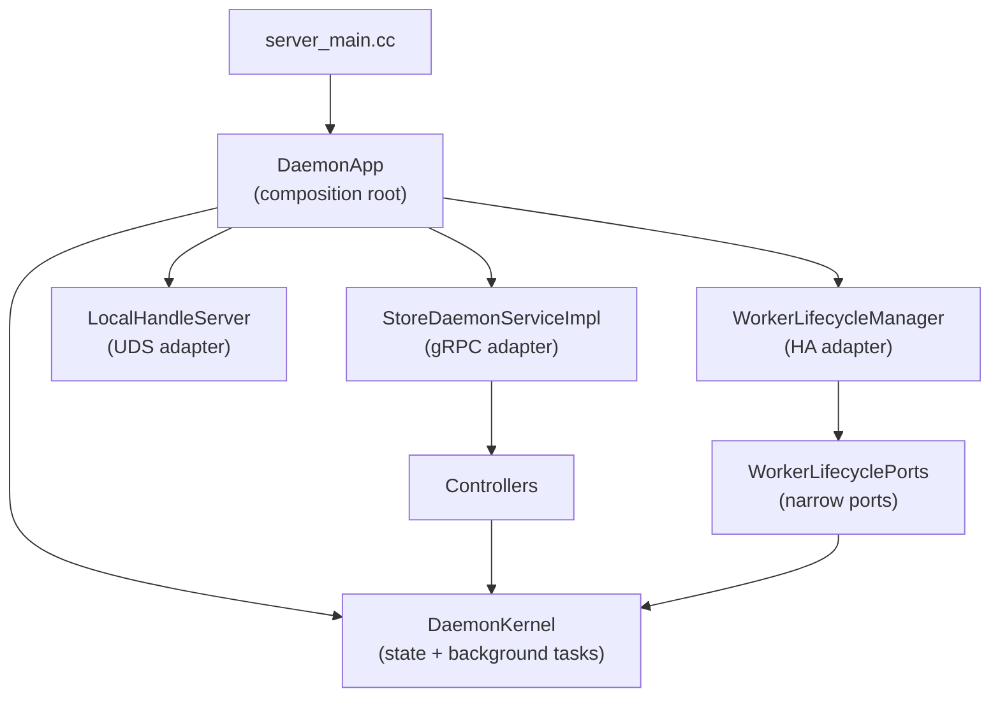
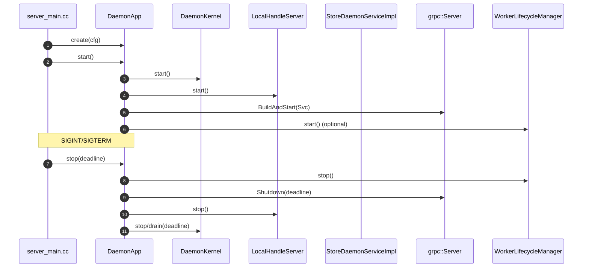

# Summary

Refactor `./daemon` into a clearer long-lived architecture with:
- a single composition root (owns lifetime + wiring),
- thin transport adapters (gRPC/UDS/HA),
- stable internal service/state modules with one-way dependencies.

The intent is to reduce cross-layer coupling (especially HA ↔ gRPC service), shrink the constructor/ownership surface of
`StoreDaemonServiceImpl`, and make future feature work cheaper and safer (compile times, reviewability, testability).

# Problem Statement

Today the daemon has the right *conceptual* layers (`daemon/README.md`), but code ownership boundaries are blurred:
- `StoreDaemonServiceImpl` is both a gRPC adapter and the composition root (it constructs and owns scheduler/lifecycle,
  local handle server, persistence manager, and controllers).
- HA (`WorkerLifecycleManager`) depends directly on the gRPC service type, coupling HA evolution to service internals.
- Large implementation-heavy headers (notably `daemon/session_lifecycle.h`) mix public API + OS details, inflating build
  cost and making reuse/refactor harder.
- Cross-cutting utilities and best-effort observability patterns are duplicated across translation units.

This design focuses on *structure* and *dependency direction*, not feature behavior changes.

## Current State Anchors (code references)

These are the concrete coupling points this refactor is intended to remove:
Note: paths in this section reflect the pre-refactor layout for historical context.

- `StoreDaemonServiceImpl` performs process-level side effects in its constructor (starts sweepers/PID monitor, starts the
  local handle server, wires persistence and engine callbacks): `daemon/grpc_service_impl.h`.
- `WorkerLifecycleManager` depends on the concrete gRPC service type (`#include "daemon/grpc_service_impl.h"` and stores a
  `StoreDaemonServiceImpl*`) for identity publication, retire gating, and async execution:
  `daemon/worker_lifecycle_manager.{h,cc}`.
- OS-heavy PID monitoring is implemented in a public header (`PidMonitor` in `daemon/session_lifecycle.h`), inflating
  include blast radius: `daemon/session_lifecycle.h`.
- Disk path normalization is duplicated in multiple translation units:
  `daemon/grpc_service_impl.cc`, `daemon/service/controllers/materialization_controller.cc`.
- Worker/node identity derivation is duplicated across entrypoints and HA:
  `daemon/server_main.cc`, `daemon/worker_lifecycle_manager.cc`.

# Goals / Non-Goals

## Goals
- One-way dependency graph: `app` → `adapters` → `controllers` → `state/services` (no cycles).
- `StoreDaemonServiceImpl` becomes a thin RPC router; it must not own long-lived subsystems.
- HA decouples from the gRPC service concrete type via a small hooks/view interface.
- Large headers become narrow headers + `.cc` implementations where appropriate.
- Keep behavior identical (wire contract + runtime semantics); changes are refactor-only.

## Non-Goals
- Protocol changes (`proto/tensorcast/daemon/v2/store_daemon.proto`).
- Changing UMA, StoreEngine invariants, or Global Store semantics.
- Reworking controller logic beyond moving ownership and eliminating obvious duplication.

# Architecture & Interfaces

## Dependency rules (enforced by design)

- `app/*` (composition root + process wiring) may depend on anything in `daemon/*`, `core/*`, and `proto/*` that it composes.
- `service/*` (gRPC adapter + gRPC-aware controllers) may depend on `state/*`, `util/*`, `observability/*`, `common/*`,
  `core/*`, and `proto/*`.
- `ha/*` may depend on `state/*`, `util/*`, `observability/*`, `common/*`, `core/*`, and `proto/*`, but **must not**
  depend on `service/*` concrete types or headers.
- `state/*` must not depend on `service/*` or `ha/*`; it is reusable internal logic.
- `util/*`, `observability/*`, and `common/*` must not depend on `service/*` or `ha/*`; they are leaf-ish helpers.

These rules ensure the daemon can evolve HA and transport layers without pulling in unrelated code or creating cycles.

Note: controllers today return `grpc::Status` and take `RpcContext`; they remain in `daemon/service/`. Transport-agnostic
logic belongs under `daemon/state/`.

## Target module boundaries

## Proposed directory layout (steady-state)

This is a target shape; the paired plan lands it incrementally.

- `daemon/app/`
  - `DaemonApp` composition root, wiring, daemon “main” helpers
- `daemon/service/`
  - `grpc_service_impl.{h,cc}` (gRPC adapter) and controllers under `service/controllers/`
- `daemon/ha/`
  - `worker_lifecycle_manager.{h,cc}` and HA-only helpers/interfaces
- `daemon/state/`
  - lifecycle/session/pid monitoring, registries (locks/leases/regions/verification), persistence manager
- `daemon/util/`
  - common pure helpers (path/status/deadline/peer parsing, etc.)
- `daemon/observability/`
  - OTEL meter/span helpers (best-effort, consistent names/attrs)
- `daemon/common/`
  - OS-safe wrappers that are intentionally “low level” (already exists)

## Composition root

Introduce a daemon-only composition root that:
- owns lifetimes (engine, async runtime, daemon kernel/state, controllers, adapters),
- wires dependencies explicitly (existing `Dep` structs stay),
- is the **only** place that starts/stops background work (threads, scheduler tasks, UDS server, HA loops),
- exposes only the objects needed by adapters (no “reach-through” wiring from HA into service).

This moves “construction” out of `StoreDaemonServiceImpl` without changing runtime behavior.

Concretely, `DaemonApp` should own the shutdown surface and provide a simple API:
- `create(...)` (side-effect free construction; returns `StatusOr` on validation/build failures),
- `start()` (start background tasks and adapters, then start serving),
- `stop(deadline)` / `drain(deadline)` (bounded shutdown; idempotent).

### Start/stop sequencing (keeps existing behavior)

## Daemon kernel (deep module)

Define an internal deep module (e.g., `DaemonKernel`) that encapsulates the daemon’s long-lived state and background-task
mechanics behind a narrow API.

The kernel owns “daemon-internal truth” that multiple adapters need to observe or update:
- lifecycle managers (sessions/leases, PID monitor),
- registries (regions, locks, verification tracking),
- durability/persistence state,
- worker identity reflection (worker_id/node_id/is_registered),
- shutdown signaling and task orchestration wiring.

Adapters become shallow:
- gRPC adapter only routes RPCs into controllers and exposes no long-lived ownership.
- HA adapter only reads/writes via narrow ports (identity, gates, shutdown, executor).
- UDS adapter only serves FD handoff + lease release, backed by kernel state.

To keep the kernel from becoming a “god object”, represent shared facts as small deep modules (identity, shutdown, retire
gates, registries) and pass them as explicit ports instead of exposing the kernel type everywhere.

## Lifecycle & ownership (explicit)

To prevent “service-as-composition-root” from reappearing, the refactor must make lifecycle explicit:

- **Construction**: building objects must be side-effect free (no threads, no scheduler start, no socket listen).
- **Start**: the composition root starts:
  - background scheduler and tasks,
  - PID monitor,
  - local handle server (UDS),
  - HA loops (if enabled).
- **Stop/drain**: the composition root stops adapters/tasks in bounded time and drains `AsyncRuntime` with a deadline.

This is primarily about dependency direction and *when* side effects happen; behavior remains unchanged.

## HA decoupling

Replace the direct dependency on `StoreDaemonServiceImpl` with narrow ports over daemon state.

Key point: HA must not be allowed to “wire” unrelated subsystems through the gRPC service (e.g., `set_global_store_client`
as a side-effect). The composition root wires shared clients (e.g., Global Store client) directly to every consumer.

Ports must also be thread-safe: HA reads them from long-lived background threads while the gRPC server concurrently
handles requests.

Example shape (names are indicative; final API is an implementation detail):
- `class WorkerIdentityStore`
  - `void set_registered(std::string worker_id, std::string node_id)`
  - `bool is_registered() const`
  - `std::string worker_id() const`
- `class RetireGates`
  - `RetireGateSnapshot snapshot_for(const store::loading::ReplicaKey&) const`
- `class ShutdownSignal`
  - `void begin_shutdown()`
  - `bool is_shutting_down() const`
- `struct WorkerLifecyclePorts`
  - references to `WorkerIdentityStore`, `RetireGates`, `ShutdownSignal`, and `common::AsyncRuntime`

`WorkerLifecycleManager` depends on these ports (or an interface wrapping them), not the gRPC service implementation.
`StatusController` should also read identity from `WorkerIdentityStore` (instead of capturing lambdas from the gRPC
service) so identity is transport-agnostic even if the controller remains gRPC-aware.

## Header hygiene: lifecycle split

Split `daemon/session_lifecycle.h` into smaller headers and move implementation to `.cc` where possible:
- `daemon/state/pid_monitor.{h,cc}` (OS/epoll/pidfd details),
- `daemon/state/session_lifecycle.{h,cc}` (public API + core logic),
- keep tests as-is but update includes.

This reduces compile-time blast radius and clarifies what is “public API” vs “implementation detail”.

## Utility consolidation

Create shared utility modules for duplicated logic, starting with:
- `daemon/util/path_utils.{h,cc}`: canonical `normalize_disk_path(...)` used by service/controllers.
- `daemon/util/identity_utils.{h,cc}` (optional): unify daemon identity derivation (host_id/node_id) and keep it consistent
  across entrypoints and HA.
- `daemon/observability/otel_metrics.{h,cc}`: centralized “best-effort meter/instrument” creation to reduce scattered
  try/catch and attribute inconsistencies.

## Enforcing boundaries (Bazel + checks)

To make the dependency rules durable, enforce them mechanically:

- Introduce Bazel subpackages at module roots (`daemon/app`, `daemon/service`, `daemon/ha`, `daemon/state`, `daemon/util`,
  `daemon/observability`) with `visibility` that matches the design graph.
- Prefer an include-level enforcement mechanism on HA targets (e.g., Bazel `layering_check` feature) so a stray include
  like `#include "daemon/grpc_service_impl.h"` fails even if dependencies accidentally permit it.
- Add a CI-friendly build-graph check (script or build target) that fails if there is any path HA → service, e.g.:
  - `bazel query 'somepath(//daemon/ha:all, //daemon/service:all)'` must be empty (final labels depend on the package split).

This prevents slow regressions where “one include” or “one convenient dep” reintroduces cycles over time.

# Naming Compliance

This refactor introduces new interfaces/types. Naming must comply with repo rules:

- **Classes/Structs (PascalCase)**:
  - `DaemonApp`
  - `DaemonKernel`
  - `WorkerIdentityStore`
  - `RetireGateSnapshot`
  - `RetireGates`
  - `ShutdownSignal`
  - `WorkerLifecyclePorts`
- **Functions/Methods (snake_case)**:
  - `create(...)`
  - `start()`
  - `stop(...)`
  - `set_registered(...)`
  - `snapshot_for(...)`
  - `is_shutting_down(...)`
- **Constants (ALL_CAPS)**:
  - none introduced by this design (expected).

# Invariants & Error Model (unchanged)

- No changes to RPC semantics, error codes, deadlines, or policy logic.
- Background work and sockets are started/stopped from the composition root; constructors do not perform side effects.
- HA-triggered unload continues to be gated by ref/use/pin/lock checks (no early unload introduced by refactor).
- Best-effort observability remains best-effort and must not affect control flow.

# Trade-offs & Risks

- More files/targets: improves boundaries but increases Bazel target count; mitigate by grouping by “deep modules” and
  keeping targets coherent.
- Refactor risk: includes/BUILD deps can break subtly; mitigate with staged plan and high test coverage (`bazel test //daemon/...`).
- Temporary churn: directory moves may disrupt greps/blames; mitigate by keeping changes phase-scoped and avoiding
  opportunistic renames.

# Alternatives (and why not)

- **Keep current layout, only add more controllers**: does not address HA↔service coupling nor the “service as
  composition root” issue; cost continues to grow with each feature.
- **Big-bang move to subpackages**: increases risk and review cost; the paired plan explicitly stages changes behind
  tests and smaller diffs.
- **Introduce forwarding/alias headers permanently**: reduces short-term churn but creates long-term ambiguity about
  “where the real code lives”; the plan allows temporary shims only as a last resort during directory moves.

# Compatibility & Acceptance Criteria

## Compatibility
- No proto changes and no runtime behavior changes intended.
- Config surface remains unchanged (no new env vars or flags).

## Acceptance Criteria
- `bazel build //daemon:tensorcast_daemon` succeeds.
- `bazel test //daemon/... --test_output=errors --test_env=TENSORCAST_CUDA_BACKEND=fake` succeeds.
- Existing daemon docs remain accurate; `daemon/README.md` is updated if directory layout changes materially.
- Dependency direction is enforced mechanically: HA does not include/require `daemon/grpc_service_impl.h` and Bazel has
  no build-graph path HA → service.

# References

- `docs/designs/0001-docs-system-design.md`
- `daemon/README.md`
