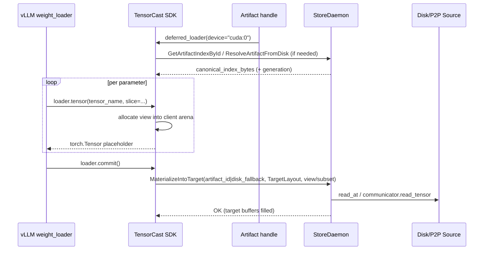

# Summary

Support vLLM’s “meta-init + per‑param weight_loader” chain by adding a **deferred loader** API that returns per‑parameter CUDA tensors immediately (placeholders) and performs the actual I/O + GPU copies only at an explicit `DeferredLoader.commit()` barrier.

**North star (global direction):** implement deferred slice loading as orchestration over the existing **TargetLayout + `MaterializeIntoTarget`** primitive (see `docs/designs/0042-region-backed-tensor-dict-into.md`), not as a new daemon-owned placeholder session. Concretely:

- Placeholders are **client-owned CUDA tensors** (views into a client-owned arena).
- `commit()` performs **one** daemon data-plane call (`MaterializeIntoTarget`) to fill the arena.
- Optional publishing reuses existing registration primitives (recommended: client-owned `VRAM_LEASED` / LIP).

# Goals / Non‑Goals

## Goals

- **On-demand slice**: allow callers to request v1 `narrow` semantics (single-dimension slice) per tensor.
- **Deferred copy barrier**: register slices first, execute transfers once at `commit()`.
- **Meta-friendly**: allow `torch.device("meta")` construction and immediate binding of real CUDA storages.
- **Low control-plane overhead**: Phase 1 requires **no per-tensor daemon RPCs**; only `commit()` hits the daemon.
- **Reuse existing dataplane**: use `ViewPlanner`/`ViewPlanSource` + `pump_ranges` + `TargetLayoutGpuSink` for overlapped I/O and DMA.
- **Artifact consistency**: optionally publish the produced slice artifact so other nodes can P2P fetch.

## Non‑Goals

- Modifying vLLM itself.
- Supporting arbitrary view ops beyond `narrow` in the first iteration (transpose/materialization remains follow-on).
- Solving Global Store view-aware routing in Phase 1 (today `request_view_transport` falls back to canonical).
- Eliminating GPU allocation (this is “delayed copy”, not “zero allocation”).

# Current State (Grounding)

- **Region-backed ingestion exists and is implemented**: the SDK builds a `TargetLayout` over client-registered VRAM regions and calls `MaterializeIntoTarget` to stream bytes into those targets (`tensorcast/api/store/materialization.py`).
- **Core has the right primitives**:
  - `ViewPlanner` supports subset filtering and `narrow` planning (`core/store/materialization/dataplane/view/view_planner.cc`).
  - `ViewPlanSource` executes `SelectionPlan` with PAD=0 (`core/store/materialization/dataplane/view/view_plan_source.*`).
  - `pump_ranges` overlaps staged IO and GPU copies (`core/store/materialization/dataplane/runtime/pump.*`).
  - `TargetLayoutGpuSink` supports ordered-concatenation multi-storage targets but rejects writes that span storage boundaries (commit must pass per-storage ranges, as `materialize_into_target` already does).
- **Lifecycle and leases are already unified** for daemon-exported handles and local-only handle plane (`docs/designs/0049-cpu-shared-memory-materialization.md`, `docs/designs/0011-unified-session-lifecycle-leases.md`). A new “placeholder lease system” should be avoided.
- **Global Store view routing is still a placeholder** (`GlobalStoreClient::request_view_transport` falls back to canonical routing). Phase 1 should not depend on it.

# User-Facing SDK API

Add a new surface on `Artifact`:

- `Artifact.deferred_loader(device=...) -> DeferredLoader`
- `DeferredLoader.tensor(name, slice=...) -> torch.Tensor` (placeholder)
- `DeferredLoader.commit(*, publish=...) -> DeferredCommitResult`

Example (vLLM meta-init + per-parameter binding):

```python
import tensorcast as tc

model = build_model_on_meta_device()
artifact = tc.from_disk("/models/llama-7b")

with artifact.deferred_loader(device="cuda:0") as loader:
    for name, param in model.named_parameters():
        shard = loader.tensor(name, slice=(0, slice(rank_start, rank_start + rank_size)))
        param.data = shard

    loader.commit()
```

Behavioral contract:

- `DeferredLoader.tensor(...)` returns a standard CUDA `torch.Tensor` backed by **client-owned** memory.
- Tensor contents are **undefined** until `DeferredLoader.commit()` returns successfully.
- `commit()` is the explicit readiness barrier; Phase 1 does not rely on `wait_for_completion` / `ConfirmReplica` semantics.

Interoperability with existing handles:

- `DeferredLoader` is created from an `Artifact` handle (canonical or derived view). If the handle already has a view spec (e.g., `artifact.slice(...)`), the loader inherits it; callers may omit `slice=` when slicing is already encoded in the handle.
- `slice=` reuses the existing `SliceSpec` conventions (`Artifact.slice(...)` / `ViewBuilder.slice(...)`).

# Architecture & Interfaces

## High-Level Execution Model (Phase 1)

Phase 1 is a **client-owned deferred session**:

1) `Artifact.deferred_loader(...)` ensures canonical index bytes are available (cache → daemon fetch if needed).
2) Each `DeferredLoader.tensor(...)` allocates from a client-owned CUDA arena and returns a view tensor immediately.
3) `DeferredLoader.commit()` builds a logical view/subset request plus a `TargetLayout` describing the arena storages, then calls **one** daemon RPC: `MaterializeIntoTarget`.
4) Optional: `commit(publish=...)` publishes the produced slice-artifact via existing registration primitives.



## RPC Surface

Phase 1 introduces **no new daemon RPCs**. It reuses:

- `GetArtifactIndexById` / `ResolveArtifactFromDisk` (index acquisition when needed)
- `MaterializeIntoTarget` (the commit barrier that fills placeholders)
- Optional publishing:
  - `RegisterVramRegion` + `Begin/Feed/CommitRegisteredArtifact` (registration)

If a daemon-owned placeholder session is ever introduced as a follow-on, it must reuse the existing handle lease contract (`MemCopyHandle.lease_token`) and unified lifecycle manager; do not create a parallel liveness system.

## Planning and Layout

### Packing modes

Phase 1 supports two SDK-side packing modes:

- **Append mode (default)**: each `tensor()` allocation appends to a packed view ByteSpace (8B aligned, PAD=0). This matches vLLM’s immediate binding needs but layout can depend on call order.
- **Plan-first mode (recommended for publishing/determinism)**: callers declare the slice set first; the SDK computes a deterministic packed layout (stable ordering + canonical normalization) and then returns tensors whose offsets are stable.

### TargetLayout constraints (important)

`TargetLayoutGpuSink` rejects writes that span multiple storages. Therefore:

- The arena can be one allocation (simplest), or multiple allocations (preferred for allocator flexibility).
- `commit()` must route `pump_ranges` over **per-storage ranges** (exactly as the existing `materialize_into_target` path already does).

## Optional Publishing (Global Store)

Publishing is orthogonal to deferred loading; it should reuse existing primitives.

### Recommended: client-owned `VRAM_LEASED` / LIP publish

After `commit()` fills the client arena:

1) The client registers the arena storages as VRAM regions (`RegisterVramRegion`).
2) The client commits a `VRAM_LEASED` (LIP) registration describing the packed slice-artifact (storages + tensor aliases + index bytes).

This gives:

- Normal Global Store registration semantics.
- PID ownership + TTL via the unified lifecycle manager (no daemon-owned replica required).
- A first-class artifact identity suitable for P2P reuse.

### Follow-on: daemon-side `register_memory_replica`

If/when the runtime has communicator keys for client-owned regions (or when outputs become daemon-owned), the daemon can directly call `GlobalStoreClient::register_memory_replica`. This is not required for Phase 1 correctness.

# Invariants & Error Model

Invariants:

- Placeholders are client-owned CUDA buffers; no daemon handle export is required to create them.
- `tensor()` does not perform I/O and must not block on disk/P2P.
- `commit()` is the only readiness barrier.
- Placeholder bytes are undefined until `commit()` succeeds; on any failure, callers must treat bytes as undefined.
- Slice requests are validated against canonical index metadata (dtype/shape bounds + narrow constraints).

Representative errors:

- `INVALID_ARGUMENT`: unknown tensor name; invalid slice bounds; invalid device; layout mismatch.
- `FAILED_PRECONDITION`: daemon not initialized; Global Store required but unavailable (depending on policy); region-backed prerequisites missing.
- `RESOURCE_EXHAUSTED`: GPU allocation failure; pinned buffer pool exhaustion; FD pressure (if any local-handle interactions are involved elsewhere).
- `DATA_LOSS`: verification failure during disk/P2P read.

# Compatibility & Acceptance Criteria

Compatibility:

- Does not change existing `Artifact.tensor_dict()` / `MaterializeReplica` semantics.
- Deferred loader is the only surface that intentionally returns “not-yet-filled” tensors.

Acceptance criteria:

- vLLM-style per-parameter workflow can bind placeholder tensors and complete loading via a single `DeferredLoader.commit()` call.
- Phase 1 performs **no per-parameter daemon RPCs** (only the single `MaterializeIntoTarget` at commit).
- Commit uses `pump_ranges` and overlaps I/O + DMA (verified via tracing/metrics).
- Optional: after `commit()`, client publishes the produced slice-artifact and another node can P2P-materialize it.

# Long-Term Roadmap (Global)

Deferred slice loading exposes two foundational gaps that should be solved globally:

1) **Unified async readiness**: converge on a single, explicit wait/cancel/status mechanism (tickets/tasks) instead of ad-hoc `wait_for_completion` semantics. (`ConfirmReplica` exists today; the longer-term API should be consistent across materialize/into/publish.)
2) **First-class view routing**: implement Global Store view-aware routing so `view_id` becomes a routable identity rather than an implementation detail.

Additionally, `TargetLayout` has a reserved `TENSOR_TABLE` mode. Long-term, making `TENSOR_TABLE` first-class avoids forcing everything into a single packed linear ByteSpace, which reduces determinism and packing complexity for future sparse/quantized/multi-buffer layouts.

# References

- `docs/designs/0042-region-backed-tensor-dict-into.md`
- `docs/designs/0049-cpu-shared-memory-materialization.md`
- `docs/designs/0011-unified-session-lifecycle-leases.md`
- `docs/designs/0016-artifact-view-v1.md`
- `docs/internals/model-loading.md`
