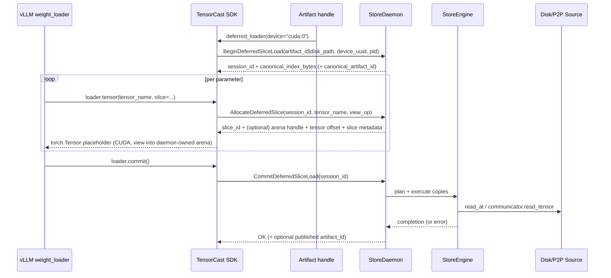

# Summary

Add a new TensorCast loading mode to support vLLM’s “meta-init + per‑param weight_loader” chain without eager `torch.Tensor` materialization and per‑param `copy_`. The SDK returns per‑param **placeholder tensors** immediately (daemon-owned GPU memory exported to the client) while deferring the actual I/O + GPU copies until `DeferredLoader.commit()`. The daemon batches all registered slices and executes an optimized copy plan (disk/P2P/local‑replica) in one shot.

This design is intentionally **daemon-centric**: allocation, planning, and copy execution happen in the Store daemon; the client only holds handles/tensors and triggers `DeferredLoader.commit()`.

To keep CUDA IPC handle counts and mapping overhead bounded, the daemon allocates placeholder memory from a
session-owned GPU arena (one/few exported handles) and returns per-parameter tensors as views into those storages.

# Goals / Non‑Goals

## Goals
- **On-demand slice**: allow callers to request the same logical slice as existing `narrow` rules, per tensor and per rank.
- **Deferred copy**: register many slices first, then execute all transfers via one `DeferredLoader.commit()` barrier.
- **Meta-friendly**: enable `torch.device("meta")` model construction, followed by binding placeholder tensors as real parameter storages.
- **Daemon-owned memory**: GPU allocation and all copying happens in the daemon; client receives standard `torch.Tensor` objects backed by shared CUDA memory.
- **Copy optimization**: reuse `pump_ranges` + `AsyncCopyManager` to overlap I/O and GPU DMA and coalesce work.
- **Artifact consistency**: make the produced weights compatible with TensorCast concepts (artifact/replica/index), and optionally publish to Global Store so other nodes can P2P-fetch the produced artifact.

## Non‑Goals
- Modifying vLLM itself (this design only provides a TensorCast API surface that vLLM can integrate with).
- Supporting arbitrary view ops beyond `narrow` in the first iteration (transpose/materialization is a follow-on).
- View-aware routing in Global Store (currently `request_view_transport` is a placeholder and falls back to canonical routing). This design avoids depending on view routing for P2P.
- Eliminating GPU allocation (this is “delayed copy”, not “zero allocation”).

# Current State (Grounding)

- The daemon already supports daemon-owned GPU materialization with exported handles (`MaterializeReplica` → `MemCopyHandle.cuda_ipc_handle`) and a two-phase flow (`Materialize*` then `ConfirmReplica`) (see `docs/internals/model-loading.md`).
- The Python SDK currently refuses to create torch tensor views unless `wait_for_completion=true` (`tensorcast/api/_materialize.py` raises when `wait_for_completion=False`). That blocks “placeholder tensors that become ready later”.
- The view planner (`core/store/materialization/dataplane/view/view_planner.cc`) can build packed outputs for `narrow` (contiguous `view_stride`) but, today, it always iterates all canonical entries. Subset-only planning is not first-class.
- Global Store can persist view metadata (`variants`, `leaves`) but does not route view transports yet (core client `request_view_transport` falls back to canonical).
- Global Store already supports registering in-memory replicas (`is_memory_replica`, `tensor_index_key`, `remote_memory_keys`, `buffer_sizes`) via `RegisterReplica` / `register_memory_replica` (see `schema.sql`, `core/store/components/global_store_client.cc`).

# User-Facing SDK API

TensorCast’s Python SDK is **handle-first**: users identify a model as an `Artifact`
(`tensorcast.from_disk(...)` / `tensorcast.artifact(...)`), optionally derive a
view handle (`.slice/.subset/.view_builder()`), and then materialize tensors.

This feature should follow the same shape instead of introducing a parallel
“model handle” hierarchy. The SDK adds a new **deferred loader** surface on top
of `Artifact`:

- `Artifact.deferred_loader(...) -> DeferredLoader`
- `DeferredLoader.tensor(name, slice=...) -> torch.Tensor` (placeholder)
- `DeferredLoader.commit()` (barrier: plan + execute all copies)

Example (vLLM meta-init + per-parameter binding)

```python
import tensorcast as tc

model = build_model_on_meta_device()
artifact = tc.from_disk("/models/llama-7b")

with artifact.deferred_loader(device="cuda:0") as loader:
    for name, param in model.named_parameters():
        # narrow semantics: SliceSpec = slice | (dim, slice)
        shard = loader.tensor(name, slice=(0, slice(rank_start, rank_start + rank_size)))
        param.data = shard

    loader.commit()  # barrier: fills all placeholders
```

Behavioral contract
- `DeferredLoader.tensor(...)` returns a standard CUDA `torch.Tensor` backed by daemon-owned memory.
- Tensor contents are **undefined** until `DeferredLoader.commit()` returns successfully.

Interoperability with existing handles
- `DeferredLoader` is created from an `Artifact` handle (canonical or derived view). If the handle already has a view spec (e.g., `artifact.slice(...)`), the loader inherits it; callers may omit `slice=` for tensors whose slicing is already encoded in the handle.
- `slice=` uses the same `SliceSpec` conventions as the view APIs (`Artifact.slice(...)` / `ViewBuilder.slice(...)`) so users do not need to learn a new sharding DSL.

## Naming Compliance (required)

Python
- Functions: `Artifact.deferred_loader`, `DeferredLoader.tensor`, `DeferredLoader.commit` (snake_case).
- Classes: `DeferredLoader`, `DeferredCommitResult` (PascalCase).

C++
- Proposed classes: `DeferredSliceLoadSession`, `DeferredSliceArena`, `TargetLayoutGpuSink` (PascalCase).
- Proposed methods: `begin_deferred_slice_load`, `allocate_deferred_slice`, `commit_deferred_slice_load` (snake_case).

# Architecture & Interfaces

## High-Level Execution Model

We introduce a daemon-managed **deferred slice load session**:

1) `Artifact.deferred_loader(...)` creates a session and returns metadata needed to validate slice requests (canonical index).
2) Each `DeferredLoader.tensor(...)` call allocates daemon-owned device memory for the requested (possibly sliced) tensor and returns a placeholder `torch.Tensor`; the daemon records the request.
3) `DeferredLoader.commit()` triggers the daemon to plan and execute all copies (disk/P2P/local), filling the allocated buffers.
4) Optionally, `commit(publish=...)` publishes the resulting “sliced model artifact” as a Global Store **memory replica** (recommended as a `cgid:` artifact for runtime use).



## RPC Surface (daemon v2)

Add new RPCs to `proto/tensorcast/daemon/v2/store_daemon.proto`:

```protobuf
rpc BeginDeferredSliceLoad(BeginDeferredSliceLoadRequest)
    returns (BeginDeferredSliceLoadResponse) {}

rpc AllocateDeferredSlice(AllocateDeferredSliceRequest)
    returns (AllocateDeferredSliceResponse) {}

rpc CommitDeferredSliceLoad(CommitDeferredSliceLoadRequest)
    returns (CommitDeferredSliceLoadResponse) {}

rpc ReleaseDeferredSliceLoad(ReleaseDeferredSliceLoadRequest)
    returns (ReleaseDeferredSliceLoadResponse) {}
```

Key message intents (illustrative, not final proto):

- `BeginDeferredSliceLoadRequest`
  - `DiskFallbackHint disk_fallback` (reuses 0038 daemon-only disk materialization semantics)
  - `string device_uuid` (GPU only; local-only)
  - `int32 pid` (required for handle leases / lifecycle)
  - `SourcePreference preference` + `SourcePolicy source_policy` (optional; same intent as `MaterializeReplicaRequest`)
  - `optional uint32 ttl_ms` (optional session TTL)
  - `optional bool publish_memory_replica` (whether to publish the result as an in-memory artifact)

- `BeginDeferredSliceLoadResponse`
  - `string session_id`
  - `bytes canonical_index_bytes`
  - `uint64 generation`
  - `optional string canonical_artifact_id` (when determinable from `artifact_descriptor.json`)

- `AllocateDeferredSliceRequest`
  - `string session_id`
  - `string tensor_name`
  - `NarrowOp narrow` (dim/start/length)

- `AllocateDeferredSliceResponse`
  - `string slice_id`
  - `string storage_id` (session arena storage backing this slice)
  - `optional MemCopyHandle storage_handle` (CUDA IPC + `lease_token`; returned when the storage is first introduced)
  - `uint64 storage_offset_bytes`
  - `uint64 byte_length`
  - `repeated int64 shape`, `repeated int64 stride`, `string dtype` (slice metadata for SDK tensor creation)

- `CommitDeferredSliceLoadResponse`
  - `bool ok`
  - `optional string published_artifact_id` (e.g., `cgid:` id for the produced slice-artifact)

All of these RPCs are **loopback/UDS only** (same security model as other handle-returning RPCs).

## Core Copy Planning and Execution

### Planning primitive

Treat the session output as a **packed ByteSpace** (PAD=0) owned by the session, not as a “view ByteSpace that must
remain stable as selection grows”.

Each `AllocateDeferredSlice`:
- validates the slice against `canonical_index_bytes` (dtype/shape bounds + narrow constraints)
- computes the canonical read ranges for that slice (reusing `ViewPlanner` on a single-tensor spec, or equivalent)
- appends a new interval to the session ByteSpace (8B aligned; PAD bytes are zeros) and allocates backing bytes from the
  session arena
- records `(src_offset, dst_offset, length)` ranges for the eventual copy, shifting `dst_offset` into the session
  ByteSpace

At `CommitDeferredSliceLoad`, the daemon merges the per-slice ranges into a single `SelectionPlan` (including PAD ranges
where required) and uses `ViewPlanSource(base_source, selection_plan)` so `pump_ranges` can stream the session ByteSpace
linearly into the arena.

### Destination mapping (reused sink)

Reuse the TargetLayout-backed GPU sink introduced for region-backed targets (`docs/designs/0042-region-backed-tensor-dict-into.md`):
- The session arena is modeled as an ordered list of storage windows (CUDA allocations), using the same ordered
  concatenation rule for a linear destination ByteSpace.
- The sink maps `write_at(dst_offset, ...)` into the owning storage window and implements `AsyncPositionedSink` so
  `pump_ranges` overlaps IO + H2D.

### Execution

The daemon runs:
- `pump_ranges(selection_source, target_layout_sink, streaming_pinned_buffer, [0, session_total_bytes), concurrency, blocking_executor)`

This reuses:
- `AsyncCopyManager` for H2D scheduling (via `AsyncPositionedSink`)
- the existing staged path (page cache for disk, or communicator for P2P)
- existing observability hooks (tracing stage labels)

## Memory and Handle Export

Phase 1 uses the existing CUDA IPC handle path end-to-end:
- daemon allocates arena storage windows with the existing CUDA memory allocator (one/few allocations per session)
- daemon returns `MemCopyHandle.cuda_ipc_handle` per arena storage (plus `lease_token`) and per-slice `storage_offset_bytes`
- SDK maps each storage once via `_C.get_cuda_memory_ptr()` and builds tensors as views into the mapped storages (offset + metadata)

### VMM note (follow-on)

The long-term goal is to back slice buffers with CUDA VMM allocations (for RDMA-friendly dma-buf export and more flexible mapping). This requires:
- extending the CUDA driver API binding with import/export primitives (beyond `cuMemGetHandleForAddressRange`)
- a new proto handle kind (e.g., dma-buf fd passing + size + offset)
- an SDK-side mapping helper parallel to `get_cuda_memory_ptr`

Important constraint (grounded in `core/communicator/engine/rdma_vmm_test.cc`):
- exporting a dma-buf handle for an address range fails if the requested range spans unmapped pages. Therefore, VMM usage must either fully back exported ranges or export per-slice ranges.

## Global Store Integration (P2P Sharing)

Because Global Store view routing is not yet implemented, we publish the output as a **first-class artifact** (recommended `cgid:` for runtime):

- The daemon computes a **slice-artifact tensor index** (canonical index bytes for the packed slice tensors) whose offsets
  describe the session ByteSpace (including PAD=0 gaps introduced by alignment rules, if any).
- The daemon registers the produced memory replica via `GlobalStoreClient::register_memory_replica`, providing:
  - `artifact_id`: `cgid:<...>` (or optionally mi2 if a digest is computed)
  - `tensor_index_key`: sha256 hex of the index bytes
  - `tensor_index_data`: the index bytes (for upsert)
  - `remote_memory_keys` / `buffer_sizes`: communicator registrations of the arena storage windows in ordered-concatenation
    order (gapless linear mapping over the slice-artifact ByteSpace; required by `RemoteKeySource` offset mapping in
    `core/store/materialization/dataplane/sources/remote_key_source.cc`)
  - `verification_json`: optional KEY_POINTS (fast) verification metadata

Consumers can then `tc.artifact(artifact_id=<cgid>).tensor_dict(device=...)` and fetch via P2P without disk access, using existing replica routing.

Optionally, for traceability, the daemon may also write a `variants` row linking:
- canonical artifact id (mi2) → deterministic `view_id` + `view_size`

If this is done, `view_id` MUST follow the canonical variant-identity rules in
`docs/designs/0016-artifact-view-v1.md` (do not use `hash(view_spec_json)`), and
it MUST only be emitted when the produced ByteSpace is representable as a true
view variant with stable packing. This is not required for transport in Phase 1
and should be omitted when slice packing depends on allocation order.

# Invariants & Error Model

Invariants
- Slice allocations are daemon-owned; client tensors are views over exported handles (lease-based lifetime).
- `DeferredLoader.tensor(...)` does not read checkpoint bytes and does not block on I/O; it only allocates and returns a placeholder.
- `DeferredLoader.commit()` is the only barrier that guarantees data readiness.
- Slice requests are validated against the canonical index (dtype/shape bounds, narrow constraints).
- Placeholder tensor contents are undefined until commit succeeds; on any error, callers must treat bytes as undefined.

Errors (representative)
- `INVALID_ARGUMENT`: unknown tensor name; narrow dim out of range; narrow start/length invalid; unknown `session_id`;
  duplicate allocation for the same `(tensor_name, slice)` without an explicit reuse policy.
- `FAILED_PRECONDITION`: daemon not initialized; device_uuid missing; wrong pid; non-loopback peer requested handle-bearing RPC.
- `DATA_LOSS`: checksum/verification failure during disk/P2P read.
- `RESOURCE_EXHAUSTED`: GPU allocation failure for session arena storage.

# Compatibility & Acceptance Criteria

Compatibility
- Does not change existing `Artifact.tensor_dict()` / `MaterializeReplica` semantics.
- Default SDK materialization continues to require `wait_for_completion=true` for returned tensors; this new API is the only surface that intentionally returns “not-yet-filled” tensors.
- Works with safetensors artifacts via existing DiskLoader + SafetensorsSource integration.

Acceptance criteria
- vLLM-style per-parameter workflow can bind placeholder tensors and complete loading via a single `DeferredLoader.commit()` call.
- No eager `torch.Tensor` materialization from checkpoint is required in the client.
- Daemon copy execution uses `pump_ranges` and overlaps I/O + H2D copies (verified by tracing/metrics).
- CUDA IPC handle count is bounded (session arena storages), not proportional to parameter count.
- (Optional) After `DeferredLoader.commit()`, the daemon can publish the produced slice-artifact as a GS memory replica and another node can materialize it via P2P.

# Schema Changes

No `schema.sql` changes are required. This design reuses existing Global Store concepts:
- `is_memory_replica` registration for in-memory artifacts
- optional `variants` metadata for traceability (no new tables required)

# Trade-offs & Risks

- **More RPCs during registration**: `AllocateDeferredSlice` is per tensor/param; mitigate via batching in a follow-on (`AllocateDeferredSlices`).
- **View planner limitations**: current planner supports at most one `narrow` per tensor; fits vLLM sharding but may need extension later.
- **Handle lifecycle complexity**: requires careful lease/session cleanup to avoid orphaned allocations; reuse existing PID + handle-lease infrastructure.
- **Arena layout vs determinism**: session packing is append-only, so the produced slice-artifact layout may depend on allocation order. Mitigate by using a runtime `cgid:` id (ephemeral by design) and, if determinism becomes required, introducing an explicit “declare slices then allocate” mode.
- **VMM export complexity**: true VMM-backed cross-process handles require new import plumbing; Phase 1 uses CUDA IPC and treats VMM as follow-on.

# Alternatives (and why not)

- **Client-owned placeholders via region-backed targets (0042)**: would require vLLM (or integration) to allocate/register regions and manage layouts; this design keeps placeholder ownership daemon-side for consistent lifecycle and batching.
- **Reuse `MaterializeReplica(wait_for_completion=false)` only**: returns an allocated handle early, but does not match vLLM’s incremental per-parameter registration shape and does not support “allocate many slices, then commit once” without additional session semantics.
- **Per-slice CUDA IPC handle per parameter**: simplest to implement but scales poorly (handle count + mapping overhead) for large models; the arena approach keeps this bounded.

# References

- `docs/internals/model-loading.md` (Materialize + Confirm pattern)
- `docs/designs/0016-artifact-view-v1.md` (ViewSpec/ViewPlan concepts)
- `docs/designs/0038-daemon-only-disk-materialization.md` (daemon-only disk reads)
- `docs/designs/0005-async-copy-manager.md` (async H2D copy submission)
- `docs/designs/0009-safetensors-loader-integration.md` (safetensors source)
- `docs/designs/0017-client-generated-artifact-id.md` (cgid runtime artifact identity)
