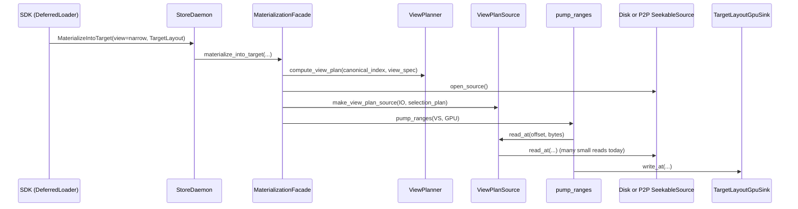

# Summary

Make v1 `narrow` views (especially `axis=1` tensor-parallel column slices) load efficiently in the **existing**
`MaterializeIntoTarget` data plane by upgrading core `ViewPlanSource` from “per-segment small reads” (IOPS-bound) to
“stride-aware coalesced reads + packing” (bandwidth-bound), without adding new RPCs or changing SDK semantics.

This design is intentionally aligned with the `DeferredLoader.commit()` north-star in
`docs/designs/0052-deferred-slice-materialization.md`: deferred mode remains a thin orchestration over
`TargetLayout + MaterializeIntoTarget`.

# Problem Statement

TensorCast’s deferred slice materialization (vLLM integration) uses:

- SDK: `DeferredLoader.commit()` → one `MaterializeIntoTarget` RPC (`tensorcast/api/store/deferred_loader.py`).
- Core: `ViewPlanner` creates a `SelectionPlan` for v1 `narrow`.
- Core: `ViewPlanSource` executes the `SelectionPlan` by calling `base_->read_at(...)` for each `SelectionPlan::Range`.

For tensor-parallel models, `axis=1` slices in row-major storage explode into “per-row segments”:

- Example: `/tmp/vllm-loading-meta-Qwen2.5-32B-Instruct-20260117-211516/tp4/loading-meta.json`
  - rank0 has `axis1=128` tensors; each has `shape=[5120, 27648]` and slices `axis=1, size=6912` (TP=4).
  - `axis=1` implies **5120 segments per tensor** → `128 * 5120 = 655,360` segments, plus other tensors → `segments≈656,003`.
- Benchmark grounding: `docs/benchmarks/20260118-qwen2.5-32b-safetensors-loading-strategies.md` shows:
  - Strategy B (per-segment reads): TP=4 makespan ≈ **47.8s** (≈0.33 GiB/s) due to fragmented reads/IOPS overhead.
  - Strategy C (read row-block superset + pack): TP=4 makespan ≈ **6.0s** (≈9 GiB/s), despite ~2× overall read
    amplification (and ~4× amplification within the `axis=1`-heavy tensors for TP=4).

Today, `ViewPlanSource` effectively behaves like Strategy B for `axis=1` plans. This makes deferred loads unacceptably slow for TP>1.

## Mapping to benchmark strategies

This design is easiest to reason about by mapping it to the benchmark report:

- **Current production behavior (v1 narrow via `ViewPlanSource`)** ≈ Strategy **B**: execute the selection as many small
  `read_at` calls against the base source (IOPS/syscall bound for `axis=1`).
- **Proposed behavior (stride-aware coalescing in `ViewPlanSource`)** ≈ Strategy **C**, but with a different pack
  location:
  - Strategy C benchmark: disk → GPU staging (contiguous row-block) → `cudaMemcpy2DAsync` pack into output.
  - This design: disk/P2P → host staging (contiguous row-block) → host pack into the pinned buffer that `pump_ranges`
    will then ship to GPU via H2D.
- Strategy **A** (read full payload then pack) and **D** (pre-materialize for reuse) are explicitly out of scope for this
  change.

# Goals / Non-Goals

## Goals

1) **Make v1 `narrow(axis=1)` bandwidth-bound** in `MaterializeIntoTarget` and thus in `DeferredLoader.commit()`.
2) **Keep public surfaces unchanged**:
   - No new daemon RPCs.
   - No change to `ViewSpec` representation.
   - No SDK changes required for correctness (though SDK integrations may still adopt plan-first packing for determinism).
3) **Preserve byte-identical semantics** for all existing view plans:
   - Output bytes (including PAD=0) must match the current `SelectionPlan` definition.
   - `view_index_json` and view hashing remain stable (planner unchanged).
4) **Remain source-agnostic**: optimization applies regardless of disk or P2P backing `SeekableSource`.
5) **Be safe under concurrency**: `ViewPlanSource::read_at` must remain correct under concurrent calls (e.g., multi-range
   `pump_ranges`).
6) **Avoid shifting bottlenecks**: treat range execution as a compiled program (runs + index) and reuse the indexing
   approach across the wrapper stack (at minimum `ViewPlanSource` and the canonical segment-plan source).
7) **No new configuration knobs** in Phase 1; enable automatically when the plan shape matches, but gate on a small cost
   model to avoid pathological read amplification.

## Non-Goals

- Supporting view ops beyond v1 `narrow` (transpose/materialization is out of scope).
- Achieving theoretical optimality across all storage formats and transports.
- Introducing new persistence or a new “materialized view cache” format (Strategy D is considered a follow-on workflow).
- Changing Global Store view-aware routing or replica identity semantics.
- Enabling direct-write pass-through for views (documented as a follow-on once coalescing is stable).

# Current State (Grounding)

The view path inside `MaterializeIntoTarget` (`core/store/runtime/ingestion/materialization_facade.cc`) is:

1) Wrap base artifact source into `PlanBackedSeekableSource` (canonical segment plan).
2) If a view is requested, wrap again into `ViewPlanSource` using `view_plan.selection`.
3) Stream from source into GPU via `pump_ranges` and `TargetLayoutGpuSink`.

`ViewPlanSource::read_at` (`core/store/materialization/dataplane/view/view_plan_source.cc`) currently:

- Stores `SelectionPlan::ranges` and sorts by `dst_offset`.
- For each `read_at(offset, dst, bytes)` call, scans **all ranges** and for each overlapped `DATA` range calls `base_->read_at(...)`.

This creates two compounding problems for large `axis=1` plans:

- **IOPS/syscall explosion**: `~655k` base reads per rank (Qwen2.5-32B TP4).
- **CPU overhead explosion**: O(number_of_ranges) scanning per `read_at` call.

There are two additional system-level constraints worth calling out early:

- **Wrapper-stack CPU can become the next bottleneck**: `MaterializeIntoTarget` always wraps the base source in a
  canonical segment-plan source (`PlanBackedSeekableSource`, implemented in
  `core/store/runtime/ingestion/materialization_facade.cc`). Today it also uses a linear scan to find the first segment
  piece overlapped by `read_at`. Once `ViewPlanSource` is made O(log N), this wrapper can become the next hot path for
  large canonical plans.
- **Direct-write capability exists, but should not be accidentally blocked long-term**:
  - `pump_ranges` supports a direct-write fast path when the source implements `SeekableSource::supports_direct_write` /
    `read_into` and the sink implements `DirectWriteCapable` (`core/store/materialization/dataplane/runtime/pump.{h,cc}`,
    `core/store/materialization/dataplane/contracts/{source,sink}.h`).
  - The `MaterializeIntoTarget` GPU sink (`TargetLayoutGpuSink`) is not `DirectWriteCapable` today, so 0054 does not
    target an immediate “RDMA direct-to-GPU” win. However, the view execution layer should preserve capabilities where it
    can so future pipelines (CPU VA sinks today; potential GPU direct-write sinks later) do not require a redesign.

# Root Cause (Global)

The `axis=1` slowdown is a structural mismatch between the *plan representation* and the *execution strategy*:

1) **`SelectionPlan` is byte-accurate, not I/O-optimal**. The planner emits a scatter/gather mapping from canonical
   ByteSpace (AVBS) to view ByteSpace. For `axis=1` narrow in row-major storage, the “minimal-byte” representation
   naturally degenerates into “many equal-width, fixed-stride ranges” (one per row). Executing that literally is
   minimal-bytes but maximal-IOPS.
2) **The executor interprets the plan repeatedly**. `ViewPlanSource::read_at` currently scans all ranges per call and
   issues base reads per overlapped segment. This compounds CPU overhead with IOPS overhead.
3) **The wrapper stack can duplicate the same anti-pattern**. When multiple sources in the pipeline are range-driven,
   each layer risks re-introducing O(N) scanning. Fixing `ViewPlanSource` alone can merely move the CPU bottleneck.

Design principle for 0054: treat view execution as a small, compiled “execution program” (runs + index + strategy
selection), and apply the same indexing idea to adjacent range-driven wrappers in the pipeline.

# Architecture & Interfaces

## Existing Data Plane (No Surface Change)



## Proposed Change: Stride-Aware Execution Inside ViewPlanSource

Keep the `SelectionPlan` format unchanged, but change **how it is executed**:

- Preprocess `SelectionPlan::ranges` into a compact set of **execution runs**.
- Execute each run using the most efficient strategy:
  - `PAD` runs: `memset(0)`.
  - `CONTIGUOUS` data runs: a single `base_->read_at(...)`.
  - `STRIDED` data runs (axis=1-like): read **contiguous supersets** (“row blocks”) from base and **pack** into the
    output buffer.
    - Use a small, bounded cache to avoid redundant base reads under `pump_ranges` chunking.
    - Enable only when a cheap cost model predicts a net win (bounded amplification, sufficient run length).

This yields Strategy C-like behavior while keeping the view planner stable.

## Internal Execution Model

`ViewPlanSource` should behave like a compiled “execution program”, not a per-call interpreter:

- Construction: `SelectionPlan` → `ExecutionRun` list → `runs_` + index tables.
- Execution: each `read_at(offset, ...)` resolves overlapped runs via the index and executes them with the best available
  strategy (PAD fill, contiguous read, or strided coalesced read+pack).

### Execution Runs

`SelectionPlan::Range` remains the canonical definition; `ViewPlanSource` derives `ExecutionRun` objects:

- `PadRun`: `[dst_begin, dst_end)`; fill zeros.
- `ContiguousRun`: `(src_begin, dst_begin, length)`; one `base_->read_at(src_begin + delta, ...)`.
- `StridedRun`: repeated equal-length ranges where:
  - all are `DATA`,
  - `range[i+1].dst_offset == range[i].dst_offset + row_len`,
  - `range[i+1].src_offset == range[i].src_offset + stride_bytes`,
  - `stride_bytes > row_len` and `run_length` exceeds a small threshold.

For a `StridedRun`, we store:

- `src_base` (first `src_offset`)
- `dst_base` (first `dst_offset`)
- `row_len_bytes` (range length)
- `stride_bytes` (`src_offset[i+1] - src_offset[i]`)
- `rows` (count)

### Run Indexing (CPU Scalability)

The current implementation pays O(number_of_ranges) per `read_at` call by linearly scanning `ranges_`.
This design makes `read_at` scalable by indexing the derived execution runs:

- Build `runs_` sorted by `dst_begin` (the view-byte offset space).
- Maintain a parallel `run_starts_` vector of `dst_begin` values.
- For each `read_at(offset, ...)`, use `upper_bound(run_starts_, offset)` to locate the first run that may overlap the
  requested interval, then walk forward while the destination cursor remains within the request.

This yields `read_at` cost O(log R + M) where R is number of runs and M is the number of overlapped runs, eliminating the
per-call full scan. (The plan in `docs/plans/0054-stride-aware-view-plan-source.md` treats this as Phase 1.)

### Avoiding Shifted CPU Bottlenecks: Index the Canonical Segment Plan Too

`MaterializeIntoTarget` always includes a canonical segment-plan source in the stack (currently
`PlanBackedSeekableSource` in `core/store/runtime/ingestion/materialization_facade.cc`). It executes a
`std::vector<loader::SegmentPiece>` produced by
`build_segment_plan_from_canonical_index_json(...)`
(`core/store/materialization/dataplane/sources/segment_plan_source.{h,cc}`).

Today that wrapper uses a linear scan to find the first `SegmentPiece` overlapped by `read_at`. Once `ViewPlanSource`
becomes O(log N), this wrapper can become the next CPU bottleneck.

Recommendation: apply the same “range program + index” approach to the canonical segment-plan source, either by:

- extracting a small reusable `RangeIndex` helper and using it in both wrappers, or
- refactoring `PlanBackedSeekableSource` into a reusable dataplane source (sibling to `LinearizedGpuPlanSource`) to
  avoid duplicating plan execution logic.

This is a pure execution detail: it does not change canonical plan semantics (PAD=0, short reads are errors).

### StridedRun Execution (Row-Block Superset + Pack)

Define a row-block by `(block_first_row, block_rows)` where:

- `block_first_row` is 0-based and relative to the `StridedRun`.
- `block_rows >= 1`.

The minimal contiguous superset in source space that covers the selected bytes for the block is:

- `src_begin = src_base + block_first_row * stride_bytes`
- `src_len = (block_rows - 1) * stride_bytes + row_len_bytes`

This avoids reading beyond the last row’s selected bytes (important when `column_start > 0`).

`ViewPlanSource::read_at` maps the requested view interval onto (row indices, within-row offsets), reads one or more
row blocks from the base source, then copies the selected `row_len_bytes` pieces into the destination buffer.

### Block Sizing and Caching

To avoid redundant reads due to `pump_ranges` chunk boundaries, `ViewPlanSource` maintains a small per-instance cache for
the current `StridedRun`:

- Cache unit: a “row block” of `rows_per_block` rows.
- Target block size: ~8–16 MiB of source bytes (heuristic), capped to a reasonable maximum.
- Cache policy: single-block (replace-on-miss) scoped to a single `StridedRun` at a time.

This is sufficient because `pump_ranges` typically performs sequential reads over a single target range for deferred
loading (single packed CUDA arena).

### Concurrency & Thread Safety

`pump_ranges` may run multiple producer threads and call `SeekableSource::read_at` concurrently when multiple ranges are
pumped (e.g., multiple target storages). Therefore:

- All preprocessed execution state (`ranges_`/`runs_`/indices) must be immutable after construction.
- Any mutable cache state must be **thread-safe**.
  - The strided block cache is best-effort and must be correct under concurrency.
  - Implementation guideline: protect cache state with a small mutex, and keep the lock off the hot path for PAD and
    contiguous runs.

This design does not rely on a “single-thread sequential read” assumption for correctness.
However, the common deferred-loading path typically pumps a single large, contiguous view range into one packed arena,
which means reads tend to be mostly sequential; the cache is designed to capture that common case without making it a
hard requirement.

### Heuristics & Cost Model (Default-On, Bounded)

Stride-aware coalescing trades extra bytes for fewer IOPS / fewer syscalls / fewer P2P round-trips. To avoid pathological
cases (tiny `row_len_bytes` with huge `stride_bytes`), enable `StridedRun` execution only when:

- The run is long enough: `rows >= STRIDED_RUN_MIN_RANGES`.
- The expected amplification is bounded: `stride_bytes / row_len_bytes <= STRIDED_MAX_AMPLIFICATION`.
- The row width is non-trivial: `row_len_bytes >= STRIDED_MIN_ROW_LEN_BYTES`.

If any gate fails, fall back to the baseline execution (range-wise reads) for that run.

#### Amplification: Define It Explicitly

For a `StridedRun`, the asymptotic read amplification is approximately:

```
amplification ≈ stride_bytes / row_len_bytes
```

For `axis=1` narrow in a contiguous row-major 2D tensor, `stride_bytes` is the full-row byte width and `row_len_bytes` is
the selected column slice width. For the Qwen2.5-32B TP=4 case in the benchmark, `27648 / 6912 = 4×` amplification for
those tensors.

The design gates on this ratio to ensure we never trade “millions of extra bytes” for “saving a few syscalls”.

#### Initial Heuristic Defaults (Tunable Later)

This design keeps Phase 1 knob-free, but the implementation still needs concrete defaults. Reasonable initial values:

- `STRIDED_RUN_MIN_RANGES = 128` (avoid paying setup overhead for short runs)
- `STRIDED_MIN_ROW_LEN_BYTES = 4096` (don’t coalesce tiny slices; overhead dominates)
- `STRIDED_MAX_AMPLIFICATION = 8` (covers common TP up to 8; keeps bytes bounded)
- `STRIDED_BLOCK_TARGET_BYTES = 16 * 1024 * 1024` (target MiB-scale base reads)
- `STRIDED_BLOCK_MAX_BYTES = 64 * 1024 * 1024` (hard cap on transient buffer size)

Follow-on (post-stabilization): move these into the unified runtime config (`docs/designs/0004-unified-runtime-config.md`)
as internal engine tuning and/or a kill-switch for safe rollback without code reverts.

### Capability Preservation (Follow-on): Direct Write Pass-Through Where Possible

Even though `MaterializeIntoTarget` (GPU sink) does not use the direct-write path today, range wrappers should preserve
capabilities where they can:

- For `ContiguousRun` (and potentially “single `DATA` range” cases), `ViewPlanSource` can safely pass through
  `supports_direct_write` and `read_into` to its base source by translating view offsets into base offsets.
- For `StridedRun` / `PadRun`, direct-write is not generally possible without adding a new “scatter direct write”
  interface; these should remain staged.
- For the canonical segment-plan wrapper (`PlanBackedSeekableSource`), direct-write could be supported when the requested
  interval maps to a single `DATA` `SegmentPiece`. This keeps the door open for CPU VA sinks today and potential GPU
  direct-write sinks later.

## Naming Compliance

This design introduces only **internal core implementation** artifacts (no new public RPC or SDK API). Any new C++ symbols
introduced to support the change must follow repository naming rules:

- Types: `ExecutionRun`, `StridedRun`, `StridedBlockCache` (`PascalCase`)
- Functions: `build_runs`, `is_strided_run`, `fill_strided_run` (`snake_case`)
- Constants: `STRIDED_RUN_MIN_RANGES`, `STRIDED_BLOCK_TARGET_BYTES` (`ALL_CAPS`)
  - Additional constants expected: `STRIDED_MAX_AMPLIFICATION`, `STRIDED_MIN_ROW_LEN_BYTES`

# Invariants & Error Model

## Invariants

- **Byte-identical** with existing semantics: executing a `SelectionPlan` produces the same view byte space as today.
- PAD bytes are always **zero**.
- Short reads from the base source are treated as errors (never silently accepted).
- `SelectionPlan::ranges` are expected to be non-overlapping and gap-free in destination space, covering
  `[0, total_bytes)`. `ViewPlanSource` treats any uncovered gap as an internal error to fail-fast on planner bugs.
- Optimizations are **purely an execution detail**: planner output (`SelectionPlan`, `view_index_json`) is unchanged.

## Error Model

- Any base `read_at` failure propagates as the existing materialization failure (`DATA_LOSS` from the daemon’s
  materialization path).
- Cache allocation failures are treated as **performance degradation**, not correctness failures:
  - First try a smaller block size (bounded retries).
  - If allocation still fails, disable caching / strided mode for the affected run and fall back to baseline execution.

# Trade-offs & Alternatives

## Why not Strategy A (read full payload + GPU pack)?

- It requires reading full payload and/or staging the full tensor payload, which is incompatible with the goal of
  making TP>1 slice loads “pay only for what you need” at the workflow level, and may exceed VRAM.

## Why not keep minimal-byte reads (current behavior)?

- The benchmark shows it is fundamentally IOPS-bound for `axis=1` and can be ~25× slower than the sequential bandwidth
  limit; hot cache does not rescue it.

## Why not change the planner output (SelectionPlan v2 / explicit StridedRun IR)?

- `SelectionPlan` is already part of the v1 view contract described in `docs/designs/0016-artifact-view-v1.md`.
- Changing its format would risk destabilizing `view_index_json` / view hashing and require coordinated changes across
  multiple executors (retrieval + ingestion) with much higher blast radius.
- 0054’s objective is to keep the planner stable and improve execution. A future design may introduce an internal “view
  execution program” IR, but it should remain an executor-internal compilation result, not a new external contract.

## Why CPU pack inside ViewPlanSource (vs GPU pack)?

- CPU pack keeps the change localized: `SelectionPlan` remains stable; `pump_ranges` and `TargetLayoutGpuSink` are
  unchanged; no new GPU staging buffers or CUDA kernels are required.
- The workload is primarily disk/P2P bandwidth-bound; a single extra host memcpy of the selected bytes is typically much
  cheaper than IOPS overhead.

**Important clarification:** this design does **not** introduce `cudaMemcpy2DAsync` or a GPU D2D pack phase.

- The “pack” in this design happens **on the host** inside `ViewPlanSource::read_at(...)` by copying selected bytes from a
  contiguous “row-block” read buffer into the destination host buffer passed by `pump_ranges`.
- The only GPU copy in the mainline pipeline remains **H2D** (pinned host → target GPU) via `TargetLayoutGpuSink` /
  `GpuMemorySink` (implemented through `AsyncCopyManager::submit_h2d`, i.e. `cudaMemcpyAsync` H2D).

GPU-side pack (e.g., `cudaMemcpy2DAsync` D2D) remains a potential follow-on if profiling shows host CPU becomes the
bottleneck. Implementing it cleanly would require introducing a GPU staging step (disk/P2P → pinned host → GPU staging)
and a pack stage that can issue batched 2D copies into the final target buffer; that does not fit the current
`SeekableSource` → `pump_ranges` → `PositionedSink` contract without additional internal interfaces.

## Follow-on Workflow: Strategy D (materialize once, load many)

If users repeatedly load the same `loading-meta.json` (same TP plan), pre-materializing the packed output for each rank
into a contiguous artifact (and publishing it) can reduce total bytes read under multi-rank cold-load contention. This is
orthogonal and can be layered on top once the default view execution is bandwidth-bound.

# Risks & Mitigations

- **Incorrect strided inference → silent corruption**
  - Mitigation: keep baseline execution available per-run; add byte-identical equivalence tests that compare the new
    executor against the current implementation for randomized plans, plus dedicated strided boundary tests.
- **Memory pressure / fragmentation from row-block buffers**
  - Mitigation: strict caps (`STRIDED_BLOCK_MAX_BYTES`), single-block cache per run, and graceful fallback (disable cache
    or disable strided execution for that run).
- **Lock contention under concurrency**
  - Mitigation: cache is best-effort; keep mutex off PAD/contiguous hot paths; correctness must not depend on cache hits.
- **Read amplification increases multi-rank cold-load contention**
  - Mitigation: keep amplification bounded by policy; use metrics to observe amplification; treat Strategy D
    (materialize-once, load-many) as the longer-term escape hatch.
- **CPU becomes the next bottleneck after IOPS is fixed**
  - Mitigation: measure pack bytes and CPU time; if needed, follow-on GPU pack (`cudaMemcpy2DAsync`) can be introduced as
    an internal stage once the interface boundaries are ready.

# Compatibility & Acceptance Criteria

Compatibility:

- No changes to protos, RPC surfaces, or SDK APIs.
- No changes to view IDs, view hashing, or index formats.
- Works with disk-backed and P2P-backed sources.

Acceptance criteria (functional):

- For any `SelectionPlan`, the new execution produces byte-identical output vs. the current implementation.
- PAD=0 semantics are preserved.

Acceptance criteria (performance, grounded by Qwen2.5-32B TP4):

- `MaterializeIntoTarget(view=narrow(axis=1))` no longer performs O(650k) base `read_at` calls per rank; it should drop by
  at least two orders of magnitude for the TP=4 Qwen2.5-32B plan shape.
- The base-source `read_at` average size increases into the MiB range for strided-heavy plans (row-block behavior).
- CPU overhead is no longer dominated by per-call linear scans:
  - `ViewPlanSource::read_at` is O(log runs + overlapped runs).
  - The canonical segment-plan wrapper is also indexed so the bottleneck does not shift.
- End-to-end throughput trends toward Strategy C behavior in `docs/benchmarks/20260118-qwen2.5-32b-safetensors-loading-strategies.md`
  for the same plan shape (bandwidth-bound rather than IOPS-bound).

## Observability (Required for Validation)

To make performance regressions diagnosable, `ViewPlanSource` should emit per-instance summary logging at `VLOG(1)` and
optionally expose metrics counters (names illustrative):

- `VLOG(1)` summary should include: output bytes, base read calls/bytes, pack bytes, strided run count, fallback run
  count, cache hits/misses, and an observed amplification ratio.
- `tc_view_plan_source_base_read_calls_total`
- `tc_view_plan_source_base_read_bytes_total`
- `tc_view_plan_source_output_bytes_total`
- `tc_view_plan_source_strided_runs_total`
- `tc_view_plan_source_strided_fallback_runs_total` (heuristic-gated or error fallback)
- `tc_view_plan_source_strided_cache_hits_total` / `tc_view_plan_source_strided_cache_misses_total`
- `tc_view_plan_source_pack_bytes_total`
- `tc_view_plan_source_amplification_ratio` (histogram; per-run or per-instance)

# References

- `docs/benchmarks/20260118-qwen2.5-32b-safetensors-loading-strategies.md`
- `docs/designs/0016-artifact-view-v1.md`
- `docs/designs/0004-unified-runtime-config.md`
- `docs/designs/0052-deferred-slice-materialization.md`
- `docs/designs/0042-region-backed-tensor-dict-into.md`
- `core/store/materialization/dataplane/view/view_planner.{h,cc}`
- `core/store/materialization/dataplane/view/view_plan_source.{h,cc}`
