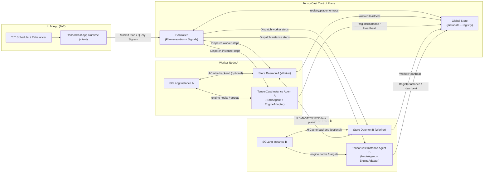

# Programmable API Design (Artifact-First)

This document proposes a **programmable** extension to the existing public Python SDK surface. The key design choice is:

> **Weights, KVCache, checkpoints, etc. are all Artifacts (tensor dicts).**  
> **Programmability must not introduce a parallel “data object” abstraction.**

Instead, programmability is expressed by **composing existing Artifact primitives** (prefetch, into, register/put, persistence, view/subset) with a small set of new control-plane primitives:

- `CallContext`: QoS + deadline + idempotency + tracing tags (per request/task).
- `Operation[T]`: unified operation handle (`status/wait/cancel`) for long-tail control-plane actions (Phase-0: sync/blocking only).
- `Plan`: a composable orchestration IR that dispatches actions across daemons and instances via node-local agents/engine adapters (no “shipping arbitrary Python” like Ray).

This document prioritizes **What/Why** (semantics and rationale) and defines contracts/invariants that must hold from Phase-0.

**2026-02-03 update (Phase-6+ extensions)**: the original 0055 implementation delivered the core SDK primitives (context/operation/plan spec, node agent execution, engine adapter capabilities). To support LLM applications that want to **actively manage runtime tensors** (especially KV cache) as part of application logic (e.g., ToT rebalancing/migration), this design is extended to include:

- a **required** cluster-level **Controller execution layer** for `Plan.run()` dispatch across workers/instances,
- a **TensorCast App Daemon / Instance Agent** that lives with the LLM application/engine and exposes a node-local safety boundary,
- a concrete, cacheable **`TensorCastSignals`** API for load/health/capacity signals,
- and an engine-agnostic **HiCache-style KV cache integration contract** (prefix-hash keys → opaque KV blobs), suitable for integrating with inference engines like SGLang without understanding their internal KV layout or radix structures.

---

## Scope & Relationship

This design extends and refines the artifact-first SDK (`docs/designs/0039-artifact-first-sdk.md`) with **programmable**
control-plane primitives while keeping TensorCast’s data plane and consistency model unified.

Scope choices (long-term, repo-wide):

- **Artifact-first**: programmability composes `Artifact`/`View`/`StorePolicy`; it does not introduce a parallel “data
  object” abstraction.
- **Control-plane programmable, data-plane fixed**: programmability may add control RPCs (idempotency, pinning,
  wait/cancel/status), but does not fork transport/loading semantics.
- **Node-local safety boundary**: any action that touches PID/IPC/regions must run at the node-local boundary
  (Engine Adapter / node agent), not from a central controller.

## Prior State (Grounding)

This section captures the repo state that motivated the design. As of the `0055-programmable-framework` implementation
(2026-01-23), the specific gaps called out below (daemon operation RPCs, safe `replica_uuid` joins, `NO_LEASE`, placement
pin RPCs, stable `daemon_id`) are addressed by the code changes linked from this design.

Key constraints observed in the current repo that shape this design:

- **Local-only process-context paths**: `wait_for_completion` materialization and region-backed `MaterializeIntoTarget`
  are loopback-only (PID/UDS coupled) today; remote orchestration must dispatch to node-local agents / engine adapters
  (`daemon/service/controllers/materialization_controller.cc`).
- **Prefetch is a first-class operation**: `Artifact.prefetch(device=...)` returns
  `Operation[PrefetchedReplica]` with `wait/cancel/status` semantics backed by daemon-side operation RPCs; the legacy
  `PrefetchTicket` wrapper has been removed.
- **PID coupling existed**: the materialization path uses PID-derived liveness/leases for local handle export
  (`daemon/service/controllers/materialization_controller.cc` + `daemon/state/session_lifecycle.h`). Warm pools and
  programmable orchestration require an explicit “NO_LEASE” mode so retries/prefetch do not accidentally become
  per-PID residency.
- **`replica_uuid` session overwrite risk**: the daemon’s `ReplicaSessionManager` currently overwrites
  `replica_uuid -> ReplicaKey` mappings (see `daemon/state/replica_session_manager.h`). Correct idempotency requires
  PutIfAbsent/JoinIfMatch semantics (fail-fast on mismatched reuse).
- **Placement pinning exists internally but lacks RPC**: the daemon already tracks `placement_pins` via
  `SessionLifecycleManager::create_placement_lease(...)` (`daemon/state/session_lifecycle.h`), but it is not exposed as
  an API.
- **No first-class engine instance registry**: Global Store tracks workers and replicas (by `worker_id`), but there was no
  first-class “engine instance” registry surface (`proto/tensorcast/global_store/v1/global_store.proto`).

## Navigation

- [Scope & Relationship](#scope--relationship)
- [Prior State (Grounding)](#prior-state-grounding)
- [Goals](#goals)
- [Non-Goals](#non-goals)
- [Core Concepts](#core-concepts)
- [Entry Points](#entry-points)
- [Public API Surface](#public-api-surface)
  - [AppContext / App Driver](#appcontext--app-driver)
  - [CallContext](#callcontext)
  - [Operation](#operation)
  - [Artifact Enhancements](#artifact-enhancements)
  - [Residency Pinning (Placement Pin)](#residency-pinning-placement-pin)
  - [Plan (Programmable Orchestration)](#plan-programmable-orchestration)
  - [Targets & Engine Adapter](#targets--engine-adapter)
  - [Transforms (Reshard / KV Layout)](#transforms-reshard--kv-layout)
  - [Signals (Control-Loop Inputs)](#signals-control-loop-inputs)
  - [Domain Helpers: weights / kvcache](#domain-helpers-weights--kvcache)
  - [LLM Integration: SGLang / HiCache KV cache](#llm-integration-sglang--hicache-kv-cache)
- [Feature Mapping (Legacy → Programmable)](#feature-mapping-legacy--programmable)
- [Contracts and Invariants](#contracts-and-invariants)
- [Error, Retry, Deadline, Cancel Semantics](#error-retry-deadline-cancel-semantics)
- [Proto Requirements](#proto-requirements)
- [Schema Changes](#schema-changes)
- [Trade-offs & Risks](#trade-offs--risks)
- [Examples](#examples)
- [Compatibility & Migration](#compatibility--migration)
- [Code Map](#code-map)
- [Naming Compliance](#naming-compliance)
- [Appendix](#appendix-design-rationale-why-this-shape)

---

## Goals

1. **Artifact-first consistency**
   - Keep `Artifact` handles as the single unit of identity + metadata + fallbacks.
   - Keep `StorePolicy` as the single durability/placement declaration.
   - Keep daemon-owned data plane and existing materialization pipeline semantics.

2. **User-friendly programmability**
   - Most users should only learn:
     - `tensorcast.artifact(...)` / `Store.artifact(...)`
     - `Artifact.prefetch(...)`, `Artifact.tensor_dict_into(...)`
     - `Artifact.pin_device_residency(...)` (new)
     - `CallContext` (new) and `Plan` (new, advanced)
   - Weights/KVCache are expressed as artifacts with **key conventions + view helpers**.

3. **Unified operation semantics (Phase-0: sync-only)**
   - Prefetch, persistence, and device residency pinning expose a unified `Operation[T]` interface with
     `status/wait/cancel`.
   - Phase-0 does **not** introduce any new `async def` / `await` SDK surface. (Internal concurrency is allowed.)

4. **At-least-once orchestration with safe idempotency**
   - When a stable `CallContext.idempotency_key` is provided, repeated submissions must reuse the same operation id and
     must not leak daemon state (sessions/leases/pins).

5. **Deterministic operation id (`replica_uuid`) for joinable actions**
   - Use `replica_uuid` as a joinable operation/session id for wait/cancel/telemetry (not replica identity).
   - Avoid duplicate daemon-owned VRAM replicas via the existing engine invariant: join on `ReplicaKey`.

6. **Durability vs residency are orthogonal**
   - `StorePolicy` describes durable tiers (stable_dram/shared_disk), not “GPU never evict”.
   - Residency is expressed via placement pins (device residency) and/or engine-owned memory.

---

## Non-Goals

- No new data-plane implementation: RDMA/MTCP/FlowCredit and transport locks remain unchanged.
- No requirement to build a full distributed function execution runtime (Ray-like). `Plan` dispatches **actions**, not arbitrary Python code.
- No requirement for Central Executor state recovery in v1.
- No hard dependency on view-aware routing in Global Store (Phase-0 can be canonical-only).

---

## Core Concepts

### Artifact (existing)

- A logical collection of named tensors with canonical index and byte layout.
- Identity: `artifact_id` (content-addressed, e.g. `mi2:...`) or `key` (human-friendly name).
- Retrieval and execution are centered on `Artifact` handles.

### View (existing)

A view is a derived artifact shape/layout (subset, slice, transpose, etc.) whose identity must be stable (`view_id`) and participates in cache/memory semantics.

**Programmability requirement**

- Any non-identity view MUST resolve to a stable `view_id` (`docs/architecture/artifact-views-and-retrieval.md`).
- Any view that changes bytes MUST participate in cache identity (`view_id`), `ReplicaKey`, and the selection identity
  used for idempotent operations.

### Selection identity (new; required)

Programmability needs a stable identity for **“which bytes”** that is independent of **“where they are written”**. This
identity must be used consistently across:

- action-level idempotency (`CallContext.idempotency_key` → deterministic `operation_id`)
- cache keys (daemon/engine)
- plan step fingerprinting (controller/agent)
- validation/debug (detect mismatched joins)

We standardize two hashes (see `docs/architecture/api/region-backed.md` for canonical definitions):

1) **`logical_layout_hash`** (base ByteSpace identity)  
   Identity of the base logical byte space: canonical/view index bytes + index kind. Excludes any physical binding
   (regions, offsets, addresses).

2) **`selection_hash`** (selection identity on top of the base)  
   Identity of “which bytes to produce”: resolved `view_id` (if any) + subset identity (sorted/unique `tensor_names`
   and/or `view_subset_hash` as raw digest bytes). This MUST exclude any placement/target binding.

**Rule (required):** placement (tier/device) is part of `ReplicaKey` (cache entity identity) and part of the
action-level idempotency fingerprint, but it MUST NOT be part of `selection_hash`.

**Design rule:** any joinable or retryable action MUST derive its stable fingerprint from `(logical_layout_hash,
selection_hash)` (or an equivalent legacy tuple that is provably collision-free). It MUST NOT include any physical
target binding.

### Replica (existing)

A concrete materialization of an artifact (or view) on a tier/device.

### ReplicaKey (existing; StoreEngine identity)

In the C++ StoreEngine, the identity of a daemon-owned replica is the `ReplicaKey`:

- `artifact_id`
- `view_id` (optional; absent means canonical view)
- `device` (`DeviceType`, `ordinal`, `uuid`)
- `replica` (uint32; Phase-0 uses `replica=0`)

This is the key that determines which underlying daemon-owned VRAM/DRAM replica is being loaded/kept around.

### ReplicaKey vs operation id (`replica_uuid`) (distinct; required)

TensorCast has two different identities that must not be conflated:

1) **ReplicaKey (replica identity; existing)**  
   The identity of a daemon-owned materialization in the StoreEngine, derived from `(artifact_id, view_id, device_id,
   tier, ...)`.  
   **Engine invariant**: repeated materialization on the same daemon MUST join on `ReplicaKey` to avoid duplicate VRAM
   allocations; programmability must preserve and rely on this behavior.

2) **`replica_uuid` (operation/session id; used for wait/cancel/telemetry)**  
   A joinable handle for “this operation” (e.g., prefetch/pin/persistence wait), **not** “the replica identity”.
   Multiple `replica_uuid`s may legitimately point to the same `ReplicaKey` (different callers/operations joining the
   same underlying load).

This separation is what makes programmable orchestration safe: cancellation can be scoped to an operation id without
introducing cross-talk between unrelated callers that happen to touch the same `ReplicaKey`.

### Two ownership modes (must be explicit)

1. **Daemon-owned replica (cache warm / shared cache)**
   - Created by `Artifact.prefetch(...)` (daemon materializes and owns VRAM/DRAM).
   - Optional: kept resident by `pin_device_residency(...)` (placement pin).

2. **Caller-owned buffer (engine arena / KV buffers)**
   - Filled by `Artifact.tensor_dict_into(...)` / `deferred_loader.commit(...)`.
   - Uses region-backed `MaterializeIntoTarget` when enabled.
   - Does **not** create daemon-owned VRAM replica.

### CallContext (new)

A per-request/task context carrying:

- QoS class (realtime/interactive/background)
- hard deadline
- idempotency key / request_id
- optional debug tags

### Operation[T] (new unified operation handle)

A unified interface for long-tail workflows (Phase-0: sync/blocking only):

- prefetch wait
- persistence task wait
- placement pin lifecycle
- status/cancel unify across subsystems

#### Operation backend selection (integration with operation.proto)

`Operation[T]` is an SDK-level abstraction. The **backend protocol** can differ by workload:

1. **Daemon-local replica operations**: `QueryReplicaStatus` / `WaitReplicaStatus` with `ReplicaOperationStatus`
   (high-frequency, short-lived, daemon-local actions like prefetch/materialize).
2. **Global Store-backed operations**: `tensorcast.operation.v1` (`Acquire/Keepalive/Release/Get/UpdateOperation`)
   for long-tail, globally coordinated workflows.
3. **Polling wrappers**: legacy status RPCs (e.g., persistence) wrapped into `Operation[T]` when a dedicated operation
   backend does not exist yet.

**Use `operation.proto` when ALL of the following are true:**

- **Global coordination required**: multiple daemons could race, or the action must be serialized across the cluster.
- **Lease + fencing needed**: correctness depends on a single active coordinator with a monotonic generation token.
- **Durable progress matters**: status/progress/results must survive daemon restarts and be queryable without the
  originating daemon.
- **Low write rate is acceptable**: operation updates can be throttled (avoid per-chunk/per-shard high-frequency writes).

**Do NOT use `operation.proto` when any of the following hold:**

- **High-frequency or short-lived** actions (e.g., prefetch, replica readiness) where GS write amplification would be
  prohibitive.
- **Daemon-local semantics dominate**: progress is tied to local lifecycle or PID/IPC resources.
- **Rich domain-specific status** is required (e.g., shard-level persistence details) that does not map cleanly to a
  single `OperationStatus`.

**RPC expectations when using `operation.proto`:**

- The coordinator acquires a lease (`AcquireOperationLease`) and **must** include the fencing token
  (`lease_generation`) on all updates.
- `UpdateOperation` writes are **throttled** to bounded rates; snapshots/results are stored in `Any`.
- Clients query via `GetOperation` / `WaitOperation` and **must not** assume daemon-local state.

This split keeps the **user-facing `Operation[T]` API uniform** while avoiding unnecessary Global Store load for
high-frequency or local-only actions.

### Plan (new orchestration IR)

A composable plan expressing:

- which node/instance executes which action
- dependencies and concurrency (Phase-0: no plan-level reschedule retries; future phases may add bounded retries)
- derived idempotency via context + canonical inputs

Plan is an **IR**, not “send Python to remote”.

### TargetSpec (new engine integration abstraction)

For remote `into(...)` operations, targets cannot be raw `torch.Tensor` across machines. A `TargetSpec` is a serializable reference resolved by the node’s engine adapter to actual buffers.

### Runtime topology and safety boundary (required)

Programmability must respect the existing TensorCast process/runtime boundaries:

- **Global Store (central, required)**: metadata & coordination (worker/instance registry, placement, durability, durable key mapping).
- **Controller (central, required)**: executes `PlanSpec` (DAG scheduling + dispatch), provides `TensorCastSignals`, and offers a stable control-plane API for application-driven orchestration.
- **Store Daemon / Worker (node-local, required)**: daemon-owned data plane (`StoreEngine`, replica lifecycles, P2P transfers, placement pins).
- **App Daemon / Instance Agent (in the application/engine process; required for engine integration)**: node-local boundary for engine-owned actions; registers engine instances; exposes the Node Agent RPC surface; owns engine-specific adapters (targets, transforms, KV-cache hooks).
- **Engine Adapter (in-process)**: executes process-context actions (target resolution, transforms, region-backed `into`, LIP registration, engine signals, engine-specific KV-cache hooks).
- **Node Agent (RPC surface, node-local)**: an RPC contract implemented by the App Daemon (LLM engines) or a sidecar (non-engine workloads). The Controller dispatches instance-scoped plan steps to Node Agents.

#### Reference topology (LLM app integration; Phase-6+)

This diagram shows the minimal production topology needed to run application-authored plans from an LLM app (e.g., a ToT scheduler), while preserving TensorCast’s existing data plane.



Remote-safety rules:

- Any action requiring PID/IPC/region references MUST run via the Engine Adapter on the target instance.
- Any daemon-owned action that should be safe under retries and should not couple to a PID MUST run in `NO_LEASE` mode
  (see Prefetch/Pinning).
- Controllers must not directly call PID/IPC-binding RPCs across nodes; they dispatch instance-scoped plan steps to Node Agents, which enforce process-context safety.
- Application logic (e.g., LLM schedulers) must not assume engine-internal semantic mappings (request → KV blobs) live in TensorCast core. Those mappings are surfaced through engine-specific adapters hosted in the App Daemon / Instance Agent.

---

## Entry Points

### Existing (unchanged)

- `tensorcast.init(...)`
- `tensorcast.store(...)`
- `tensorcast.register / put / register_view / artifact / from_disk` (module-level wrappers)
- `Store.register / put / register_view / artifact / query_persistence_status / region APIs`

### New (additive)

- `tensorcast.init_app(...) -> AppContext` (Phase-6+; required for controller-run plans and signals)
- `tensorcast.app() -> AppContext` (get the active app runtime)
- `tensorcast.context(...) -> CallContext`
- `tensorcast.plan(ctx: CallContext) -> Plan`
- `tensorcast.signals() -> TensorCastSignals`
- `tensorcast.execution_signals(adapters: Sequence[ExecutionSignalsAdapter]) -> ExecutionSignals` (Phase-2+; recommended)

Example:

```python
import tensorcast

# Connect the LLM app (driver) to the TensorCast control plane (Controller + Global Store).
tensorcast.init_app(
    mode="connect",
    controller_address="127.0.0.1:50052",
    global_store_address="127.0.0.1:50051",
)

ctx = tensorcast.context(
    qos="realtime",
    deadline_ms=50,
    tags={"tenant": "prod"},
)

art = tensorcast.artifact(key="/prod/weights/llama/v7", fallback="p2p")

# Issue (non-blocking) a daemon-owned warm replica on some worker:
op = art.prefetch(device="cuda:0", ctx=ctx)  # Operation[PrefetchedReplica]

# Blocking wait:
replica = op.result(timeout_s=60.0)
```

---

## Public API Surface

### AppContext / App Driver

To make programmable orchestration usable from **external applications** (not just from within a Store Daemon), TensorCast requires a long-lived application runtime.

`AppContext` is the application-facing runtime that connects an LLM app (or any application) to the TensorCast **control plane** (Controller + Global Store) and optionally hosts an **Instance Agent** (NodeAgent + Engine Adapter) when running inside an engine process.

Why this exists:

- `Plan.run()` must execute through a **cluster-level Controller**, not inside a random daemon process.
- LLM applications need a stable way to **discover workers/instances**, pull **signals**, and **dispatch** plan steps.
- Engine integrations (SGLang, vLLM, training runtimes) require a **node-local safety boundary** to resolve targets and interact with PID/IPC resources.

Minimal surface (Phase-6+; names are normative, fields are indicative):

```python
class AppDriverError(Exception): ...

class AppContext:
    app_id: str
    controller_address: str
    global_store_address: str

    def signals(self) -> "TensorCastSignals": ...
    def plan(self, ctx: "CallContext") -> "Plan": ...
    def close(self) -> None: ...

def init_app(
    *,
    mode: str,  # "connect" | "agent"
    controller_address: str,
    global_store_address: str,
    app_id: str | None = None,
    # Agent mode only (when the app process is also an engine instance):
    instance_id: str | None = None,
    daemon_id: str | None = None,
    engine: str | None = None,
    node_agent_listen_address: str | None = None,
    engine_adapter: "EngineAdapter | None" = None,
    labels: Mapping[str, str] | None = None,
) -> AppContext: ...

def app() -> AppContext: ...
```

**Modes**

- `mode="connect"`: control-plane client only (typical for schedulers/controllers living outside the engine processes).
- `mode="agent"`: additionally starts a node-local Instance Agent (implements `NodeAgentService`) and registers/heartbeats an `Instance` into Global Store for controller dispatch.

**Process-global default**

- `tensorcast.init_app(...)` installs a process-global `AppContext`.
- `tensorcast.plan(ctx)` and `tensorcast.signals()` use the active `AppContext` implicitly.

**Instance Agent registration contract (normative; Phase-6+)**

When running in `mode="agent"`, the App Daemon / Instance Agent:

- MUST register itself into the Global Store instance registry (`RegisterInstance`) with:
  - stable `instance_id` (config-derived; not a network address),
  - stable `daemon_id` of the co-located Store Daemon worker (config-derived),
  - `engine` string (e.g., `"sglang"`),
  - a routable `node_agent_endpoint` (new; required for Controller dispatch),
  - optional `signals_endpoint` (engine-owned execution signals; advisory),
  - optional `labels` and capability flags.
- MUST send periodic heartbeats (`InstanceHeartbeat`) and MUST be marked unavailable when heartbeats are stale.
- SHOULD unregister on graceful shutdown (`UnregisterInstance`), but correctness must not depend on clean shutdown.

This makes instance-scoped plan steps routable without the application manually wiring addresses.

#### Terminology: Worker vs Instance vs Instance Agent (Phase-6+)

These concepts intentionally separate **data-plane storage** from **engine execution**:

- **Worker**: a Store Daemon process registered in Global Store (worker registry). A Worker owns TensorCast’s data plane:
  replica lifecycles, memory tiers, and P2P transfers. Worker identity is stabilized by `daemon_id` (HA-safe) and it
  reports storage-centric signals (e.g., `mem_pool_available_size`).
- **Instance**: an engine process identity registered in Global Store (instance registry). An Instance exists so plans
  can target **engine-local actions** (transforms, target resolution, KV-cache flush/prefetch, execution signals) that
  cannot safely be done by a Store Daemon alone.
- **Instance Agent**: a node-local RPC surface (`NodeAgentService`) that lives with the engine (in-process or sidecar)
  and enforces the process-context safety boundary. It hosts an Engine Adapter (including KV-cache hooks) and is the
  Controller’s dispatch endpoint for instance-scoped steps.

Relationship and cardinality:

- A Worker and an Instance are often **co-located** on the same machine, but they are not the same process and not the
  same identity.
- A single Worker (Store Daemon) may host **multiple Instances** (e.g., multiple SGLang serving processes), and an
  Instance may be pinned to a specific co-located `daemon_id` for locality.
- Plans target Workers for **storage actions** (`prefetch`, `pin_device_residency`) and target Instances for
  **engine actions** (`transform_into`, `kvcache_*`).

#### Lifecycle: where does the Instance Agent run?

- The Instance Agent SHOULD be started together with the inference engine process (e.g., as part of SGLang startup) so
  instance identity and engine hooks are available for the lifetime of the serving instance.
- Deployments MAY run the Instance Agent as a sidecar as long as it can safely access the engine process context it
  needs (shared memory, RPC hooks, model registry). If it cannot, it MUST be in-process.
- When the engine process is scaled up/down, the Instance Agent follows the same lifecycle and updates the Global Store
  instance registry via `RegisterInstance`/`InstanceHeartbeat`/`UnregisterInstance`.

### CallContext

`CallContext` is a pure per-call data container: it does not construct handles, and it does not participate in identity.

```python
from dataclasses import dataclass
from typing import Literal, Mapping

QosClass = Literal["realtime", "interactive", "background"]

@dataclass(frozen=True, slots=True)
class CallContext:
    request_id: str | None = None
    qos: QosClass = "interactive"
    deadline_ms: int | None = None
    idempotency_key: str | None = None
    tags: Mapping[str, bool | int | float | str] | None = None
```

**Notes**

- `request_id` is optional. If omitted, the SDK generates one so every operation is traceable.
- If the caller already has a stable idempotency key (stable across retries and across agents), it should be set as
  `idempotency_key`. Otherwise, `request_id` provides traceability, not cross-retry idempotency.
- `deadline_ms` is an end-to-end budget (relative), enforced as a hard cutoff (see Deadline semantics).
 - Rule of thumb: **handles come from `tensorcast` / `Store` factories; `ctx` appears only on action execution (or on `tensorcast.plan(ctx)`).**

**Module-level helper**

```python
def context(
    *,
    request_id: str | None = None,
    qos: QosClass = "interactive",
    deadline_ms: int | None = None,
    idempotency_key: str | None = None,
    tags: Mapping[str, bool | int | float | str] | None = None,
) -> CallContext: ...
```

#### Signature consistency (required)

- **Handle factories are context-free**: `tensorcast.artifact(...)` / `Store.artifact(...)` never accept `ctx`.
- **All action APIs accept** `*, ctx: CallContext | None = None` as a keyword-only parameter.
- **`ctx` does not participate in artifact/view/selection identity**; for deterministic `operation_id`, only `ctx.idempotency_key` participates (deadline/qos/tags must never affect identity).
- **Plan is the only exception**: `tensorcast.plan(ctx)` binds the context once; plan steps intentionally do not accept `ctx` to avoid repetition.

Why this is the most consistent:

- `Artifact` represents **what** (identity); `ctx` represents **how this time** (deadline/qos/idempotency/tags).
- It prevents mixed patterns like `ctx.artifact(...)`, `tensorcast.artifact(..., ctx=...)`, and `art.prefetch(..., ctx=...)` from co-existing.
- It makes it easy to enforce a repo-wide signature rule: every RPC/scheduling action takes the same keyword-only `ctx=`.

### Operation

Unified operation interface. New programmable control-plane actions should return an `Operation[T]`; existing long-tail surfaces (persistence task ids) should be adapted to this interface for consistency.

**Phase-0 design rule:** public APIs are sync/blocking only (no `async def`, no `await`).

```python
from dataclasses import dataclass
from typing import Generic, Literal, Mapping, TypeVar

T = TypeVar("T")

OperationState = Literal[
    "pending",
    "running",
    "success",
    "failed",
    "cancelled",
    "degraded",
]

@dataclass(frozen=True, slots=True)
class TimeoutErrorDetails:
    """Additional detail for DEADLINE_EXCEEDED/timeout outcomes."""

    kind: Literal["ctx_deadline", "wait_timeout"]
    deadline_ms: int | None = None
    timeout_s: float | None = None
    elapsed_ms: int | None = None

@dataclass(frozen=True, slots=True)
class OperationError:
    """
    Structured error surfaced by Operation status APIs.

    Notes:
    - `status_code` uses gRPC canonical code names (e.g. DEADLINE_EXCEEDED).
    - `context` is a small, safe-to-log dictionary (e.g. request_id, worker_id, artifact_id, operation_id).
    """

    status_code: str
    message: str
    retryable: bool
    timeout: TimeoutErrorDetails | None = None
    context: Mapping[str, str] | None = None

@dataclass(frozen=True, slots=True)
class OperationStatus:
    state: OperationState
    message: str | None = None
    progress: float | None = None
    as_of_ms: int | None = None
    error: OperationError | None = None

class Operation(Generic[T]):
    operation_id: str
    def done(self) -> bool: ...
    def status(self) -> OperationStatus: ...
    def result(self, *, timeout_s: float | None = None) -> T: ...
    def wait(self, *, timeout_s: float | None = None) -> T: ...
    def cancel(self) -> bool: ...
```

**Timestamp conventions**

- `as_of_ms` and `*_at_ms` fields use Unix epoch milliseconds (wall-clock) so they can be correlated across machines.
- `deadline_ms` and `timeout_s` are budgets (relative), not timestamps.

`Operation` is always scoped to an execution target (a specific daemon/worker for daemon-owned actions, or a specific
engine instance for in-process actions). The SDK MUST retain enough target information to implement
`status/wait/cancel` without assuming `operation_id` is globally unique.

#### Operation is a system primitive (not just an SDK wrapper)

For correctness, daemon-owned actions MUST have daemon-side, operation-scoped state:

- A daemon MUST treat `replica_uuid` as an **operation id** (join/wait/cancel/telemetry), not as replica identity.
- Multiple `replica_uuid`s may map to the same `ReplicaKey`; cancel MUST NOT affect other `replica_uuid`s.
- If a request attempts to reuse an existing `replica_uuid` but resolves to a different `ReplicaKey`, the daemon MUST
  fail fast with `FAILED_PRECONDITION` (never silent overwrite).

#### Operation lifecycle and completion conditions (normative)

`Operation.wait()` resolves when the underlying action reaches its completion condition:

- `prefetch`: the daemon-owned replica is **ready for serving** (loaded on the requested device/tier). This does not
  imply IPC handle export, and does not imply verification unless explicitly enabled.
- `pin_device_residency`: the placement pin is active and a valid `PlacementPin` capability is returned.
- `persistence`: the persistence task reaches a terminal state (`success|failed|degraded`).
- `into` / transforms: the in-process Engine Adapter has completed the buffer writes / produced the output artifact.

**`degraded` is used when**

- The caller’s deadline is exhausted.
- Best-effort cancellation has been initiated.
- The underlying action may still complete in the background.

**Failure reporting (required)**

- `Operation.status()` MUST return structured failure detail in `OperationStatus.error` when `state in {"failed", "degraded"}`.
- `Operation.wait()` MUST raise `ArtifactError` (or a subclass) on failure; implementations SHOULD provide a dedicated timeout subtype (e.g., `OperationTimeoutError`) for `timeout_s` expirations and MUST include enough context (`request_id`, `operation_id`, and the failing target identifiers) to make user-driven retries feasible.

### Artifact Enhancements

The existing `Artifact` handle remains the center of retrieval and execution. Programmability is expressed as handle methods and views, not parallel APIs.

#### Prefetch (daemon-owned cache warm)

```python
from dataclasses import dataclass

@dataclass(frozen=True, slots=True)
class PrefetchedReplica:
    artifact_id: str
    view_id: str
    operation_id: str
    device_id: int
    daemon_id: str
    source: str | None  # "p2p" | "disk" | "local" | None

class Artifact:
    def prefetch(
        self,
        *,
        device: torch.device | str | int,
        ctx: CallContext | None = None,
        options: "GetArtifactOptions | None" = None,
    ) -> Operation[PrefetchedReplica]:
        """
        Ensure a daemon-owned replica exists (and optionally begins loading immediately).

        Returns an `Operation[PrefetchedReplica]` (Phase-0: sync/blocking only):
        - `op = art.prefetch(...)`
        - `replica = op.result(timeout_s=...)`

        Semantics:
        - Daemon-owned residency (VRAM/DRAM is owned by the daemon).
        - Defaults to `NO_LEASE` (does not create PID UseLeases; does not mint IPC handle leases).
        - CPU/DRAM prefetch is allowed under `NO_LEASE` because `prefetch` does not export any CPU memfd / IPC handle
          to the caller. Any API that returns a handle (`mem_handle`) remains PID/lease-bound and is separate from
          daemon-owned warm replicas.
        - `device` may refer to:
          - GPU VRAM (e.g., `"cuda:0"` or `0`), or
          - daemon-owned host DRAM (e.g., `"dram"`, `"cpu"`, or `-1`).
        - Uses a deterministic **operation id** (sent as `replica_uuid`) when `ctx.idempotency_key` is provided.
        - Cache identity follows StoreEngine `ReplicaKey` (engine dedup is `ReplicaKey`-based; operation ids are not).
        - Prefetch does not imply pinning. To keep a replica resident, callers must use `pin_device_residency(...)`.
        """
```

**Deterministic operation id (wire: `replica_uuid`) (when `ctx.idempotency_key` is provided)**

The on-wire field is historically named `replica_uuid`, but semantically it is an **operation id** (joinable wait/cancel handle), not replica identity.

When `ctx.idempotency_key` is provided, the SDK derives:

- `action_fingerprint = f"prefetch|daemon={daemon_id}|selection={selection_hash}|device={device_id}|lease=NO_LEASE|v1"`
- `operation_id = UUID5("tensorcast.op.v1", f"{idempotency_key}|{action_fingerprint}")`
- `replica_uuid = operation_id` (wire name)

Properties:

- **Safe retries**: resubmitting the same action with the same `idempotency_key` reuses the same operation id.
- **No cross-talk cancellation**: cancelling an operation id MUST NOT cancel other operations, even if they join the same
  underlying `ReplicaKey`.
- **VRAM dedup remains ReplicaKey-based**: the daemon/engine MUST join repeated loads on `ReplicaKey`, independent of
  operation ids.

Canonicalization rules (required):

- `selection_hash` MUST be derived from canonicalized inputs (stable `view_id`, sorted/unique subset identity).
- `ctx.deadline_ms`, `ctx.qos`, and `ctx.tags` MUST NOT affect operation identity.

#### Into (caller-owned buffers; engine arena / KV buffers)

This is the existing primary read surface (`tensor_dict_into`). Programmable extensions add optional per-call context and remote target indirection.

```python
class Artifact:
    def tensor_dict_into(
        self,
        target: "dict[str, torch.Tensor] | Mapping[str, torch.Tensor] | TargetSpec",
        *,
        device: torch.device | str | None = None,
        ctx: CallContext | None = None,
        options: "GetArtifactOptions | None" = None,
    ) -> None:
        """
        Fill caller-owned buffers.

        Notes:
        - When region-backed is enabled and selected, uses MaterializeIntoTarget (loopback/UDS only).
        - Region-backed `into` does not allocate daemon-owned VRAM replicas.
        - If region-backed cannot be used and the SDK falls back to the standard materialization path, normal daemon-side
          materialization/caching semantics apply (the replica may be created transiently and released after copy).
        - For remote execution, `target` MUST be a `TargetSpec` capability minted by the engine adapter on the target
          instance. Controllers must not mint targets directly.
        - Cross-process/remote `into(...)` orchestration is supported via `Plan` instance steps when the target is a
          `TargetSpec` minted by the engine adapter on the target instance.
        """
```

For advanced usage, deferred loader remains the recommended path.

```python
with art.deferred_loader(device="cuda:0") as loader:
    q = loader.tensor("layers.0.attn.q_proj.weight")
    ...
    loader.commit()
```

#### Persistence (publish durability; existing)

Persistence remains expressed by `StorePolicy` (durable tiers) and is primarily triggered by publish flows
(`register/put`). Programmability requires that any long-tail persistence work is surfaced as an `Operation[...]`:

- Phase-0: wrap the existing `persistence_task_id` + `query_persistence_status(...)` into an `Operation` (polling).
- Phase-1: add a daemon `WaitPersistenceStatus` RPC to avoid polling storms (mirrors `WaitReplicaStatus`).

### Residency Pinning (Placement Pin)

This is the missing “device residency intent” primitive (e.g., GPU residency), orthogonal to `StorePolicy`.

**Important:** `StorePolicy(profile="pinned")` already exists today and expresses **stable DRAM retention** semantics. The programmable primitive introduced here is **device residency pinning** for daemon-owned replicas and must not be conflated with policy-tier retention.

```python
from dataclasses import dataclass

@dataclass(frozen=True, slots=True)
class PlacementPin:
    pin_id: int
    capability_token: str     # opaque, unforgeable capability minted by the daemon
    daemon_id: str            # stable target identity (derived from daemon config)
    artifact_id: str
    view_id: str
    device_id: int
    expires_at_ms: int | None

    def renew(self, *, ttl_ms: int, ctx: CallContext | None = None) -> "PlacementPin": ...
    def release(self, *, ctx: CallContext | None = None) -> None: ...

class Artifact:
    def pin_device_residency(
        self,
        *,
        device: str | int,
        ttl_ms: int | None,
        ctx: CallContext | None = None,
    ) -> Operation[PlacementPin]:
        """
        Keep a daemon-owned replica resident via placement_pins.

        Semantics:
        - Does not create PID UseLease (pinning is not process-liveness-coupled).
        - Best-effort: daemon restart loses leases; callers must tolerate and rebuild.
        - `capability_token` is required for renew/release; it is daemon-scoped and time-bounded.
        """
```

### Plan (Programmable Orchestration)

Plan is a programmable orchestration IR that composes artifact actions across nodes.

Naming note: `Plan` here is orchestration IR, distinct from the existing `PlanType` enum used for registration plans (`tensorcast/api/_config.py`).

#### Why Plan (vs `submit_to(fn=...)`)

- Avoids “distributed Python execution” complexity.
- Supports at-least-once semantics with idempotent action submission (Phase-0 retries are user-driven).
- A cluster-level **Controller** can build and execute a plan: worker steps run on Store Daemons, and instance steps run via Node Agents / Engine Adapters.

#### Plan is a serializable IR (normative)

For long-term correctness, `Plan` MUST be serializable and versioned (proto preferred) so that:

- controller/agent can compute identical action fingerprints from identical inputs
- retries and at-least-once execution remain safe under partial failures
- plan steps can be audited and replayed (without “shipping arbitrary Python”)

**Implementation note (2026-02-03)**:

- `PlanSpec` proto (`proto/tensorcast/plan/v1/plan.proto`) and `Plan.to_spec()` provide a versioned, deterministic IR.
- A Node Agent implementation exists for node-local execution and Engine Adapter dispatch.
- **Phase-6+ requirement**: production plan execution is performed by a **cluster-level Controller** that dispatches steps to Store Daemons and Node Agents. SDK `Plan.run()` becomes a thin client wrapper around controller execution.

#### Node identity: Worker vs Instance

For correctness, Plan distinguishes:

- **Worker** (daemon identity; cache/prefetch/pin run here)
- **Instance** (engine process identity; into/targets resolved here)

Instance registry is exposed via the Global Store (`RegisterInstance`,
`InstanceHeartbeat`, `ListActiveInstances`) so controllers can resolve stable
`instance_id` targets.

#### Target identity rules (required)

- `daemon_id` and `instance_id` are required stable identities derived from unified config (not from network address).
- `worker_id` and `daemon_address` are operational routing details and may change under HA re-registration.

#### Minimal types

```python
from dataclasses import dataclass
from typing import Mapping

@dataclass(frozen=True, slots=True)
class Worker:
    worker_id: str
    daemon_address: str
    daemon_id: str
    p2p_port: int | None = None
    labels: Mapping[str, str] | None = None

@dataclass(frozen=True, slots=True)
class Instance:
    instance_id: str
    worker_id: str
    engine: str
    signals_endpoint: str | None = None
    labels: Mapping[str, str] | None = None
```

#### Plan API

`Plan` binds a single `CallContext` at construction time (`tensorcast.plan(ctx)`). To keep call sites uniform and avoid repetition, plan step builders do not accept `ctx`.

```python
from dataclasses import dataclass
from typing import Any, Generic, Mapping, Sequence, TypeVar

T = TypeVar("T")

@dataclass(frozen=True, slots=True)
class PlanStepRef(Generic[T]):
    """A typed reference to a planned step (IR), not an executing operation."""

    step_id: str

class Plan:
    def __init__(self, ctx: CallContext): ...

    def on_worker(self, worker: Worker) -> "WorkerStepBuilder": ...
    def on_instance(self, inst: Instance) -> "InstanceStepBuilder": ...

    def to_spec(self) -> "PlanSpec": ...

    def run(
        self,
        *,
        concurrency: int = 16,
        raise_on_error: bool = True,
    ) -> "PlanResult": ...


class PlanFailedError(ArtifactError):
    """Raised when `Plan.run()` observes any step failure."""

    result: "PlanResult"

@dataclass(frozen=True, slots=True)
class PlanStepResult:
    step_id: str
    target_id: str  # daemon_id or instance_id (stable)
    action: str
    status: OperationStatus
    value: Any | None = None

@dataclass(frozen=True, slots=True)
class BatchItemFailure:
    artifact_id: str
    status: OperationStatus

@dataclass(frozen=True, slots=True)
class PrefetchManyResult:
    succeeded_artifact_ids: tuple[str, ...]
    missing_artifact_ids: tuple[str, ...]
    failures: tuple[BatchItemFailure, ...]

@dataclass(frozen=True, slots=True)
class PlanResult:
    ok: bool
    request_id: str
    steps: Mapping[str, PlanStepResult]

    def step(self, ref: PlanStepRef[Any]) -> PlanStepResult: ...
```

`Plan.run(raise_on_error=True)` raises `PlanFailedError` by default to prevent silently ignoring failures; callers can opt into “always return a result” via `raise_on_error=False`.

#### Worker steps (daemon-owned)

```python
class WorkerStepBuilder:
    def prefetch(
        self,
        art: "Artifact",
        *,
        device: str | int,
        depends_on: Sequence[PlanStepRef[Any]] | None = None,
    ) -> PlanStepRef["PrefetchedReplica"]: ...

    def prefetch_many(
        self,
        arts: Sequence["Artifact"],
        *,
        device: str | int,
        depends_on: Sequence[PlanStepRef[Any]] | None = None,
    ) -> PlanStepRef["PrefetchManyResult"]: ...

    def pin_device_residency(
        self,
        art: "Artifact",
        *,
        device: str | int,
        ttl_ms: int | None,
        depends_on: Sequence[PlanStepRef[Any]] | None = None,
    ) -> PlanStepRef["PlacementPin"]: ...

    def unpin_device_residency(
        self,
        pin: "PlacementPin",
        *,
        depends_on: Sequence[PlanStepRef[Any]] | None = None,
    ) -> PlanStepRef[None]: ...
```

#### Instance steps (engine-owned; via Node Agent)

Instance steps are dispatched by the Controller to the target instance’s Node Agent, which calls the engine adapter.

```python
class InstanceStepBuilder:
    def transform_register(
        self,
        src: "Artifact",
        *,
        spec: TransformSpec,
        out_key: str,
        policy: "StorePolicy | None" = None,
        depends_on: Sequence[PlanStepRef[Any]] | None = None,
    ) -> PlanStepRef["Artifact"]: ...

    def transform_into(
        self,
        src: "Artifact",
        *,
        spec: TransformSpec,
        target: TargetSpec,
        depends_on: Sequence[PlanStepRef[Any]] | None = None,
    ) -> PlanStepRef[None]: ...

    def kvcache_key_set(
        self,
        *,
        request_id: str,
        depends_on: Sequence[PlanStepRef[Any]] | None = None,
    ) -> PlanStepRef["KvKeySet"]: ...

    def kvcache_flush(
        self,
        *,
        request_id: str,
        key_set: "KvKeySet | None" = None,
        ttl_ms: int | None = None,
        depends_on: Sequence[PlanStepRef[Any]] | None = None,
    ) -> PlanStepRef["KvFlushResult"]: ...

    def kvcache_prefetch(
        self,
        *,
        key_set: "KvKeySet",
        request_id: str | None = None,
        depends_on: Sequence[PlanStepRef[Any]] | None = None,
    ) -> PlanStepRef["KvPrefetchResult"]: ...

    def kvcache_evict_local(
        self,
        *,
        request_id: str | None = None,
        key_set: "KvKeySet | None" = None,
        depends_on: Sequence[PlanStepRef[Any]] | None = None,
    ) -> PlanStepRef["KvBatchResult"]: ...
```

##### KV cache instance actions (Phase-6+; normative semantics)

`kvcache_*` actions are designed to mirror SGLang+Mooncake/HiCache’s real constraints:

- KV state is **page-fragmented** into tens/hundreds of independent blobs per request.
- The inference engine is the only source of truth for request→token→page-key mapping.
- Cross-instance migration requires an explicit “publish barrier” and batch-first IO.

**`kvcache_key_set(request_id)` — read-only mapping / inspection**

- **Purpose**: return the engine-defined key set (`KvKeySet`) describing the request’s current KV coverage on this
  instance (page keys, including K/V split where applicable), plus sizing hints (`total_bytes_estimate`, `hit_len`).
- **Side effects**: none. MUST NOT write to the shared backend and MUST NOT mutate engine state.
- **Use cases**:
  - admission checks (“is this request worth migrating?” / “how big is the KV?”)
  - debugging / observability (what keys does the engine believe correspond to this request?)
- **Limitations**: this does **not** guarantee that the referenced blobs currently exist in the shared backend or that
  they have sufficient TTL for migration.

**`kvcache_flush(request_id, ttl_ms=..., key_set=None)` — publish barrier + TTL**

`kvcache_flush` is the correctness-critical step for migration/prefix reuse across instances.

It MUST perform all of the following:

1. **Snapshot** the request’s KV state on the source instance and obtain a canonical `KvKeySet` for that snapshot.
   - If `key_set` is provided, the implementation MUST use it as the intended snapshot.
   - If `key_set` is not provided, the implementation MUST compute it (equivalent to `kvcache_key_set`, but bound to
     the flush barrier so the returned set corresponds to what was published).
2. **Ensure backend visibility** for every blob in the snapshot key set:
   - perform a batch existence check,
   - write only missing blobs (page-level) using PutIfAbsent/JoinIfMatch rules,
   - never overwrite on mismatch (must fail fast with `FAILED_PRECONDITION`).
3. **Apply retention intent**:
   - if `ttl_ms` is provided, the implementation MUST ensure the backend retains blobs for at least `ttl_ms` from “now”
     using a monotonic TTL rule (`expires_at = max(expires_at, now+ttl_ms)`).

Return value:

- `KvFlushResult.key_set` MUST be the exact key set the flush operated on (the recommended input to subsequent
  `prefetch_many` / `kvcache_prefetch`).
- `KvFlushResult.put` MUST include per-blob outcomes (success/missing/failure) so the application can make an informed
  decision on retry vs proceed.

Why flush returns `key_set` (and why “flush first” is often preferable to “key_set first”):

- `kvcache_key_set` is **read-only**; it cannot guarantee backend existence nor set TTL.
- Between a standalone `kvcache_key_set` and a later flush/prefetch, the request may advance (new pages), causing the
  key set to change; flush acts as a barrier whose returned key set corresponds to what was (or is intended to be)
  published.
- In migration flows, you almost always need to call flush anyway; returning the `key_set` from flush avoids an extra
  roundtrip and avoids races.

**`kvcache_prefetch(key_set, request_id=None)` — engine warm / rehydrate**

- **Purpose**: pre-warm the target engine instance so the KV described by `key_set` becomes usable for decoding
  (rehydrate radix nodes/pages, populate engine-local caches, etc.).
- **Inputs**:
  - `key_set` is REQUIRED. The target instance may not have any local request object yet, so `request_id` is only a tag.
- **Backend interaction**: the engine adapter SHOULD use batch reads. It may rely on a prior worker-level
  `prefetch_many` (bytes already local) or fetch directly on demand.
- **Return value**: MUST surface per-blob results in `KvPrefetchResult.get` and MUST NOT be a silent no-op.

**`kvcache_evict_local(request_id=None, key_set=None)` — local reclaim**

- **Purpose**: reclaim engine-local memory/state (avoid OOM, shrink per-instance footprint).
- **Scope**: MUST NOT delete shared backend blobs. This is purely local to the target instance.
- **Selector**:
  - `request_id` is used when the request is known locally (typical).
  - `key_set` allows reclaim by explicit keys when request objects are not available.

#### Execution

`Plan.run()` enforces:

- bounded concurrency
- deadline propagation
- action-level idempotency derived from `(ctx.idempotency_key, action_name, (logical_layout_hash, selection_hash), device/tier, target identity)`
- atomic success reporting: `PlanResult.ok` is `True` only if all steps succeed

##### Controller-run execution (Phase-6+; required)

For LLM applications, `Plan.run()` MUST be executed by the **Controller** (not inside a daemon process, and not by the application directly calling a random set of daemons).

Normative execution shape:

1. The SDK serializes `Plan` to `PlanSpec` and submits it to `ControllerService.ExecutePlan(...)`.
2. The Controller schedules the DAG and dispatches each runnable step to its target:
   - **Worker steps** → target Store Daemon (resolved by `daemon_id` via Global Store worker registry).
   - **Instance steps** → target Node Agent (resolved by `instance_id` via Global Store instance registry), which then calls the Engine Adapter.
3. The Controller aggregates per-step statuses into `PlanResult` and returns (or streams) results to the caller.

Local-only execution (calling daemons directly from the SDK) may remain for tests and single-node debugging, but it is insufficient for application-driven orchestration that depends on instance-scoped actions and engine adapters.

#### Failure, retry, and partial success (Phase-0)

Phase-0 adopts a deliberately simple contract:

- **Atomic reporting (not rollback)**: any single-step failure causes the overall plan result to be marked failed (`PlanResult.ok=False`).
- **Plan atomicity is reporting atomicity only**: side effects may remain even when `ok=False` (e.g., a replica may have been prefetched successfully before a later step failed).
- **No rollback**: Phase-0 does not attempt to “undo” side effects that already happened (e.g., a replica that was prefetched before a later step failed may still exist).
- **Best-effort cancellation**: once a failure is observed, remaining not-yet-started steps are skipped and in-flight steps receive a best-effort cancel; some steps may still succeed concurrently.
- **No plan-level reschedule retries**: Phase-0 does not automatically reschedule failed steps; callers can retry by re-running the whole plan with the same `CallContext.idempotency_key` and by using `OperationStatus.error.retryable` + `OperationStatus.error.status_code` to decide what to retry vs discard.

### Targets & Engine Adapter

#### TargetSpec (serializable)

```python
from dataclasses import dataclass
from typing import Mapping

@dataclass(frozen=True, slots=True)
class TargetSpec:
    """
    A serializable reference to engine-owned buffers.
    Resolved by the engine adapter on the target instance.
    """

    instance_id: str  # target engine instance identity
    name: str  # e.g. "weights.params", "kv.req:123"
    tensors: Mapping[str, str]  # tensor_name -> buffer_handle_id (opaque to controller)
    layout_hash: str | None = None
    expires_at_ms: int  # hard expiry for replay safety
    capability_token: str  # opaque, unforgeable, instance-scoped capability
```

#### Capability model (required)

`TargetSpec` MUST be treated as a **capability**, not as an ambient identifier:

- `buffer_handle_id` values are not trusted on their own. The engine adapter MUST require and validate
  `capability_token` before resolving any target buffers.
- The capability MUST be instance-scoped (`instance_id`) and time-bounded (`expires_at_ms`) to prevent replay and
  cross-instance confusion.
- The capability MUST be unforgeable (high-entropy token and/or MAC/signature) and SHOULD bind to `layout_hash` and the
  declared tensor set to prevent silent mis-writes.

#### Engine adapter contract (minimal)

Each engine instance exposes:

- `resolve_targets(spec: TargetSpec) -> Mapping[str, torch.Tensor]`
- optionally: `kv_targets(request_id) -> TargetSpec`, `weights_targets(model_id) -> TargetSpec`
- execution signals endpoint (queue, inflight, etc.)

This preserves the “process context boundary”: no cross-process raw tensor pointers.

### Transforms (Reshard / KV Layout)

TensorCast already supports **view transforms** (subset/narrow/transpose/etc.) as part of the artifact/view model.
However, some workflows require **compute transforms** that cannot be expressed as a pure view:

- **Reshard** (checkpoint/weights): all-to-all/concat/reshape across parallelism.
- **KV layout transform**: page/stride/schema changes that must execute compute.

Design rule: compute transforms are **control-plane programmable** but MUST execute at the **node-local safety
boundary** (Engine Adapter or node-local transform worker), never as a “central controller direct daemon RPC”.

Minimal typed contract:

```python
from dataclasses import dataclass
from typing import Mapping

@dataclass(frozen=True, slots=True)
class TransformSpec:
    name: str                      # e.g. "reshard.tp8_to_tp4.v1", "kvcache.layout_v1_to_v2.v1"
    args: Mapping[str, str | int]  # small, JSON-serializable, versioned
    layout_hash: str | None = None
```

Two common execution shapes:

1) **transform → register** (produces a new Artifact)

```python
class InstanceStepBuilder:
    def transform_register(
        self,
        src: "Artifact",
        *,
        spec: TransformSpec,
        out_key: str,
        policy: "StorePolicy | None" = None,
        depends_on: Sequence[PlanStepRef[Any]] | None = None,
    ) -> PlanStepRef["Artifact"]: ...
```

2) **transform → into** (fills engine-owned buffers; used by KV delta + layout)

```python
class InstanceStepBuilder:
    def transform_into(
        self,
        src: "Artifact",
        *,
        spec: TransformSpec,
        target: TargetSpec,
        depends_on: Sequence[PlanStepRef[Any]] | None = None,
    ) -> PlanStepRef[None]: ...
```

The Engine Adapter owns the plugin registry and rejects unknown `spec.name` or incompatible `layout_hash`.

### Signals (Control-Loop Inputs)

Signals are low-cardinality, cacheable inputs for policies. TensorCast distinguishes two different signal families:

- **TensorCastSignals**: TensorCast-owned signals sourced from the Global Store + Store Daemons (health, memory pressure, replica residency, etc.). These are authoritative for storage state.
- **ExecutionSignals**: engine-owned signals sourced from external execution frameworks (LLM inference engines, training runtimes, schedulers). TensorCast does not collect these itself; they are provided via a pluggable adapter.

#### Snapshot semantics

All signals MUST include:

- `as_of_ms` (timestamp of observation)
- `staleness_ms` (age at read time)

Default staleness budgets by QoS:

- `realtime`: ≤ 250ms
- `interactive`: ≤ 1s
- `background`: ≤ 5–10s

Recommended representation:

```python
from dataclasses import dataclass
from typing import Generic, TypeVar

T = TypeVar("T")

@dataclass(frozen=True, slots=True)
class SignalSnapshot(Generic[T]):
    value: T
    as_of_ms: int
    staleness_ms: int
```

Policies MUST enforce staleness budgets: if a snapshot’s `staleness_ms` exceeds the budget for the current QoS, the signal is treated as unavailable (ignored), triggering policy fallback.

#### TensorCastSignals (daemon/GS)

Semantics:

- **Source**: TensorCast control/data plane RPCs (Global Store + Store Daemon).
- **Authority**: canonical for TensorCast-owned state (worker availability, loaded replicas, store capacity).
- **Intended use**: correctness-sensitive placement decisions and safe optimization (e.g., “pick a healthy worker with enough free mem”).

Phase-6+ implementation requirements (to support application schedulers, e.g., ToT rebalancing):

- `TensorCastSignals` MUST be callable from `AppContext` and SHOULD be served by the Controller (or a shared Signals service) to centralize caching and staleness enforcement.
- `WorkerStatus.mem_pool_total_size` and `WorkerStatus.mem_pool_available_size` SHOULD be sourced from Global Store worker heartbeats (i.e., `ListActiveWorkers` / cached registry), avoiding per-call daemon RPCs.
- For scheduling convenience, implementations SHOULD expose `available_memory_bytes := mem_pool_available_size` (exact alias) to avoid ambiguous “available_memory” naming across systems.

```python
from dataclasses import dataclass

@dataclass(frozen=True, slots=True)
class WorkerStatus:
    status: str                     # e.g. "available" | "unavailable"
    accepting_new_requests: bool
    mem_pool_total_size: int | None = None
    mem_pool_available_size: int | None = None

@dataclass(frozen=True, slots=True)
class LoadedReplica:
    artifact_id: str
    view_id: str | None
    device_id: int
    size_bytes: int | None = None

class TensorCastSignals:
    def list_workers(
        self, *, include_unavailable: bool = False, ctx: CallContext | None = None
    ) -> SignalSnapshot[list[Worker]]: ...

    def get_worker_status(
        self, worker: Worker, *, ctx: CallContext | None = None
    ) -> SignalSnapshot[WorkerStatus]: ...

    def get_loaded_replicas(
        self,
        worker: Worker,
        *,
        artifact_id: str | None = None,
        device_id: int | None = None,
        ctx: CallContext | None = None,
    ) -> SignalSnapshot[list[LoadedReplica]]: ...

    def list_instances(
        self,
        *,
        include_unavailable: bool = False,
        required_capability_flags: int = 0,
        labels: Mapping[str, str] | None = None,
        ctx: CallContext | None = None,
    ) -> SignalSnapshot[list[Instance]]: ...
```

#### ExecutionSignals (engine-owned via adapter) (Phase-2+; recommended)

Semantics:

- **Source**: third-party execution engines (LLM inference/training frameworks). These signals are *not* available from TensorCast itself.
- **Authority**: advisory only. They must not be used for correctness-critical decisions (durability, identity, leases); only for performance scheduling.
- **Extensibility**: provided by `ExecutionSignalsAdapter` implementations that can be shipped independently (e.g., `tensorcast-vllm`, `tensorcast-torch`, `tensorcast-ray`).
- **Selection**: adapters are selected by matching `Instance.engine` to `ExecutionSignalsAdapter.engine`. If no adapter matches (or the engine has no signals endpoint), `ExecutionSignals.profile(...)` returns `None` and `batch_profile(...)` omits that instance.

```python
from dataclasses import dataclass
from typing import Mapping, Protocol, Sequence

@dataclass(frozen=True, slots=True)
class InstanceProfile:
    engine: str
    queue_time_ms_p50: float | None = None
    queue_time_ms_p90: float | None = None
    inflight_total: int | None = None
    inflight_by_stage: Mapping[str, int] | None = None
    metrics: Mapping[str, float] | None = None  # bounded, engine-documented keys

class ExecutionSignalsAdapter(Protocol):
    """Pluggable provider for engine execution profiles (not TensorCast-owned)."""

    engine: str  # matches Instance.engine

    def profile(
        self,
        inst: Instance,
        *,
        ctx: CallContext | None = None,
    ) -> SignalSnapshot[InstanceProfile] | None: ...

    def batch_profile(
        self,
        insts: Sequence[Instance],
        *,
        ctx: CallContext | None = None,
    ) -> dict[str, SignalSnapshot[InstanceProfile]]: ...

class ExecutionSignals:
    def __init__(self, adapters: Sequence[ExecutionSignalsAdapter]): ...

    def profile(
        self,
        inst: Instance,
        *,
        ctx: CallContext | None = None,
    ) -> SignalSnapshot[InstanceProfile] | None: ...

    def batch_profile(
        self,
        insts: Sequence[Instance],
        *,
        ctx: CallContext | None = None,
    ) -> dict[str, SignalSnapshot[InstanceProfile]]: ...
```

### Domain Helpers: weights / kvcache

#### Principle

Domain helpers MUST:

- only define key conventions and view helpers
- return `Artifact` handles or `TargetSpec`s
- avoid creating a parallel data-plane API

Public surface:

- `from tensorcast import weights`
- `from tensorcast import kvcache`

Implementation lives in `tensorcast/api/domain/weights.py` and `tensorcast/api/domain/kvcache.py`, but these helpers are
re-exported from the top-level `tensorcast` package for discoverability.

#### weights

```python
# tensorcast/api/domain/weights.py (new module)
def key(
    *,
    namespace: str,
    model_id: str,
    version: str,
    dtype: str,
    layout: str,
) -> str: ...

def layers(art: "Artifact", *, first_n: int) -> "Artifact":
    """Return a subset view (tensor_names) for execute-while-load."""
```

Usage:

```python
import tensorcast
from tensorcast import weights

ctx = tensorcast.context(request_id="warm", qos="background", deadline_ms=60_000)
art = tensorcast.artifact(
    key=weights.key(
        namespace="prod",
        model_id="llama-70b",
        version="v7",
        dtype="bf16",
        layout="tp8pp1",
    )
)

# warm pool (daemon-owned)
art.prefetch(device="cuda:0", ctx=ctx).result(timeout_s=60.0)
pin = art.pin_device_residency(device="cuda:0", ttl_ms=300_000, ctx=ctx).result(
    timeout_s=5.0
)

# execute-while-load (engine-owned)
hot = weights.layers(art, first_n=8)
hot.tensor_dict_into(target=params_tensors, device="cuda:0", ctx=ctx)
```

#### kvcache

`kvcache` is intentionally split into two related (but distinct) concerns:

1. **HiCache-style KV blobs (SGLang / Mooncake-like)**: KV state is represented as **opaque blobs** keyed by an
   engine-defined deterministic key (e.g., chained prefix hash). In TensorCast this maps naturally to **CGID artifacts**
   (`artifact_id="cgid:kvcache~..."`).
2. **Structured KV tensors**: KV is represented as a tensor dict (e.g., `k`, `v`, pages) where TensorCast can express
   views/deltas/transforms. This is useful for workflows that explicitly operate on KV tensors (reshaping, slicing,
   layout transforms), but it is not required for the HiCache blob integration.

```python
# tensorcast/api/domain/kvcache.py (new module)
def blob_cgid_artifact_id(
    *,
    namespace: str,
    engine: str,
    model_id: str,
    kv_layout_hash: str,
    engine_key_enc: str,
) -> str:
    """Return the canonical CGID artifact_id for an engine-defined KV blob."""

def delta(
    art: "Artifact",
    *,
    tensor_names: list[str],
    seq_dim: int,
    start: int,
    length: int,
) -> "Artifact":
    """Return a delta view via slices/subset suitable for into() (structured KV tensors only)."""
```

Control plane (optional) returns keys/handles, not new objects:

```python
from dataclasses import dataclass

@dataclass(frozen=True, slots=True)
class KvLookupHit:
    artifact_id: str | None  # recommended: "cgid:kvcache~..."
    hit_len: int
    locations: list[Worker]  # sources, optional
    est_fetch_ms_p90: float | None
```

### LLM Integration: SGLang / HiCache KV cache

This section extends the programmable framework to support **application-driven runtime KV cache management** in LLM inference engines, with SGLang as the concrete motivating case.

#### Motivation (ToT rebalancing / request migration)

An LLM application may decide to rebalance an in-flight request from Instance A to Instance B. To avoid re-prefill and to minimize tail latency, the app wants to **proactively transfer** (or pre-warm) the request’s KV cache state on the target side before reissuing the request.

This requires two things:

1. A **shared KV-cache backend** so instances can store and retrieve KV blobs across machines (prefix reuse, prefill-decode split, migration pre-warm).
2. A way for the application to reference the KV cache state of a request in a stable, portable way **without TensorCast understanding the engine’s internal KV layout or radix structures**.

#### Design goals (normative)

- TensorCast MUST remain **engine-agnostic** about KV-cache internal organization (Radix trees, paged allocators, etc.).
- The integration MUST be expressible as a mapping from **engine-defined keys** → **opaque KV blobs** (bytes), similar to Mooncake’s role in SGLang.
- The programmable API MUST expose enough semantics for applications to:
  - map a request (or token prefix) to a set of KV-cache keys,
  - and orchestrate flush/prefetch/replication across instances/workers using `Plan`.

#### Key model: deterministic, engine-defined cache keys

TensorCast treats KV cache as artifacts, but the **identity** for KV cache is not content-addressed (`mi2:`). Instead, KV cache identity is **engine-defined** and deterministic given:

- model identity (model/version/weights layout),
- KV layout version (schema / page size),
- and the engine’s key function (e.g., SGLang’s chained prefix hash).

Recommended key encoding (string form; MUST be collision-safe across models/layouts):

```
cgid:kvcache~<namespace>~<engine>~<model_id>~<kv_layout_hash>~<engine_key_enc>
```

Where:

- This leverages the existing **Client‑Generated Artifact ID (CGID)** identity kind (`docs/designs/0017-client-generated-artifact-id.md`) so KV cache blobs can be registered/materialized without content hashing, while still using TensorCast’s existing transport and replica tracking.
- All segments MUST be encoded using only RFC 3986 unreserved characters (`[-._~A-Za-z0-9]`). If an engine key contains other characters, it MUST be encoded (recommended: hex or base64url without padding) into `<engine_key_enc>`.
- `<engine_key_enc>` is treated as **opaque** by TensorCast.
- For SGLang, `<engine_key_enc>` SHOULD be the same chained prefix-hash key used by HiCache backends, including any required TP/PP rank suffixes and “K/V kind” suffixes (e.g., `_k` / `_v`) after applying the encoding rule above.

Note: engines may also use a more human-readable “logical key” (e.g., `kvcache://...`) internally, but TensorCast’s canonical on-wire identity for KV blobs SHOULD be the `cgid:` form above.

#### Blob granularity (SGLang + Mooncake)

SGLang’s HiCache / Mooncake-style KV backend is **page-level and highly fragmented**:

- **Page-level**: KV is stored per page (default `page_size_tokens = 16`, configurable).
- **Per-page key**: each page has its own deterministic hash key (the “engine key”).
- **K/V split (typical MHA models)**: for a page key `H`, the backend stores **two blobs**:
  - `H..._k` for K
  - `H..._v` for V
  (Some MLA variants may differ.)
- **All layers in one blob**: a single blob contains that page’s KV for **all transformer layers** using an
  engine-defined “page_first” layout for IO efficiency.

Implication (required): a single request commonly corresponds to **dozens to hundreds** of independent blobs (e.g.,
1024 tokens → 64 pages → ~128 blobs for MHA), so orchestration must be **batch-first**.

#### Shared backend: HiCache KV blobs via CGID artifacts (Phase-6+; required for SGLang)

To make the above key model usable across machines, TensorCast exposes a Mooncake-like backend by representing each KV
blob as a **CGID artifact** (`artifact_id="cgid:kvcache~..."`). This keeps TensorCast engine-agnostic: it stores and
moves **opaque bytes**, and relies on the engine’s deterministic key generation for prefix reuse.

Because KV is page-fragmented, **batch operations are required in Phase-6** (not an optimization):

- **Inputs/outputs**: `(cache_key: str) -> (opaque bytes)`; TensorCast does not parse KV layout.
- **Core operations** (batch-oriented for throughput):
  - `batch_exists(keys) -> list[bool]`
  - `batch_get_into(keys, dst_buffers) -> results`
  - `batch_put_from(keys, src_buffers) -> results`
- **Topology**: Store Daemons act as the data nodes (own the KV blobs in DRAM/VRAM tiers); the Controller (or a sharded catalog service) tracks key placement, TTL, and routing hints.
- **Data plane**: KV blobs move via the existing TensorCast P2P stack (RDMA/MTCP) when cross-node replication/fetch is required.
- **Semantics**: the backend is *semantic-free*; prefix reuse is achieved entirely by the engine’s deterministic key generation (e.g., chained prefix hashes), not by TensorCast interpreting token semantics.

This backend can be exposed to engines as an implementation of their “KV cache storage interface” (e.g., SGLang HiCache L3). From the engine’s perspective, it is just a `key -> blob` store with batching.

#### KV blob artifact schema (required)

Even though TensorCast treats KV payloads as “opaque bytes”, it still needs a stable tensor schema for transport and
selection identity:

- Each `cgid:kvcache~...` artifact MUST contain exactly one tensor named `blob`.
- `blob.dtype == uint8` and `blob.shape == [byte_length]` (1D byte vector).
- `kv_layout_hash` (in the artifact id) MUST fully determine the byte-length and layout expectations for the engine.

#### Immutability and conflict writes (required)

Correctness requires that a `(namespace, engine, model_id, kv_layout_hash, engine_key_enc)` identifies **one immutable
blob**. CGID is not content-addressed, so TensorCast MUST define explicit conflict rules:

- Writes to `cgid:kvcache~...` MUST be **PutIfAbsent / JoinIfMatch**:
  - If the blob does not exist, write succeeds and establishes the blob’s invariants.
  - If the blob exists, re-writing is allowed only as **JoinIfMatch** (no byte changes).
  - Any mismatch MUST fail fast with `FAILED_PRECONDITION` (never overwrite).
- “Match” MUST check at least:
  - `kv_layout_hash` (already embedded in `artifact_id`),
  - `byte_length` (from the `blob` tensor index),
  - and a caller-supplied fast payload digest (recommended: `xxhash64` or `sha256` of the `blob` bytes).

Implementation note: the payload digest can be attached as replica metadata (e.g., `MemoryInfo.verification_json`) and
enforced either by the Store Daemon on join, or by the Global Store on replica registration for `cgid:kvcache~...`.

#### Eviction and TTL (required)

Eviction must distinguish **engine-local memory safety** from **shared backend retention**:

- **Local eviction (required)**: `kvcache_evict_local` frees engine-local KV state to avoid OOM. It MUST NOT delete
  shared blobs; it only affects the target instance’s internal caches/state.
- **Backend retention (required)**: shared blobs must not grow without bound. Phase-6 MUST support TTL/LRU style
  retention in the backend (Store Daemons), with safe semantics for concurrent readers.
- **TTL conflict rule (required)**: TTL updates MUST be monotonic-increasing (`expires_at = max(expires_at, new_expires_at)`);
  TTL MUST NOT be shortened via “update TTL”. Forced deletion is a separate explicit action and is best-effort.

#### Why both `on_worker().prefetch(...)` and `on_instance().kvcache_prefetch(...)`?

These two actions warm **different layers** and are independently optional:

- `plan.on_worker(worker).prefetch(...)` / `plan.on_worker(worker).prefetch_many(...)` warms the **TensorCast data
  plane**: it ensures the KV blob bytes are resident on the target Worker’s Store Daemon (on a chosen device/tier).
  This is engine-agnostic and uses TensorCast P2P to move bytes.
- `plan.on_instance(inst).kvcache_prefetch(key_set=..., request_id=...)` warms the **engine execution plane**: it asks
  the engine to make the KV usable for inference (e.g., rehydrate internal KV structures, populate radix nodes/pages, or
  warm an engine-local cache). This is engine-specific and implemented by the EngineKvCacheAdapter.

Why do both? In many deployments, doing both reduces tail latency:

1. Prefetching blobs to the target Worker makes subsequent engine fetches local (no cross-node network hop).
2. Engine prefetch turns blobs into “ready-to-decode” internal state before the request is reassigned.

When you might do only one:

- Only `on_worker().prefetch(...)`: you want to warm the data plane, but you do not (or cannot) touch engine internal
  state. The engine may still lazily load when decoding starts.
- Only `on_instance().kvcache_prefetch(key_set=...)`: the engine adapter can itself fetch blobs (and may internally call
  `Artifact.prefetch` / `get_into`) so explicit worker prefetch is redundant.

Design rule: TensorCast does not require “two prefetches”; it exposes two layers so applications and engine adapters
can choose the appropriate warm strategy.

#### Engine adapter contract (required)

Because request→token→KV mapping is owned by the inference engine, TensorCast core does not (and must not) implement that mapping. Instead, the **App Daemon / Instance Agent** hosts an engine-specific adapter that can surface request-level mapping at the level of **cache keys**.

Minimal interface (conceptual; implement in engine integration packages such as `tensorcast-sglang`):

```python
from dataclasses import dataclass
from typing import Sequence

@dataclass(frozen=True, slots=True)
class KvBlobRef:
    engine_key_enc: str
    artifact_id: str            # recommended: "cgid:kvcache~..."
    size_bytes_estimate: int | None = None

@dataclass(frozen=True, slots=True)
class KvBlobFailure:
    artifact_id: str
    status_code: str
    message: str
    retryable: bool

@dataclass(frozen=True, slots=True)
class KvBatchResult:
    total: int
    succeeded: int
    missing_artifact_ids: tuple[str, ...] = ()
    failures: tuple[KvBlobFailure, ...] = ()

@dataclass(frozen=True, slots=True)
class KvKeySet:
    request_id: str
    namespace: str
    engine: str           # e.g. "sglang"
    model_id: str
    kv_layout_hash: str   # layout/schema versioning (not bytes)
    blobs: tuple[KvBlobRef, ...]  # ordered (prefix order); each blob remains opaque to TensorCast core
    hit_len: int | None = None      # optional: token length covered by keys
    total_bytes_estimate: int | None = None

@dataclass(frozen=True, slots=True)
class KvFlushResult:
    key_set: KvKeySet
    put: KvBatchResult

@dataclass(frozen=True, slots=True)
class KvPrefetchResult:
    key_set: KvKeySet
    get: KvBatchResult

class EngineKvCacheAdapter:
    def kv_key_set(self, request_id: str) -> KvKeySet: ...
    def kv_flush(
        self,
        request_id: str,
        *,
        key_set: KvKeySet | None = None,
        ttl_ms: int | None = None,
        ctx: CallContext | None = None,
    ) -> KvFlushResult: ...
    def kv_prefetch(
        self,
        *,
        key_set: KvKeySet,
        request_id: str | None = None,
        ctx: CallContext | None = None,
    ) -> KvPrefetchResult: ...
    def kv_evict_local(
        self,
        *,
        request_id: str | None = None,
        key_set: KvKeySet | None = None,
        ctx: CallContext | None = None,
    ) -> KvBatchResult: ...
```

Notes:

- `KvKeySet` is the only semantic contract TensorCast needs for orchestration; the KV blob bytes remain opaque.
- Engines may compute keys from token ids (deterministic) and/or export them from internal cache structures; both are valid.
- `kv_key_set(...)` SHOULD be fast and side-effect-free; it is intended for app-level scheduling decisions (e.g., “do we have enough memory to pre-warm this request?”).
- `kv_flush(...)` MUST be batch-first: it SHOULD perform a batch existence check and only write missing blobs, using the
  PutIfAbsent/JoinIfMatch conflict rules above. It MUST return per-blob success/failure in `KvFlushResult.put`.
- `kv_prefetch(...)` MUST take an explicit `KvKeySet` for cross-instance prewarm (it must not rely on `request_id`
  existing locally on the target instance). It MUST surface per-blob outcomes in `KvPrefetchResult.get` and MUST NOT be
  a silent no-op.
- `kv_evict_local(...)` is engine-local only: it MUST reclaim local memory/state without deleting shared blobs.

#### Plan integration: “flush + prefetch” for migration (Phase-6+)

To support ToT-style rebalance, the Plan surface needs a way to:

1. ensure the source instance has flushed the request KV blobs into the shared backend, and
2. (optionally) prefetch the KV blobs on the target side before reissuing the request.

This is expressed as **instance-scoped steps**, because both flush and prefetch touch engine-owned state:

- `InstanceStepBuilder.kvcache_key_set(request_id=...)` (optional; returns `KvKeySet` for sizing/inspection)
- `InstanceStepBuilder.kvcache_flush(request_id=...)` (source instance)
- `InstanceStepBuilder.kvcache_prefetch(key_set=..., request_id=...)` (target instance; optional engine warm)
- `InstanceStepBuilder.kvcache_evict_local(...)` (any instance; reclaim engine-local memory)

These steps are executed by the target instance’s Node Agent, which calls the engine adapter.

Example (rebalance pre-warm; pseudo code):

```python
import tensorcast as tc

tc.init_app(
    mode="connect",
    controller_address="127.0.0.1:50052",
    global_store_address="127.0.0.1:50051",
)

ctx = tc.context(request_id="kv-transfer-001", qos="realtime", deadline_ms=50)
signals = tc.signals()

src_inst = ...  # Instance(id="inst-A", ...)
dst_inst = ...  # Instance(id="inst-B", ...)
dst_worker = ...  # Worker hosting dst_inst

# 1) Flush on source (writes missing page blobs; returns the key set).
flush = tc.plan(ctx)
flush_ref = flush.on_instance(src_inst).kvcache_flush(request_id="rid-123", ttl_ms=60_000)
flush_res = flush.run(concurrency=16, raise_on_error=True)
flush_out = flush_res.step(flush_ref).value  # KvFlushResult
key_set = flush_out.key_set

# 2) Warm the target worker/instance using the flushed key set.
warm = tc.plan(ctx)
arts = [tc.artifact(artifact_id=b.artifact_id, fallback="p2p") for b in key_set.blobs]
warm.on_worker(dst_worker).prefetch_many(arts, device="dram")
warm.on_instance(dst_inst).kvcache_prefetch(key_set=key_set, request_id="rid-123")  # optional engine warm
warm.run(concurrency=16, raise_on_error=True)
```

This is intentionally similar to the minimal pseudo code used in ToT schedulers: the application controls when KV is flushed/prefetched, but TensorCast does not need to understand the engine’s KV layout.

Example (rebalance with sizing + daemon warm; pseudo code):

```python
import tensorcast as tc

ctx = tc.context(request_id="kv-inspect-001", qos="realtime", deadline_ms=50)
signals = tc.signals()

src_inst = ...  # Instance(id="inst-A", ...)
dst_inst = ...  # Instance(id="inst-B", ...)
dst_worker = ...  # Worker hosting dst_inst

# 1) Ask the source instance to return the KV key set (and size estimate).
inspect = tc.plan(ctx)
key_ref = inspect.on_instance(src_inst).kvcache_key_set(request_id="rid-123")
inspect_res = inspect.run()
key_set = inspect_res.step(key_ref).value  # KvKeySet

# 2) Use TensorCastSignals for a simple admission check (worker memory).
st = signals.get_worker_status(dst_worker).value
free_bytes = st.mem_pool_available_size or 0
need_bytes = key_set.total_bytes_estimate or sum(
    b.size_bytes_estimate or 0 for b in key_set.blobs
)
if free_bytes < need_bytes:
    raise RuntimeError("Not enough free memory to pre-warm KV")

# 3) Warm the target Store Daemon by prefetching the CGID KV artifacts.
#    This moves bytes via the TensorCast data plane, without engine-specific KV semantics.
#    If the engine adapter already performs blob fetches inside `kvcache_prefetch`, this step can be skipped.
warm = tc.plan(ctx)
arts = [tc.artifact(artifact_id=b.artifact_id, fallback="p2p") for b in key_set.blobs]
warm.on_worker(dst_worker).prefetch_many(arts, device="dram")
warm.on_instance(dst_inst).kvcache_prefetch(key_set=key_set, request_id="rid-123")  # optional engine warm
warm.run(concurrency=16, raise_on_error=True)
```

Note: this uses two plans because plan specs are static IR; step outputs are currently returned to the caller, not fed as inputs to later steps in the same plan.

---

## Feature Mapping (Legacy → Programmable)

This section maps today’s SDK surfaces (and common workflows) onto the programmable primitives introduced here.

| Legacy surface / workflow | Programmable primitive | Notes |
|---|---|---|
| `Artifact.prefetch()` | `Artifact.prefetch() -> Operation[PrefetchedReplica]` | Phase-0 is sync/blocking: use `op.result(...)` / `op.wait(...)`. |
| warm pool | `prefetch + pin_device_residency` | Daemon-owned cache warm (shared). |
| execute-while-load | `Artifact.view(...).tensor_dict_into(...)` / `DeferredLoader` | Caller-owned buffers; remote requires Engine Adapter. |
| persistence status polling | `Operation[PersistenceOutcome]` | Phase-0 wraps polling; Phase-1 adds `WaitPersistenceStatus`. |
| weights broadcast | `Plan` over workers calling prefetch/pin | Source selection remains Global Store-owned; tree hints are Phase-2+. |
| KV delta transfer | `kvcache.delta(...)` view + `tensor_dict_into(...)` | Layout transforms use `TransformSpec` executed at node-local boundary. |
| reshard tasks | `transform_register(...)` | Produces a new artifact + versioned key; orchestrated via `Plan`. |

## Contracts and Invariants

1. **Single-world artifact model**
   - Weights/KVCache/checkpoints are artifacts (tensor dicts).
   - All data-plane actions are performed via `Store`/`Artifact` primitives.

2. **Selection identity is explicit (required)**
   - Any joinable/retryable action MUST have a stable fingerprint based on `(logical_layout_hash, selection_hash)`.
   - Physical binding (addresses, region ids, buffer handles) MUST NOT be part of selection identity.
   - Non-identity views MUST resolve to a stable `view_id` and participate in `selection_hash`.

3. **ReplicaKey is the replica identity (engine join)**
   - Daemon-owned VRAM replicas are identified by `ReplicaKey` (artifact_id, view_id, device, tier, ...).
   - The daemon/StoreEngine MUST join repeated loads on the same `ReplicaKey` and must not allocate duplicate VRAM
     replicas.

4. **Deterministic operation id (`replica_uuid`) for joinable actions**
   - When `ctx.idempotency_key` is provided, the SDK MUST derive a deterministic operation id and send it as
     `replica_uuid` for joinable actions (prefetch/pin/waits).
   - Cancel/status are scoped to `replica_uuid` (operation id), not `ReplicaKey` identity.
   - Multiple operation ids may map to the same `ReplicaKey`; cancel MUST NOT affect other operation ids.
   - When `ctx` is absent, the SDK MUST still generate a per-call operation id once and reuse it across internal retries,
     but does not promise cross-call idempotency.

5. **Prefetch/pin are `NO_LEASE` (process-independent)**
   - Prefetch and residency pinning MUST NOT create PID-bound UseLeases by default.
   - PID-bound leases are reserved for IPC-handle export flows that actually return or depend on IPC handles.

6. **Capabilities are required for unsafe references**
   - `TargetSpec` MUST carry an unforgeable, instance-scoped capability token before an engine adapter will resolve
     buffers.
   - `PlacementPin` MUST carry an unforgeable, daemon-scoped capability token for renew/release.

7. **Stable target identity is config-derived**
   - `daemon_id` and `instance_id` MUST be derived from the unified runtime config (no ad-hoc env vars).
   - Controllers MUST NOT assume `worker_id` or `daemon_address` are stable across HA re-registration.

8. **Durability vs residency orthogonal**
   - `StorePolicy` does not express “GPU never evict”.
   - Residency is expressed by `pin_device_residency` (placement pin) or engine-owned memory.

9. **Key mapping immutable; alias is CAS**
   - Key mapping remains conflict-by-default (`FAILED_PRECONDITION` on overwrite).
   - Movable alias must be a separate service/table with CAS and linearizable read.

10. **Namespace as first-class concept (Phase-0: encoded)**
    - Phase-0: key prefixes encode namespace (e.g. `/<ns>/weights/...`).
    - All programmable loops (plans, caches, catalog) must treat namespace as a first-class scope.

---

## Error, Retry, Deadline, Cancel Semantics

### Error model

- All public methods raise `ArtifactError` (or subclasses) with canonical status codes.
- Errors must be classified into retryable/non-retryable categories, consistent with existing SDK.
- For operation workflows, `Operation.status()` MUST expose structured failure detail (`OperationStatus.error`) and `Operation.wait()` MUST raise a typed exception that preserves `status_code` + `retryable` (timeouts SHOULD use a dedicated subtype such as `OperationTimeoutError`).

### Deadline semantics (hard cutoff)

- If deadline expires before dispatch, operation fails with `DEADLINE_EXCEEDED` and no side effects.
- If deadline expires in flight, SDK triggers best-effort cancel and marks the operation `degraded`.
- The SDK MUST clamp any internal retry budgets (e.g., StoreOptions retry policy deadlines) to the remaining `ctx.deadline_ms` so per-call context remains the true end-to-end budget.
- `Operation.wait(timeout_s=...)` is a client-side wait budget; if it expires, `wait()` SHOULD raise a dedicated timeout exception and include `TimeoutErrorDetails(kind="wait_timeout", timeout_s=..., ...)` in status reporting.
- gRPC deadline is `min(remaining_budget, per_call_timeout)`.

### Cancel semantics

- Cancel is best-effort.
- Cancel is scoped to the **operation id** (`Operation.operation_id`, typically `replica_uuid` for daemon-owned actions).
  Cancelling an operation id MUST NOT cancel other operations, even if they map to the same underlying `ReplicaKey`.
- Cancellation MUST be implemented against operation-scoped daemon state (not `ReplicaKey` state) to avoid cross-talk.
- For in-flight loads, cancellation does not require canceling underlying IO; it only ensures the caller is no longer
  blocked and the operation record can be released/expired. The underlying load may still complete and remain cached.

### Idempotency

If `ctx.idempotency_key` is provided:

- `action_id = hash(idempotency_key + action_name + canonicalized_inputs)`
- canonicalized inputs MUST include selection identity (`logical_layout_hash`, `selection_hash`) and target identity, and
  MUST exclude physical bindings and deadline/qos/tags
- repeated action submissions must return the same underlying operation semantics (no duplicate replicas, no operation
  record leakage)

If no idempotency key is provided:

- semantics are at-least-once best-effort; callers must tolerate duplicates

---

## Proto Requirements

This design assumes proto can evolve. The following are required to make the user-facing contracts real (`NO_LEASE`,
operation-scoped wait/cancel, placement pins, and stable daemon identity).

### ControllerService (Phase-6+; required)

To execute application-authored plans (`Plan.run()`) in a cluster (and to serve `TensorCastSignals`), TensorCast requires a cluster-level Controller gRPC surface.

Normative requirements:

- The Controller MUST accept a versioned `PlanSpec` and execute it using the worker/instance registries in Global Store.
- The Controller MUST dispatch:
  - worker steps to Store Daemons (by `daemon_id`),
  - instance steps to Node Agents (by `instance_id`).
- The Controller SHOULD expose a signals API (or delegate to a dedicated Signals service) so applications do not need to query Global Store/daemons directly.
- Execution MUST follow the `CallContext` deadline/idempotency rules in this document.

Execution semantics (Phase-6+; required):

- **DAG scheduling**: the Controller owns dependency resolution and bounded concurrency, dispatching only runnable steps.
- **At-least-once step dispatch**: a step may be dispatched more than once across retries/timeouts. Step implementations MUST be safe under retries via action-level idempotency.
- **Idempotency scope**:
  - per-step idempotency is derived from `(ctx.idempotency_key, action_name, canonical_inputs, target_identity)` as defined earlier,
  - plan-level idempotency SHOULD be derived from `(plan_id, ctx.idempotency_key)` so a client retry of `ExecutePlan` returns the same `PlanResult` (or an equivalent completed snapshot) when possible.
- **Result shape**: the Controller MUST return per-step `OperationStatus` and SHOULD return typed step outputs (`Any`) for actions that produce values (e.g., `transform_register` returns an `Artifact`, `kvcache_key_set` returns `KvKeySet`).
- **Cancellation**: Phase-6 MAY omit an explicit cancel RPC. If omitted, the controller still performs best-effort in-process cancellation when a deadline expires or the client disconnects. Phase-7+ SHOULD add `CancelPlan(plan_id, request_id)` or adopt a `Operation[PlanResult]` record in `tensorcast.operation.v1`.

Suggested proto shape (illustrative; exact naming is not normative):

- `proto/tensorcast/controller/v1/controller.proto`
  - `rpc ExecutePlan(ExecutePlanRequest) returns (ExecutePlanResponse)`
  - `rpc GetSignalsSnapshot(GetSignalsSnapshotRequest) returns (GetSignalsSnapshotResponse)` (or split into ListWorkers/GetWorkerStatus/etc.)

Illustrative request/response (shape only):

```proto
syntax = "proto3";

package tensorcast.controller.v1;

import "tensorcast/plan/v1/plan.proto";
import "tensorcast/node_agent/v1/node_agent.proto";
import "google/protobuf/any.proto";

service ControllerService {
  rpc ExecutePlan(ExecutePlanRequest) returns (ExecutePlanResponse) {}
}

message ExecutePlanRequest {
  tensorcast.plan.v1.PlanSpec plan = 1;
  uint32 max_concurrency = 2;
  bool dry_run = 3;
}

message StepResult {
  string step_id = 1;
  string target_id = 2;         // daemon_id or instance_id
  string action = 3;
  tensorcast.node_agent.v1.OperationStatus status = 4;
  google.protobuf.Any value = 5; // optional typed output
}

message ExecutePlanResponse {
  string request_id = 1;
  bool ok = 2;
  repeated StepResult steps = 3;
}
```

### StoreDaemonService (additive)

1) **MaterializeReplica / MaterializeByKey**

- add `lease_mode` with `NO_LEASE` option (`prefetch`/`pin_device_residency` MUST default to `NO_LEASE`)
  - in `NO_LEASE`, the daemon must ignore PID use-lease creation even for loopback peers
  - in `NO_LEASE`, the daemon MUST NOT mint IPC handle leases and SHOULD omit `mem_handle` entirely
- clarify semantics of `replica_uuid` as an operation/session id:
  - multiple `replica_uuid`s may map to the same `ReplicaKey`
  - cancel/status are scoped to `replica_uuid` (operation id), not global replica identity
- (optional but recommended) include `replica_key_hash` fields for validation/debug so the daemon can detect accidental
  mismatches (same `replica_uuid` used for different `ReplicaKey`s)

2) **ReleaseReplica**

- define release semantics as operation-scoped (by `replica_uuid`)
- implement `QueryReplicaStatus` + `ReleaseReplica` (or return `UNIMPLEMENTED`) so SDK `Operation.wait/cancel` can be
  correct and observable

3) **WaitReplicaStatus (recommended)**

- avoid polling storms; required for low-latency operation waits
- MUST reflect the daemon-side operation record state machine (not just `ReplicaKey` state)
- SHOULD be server-streaming (or long-poll) to support low-latency waits without polling loops

4) **WaitPersistenceStatus (recommended)**

- avoid polling storms for persistence task waits (mirrors `WaitReplicaStatus`)

5) **Placement pin RPCs** (wire uses legacy “lease” naming)

- `CreatePlacementLease`, `RenewPlacementLease`, `ReleasePlacementLease`
- map to daemon’s existing `placement_pins` semantics (`SessionLifecycleManager::create_placement_lease`)
- MUST return and require a `lease_token` capability for renew/release (daemon-scoped, time-bounded, unforgeable). The Python SDK should surface this as a generic `capability_token` to avoid overloading “lease” terminology.

6) **Unified capability token envelope (implemented)**

Several subsystems require daemon-issued capability tokens (placement pins, retention handles, and future broker-issued
tokens like queue work leases). To prevent token-shape drift and token-type confusion, daemon-issued capabilities use a
single versioned envelope with issuer binding, audience binding, and expiry.

Authoritative proto: `proto/tensorcast/common/v1/capability_token.proto` (package `tensorcast.common.v1`).

Verification model (normative, v1):

- Tokens MUST be validated by the issuing daemon (issuer-only validation).
- Tokens MUST embed `issuer_daemon_id`, and the issuer MUST reject tokens whose issuer does not match `self.daemon_id`.
- SDKs SHOULD treat tokens as opaque `bytes` and never parse them.

Token requirements (normative):

- **Unforgeable**: authenticated (MAC/signature) with a key loaded from unified runtime config
  (`docs/designs/0004-unified-runtime-config.md`); no ad-hoc env vars.
- **Versioned**: tokens MUST carry a `token_version` (key id / format version) to support rotation.
- **Audience binding**: include an `audience` field to prevent token type confusion.
- **Scope binding**: bind tightly to an audience-specific scope payload. `scope` MUST be the deterministic Protobuf
  serialization of an audience-specific scope message so the issuer can parse/validate consistently across languages.
- **Expiry**: include absolute `expires_at_ms`; issuer MUST validate expiry.
- **Optional fencing**: when a token authorizes writes to volatile control-plane state, embed a fencing principal +
  epoch so stale tokens fail fast after leader changes.

Schema (excerpt; see proto for full details):

```proto
// Audiences prevent token type confusion.
enum CapabilityAudience {
  CAPABILITY_AUDIENCE_UNSPECIFIED = 0;
  CAPABILITY_AUDIENCE_PLACEMENT_LEASE = 1;
  CAPABILITY_AUDIENCE_RETENTION_HANDLE = 2;
  CAPABILITY_AUDIENCE_QUEUE_WORK_LEASE = 3;
}

message CapabilityTokenEnvelope {
  uint32 token_version = 1;        // key id / format version
  string issuer_daemon_id = 2;     // stable identity (not address)
  CapabilityAudience audience = 3; // prevents token type confusion
  bytes scope = 4;                // deterministic audience-specific payload
  uint64 expires_at_ms = 5;        // absolute expiry

  oneof fencing {
    QueueEpochFencing queue_epoch = 10;
  }

  bytes auth_tag = 100;           // MAC/signature over fields above
}

message QueueEpochFencing {
  string queue_operation_id = 1;  // canonical queue principal; see `docs/designs/0060-tensor-work-queue.md`
  uint64 queue_epoch = 2;         // Global Store operation lease_generation
}
```

Key rotation (required):

- Issuers MUST support bounded-overlap rotation: accept the active key and a bounded set of previous keys for
  verification; `token_version` selects which key to use.
- Keys are configured in `DaemonConfig.capability_tokens` (active + bounded previous).

Migration/compatibility (required):

- Placement lease tokens support dual-format verification during migration (legacy token format vs the envelope), and
  issuers SHOULD keep this window bounded. The token format MUST be unambiguously detectable by the issuer so clients
  can roll independently.
- Retention handles require the unified envelope (issuer must be configured with capability token keys); they do not
  have a legacy token format.

### Node Agent / Engine Adapter RPCs (Phase-4; implemented)

Node-local execution is provided by:

- `proto/tensorcast/node_agent/v1/node_agent.proto` (Plan execution RPCs)
- `tensorcast/node_agent/executor.py` + `tensorcast/node_agent/server.py`
- `tensorcast/engine_adapter` (transform registry + target capability enforcement)

Phase-6+ extensions (required for LLM integrations):

- The Node Agent surface MUST support **instance-scoped engine actions** (e.g., KV-cache flush/prefetch) without requiring the Controller to “ship code”.
- The Node Agent surface SHOULD evolve from “execute whole plan” to “execute step / execute plan fragment” so the Controller can own DAG scheduling globally and agents remain strictly node-local executors.
- The Node Agent surface SHOULD support **read-only introspection actions** that return typed values for application scheduling (e.g., `kvcache_key_set` returning `KvKeySet` with `total_bytes_estimate`), either via:
  - extending `StepResult` with an optional `Any value`, or
  - adding a dedicated RPC (e.g., `GetKvCacheKeySet`) with the same `CallContext` and staleness/deadline rules.

Illustrative `node_agent.proto` extension (shape only):

```proto
import "google/protobuf/any.proto";

message StepResult {
  string step_id = 1;
  string target_id = 2;
  string action = 3;
  OperationStatus status = 4;
  google.protobuf.Any value = 5; // optional typed output
}
```

### PlanSpec (Phase-4; implemented)

`PlanSpec` is defined in `proto/tensorcast/plan/v1/plan.proto` and embeds
`tensorcast.common.v1.ArtifactSelection` from `proto/tensorcast/common/v1/common.proto`. It includes:

- `CallContext` metadata (deadline, idempotency, tags)
- `ArtifactSelection` fingerprints (`logical_layout_hash`, `selection_hash`) plus optional `tensor_names` for subset execution
- Worker/instance targets with ordered dependencies
- `TransformSpec` and `TargetSpec` for instance-scoped transforms

- Engine adapters MUST expose a target-minting surface that returns a `TargetSpec` with a capability token
  (instance-scoped, time-bounded). Controllers must not mint targets directly.

Phase-6+ extensions (LLM KV cache):

- Worker-scoped actions SHOULD include **batch prefetch** to avoid step-per-blob overhead for page-fragmented KV:
  - `prefetch_many` (materialize many selections on a worker/device; returns a batched result)
- `PlanAction` SHOULD be extended with instance-scoped KV-cache actions:
  - `kvcache_key_set` (source instance; return `KvKeySet` for scheduling/inspection)
  - `kvcache_flush` (source instance; ensure missing KV blobs are written; returns `KvFlushResult`)
  - `kvcache_prefetch` (target instance; optional engine warm using an explicit `KvKeySet`)
  - `kvcache_evict_local` (any instance; reclaim engine-local memory)
- These KV actions MUST be executed by the instance’s Node Agent and implemented via engine adapters (TensorCast remains KV-layout agnostic).

Illustrative `plan.proto` additions (shape only; field numbers are indicative):

```proto
message PrefetchManyAction {
  repeated tensorcast.common.v1.ArtifactSelection selections = 1;
  int32 device_id = 2; // -1 means daemon-owned DRAM (CPU)
}

message KvKeySet {
  repeated string artifact_ids = 1;         // recommended: "cgid:kvcache~..."
  optional uint64 total_bytes_estimate = 2;
  optional uint32 hit_len = 3;
}

message KvCacheKeySetAction {
  string request_id = 1;
}

message KvCacheFlushAction {
  oneof selector {
    string request_id = 1;
    KvKeySet key_set = 2;
  }
  optional uint64 ttl_ms = 3;
}

message KvCachePrefetchAction {
  KvKeySet key_set = 1;
  optional string request_id = 2; // tag only; target may not have a local request object yet
}

message KvCacheEvictLocalAction {
  oneof selector {
    string request_id = 1;
    KvKeySet key_set = 2;
  }
}

message PlanAction {
  oneof kind {
    // existing:
    PrefetchAction prefetch = 1;
    PinDeviceResidencyAction pin_device_residency = 2;
    UnpinDeviceResidencyAction unpin_device_residency = 3;
    TransformIntoAction transform_into = 4;
    TransformRegisterAction transform_register = 5;
    // new:
    PrefetchManyAction prefetch_many = 6;
    KvCacheKeySetAction kvcache_key_set = 10;
    KvCacheFlushAction kvcache_flush = 11;
    KvCachePrefetchAction kvcache_prefetch = 12;
    KvCacheEvictLocalAction kvcache_evict_local = 13;
  }
}
```

### GlobalStoreService (recommended)

- Worker registration/heartbeat requires stable `daemon_id` (derived from daemon config, not from address);
  address/port are routing attributes and endpoint conflicts are rejected regardless of `node_id`.
- `ListActiveWorkers` should return `daemon_id` alongside `worker_id` so controllers/node agents can reconcile state
  across HA re-registrations.
- Instance registry exposes `RegisterInstance`, `InstanceHeartbeat`, and `ListActiveInstances` for stable
  `instance_id` discovery.
- Instance registry MUST expose a routable `node_agent_endpoint` (new field) so the Controller can dispatch instance steps without out-of-band configuration.

Illustrative `global_store.proto` additions (shape only; field numbers are indicative):

```proto
message RegisterInstanceRequest {
  string instance_id = 1;
  string daemon_id = 2;
  string engine = 3;
  optional string worker_id = 4;
  string signals_endpoint = 5;     // execution signals endpoint (advisory)
  map<string, string> labels = 6;
  uint64 capability_flags = 7;
  string node_agent_endpoint = 8;  // required for controller dispatch
}

message ListActiveInstancesResponse {
  message InstanceInfo {
    string instance_id = 1;
    string daemon_id = 2;
    string worker_id = 3;
    string engine = 4;
    string signals_endpoint = 5;
    google.protobuf.Timestamp last_heartbeat_ts = 6;
    map<string, string> labels = 7;
    ConnectionStatus status = 8;
    uint64 capability_flags = 9;
    string node_agent_endpoint = 10;
  }
}
```
- Capability directory (low-frequency): worker/instance discovery includes a bounded capability bitset (routing hints
  only, not correctness) in `proto/tensorcast/global_store/v1/global_store.proto`, for example:
  - workers: `WORKER_CAPABILITY_FLAG_QUEUE_BROKER_ENABLED`, `WORKER_CAPABILITY_FLAG_RETENTION_HANDLES_ENABLED`,
    `WORKER_CAPABILITY_FLAG_CAPABILITY_TOKENS_V2_ENABLED`
  - instances: `INSTANCE_CAPABILITY_FLAG_EXECUTION_SIGNALS_ENABLED`, `INSTANCE_CAPABILITY_FLAG_NODE_AGENT_ENABLED`
  - listing supports filters (`required_capability_flags`) so clients/controllers can find broker-enabled endpoints
  - daemons publish worker capability flags when `DaemonConfig.capability_directory.enabled=true`
  - writes SHOULD be update-on-change (do not rewrite identical flags every heartbeat)
  - clients MUST cache results and MUST NOT query Global Store per control-plane action; refresh is bounded by explicit
    staleness budgets and backoff
- (Phase-2+, separate design) **Movable alias service** for weights:
  - linearizable `ResolveAlias(alias) -> artifact_id`
  - `CompareAndSwapAlias(alias, expected_artifact_id, new_artifact_id)` (CAS)
- (Phase-2+, separate design) **KV catalog/control-plane** (bounded LPM lookup + admission/heat signals) that returns
  artifact keys + suggested locations, not new data-plane objects.

---

## Schema Changes

Stable target identity requires Global Store persistence beyond ephemeral `worker_id` / address tuples:

- Add `daemon_id` to the Global Store worker registry (`schema.sql`: `workers` table), **NOT NULL** with a uniqueness
  constraint (stable identity; address/port remain unique but are not identity).
- Plumb `daemon_id` through `RegisterWorker`, heartbeat, and `ListActiveWorkers`, so controllers/node agents can
  reconcile worker restarts and address changes without guessing.

Instance-scoped orchestration requires Global Store to persist routable instance endpoints:

- Add `node_agent_endpoint` to the Global Store instance registry (`schema.sql`: `instances` table), **NOT NULL** for instances that advertise `INSTANCE_CAPABILITY_FLAG_NODE_AGENT_ENABLED`.
- Treat `signals_endpoint` as an engine-owned execution signals endpoint (advisory). If needed, introduce a new column name (e.g., `execution_signals_endpoint`) and keep `signals_endpoint` as a backwards-compatible alias at the API boundary.

---

## Trade-offs & Risks

- **Operation-scoped wait/cancel requires daemon work**: tracking operation ids independently from `ReplicaKey` adds
  state; mitigate with bounded retention (TTL) + explicit `ReleaseReplica(replica_uuid)` + server-streaming
  `WaitReplicaStatus`.
- **`NO_LEASE` default changes expectations**: warm pools stop being per-process by default; mitigate by allowing
  explicit PID-bound lease mode for IPC-handle export flows only.
- **Placement pins are best-effort**: daemon restart loses pins; mitigate by treating pinning as rebuildable intent
  and making controllers tolerant (reconcile + re-pin).
- **Alias and KV catalog scale/availability**: linearizable alias reads and large KV catalogs can hurt availability;
  mitigate with explicit fallback policy (fixed-version keys) + admission control + bounded candidate LPM.
- **Transform plugins risk semantic drift**: mitigate with versioned `TransformSpec.name` + `layout_hash` gating and
  fail-fast on mismatch.

---

## Examples

### Example 1: Weights warm pool + execute-while-load

```python
import tensorcast
from tensorcast import weights

ctx = tensorcast.context(request_id="scaleout:001", qos="background", deadline_ms=120_000)
model_key = weights.key(namespace="prod", model_id="llama-70b", version="v7", dtype="bf16", layout="tp8pp1")
art = tensorcast.artifact(key=model_key, fallback="p2p")

# warm pool (daemon-owned)
replica = art.prefetch(device="cuda:0", ctx=ctx).result(timeout_s=60.0)
pin = art.pin_device_residency(device="cuda:0", ttl_ms=300_000, ctx=ctx).result(
    timeout_s=5.0
)

# execute-while-load (engine-owned)
hot = weights.layers(art, first_n=8)
hot.tensor_dict_into(target=params, device="cuda:0", ctx=ctx)
```

### Example 2: KV delta transfer via view + into

```python
import tensorcast
from tensorcast import kvcache

ctx = tensorcast.context(request_id="req-123", qos="realtime", deadline_ms=50)

# `kvcache.delta(...)` operates on *structured KV tensors* (not HiCache blobs).
# The KV artifact identity is engine/workflow-specific; assume a hit returns a stable artifact key.
src = tensorcast.artifact(key=hit_kv_artifact_key, fallback="p2p")

delta = kvcache.delta(
    src,
    tensor_names=layer_tensor_names,
    seq_dim=2,
    start=node_hit,
    length=delta_len,
)

delta.tensor_dict_into(target=kv_targets, device="cuda:0", ctx=ctx)
```

### Example 3: Orchestrate a warm pool with Plan

```python
import tensorcast

ctx = tensorcast.context(request_id="warm-pool:v7", qos="background", deadline_ms=120_000)
plan = tensorcast.plan(ctx)
signals = tensorcast.signals()
workers = signals.list_workers(ctx=ctx).value

art = tensorcast.artifact(key="/prod/weights/llama-70b/v7", fallback="p2p")

for w in workers:
    steps = plan.on_worker(w)
    prefetch_step = steps.prefetch(art, device=0)
    steps.pin_device_residency(art, device=0, ttl_ms=300_000, depends_on=[prefetch_step])

try:
    plan.run(concurrency=16)
except tensorcast.PlanFailedError as exc:
    # Result still contains completed step statuses for debugging.
    result = exc.result
    raise
```

---

## Compatibility & Migration

- Existing artifact retrieval calls (`tensor_dict`, `tensor_dict_into`, `DeferredLoader`) continue to work.
- This design intentionally introduces **meaningful breaking changes** where needed to make programmability correct:
  - `Artifact.prefetch(...)` returns `Operation[PrefetchedReplica]` (instead of a `(handle, ticket)` tuple).
  - `Artifact.prefetch(...)` defaults to `NO_LEASE` so it does not create PID-bound UseLeases.
  - When `CallContext.idempotency_key` is provided, `prefetch()` derives a deterministic operation id (`replica_uuid`) so
    retries are idempotent and cancellation is safe.
- `pin_device_residency()` is new; deployments without placement pin RPCs SHOULD fail with `FAILED_PRECONDITION` plus a clear
  remediation message.

---

## Code Map

Suggested code locations:

- Context + operation protocols:
  - `tensorcast/api/context.py` (`CallContext`, `tensorcast.context`)
  - `tensorcast/api/operation.py` (`Operation`, `OperationStatus`)
- Artifact handle extensions:
  - `tensorcast/api/store/artifact.py` (ctx-aware `prefetch`/`pin_device_residency`, ctx plumbing for into)
- Control-plane clients (ground truth today):
  - `tensorcast/daemon_ctl.py` (daemon ticket/status RPCs)
  - `tensorcast/dashboard/gs_client.py` (Global Store client; can be extracted into a shared module)
- Plan orchestration:
  - `tensorcast/api/plan/__init__.py`
  - `tensorcast/api/plan/plan.py` (IR + execution)
  - `tensorcast/api/plan/README.md`
  - `proto/tensorcast/plan/v1/plan.proto`
  - `proto/tensorcast/node_agent/v1/node_agent.proto`
  - `tensorcast/node_agent/executor.py`
  - `tensorcast/node_agent/server.py`
  - `tensorcast/node_agent/__main__.py`
  - `proto/tensorcast/config/v1/node_agent_config.proto`
  - `examples/config/node_agent_config.yaml`
  - `tensorcast/api/plan/targets.py` (`TargetSpec`)
- Transforms:
  - `tensorcast/api/plan/transforms.py` (`TransformSpec`)
  - `tensorcast/engine_adapter/adapter.py` (transform registry + target resolution)
- Instance registry:
  - `proto/tensorcast/global_store/v1/global_store.proto`
  - `tensorcast/global_store/services/instance_service.py`
  - `tensorcast/global_store/repositories/instance_repository.py`
  - `schema.sql` (instances table)
- Signals:
  - `tensorcast/api/signals/tensorcast.py`
  - `tensorcast/api/signals/execution.py`
- Controller execution layer (Phase-6+; new):
  - `proto/tensorcast/controller/v1/controller.proto`
  - `tensorcast/controller/server.py` (gRPC surface; `ControllerService`)
  - `tensorcast/controller/executor.py` (DAG scheduler + dispatch to daemons/node agents)
  - `tensorcast/controller/signals_cache.py` (cached `TensorCastSignals` implementation + staleness enforcement)
- App runtime / Instance Agent (Phase-6+; new):
  - `tensorcast/api/app_context.py` (`AppContext`, `init_app`, lifecycle)
  - `tensorcast/instance_agent/server.py` (implements `NodeAgentService`; wraps an Engine Adapter)
  - `tensorcast/instance_agent/registration.py` (Global Store `RegisterInstance` + heartbeats)
- Engine integrations (Phase-6+; new packages recommended):
  - `tensorcast/integrations/sglang/` (SGLang engine adapter + KV cache hooks; optional HiCache backend)
- Domain helpers:
  - `tensorcast/__init__.py` (public re-exports: `weights`, `kvcache`)
  - `tensorcast/api/domain/weights.py`
  - `tensorcast/api/domain/kvcache.py`
  - `tensorcast/api/domain/kvcache_catalog.py` (optional)

---

## Naming Compliance

This design’s proposed public interfaces follow repository naming conventions:

- Python classes use `PascalCase`: `CallContext`, `Operation`, `OperationStatus`, `OperationError`, `TimeoutErrorDetails`,
  `PrefetchedReplica`, `PlacementPin`, `TargetSpec`, `TransformSpec`, `Plan`, `PlanResult`, `PlanStepResult`,
  `PlanStepRef`, `PlanFailedError`, `SignalSnapshot`, `TensorCastSignals`, `ExecutionSignals`, `ExecutionSignalsAdapter`,
  `InstanceProfile`, `Worker`, `Instance`, `AppContext`, `AppDriverError`, `BatchItemFailure`, `PrefetchManyResult`,
  `KvBlobRef`, `KvBlobFailure`, `KvBatchResult`, `KvKeySet`, `KvFlushResult`, `KvPrefetchResult`.
- Python functions/methods use `snake_case`: `tensorcast.init_app`, `tensorcast.app`, `tensorcast.context`,
  `tensorcast.plan`, `tensorcast.signals`, `tensorcast.execution_signals`, `Artifact.prefetch`, `Artifact.tensor_dict_into`,
  `Artifact.pin_device_residency`, `Operation.status`, `Operation.wait`, `Operation.result`, `Operation.cancel`, `Plan.to_spec`,
  `Plan.run`.
- Plan step builders use `snake_case`: `WorkerStepBuilder.prefetch`, `WorkerStepBuilder.pin_device_residency`,
  `WorkerStepBuilder.prefetch_many`, `WorkerStepBuilder.unpin_device_residency`, `InstanceStepBuilder.transform_register`,
  `InstanceStepBuilder.transform_into`, `InstanceStepBuilder.kvcache_flush`, `InstanceStepBuilder.kvcache_key_set`,
  `InstanceStepBuilder.kvcache_prefetch`, `InstanceStepBuilder.kvcache_evict_local`.
- Domain helper functions use `snake_case`: `weights.key`, `weights.layers`, `kvcache.blob_cgid_artifact_id`, `kvcache.delta`.
- Protobuf RPC names remain `PascalCase` (`MaterializeReplica`, `QueryReplicaStatus`, `ReleaseReplica`); new fields use
  `snake_case` (`lease_mode`, `replica_uuid`, `lease_token`).

---

## Appendix: Design Rationale (Why this shape?)

- Handles over ad-hoc getters: matches the existing SDK principle and keeps room for evolving internal strategies.
- No parallel “programmability object model”: avoids fracturing users into two APIs.
- Plan as IR: delivers programmability without building a distributed Python runtime.
- Deterministic operation id (`replica_uuid`): makes retries and cancel semantics correct without building a second
  waiter model; VRAM dedup remains `ReplicaKey`-based.
- Pinning as first-class: makes warm pools and serverless viable without abusing PID leases.
