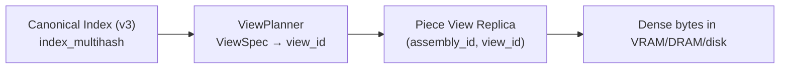
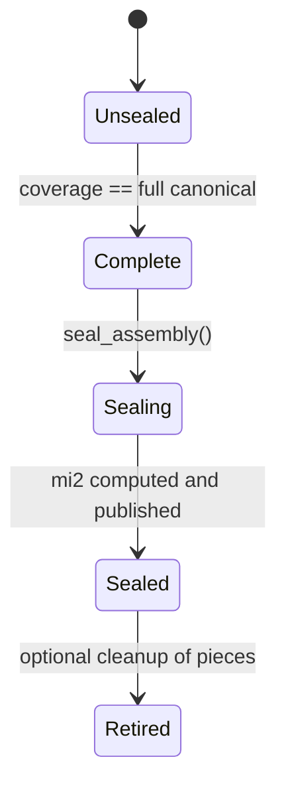
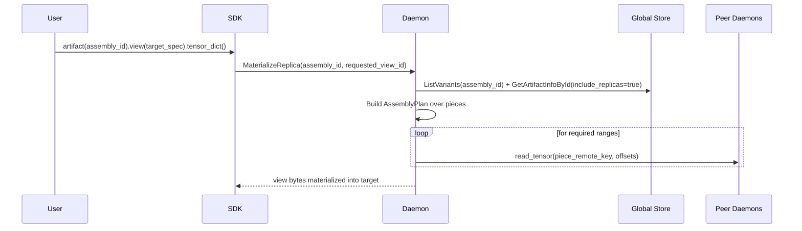

# Summary

TensorCast already has a strong, deterministic notion of **views** (`view_id`) over a canonical artifact (design-0016), and the C++ core already supports `ReplicaKey{artifact_id, view_id, device, replica}`. However, the current end-to-end system cannot treat view replicas as first-class routable objects, and the existing “partial view registration” path produces **sparse semantics** (allocate canonical-size, write ranges, then zero-fill uncovered bytes).

This design introduces a dense, piece-based representation for “partial artifacts” that:

- Represents each partial as a **dense view replica** (a “piece”) whose physical bytes are contiguous in memory/storage/transfer.
- Treats a collection of pieces as an **unsealed assembly** identified by an `assembly_id` (typically `cgid:`) that is **bound to a canonical index** (`index_multihash`), even when a full MI2 (`data_multihash`) does not exist yet.
- Enables DTensor/TorchStore-like **reshard / redistribute** behavior by materializing a requested view either from an existing view replica or by **assembling** from other available pieces (without ever allocating a sparse canonical buffer).
- Allows “complete” assemblies to be **sealed** into a stable MI2 identity, optionally materializing and publishing canonical replicas for durability.

# Goals / Non-Goals

## Goals

1. **No sparse writes**: any physical replica (canonical or view/piece) must be dense in memory and in P2P transfers. No “canonical with holes”.
2. **Unsealed operation**: support assemblies that have a canonical index bound but do not (yet) have an MI2 `data_multihash` (and therefore no canonical MI2 id).
3. **Piece-based composition**: represent partial coverage as a set of dense view replicas that map deterministically to canonical byte ranges.
4. **View-aware routing and transport**: Global Store, daemon RPCs, and P2P export keys must become view-aware to avoid ambiguity/collisions.
5. **Reshard via TensorCast primitives**: enable DTensor/TorchStore-style “put with one sharding, get with another sharding” using TensorCast view planning + P2P primitives (no new collective runtime required in v1).
6. **Sealing**: when full canonical coverage is available, enable computing MI2 and transitioning to a stable identity.

## Non-Goals

- Multi-dimensional slice support beyond existing view ops (`narrow` single-dim, `transpose`) is not required for v1.
- DTensor `Partial` reduce semantics (e.g., `Partial("sum")`) are not implemented in this phase (see “Future TODOs & Directions”).
- Introducing a compiler/SPMD translator or a global reshard collective API is out of scope; orchestration remains client-driven, built atop point-to-point materialization.
- Redesigning UMA’s plan/commit protocol; this design builds on UMA as-is.

# Scope (current implementation)

This design describes the **executable** implementation we intend to build now. Future extensions are collected in a dedicated chapter (“Future TODOs & Directions”) to keep the core spec unambiguous and to keep the plan document strictly executable.

**Normative constraints**

- **ByteSpaceRef everywhere**: all routing, transport locks, export keys, HA inventory/checksums, and replica records MUST be scoped by a `ByteSpaceRef { kind, id }`.
  - Canonical ByteSpace: `kind=CANONICAL` (no `id`).
  - View ByteSpace: `kind=VIEW`, `id=view_id`.
- **Piece views are selection-only**: `VIEW_REGISTRATION_KIND_PIECE` MUST normalize to a pure selection plan. Concretely, pieces MAY use `narrow` but MUST NOT use `transpose` (or any reorder/compute op) in this phase.
- **Assembly synthesis is selection-only**: the “assemble from pieces” path only supports target views that are also selection-only. Requests that require a compute transform return `FAILED_PRECONDITION`.
- **Pieces must be partial**: `VIEW_REGISTRATION_KIND_PIECE` MUST represent partial canonical coverage. A `ViewSpec` that normalizes to an identity/full-coverage view is rejected for piece registration (callers should seal/publish or register canonical-kind instead).
- **Pieces are cache-like by default**: piece replicas are treated as ephemeral residency unless an explicit policy requests durability (sealing remains the recommended path to durable MI2).
- **No LIP pieces**: `VIEW_REGISTRATION_KIND_PIECE` MUST be implemented only for non-LIP registration plans (e.g., coalesced / stable-dram). Lease-in-place (VRAM_LEASED) is not supported for pieces in this phase.
- **No legacy partial semantics**: `allow_partial` is deprecated and MUST be false; requests setting `allow_partial=true` MUST fail with `FAILED_PRECONDITION` (legacy “canonical with holes/zero-fill” is removed). Partial coverage is represented only via `registration_kind=PIECE` + dense view replicas.
- **Padding determinism**: any padding bytes introduced by view alignment MUST be zeroed in the stored view buffer (not just during hashing). The `view_data_hash` MUST cover the entire view ByteSpace, including padding zeros, using the same multibase/multihash SHA-256 scheme as `index_multihash` (leaf chunk size aligned with the canonical verification policy).
- **Coverage enforcement requires ranges**: this phase MUST persist canonical coverage ranges for each piece (or an equivalent manifest) so overlaps and completeness can be validated deterministically. If coverage ranges are unavailable, assembly and sealing MUST fail with `FAILED_PRECONDITION` ("coverage metadata missing").

# Current State (Grounding)

## Views exist in-core, but not end-to-end routable

- `core/store/materialization/contracts/loading_spec.h` already supports `ReplicaKey.view_id` and materialization already filters local replicas by `requested_view_id` (`core/store/runtime/ingestion/materialization_service.cc`).
- Global Store routing is **not view-aware** today:
  - `core/store/components/global_store_client.cc::request_view_transport` explicitly falls back to canonical routing.
  - `tensorcast.global_store.TransportService` and `ReplicaRepository` select replicas by `artifact_id` only.
  - `tensorcast.common.v1.MemoryInfo` lacks a ByteSpace dimension (no `ByteSpaceRef` / `view_id`), so GS cannot publish view-scoped replicas.
  - `schema.sql` stores view metadata (`variants`) but **replicas** (`artifact_replicas`) have no ByteSpace dimension.
  - SDK view construction is currently *artifact-first* (design-0039): building a `ViewSpec` requires fetching a canonical index by `artifact_id`/`key` (`tensorcast/api/store/views.py`). This makes it impossible to bootstrap a *new* assembly id unless the canonical index can be supplied explicitly.

## “Partial” today is sparse in-memory

`ViewRegistrationOptions.allow_partial` currently means:

1) Allocate a **canonical-size** buffer for the registration.
2) Write only selected canonical ranges.
3) Zero-fill uncovered canonical ranges during commit (`core/store/runtime/metadata/registration_backend.cc`).

This is explicitly the opposite of the desired invariant: partial replicas must be dense, not “canonical with zeros”.

Additional implementation detail: today the backend enforces `view.canonical_size_bytes == total_size_bytes`, which makes view registration implicitly canonical-size even when only a view-sized buffer was intended. This must change for piece registration.

## Concrete correctness gaps for view replicas

- **P2P key collision**: `core/store/replica/memory_export_registry.cc` generates communicator keys using only `artifact_id` (ignores `view_id`), so multiple view replicas under the same `artifact_id` collide.
- **Transport lock ambiguity**: `LockTransportChunksRequest` in `proto/tensorcast/daemon/v2/store_daemon.proto` has `artifact_id` + `chunk_indices` (+ optional device), but no ByteSpaceRef (cannot disambiguate canonical vs view replicas).
- **HA inventory ambiguity**: HA checksums collapse inventory by `artifact_id` only:
  - Daemon: `daemon/ha/worker_lifecycle_manager.cc::compute_state_checksum`
  - Global Store: `tensorcast/global_store/services/recovery_service.py::_compute_state_checksum`
  Both must incorporate `view_id` to avoid treating different view replicas as the “same” object.
- **Daemon-local residency ambiguity**: device residency helpers are artifact-id scoped today:
  - `core/store/runtime/replica/replica_runtime.cc::get_unique_gpu_residency`
  - `core/store/runtime/replica/replica_runtime.cc::get_resident_devices`
  For view replicas these must become ByteSpace-aware or callers must provide `view_id` and/or `device_id`.
- **LIP registry ambiguity**: daemon LIP state is keyed by `(artifact_id, device_id)` only:
  - `daemon/state/types.h::ArtifactDeviceKey`
  - `daemon/state/lip_manager.cc::find_active_by_artifact_id`
  This conflates canonical and view replicas and must be extended to include `view_id` (or explicitly restricted to canonical-only).
- **Index binding missing for CGID today**: LIP commit for `cgid:` intentionally clears `index_multihash` (`daemon/state/lip_manager.cc::commit_lease_in_place`). Assembly CGID requires index binding, so CGID registrations that include canonical index bytes must persist `index_multihash` even when `id_kind=CGID`.
- **CGID descriptor loss in Global Store**: `RegisterReplica` currently ignores the optional `ArtifactDescriptor` and upserts CGID rows without `index_multihash`. This prevents `GetArtifactIndexById` from resolving index bytes for assemblies unless the descriptor is honored.
- **Chunk directory is canonical-only** (`schema.sql::chunk_directory`); inserting view replicas there would conflate byte spaces.

# Architecture & Interfaces

## 1. Core idea

Represent partial artifacts as **dense view replicas** (“pieces”) plus a deterministic mapping to a shared canonical byte space.

In other words:

- Canonical ByteSpace remains the semantic reference for an artifact’s full tensor set (index-v3).
- Physical storage for partials is always dense, and lives in a view ByteSpace (a `view_id`).
- “Partial artifact” is a *logical statement*: “this `assembly_id` has pieces that cover some canonical ranges”.



## 2. Identities and lifecycle

### 2.1 Identity kinds

We use two identity layers:

- `assembly_id` (typically `cgid:...`): identifies an *unsealed assembly* whose canonical index is known and stable, but whose canonical data hash may not be known yet.
- `mi2:...`: identifies a *sealed artifact* (content-addressed).

Key point: for assemblies we require **canonical index binding** even if the id kind is `CGID`.

#### CGID profiles (clarification)

CGID is used for two different workload profiles:

- **Ephemeral CGID** (design-0017): hot-path runtime artifacts that do not require canonical index binding or view planning.
- **Assembly CGID** (this design): a CGID that *is* bound to a canonical index (`index_multihash`) so that deterministic `view_id` and ByteSpace semantics apply.

This design applies only to the second profile. Concretely, an `assembly_id` MUST have:

- `artifacts.id_kind = CGID`
- `artifacts.index_multihash` populated (canonical index bound)
- `artifacts.data_multihash = NULL` until sealing completes

### 2.2 Lifecycle state machine



### 2.3 What happens when MI2 does not exist

When an assembly is Unsealed:

- **Routing** is view-based (pieces), not canonical.
- **Verification** is piece-scoped (view ByteSpace hash/leaves), not canonical MI2 `data_multihash`.
- **Dedup** is limited (no content-addressed collapse).
- **Persistence** is policy-driven but typically discouraged until sealing (unless a deployment explicitly wants durable pieces).

## 3. Pieces

### 3.1 Definition

A **piece** is a view replica stored under `(assembly_id, view_id)` with:

- Physical bytes in the **view ByteSpace** (`[0, view_size)`).
- Deterministic mapping to canonical byte ranges via the view plan inverse (`ViewWritePlan`).

In v1, pieces are restricted to selection-only views (see Scope). This restriction is what makes it possible to assemble and seal without introducing a “canonical buffer + compute transform” dependency.

#### Padding semantics (required)

`ViewPlanner` may introduce padding ranges in the view ByteSpace for alignment. Padding bytes:

- are part of the dense `view_size_bytes` allocation
- do not correspond to any canonical bytes (they MUST NOT count toward canonical coverage)
- MUST be treated as logical zeros

To keep `view_data_hash` deterministic, the daemon MUST either validate padding bytes are zero or overwrite them with zeros before hashing/publishing.

#### `view_data_hash` definition (required)

`view_data_hash` MUST be computed over the full view ByteSpace `[0, view_size_bytes)` after padding bytes have been zeroed. The hash MUST use the same multibase/multihash SHA-256 scheme as `index_multihash` and SHOULD use the same leaf chunk size policy as canonical verification (default 4 MiB unless overridden by config). This makes piece immutability and cross-daemon verification stable.

### 3.2 Dense invariant

Every piece replica is dense:

- Allocation size equals `view_size_bytes`.
- P2P exports are chunked over `[0, view_size_bytes)`; there are no skipped holes.

This is a strict invariant: any design that requires allocating canonical-size buffers for partial coverage is rejected.

### 3.3 Immutability and overlap policy (required)

To keep assembly and sealing deterministic, we require two invariants:

- **Piece immutability**: once Global Store records `(assembly_id, view_id)` metadata with a `view_data_hash`, subsequent piece registrations for the same `(assembly_id, view_id)` MUST be idempotent:
  - if the computed `view_data_hash` matches: treat as OK (idempotent retry)
  - if it differs: reject as `FAILED_PRECONDITION` (“piece content conflict”)
  - v1 requirement: piece registration MUST compute and persist `view_data_hash` (do not treat it as optional metadata)
- **Canonical overlaps are rejected in v1 (except idempotent same-view retries)**:
  - overlap across **different** `view_id` is rejected as `FAILED_PRECONDITION` (ambiguous assembly inputs)
  - overlap across the **same** `view_id` is treated as duplication and is safe under the piece immutability rule
  - overlap detection requires canonical coverage ranges (or a coordinator-supplied manifest). If coverage ranges are missing, registration or assembly MUST fail fast with `FAILED_PRECONDITION`.

## 4. Registration semantics

### 4.0 Bootstrapping a new assembly id

To register the first piece for a new `assembly_id`, callers must be able to provide the canonical index bytes directly (because the assembly does not exist in Global Store yet).

Note: the daemon RPC surface already supports supplying canonical index bytes via `BeginRegisterArtifactRequest.tensor_index_data`. The missing part today is an SDK path that can compute deterministic `view_id`/`view_size` for a new `assembly_id` without a pre-existing GS row.

Proposed SDK addition (shape only; exact API is not a checklist requirement):

- `tc.register_piece(..., assembly_id=..., canonical_index_bytes=..., slices=...)` (v1: selection-only; no transpose)
  - or `tc.register_view(..., artifact_id=assembly_id, canonical_index_bytes=..., registration_kind="piece", ...)`

This is the minimal “bootstrap escape hatch” that keeps view identity deterministic without requiring any pre-existing GS state.

### 4.1 Split full-coverage vs piece registration

We separate two concepts that are conflated today:

1. **Register canonical-from-view** (existing intent of design-0016): upload bytes in a view order (e.g., transpose), but end up with a canonical MI2 artifact.
2. **Register piece view replica** (new): upload only part of the canonical artifact, and store it as a dense view replica under an assembly.

For v1, piece registration should be explicit in the wire protocol. Overloading `allow_partial` is risky because it is currently interpreted as “canonical with holes”.

Proposed proto change:

- Add `ViewRegistrationKind` (or `ViewRegistrationMode`) to `ViewRegistrationOptions`:
  - `VIEW_REGISTRATION_KIND_CANONICAL` (existing behavior): upload is ingested into canonical ByteSpace; requires full canonical coverage.
  - `VIEW_REGISTRATION_KIND_PIECE` (new): upload is stored as a dense **view replica**; canonical ByteSpace is *not* materialized.

Proposed SDK surface:

- `register_view(..., registration_kind="canonical"|"piece", ...)` (default `"canonical"`).

#### Required semantic changes (core/daemon)

- **Canonical-kind view registration** stays as today (design-0016 intent), but hardens constraints:
  - reject partial canonical coverage (deprecate the “zero-fill uncovered bytes” behavior).
  - require `BeginRegisterArtifact.total_size == canonical_size_bytes` (canonical ByteSpace size).
- **Piece-kind view registration** changes the storage contract:
  - `BeginRegisterArtifact.total_size == view_size_bytes` (piece ByteSpace size).
  - `ViewRegistrationOptions.canonical_size_bytes == canonical_size_bytes` (from the canonical index); **for PIECE this is allowed to differ from `total_size`**.
  - `ViewRegistrationOptions.ranges` MUST be empty in v1 (the daemon computes canonical coverage from the view plan).
  - `ViewRegistrationOptions.allow_partial` MUST be false (piece-ness is expressed by `registration_kind`, not by “canonical with holes”).
  - uploaded bytes are written densely into the view replica buffer `[0, view_size_bytes)`, and **padding ranges are zeroed in storage**.
  - commit publishes a replica under `(assembly_id, view_id)` (no fabricated canonical bytes; no zero-fill of canonical space).
  - computed `canonical_coverage` MUST count only canonical-mapped bytes (exclude any view padding bytes).
  - `view_data_hash` MUST be computed from the view ByteSpace bytes (not via canonical replay) and persisted.
  - v1: reject lease-in-place registrations for pieces (`BeginRegisterArtifact.lease.in_place=true`) until LIP becomes ByteSpace-aware.

This is a deliberate re-alignment: partial coverage becomes *absence*, not “bytes with zeros”.

#### View identity resolution (required)

To avoid collisions and “trusting” inconsistent client input, the daemon MUST resolve and validate view identity as in design-0016:

- If the request provides `ViewSpec` but omits `view_id`, the daemon computes deterministic `view_id` from `(canonical index ⊕ normalized ViewSpec)`.
- If the request provides both `ViewSpec` and `view_id`, the daemon validates they match; otherwise reject `INVALID_ARGUMENT`.
- If the view normalizes to identity:
  - for `VIEW_REGISTRATION_KIND_CANONICAL`: fold to canonical path (no `view_id`)
  - for `VIEW_REGISTRATION_KIND_PIECE`: reject (pieces must be partial in v1)
- `registration_kind` MUST be provided. Requests omitting it are rejected as `INVALID_ARGUMENT`.

### 4.2 Canonical index binding for assemblies

On first registration for an `assembly_id`:

- Persist `index_multihash` (and index bytes via `artifact_indices`) in Global Store.
  - `index_multihash` is derived from the canonical index bytes using the same multihash/multibase policy as MI2. Prefer computing it in the daemon/core and persisting it explicitly, rather than re-deriving ad-hoc in multiple languages.
  - Global Store MUST honor `ArtifactDescriptor` on `RegisterReplica` (including CGID rows) so `index_multihash` survives registration.

On subsequent registrations for the same `assembly_id`:

- Reject if the provided canonical index does not match the stored `index_multihash`.

This ensures all piece `view_id` computations are stable and deterministic across nodes.

#### Required change to CGID behavior (index binding)

Existing CGID flows (design-0017) intentionally avoid hashing. However, assembly CGID requires index binding to make view identity deterministic and to make missing-coverage errors meaningful.

Therefore, for `cgid:` artifacts that participate in piece registration:

- The daemon MUST compute `index_multihash` when canonical index bytes (or `tensor_index_key`) are provided, even if `id_kind=CGID`.
- The Global Store MUST persist this `index_multihash` on the `artifacts` row for the `assembly_id`.
- The daemon MUST treat “CGID without index binding” as ineligible for piece/assembly features (reject with `FAILED_PRECONDITION` and guidance).

## 5. Materialization semantics

### 5.1 Serving an exact view replica (fast path)

If the requested `(artifact_id, view_id)` exists as a view replica:

1) Daemon asks Global Store for a view-aware transport route (`request_view_transport`).
2) The source daemon exports chunks for that specific `ReplicaKey{artifact_id, view_id, device}`.
3) The destination daemon materializes the dense view bytes into target memory.

### 5.2 Assembling a requested view from other pieces (reshard path)

If the requested view replica does **not** exist, but other pieces exist, the daemon may synthesize the requested view by assembling from pieces:

#### Canonical requests for unsealed assemblies (required)

User-facing APIs often request the **canonical** ByteSpace (no `view_id` / no `ViewSpec`) via `Artifact.tensor_dict()` / `tensor_into()` without an explicit `.view(...)`.

For `artifact_id=assembly_id` in the **Unsealed** lifecycle state, a canonical replica typically does not exist. To support “TP register shards, later get the whole tensor”, the daemon MUST treat a canonical request as a valid assembly synthesis target:

- **Target ByteSpace**: canonical (NULL/empty `view_id`).
- **Target plan**: identity view plan computed from the canonical index (`ViewSpec{}`; selection-only).
- **Execution**: identical to the “reshard path”, except the sink layout is canonical.

This behavior MUST NOT allocate any canonical buffers during piece registration, but it is allowed (and expected) to allocate canonical-size memory when the caller explicitly requests the full canonical payload.

1) Fetch canonical index bytes for the assembly (`GetArtifactIndexById(assembly_id)`).
2) Compute the requested view plan (canonical → target view) using `ViewPlanner`.
3) Discover candidate pieces via Global Store.
   - The current GS API can fetch `ViewMeta` for a specific `view_id` (`GetArtifactInfoById(..., view_id=..., include_view_meta=true)`), but it cannot enumerate all views for an artifact. For assembly synthesis we need one of:
     - a new “list variants” RPC (paginated) returning `{view_id, view_spec_json, view_size, canonical_coverage}`; or
     - client-provided candidate `view_id`s (sufficient for DTensor-style known shard sets, but less general).
   - The candidate listing MUST include canonical coverage ranges (or a manifest reference) so the planner can detect overlaps and verify full coverage. If ranges are unavailable, assembly MUST fail with `FAILED_PRECONDITION` (“coverage metadata missing”).
   - Candidate selection MUST be based on *current residency*, not just persisted metadata:
     - `ListVariants` provides the universe of known piece views (may include stale entries).
     - `GetArtifactInfoById(include_replicas=true)` provides current replicas; the daemon intersects by `view_id` to find usable piece replicas.
4) For each candidate piece view, compute its inverse mapping (view → canonical) using `ViewPlanner::compute_bidirectional_view_plan`.
5) Build a canonical-space interval map: `canonical_offset → (piece_view_id, piece_view_offset)`.
6) Build an `AssemblyPlan` that directly maps `target_view` writes to reads from piece replicas (preferred over a “canonical SeekableSource” abstraction in v1).
7) Execute the plan using existing dataplane primitives (`RemoteKeySource` + `pump_ranges`) to fill the target sink.

##### `AssemblyPlan` (v1; selection-only)

In v1, `AssemblyPlan` is a pure copy plan (no compute kernels). Conceptually it is a list of range copies:

- `(target_view_offset, length) <- (source_view_id, source_view_offset, length)`
- plus optional zero-fill operations for target padding ranges introduced by view alignment

Planner requirements:

- The union of source pieces must cover all canonical ranges required by the target view.
- The plan MUST be deterministic given the candidate set (stable sorting + consistent tie-breaking).
- The plan MUST NOT select overlapping canonical coverage across different `view_id` (v1 invariant).
- Range boundaries should respect UMA chunk boundaries for efficient lock/export (follow existing `pump_ranges` guidance).
- Target padding ranges MUST be emitted as explicit “fill zeros” steps and MUST NOT require any piece coverage.

Restriction: if either the target view or any candidate piece view requires a compute transform (e.g., `transpose`), return `FAILED_PRECONDITION`.



#### Error model

- If no set of pieces can cover all canonical ranges required by the requested view, return `UNAVAILABLE` with a structured “partial coverage” detail containing missing canonical ranges.
- If candidate pieces overlap in canonical byte space (across different `view_id`), return `FAILED_PRECONDITION` (v1 does not define a safe disambiguation policy).

## 6. Sealing semantics

### 6.1 Operation

`seal_assembly(assembly_id)`:

1. Validate that piece coverage spans the full canonical byte space.
2. Build a canonical-order stream over pieces (no full canonical buffer required):
   - v1: selection-only pieces allow a pure copy/read mapping from canonical ranges to piece view ranges
   - missing coverage is an error (do not zero-fill)
3. Compute `data_multihash` by streaming assembled canonical bytes using `compute_data_multihash_from_seekable_source`.
4. Produce `mi2:<index_multihash>:<data_multihash>`.
5. Persist a binding `assembly_id → mi2_id` in Global Store.
6. Update any configured “human key” mappings to point to `mi2_id` (so future loads resolve to the sealed identity).
7. Materialize/publish at least one canonical replica under `mi2_id` (recommended default for durability/tooling).
8. (Recommended) Preserve cached view replicas either by migrating them to `mi2_id` or by recording an alias policy so view-scoped reads can fall back to `assembly_id` replicas after redirect.

#### Idempotence

- Sealing should be idempotent: if `assembly_id` is already bound, return the bound `mi2_id`.
- If multiple sealers race, Global Store should converge to a single binding; conflicting bindings are rejected as `FAILED_PRECONDITION`.

#### Resolution semantics after sealing (required)

Once an `assembly_id` is bound to an `mi2_id`, the system MUST define a consistent resolution rule to avoid user surprise and to enable piece cleanup:

- Materialization requests that specify `artifact_id=assembly_id` MUST resolve the binding and load the sealed `mi2_id`.
- For view requests (ByteSpaceRef `kind=VIEW`), the daemon SHOULD first resolve and attempt the sealed `mi2_id` view replica; if missing and the deployment allows aliasing, it MAY fall back to view replicas still registered under `assembly_id` (or migrate/publish them to `mi2_id` during sealing). This prevents cached view replicas from becoming unreachable after sealing.
- Writes of additional pieces after sealing SHOULD be rejected by default (`FAILED_PRECONDITION`) to keep the sealed identity stable.

### 6.2 Why sealing is optional

DTensor/TorchStore-like workflows often only require a stable *handle* to shards, not a globally content-addressed canonical id. Sealing is the path to:

- durable persistence
- global deduplication
- canonical MI2-based routing

But it is not required for correctness of unsealed, piece-based resharding.

# Walkthroughs (Stress Test)

This section “plays the tape” from user code down to UMA/P2P to validate the design and to surface consistency constraints.

## A. User-level usage

### A1. Register the first piece for a new assembly

1) User provides `assembly_id="cgid:..."` and `canonical_index_bytes` (from a checkpoint descriptor or model metadata).
2) User registers a shard tensor as a piece via `registration_kind="piece"` + `slices=...`.
3) The daemon commits a dense view replica keyed by `(assembly_id, view_id)` and publishes it to Global Store with `view_id`.

Representative end-to-end calls (v1):

- SDK:
  - normalizes the selection-only `ViewSpec` (subset + narrow)
  - computes `view_id` deterministically from `(canonical index ⊕ ViewSpec)` (or lets the daemon compute and echoes back)
  - computes `view_size_bytes` from `ViewPlanner`
- SDK → Daemon:
  - `BeginRegisterArtifact(total_size=view_size_bytes, client_artifact_id=assembly_id, tensor_index_data=canonical_index_bytes, view={view_id, spec, placement, canonical_size_bytes, registration_kind=PIECE})`
  - upload dense view bytes via `FeedRegisterArtifactStream`
  - `CommitRegisteredArtifact`
- Daemon/Core:
  - validates `assembly_id` is index-bound CGID (or bootstraps by persisting index binding on first write)
  - stores dense view bytes as a view replica (no canonical allocation)
  - computes/records piece verification metadata (`view_data_hash` and optional leaves)
  - computes canonical coverage for the piece from the view plan (v1 selection-only)
- Daemon → Global Store:
  - upserts `artifacts(artifact_id=assembly_id, id_kind=CGID, index_multihash=...)`
  - upserts `artifact_indices` (if index bytes new)
  - upserts `variants(artifact_id=assembly_id, view_id=..., view_spec_json, view_size, view_data_hash, canonical_coverage)`
  - registers the replica under `(artifact_id=assembly_id, view_id=...)` in `artifact_replicas` (via `MemoryInfo.byte_space` with `kind=VIEW`, `id=view_id`)

Key constraints validated here:

- canonical index binding must be stored for `assembly_id` on first write.
- storage size is `view_size_bytes`, not canonical size.

Stress points to validate:

- If the client retries the same piece registration, piece immutability must make it idempotent (same `(assembly_id, view_id)` + same `view_data_hash`).
- If the client supplies mismatched index bytes for an existing `assembly_id`, reject early (`INVALID_ARGUMENT`).
- v1 rejects `transpose` and rejects LIP registrations for `registration_kind=PIECE`.

### A2. Get an existing piece view

1) User calls `artifact(assembly_id).view(spec_for_piece).tensor_dict()`.
2) The daemon resolves a view-aware route and transfers dense view bytes.

Representative chain:

- Daemon resolves binding: if `assembly_id` is sealed, load via `mi2_id` (default redirect).
- Otherwise (unsealed):
  - resolve/validate `view_id` (if only spec provided)
  - try local `ReplicaKey{assembly_id, view_id, device}` fast path
  - on miss: request a view-aware transport from Global Store (must select replicas whose `MemoryInfo.byte_space` matches the requested view ByteSpaceRef)
  - read from communicator using `remote_memory_keys` and materialize dense view bytes

### A3. Reshard: get a view that does not exist as a replica

1) User calls `artifact(assembly_id).view(spec_target).tensor_dict()`.
2) Global Store has no replica for `view_id_target`.
3) The daemon assembles `view_id_target` from other available piece views.

This is the TorchStore/DTensor “put with Shard(0), get with Shard(1)” scenario.

Representative chain (v1 selection-only):

- Daemon queries metadata:
  - canonical index bytes (`GetArtifactIndexById(assembly_id)`)
  - candidate piece universe (`ListVariants(assembly_id)`)
  - current residency (`GetArtifactInfoById(include_replicas=true)`)
- Daemon computes `AssemblyPlan` (pure copy plan):
  - each target view range is satisfied by exactly one piece view range (v1 rejects overlaps across different view_ids)
- Daemon executes the plan:
  - for each piece replica involved, read the required byte ranges via communicator and copy into the target view buffer
- Optional caching (policy-driven): the daemon MAY publish the newly materialized `view_id_target` as a view replica under `assembly_id` to accelerate future identical gets.

### A4. Scenario: TP8 piece registration, then canonical get and TP4 reshard

This is a concrete “plays the tape” scenario based on common Tensor Parallel (TP) workflows:

- Registration happens with `TP=8`: each rank registers **1/8** shards as pieces under a shared `assembly_id`.
- Later, some consumer wants:
  - the **whole** tensor set (canonical ByteSpace), and/or
  - a different sharding `TP=4` (reshard from TP8 → TP4) without ever allocating sparse canonical buffers during registration.

#### A4.1 Register TP8 pieces (8 writers, one `assembly_id`)

Assumptions (v1; required for determinism):

- **Pure sharding** only: each canonical byte range is written by exactly one piece view (no replicated tensors across ranks).
- Each tensor is sharded along **at most one** dimension (consistent with `ViewPlanner` narrow constraints).
- All ranks use the **same** canonical index bytes (index binding invariant).

Recommended orchestration:

1) Coordinator chooses `assembly_id` (an index-bound `cgid:`) and broadcasts it.
   - If a human key is used, only the coordinator should write `key -> assembly_id` mapping (avoid 8-way races on the same key).
2) Each rank `i ∈ [0,7]` computes a per-tensor slice plan `spec_tp8(i)`:

```python
def split_dim(extent: int, parts: int, idx: int) -> tuple[int, int]:
    base = extent // parts
    rem = extent % parts
    start = idx * base + min(idx, rem)
    length = base + (1 if idx < rem else 0)
    return start, length
```

3) Each rank registers a piece view replica:
   - `registration_kind = PIECE`
   - `view_spec = spec_tp8(i)` (selection-only; per-tensor `narrow`)
   - upload dense view bytes for that piece (no canonical-size allocation)
4) Global Store ends up with 8 variants + replicas:
   - `variants(assembly_id, view_id_i, view_spec_json_i, view_size_i, canonical_coverage_i, view_data_hash_i)`
   - `artifact_replicas(assembly_id, view_id_i, device_uuid, ...)`

Note on replicated tensors:

- In many TP stacks, some parameters are replicated. v1 overlap rules require callers to avoid duplicated canonical coverage by using `subset` to assign those tensors to exactly one writer (or by registering them via canonical-kind registration separately).

#### A4.2 Get the whole tensor set (canonical ByteSpace)

Question: “After TP8 registration, can we get the whole tensor set somewhere else?”

Yes, as long as canonical coverage is complete across the 8 pieces.

Flow:

1) Consumer calls `artifact(assembly_id).tensor_dict()` (no `.view(...)`).
2) Daemon resolves `assembly_id`:
   - if sealed: redirect to `mi2_id` (default behavior)
   - else: treat as **canonical request for an unsealed assembly** (required behavior in this design)
3) Canonical materialization has no existing canonical replica for `assembly_id`, so the daemon assembles canonical bytes from pieces:
   - enumerate piece variants (`ListVariants(assembly_id)`)
   - pick currently resident piece replicas (`GetArtifactInfoById(include_replicas=true)` filtered by `view_id`)
   - build an interval map from canonical ranges to `(source_view_id, source_view_offset)`
   - execute the copy plan into a canonical-size destination buffer
4) Optional caching: policy may publish the synthesized canonical replica under `(assembly_id, view_id=NULL)` for repeated canonical reads, but it remains an **unsealed** identity and will be redirected after sealing.

Failure modes to expect (and surface clearly):

- if some TP8 pieces are missing: `UNAVAILABLE` with missing canonical ranges
- if canonical overlaps exist across different TP8 `view_id`: `FAILED_PRECONDITION` (v1 ambiguity)

#### A4.3 Get TP4 shards (reshard from TP8 → TP4)

Question: “Can we request TP4 shards from a TP8-registered assembly?”

Yes, the requested TP4 view can be synthesized directly from TP8 pieces (no sparse canonical buffer needed).

For each TP4 rank `r ∈ [0,3]`:

1) Consumer computes `spec_tp4(r)` using the same `split_dim` rule with `parts=4`.
2) Consumer calls `artifact(assembly_id).view(spec_tp4(r)).tensor_dict()`.
3) The daemon synthesizes `view_id_tp4(r)` from available pieces:
   - in the common “pure contiguous sharding” case, each TP4 shard is covered by exactly two TP8 shards, so the plan reads from `{view_id_{2r}, view_id_{2r+1}}`
   - in the general case (uneven split / per-tensor dims), the plan may require 1–N TP8 pieces per tensor; the assembly planner derives this from canonical-range intersections, not from a hard-coded “2 pieces” rule
4) Optional caching: publish `(assembly_id, view_id_tp4(r))` so subsequent TP4 reads hit the fast path.

Performance stress points:

- If a tensor is sharded along an **inner** dimension, `ViewPlanner` generates many small contiguous ranges (one per outer index). Assembly must coalesce ranges aggressively to avoid range explosion.

#### A4.4 Top-down and bottom-up trace (why the ByteSpace work matters)

- Canonical get (top-down):
  - Python: `Artifact.tensor_dict()` → materialization pipeline (`tensorcast/api/store/materialization.py`)
  - Daemon: `MaterializeReplica`/`MaterializeIntoTarget` resolves **no view identity** → canonical request
  - Daemon/Core: canonical replica miss for unsealed `assembly_id` → enter assembly synthesis:
    - GS: `ListVariants(assembly_id)` + `GetArtifactInfoById(include_replicas=true)` (filtered by `view_id`)
    - Core: build `AssemblyPlan` for canonical sink (identity plan) and execute copy reads from piece replicas
- TP4 reshard (top-down):
  - Python: `Artifact.view(spec_tp4).tensor_dict()` → includes `view_spec`/`view_id`
  - Daemon/Core: exact `(assembly_id, view_id_tp4)` miss → assembly synthesis over TP8 pieces as inputs
- Bottom-up (data movement):
  - Destination daemon requests view-scoped transports/locks and receives `MemoryInfo` with `view_id`.
  - Source daemon exports the correct buffer using `ReplicaKey{artifact_id, view_id, device}`.
  - P2P tensor export keys and transport locks MUST incorporate `view_id`, otherwise TP8 pieces and derived TP4 views can collide on `artifact_id` and cause incorrect exports/locks.

### A5. Seal to MI2

1) A coordinator calls `seal_assembly(assembly_id)`.
2) The daemon streams canonical bytes from pieces, computes `data_multihash`, and records the binding.
3) The system optionally materializes/publishes a canonical replica under the MI2 id and updates key mappings.

Stress points:

- The seal path must be robust to piece expiry and eviction:
  - v1: treat missing/expired pieces as `UNAVAILABLE` (retryable) with missing canonical ranges
- Sealing must be idempotent and race-safe: a single `assembly_id` must bind to at most one `mi2_id`.
- After binding, default reads of `assembly_id` redirect to `mi2_id`, enabling safe cleanup of pieces.

### A6. Post-seal reads (redirect semantics)

1) User calls `artifact(assembly_id).tensor_dict()` after sealing.
2) Daemon resolves `assembly_id -> mi2_id` and loads the sealed MI2 artifact by default.
3) Any future view operations run against the sealed canonical ByteSpace.

## B. Top-down call chains (representative)

### B1. Piece registration

- Python: `tensorcast/api/store/registration.py` (public) → `tensorcast/api/_register.py` (wire + upload)
- Daemon: `daemon/service/controllers/registration_controller.cc`
- Core: `core/store/store_engine.cc` → `core/store/runtime/metadata/registration_backend.cc`
- Global Store: `tensorcast/global_store/grpc_service.py` (`RegisterReplica`, `UpdateArtifactViewState`, artifacts/index upserts)

Design-specific branching point:

- `ViewRegistrationKind == PIECE` triggers “store dense view replica” instead of “ingest into canonical buffer”.
- The daemon must persist index binding for `assembly_id` (CGID) even when `id_kind=CGID`.
- Replica publish must include ByteSpace identity end-to-end (`MemoryInfo.byte_space` + `artifact_replicas.view_id` for view replicas).

### B2. Materialize a view

- Python: `Artifact.view(...).tensor_dict()` (design-0039) → materialization pipeline
- Daemon: `MaterializeReplica` RPC
- Core: `core/store/materialization/control/materialize_orchestrator.cc`
  - `request_view_transport` fast path when a view replica exists
  - assembly synthesis path when it does not
- Global Store:
  - view-aware transport selection (make `request_view_transport` real)
  - list variants for candidate discovery in assembly synthesis
  - resolve `assembly_id -> mi2_id` bindings (post-seal redirect)

### B3. P2P transfer

- Destination daemon builds a `P2PSource` from GS `MemoryInfo` and calls the ingestion pipeline.
- Dataplane uses `RemoteKeySource` (`core/store/materialization/dataplane/sources/remote_key_source.*`) and `pump_ranges`.
- Transport/locking surfaces (`LockTransportChunks`) must be ByteSpace-aware to avoid locking/exporting the wrong replica when multiple view replicas share an `artifact_id`.

### B4. HA / recovery surfaces (often missed)

- Daemon: `daemon/ha/worker_lifecycle_manager.cc` state checksum and sync selectors must incorporate `view_id`.
- Global Store: `tensorcast/global_store/services/recovery_service.py` checksum must incorporate `view_id`.

Without this, HA state convergence can silently conflate different view replicas, causing incorrect removals/updates and hard-to-debug inconsistency.

## C. Bottom-up call chains (byte movement)

### C1. Source daemon export

- `ReplicaKey{artifact_id, view_id, device}` identifies the exported buffer.
- UMA provides base pointers and chunk ledger state (design-0023).
- `ReplicaLoadController::export_chunks_for_p2p` delegates to `MemoryExportRegistry::export_chunks` to register communicator tensors.

Critical invariant:

- communicator tensor keys must include ByteSpace identity to avoid collisions when multiple view replicas share `artifact_id`.
  - For view ByteSpaces, include `view_id` (or a stable short hash of it) to keep tensor keys bounded in length.
  - Canonical replicas use a canonical ByteSpaceRef sentinel, but still share the same formatting function.

### C2. Destination daemon read

- `RemoteKeySource::read_at` maps offsets into `(remote_memory_key, key_offset)` and calls communicator `read_tensor`.
- For assembly synthesis, the daemon builds an `AssemblyPlan` and executes it by dispatching per-piece `RemoteKeySource::read_at` calls (no full canonical buffer required in v1).

Safety constraints:

- chunk locks must be scoped by `(artifact_id, ByteSpaceRef, device)` so eviction/export bookkeeping is correct.
- any missing canonical coverage required by the requested view yields `PartialCoverageDetail`.

### C3. Transport locking and staged exports

Even in UMA V3 (where locks are largely bookkeeping), any lock/export gate that keys only by `artifact_id` is unsafe once view replicas exist.

Required changes:

- `LockTransportChunksRequest` must carry `byte_space: ByteSpaceRef`, and the daemon must plumb it into the replica identity (`ReplicaKey.view_id` for view ByteSpaces).
- Any “LIP staged export” fast path must not activate for view replicas unless LIP becomes ByteSpace-aware:
  - v1: treat LIP exports as canonical-only; view replica lock requests must bypass the LIP branch.

# Bottom-Up Considerations

## UMA and virtual address usage

- UMA allocations remain dense: each replica allocates exactly its artifact byte size.
- Under this design, piece replicas allocate `view_size_bytes`, not `canonical_size_bytes`.
- This avoids pathological CPU VA reservations and GPU allocations for “mostly-empty canonical buffers”.

Trade-off: many pieces may increase allocation count and export bookkeeping. This is mitigated by:

- packing multiple pieces into a single coalesced registration when useful (still dense within each piece ByteSpace)

### Chunking and ledger state

- UMA chunk size (`artifact_chunk_bytes`) is global and already surfaced by `GetServerConfig`.
- Piece replicas simply have fewer chunks; chunk indices are relative to the replica’s ByteSpace, so lock/export/read must always be scoped by ByteSpaceRef.

## P2P export keys must include ByteSpace identity

Communicator tensor keys must disambiguate replicas in different ByteSpaces. Update key generation to incorporate ByteSpace identity (for view ByteSpaces, include `view_id` or a stable hash of it) in addition to `artifact_id`.

### Locking and eviction safety

- Chunk locks must target the exact replica identity (including ByteSpace identity / `view_id`) to prevent races where one view replica is locked but another is evicted.
- Export keepalives and stable leases in UMA should be keyed by the full replica identity, not by `artifact_id` alone.

## Chunk directory stays canonical-only

`chunk_directory` is keyed by `(artifact_id, chunk_idx, device_uuid, replica, node_id)` and assumes canonical chunking.

For this phase:

- Do not insert view replicas into `chunk_directory`.
- View routing uses view-aware replica records (see Schema Changes).
## HA inventory and checksums must not conflate view replicas

Either:

- include ByteSpace identity in checksum and inventory selectors, or
- exclude view replicas from HA “state checksum” entirely (and treat them as ephemeral).

This design recommends **including ByteSpace identity** to keep published view replicas consistent with recovery semantics.

## Direct-write (RDMA) implications

Assembly synthesis can degrade RDMA benefits if the canonical “virtual source” cannot provide a contiguous direct-write window into the destination.

v1 guidance:

- Keep direct-write enabled for the **exact view replica** fast path (single source).
- Allow the assembly path to fall back to staged reads (pinned pool).

# DTensor / TorchStore Coverage (Conceptual Mapping)

## What this design covers well

- DTensor-style **pure sharding** (disjoint canonical coverage across ranks) can be represented as view specs (selection-only `narrow`) and assembled into new shardings via `AssemblyPlan`.
- TorchStore “put dtensor with one sharding, get dtensor with another sharding” maps to:
  - register pieces as view replicas (per-rank shards)
  - materialize target view by assembling from pieces

## What is still missing for full DTensor parity

This design does not cover:

- DTensor `Replicate()` / overlap-heavy layouts (this phase rejects overlaps across different `view_id`).
- DTensor `Partial(reduce_op)` semantics (assembly is pure copy; no reductions).

# Invariants & Error Model

## Invariants

- **Dense storage invariant**: no partial registration path allocates canonical-size buffers for partial coverage.
- **Index binding invariant**: all pieces under an `assembly_id` share the same canonical `index_multihash`.
- **ByteSpace separation invariant**: chunking, locking, and P2P keys are always scoped to a specific ByteSpace (canonical or view).

## Errors (representative)

- `INVALID_ARGUMENT`: mismatched canonical index for an assembly id; invalid view spec.
- `UNAVAILABLE`: insufficient piece coverage to materialize the requested view; source replicas expired.
- `FAILED_PRECONDITION`: piece content conflict for the same `(assembly_id, view_id)`; overlaps across different `view_id`; unsupported compute transforms (v1); sealing requested but coverage incomplete; piece writes after sealing.
- `FAILED_PRECONDITION`: coverage metadata missing (cannot validate overlaps/completeness); invalid `registration_kind` / `allow_partial` usage.
- `DATA_LOSS`: piece verification failed (when enabled).

# Schema Changes

All schema changes reference `schema.sql` as the canonical source of truth.

## 1) Make replicas view-aware

Option A (minimal): add `view_id` to `artifact_replicas` (nullable).

```sql
ALTER TABLE artifact_replicas ADD COLUMN IF NOT EXISTS view_id TEXT NULL;
CREATE INDEX IF NOT EXISTS idx_artifact_replicas_view_id ON artifact_replicas(artifact_id, view_id);
```

## 2) Persist assembly → sealed binding

Add a new table to record sealing outcomes:

```sql
CREATE TABLE IF NOT EXISTS artifact_bindings (
  from_artifact_id TEXT PRIMARY KEY,   -- assembly_id (cgid:...)
  to_artifact_id TEXT NOT NULL,        -- mi2:...
  kind TEXT NOT NULL DEFAULT 'seal',
  created_at TIMESTAMP WITH TIME ZONE NOT NULL DEFAULT CURRENT_TIMESTAMP
);
```

## 3) Require index binding for assemblies

No schema change is required (artifacts.index_multihash is already nullable), but the **policy** changes:

- `cgid:` artifacts used as assemblies must have `index_multihash` populated.

## 4) Persist canonical coverage for variants/pieces (recommended)

The Global Store proto already carries `VariantUpsert.canonical_coverage` (total/covered). To make “complete vs partial” queries cheap and to enable future planning, persist it in SQL:

```sql
ALTER TABLE variants ADD COLUMN IF NOT EXISTS canonical_size_bytes BIGINT NULL;
ALTER TABLE variants ADD COLUMN IF NOT EXISTS canonical_bytes_covered BIGINT NULL;
CREATE INDEX IF NOT EXISTS idx_variants_coverage ON variants(artifact_id, canonical_bytes_covered);
```

## 5) Persist canonical coverage ranges (required for overlap checks)

To enforce “no overlaps across different view_id” and to prove completeness, we need the actual canonical ranges, not just totals. Add a ranges table (or an equivalent manifest) for pieces:

```sql
CREATE TABLE IF NOT EXISTS variant_coverage_ranges (
  artifact_id TEXT NOT NULL,
  view_id TEXT NOT NULL,
  range_offset BIGINT NOT NULL,
  range_length BIGINT NOT NULL,
  PRIMARY KEY (artifact_id, view_id, range_offset, range_length)
);

CREATE INDEX IF NOT EXISTS idx_variant_coverage_artifact ON variant_coverage_ranges(artifact_id);
CREATE INDEX IF NOT EXISTS idx_variant_coverage_view ON variant_coverage_ranges(artifact_id, view_id);
```

Alternative: store a compact “coverage manifest” blob referenced from `variants` if range counts are large. Either way, assembly/seal requires canonical range visibility.

# Proto / API Changes (High-Level)

## `ViewRegistrationOptions`

Add an explicit discriminator for “canonical-from-view” vs “piece view replica” registration:

- `enum ViewRegistrationKind { ... }`
- `ViewRegistrationKind registration_kind = 7;`

This avoids overloading `allow_partial` and makes the storage contract explicit.

## Variant coverage ranges

To support overlap checks and completeness validation, extend `VariantUpsert` (or add a new RPC) to carry canonical coverage ranges for each piece view. The simplest option is:

- `repeated CanonicalRange canonical_ranges = N;`

The Global Store persists these ranges in `variant_coverage_ranges` (or an equivalent manifest).

## `tensorcast.common.v1.ByteSpaceRef` (new)

Introduce a single canonical discriminator for “which ByteSpace is being referenced”:

- `enum ByteSpaceKind { BYTE_SPACE_KIND_UNSPECIFIED = 0; BYTE_SPACE_KIND_CANONICAL = 1; BYTE_SPACE_KIND_VIEW = 2; }`
- `message ByteSpaceRef { ByteSpaceKind kind = 1; string id = 2; }`
  - For `BYTE_SPACE_KIND_VIEW`, `id` is the `view_id`.
  - For `BYTE_SPACE_KIND_CANONICAL`, `id` MUST be empty.

## `tensorcast.common.v1.MemoryInfo`

Add `ByteSpaceRef byte_space` so the daemon can register and the GS can return ByteSpace-scoped replicas/routes:

- `ByteSpaceRef byte_space = 16;` (in `tensorcast.common.v1.MemoryInfo`).

## `RequestReplicaTransportRequest`

Add `ByteSpaceRef requested_byte_space` so transport selection can target a specific ByteSpace:

- `ByteSpaceRef requested_byte_space = 7;` (in `tensorcast.global_store.v1.RequestReplicaTransportRequest`).

## `LockTransportChunksRequest`

Add `ByteSpaceRef byte_space` to disambiguate locks:

- `ByteSpaceRef byte_space = 5;` (in `tensorcast.daemon.v2.LockTransportChunksRequest`).

## Global Store transport routing must be ByteSpaceRef-aware

To make `request_view_transport` real (and to avoid selecting a canonical replica when a view replica exists), Global Store transport selection MUST match the requested ByteSpaceRef (canonical vs view) and MUST NOT silently fall back across ByteSpaces.

## Global Store routing

Implement view-aware routing (either new RPC or extend existing request types) so `request_view_transport` is real and does not fall back to canonical.

## Global Store variant enumeration (for assembly synthesis)

Add a paginated “list variants” RPC (or extend `GetArtifactInfoById`) so daemons can discover candidate piece views when synthesizing a requested view.
This RPC MUST return canonical coverage ranges (or a manifest reference) to allow overlap detection and completeness checks.

## Sealing API surfaces (required)

Add an explicit RPC to drive sealing and expose status:

- Daemon RPC: `SealAssembly(SealAssemblyRequest) -> SealAssemblyResponse` (async-friendly, idempotent).
- Global Store RPC: `ResolveArtifactId` / `GetArtifactBinding` so daemons can resolve `assembly_id -> mi2_id` cheaply during reads (and sealers can check idempotence without re-sealing).

# Alternatives Considered

## A) Keep current `allow_partial` semantics (canonical buffer + zero-fill)

Rejected:

- violates the “dense only” requirement (allocates canonical-size even when only a shard is present)
- changes the meaning of missing bytes (absence) into explicit zeros, which breaks higher-level semantics and sealing

## B) Canonical-size allocation with a sparse presence bitmap

Rejected for v1:

- still allocates canonical-size memory/VA (sparse writes become a first-class behavior)
- propagates “sparse awareness” into UMA ledger, export, locks, chunk directory, verification, and APIs
- increases systemic complexity and inconsistency risk

## C) Treat each piece as an independent artifact (own `artifact_id`), assembled by a separate mapping layer

Possible, but not chosen for v1:

- adds a new indirection layer and a new mapping schema between “assembly” and “piece artifacts”
- makes existing `view_id`/ByteSpace identity less central even though TensorCast already has strong view planning

We prefer reusing the existing view identity and the existing `ReplicaKey.view_id` dimension.

## D) Extend `chunk_directory` immediately to be ByteSpace-aware

Not required for v1:

- view routing can be implemented at the replica level first (replicas keyed by ByteSpace identity / `view_id`)
- a ByteSpace-aware chunk directory is a larger migration and can be deferred until there is a concrete need for per-chunk view routing

# Trade-offs & Risks

- **Control plane load**: assembling from pieces may require multiple GS queries and multiple transports.
- **Performance variance**: worst-case assembly can become many small reads; mitigations include coalescing plans and caching intermediate view replicas.
- **Operational complexity**: sealing introduces new lifecycle states and cleanup policies.
- **Breaking change**: removing “canonical with holes/zero-fill” changes partial registration semantics; requires coordinated SDK/daemon/GS rollout.
- **Metadata growth**: storing canonical coverage ranges (or manifests) increases GS write volume and storage; mitigate via range coalescing and pagination.
- **Post-seal alias policy**: preserving cached view replicas across `assembly_id → mi2_id` redirects requires explicit aliasing/migration logic.

# Compatibility & Acceptance Criteria

## Compatibility

- Existing MI2 canonical registration and materialization flows remain unchanged.
- Existing full-coverage view registration (canonical-kind view registration per design-0016 intent) remains unchanged.
- `allow_partial` remains present but is deprecated and rejected (no more “canonical with holes/zero-fill”); partial coverage is represented only via `registration_kind=PIECE` and dense view replicas.
- ByteSpaceRef fields are required in routing/locks/exports, so SDK/daemon/GS must be updated together.

## Acceptance criteria

1. Registering a piece produces a dense view replica whose size equals `view_size_bytes`.
2. P2P export + lock + fetch of view replicas works without key collisions.
3. Materializing a target view via assembly succeeds when piece coverage is sufficient and fails with structured partial coverage details otherwise.
4. Sealing computes a stable MI2 and records `assembly_id → mi2_id` binding; binding resolution redirects reads by default after sealing.
5. Conflicting writes to the same `(assembly_id, view_id)` are rejected; overlaps across different `view_id` are rejected in v1.
6. Scenario validation: register TP8 pieces (8 writers) and:
   - a canonical `tensor_dict()` read assembles correctly from the 8 pieces (unsealed), and
   - a TP4 view read assembles correctly from the TP8 pieces (reshard TP8 → TP4), with optional caching of the derived TP4 view replica.
7. Coverage ranges are persisted (or a manifest is provided), enabling deterministic overlap detection and full-coverage checks for sealing.

# Future TODOs & Directions

This chapter is intentionally **non-executable**. It captures follow-on directions without committing to step-by-step implementation tasks. The plan document for this design intentionally excludes the items below.

## 1) Transform-aware assembly (transpose / compute edges)

- Replace the pure-copy `AssemblyPlan` with an assembly DAG that can place kernels (GPU/CPU) for transforms.
- Define placement rules, caching policies (materialize intermediate view replicas), and resource constraints.

## 2) Overlap tolerance (replicated layouts) with equality proofs

- Lift the “no overlaps across different `view_id`” restriction by introducing canonical-range equality proofs.
- Likely requires per-canonical-range digests (or per-chunk digests) and ByteSpace-aware routing at chunk granularity.

## 3) Combine operators (DTensor `Partial(reduce_op)`)

- Introduce an `AssemblyCombineOp` with a closed set of associative/commutative reductions (starting with `sum`).
- Constrain usage similarly to DTensor’s “no mixed Partial reduce types” rule.

## 4) LIP pieces

- Extend daemon LIP registries and staged export paths to be ByteSpace-aware.
- Only then allow `VIEW_REGISTRATION_KIND_PIECE` on lease-in-place (VRAM_LEASED) plans.

## 5) ByteSpace-aware chunk directory (`chunk_directory_v2`)

- Add `(space_kind, space_id)` (or equivalent) so canonical and view ByteSpaces are both supported at per-chunk granularity.

## 6) Sealing robustness and lifecycle ops

- Coordinated sealing lock + TTL extension/quiescing to guarantee progress in the presence of eviction/expiry.
- Sealing status tracking, observability, and policy-driven cleanup (retire pieces, keep for debugging, keep for replication).

## 7) Copy/transport optimizations

- Strided/2D copy plan nodes to reduce range explosion (inner-dimension `narrow` cases).
- ByteSpace-aware direct-write planning for the assembly path (beyond single-source fast path).

## 8) Shard-set manifests (TP/DTensor ergonomics)

- Optional manifests for expected shard sets (e.g., TP8) to reduce variant scans, improve waiting for completeness, and enable earlier validation.

# Naming Compliance

Proposed new interfaces must follow repository conventions.

- C++ (examples)
  - Classes: `AssemblyPlan`, `AssemblyPlanner` (PascalCase)
  - Functions: `seal_assembly`, `materialize_from_assembly` (snake_case)
- Proto (examples)
  - Messages: `SealAssemblyRequest` (PascalCase)
  - Fields: `byte_space`, `requested_byte_space`, `from_artifact_id` (snake_case)
- Python (examples)
  - Methods: `seal()`, `register_piece()` (snake_case)

# References

- `docs/designs/0016-artifact-view-v1.md` (views, ByteSpaces, identity)
- `docs/designs/0007-content-addressed-artifact-id.md` (MI2)
- `docs/designs/0017-client-generated-artifact-id.md` (CGID)
- `docs/designs/0039-artifact-first-sdk.md` (SDK surface)
- `docs/designs/0023-uma-single-ledger-memory.md` (UMA)
- `docs/designs/0052-deferred-slice-materialization.md` (slice materialization patterns)
