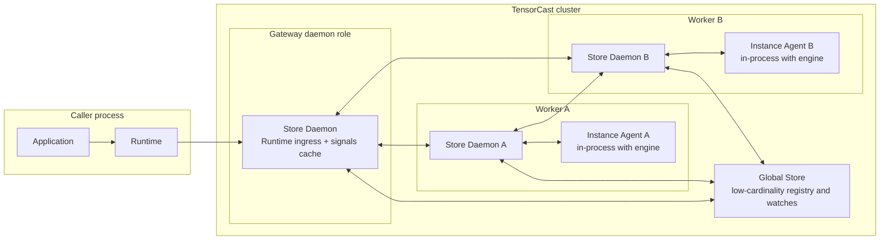

# Summary

`docs/designs/0055-programmable-framework.md` already defines the artifact-first programmable substrate:

- `CallContext`
- `Operation[T]`
- `Plan` and `PlanSpec`
- caller-local `PlanExecutor`
- the Instance Agent / Engine Adapter boundary

This design intentionally stays thinner than earlier `0056` drafts.
It owns only the framework layer above that substrate:

- one process runtime handle bound to one daemon endpoint,
- daemon ingress for the same `PlanSpec` semantics as the local runner,
- daemon-served low-cardinality signals and directory snapshots,
- and a framework-owned `ArtifactSetRef` contract for high-cardinality artifact sets.

The long-term convergence rule is:

- `0056` is the programmable front door,
- not a second semantic owner beside `0087`, `0093`, `0094`, `0096`, `0100`, or `0102`,
- and not a second instance-hosting or continuation system beside today's NodeAgent and `Operation[T]` families.

Current repo reality already supports that direction:

- `PlanSpec` is the canonical orchestration IR,
- canonical instance actions already exist in `plan.proto` and `node_agent.proto`,
- NodeAgent already exposes `ExecutePlan`,
- and `SelectionIdentity` already exists as the canonical per-item identity.

Current implementation posture is narrower than the full long-term shape:

- the first real daemon ingress slice is only worker-targeted plus `terminal_only`,
- NodeAgent remains the only dependency-ready instance-scoped execution host,
- the exact daemon-served directory and `NodeAgentDirectory` contract is now
  factored into `0106`,
- and inter-daemon control-plane dispatch is still follow-on work rather than
  ready substrate.

The remaining problem is therefore front-door convergence, not invention of another execution substrate.

`0056` does not own:

- artifact value semantics, `ArtifactSelection`, or `byte_artifact` profile rules,
- routed truth, backing truth, lifecycle truth, workflow truth, or public continuation algebra,
- engine-local request inspection, target-capability minting, or engine-private aliases,
- or any profile-specific or business-specific high-cardinality set semantics.

The key long-term rule is:

- the value unit remains `Artifact`,
- the scalable control unit for high cardinality becomes a neutral set reference,
- and engine or application aliases stay outside framework core.

That split keeps the repository converged around:

- one artifact object model,
- one truth and lifecycle layering,
- one shared dataplane,
- one distributed public continuation model,
- and zero business-specific control dialects in the framework core.

# Problem Statement

External applications increasingly need to:

- connect to exactly one TensorCast endpoint because of network policy,
- execute plans across many daemons and instances,
- observe low-cardinality cluster signals with bounded staleness,
- and orchestrate high-cardinality artifact sets without direct coupling to Global Store or engine-private RPCs.

The wrong way to solve that problem is to turn the framework into:

- an engine-specific API surface that hard-codes KV or LLM nouns into the core,
- a second distributed continuation protocol beside `0096` and `0100`,
- a second instance-hosting model beside the existing NodeAgent or Instance Agent boundary,
- a control plane that expands every high-cardinality set into caller-enumerated item lists on the hot path,
- or a design that pushes high-cardinality per-item truth back into Global Store.

`0056` exists to solve the entrypoint and orchestration transport problem without breaking the deeper repository
invariants from `0055`, `0087`, `0090`, `0093`, `0094`, `0096`, `0100`, and `0102`.

# Ownership Boundary

The long-term ownership split is:

| Concern | Owning design |
| --- | --- |
| `Runtime`, `connect(...)`, daemon ingress, daemon-served signals | `0056` |
| artifact-first `PlanSpec`, local runner semantics, `Operation[T]` | `0055` |
| front-door convergence over the existing `PlanSpec -> daemon/node-agent` execution spine | `0056` |
| selection contract and artifact value model | `0078` and `0087` |
| generic set digest, `ArtifactSetRef`, and worker batch orchestration over normalized selection identities | `0056` |
| routed existence and visibility truth | `0090` |
| backing truth and `ResolvedSourceCapability` | `0093` |
| lifecycle capability mint and redeem semantics | `0094` |
| workflow replay, currentness, fencing, wait, and status semantics | `0096` |
| distributed request or reply algebra and public continuation | `0100` |
| engine manifest production, engine request context, domain aliases, and engine projection bridge into `ArtifactSetRef` | `0102` |

Normative rules:

1. `0056` may route to or compose with deeper layers, but it must not redefine them.
2. Any byte-moving distributed success path still converges on `ResolvedSourceCapability` and shared lowering.
3. `0056` may own `ArtifactSetRef` and generic set orchestration, but it must not own profile-specific set semantics or
   engine request inspection.
4. `ManifestResult` is the current concrete engine-side high-cardinality result carrier today; `0102` owns the mapping
   between engine manifest production and `0056` `ArtifactSetRef` orchestration.

# Layering Contract

The repository needs one explicit stack for programmable execution:

| Layer | Canonical object | Owner |
| --- | --- | --- |
| value and truth | `Artifact`, `ArtifactSelection`, `ResolvedSourceCapability` | `0055`, `0078`, `0087`, `0090`, `0093` |
| set reference | `ArtifactSetRef` over normalized selection identities | `0056` |
| orchestration IR | `PlanSpec` and canonical action vocabulary | `0055` plus `0056` |
| runtime and ingress | `Runtime`, daemon ingress, daemon-served signals | `0056` |
| engine integration | engine manifest production, aliases, target capability helpers, engine projection bridge | `0102` |

This layer split is the core consistency rule for long-term evolution:

- values stay artifact-first,
- high-cardinality control becomes set-first,
- runtime stays a thin transport and orchestration layer,
- and integrations remain the place where engine-private concepts are translated into canonical framework actions.

## Front-door convergence

Repository rule:

- all programmable entrypoints must lower into one execution spine,
- and that spine must reuse the canonical `PlanSpec` plus canonical action vocabulary already present in the repo.

The intended spine is:

```text
Runtime / tensorcast.plan / gateway ingress
  -> PlanSpec
  -> worker execution on Store Daemons
  -> instance execution on NodeAgent / Instance Agent
  -> deeper owner layers for truth, lifecycle, workflow, and continuation
```

Normative rules:

1. gateway ingress is a front-door adapter over this spine, not a second plan semantic owner,
2. NodeAgent or the in-process Instance Agent boundary remains the unique instance-scoped execution host in this phase,
3. `0056` may add transport envelopes around `PlanSpec`, but it must not fork the action vocabulary or execution model,
4. if a future convenience helper bootstraps local instance hosting, it must preserve the same NodeAgent-owned config,
   registration, and execution semantics rather than creating a second host model.

# Extension Placement Rules

When adding a new scenario, the first question is not "how do we make `0056` support it?"
The first question is "which repository layer actually owns the new concern?"

## Decision table

| New concern | Owning design layer |
| --- | --- |
| new caller entrypoint, runtime handle, daemon ingress, signals, generic runtime routing | `0056` |
| new generic set digest, set ref, or worker batch orchestration over normalized selection identities | `0056` |
| new artifact value model, selection shape, artifact profile, or write mode | `0078` and `0087` |
| new routed existence or visibility truth rule | `0090` |
| new backing truth or source-capability bridge rule | `0093` |
| new lifecycle mint, redeem, or protection rule | `0094` |
| new workflow replay, attach, wait, or status rule | `0096` |
| new distributed continuation or public attach rule | `0100` |
| new engine-specific manifest production, request-context rule, alias helper, or target helper | `0102` |
| new cluster-wide config invariant or operator-facing knob | `0004` |

## Practical rules

1. If a scenario can be expressed with canonical instance actions `manifest/publish/hydrate/evict_local`, it should not
   add a new framework instance action family.
2. If a proposed API name contains `kvcache`, `weights`, `checkpoint`, `radix`, or an engine name, it is presumed to be
   outside `0056`.
3. If the real scaling problem is high cardinality, the primary control abstraction should be a neutral set reference,
   not a larger caller-enumerated item list.
4. If the scenario requires attach, replay, wait, cancel, or status beyond a single request lifetime, it belongs to
   `0096` and `0100`, not to a plan-private sub-protocol inside `0056`.
5. Global Store may hold only low-cardinality routing and registration data for `0056`; it must not become a
   high-cardinality per-item or per-set hot path.

## Review gate

Every future extension proposed against `0056` should answer these questions explicitly:

1. Is the new concept generic across artifact domains, or is it engine-specific?
2. Is the control unit an item or a set, and why?
3. Does the change affect transport or orchestration only, or does it change truth, lifecycle, workflow, or public
   continuation semantics?
4. If `0056` grows because of this change, what deeper layer is it intentionally not redefining?

If those answers are unclear, the change should not land in `0056` yet.

# Goals / Non-Goals

Goals

- Support external applications that can reach only one Store Daemon endpoint.
- Keep the Python SDK a lightweight boundary: callers connect to one daemon and do not call Global Store directly.
- Preserve one `PlanSpec` execution semantics across caller-local execution and daemon ingress execution.
- Provide daemon-served `TensorCastSignals` with explicit staleness metadata.
- Model scalable high-cardinality orchestration through `ArtifactSetRef` and order-insensitive set digests.
- Keep canonical instance orchestration aligned around `manifest/publish/hydrate/evict_local`.
- Keep target-capability minting and resolution at the instance-bound engine adapter boundary.
- Allow `prefetch_many` as convenience only when it lowers to the same generic set abstraction.

Non-Goals

- Define shard-home routing, byte-artifact leases, or `HomeBatch*` RPC semantics.
- Define capability minting, redemption, issuer handoff, or lifecycle truth.
- Define workflow replay, attach, or status semantics outside `0096` and `0100`.
- Introduce plan-private `attach`, `wait`, `cancel`, or `status` families for daemon ingress.
- Move engine request tables, target-capability minting, or request-context persistence into framework core.
- Require truly high-cardinality callers to enumerate all items inline on the hot path.
- Replace TensorCast's existing dataplane or introduce a second distributed execution substrate.
- Derive canonical framework set identity directly from engine-local result carriers such as `ManifestResult` without an
  explicit bridge owned by `0102`.

# Architecture

## Runtime topology



Key rule:

- moving the entrypoint into a daemon is a relocation of orchestration transport, not a new semantic layer.

## Component responsibilities

- **Runtime**
  - process-local handle bound to one daemon address,
  - exposes `store()`, `signals()`, and `plan(ctx)`,
  - lowers programmable requests onto the canonical execution spine.
- **Store Daemon**
  - executes worker-scoped actions,
  - accepts optional ingress `ExecutePlan`,
  - caches low-cardinality directory and signals state from watches,
  - routes instance actions to the target daemon and local NodeAgent or Instance Agent boundary.
- **NodeAgent / Instance Agent**
  - the unique instance-scoped execution boundary in this phase,
  - hosts engine adapters safely,
  - is not exposed directly to caller networks.
- **Global Store**
  - low-cardinality worker and instance registry,
  - watch streams and other slow-path metadata inputs required by daemon caches,
  - not a per-request caller dependency.
- **Artifact set reference**
  - names an order-insensitive set of normalized selection identities for orchestration,
  - is a control-plane reference only,
  - does not replace `Artifact` or `ArtifactSelection` as the value layer.

# Runtime Model

## Public API

```python
class Runtime:
    daemon_address: str
    daemon_id: str

    def store(self) -> "Store": ...
    def directory(self) -> "TensorCastDirectory": ...
    def signals(self) -> "TensorCastSignals": ...
    def plan(self, ctx: "CallContext") -> "Plan": ...
    def close(self) -> None: ...

def connect(*, daemon_address: str) -> Runtime: ...
def runtime() -> Runtime: ...
```

Semantics:

- `connect(...)` creates one lightweight runtime handle bound to one daemon endpoint.
- `runtime().plan(ctx)` is the primary programmable entrypoint when an active runtime exists.
- `tensorcast.plan(ctx)` should delegate to the active runtime when present and otherwise preserve `0055` local-run
  behavior for tests and in-cluster debugging.
- `tensorcast.init(mode="create")` remains local tooling and daemon lifecycle convenience; it is not a second control
  plane.
- runtime configuration remains under the unified config model from `0004`; `0056` must not introduce ad hoc runtime
  flags or environment-variable control paths.

## Instance hosting boundary

Current phase rule:

- `0056` does not standardize a second public instance-hosting API.
- instance-scoped execution remains hosted by NodeAgent or the in-process Instance Agent boundary configured through the
  existing process model from `0004`.
- if a future convenience helper is added at the runtime layer, it must be a bootstrap adapter for that same host model,
  not a new execution boundary.

Normative rules:

1. the NodeAgent or Instance Agent boundary remains the unique instance-scoped execution host in this phase,
2. callers never address instance hosts directly,
3. stable caller-facing instance identity remains `instance_id`, while the
   dependency-ready execution directory resolves `instance_id -> execution
   route facts` through the daemon-served bounded-staleness contract frozen in
   `0106`,
4. `TargetSpec` minting and resolution remain engine-adapter responsibilities outside `0056`; framework code may carry
   `TargetSpec`, but it does not own target-capability mint semantics,
5. `0056` must not introduce a second config surface, registration flow, or heartbeat contract for instance hosting.

# Plan Execution

## One execution semantics

Current baseline from `0055`:

- `Plan.run()` executes in the caller process,
- worker steps execute against Store Daemons,
- instance steps execute through the Instance Agent boundary.

Planned extension from `0056`:

- `StoreDaemonService.ExecutePlan(ExecutePlanRequest)` may execute the same `PlanSpec` through a daemon ingress role,
- a future non-local dispatcher may execute plan fragments on peer daemons, but
  that dispatch substrate is not dependency-ready in the current repo,
- instance steps still resolve to `target daemon -> local NodeAgent or Instance Agent`.

Normative rules:

1. gateway ingress is a daemon role, not a new service kind,
2. `ExecutePlan` must not introduce a second retry or idempotency model,
3. `ExecutePlan` may return an inline terminal result only when the declared ingress class is `terminal_only` and every
   step is dependency-ready for terminal projection under that class,
4. if execution may outlive the RPC budget, must continue after caller disconnect, or requires later attach, wait,
   replay, or status, the public continuation must be `Operation[PlanResult]` or another explicit family surface owned
   by `0096` and `0100`,
5. ingress must not hide asynchronous continuation behind request-scoped success while privately continuing work after
   the caller-visible request has ended,
6. `0056` must not invent `PlanHandle`, `AttachPlan`, `GetPlanStatus`, or another plan-private continuation family,
7. plan targets are stable identities (`daemon_id`, `instance_id`), not caller-supplied addresses.

## Execution spine readiness split

`0056` must separate long-term shape from dependency-ready closure.

| Execution concern | Current repo state | Dependency readiness |
| --- | --- | --- |
| local worker plan execution through caller-local `Plan.run()` | landed | ready |
| daemon ingress for worker-targeted `terminal_only` plans on the ingress daemon | landed | ready |
| direct NodeAgent instance execution (`NodeAgent.ExecutePlan`) | landed | ready |
| local runner closing instance steps through NodeAgent discovery and client routing | not landed | not ready |
| daemon-local bridge from ingress daemon to local NodeAgent or in-process Instance Agent | not landed | not ready |
| daemon-served full worker or instance directory and `NodeAgentDirectory` contract | partially specified today; exact contract moved to `0106` | not ready |
| inter-daemon control-plane plan dispatch | transport helpers exist only for data-plane paths today | not ready |

Repository rule:

- child designs may depend only on rows marked ready above,
- they must not treat declared future topology as already available substrate,
- and `0056` itself must document each phase boundary explicitly rather than
  hiding it inside prose about the end state.

## Next implementation slice: local-only terminal ingress

The next dependency-ready daemon-execution closeout is intentionally narrower than
the long-term topology above.

Initial ingress execution scope:

- declared execution class must be `terminal_only`,
- worker-scoped execution may target the ingress daemon only,
- instance-scoped execution may target only instances hosted behind the ingress
  daemon's own local NodeAgent or in-process Instance Agent boundary,
- cluster-scoped transport remains reserved in the IR but is not executable in
  this slice,
- and cross-daemon plan-fragment dispatch remains a follow-up after the local
  bridge is stable.

Required bridge rule:

- the daemon must use one daemon-local typed bridge to the existing
  instance-scoped execution host,
- that bridge is configuration-owned under `0004`,
- and it must not be inferred from caller-supplied addresses or hidden ambient
  process discovery.

Normative rules:

1. the first daemon-side `ExecutePlan` implementation should fail closed on
   `public_continuation_required`,
2. the first daemon-side `ExecutePlan` implementation should fail closed on
   worker targets that do not resolve to the ingress daemon,
3. the first daemon-side `ExecutePlan` implementation should fail closed on
   instance targets that do not resolve to a daemon-local instance execution
   host,
4. the first daemon-side `ExecutePlan` implementation should fail closed on
   `TARGET_TYPE_CLUSTER` rather than smuggling workflow semantics through
   gateway-private handling,
5. local-only ingress is a phase boundary, not a second semantic contract; it
   still reuses the same `PlanSpec`, `ArtifactSetRef`, governance transport, and
   admission-class rules.

## Ingress admission classifier

The ingress role needs one framework-owned classifier before any side-effecting execution starts.

Recommended admission classes:

- `terminal_only`
- `public_continuation_required`

`terminal_only` means:

- every step in the submitted plan is dependency-ready for terminal public projection under the declared ingress
  surface,
- no non-terminal public continuation is required after the request ends,
- and the gateway can either complete the work inline or return a terminal result within the same declared request
  class.

`public_continuation_required` means:

- at least one step may require a non-terminal public continuation surface after request end,
- or the requested ingress class explicitly allows non-terminal continuation that the current public request envelope does
  not yet carry,
- or the deeper owning layer marks the requested path as not dependency-ready for terminal-only ingress.

Normative rules:

1. ingress must classify a submitted plan before dispatching any side-effecting work.
2. classification must depend only on declared action semantics, stable plan structure, and dependency readiness exposed
   by the owning layers; it must not depend on load heuristics or predicted wall-clock completion.
3. plans classified as `public_continuation_required` must fail fast until the public continuation family from `0096`
   and `0100` is explicitly carried by the ingress surface.
4. request deadlines may cause terminal failure, but they must not silently change a plan from one admission class to
   the other.
5. ingress must not partially execute a plan, discover that it exceeded the terminal-only class, and then continue
   behind caller-visible success or request-scoped failure.
6. the admission classifier is framework-owned transport policy; it must not redefine workflow or continuation
   semantics owned elsewhere.

## Deterministic fingerprints

Daemon-run execution must be gateway-independent and safe under at-least-once retries.

Required step fingerprint inputs:

- canonical action name,
- stable target identity,
- either item identity or set identity,
- semantic placement,
- action-specific stable arguments.

Required item identity:

- `(artifact_id, logical_layout_hash, selection_hash)` from `0055` and `0078`.

Required set identity:

- `set_digest_hex` over sorted and deduplicated item identities.

Required canonicalization rules:

- set digests must use sorted and deduplicated item identities before hashing,
- byte-artifact items must still include `artifact_id` because their profile hashes are fixed constants,
- execution windows or partitions may add stable chunk identifiers for progress accounting, but they must not redefine
  the underlying set identity,
- `depends_on` lists must be encoded in canonical order,
- deadline, qos, tags, and other observation metadata must not affect semantic step identity.

## Canonical instance actions

Framework-level canonical instance action vocabulary remains:

- `manifest`
- `publish`
- `hydrate`
- `evict_local`

Rules:

1. the canonical names above are the normative instance orchestration vocabulary,
2. existing `transform_into` and `transform_register` surfaces from `0055` remain valid implementation surfaces and
   compatibility helpers, but `0056` does not expand them into a second repository-wide integration vocabulary,
3. `mint_target` belongs to the engine-adapter capability boundary, not to required framework plan action vocabulary,
4. `materialize_into` remains a possible follow-up audit surface, but it is not part of required `0056` canonical
   instance vocabulary in this phase,
5. integration-specific aliases are outside framework core and are owned by `0102`.

# Governance Context Propagation

`0056` does not own lane or coordination-policy semantics, but it does own their transport, auditability, and stable
retry boundary.

Minimum governance context carried through `Runtime`, `PlanSpec`, and daemon ingress:

- `lane`
- `policy_version`
- `staleness_budget`
- any other low-cardinality coordination hints required by the owning governance layer

Normative rules:

1. the semantic definition of lane and policy remains outside `0056`,
2. `0056` owns end-to-end propagation of those values across runtime, ingress, daemon dispatch, and non-plan control
   RPC boundaries,
3. the same idempotency domain must not silently change lane or policy identity during retries,
4. governance metadata is auditable and transport-visible, but it must not alter canonical item identity, set identity,
   or plan step identity unless a deeper owning layer explicitly defines that behavior.

## Governance wire form

Propagation needs one canonical wire contract, not only free-form tags.

Recommended transport shape:

- a typed governance sub-object in `PlanSpec` for plan execution,
- and canonical metadata keys for non-plan control RPCs until equivalent typed request fields exist.

Minimum governance fields:

- `lane`
- `policy_version`
- `staleness_budget`

Normative rules:

1. `tags` alone are too weak as the long-term canonical wire contract for governance context.
2. `0056` should define one typed governance transport shape for plan execution, even if non-plan RPCs temporarily use
   metadata-based propagation.
3. non-plan propagation must use one canonical metadata vocabulary across SDK, gateway daemon, and worker daemon
   rather than per-call ad hoc keys.
4. governance metadata is audit-visible and retry-stable, but it must not silently alter item identity, set identity,
   or deterministic step identity unless a deeper owning layer explicitly requires that behavior.

# High-Cardinality Set Model

High-cardinality orchestration needs a generic control abstraction that scales.
That abstraction is not "many `Artifact` arguments".
It is a neutral set reference over normalized selection identities.

## Value unit and control unit

Long-term repository rule:

- `Artifact` remains the value unit,
- `ArtifactSelection` remains the item selector contract,
- and high-cardinality orchestration uses a neutral set reference as the control unit.

The set reference is not a second data object model.
It is a control-plane handle to an order-insensitive set of normalized item identities derived from
`ArtifactSelection`.

## Item identity

The normative item identity for generic set orchestration is `SelectionIdentity` from `0055`:

```python
@dataclass(frozen=True, slots=True)
class SelectionIdentity:
    artifact_id: str
    logical_layout_hash: bytes
    selection_hash: bytes
```

Normative rules:

1. generic set orchestration must not collapse item identity to `artifact_id` alone,
2. `ArtifactSelection` is the caller-facing selector input, but normalized `SelectionIdentity` is the canonical item
   identity used by set digests, results, and stable retries,
3. convenience fields such as `artifact_id` may appear in results, but they must not be the only returned identity,
4. if proto or RPC surfaces need a dedicated wire message for set items, it must be a field-for-field projection of
   `SelectionIdentity`, not a second semantic type.

## `ArtifactSetRef` contract

```python
@dataclass(frozen=True, slots=True)
class ArtifactSetRef:
    set_digest_hex: str
    item_count: int
    carrier_form: str
    inline_items: Sequence["ArtifactSelection"] | None = None
    manifest_selection: "ArtifactSelection" | None = None
```

Normative rules:

1. `ArtifactSetRef` is the only framework-owned generic set contract in this phase.
2. exactly one carrier form is active for a given `ArtifactSetRef`.
3. `carrier_form` is a typed discriminator whose dependency-ready values are `inline` and `manifest_backed`.
4. `set_digest_hex` identifies the semantic set, not any transport chunking, batch partitioning, or execution window.
5. `item_count` is the exact cardinality of the deduplicated canonical item set represented by the ref.
6. `ArtifactSetRef` is a control-plane reference only and does not replace per-item artifact identity.
7. `0056` owns the `ArtifactSetRef` contract itself:
    - field semantics,
    - transport shape,
    - set-digest identity rules,
    - and fail-closed resolution rules.
8. `0056` does not own engine manifest production or engine-local projection logic; those remain in `0102`.

## `ArtifactSetRef` digest and cardinality

Set identity is rooted in canonical per-item identity, not transport-local enumeration.

Normative rules:

1. `set_digest_hex` must be computed over the deduplicated, order-insensitive set of normalized `SelectionIdentity`
   values represented by the ref.
2. `item_count` must equal the number of canonical `SelectionIdentity` values that participate in
   `set_digest_hex`.
3. inline item ordering, manifest serialization ordering, and worker chunking are not part of set identity.
4. `artifact_id` alone is never sufficient to define framework set identity.
5. if two refs advertise the same `set_digest_hex` and `item_count`, they are claiming the same canonical item set and
   must resolve accordingly or fail closed.

## `ArtifactSetRef` carrier forms

The first dependency-ready carrier forms are intentionally narrow.

### Inline carrier

- `carrier_form="inline"`
- `inline_items` is populated
- `manifest_selection` is unset

Rules:

1. inline sets are for small caller-enumerated inputs only.
2. inline transport must preserve the exact caller-selected `ArtifactSelection` values used to derive the canonical
   `SelectionIdentity` set.
3. `prefetch_many`, if exposed, lowers only to this form.

### Manifest-backed carrier

- `carrier_form="manifest_backed"`
- `manifest_selection` is populated
- `inline_items` is unset

Rules:

1. manifest-backed is the first dependency-ready referenced form for truly high-cardinality sets.
2. `manifest_selection` identifies an artifact-backed manifest whose owning layer defines schema, owner, expiry or
   currentness, and resolution authority.
3. `0056` does not define manifest content schema or engine-local annotations.
4. more opaque referenced forms remain follow-up work until their owner and resolution contract are dependency-ready.
5. Global Store must not become a per-item or per-set hot truth table for this abstraction.

## `ArtifactSetRef` resolution contract

Normative rules:

1. resolving either carrier form must deterministically yield the same deduplicated `SelectionIdentity` set claimed by
   `set_digest_hex` and `item_count`.
2. manifest-backed resolution must fail closed on unresolved manifest content, unsupported manifest schema, digest
   mismatch, or item-count mismatch.
3. runtime partitioning or worker chunking may happen below `ArtifactSetRef` without changing public set identity.
4. local runner and ingress must apply the same digest and resolution rules.
5. framework code must consume `ArtifactSetRef` as the set contract; it must not silently invent a second referenced
   form in one execution path only.

## Worker set orchestration surface

```python
@dataclass(frozen=True, slots=True)
class ArtifactSetItemResult:
    item_identity: "SelectionIdentity"
    artifact_id: str | None = None
    status: "OperationStatus"

@dataclass(frozen=True, slots=True)
class ArtifactSetResult:
    set_digest_hex: str
    outcomes: Sequence[ArtifactSetItemResult]

class WorkerStepBuilder:
    def prefetch_set(
        self,
        art_set: ArtifactSetRef,
        *,
        device: str | int,
        depends_on: Sequence[PlanStepRef[Any]] | None = None,
    ) -> PlanStepRef[ArtifactSetResult]: ...

    def prefetch_many(
        self,
        arts: Sequence["Artifact"],
        *,
        device: str | int,
        depends_on: Sequence[PlanStepRef[Any]] | None = None,
    ) -> PlanStepRef[ArtifactSetResult]: ...
```

Normative rules:

1. `prefetch_set` is the normative scalable worker-layer batch action,
2. `prefetch_set` takes `ArtifactSetRef` directly so proto, SDK, runtime, and design all speak the same framework set
   contract,
3. `prefetch_many`, if exposed, is SDK sugar that lowers to an inline `ArtifactSetRef`,
4. `prefetch_many` must be documented and implemented as non-scalable convenience rather than as the primary
   high-cardinality abstraction,
5. results are per-item and must preserve partial information,
6. profile-specific miss, visibility, or fencing rules are delegated to the owning profile and authority layers.
7. runtime partitioning or chunking may happen below the set ref without changing public set identity.

## Scope-aware readiness model

Readiness in programmable orchestration is scope-owned, not one flat repository-wide enum.

Worker-layer readiness:

- `local_replica_ready`
- `local_stable_ready`

Instance-layer realization:

- `instance_hydrated`

Cluster progression:

- activation barriers, rollout progress, or cluster-scoped ready sets are workflow-owned and remain outside `0056`.

Normative rules:

1. worker actions report worker-local readiness only,
2. instance actions report instance-local realization only,
3. `prefetch_set` must not be interpreted as a cluster publication barrier or an instance-hydration guarantee,
4. if a worker action needs to promise stronger worker-local readiness than `local_replica_ready`, that stronger
   readiness kind must be explicit in the action contract or owning placement policy rather than inferred from
   `device="dram"` alone.

## `prefetch_set` readiness floor

To keep ingress and local execution behavior aligned, `prefetch_set` needs one explicit minimum contract.

Phase intent:

- in this phase, `prefetch_set` should be treated as guaranteeing `local_replica_ready` only,
- and any stronger worker-local readiness must be introduced explicitly rather than inferred from placement aliases.

Normative rules:

1. `prefetch_set(device="dram")` must not, by default, be interpreted as `local_stable_ready`.
2. if future phases need worker-local stable admission as part of the action contract, they should add an explicit
   readiness selector or equivalent placement-contract field rather than overloading the existing `device` input.
3. gateway and local runner implementations must share the same readiness floor; one implementation must not upgrade
   `prefetch_set` to `local_stable_ready` while the other treats it as replica-only warmup.

Cross-design consequence:

- the follow-on stronger worker action is owned by `0104`, not by `0056`,
- and `0104` may add `realize_set` or an equivalent explicit worker-local
  readiness action while keeping `prefetch_set` unchanged.

## Engine manifest boundary

Current engine integrations already expose `ManifestResult`, but `0056` treats that as an integration-side carrier only.

Normative rules:

1. `0056` does not define the `ManifestResult -> ArtifactSetRef` bridge form.
2. `0056` runtime, ingress, gateway, and worker code must consume `ArtifactSetRef` or another explicit bridge output
   owned by `0102`.
3. `0056` must not derive canonical framework set identity directly from raw `ManifestResult`, `artifact_ids`,
   `key_set_digest_hex`, or `engine_request_id`.
4. any explicit bridge from engine manifests into `ArtifactSetRef` must be versioned and fail closed, but that bridge
   contract is owned by `0102`, not by `0056`.

## Cluster workflow extension seam

Some scenarios will need cluster-scoped artifact workflows such as distribute, activate, or retire.
`0056` does not own those workflow semantics.

What `0056` must provide is only:

- a transport slot for workflow-owned cluster actions,
- compatibility between runtime or ingress and the canonical `PlanSpec` execution substrate,
- and a guarantee that worker-set and instance actions do not exhaust the only available extension seam.

Normative rules:

1. cluster workflow truth, barriers, and continuation remain outside `0056`,
2. `0056` must not force future owners to encode cluster workflow semantics as ad hoc SDK DAG glue over
   `prefetch_set`,
3. reserving this extension seam does not grant `0056` ownership of cluster workflow state.

Cross-design consequence:

- `0104` is the first intended consumer of this reserved cluster seam for
  rollout orchestration,
- but `0104` must still keep rollout truth, barriers, and source-closeout
  semantics outside `0056`.

## Transport-slot reservation for future cluster actions

Preserving an extension seam in prose is not enough.
The framework should also reserve an execution slot so future cluster-workflow owners do not need to smuggle
cluster-scoped semantics through worker-only actions.

Recommended direction:

- reserve a distinct cluster-scoped target or action envelope in the plan IR,
- allow that envelope to carry an opaque workflow-owned reference,
- and keep all barrier, continuation, and workflow-truth semantics outside `0056`.

Normative rules:

1. `0056` should reserve an explicit cluster-scoped transport slot rather than relying on `prefetch_set` as the only
   future composition primitive.
2. that slot must carry only transport and dispatch structure:
   - stable target scope,
   - opaque workflow action reference,
   - deterministic fingerprint inputs.
3. that slot must not define:
   - workflow-owned state,
   - workflow barriers,
   - workflow replay or attach semantics,
   - or cluster truth.
4. if the plan IR cannot yet carry a cluster-scoped target or action envelope, the design must treat that as a known
   follow-up gap rather than as "already reserved by convention."

Cross-design consequence:

- `0104` may compile rollout kernels through this slot in a later phase,
- but the slot itself remains an execution seam only; it is not the owner of
  rollout barrier truth or `Operation[T]` semantics.

# Signals and Directory

Signals are daemon-served, low-cardinality, bounded-staleness control-loop inputs.

```python
@dataclass(frozen=True, slots=True)
class SignalSnapshot(Generic[T]):
    value: T
    as_of_ms: int
    staleness_ms: int
    cache_epoch: int | None = None
    freshness_state: str = "unknown"

@dataclass(frozen=True, slots=True)
class WorkerCapacitySnapshot:
    stable_total_bytes: int | None = None
    stable_used_bytes: int | None = None
    preemptible_total_bytes: int | None = None
    preemptible_marked_bytes: int | None = None
    control_plane_inflight: int | None = None

class TensorCastDirectory:
    def list_workers(...) -> DirectorySnapshot[list[WorkerRoute]]: ...
    def list_instances(...) -> DirectorySnapshot[list[InstanceExecutionRoute]]: ...
    def resolve_instance_execution(...) -> DirectorySnapshot[InstanceExecutionRoute]: ...

class TensorCastSignals:
    def get_worker_status(...) -> SignalSnapshot[WorkerStatus]: ...
    def get_worker_capacity(...) -> SignalSnapshot[WorkerCapacitySnapshot]: ...
```

Normative rules:

1. external callers query directory and signals through the connected daemon,
   not Global Store,
2. directory and signals data must come from daemon caches backed by watches or
   equivalent bounded-staleness inputs,
3. low-cardinality worker capability bits and routing hints are part of the
   directory surface, not a new truth layer,
4. worker capacity and memory-tier snapshots are advisory only, bounded-staleness, and must not be treated as
   reservation or truth guarantees,
5. public directory and signal snapshots must expose enough freshness evidence
   to distinguish bounded-current from degraded or stale answers,
6. adapter-owned execution signals are advisory only and must not replace TensorCast truth or lifecycle state,
7. `0056` owns the rule that programmable callers consume daemon-served
   directory surfaces, while `0106` owns the exact worker and instance
   route-directory contract plus the migration off SDK-direct GS reads.
8. `Runtime.directory()` is the long-term home of route discovery; placing
   `list_*` compatibility shims on `Runtime.signals()` is acceptable only as a
   migration step.

Read-model boundary:

- daemon-served directory and signals are bounded-staleness read models over
  lower truth layers,
- they are not a new membership or workflow truth layer,
- and exact SoT ownership for those questions remains frozen in `0106` and the
  deeper owner designs.

## Watch correctness contract

Bounded-staleness caches still need a correctness floor.

Minimum watch contract for daemon-served directory and signal caches:

- initial snapshot barrier,
- monotonic cache epoch or equivalent version,
- resume token or equivalent replay cursor,
- fail-closed behavior when freshness cannot be re-established within the configured budget.

Normative rules:

1. daemon caches must not treat "watch connected once" as sufficient proof of currentness.
2. every cache snapshot served through `TensorCastSignals` must be traceable to:
   - a completed initial snapshot,
   - a monotonic cache epoch or version,
   - and either a current watch stream or an explicit degraded or stale state.
3. `as_of_ms`, `staleness_ms`, and bounded-current vs degraded or stale state are part of the public framework
   contract; replay cursors such as resume tokens remain implementation detail unless and until a stronger public cache
   protocol is required.
4. if watch continuity is lost and freshness cannot be restored within the configured staleness budget, routing and
   directory decisions that require bounded-current evidence must fail closed rather than continue on silent stale
   guesses.

# Configuration and Discovery

All cluster-wide framework invariants introduced by `0056` must be typed config from `0004`, including:

- gateway ingress enablement,
- daemon-local instance-host bridge configuration needed for `ExecutePlan`
  closeout,
- watch and cache staleness budgets,
- worker and instance registry discovery behavior,
- role and capability advertisement needed for low-cardinality routing,
- governance-context propagation and audit requirements,
- and any cluster-visible inline-set limits or set-reference fanout policies.

Rules:

1. `0056` must not introduce ad hoc environment variables or hidden flag precedence,
2. rolling incompatible control-plane values must have an explicit cutover strategy; mixed semantics are not acceptable,
3. high-cardinality set transport must not rely on hidden size heuristics that silently change semantics between nodes.

# Proto and Schema Changes

Framework-owned additive changes:

- `proto/tensorcast/daemon/v2/store_daemon.proto`
  - `ExecutePlan(ExecutePlanRequest)` ingress for terminal-only execution with an explicit request envelope,
  - that envelope should carry the submitted `PlanSpec` plus the declared public execution class,
  - daemon-served worker and instance listing or signal RPCs,
  - no hidden daemon-private continuation protocol beyond the `0096` and `0100` owned family.
- `proto/tensorcast/plan/v1/plan.proto`
  - keep canonical instance actions `manifest/publish/hydrate/evict_local`,
  - add a typed governance sub-object for plan execution rather than relying on free-form `tags` alone,
  - add `ArtifactSetRef` as the framework-owned set wire contract with:
    - `set_digest_hex`,
    - `item_count`,
    - `carrier_form`,
    - `inline_items`,
    - and `manifest_selection`,
  - add worker `PrefetchSetAction` over `ArtifactSetRef`,
  - if a dedicated wire carrier for canonical set items is needed, make it a field-for-field projection of
    `SelectionIdentity`,
  - reserve an explicit cluster-scoped transport slot if cluster-workflow owners need one, while keeping workflow
    semantics outside `0056`,
  - do not require `MintTargetAction` in framework core,
  - do not add plan-private continuation carriers.
- `proto/tensorcast/node_agent/v1/node_agent.proto`
  - generic instance action execution only,
  - canonical instance actions stay aligned with `manifest/publish/hydrate/evict_local`.
- `proto/tensorcast/global_store/v1/global_store.proto` and `schema.sql`
  - only low-cardinality worker and instance routing attributes, capability bits, and watch support needed by daemon
    caches,
  - no per-item high-cardinality truth tables and no per-set membership hot path for framework orchestration.

Out of scope for `0056`:

- shard-home lease schemas,
- `HomeBatch*` authority RPCs,
- lifecycle, issuer-handoff, or workflow continuation state,
- engine manifest tables or engine request-context persistence.

# Naming Compliance

The interfaces introduced or retained by this design follow repository naming rules.

Classes and structs use `PascalCase`:

- `Runtime`
- `TensorCastSignals`
- `SignalSnapshot`
- `SelectionIdentity`
- `ArtifactSetRef`
- `ArtifactSetResult`
- `ArtifactSetItemResult`
- `WorkerStatus`
- `WorkerCapacitySnapshot`

Functions and methods use `snake_case`:

- `connect`
- `runtime`
- `list_workers`
- `get_worker_status`
- `list_instances`
- `prefetch_set`
- `prefetch_many`

Constants and enum values use `ALL_CAPS`:

- `HOST_DRAM`
- `GPU_VRAM`

# Schema Changes

This framework rewrite does not introduce a new persistent schema family of its own.

If durable set references are needed, they must be expressed either as artifact-backed manifests or as authority-owned
opaque refs in the owning layer.
They must not be introduced as new Global Store per-item or per-set hot tables inside `0056`.

# Trade-offs and Risks

- Keeping the framework thin makes some domain integrations less ergonomic unless they provide helper aliases.
- Generic set references add an indirection layer, but that indirection is required to scale beyond caller-enumerated
  lists.
- Immediate-only daemon ingress is less feature-rich than a full long-lived continuation model, but it avoids creating
  a second public protocol before `0096` and `0100` are complete.
- Signals can be overused as truth if staleness and authority boundaries are not kept explicit.
- Referenced set implementations can drift into engine-private semantics unless `0102` ownership is enforced
  consistently.

# Compatibility and Acceptance Criteria

- `connect(...)` is the primary process entrypoint for advanced control-plane use.
- `Plan.run()` in local and daemon-ingress modes uses the same canonical action names and the same deterministic
  fingerprint rules.
- `0056` owns only runtime, ingress, signals, and the `ArtifactSetRef` contract.
- canonical instance orchestration remains aligned around `manifest/publish/hydrate/evict_local`.
- external callers can operate through one daemon endpoint and do not call Global Store directly.
- NodeAgent or the existing Instance Agent boundary remains the unique instance-scoped execution host in this phase.
- item and set identity are rooted in normalized `SelectionIdentity`, not `artifact_id` alone.
- no plan-private attach, wait, replay, or status family is introduced by `0056`.
- any execution that outlives the request lifetime uses a public continuation owned by `0096` and `0100`.
- ingress admission is based on declared public execution class and dependency readiness, not runtime completion
  heuristics.
- high-cardinality framework orchestration does not require Global Store per-item hot truth.
- referenced set carriers fail closed if their resolved item set does not match the advertised digest and count.
- proto, SDK, runtime, and design all express the same framework-owned `ArtifactSetRef` contract rather than vague
  set-carrier wording.
- worker and instance readiness remain scope-owned rather than flattened into one repository-wide readiness enum.
- `prefetch_many`, if exposed, is explicitly a convenience helper over the `ArtifactSetRef` contract rather than the
  primary scalable abstraction.
- `ManifestResult` remains an integration-side carrier only, while any bridge into framework set orchestration is owned
  by `0102`.
