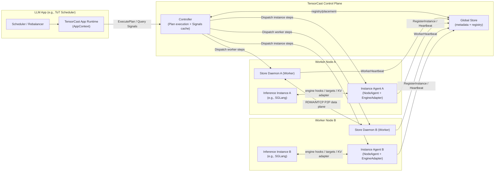

# Summary

`docs/designs/0055-programmable-framework.md` defines and implements the core **artifact-first programmable primitives**
(`CallContext`, `Operation[T]`, `Plan`, Node Agent + Engine Adapter execution boundary).

This design (`0056`) specifies **planned** extensions required by external applications (especially LLM apps) that want
to **actively manage runtime tensors** as part of application logic (e.g., request routing/rebalancing/migration in a
ToT scheduler):

- a cluster-level **Controller execution layer** for `Plan.run()` (DAG scheduling + step dispatch),
- a long-lived **TensorCast App runtime** in the application process (connects to Controller + Global Store),
- a node-local **Instance Agent** that lives with an inference engine process and exposes engine adapters safely,
- a concrete **Signals API** (`TensorCastSignals` and `ExecutionSignals`) for control loops,
- and an engine-agnostic **KV-cache orchestration contract** compatible with SGLang HiCache/Mooncake: deterministic
  **prefix-hash keys → opaque KV blobs**, with page-level fragmentation and batch-first IO.

This design intentionally keeps TensorCast core **KV-semantics-free**: TensorCast stores/moves blobs; inference engines
remain the source of truth for request→token→KV-key mapping.

---

# Goals / Non‑Goals

Goals

- Support **external apps** (e.g., ToT schedulers) calling TensorCast APIs and executing plans cluster‑wide via a
  Controller execution layer.
- Define an **AppContext** runtime (connect-mode driver; agent-mode instance registration) that makes signals + plan
  execution usable from application code.
- Define a node‑local **Instance Agent** model (engine adapter boundary) so instance steps can safely touch engine
  internals without exposing PID/IPC handles to a central controller.
- Define a cacheable **Signals** surface (`TensorCastSignals`, `ExecutionSignals`) with explicit staleness semantics for
  control loops.
- Define an engine‑agnostic **KV cache orchestration contract** compatible with SGLang HiCache/Mooncake:
  deterministic prefix‑hash keys → opaque, page‑fragmented KV blobs, with batch‑first IO and correctness invariants
  (immutability, TTL monotonicity, no overwrite).

Non‑Goals

- A Ray‑like distributed Python runtime (plans dispatch fixed actions, not arbitrary code).
- Full durability semantics for KV cache (KV blobs are a cache; correctness must not depend on backend retention).
- A global reference counting system for KV blob eviction (start with TTL/LRU + best‑effort delete semantics).
- Baking token→KV mapping semantics into TensorCast core (engines remain the source of truth; TensorCast stores/moves
  blobs).
- Replacing TensorCast’s existing data plane; this design only adds control‑plane services and step types on top of 0055.

---

# Architecture

## Runtime Topology (Planned)



## Component Responsibilities

- **Store Daemon / Worker** (existing): owns TensorCast data plane (replicas, tiers, P2P copies, placement pins).
- **Global Store** (existing): durable coordination + registries (workers, instances) and persistence metadata.
- **Instance Agent** (planned): node-local service that lives with an inference engine process (in-process or sidecar):
  - implements `NodeAgentService` for instance-scoped plan steps,
  - hosts engine adapters (TargetSpec mint/resolve, transforms, KV cache adapter),
  - registers a stable `Instance` into Global Store for routing.
- **Controller** (planned): cluster-level execution layer:
  - accepts `PlanSpec`, schedules DAG, dispatches steps to Store Daemons and Instance Agents,
  - provides a cached `TensorCastSignals` surface (bounded staleness; avoids per-call Global Store queries),
  - aggregates per-step results into a `PlanResult`.
- **AppContext** (planned): application-facing runtime that connects external apps to Controller + Global Store.

Remote-safety rules (unchanged from 0055; reiterated):

- Any action requiring PID/IPC/region references MUST run via the Engine Adapter on the target instance.
- Controllers must not directly call PID/IPC-binding RPCs; they dispatch instance-scoped steps to Node Agents.
- Daemon-owned cache-warm actions that must be retry-safe and PID-independent run in `NO_LEASE`.

---

# Terminology: Worker vs Instance vs Instance Agent

These concepts exist to separate **storage/data-plane** from **engine execution/semantics**:

- **Worker**: a Store Daemon process registered in Global Store. Worker actions are storage-centric: prefetch, pin,
  replication, placement. Identity is stabilized by `daemon_id` (HA-safe).
- **Instance**: an inference engine process registered in Global Store (e.g., one SGLang serving process). Instance
  exists so plans can target **engine-local** actions (resolve targets, transforms, KV flush/prefetch, execution
  signals).
- **Instance Agent**: the node-local RPC surface (implements NodeAgent) that lives with the engine and owns an Engine
  Adapter. It enforces the process-context safety boundary.

Where does the Instance Agent live?

- It SHOULD be launched with the inference engine process (same lifecycle) so it can safely access engine internals.
- It MAY be a sidecar only if it still has safe access to the necessary engine context; otherwise it MUST be in-process.

---

# Planned Public API Additions

This section defines only the **new** surfaces required beyond 0055.

## AppContext / App Driver

`AppContext` is the application-facing runtime that connects an external app to the TensorCast control plane.

Minimal surface (names are normative, fields indicative):

```python
class AppDriverError(Exception): ...

class AppContext:
    app_id: str
    controller_address: str
    global_store_address: str

    def signals(self) -> "TensorCastSignals": ...
    def plan(self, ctx: "CallContext") -> "Plan": ...
    def close(self) -> None: ...

def connect_app(
    *,
    controller_address: str,
    global_store_address: str,
    app_id: str | None = None,
) -> AppContext: ...

class InstanceAgentError(Exception): ...

class InstanceAgentHandle:
    instance_id: str
    node_agent_endpoint: str

    def close(self) -> None: ...

def serve_instance_agent(
    *,
    controller_address: str,
    global_store_address: str,
    instance_id: str,
    daemon_id: str | None = None,
    engine: str,
    listen_address: str,
    engine_adapter: "EngineAdapter",
    labels: Mapping[str, str] | None = None,
) -> InstanceAgentHandle: ...

def app() -> AppContext: ...  # returns the active AppContext created by connect_app(...)
```

### Initialization UX (planned)

The 0055 `tensorcast.init(mode=...)` (data plane) and a hypothetical 0056 `init_app(mode=...)` (control plane) are easy
to confuse if both are expressed as `init(...)` + mode strings.

This design therefore recommends a **role-specific, verb-first public API**, and treats any `init_app(mode=...)` shape
as an internal/legacy alias (if it exists at all). The goal is for call sites to be self-describing in LLM app code
(e.g., ToT routing/rebalancing) where both planes may be present.

- Data plane (Store Daemon client/session; existing, 0055):
  - `tensorcast.connect_store(...)` is an alias for `tensorcast.init(mode="connect", ...)`.
  - `tensorcast.launch_local_store(...)` is an alias for `tensorcast.init(mode="create", ...)`.
- Control plane (Controller + Global Store; planned, 0056):
  - `tensorcast.connect_app(...)` connects an external app (e.g., ToT scheduler) to Controller-run plan execution and
    signals.
  - `tensorcast.serve_instance_agent(...)` runs a node-local Instance Agent (NodeAgent + Engine Adapter) that
    registers/heartbeats an `Instance` into Global Store.

Mapping to the original 4-mode shape:

| Original API | Proposed API | Typical caller |
| --- | --- | --- |
| `init(mode="connect")` | `connect_store(...)` | Any process doing direct artifact IO |
| `init(mode="create")` | `launch_local_store(...)` | Dev/local tooling (rare in prod) |
| `init_app(mode="connect")` (avoid) | `connect_app(...)` | Scheduler/router (ToT rebalancer) |
| `init_app(mode="agent")` (avoid) | `serve_instance_agent(...)` | Inference engine process (SGLang) |

Relationship to existing `tensorcast.init(...)` (note):

- `tensorcast.init(...)` (0055) initializes a Store/data-plane client for artifact access against a specific daemon/GS
  endpoint, as used by in-process workers.
- `tensorcast.connect_app(...)` (0056) initializes the **control-plane** runtime (Controller + Global Store) for plan
  execution and signals. A pure scheduler process typically needs only `connect_app(...)`; an engine process typically
  needs `serve_instance_agent(...)` (and may also need `init(...)` if it performs direct artifact IO).

`Plan` construction routing (planned):

- When an `AppContext` is active, module-level `tensorcast.plan(ctx)` SHOULD be equivalent to `tensorcast.app().plan(ctx)`
  so call sites do not have to thread `AppContext` explicitly.
- Without an active `AppContext`, `tensorcast.plan(ctx)` continues to build a locally-executed plan per 0055.

Recommended usage patterns (planned):

- **ToT scheduler / router**: call `connect_app(...)`, then use `app.signals()` + `app.plan(ctx).run()`; do not call
  `connect_store(...)` unless the app needs direct artifact IO in-process.
- **Inference engine process (SGLang)**: call `serve_instance_agent(...)` to register and expose instance-scoped steps;
  the engine’s HiCache storage backend may internally use the 0055 Store client to talk to the co-located daemon.
- **Offline tooling**: call `connect_store(...)` (or `init(mode="connect")`) and use `Artifact.prefetch/into`.

## Controller-run Plan execution

In 0055, `Plan.run()` executes in the caller process. For external apps that orchestrate across nodes/instances,
production execution is planned to be Controller-run:

1. SDK serializes `Plan` → `PlanSpec`.
2. SDK calls `ControllerService.ExecutePlan(...)`.
3. Controller schedules DAG and dispatches:
   - worker steps → Store Daemons (resolved by `daemon_id` in Global Store),
   - instance steps → Instance Agents / Node Agents (resolved by `instance_id`).
4. Controller returns aggregated `PlanResult` (per-step `OperationStatus` + optional typed outputs).

## Batch worker actions: `prefetch_many` (planned)

LLM KV backends (e.g., SGLang+Mooncake) are **page-fragmented**: a single request can correspond to tens/hundreds of KV
blobs. Expressing migration/prewarm as “one plan step per blob” is control-plane expensive.

To keep `Plan` practical, add a batch worker action:

```python
@dataclass(frozen=True, slots=True)
class PrefetchManyItem:
    """
    Canonical identity for a single batch item.

    Must uniquely identify an Artifact *selection* (not just an artifact_id), so results can be mapped back to inputs
    even when views/subsets are present.
    """

    artifact_id: str
    logical_layout_hash: bytes
    selection_hash: bytes

@dataclass(frozen=True, slots=True)
class BatchItemFailure:
    item: PrefetchManyItem
    status: OperationStatus

@dataclass(frozen=True, slots=True)
class PrefetchManyResult:
    succeeded: tuple[PrefetchManyItem, ...]
    missing: tuple[PrefetchManyItem, ...]
    failures: tuple[BatchItemFailure, ...]

class WorkerStepBuilder:
    def prefetch_many(
        self,
        arts: Sequence["Artifact"],
        *,
        device: str | int,  # "cuda:0"/0, or daemon-owned DRAM placement ("cpu"/"dram"/-1)
        depends_on: Sequence[PlanStepRef[Any]] | None = None,
    ) -> PlanStepRef[PrefetchManyResult]: ...
```

Semantics:

- batch materializes the provided selections to daemon-owned residency on the target Worker.
- DRAM placement is allowed under `NO_LEASE` (prefetch does not export CPU handles); see 0055 `Artifact.prefetch`.
- action result must be **per-item** so the app can decide proceed/retry/abort without losing partial information.
- result classification (required):
  - `missing`: the selection does not exist in TensorCast metadata/catalog (e.g., `NOT_FOUND`).
  - `failures`: any non-`NOT_FOUND` failure (transport, deadline, permission, precondition, etc.).
- device canonicalization (required):
  - `"cpu"` / `"dram"` / `-1` MUST canonicalize to `device_id = -1` (daemon-owned host DRAM tier).
  - `"cuda:N"` / `N` MUST canonicalize to `device_id = N`.
  - idempotency MUST use the canonicalized `device_id`, not the user’s input string.
- canonicalization (required):
  - `arts` is treated as an order-insensitive **set** of selections; duplicates MUST be removed.
  - digest bytes in selection identity MUST use lowercase hex when embedded into fingerprints (0055 canonical encoding).
  - the batch idempotency fingerprint MUST be computed from a canonical ordering of item fingerprints, not from user
    input order.
    - recommended ordering key: `(artifact_id, logical_layout_hash.hex(), selection_hash.hex())` (lexicographic over
      the UTF-8 strings).
- idempotency (required):
  - per-item identity follows 0055 selection identity: `(artifact_id, logical_layout_hash, selection_hash)` plus
    action-scoped inputs (target `daemon_id`, placement, lease mode).
  - the batch step’s stable fingerprint MUST be order-insensitive (e.g., `batch_digest = sha256(sorted(item_fingerprints))`).

## Planned: Idempotent placement pins

In 0055, placement pins are capability-based and **not idempotent**: retrying `CreatePlacementLease` on an unknown
outcome may create multiple pins. This is acceptable for best-effort local usage, but it is unsafe for Controller-run
at-least-once execution.

Planned extension:

- Add an optional `operation_id` (UUID string) to `CreatePlacementLeaseRequest`.
- When `operation_id` is provided:
  - the daemon MUST treat it as the join key: duplicate submissions MUST return the same logical `PlacementPin`
    outcome and MUST NOT create multiple pins.
  - if the same `operation_id` is reused but resolves to a different pin target (different `ReplicaKey` / device), the
    daemon MUST fail fast with `FAILED_PRECONDITION`.
- TTL semantics:
  - `ttl_ms` MUST NOT participate in operation identity.
  - `CreatePlacementLease` SHOULD behave like “create-or-extend” (monotonic): expiry can only be extended (max), never
    shortened.
  - `PlacementPin.renew(...)` remains the explicit surface for extending TTL once a token is available.
- SDK/Controller derivation:
  - when `ctx.idempotency_key` is provided, the SDK/Controller SHOULD derive `operation_id` deterministically using the
    same canonical encoding rules as 0055 (stable daemon/selection identity + placement) so retries are safe.

## Signals (Control-Loop Inputs)

Signals are low-cardinality, cacheable inputs for scheduling policies.

TensorCast distinguishes:

- **TensorCastSignals**: TensorCast-owned signals sourced from Global Store + Store Daemons (health/capacity/residency).
- **ExecutionSignals**: engine-owned signals sourced from inference engines (queueing/inflight/latency); advisory only.

Snapshot semantics (required):

- all snapshots include `as_of_ms` and `staleness_ms`,
- policies enforce staleness budgets by QoS (e.g., realtime ≤ 250ms).

Recommended representation:

```python
@dataclass(frozen=True, slots=True)
class SignalSnapshot(Generic[T]):
    value: T
    as_of_ms: int
    staleness_ms: int
```

Minimal `TensorCastSignals` (planned):

```python
@dataclass(frozen=True, slots=True)
class WorkerStatus:
    status: str
    accepting_new_requests: bool
    mem_pool_total_size: int | None = None
    mem_pool_available_size: int | None = None

class TensorCastSignals:
    def list_workers(
        self, *, include_unavailable: bool = False, ctx: CallContext | None = None
    ) -> SignalSnapshot[list[Worker]]: ...

    def get_worker_status(
        self, worker: Worker, *, ctx: CallContext | None = None
    ) -> SignalSnapshot[WorkerStatus]: ...

    def list_instances(
        self,
        *,
        include_unavailable: bool = False,
        required_capability_flags: int = 0,
        labels: Mapping[str, str] | None = None,
        ctx: CallContext | None = None,
    ) -> SignalSnapshot[list[Instance]]: ...
```

`ExecutionSignals` is provided via adapters (`ExecutionSignalsAdapter`) keyed by `Instance.engine`.

---

# KV Cache Integration (HiCache-style blobs; SGLang/Mooncake motivating case)

## Key idea

TensorCast integrates with inference engines’ KV caches by treating KV cache as:

- deterministic **engine-defined keys** (prefix-hash keys), mapping to
- **opaque KV blob bytes** (no KV layout semantics in TensorCast core).

This matches SGLang+Mooncake integration: Mooncake does not understand RadixAttention; it stores/transfers blobs by key.
TensorCast’s integration follows the same rule, but uses TensorCast’s data plane for movement and daemon-owned tiers for
residency.

## Blob identity: CGID (cross-instance, non content-addressed)

KV blobs should use **Client-Generated Artifact IDs** (CGID) so multiple instances can converge on a stable key without
content hashing:

```
cgid:kvcache~<namespace>~<engine>~<model_id>~<kv_layout_hash>~<engine_key_enc>
```

This aligns with `docs/designs/0017-client-generated-artifact-id.md`.

Rules:

- `<engine_key_enc>` is opaque to TensorCast; it must be collision-safe across engine/model/layout.
- IDs are immutable: same CGID must always refer to identical bytes (see conflict-write rules below).

### Example encoding profile: SGLang HiCache (recommended)

SGLang’s HiCache interface uses a **base per-page hash** `H` (a chained SHA256 hex string). Backends such as
`MooncakeStore` expand each page key into **blob-level object keys** (e.g., K/V parts and rank suffixes).

For TensorCast CGIDs, the recommended `engine_key_enc` is the **blob-level expanded key** (so each physical blob is one
artifact):

- MHA models (K/V split): `engine_key_enc = f"{H}_{suffix}_k"` and `engine_key_enc = f"{H}_{suffix}_v"`.
- MLA models (often merged/only K): `engine_key_enc = f"{H}_{suffix}_k"`.

`suffix` MUST follow the engine/backend’s own disambiguation scheme (e.g., TP/PP rank suffixing used by SGLang’s
`MooncakeStore`) so multiple ranks and multiple instances converge on the same blob identity when they are compatible.

## SGLang + Mooncake blob granularity (ground truth)

SGLang’s KV blobs are **page-level and highly fragmented**:

- page size defaults to 16 tokens (configurable),
- each page has its own deterministic hash key (the backend key),
- common MHA models store K and V as separate blobs per page,
- each blob contains **all layers** (page_first layout) for IO efficiency.

Implication: a single request often maps to **dozens to hundreds** of blobs, so orchestration must be **batch-first**.

## SGLang keying + IO contract (code reality; feasibility notes)

SGLang’s HiCache integration with storage backends (Mooncake being one) is intentionally **KV-semantics-free** and is
based on deterministic page keys and batch IO. The following code points define the actual contract:

- **Key derivation (token-only, deterministic)**:
  - `sglang/python/sglang/srt/mem_cache/hicache_storage.py:get_hash_str(...)` computes a chained SHA256 hex string over
    page-aligned token ids (`prior_hash` seeds the chain).
  - `sglang/python/sglang/srt/mem_cache/radix_cache.py:compute_node_hash_values(...)` uses the same chained hashing to
    compute
    per-page `hash_value` lists stored on radix nodes.
- **Prefetch probes consecutive hits**:
  - `sglang/python/sglang/srt/managers/cache_controller.py:HiCacheController._storage_hit_query(...)` computes the
    page-hash chain
    for a request and calls `HiCacheStorage.batch_exists(...)`.
  - `HiCacheStorage.batch_exists(...)` returns **the number of consecutive existing pages from the start**, enabling
    prefix reuse without the backend understanding token semantics.
- **`req_id` is progress identity, not cache identity**:
  - `sglang/python/sglang/srt/mem_cache/hiradix_cache.py:prefetch_from_storage(req_id, ...)` issues a prefetch
    operation tagged by `req_id` and records it in `ongoing_prefetch` only to track progress/termination.
  - The actual storage keys are page hashes (`hash_value`), not `req_id`.
- **Write/backup uses host staging + batch put**:
  - `sglang/python/sglang/srt/mem_cache/hiradix_cache.py:write_backup_storage(...)` calls
    `HiCacheController.write_storage(host_indices, token_ids, hash_value, prefix_keys)`.
  - `sglang/python/sglang/srt/mem_cache/storage/mooncake_store/mooncake_store.py:batch_set_v1(...)` implements a
    PutIfAbsent-like behavior by checking existence and only writing missing pages (per-page granularity; K/V blobs are
    separate in MHA).
  - `sglang/python/sglang/srt/mem_cache/storage/mooncake_store/mooncake_store.py:batch_get_v1(...)` /
    `batch_set_v1(...)` use the host KV pool’s page metadata (pointers + sizes) to support a zero-copy “get_into /
    put_from” interface.

Implications for 0056 KV orchestration (this design):

- `engine_request_id` is feasible for SGLang and maps to `Req.rid`. It is required to locate request context (token ids,
  committed KV length, KV index ownership), but it is **not** part of KV blob identity.
- `kvcache_key_set(engine_request_id)` is implementable as a read-only inspection: compute the request’s page keys from
  engine state (page-aligned) and map them to deterministic `cgid:kvcache~...` blob identities.
- `kvcache_flush(engine_request_id, ...)` is the publish barrier: for pages that are still only on-device, it must force
  device→host staging and then use the engine’s storage-backend write path to publish the blobs. (SGLang provides all
  necessary primitives via `HiCacheController.write(...)` + `HiCacheController.write_storage(...)`; see also
  `sglang/python/sglang/srt/disaggregation/decode_kvcache_offload_manager.py` for a concrete per-request
  device→host→storage flow.)
- `kvcache_prefetch(engine_request_id, ...)` necessarily requires **local request context** on the target instance for
  engines like SGLang (token ids are required to make the imported pages usable by token-keyed prefix caches). It cannot
  be specified as a pure `key_set`-only operation without additional engine support.

## KV blob schema (transport contract)

Even though payload is opaque, TensorCast needs a stable tensor schema:

- each KV blob artifact contains exactly one tensor named `blob`,
- `blob.dtype == uint8` and `blob.shape == [byte_length]`.

## Correctness invariants (required)

### Immutability + conflict writes

Writes to `cgid:kvcache~...` MUST be **PutIfAbsent / JoinIfMatch** (never overwrite):

- first write establishes invariants (layout hash + byte length + payload digest),
- re-writes must match; mismatch fails fast with `FAILED_PRECONDITION`.

### Digest contract (required)

To make PutIfAbsent/JoinIfMatch enforceable across languages (Python/C++/Rust), KV writes MUST carry an explicit digest
contract:

- `payload_digest_alg = "sha256"`.
- `payload_digest_hex = sha256(blob_bytes).hexdigest()` (lowercase hex).
- KV put/flush actions MUST provide, per blob:
  - `byte_length`,
  - `payload_digest_alg`,
  - `payload_digest_hex`.
- The Store Daemon MUST persist the first-writer invariants for a `cgid:kvcache~...` blob and enforce JoinIfMatch on
  subsequent writes using at least `(kv_layout_hash, byte_length, payload_digest_alg, payload_digest_hex)`.

### TTL semantics

- TTL updates must be monotonic-increasing (`expires_at = max(expires_at, now + ttl_ms)`).
- Forced deletion is separate and best-effort; it must not break concurrent readers.

### Eviction split

- **Local eviction** (engine safety): reclaim engine-local KV state without touching shared blobs.
- **Backend retention** (resource governance): TTL/LRU ensures the shared backend remains bounded.

### Recommended integration layering (SGLang motivating case)

For inference engines that already expose a HiCache-style “storage backend” abstraction (SGLang), the most feasible and
engine-agnostic integration is a **two-layer split**:

1. **Storage backend plugin (engine → TensorCast data plane)**  
   Implement the engine’s storage backend interface using TensorCast, so the engine continues to:
   - own KV layout and staging (device↔host pools),
   - own token→page-key mapping (prefix-hash chaining),
   - and treat the backend as a pure key→bytes store.

2. **Instance Agent KV adapter (app/controller → engine)**  
   Implement `EngineKvCacheAdapter` as a thin orchestration surface that:
   - forces a publish barrier (`kvcache_flush`) when the app wants explicit migration,
   - triggers engine-side warm/rehydrate (`kvcache_prefetch`) when a request context exists on the destination,
   - and returns `KvKeySet` containing deterministic CGID blob identities for plan orchestration.

This keeps TensorCast core KV-semantics-free while still allowing explicit app-driven KV movement.

---

# Instance Agent KV Adapter (planned)

TensorCast core does not (and must not) implement request→token→KV mapping. The Instance Agent hosts an engine-specific
adapter that can expose that mapping at the level of **cache keys**.

Minimal interface:

```python
@dataclass(frozen=True, slots=True)
class KvBlobRef:
    engine_key_enc: str
    artifact_id: str            # recommended: "cgid:kvcache~..."
    # Hints vs invariants:
    # - size_bytes_estimate: optional planning hint (may be absent/approximate).
    # - byte_length + payload_digest_*: required invariants for put/flush JoinIfMatch enforcement.
    size_bytes_estimate: int | None = None
    byte_length: int | None = None
    payload_digest_alg: str | None = None   # required on put/flush (e.g., "sha256")
    payload_digest_hex: str | None = None   # required on put/flush (lowercase hex)

@dataclass(frozen=True, slots=True)
class KvBlobFailure:
    artifact_id: str
    status_code: str
    message: str
    retryable: bool

@dataclass(frozen=True, slots=True)
class KvBatchResult:
    total: int
    succeeded: int
    missing_artifact_ids: tuple[str, ...] = ()
    failures: tuple[KvBlobFailure, ...] = ()

@dataclass(frozen=True, slots=True)
class KvKeySet:
    engine_request_id: str
    namespace: str
    engine: str
    model_id: str
    kv_layout_hash: str
    key_set_digest: str | None = None  # sha256 hex over canonical blob set; order-insensitive
    blobs: tuple[KvBlobRef, ...]  # engine order (e.g., prefix order); MUST NOT be used for idempotency
    hit_len: int | None = None
    total_bytes_estimate: int | None = None

@dataclass(frozen=True, slots=True)
class KvFlushResult:
    key_set: KvKeySet
    put: KvBatchResult

@dataclass(frozen=True, slots=True)
class KvPrefetchResult:
    key_set: KvKeySet
    get: KvBatchResult

class EngineKvCacheAdapter:
    def kv_key_set(self, engine_request_id: str) -> KvKeySet: ...
    def kv_flush(
        self,
        engine_request_id: str,
        *,
        key_set: KvKeySet | None = None,
        ttl_ms: int | None = None,
        ctx: CallContext | None = None,
    ) -> KvFlushResult: ...
    def kv_prefetch(
        self,
        engine_request_id: str,
        *,
        key_set: KvKeySet | None = None,
        ctx: CallContext | None = None,
    ) -> KvPrefetchResult: ...
    def kv_evict_local(
        self,
        *,
        engine_request_id: str | None = None,
        key_set: KvKeySet | None = None,
        ctx: CallContext | None = None,
    ) -> KvBatchResult: ...
```

Naming note (required):

- `CallContext.request_id` is a TensorCast trace/request correlation id.
- `engine_request_id` is the inference-engine-defined stable request identity used for KV ownership/migration and may
  intentionally survive cross-instance reassignment.

Canonicalization note (required):

- `KvKeySet.key_set_digest` is the canonical, order-insensitive identity for the **set of blobs** in the key set.
  Recommended computation:
  - `key_set_digest_alg = "sha256"` and `key_set_digest_hex` is lowercase hex.
  - input bytes are UTF-8 with domain separation:
    - prefix: `"tensorcast.kvcache.keyset.v1\\n"`
    - then `kv_layout_hash + "\\n" + "\\n".join(sorted(unique(artifact_id)))`
- `KvKeySet.blobs` ordering (e.g., prefix order) is an engine convenience only and MUST NOT participate in idempotency
  fingerprints. `hit_len` and size estimates are hints and MUST NOT participate in fingerprints.

## Planned `InstanceStepBuilder.kvcache_*` semantics

These are **instance-scoped** plan steps executed by the Instance Agent.

- `kvcache_key_set(engine_request_id) -> KvKeySet`
  - **Purpose**: read-only inspection of the engine-defined key set for the request (page keys + sizing hints).
  - **Side effects**: none (MUST NOT write to backend; MUST NOT mutate engine state).
  - **Use cases**: admission checks (size/memory), debugging/observability.
- `kvcache_flush(engine_request_id, ttl_ms=..., key_set=None) -> KvFlushResult`
  - **Purpose**: correctness publish barrier for migration/prefix reuse across instances.
  - **Correctness note**: KV blobs remain an opportunistic cache; apps/engines MUST tolerate backend misses (fallback to
    recompute/prefill). `flush/prefetch` improve hit rate/latency and provide observability, but do not turn KV into a
    durability contract.
  - MUST snapshot the request KV state and obtain a canonical `KvKeySet` for that snapshot:
    - if `key_set` is provided, treat it as the intended snapshot,
    - otherwise compute it (equivalent to `kvcache_key_set`, but bound to the flush barrier).
  - MUST ensure backend visibility for every blob in the key set (batch-first):
    - batch existence check,
    - write only missing blobs using PutIfAbsent/JoinIfMatch (never overwrite; mismatch fails fast).
  - MUST apply retention intent using monotonic TTL if `ttl_ms` is provided.
  - MUST return:
    - `KvFlushResult.key_set` (the exact key set the flush operated on),
    - `KvFlushResult.put` (per-blob outcomes).
  - Rationale: a standalone `kvcache_key_set` cannot guarantee backend existence nor apply TTL, and it can race with
    request advancement; flush returns a barrier-consistent key set that subsequent warm steps can rely on.
- `kvcache_prefetch(engine_request_id, key_set=None) -> KvPrefetchResult`
  - **Purpose**: target-side engine warm/rehydrate so KV becomes usable for decoding.
  - `engine_request_id` MUST refer to a request context that exists on the target instance at execution time (the
    adapter may need access to token ids / KV ownership metadata). If the request context does not exist, the step MUST
    fail (e.g., `NOT_FOUND` / `FAILED_PRECONDITION`) and MUST NOT be a silent no-op.
  - If `key_set` is provided, the adapter SHOULD treat it as the intended snapshot/hint for prefetch (and use it for
    observability and per-blob results). If `key_set` is omitted, the adapter MAY compute the key set from engine state
    and backend existence checks (engine-specific).
  - MUST return per-blob outcomes in `KvPrefetchResult.get`.
- `kvcache_evict_local(engine_request_id=None, key_set=None) -> KvBatchResult`
  - **Purpose**: reclaim engine-local memory/state (OOM safety / footprint control).
  - **Scope**: engine-local only; MUST NOT delete shared backend blobs.

## Why `on_worker().prefetch(...)` and `on_instance().kvcache_prefetch(...)` are different

- `on_worker(...).prefetch/prefetch_many`: warms the **TensorCast data plane** (daemon-owned DRAM/VRAM residency of KV
  blob bytes); engine-agnostic.
- `on_instance(...).kvcache_prefetch`: warms the **engine execution plane** (rehydrate engine internal KV structures);
  engine-specific.

Applications may do either or both depending on latency/complexity trade-offs.

---

# Function Call Flow (planned) — KV pre-warm migration

Scenario:

- Instance A already computed prefix `["User", ":", "Hello"]` and has KV state.
- Instance B needs to decode `["User", ":", "Hello", "World"]` and wants to reuse the prefix KV before taking over.

Planned call flow (control plane + node-local boundaries):

0. **Precondition (engine-specific; outside TensorCast)**:
   - The app ensures the target instance has a request context for `engine_request_id` (e.g., request has been created
     / staged / paused on the destination), so an instance-scoped `kvcache_prefetch(engine_request_id=...)` can access
     token ids and engine-local KV state.
1. **App issues plans** (flush first, then warm):
   - `app = tc.connect_app(controller_address=..., global_store_address=...)`
   - `ctx = tc.context(request_id=..., qos=..., deadline_ms=...)`
   - `plan1 = app.plan(ctx)`
   - `flush_ref = plan1.on_instance(inst_a).kvcache_flush(engine_request_id="rid-123", ttl_ms=60_000)`
   - `flush_res = plan1.run(...)` → `flush_out = flush_res.step(flush_ref).value  # KvFlushResult`
   - `key_set = flush_out.key_set`
   - `plan2 = app.plan(ctx)`
   - `plan2.on_worker(worker_b).prefetch_many([...], device="dram")` (optional; batch)
   - `plan2.on_instance(inst_b).kvcache_prefetch(engine_request_id="rid-123", key_set=key_set)`
   - `plan2.run(...)`
2. **Plan.run dispatch**:
   - `Plan.run()` → `ControllerService.ExecutePlan(PlanSpec)`
3. **Controller dispatches instance step (flush)**:
   - `ExecutePlan` → `NodeAgentService.ExecutePlan(plan_fragment_for_inst_a)`
   - Instance Agent calls `EngineKvCacheAdapter.kv_flush(...)`
   - Adapter enumerates per-page keys (SGLang page hashes) and writes missing `cgid:kvcache~...` blobs to backend using
     batch put (PutIfAbsent/JoinIfMatch).
4. **Controller dispatches worker step (prefetch_many)** (optional):
   - `ExecutePlan` → Store Daemon B prefetches the listed CGID selections into daemon-owned DRAM tier.
5. **Controller dispatches instance step (kvcache_prefetch)**:
   - `ExecutePlan` → `NodeAgentService.ExecutePlan(plan_fragment_for_inst_b)`
   - Instance Agent calls `EngineKvCacheAdapter.kv_prefetch(engine_request_id=..., key_set=...)`
   - Adapter batch-reads blobs (possibly hitting local daemon DRAM if prefetch_many ran) and rehydrates engine-local KV.
6. **App reassigns request**:
   - after the plan completes successfully, the scheduler routes the decode continuation to Instance B.

Note: if Controller-run plans support step-output references, this can be expressed as a single plan; otherwise a
two-plan sequence (flush → warm) is the simplest correct shape.

SGLang note (practical integration):

- If the app cannot (or does not want to) pre-create a request context on the target instance, it SHOULD omit the
  instance-scoped `kvcache_prefetch(...)` step and rely on the engine’s normal “prefetch on enqueue” behavior (SGLang’s
  scheduler calls `_prefetch_kvcache(...)` when adding a request to the waiting queue).
- In that mode, `kvcache_flush(...)` + `on_worker(...).prefetch_many(...)` still provide explicit, app-driven migration:
  the bytes are moved to the destination worker ahead of time, and the engine will rehydrate them when it receives the
  request (best-effort; misses fall back to recompute).

---

# Planned Proto & Schema Changes (high level)

This section is illustrative and intentionally separated from 0055.

- New `proto/tensorcast/controller/v1/controller.proto` defining `ControllerService.ExecutePlan`.
- Extend `proto/tensorcast/plan/v1/plan.proto` with:
  - `PrefetchManyAction` (batch prefetch),
  - `KvCache*` instance actions (`key_set`, `flush`, `prefetch`, `evict_local`).
- Controller dispatch to Instance Agents MAY reuse `proto/tensorcast/node_agent/v1/node_agent.proto::ExecutePlan` by
  sending a single-instance plan fragment, or introduce a dedicated `ExecuteStep` RPC; the design intent is to keep the
  node-local safety boundary while avoiding ambiguity about target resolution.
- Extend `proto/tensorcast/global_store/v1/global_store.proto` + `schema.sql` to persist a routable instance endpoint
  (e.g., `node_agent_endpoint`) for controller dispatch.

---

# Code Map

Suggested code locations for implementing the planned features in this design:

- App runtime / SDK:
  - `tensorcast/api/app_context.py` (new; `AppContext`, `connect_app`, `app`)
  - `tensorcast/api/instance_agent.py` (new; `serve_instance_agent`, `InstanceAgentHandle`)
  - `tensorcast/startup.py` (existing; add UX aliases `connect_store`, `launch_local_store` for `init(...)`)
  - `tensorcast/__init__.py` and `tensorcast/api/__init__.py` (export `connect_app`, `serve_instance_agent`, `app`)
  - `tensorcast/api/plan/plan.py` (switch `Plan.run()` execution mode: local vs Controller-run)
- Controller service (new control plane component):
  - `proto/tensorcast/controller/v1/controller.proto` (new; `ControllerService.ExecutePlan`)
  - `tensorcast/controller/server.py` (new; CLI entry/server lifecycle)
  - `tensorcast/controller/executor.py` (new; DAG scheduling + concurrency + retries)
  - `tensorcast/controller/dispatch.py` (new; step dispatch to Store Daemons / Instance Agents)
  - `tensorcast/controller/signals_cache.py` (new; cached `TensorCastSignals` snapshots + staleness budgets)
- Signals (SDK surface + Controller/GS integration):
  - `tensorcast/api/signals.py` (new; `TensorCastSignals`, `ExecutionSignals`, `SignalSnapshot`)
  - `tensorcast/global_store/grpc_service.py` (extend/compose for worker/instance listings used by signals)
  - `proto/tensorcast/global_store/v1/global_store.proto` (extend if additional signal fields are needed)
- Instance Agent / Node Agent:
  - `tensorcast/node_agent/server.py` (extend to expose a routable endpoint for Controller dispatch)
  - `tensorcast/node_agent/executor.py` (extend to execute new instance actions: KV orchestration, signals)
  - `proto/tensorcast/node_agent/v1/node_agent.proto` (extend if adding step-level dispatch; or reuse `ExecutePlan`)
  - `proto/tensorcast/config/v1/node_agent_config.proto` (add config for public endpoint + registration)
- Plan and action IR (batch + KV steps):
  - `proto/tensorcast/plan/v1/plan.proto` (add `PrefetchManyAction` and `KvCache*` actions)
  - `tensorcast/api/plan/plan.py` (add `WorkerStepBuilder.prefetch_many`, `InstanceStepBuilder.kvcache_*`)
  - `tensorcast/api/plan/targets.py` and `tensorcast/api/plan/transforms.py` (KV layout hashes / transform hooks as needed)
- Global Store (instance routing + registry):
  - `proto/tensorcast/global_store/v1/global_store.proto` (`RegisterInstance`/`ListActiveInstances` carry `node_agent_endpoint`)
  - `tensorcast/global_store/services/instance_service.py`
  - `tensorcast/global_store/repositories/instance_repository.py`
  - `schema.sql` (instances table columns for `node_agent_endpoint`)
- Engine KV integration (engine-owned adapter layer; TensorCast core remains KV-semantics-free):
  - `tensorcast/engine_adapter/kvcache_adapter.py` (new; `EngineKvCacheAdapter` interface + typed results)
  - `tensorcast/integrations/llm/` (new; engine-specific adapters such as SGLang HiCache implementation)

- External integration (SGLang HiCache; in the SGLang source tree):
  - `sglang/python/sglang/srt/mem_cache/storage/backend_factory.py` (register a `tensorcast` storage backend)
  - `sglang/python/sglang/srt/mem_cache/storage/tensorcast_store/tensorcast_store.py` (new; implement `HiCacheStorage` via TensorCast)
  - `sglang/python/sglang/srt/mem_cache/hiradix_cache.py` and `sglang/python/sglang/srt/managers/cache_controller.py` (integration points referenced by the adapter semantics)
