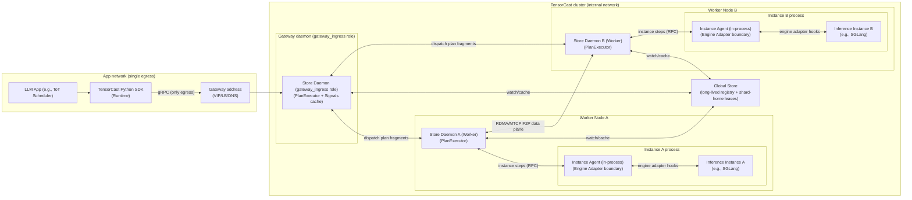

# Summary

`docs/designs/0055-programmable-framework.md` defines and implements the core **artifact-first programmable primitives**
(`CallContext`, `Operation[T]`, `Plan` + caller-local `PlanExecutor` (`Plan.run()`), Instance Agent + Engine Adapter execution boundary).

This design (`0056`) specifies **planned** extensions required by external applications (especially LLM apps) that want
to **actively manage runtime tensors** as part of application logic (e.g., request routing/rebalancing/migration in a
ToT scheduler), under common production constraints:

- the scheduler/app process may only be able to connect to **one** TensorCast entrypoint (cannot directly reach every
  daemon/agent),
- the **Global Store** must not be a hot-path bottleneck at cluster scale,
- the Python SDK should remain a lightweight boundary layer; orchestration logic belongs inside TensorCast daemons.

Planned extensions:

- **Phased Plan execution unification**:
  - current baseline (as of 2026-02-10): `Plan.run()` is SDK-local (caller-local PlanExecutor) and instance fragments
    are executed via the target instance’s **Instance Agent** boundary (Engine Adapter; legacy code/proto name:
    `node_agent`),
- planned extension: add daemon ingress `ExecutePlan` (the `gateway_ingress` role) to run PlanExecutor inside Store Daemons, without
    creating a second execution semantics.
- **Unified process runtime**: all caller processes use one `Runtime`/`ProcessContext` object returned by
  `tensorcast.connect(...)` (no separate `init_app(...)`).
- **Daemon-served Signals**: `TensorCastSignals` is served by daemons with explicit staleness budgets; Global Store is
  consulted via daemon caches / watch streams, not per caller request.
- **Engine-agnostic KV orchestration control flow**: instance actions, routing, and lease/fencing integration for KV
  cache operations. The KV data model, batch IO primitives, and open/sealed lifecycle are specified in
  `docs/designs/0084-unified-artifact-binding-kv-runtime.md`.

This design intentionally keeps TensorCast core **KV-semantics-free**: TensorCast stores/moves blobs; inference engines
remain the source of truth for request→token→KV-key mapping.

Consistency and migration guardrails (required):

- **Single execution semantics**: PlanExecutor is the canonical `PlanSpec` executor (0055: caller-local; 0056:
  daemon-run). Instance-scoped actions execute via the local Instance Agent boundary; worker-scoped actions execute in
  Store Daemons. Gateway ingress MUST NOT introduce a parallel execution plane with diverging retry/idempotency
  semantics.
- **Gateway is a role, not a new service type**: any Store Daemon may serve ingress; no separate gateway registry entity.
- **Contract reuse over implementation reuse**: directory/cache behavior SHOULD reuse `CapabilityDirectory` semantics
  (freshness, invalidation, fallback), but daemon implementations remain native (no cross-language runtime coupling).
- **LaneContext must close the loop**: lane/policy metadata MUST propagate consistently across plan and non-plan hot-path
  RPCs (materialize/prefetch/KV), with auditable logs and retry stability.
- **De-hotization cannot weaken correctness**: when moving source/routing decisions local, preserve claim/reservation and
  fencing-equivalent invariants; do not trade away overload safety.

---

# Goals / Non‑Goals

Goals

- Support **external apps** (e.g., ToT schedulers) that can only reach a **single daemon entrypoint**, while still being
  able to execute cluster-wide plans and query cluster signals.
- Keep the Python SDK a clean boundary: caller processes connect to exactly **one** daemon and do not call Global Store
  directly.
- Push control-plane execution down to Store Daemons so the system scales without a single centralized controller.
- Avoid creating parallel execution planes (`SDK-local PlanExecutor` vs `daemon PlanExecutor`) with diverging
  retry/idempotency semantics.
- Minimize Global Store load by globally registering only long-lived entities (**Worker / Instance**) and by using
  watch/stream + caching inside daemons.
- Define an instance-local **Instance Agent / Engine Adapter** boundary so instance steps can safely touch engine
  internals without exposing PID/IPC handles to remote callers.
- Define a cacheable **Signals** surface (`TensorCastSignals`, `ExecutionSignals`) with explicit staleness semantics for
  control loops.
- Define an engine‑agnostic **KV cache orchestration control contract** compatible with SGLang HiCache/Mooncake.
  Data semantics (object model, open/sealed states, batch IO and identity encoding) are delegated to
  `docs/designs/0084-unified-artifact-binding-kv-runtime.md`.

Non‑Goals

- A Ray‑like distributed Python runtime (plans dispatch fixed actions, not arbitrary code).
- Full durability semantics for KV cache (KV blobs are a cache; correctness must not depend on backend retention).
- A global reference counting system for KV blob eviction (start with TTL/LRU + best‑effort delete semantics).
- Baking token→KV mapping semantics into TensorCast core (engines remain the source of truth; TensorCast stores/moves
  blobs).
- Replacing TensorCast’s existing data plane; this design only adds control‑plane services and step types on top of 0055.

---

# Scope Boundary with 0084 (required)

`0056` and `0084` are intentionally layered:

- `0056` owns control-plane semantics:
  - daemon ingress execution model,
  - signals and directory caching,
  - cache blob routing with shard leases and fencing,
  - instance-agent orchestration boundaries.
- `0084` owns cache blob and weight data semantics:
  - unified `Artifact` + `Binding` + mapping model,
  - blob `open` -> `sealed` lifecycle,
  - batch external-target IO primitives and VRAM-first fast paths,
  - CGID field encoding constraints and helper contracts.

When sections overlap, `0084` is normative for cache blob data-path behavior and `0056` is normative for distributed
control-plane behavior.

---

# Architecture

## Runtime Topology (Planned)



## Component Responsibilities

- **Store Daemon (Worker process)** (existing; extended in 0056): owns TensorCast data plane (replicas, tiers, P2P
  copies, placement pins) and additionally hosts control-plane services:
  - PlanExecutor (the `gateway_ingress` role provides ingress `ExecutePlan`; all daemons execute per-target plan fragments),
  - `TensorCastSignals` (cached signals/directory; bounded staleness),
  - daemon↔daemon dispatch and RPC invocation of Instance Agents for instance-scoped actions.
- **Global Store** (existing): durable coordination + registries and persistence metadata.
  - 0056 goal: keep it off the hot path by registering only long-lived entities and using watch/stream updates to
    populate daemon caches.
  - KV integration note (planned): Global Store does **not** track high-cardinality KV blobs; it only serves as the
    low-cardinality **shard lease authority** (fencing tokens) and long-lived membership/registry.
- **Instance Agent** (planned): instance-local execution boundary that:
  - executes instance-scoped plan actions (targets, transforms, KV adapter),
  - hosts engine adapters safely (in-process with the inference instance),
  - is callable by Store Daemons via RPC (not exposed to external app networks).
- **Inference Instance** (external): an inference engine process (e.g., SGLang).
- **Runtime (Python SDK)** (planned): a lightweight handle used by any caller process. It connects to exactly one Store
  Daemon and does not call Global Store directly.

Remote-safety rules (unchanged from 0055; reiterated):

- Any action requiring PID/IPC/region references MUST run via the Engine Adapter on the target instance.
- External apps must not directly call PID/IPC-binding RPCs; they submit plans to daemons, and the target daemon
  invokes the target Instance Agent via instance-agent RPC for instance-scoped steps.
- Daemon-owned cache-warm actions that must be retry-safe and PID-independent run in `NO_LEASE`.

---

# Terminology (planned; abstract vs process)

0056 uses several terms that are easy to conflate. This section explicitly separates:

- **abstract targets / registry entities** (what `PlanSpec` targets, what Global Store records), from
- **concrete runtime entities** (actual OS processes that run on nodes).

## Node

- **Node (abstract / physical host)**: a machine (physical or VM) in the cluster. A node can run multiple processes:
  Store Daemon(s), inference instance(s), and optionally sidecars.
- A node is **not** a `Plan` target in this design; plan targets are Workers (Store Daemons) and Instances (engines).

## Daemon / Store Daemon

- **Daemon (concrete process)**: a long-lived TensorCast service process. In this document, “daemon” means **Store
  Daemon** unless explicitly qualified (e.g., “Global Store server”).
- **Store Daemon (concrete process)**:
  - owns TensorCast data plane (replicas, tiers, P2P copies, placement pins),
  - runs control-plane endpoints required by 0056 (daemon-served signals/directory, and optional ingress
    `ExecutePlan`),
  - maintains a directory/signal cache backed by Global Store watch streams.
- A Store Daemon is identified by a stable **`daemon_id`** (HA-safe). Network addresses are routing attributes only.

## Placement / tier

- **Placement (abstract concept)**: where bytes should be resident from the daemon’s perspective. Placement is a tier
  (HOST_DRAM vs GPU_VRAM) and optionally a device instance (GPU ordinal).
- **API layer** (public): for user ergonomics, APIs continue to accept `device="cuda:N"` / `N` and `device="dram"` /
  `"cpu"` / `-1`.
- **Semantic layer** (required): device inputs MUST canonicalize to a Placement:
  - `Placement(kind="GPU_VRAM", device_id=N)` for `"cuda:N"` / `N`.
  - `Placement(kind="HOST_DRAM")` for `"dram"` / `"cpu"` / `-1`.
- **Wire layer** (compatibility): until a first-class `Placement` message is introduced on all RPCs, HOST_DRAM is
  encoded as `device_id = -1` and GPU_VRAM as `device_id = N` (existing wire field). `device_id` is therefore a
  **compatibility encoding**, not a “GPU ordinal” in the abstract model.

## Worker

- **Worker (abstract target + registry entity)**: the logical “worker” that a plan targets for daemon-owned actions.
  A Worker corresponds 1:1 to a Store Daemon process at any point in time.
- Global Store records Workers so other daemons can resolve `daemon_id -> routing` and dispatch plan fragments without
  callers needing direct connectivity to every daemon.
- In code/IR, “worker step” means “execute on the target Store Daemon (by `daemon_id`)”.

## Gateway daemon

- **Gateway daemon (`gateway_ingress` role; concrete process)**: the single Store Daemon endpoint that a caller process can reach (by
  network policy). The gateway daemon:
  - accepts `ExecutePlan(PlanSpec)` from the caller,
  - schedules the DAG and dispatches subplans to other Store Daemons (instance steps execute via the target daemon’s
    Instance Agent RPC boundary),
  - aggregates results into a `PlanResult` and serves it via an `Operation[PlanResult]` (status/wait/cancel).
- “Gateway” is a **role**, not a separate service type or registry entity. Any Store Daemon can be configured with the
  `gateway_ingress` role.

## PlanExecutor

- **PlanExecutor (abstract component)**: the only component that interprets a `PlanSpec` DAG, schedules/dispatches steps,
  and aggregates a `PlanResult`.
  - **0055 (implemented)**: PlanExecutor runs in the caller process as the SDK-local runner (`Plan.run()`).
    - Worker-only plans can be executed from any process that can reach the target Store Daemons.
    - Plans containing instance-scoped steps require reachability to the target instance’s Instance Agent boundary.
  - **0056 (planned)**: PlanExecutor runs inside Store Daemons.
    - The `gateway_ingress` role provides external ingress (`ExecutePlan`).
    - Non-gateway daemons execute per-target plan fragments and invoke Instance Agents via RPC for instance steps.

## Home shard / home daemon (planned)

- **Home shard (abstract partition)**: a fixed partition of cache blob artifact key space used for routing/ownership
  (e.g., 4096 or 16384 shards). Sharding is by cache blob identity (CGID), not by request.
- **Home daemon (dynamic responsibility; concrete process)**: the Store Daemon that currently holds the lease for a
  shard. Only `shard_home_eligible` daemons may acquire shard-home leases and become home. The home daemon is the authoritative
  place for:
  - `PUT_IF_ABSENT_JOIN` enforcement (immutability invariants),
  - existence truth for cache blob artifacts (for the current lease generation),
  - and shard-scoped TTL / resource governance decisions.
- **Fencing token (`lease_generation`)**: a monotonically increasing generation number attached to the shard lease. All
  shard-scoped cache blob operations must be fenced by the current `lease_generation` to prevent split-brain under partitions
  and failover.

## Instance

- **Instance (concrete process + registry entity)**: an inference engine process (e.g., an SGLang serving instance).
  It is not a TensorCast daemon.
- An Instance exists so plans can target **engine-local** actions (target mint/resolve, transforms, KV
  flush/prefetch/evict_local, execution signals).
- Instances are registered/heartbeated as long-lived entities so Store Daemons can route instance steps by stable
  **`instance_id`**.

## Instance Agent (engine integration boundary)

Instance Agent is the **inference-engine integration boundary**. In the current TensorCast codebase, the legacy
proto/package label is `node_agent`, but the semantics are per-instance and in-process.

- **Instance Agent (in-process component; not a separate service)**: the instance-local execution boundary that runs
  instance-scoped plan steps on behalf of Store Daemons.
  - It hosts an Engine Adapter (and optionally an `EngineKvCacheAdapter`) to safely touch engine internals.
  - It MUST run **in-process with the inference instance** (same OS process). It must not be a sidecar because it
    needs direct access to engine state that should not be re-exported across a separate process boundary.
  - It is invoked by Store Daemons via **instance-agent RPC** (gRPC; typically over TCP and optionally over a Unix
    domain socket when co-located).
    - Co-location (daemon and instance on the same node) is recommended for performance, but not required.
    - It MUST NOT be exposed to external app networks; only Store Daemons should be able to call it.

---

# Daemon Roles (planned)

0056 uses “roles” as **composable capability flags** attached to Store Daemons (Workers). Roles are an operational policy
surface used for routing and capacity partitioning; they must not introduce new service types or change Plan/Artifact
semantics.

## Goals

- Allow deploying a **gateway pool** (ingress) distinct from general workers, without changing APIs.
- Allow constraining **shard home** eligibility to a subset of daemons (e.g., DRAM-heavy nodes), without involving
  Global Store in the cache blob hot path.
- Keep roles **low-cardinality** and **update-on-change** so Global Store remains scalable.

## Role model

- Roles are **worker attributes** (attached to the Worker/daemon_id record), advertised by Store Daemons and cached by
  other daemons via watch streams. External callers query roles via daemon-served `TensorCastSignals`, not by calling
  Global Store directly.
- Roles are **not stable identity**. They MUST NOT participate in deterministic operation/step identities or artifact
  identities.
- Roles are **composable**: a daemon can hold multiple roles simultaneously.
- Separate:
  - **Static roles / capabilities** (configuration-driven; advertised in the worker registry), from
  - **Dynamic responsibilities** (lease-derived or registry-derived; not “configured”).

## Static roles (capabilities)

- `gateway_ingress`:
  - Indicates a Store Daemon is eligible to accept external Runtime connections (e.g., behind a VIP/LB/DNS).
  - A gateway daemon MUST implement `StoreDaemonService.ExecutePlan` ingress and daemon-served signals.
  - Non-gateway daemons MAY still execute plan fragments dispatched by other daemons (mesh), but SHOULD reject direct
    external ingress by policy.
- `shard_home_eligible`:
  - Indicates a Store Daemon is eligible to acquire shard-home leases and act as a shard home (authoritative
    PutIfAbsent/Exists/Get for the current `lease_generation`).
  - Daemons without this role MUST NOT acquire shard-home leases.

## Dynamic responsibilities (derived)

- **Shard home**: for a given shard_id, the current holder `{holder_daemon_id, lease_generation}` from the shard-home lease
  record. A daemon is “home” for a shard only while it holds the active lease (fenced); this is not a static role.
- **Instance host**: derived from the instance registry mapping `instance_id -> daemon_id`. A daemon “hosts” an instance
  when it is the current routing target for that instance’s steps.

## Discovery and enforcement

- Discovery:
  - `TensorCastSignals.list_workers()` SHOULD include role flags and allow filtering by required roles (e.g.,
    `required_roles=["gateway_ingress"]`).
  - Store Daemons cache roles via Global Store watch streams and MUST NOT query Global Store per plan execution.
- Enforcement (required):
  - A daemon without `gateway_ingress` SHOULD reject external ingress (`ExecutePlan` from the app network) even though it
    can still participate in daemon↔daemon dispatch.
  - A daemon without `shard_home_eligible` MUST fail requests to acquire shard-home leases and MUST NOT serve as shard home.

## Examples (role composition)

- **Gateway pool**: `{gateway_ingress}` (often small; placed behind LB/VIP/DNS).
- **Shard-home pool**: `{shard_home_eligible}` (DRAM-heavy nodes; eligible to hold shard-home leases).
- **Combined**: `{gateway_ingress, shard_home_eligible}` (small clusters/dev; fewer moving parts).
- **General workers**: `{}` (implicit Store Daemon; not gateway ingress; not shard-home eligible).

---

# Planned Public API Additions

This section defines only the **new** surfaces required beyond 0055.

## Runtime / ProcessContext (unified)

All caller processes use the same entrypoint and the same object:

- `Runtime` is a lightweight RPC client bound to exactly one Store Daemon endpoint.
- It provides access to:
  - the 0055 Store/data-plane API,
  - phased plan execution (current local runner, optional ingress later),
  - daemon-served signals/directory queries.
- It is **not** globally scheduled/registered (only Workers/Instances are registered). It is an API boundary
  handle for a caller process.

```python
class RuntimeError(Exception): ...

class Runtime:
    daemon_address: str
    daemon_id: str

    def store(self) -> "Store": ...
    def signals(self) -> "TensorCastSignals": ...
    def plan(self, ctx: "CallContext") -> "Plan": ...
    def close(self) -> None: ...

def connect(*, daemon_address: str) -> Runtime: ...
def runtime() -> Runtime: ...  # returns the active Runtime created by connect(...)

class InstanceRegistrationError(Exception): ...

class InstanceRegistrationHandle:
    instance_id: str
    instance_agent_endpoint: str  # instance-agent RPC endpoint (TCP/UDS); routing attribute, not identity

    def close(self) -> None: ...

class Runtime:
    def serve_instance(
        self,
        *,
        instance_id: str,
        engine: str,
        engine_adapter: "EngineAdapter",
        labels: Mapping[str, str] | None = None,
    ) -> InstanceRegistrationHandle: ...
```

Semantics (planned):

- `connect(...)` creates a lightweight process-local handle bound to a single Store Daemon endpoint.
- `Runtime.serve_instance(...)` is called inside an inference engine process. It binds an engine adapter to the
  instance-local execution boundary (Instance Agent) and registers a long-lived `Instance` with the connected Store
  Daemon. The Store Daemon is responsible for publishing/heartbeating `Instance` routing information into Global Store,
  including:
  - the HA-safe `daemon_id` routing target for instance steps (`instance_id -> daemon_id`), and
  - an `instance_agent_endpoint` routing attribute used by Store Daemons to invoke instance actions via
    instance-agent RPC.

### Initialization UX (planned)

The 0055 `tensorcast.init(mode=...)` is primarily a data-plane initializer. 0056 adds phased plan execution and signals
that must be usable from network-restricted apps (single entrypoint), so the recommended UX is:

- **one** primary entrypoint: `tensorcast.connect(...) → Runtime`
- optional dev tooling: `tensorcast.init(mode="create")` / `launch_local_store(...)`
- no separate `init_app(...)` surface

This maps the older 4-mode mental model into a single connect + optional instance registration:

| Legacy intent | Planned usage | Typical caller |
| --- | --- | --- |
| connect to a daemon (data plane) | `tc.connect(daemon_address=...)` | Any caller process |
| create a local daemon (dev) | `tc.init(mode="create", ...)` (or alias) | Local tooling |
| connect for “app control plane” | `tc.connect(daemon_address=...)` | Scheduler/router (ToT) |
| run an “agent” with engine adapter | `tc.connect(...).serve_instance(...)` | Inference engine process |

`Plan` construction routing (planned):

- `runtime.plan(ctx)` builds a plan bound to the unified execution semantics:
  - current baseline: SDK-local PlanExecutor (`Plan.run()`) + Instance Agent execution boundary,
  - optional ingress phase: daemon `ExecutePlan` as entrypoint with identical semantics.
- For simplicity, module-level `tensorcast.plan(ctx)` SHOULD:
  - delegate to `runtime().plan(ctx)` when an active `Runtime` exists (local runner or ingress, depending on rollout), and
  - otherwise build a locally-executed plan per 0055 (useful for tests and in-cluster debugging).
- `tensorcast.local_plan(ctx)` (planned) forces the 0055 local-run behavior even when a `Runtime` exists.

Recommended usage patterns (planned):

- **ToT scheduler / router**: `rt = tc.connect(entry_daemon)` then use `rt.signals()` + `rt.plan(ctx).run()`.
- **Inference engine process (SGLang)**: `rt = tc.connect(local_daemon)` then `rt.serve_instance(...)` (engine adapter);
  the engine’s HiCache storage backend uses the 0055 Store client against the co-located daemon.
- **Offline tooling**: `rt = tc.connect(daemon)` and use `Artifact.prefetch/into` or daemon-run plans.

## Phased Plan execution (planned)

Current baseline (as of 2026-02-10):

- In 0055/current code, `Plan.run()` executes in the caller process.
- Instance fragments execute via the target instance’s Instance Agent boundary (in-process Engine Adapter; legacy
  code/proto name: `node_agent`).
- Direct-dispatch from arbitrary caller processes to remote instances is deployment-dependent (reachability, endpoint
  discovery). 0056 removes this requirement for external apps by routing instance steps through Store Daemons (by
  `instance_id -> daemon_id`) and invoking Instance Agents via instance-agent RPC.

Planned migration sequence for external apps that cannot directly reach every daemon/agent:

1. SDK serializes `Plan` -> `PlanSpec`.
2. Plan submission uses one of two equivalent ingress shapes:
   - preferred once available: SDK calls `StoreDaemonService.ExecutePlan(PlanSpec)` on a gateway daemon and receives
     `Operation[PlanResult]`,
   - transitional/current path: SDK local runner dispatches using the same deterministic step/operation identities in
     deployments where callers can directly reach required execution endpoints.
3. Dispatch semantics are shared:
   - worker steps -> target Store Daemon(s),
   - instance steps -> target Store Daemon -> instance-agent RPC -> Instance Agent / Engine Adapter boundary.
4. Completion is exposed as `Operation[PlanResult]` semantics with at-least-once-safe retries and idempotent joins.

Plan operation semantics (planned):

- `Plan.run()` in the Python SDK MAY remain a sync/blocking API by internally calling `op.result(...)` on the returned
  `Operation[PlanResult]`.
- The plan operation record is daemon-scoped and best-effort (it is not a durable workflow state machine in Global
  Store). Gateway restart may therefore require resubmission; correctness is preserved by step-level idempotency joins.
- Re-attach / retry SHOULD be possible by resubmitting the same PlanSpec with the same `ctx.idempotency_key` and
  stable plan/step identities (gateway-independent). A dedicated “attach by plan operation id” API is a possible
  future extension.

This makes the scheduler/app’s connectivity requirement explicit: it only needs reachability to **one** daemon.

Target resolution note (planned):

- Callers SHOULD target steps by stable identities (`daemon_id`, `instance_id`) and MUST NOT assume reachability to
  `daemon_address` or any instance-local endpoint.
- The gateway daemon SHOULD treat any addresses in `PlanSpec` as hints and re-resolve routing via its directory cache
  (backed by Global Store watches).

Gateway deployment & failover note (planned):

- The “single reachable daemon” constraint is a **network policy** constraint, not a scalability goal. Production
  deployments SHOULD expose **multiple** Store Daemons as eligible gateway entrypoints behind a VIP/LB (or provide a
  list of entry addresses) to avoid a single hot spot.
- `Runtime.connect(...)` SHOULD tolerate reconnecting to a different gateway daemon (e.g., LB failover). Therefore:
  - daemon-run plan execution MUST be **gateway-independent** and safe under at-least-once retries across gateways,
  - deterministic step/operation ids MUST NOT include the gateway daemon identity; they are derived from stable step
    identity + target identity (`daemon_id` / `instance_id`) and `ctx.idempotency_key`,
  - target daemons MUST join repeated submissions on the same `ReplicaKey` / operation id and fail fast on mismatched
    reuse (per 0055 contracts).

Deterministic PlanSpec encoding (planned; required for daemon-run execution)

Daemon-run plan execution relies on at-least-once retries, gateway failover, and daemon↔daemon re-dispatch. Therefore,
the IR must be reproducible from stable inputs:

- `PlanSpec.plan_id` MUST be deterministic when `ctx.idempotency_key` is provided (0055 already does this).
- `PlanSpec.steps[*].step_id` SHOULD be derived deterministically (UUIDv5) from a **step fingerprint** rather than from
  builder insertion order.
  - Step fingerprint inputs (required):
    - action name,
    - stable target identity (`daemon_id` / `instance_id`),
    - selection identity (`artifact_id`, `logical_layout_hash`, `selection_hash`) where applicable,
    - placement (semantic placement; canonicalized),
    - action-specific stable args (excluding `deadline_ms`, `qos`, `tags`).
  - Set-like inputs MUST be canonicalized (sorted/unique) before hashing (e.g., subset `tensor_names`, batch
    selections).
- `depends_on` lists MUST be encoded in a canonical order (e.g., sorted by `step_id`) so equivalent DAGs serialize to
  equivalent PlanSpecs.

Planned refinement: define a single cross-language “step fingerprint v1” string format (domain-separated, UTF‑8,
lowercase hex for digests) and use it consistently for step_id derivation, daemon-side dedup/join, and auditing.

Planned: TargetSpec / capability minting in daemon-run plans

In 0055, remote `into(...)` / `transform_into(...)` flows require a `TargetSpec` capability minted by the engine adapter
on the target instance. In 0056, external apps cannot directly reach inference instances/instance agents, so callers
must not be expected to mint `TargetSpec` out-of-band.

Planned solution (recommended):

- Add an instance-scoped plan action `mint_target(...) -> TargetSpec` executed by the Instance Agent (in-process).
- The minted `TargetSpec` is returned as a plan step output and can be:
  - consumed by later steps via step-output references (if supported), or
  - returned to the caller and used as an explicit input to a follow-up plan (two-plan pattern).
- Plan executors (gateway/daemons) MUST treat `TargetSpec` as an opaque capability and MUST NOT mint/forge it.

Planned: explicit `materialize_into(...)` instance action

In 0055, `Artifact.tensor_dict_into(...)` is the primary “read into caller-owned buffers” surface, and plans can
orchestrate remote reads by invoking the engine adapter on the target instance with a `TargetSpec`.

However, using `transform_into(...)` (often an identity transform) to represent “into” is ambiguous for auditing and
plan reasoning. In 0056, add a distinct instance action:

- `materialize_into(src_selection, target: TargetSpec, device=..., options=...) -> None`
  - executes on the Instance Agent (in-process) and writes into the engine-owned/caller-owned buffers described by
    `TargetSpec`,
  - does not create a new artifact (it is a materialization side effect on an existing target),
  - preserves the 0055 boundary: only the engine adapter can mint/resolve `TargetSpec`; daemons/gateways treat it as an
    opaque capability.

## Batch worker actions: `prefetch_many` (planned)

LLM KV backends (e.g., SGLang+Mooncake) are **page-fragmented**: a single request can correspond to tens/hundreds of KV
blobs. Expressing migration/prewarm as “one plan step per blob” is control-plane expensive.

To keep `Plan` practical, add a batch worker action:

```python
@dataclass(frozen=True, slots=True)
class PrefetchManyItem:
    """
    Canonical identity for a single batch item.

    Must uniquely identify an Artifact *selection* (not just an artifact_id), so results can be mapped back to inputs
    even when views/subsets are present.
    """

    artifact_id: str
    logical_layout_hash: bytes
    selection_hash: bytes

@dataclass(frozen=True, slots=True)
class BatchItemFailure:
    item: PrefetchManyItem
    status: OperationStatus

@dataclass(frozen=True, slots=True)
class PrefetchManyResult:
    succeeded: tuple[PrefetchManyItem, ...]
    missing: tuple[PrefetchManyItem, ...]
    failures: tuple[BatchItemFailure, ...]

class WorkerStepBuilder:
    def prefetch_many(
        self,
        arts: Sequence["Artifact"],
        *,
        device: str | int,  # "cuda:0"/0, or daemon-owned DRAM placement ("cpu"/"dram"/-1)
        depends_on: Sequence[PlanStepRef[Any]] | None = None,
    ) -> PlanStepRef[PrefetchManyResult]: ...
```

Semantics:

- batch materializes the provided selections to daemon-owned residency on the target Worker.
- DRAM placement is allowed under `NO_LEASE` (prefetch does not export CPU handles); see 0055 `Artifact.prefetch`.
- Cache-blob note (required): for `cgid:cache_blob~...` selections, any daemon-owned cached copy MUST be fenced by the
  current shard `lease_generation` (epoch-scoped cache). A cached blob from an older generation MUST be treated as
  absent (miss) and re-fetched (see `docs/designs/0084-unified-artifact-binding-kv-runtime.md`).
- action result must be **per-item** so the app can decide proceed/retry/abort without losing partial information.
- result classification (required):
  - `missing`: the selection does not exist in its authoritative namespace resolver (e.g., registry-backed `NOT_FOUND`,
    or cache blob home-shard miss).
  - `failures`: any non-`NOT_FOUND` failure (transport, deadline, permission, precondition, etc.).
- step-level status (required):
  - the plan step MUST fail only for systemic errors that prevent producing a meaningful `PrefetchManyResult`
    (e.g., invalid arguments, permission errors, internal daemon errors, transport failure to the target worker).
  - per-item `NOT_FOUND` / miss and per-item failures MUST be surfaced in the returned `PrefetchManyResult` and MUST
    NOT, by themselves, hard-fail the plan step (KV is cache; callers can degrade to recompute/prefill).
  - callers MUST inspect `PrefetchManyResult` to decide proceed/retry/abort; `PlanResult.ok` alone is insufficient for
    cache-hit decisions in batch actions.
- placement model (required):
  - the public `device=...` input is an API alias for a semantic Placement tier (HOST_DRAM vs GPU_VRAM).
  - HOST_DRAM has no “device ordinal” in the model; it is encoded as `device_id = -1` on the wire for compatibility.
- device canonicalization (required):
  - `"cpu"` / `"dram"` / `-1` MUST canonicalize to `device_id = -1` (daemon-owned host DRAM tier).
  - `"cuda:N"` / `N` MUST canonicalize to `device_id = N`.
  - idempotency MUST use the canonicalized `device_id`, not the user’s input string.
- canonicalization (required):
  - `arts` is treated as an order-insensitive **set** of selections; duplicates MUST be removed.
  - digest bytes in selection identity MUST use lowercase hex when embedded into fingerprints (0055 canonical encoding).
  - the batch idempotency fingerprint MUST be computed from a canonical ordering of item fingerprints, not from user
    input order.
    - recommended ordering key: `(artifact_id, logical_layout_hash.hex(), selection_hash.hex())` (lexicographic over
      the UTF-8 strings).
- idempotency (required):
  - per-item identity follows 0055 selection identity: `(artifact_id, logical_layout_hash, selection_hash)` plus
    action-scoped inputs (target `daemon_id`, placement, lease mode).
  - the batch step’s stable fingerprint MUST be order-insensitive (e.g., `batch_digest = sha256(sorted(item_fingerprints))`).

## Planned: Idempotent placement pins

In 0055, placement pins are capability-based and **not idempotent**: retrying `CreatePlacementLease` on an unknown
outcome may create multiple pins. This is acceptable for best-effort local usage, but it is unsafe for daemon-run
at-least-once plan execution (the gateway daemon may retry steps on unknown outcomes).

Planned extension:

- Add an optional `operation_id` (UUID string) to `CreatePlacementLeaseRequest`.
- When `operation_id` is provided:
  - the daemon MUST treat it as the join key: duplicate submissions MUST return the same logical `PlacementPin`
    outcome and MUST NOT create multiple pins.
  - if the same `operation_id` is reused but resolves to a different pin target (different `ReplicaKey` / device), the
    daemon MUST fail fast with `FAILED_PRECONDITION`.
- TTL semantics:
  - `ttl_ms` MUST NOT participate in operation identity.
  - `CreatePlacementLease` SHOULD behave like “create-or-extend” (monotonic): expiry can only be extended (max), never
    shortened.
  - `PlacementPin.renew(...)` remains the explicit surface for extending TTL once a token is available.
- SDK/daemon derivation:
  - when `ctx.idempotency_key` is provided, the daemon plan executor SHOULD derive `operation_id` deterministically
    using the same canonical encoding rules as 0055 (stable daemon/selection identity + placement) so retries are safe.

## Signals (Control-Loop Inputs)

Signals are low-cardinality, cacheable inputs for scheduling policies.

In 0056, caller processes query signals via the connected Store Daemon (`Runtime.signals()`); the daemon maintains a
cache populated from Global Store watch streams and worker/instance updates so the Global Store is not queried on every
call.

Directory note (planned):

- In the daemon-run / single-entrypoint world, `TensorCastSignals` also serves as the **directory** surface
  (`list_workers`, `list_instances`, capabilities, routing hints). External apps SHOULD NOT use any direct
  Global-Store-backed “capability directory” client APIs; those become internal/legacy implementation details behind
  the daemon cache.

TensorCast distinguishes:

- **TensorCastSignals**: TensorCast-owned signals sourced from Global Store + Store Daemons (health/capacity/residency).
- **ExecutionSignals**: engine-owned signals sourced from inference engines (queueing/inflight/latency); advisory only.

Snapshot semantics (required):

- all snapshots include `as_of_ms` and `staleness_ms`,
- policies enforce staleness budgets by QoS (e.g., realtime ≤ 250ms).

Recommended representation:

```python
@dataclass(frozen=True, slots=True)
class SignalSnapshot(Generic[T]):
    value: T
    as_of_ms: int
    staleness_ms: int
```

Minimal `TensorCastSignals` (planned):

```python
@dataclass(frozen=True, slots=True)
class WorkerStatus:
    status: str
    accepting_new_requests: bool
    mem_pool_total_size: int | None = None
    mem_pool_available_size: int | None = None

class TensorCastSignals:
    def list_workers(
        self, *, include_unavailable: bool = False, ctx: CallContext | None = None
    ) -> SignalSnapshot[list[Worker]]: ...

    def get_worker_status(
        self, worker: Worker, *, ctx: CallContext | None = None
    ) -> SignalSnapshot[WorkerStatus]: ...

    def list_instances(
        self,
        *,
        include_unavailable: bool = False,
        required_capability_flags: int = 0,
        labels: Mapping[str, str] | None = None,
        ctx: CallContext | None = None,
    ) -> SignalSnapshot[list[Instance]]: ...
```

`ExecutionSignals` is provided via adapters (`ExecutionSignalsAdapter`) keyed by `Instance.engine`.

---

# Cache Blob Integration (LLM KV motivating case; SGLang/Mooncake)

Refactor note (2026-03-04):

- This section is now integration-oriented and control-plane-oriented.
- Normative cache-blob requirements (sealing boundary, `PUT_IF_ABSENT_JOIN` invariants, batch IO primitives, CGID
  helper contracts, and unified weight/cache object model) are defined in
  `docs/designs/0084-unified-artifact-binding-kv-runtime.md`.

## Key idea

TensorCast integrates with inference engines’ KV caches by treating KV cache as:

- deterministic **engine-defined keys** (prefix-hash keys), mapping to
- **opaque cache blob bytes** stored as **cache blob artifacts** (no paged-attention semantics in TensorCast core).

This matches SGLang+Mooncake integration: Mooncake does not understand RadixAttention; it stores/transfers blobs by key.
TensorCast’s integration follows the same rule, but uses TensorCast’s data plane for movement and daemon-owned tiers for
residency.

## Cache blob identity: CGID (cross-instance, non content-addressed)

LLM KV blobs (and other high-cardinality cache blobs) should use **Client-Generated Artifact IDs** (CGID) so multiple
instances can converge on a stable key without content hashing:

```
cgid:cache_blob~<namespace>~<engine>~<model_id_enc>~<layout_id>~<engine_key_enc>
```

This aligns with `docs/designs/0017-client-generated-artifact-id.md`.

Rules:

- `<engine_key_enc>` is opaque to TensorCast; it must be collision-safe across engine/model/layout.
- IDs are immutable (within a shard lease generation): same CGID must refer to identical bytes under
  `PUT_IF_ABSENT_JOIN` enforcement (see conflict-write rules below).

Field encoding (required):

- CGID fields are separated by `~`. Every field MUST be:
  - UTF‑8 text,
  - delimiter-safe (MUST NOT contain `~`, `|`, or newlines),
  - and byte-for-byte stable across languages (no normalization such as lowercasing, trimming, or Unicode
    normalization like NFC/NFKC).
- `<namespace>`, `<engine>`, `<layout_id>` SHOULD be URL-safe tokens matching `[A-Za-z0-9._-]+` (recommended to keep ids
  readable and parseable).
- `model_id` often contains `/` and other invalid characters, so `<model_id_enc>` SHOULD be an encoding (see below).
- `<engine_key_enc>` is opaque and may originate from engine/backend keys that contain arbitrary characters. Therefore:
  - if the raw engine key is not delimiter-safe, it MUST be encoded.
  - recommended encoding: Base64URL without padding, prefixed with `b64u.`:
    - `engine_key_enc = "b64u." + base64url_nopad(raw_engine_key_utf8_bytes)`
    - decoding MUST recover the exact original bytes.
  - `engine_key_enc` MUST satisfy CGID suffix grammar (`[-._~A-Za-z0-9]`) from
    `tensorcast/common/identity.py`; encodings that introduce `:` are invalid.
  - the same `b64u.` encoding profile SHOULD be used for `model_id_enc` when needed:
    - `model_id_enc = "b64u." + base64url_nopad(model_id_utf8_bytes)`

Rationale: shard hashing, namespace auth, and routing rely on stable parsing and canonical string bytes; delimiter-safe
field encoding prevents cross-language ambiguity and authorization bypasses.

### Example encoding profile: SGLang HiCache (recommended)

SGLang’s HiCache interface uses a **base per-page hash** `H` (a chained SHA256 hex string). Backends such as
`MooncakeStore` expand each page key into **blob-level object keys** (e.g., K/V parts and rank suffixes).

For TensorCast CGIDs, the recommended `engine_key_enc` is the **blob-level expanded key** (so each physical blob is one
artifact):

- MHA models (K/V split): `engine_key_enc = f"{H}_{suffix}_k"` and `engine_key_enc = f"{H}_{suffix}_v"`.
- MLA models (often merged/only K): `engine_key_enc = f"{H}_{suffix}_k"`.

`suffix` MUST follow the engine/backend’s own disambiguation scheme (e.g., TP/PP rank suffixing used by SGLang’s
`MooncakeStore`) so multiple ranks and multiple instances converge on the same blob identity when they are compatible.

## SGLang + Mooncake blob granularity (ground truth)

SGLang’s KV blobs are **page-level and highly fragmented**:

- page size defaults to 16 tokens (configurable),
- each page has its own deterministic hash key (the backend key),
- common MHA models store K and V as separate blobs per page,
- each blob contains **all layers** (page_first layout) for IO efficiency.

Implication: a single request often maps to **dozens to hundreds** of blobs, so orchestration must be **batch-first**.

## SGLang keying + IO contract (code reality; feasibility notes)

SGLang’s HiCache integration with storage backends (Mooncake being one) is intentionally **KV-semantics-free** and is
based on deterministic page keys and batch IO. The following code points define the actual contract:

- **Key derivation (token-only, deterministic)**:
  - `sglang/python/sglang/srt/mem_cache/hicache_storage.py:get_hash_str(...)` computes a chained SHA256 hex string over
    page-aligned token ids (`prior_hash` seeds the chain).
  - `sglang/python/sglang/srt/mem_cache/radix_cache.py:compute_node_hash_values(...)` uses the same chained hashing to
    compute
    per-page `hash_value` lists stored on radix nodes.
- **Prefetch probes consecutive hits**:
  - `sglang/python/sglang/srt/managers/cache_controller.py:HiCacheController._storage_hit_query(...)` computes the
    page-hash chain
    for a request and calls `HiCacheStorage.batch_exists(...)`.
  - `HiCacheStorage.batch_exists(...)` returns **the number of consecutive existing pages from the start**, enabling
    prefix reuse without the backend understanding token semantics.
- **`req_id` is progress identity, not cache identity**:
  - `sglang/python/sglang/srt/mem_cache/hiradix_cache.py:prefetch_from_storage(req_id, ...)` issues a prefetch
    operation tagged by `req_id` and records it in `ongoing_prefetch` only to track progress/termination.
  - The actual storage keys are page hashes (`hash_value`), not `req_id`.
- **Write/backup uses host staging + batch put**:
  - `sglang/python/sglang/srt/mem_cache/hiradix_cache.py:write_backup_storage(...)` calls
    `HiCacheController.write_storage(host_indices, token_ids, hash_value, prefix_keys)`.
  - `sglang/python/sglang/srt/mem_cache/storage/mooncake_store/mooncake_store.py:batch_set_v1(...)` implements a
    PutIfAbsent-like behavior by checking existence and only writing missing pages (per-page granularity; K/V blobs are
    separate in MHA).
  - `sglang/python/sglang/srt/mem_cache/storage/mooncake_store/mooncake_store.py:batch_get_v1(...)` /
    `batch_set_v1(...)` use the host KV pool’s page metadata (pointers + sizes) to support a zero-copy “get_into /
    put_from” interface.

Implications for 0056 KV orchestration (this design):

- `engine_request_id` is feasible for SGLang and maps to `Req.rid`. It is required to locate request context (token ids,
  committed KV length, KV index ownership), but it is **not** part of KV blob identity.
- `kvcache_key_set(engine_request_id)` is implementable as a read-only inspection: compute the request’s page keys from
  engine state (page-aligned) and map them to deterministic `cgid:cache_blob~...` cache blob identities.
- `kvcache_flush(engine_request_id, ...)` is the publish barrier: for pages that are still only on-device, it must force
  backend visibility via the engine storage backend, using batch-first publish paths. Direct region/VRAM export paths
  are preferred when available; device→host staging is a fallback compatibility path. (SGLang provides
  `HiCacheController.write(...)` + `HiCacheController.write_storage(...)`; see also
  `sglang/python/sglang/srt/disaggregation/decode_kvcache_offload_manager.py` for one compatibility flow.)
- `kvcache_prefetch(engine_request_id, ...)` necessarily requires **local request context** on the target instance for
  engines like SGLang (token ids are required to make the imported pages usable by token-keyed prefix caches). It cannot
  be specified as a pure `key_set`-only operation without additional engine support.

## Cache blob artifact schema (transport contract)

Even though payload is opaque, TensorCast needs a stable tensor schema:

- each cache blob artifact contains exactly one tensor named `blob`,
- `blob.dtype == uint8` and `blob.shape == [byte_length]`.

### Selection identity for cache blob artifacts (required; see `0084`)

0055 defines selection identity as `(artifact_id, logical_layout_hash, selection_hash)` and uses it for deterministic
operation ids and batch actions. Cache blob artifacts must support these identities **without** any Global Store (GS)
catalog lookup.

For `artifact_id` in the `cgid:cache_blob~...` namespace:

- cache blob artifacts support only the **canonical view** and the **full selection** (no view/subset variants).
- The `artifact_id` is fully resolved/self-describing: selection identity derivation MUST NOT require any GS registry
  lookup.
- API restrictions (required):
  - `Artifact.view(...)` / view specs MUST be rejected for cache blob artifacts (`FAILED_PRECONDITION` or SDK `ValueError`).
  - subset selection MUST be rejected:
    - `tensor_names` MUST be either omitted/None (full selection) or exactly `("blob",)` where applicable.
    - `tensor_dict_into(...)` targets MUST contain exactly one tensor named `"blob"` for cache blob artifacts.
  - resolved selection shape MUST be canonicalized to:
    - `view_id == ""`,
    - no `view_spec`,
    - `tensor_names` omitted (optional `("blob",)` input normalized away),
    - empty `view_subset_hash`.
- `logical_layout_hash` and `selection_hash` are fixed, deterministic digests:
  - `logical_layout_hash = sha256(utf8("tensorcast.cache_blob.layout.v1\\n")).digest()`
  - `selection_hash = sha256(utf8("tensorcast.cache_blob.selection.v1\\n")).digest()`
- `byte_length` and payload digests are **home-enforced invariants** and MUST NOT be required to derive selection
  identity (they are verified by `PUT_IF_ABSENT_JOIN`).
- daemon MUST enforce/cache this profile branch directly (without requiring canonical index or selected-index json
  materialization) and return normalized resolved selection.

## Correctness invariants (required)

### Immutability + conflict writes

Writes to `cgid:cache_blob~...` MUST be **PUT_IF_ABSENT_JOIN** (never overwrite):

- first write establishes invariants (`layout_id` + `byte_length` + payload digest),
- re-writes must match; mismatch fails fast with `FAILED_PRECONDITION`.

### Digest contract (required)

To make join enforceable across languages (Python/C++/Rust), cache blob writes MUST carry an explicit digest contract:

- `payload_digest_alg = "sha256"`.
- `payload_digest_hex = sha256(blob_bytes).hexdigest()` (lowercase hex).
- Cache blob put/flush actions MUST provide, per blob:
  - `byte_length`,
  - `payload_digest_alg`,
  - `payload_digest_hex`.
- The home daemon MUST persist the first-writer invariants for a `cgid:cache_blob~...` blob and enforce join on
  subsequent writes using at least `(layout_id, byte_length, payload_digest_alg, payload_digest_hex)`, scoped to the
  current shard `lease_generation` (epoch-scoped cache).

### TTL semantics

- TTL updates must be monotonic-increasing (`expires_at = max(expires_at, now + ttl_ms)`).
- Forced deletion is separate and best-effort; it must not break concurrent readers.

### Eviction split

- **Local eviction** (engine safety): reclaim engine-local KV state without touching shared blobs.
- **Backend retention** (resource governance): TTL/LRU ensures the shared backend remains bounded.

---

## Cache blob storage + routing (planned): GS-not-hot-path home shards with leases and fencing

This section defines how TensorCast can serve HiCache-style LLM KV blobs (as cache blob artifacts) at cluster scale
**without** putting per-blob metadata into Global Store (GS), while still enforcing the correctness floor:

- no incorrect hits (never return wrong bytes for a key),
- no split-brain “first-writer” acceptance under partitions/failover.

### Contract: cache is cache (performance only)

- Cache blobs are a cache: hits improve latency; misses MUST fall back to recompute/prefill in the engine/app.
- A daemon crash invalidates any cache blobs it owned: after crash/restart, previously cached blobs MUST be treated as
  absent (miss), even if some bytes remain on local disk.

### Cache blob artifacts do not enter the Global Store artifact registry

- Cache blob artifacts use `artifact_id = cgid:cache_blob~...` as **self-describing cache keys**.
- Global Store MUST NOT maintain per-blob catalog/GC/indexing for cache blobs (high cardinality).
- Global Store’s cache-blob responsibilities are limited to **shard lease authority** (low cardinality, strong consistency).
- This is a namespace-scoped override to generic `cgid:` behavior in `0017`:
  - the override applies to `cgid:cache_blob~...` only,
  - other `cgid:` namespaces can continue to use normal GS artifact/replica catalogs.

### Artifact model note (required)

Cache blob artifacts are still **Artifacts** (tensor dicts) with a fixed schema (`blob:uint8[byte_length]`). The
difference is
**authority and routing**, not object model:

- Registry-backed artifacts use Global Store (GS) as the authoritative catalog/index.
- Cache blob artifacts (`cgid:cache_blob~...`) use the **home shard** (for the current `lease_generation`) as the
  authoritative catalog/index for:
  - existence truth,
  - `PUT_IF_ABSENT_JOIN` invariants,
  - TTL/resource governance.

The `CacheBlobBatch*` RPCs are an internal, batch-first routed implementation of standard artifact operations
(`exists/get/put_if_absent/touch_ttl`) for this high-cardinality, epoch-scoped namespace. They are **not** a parallel
data-object abstraction.

Implementation note (planned):

- Store Daemons effectively act as a **namespace router** for artifact ids:
  - registry-backed artifacts resolve/route via GS-backed catalogs and existing StoreEngine paths,
  - `cgid:cache_blob~...` artifacts resolve/route via shard leases and cache blob homes (`CacheBlobBatch*`).
  Callers keep using `Artifact` handles uniformly; routing is a daemon-internal concern.

### Sharding: `shard_id = hash64(artifact_id) % S`

- Choose a fixed shard count `S` (recommended default: `S = 4096`; configurable). Larger `S` increases shard-lease
  tracking overhead and Global Store lease write QPS (see lease parameters).
- Derive a stable shard id from blob identity:
  - `shard_id = hash64(utf8(artifact_id)) % S`
  - `hash64` MUST be a specified, cross-language stable function (recommended: take the first 8 bytes of `sha256` over
    UTF‑8 bytes and interpret as little-endian `uint64`).

### Shard leases in Global Store (fencing token)

Global Store stores one low-cardinality lease record per shard:

```
ShardHomeLease {
  shard_id
  holder_daemon_id
  lease_generation   # fencing token (monotonic)
  expires_at_ms
}
```

Lease interface (planned; minimal):

- `AcquireShardHomeLease(shard_id) -> ShardHomeLease`
- `KeepaliveShardHomeLease(shard_id, lease_generation) -> ok`
- `ReleaseShardHomeLease(shard_id, lease_generation) -> ok` (optional)

### Ownership strategy (recommended)

To avoid lease thrash and hotspots during membership churn, daemons SHOULD use a stable expected-owner strategy and
only the expected owner should attempt shard acquisition.

Recommended minimal strategy: **Rendezvous hashing (HRW)** over the current set of cache-blob-capable daemons.

- Candidate set: daemons with a cache blob capability flag (derived from daemon membership signals; cached via GS watches).
- Expected owners: for each `shard_id`, compute a stable **top‑k** ordering by HRW score
  (`ranked_daemons = sort_by(HRW(shard_id, daemon_id), desc)`), with `k >= 2` (recommended: `k = 3`).
- Acquisition rule:
  - only daemons in the shard’s top‑k set are eligible to acquire (others MUST NOT compete).
  - rank‑1 SHOULD attempt `Acquire` when the shard lease is missing/expired/unavailable.
  - rank‑2/3 MAY attempt `Acquire` after lease expiry when rank‑1 is unavailable (minimal rule: rely on lease expiry;
    optional enhancement: also consult daemon health/membership signals to avoid waiting for expiry).

This yields stable shard placement (small changes on membership updates) while still using GS leases as the fencing
authority.

### Lease parameters (recommended)

Suggested defaults (illustrative; tune per deployment):

- `lease_ttl_ms = 30_000`
- `keepalive_interval_ms = 5_000` to `10_000` (≈ ttl/6 to ttl/3)
- `lease_watch_staleness_budget_ms = 500` (routing cache staleness bound)

Scalability note: GS write QPS for leases is approximately `S / keepalive_interval_ms` and is independent of the number
of caller processes.

Configuration source rule (required):

- Cache-blob routing invariants (`S`, `hash64` algorithm/version, `inline_threshold_bytes`, lease policy, retention
  defaults/limits) MUST come from unified runtime config (`0004`) and be consistent cluster-wide.
- Rolling incompatible values MUST be treated as cache-epoch cutover (invalidate to miss), not mixed-semantics serving.

### Fail-closed ownership rule (required)

- If a home daemon cannot keep its lease alive (GS unreachable / keepalive fails), it MUST immediately become
  **NOT_OWNER** for that shard and fail closed:
  - MUST NOT accept `PUT_IF_ABSENT_JOIN` writes,
  - MUST NOT claim authoritative exists/hit results.
- This intentionally prefers “miss / unavailable” over any risk of split-brain acceptance.

### Home daemon responsibilities (required)

For shards it currently owns (valid lease), the home daemon is the authority for:

1. **First-writer invariants** (`PUT_IF_ABSENT_JOIN`)
   - For each cache blob `artifact_id`, store the first-writer invariants (epoch-scoped):

     ```
     CacheBlobInvariant {
       layout_id
       byte_length
       payload_digest_alg  # sha256
       payload_digest_hex  # lowercase hex
     }
     ```

   - Put semantics:
     - first write: store invariants + bytes
     - rewrites:
       - invariants match → join/success (idempotent)
       - invariants mismatch → `FAILED_PRECONDITION` (fail fast; prevents silent corruption)

2. **Authoritative exists/get** for the current lease generation
   - Exists truth is defined by the home’s current `{shard_id, lease_generation}` map.
   - `Get` returns bytes only for keys that exist in the current generation’s map.

### Fencing on every cache blob operation (required)

All shard-scoped cache blob RPCs executed at the home MUST be fenced by `{shard_id, lease_generation}`:

- if request’s `lease_generation` does not match the home’s current generation:
  - return `FAILED_PRECONDITION` (optionally include redirect info: new `holder_daemon_id`, new generation),
  - MUST NOT execute the operation.

### Epoch-scoped storage: “daemon crash ⇒ cache disappears”

To satisfy cache semantics, home storage is scoped by `{shard_id, lease_generation}`:

- The home daemon MUST NOT serve cache blob bytes written under an old `lease_generation`.
- When generation changes (failover), the shard’s visible cache set becomes empty (global cache invalidation for that
  shard).

Two valid implementation profiles (planned; pick one per deployment):

- **A. In-memory (default)**: store cache entries in daemon memory only. Crash naturally implies miss.
- **B. Local disk by generation**: store under paths like `kv_cache/shard=17/gen=102/...` but only read current
  generation; old generations are best-effort GC’d asynchronously.

### Epoch-scoped caching for all replicas (required)

Epoch scoping applies to **any** cached copy of cache blob bytes, not just the home’s authoritative map.

Rule (required):

- Any daemon-owned cache blob replica (home store + any non-home caches created by `prefetch`/`prefetch_many`) MUST be
  keyed by `(artifact_id, shard_id, lease_generation)`.
- Once a daemon observes a newer `lease_generation` for a shard, any cached blob bytes for older generations MUST be
  treated as absent (miss) and MUST NOT be served as hits.

Acceptable enforcement strategies (planned):

- **Lazy fencing**: before serving a local KV hit, consult the daemon’s lease cache and require
  `cached_generation == current_generation`; otherwise treat as miss and re-fetch via the home.
- **Proactive invalidation**: when the daemon’s lease watch observes a generation change, drop all cached blob replicas
  for the old `(shard_id, lease_generation)` bucket (coarse invalidation is fine; KV is cache).
  - Implementation note: this can be realized by extending the daemon’s internal replica keying for the
    `cgid:cache_blob~...` namespace with `lease_generation`, or by storing blob replicas in a dedicated generation-keyed
    cache separate from registry-backed artifacts. The choice is internal as long as the rule holds.

### Cache blob request path (single-entry caller; daemon-run routing)

- Caller connects to one gateway daemon (potentially via a VIP/LB/DNS).
- The gateway (and all daemons) maintain:
  - a directory cache for `daemon_id -> routing` and `instance_id -> daemon_id`,
  - a lease cache for `ShardHomeLease` (populated via GS watch streams; bounded staleness).
- For any cache blob operation, the receiving daemon:
  - computes `shard_id` from `artifact_id`,
  - resolves the current `{holder_daemon_id, lease_generation}`,
  - forwards the shard-scoped batch to the home daemon,
  - handles `FAILED_PRECONDITION` redirects by refreshing lease cache and retrying once (or returning miss).
- If lease freshness cannot be proven within `lease_watch_staleness_budget_ms` (or refresh is unavailable), routing MUST
  fail open to per-item `miss`/`unavailable`; the daemon MUST NOT claim authoritative hits from local guesses.

Authorization note (planned):

- The home daemon MUST enforce namespace-level authorization for KV operations based on the namespace embedded in
  `cgid:cache_blob~<namespace>~...` (once namespaces/ACLs are enabled), so routing does not become an authorization
  bypass.

### Suggested minimal cache blob RPC set (planned)

Layering boundary (required):

- External-target region RPCs (`batch_get_into_region`, `batch_put_if_absent_from_region`) are front-door APIs between
  caller/instance-agent and local daemon only, and remain loopback/UDS safety-bound.
- Home-scoped shard authority RPCs below are daemon-to-daemon only; they do not and cannot directly write into
  caller-owned CUDA regions.

Between daemons (home-scoped, fenced):

- `CacheBlobBatchExists(shard_id, lease_generation, keys_in_prefix_order[]) -> {hit_len, per_key_status?}`  
  `hit_len` is the number of **consecutive existing keys from the start** (HiCache fast-path). `per_key_status` is
  optional debug detail and SHOULD be omittable for efficiency.
- `CacheBlobBatchGet(shard_id, lease_generation, keys[]) -> {per_key {status, payload_ref}}`
- `CacheBlobBatchPutIfAbsent(shard_id, lease_generation, items[]) -> per_item_status`
  - item includes: `artifact_id, layout_id, byte_length, digest_alg, digest_hex, payload` where `payload` is
    either:
    - `inline_bytes` (small blobs only), or
    - `payload_ref` (preferred; reuse TensorCast data plane; home pulls/receives bytes out-of-band).
- `CacheBlobTouchTtl(shard_id, lease_generation, keys[], ttl_ms)` (optional; monotonic extend)

Note: a daemon MAY expose a proxy-friendly front-door that accepts mixed-shard key lists (for local engine backends),
but the home boundary MUST be fenced and shard-scoped.

Payload transport note (required):

- Cache blobs can be large (page-first, all layers). RPCs MUST avoid inlining large payloads in gRPC messages.
- For `byte_length > inline_threshold_bytes` (recommended default: 1 MiB; configurable), payloads MUST be carried via
  TensorCast’s data plane using a transfer handle (represented as `payload_ref` here).
  - `CacheBlobBatchGet` MUST return `payload_ref` (not inline bytes) above the threshold.
  - `CacheBlobBatchPutIfAbsent` MUST accept `payload_ref` above the threshold (not inline bytes).
- Inlining small blobs (`inline_bytes`) is acceptable below the threshold.

### Recommended integration layering (SGLang motivating case)

For inference engines that already expose a HiCache-style “storage backend” abstraction (SGLang), the most feasible and
engine-agnostic integration is a **two-layer split**:

1. **Storage backend plugin (engine → TensorCast data plane)**  
   Implement the engine’s storage backend interface using TensorCast, so the engine continues to:
   - own KV layout and staging (device↔host pools),
   - own token→page-key mapping (prefix-hash chaining),
   - and treat the backend as a pure key→bytes store.

2. **Instance Agent KV adapter (app/daemon plan executor → engine)**  
   Implement `EngineKvCacheAdapter` as a thin orchestration surface that:
   - forces a publish barrier (`kvcache_flush`) when the app wants explicit migration,
   - triggers engine-side warm/rehydrate (`kvcache_prefetch`) when a request context exists on the destination,
   - and returns `KvKeySet` containing deterministic CGID blob identities for plan orchestration.

This keeps TensorCast core KV-semantics-free while still allowing explicit app-driven KV movement.

### Reentrancy and deadlock avoidance (required)

Some integration paths create a re-entrant call chain:

Store Daemon (executing an instance step) → instance-agent RPC to Instance Agent → engine adapter → engine storage backend
plugin → TensorCast KV front-door (often the same local Store Daemon, then routed to shard home).

Requirement (required):

- When executing instance-scoped steps, the Store Daemon MUST remain re-entrant to KV RPCs originating from the local
  instance process.
- The plan executor MUST NOT hold locks that would block servicing local KV front-door calls, and MUST have dedicated
  execution capacity (thread pool / async executor) so a re-entrant call cannot self-deadlock or starve.
- Resource isolation (recommended):
  - gRPC request handling for KV front-door RPCs SHOULD be isolated from plan execution (separate thread pools/queues)
    so a busy plan executor cannot starve re-entrant KV calls.
  - plan execution SHOULD run outside gRPC handler threads (avoid “execute plan inside RPC thread” designs).
  - instance-step execution SHOULD have a per-instance concurrency cap (e.g., configurable `max_inflight_instance_steps`)
    to prevent an engine from self-DoS’ing via excessive concurrent flush/prefetch operations.
  - engine adapters SHOULD avoid holding engine-global locks across outbound KV backend calls to prevent lock inversion
    with the daemon’s own request handling.

---

# Instance Agent KV Adapter (planned)

TensorCast core does not (and must not) implement request→token→KV mapping. The Instance Agent hosts an engine-specific
adapter that can expose that mapping at the level of **cache keys**.

Minimal interface:

```python
@dataclass(frozen=True, slots=True)
class KvBlobRef:
    engine_key_enc: str
    artifact_id: str            # recommended: "cgid:cache_blob~..."
    # Hints vs invariants:
    # - size_bytes_estimate: optional planning hint (may be absent/approximate).
    # - byte_length + payload_digest_*: required invariants for put/flush JoinIfMatch enforcement.
    size_bytes_estimate: int | None = None
    byte_length: int | None = None
    payload_digest_alg: str | None = None   # required on put/flush (e.g., "sha256")
    payload_digest_hex: str | None = None   # required on put/flush (lowercase hex)

@dataclass(frozen=True, slots=True)
class KvBlobFailure:
    artifact_id: str
    status_code: str
    message: str
    retryable: bool

@dataclass(frozen=True, slots=True)
class KvBatchResult:
    total: int
    succeeded: int
    missing_artifact_ids: tuple[str, ...] = ()
    failures: tuple[KvBlobFailure, ...] = ()

@dataclass(frozen=True, slots=True)
class KvKeySet:
    engine_request_id: str
    namespace: str
    engine: str
    model_id_enc: str
    layout_id: str
    key_set_digest: str | None = None  # sha256 hex over canonical blob set; order-insensitive
    blobs: tuple[KvBlobRef, ...]  # engine order (e.g., prefix order); MUST NOT be used for idempotency
    hit_len: int | None = None
    total_bytes_estimate: int | None = None

@dataclass(frozen=True, slots=True)
class KvFlushResult:
    key_set: KvKeySet
    put: KvBatchResult

@dataclass(frozen=True, slots=True)
class KvPrefetchResult:
    key_set: KvKeySet
    get: KvBatchResult

class EngineKvCacheAdapter:
    def kv_key_set(self, engine_request_id: str) -> KvKeySet: ...
    def kv_flush(
        self,
        engine_request_id: str,
        *,
        key_set: KvKeySet | None = None,
        ttl_ms: int | None = None,
        ctx: CallContext | None = None,
    ) -> KvFlushResult: ...
    def kv_prefetch(
        self,
        engine_request_id: str,
        *,
        key_set: KvKeySet | None = None,
        ctx: CallContext | None = None,
    ) -> KvPrefetchResult: ...
    def kv_evict_local(
        self,
        *,
        engine_request_id: str | None = None,
        key_set: KvKeySet | None = None,
        ctx: CallContext | None = None,
    ) -> KvBatchResult: ...
```

Naming note (required):

- `CallContext.request_id` is a TensorCast trace/request correlation id.
- `engine_request_id` is the inference-engine-defined stable request identity used for KV ownership/migration and may
  intentionally survive cross-instance reassignment.

Canonicalization note (required):

- `KvKeySet.key_set_digest` is the canonical, order-insensitive identity for the **set of blobs** in the key set.
  Recommended computation:
  - `key_set_digest_alg = "sha256"` and `key_set_digest_hex` is lowercase hex.
  - input bytes are UTF-8 with domain separation:
    - prefix: `"tensorcast.cache_blob.keyset.v1\\n"`
    - then `layout_id + "\\n" + "\\n".join(sorted(unique(artifact_id)))`
- `KvKeySet.blobs` ordering (e.g., prefix order) is an engine convenience only and MUST NOT participate in idempotency
  fingerprints. `hit_len` and size estimates are hints and MUST NOT participate in fingerprints.

## Planned `InstanceStepBuilder.kvcache_*` semantics

`kvcache_*` is an LLM-facing alias layer. Core IR semantics should be generic cache actions (see `0084`):

- `kvcache_key_set` -> `cache_manifest`
- `kvcache_flush` -> `cache_flush`
- `kvcache_prefetch` -> `cache_hydrate`
- `kvcache_evict_local` -> `cache_evict_local`

The daemon and plan engine should execute canonical `cache_*` actions; alias names are preserved for API ergonomics.
Idempotency fingerprints, metrics, and audit/event action labels MUST use canonical `cache_*` names; `kvcache_*` should
be retained only as an alias tag/metadata dimension.

These are **instance-scoped** plan steps executed by the Instance Agent (invoked by the target Store Daemon).

- `kvcache_key_set(engine_request_id) -> KvKeySet`
  - **Purpose**: read-only inspection of the engine-defined key set for the request (page keys + sizing hints).
  - **Side effects**: none (MUST NOT write to backend; MUST NOT mutate engine state).
  - **Use cases**: admission checks (size/memory), debugging/observability.
- `kvcache_flush(engine_request_id, ttl_ms=..., key_set=None) -> KvFlushResult`
  - **Purpose**: correctness publish barrier for migration/prefix reuse across instances.
  - **Correctness note**: KV blobs remain an opportunistic cache; apps/engines MUST tolerate backend misses (fallback to
    recompute/prefill). `flush/prefetch` improve hit rate/latency and provide observability, but do not turn KV into a
    durability contract.
  - MUST snapshot the request KV state and obtain a canonical `KvKeySet` for that snapshot:
    - if `key_set` is provided, treat it as the intended snapshot,
    - otherwise compute it (equivalent to `kvcache_key_set`, but bound to the flush barrier).
  - MUST attempt to ensure backend visibility for every blob in the key set (batch-first):
    - batch existence check,
    - write only missing blobs using `PUT_IF_ABSENT_JOIN` (never overwrite; mismatch fails fast).
  - MUST apply retention intent using monotonic TTL if `ttl_ms` is provided.
  - MUST return:
    - `KvFlushResult.key_set` (the exact key set the flush operated on),
    - `KvFlushResult.put` (per-blob outcomes).
  - Step status vs per-blob outcomes (required):
    - backend misses/unavailability MUST be represented in `KvFlushResult.put` (e.g., as failures/missing), not as a
      hard plan-step failure, so callers can degrade to recompute/prefill.
    - invariant mismatches (JoinIfMatch failure) MUST fail fast with `FAILED_PRECONDITION` (do not “paper over”).
  - Rationale: a standalone `kvcache_key_set` cannot guarantee backend existence nor apply TTL, and it can race with
    request advancement; flush returns a barrier-consistent key set that subsequent warm steps can rely on.
- `kvcache_prefetch(engine_request_id, key_set=None) -> KvPrefetchResult`
  - **Purpose**: target-side engine warm/rehydrate so KV becomes usable for decoding.
  - `engine_request_id` MUST refer to a request context that exists on the target instance at execution time (the
    adapter may need access to token ids / KV ownership metadata). If the request context does not exist, the step MUST
    fail (e.g., `NOT_FOUND` / `FAILED_PRECONDITION`) and MUST NOT be a silent no-op.
  - If `key_set` is provided, the adapter SHOULD treat it as the intended snapshot/hint for prefetch (and use it for
    observability and per-blob results), and MUST validate that it matches the target instance’s current request
    snapshot before rehydrating (SGLang feasibility: recompute `key_set_digest` from local token ids; mismatch →
    `FAILED_PRECONDITION`).
  - If `key_set` is omitted, the adapter MAY compute the key set from engine state and backend existence checks
    (engine-specific), but it MUST still fail if no request context exists.
  - MUST return per-blob outcomes in `KvPrefetchResult.get`.
  - Step status vs per-blob outcomes (required):
    - per-blob misses (`NOT_FOUND`) are normal cache behavior and MUST be represented in `KvPrefetchResult.get` as
      `missing_artifact_ids` (or per-blob statuses), not as a hard plan-step failure.
    - the step MUST still fail for precondition violations (no request context; snapshot mismatch when `key_set` is
      provided).
- `kvcache_evict_local(engine_request_id=None, key_set=None) -> KvBatchResult`
  - **Purpose**: reclaim engine-local memory/state (OOM safety / footprint control).
  - **Scope**: engine-local only; MUST NOT delete shared backend blobs.

## Why `on_worker().prefetch(...)` and `on_instance().kvcache_prefetch(...)` are different

- `on_worker(...).prefetch/prefetch_many`: warms the **TensorCast data plane** (daemon-owned DRAM/VRAM residency of KV
  blob bytes); engine-agnostic.
- `on_instance(...).kvcache_prefetch`: warms the **engine execution plane** (rehydrate engine internal KV structures);
  engine-specific.

Applications may do either or both depending on latency/complexity trade-offs.

---

# Function Call Flow (planned) — KV pre-warm migration

Scenario:

- Instance A already computed prefix `["User", ":", "Hello"]` and has KV state.
- Instance B needs to decode `["User", ":", "Hello", "World"]` and wants to reuse the prefix KV before taking over.

Planned call flow (control plane + node-local boundaries):

0. **Precondition (engine-specific; outside TensorCast)**:
   - The app ensures the target instance has a request context for `engine_request_id` (e.g., request has been created
     / staged / paused on the destination), so an instance-scoped `kvcache_prefetch(engine_request_id=...)` can access
     token ids and engine-local KV state.
1. **App issues plans** (flush first, then warm):
   - `rt = tc.connect(daemon_address=...)  # the single reachable entry daemon`
   - `ctx = tc.context(request_id=..., qos=..., deadline_ms=...)`
   - `plan1 = rt.plan(ctx)`
   - `flush_ref = plan1.on_instance(inst_a).kvcache_flush(engine_request_id="rid-123", ttl_ms=60_000)`
   - `flush_res = plan1.run(...)` → `flush_out = flush_res.step(flush_ref).value  # KvFlushResult`
   - `key_set = flush_out.key_set`
   - `plan2 = rt.plan(ctx)`
   - `plan2.on_worker(worker_b).prefetch_many([...], device="dram")` (optional; batch)
   - `plan2.on_instance(inst_b).kvcache_prefetch(engine_request_id="rid-123", key_set=key_set)`
   - `plan2.run(...)`
2. **Plan.run submission (planned ingress, with transitional fallback)**:
   - preferred when ingress is available: `Plan.run()` -> `StoreDaemonService.ExecutePlan(PlanSpec)` (gateway daemon),
   - transitional/current path: SDK local runner dispatches equivalent fragments using the same deterministic ids when
     the caller has direct reachability.
3. **Gateway/runner dispatches instance step (flush)**:
   - gateway/runner -> target daemon dispatch path (subplan for `inst_a`’s daemon),
   - target daemon PlanExecutor -> instance-agent RPC -> Instance Agent executes `plan_fragment_for_inst_a`
   - Instance Agent calls `EngineKvCacheAdapter.kv_flush(...)`
   - Adapter enumerates per-page keys (SGLang page hashes) and writes missing `cgid:cache_blob~...` blobs to backend
     using batch put (`PUT_IF_ABSENT_JOIN`).
4. **Gateway/runner dispatches worker step (prefetch_many)** (optional):
   - gateway/runner -> target daemon dispatch path (subplan for Worker B)
   - Store Daemon B prefetches the listed CGID selections into daemon-owned DRAM tier.
5. **Gateway/runner dispatches instance step (kvcache_prefetch)**:
   - gateway/runner -> target daemon dispatch path (subplan for `inst_b`’s daemon)
   - target daemon PlanExecutor -> instance-agent RPC -> Instance Agent executes `plan_fragment_for_inst_b`
   - Instance Agent calls `EngineKvCacheAdapter.kv_prefetch(engine_request_id=..., key_set=...)`
   - Adapter batch-reads blobs (possibly hitting local daemon DRAM if prefetch_many ran) and rehydrates engine-local KV.
6. **App reassigns request**:
   - after the plan completes successfully, the scheduler routes the decode continuation to Instance B.

Note: if daemon-run plans support step-output references, this can be expressed as a single plan; otherwise a
two-plan sequence (flush → warm) is the simplest correct shape.

SGLang note (practical integration):

Two integration modes (recommended):

- **Mode A (strong migration; explicit warm)**:
  - the scheduler pre-creates/stages a request context on the destination instance (same `engine_request_id`),
  - runs `kvcache_flush(...)` → `prefetch_many(...)` (optional) → `kvcache_prefetch(...)`,
  - then continues decode on the destination.
- **Mode B (weak migration; bytes-only warm)**:
  - the scheduler runs `kvcache_flush(...)` + `prefetch_many(...)` but omits `kvcache_prefetch(...)`,
  - the engine’s normal enqueue path performs its own prefetch/rehydrate when it receives the request
    (SGLang’s scheduler calls a prefetch hook when adding a request to the waiting queue).
  - misses fall back to recompute/prefill (correctness preserved).

---

# Planned Proto & Schema Changes (high level)

This section is illustrative and intentionally separated from 0055.

- Extend `proto/tensorcast/daemon/v2/store_daemon.proto` in phases:
  - required first: `GetSignals/ListWorkers/ListInstances/...` (daemon-served signals/directory; bounded staleness),
  - optional ingress phase: `ExecutePlan(PlanSpec) -> Operation[PlanResult]` (the `gateway_ingress` role only; execution semantics
    remain aligned with the 0055 PlanSpec semantics (PlanExecutor) + Instance Agent boundary + daemon action handlers),
  - optional: `ExecutePlanFragment` (or reuse `ExecutePlan`) for daemon<->daemon dispatch of per-target subplans.
- Add LaneContext/policy propagation plumbing for plan and non-plan hot paths:
  - short term: metadata + audit fields (no proto bloat on every request),
  - long term: explicit wire fields where interoperability/observability requires stronger contracts.
- Extend `proto/tensorcast/daemon/v2/store_daemon.proto` with cache blob shard/data-plane RPCs (planned):
  - home-scoped, fenced: `CacheBlobBatchExists/CacheBlobBatchGet/CacheBlobBatchPutIfAbsent/CacheBlobTouchTtl`
  - shard lease caches + redirect semantics (`FAILED_PRECONDITION` with updated `{holder_daemon_id, lease_generation}`).
- Extend `proto/tensorcast/plan/v1/plan.proto` with:
  - `PrefetchManyAction` (batch prefetch),
  - `MintTargetAction` (instance-scoped capability minting for remote `into/transform_into`),
  - `MaterializeIntoAction` (instance-scoped remote `into(...)`),
  - generic `Cache*` instance actions (`manifest`, `flush`, `hydrate`, `evict_local`) with optional
    `KvCache*` aliases in SDK-facing APIs,
  - Optional: step-output references (to express flush→warm in a single daemon-run plan).
- Extend `proto/tensorcast/global_store/v1/global_store.proto` + `schema.sql` with shard-lease coordination (planned):
  - `ShardHomeLease` records (`shard_id`, `holder_daemon_id`, `lease_generation`, `expires_at_ms`)
  - `AcquireShardHomeLease/KeepaliveShardHomeLease/ReleaseShardHomeLease`
  - watch stream for shard lease updates for daemon caches.
- For GS de-hotization paths (routing/source selection), any new local-first dispatch contract MUST preserve
  claim/reservation/fencing-equivalent safety; avoid regressions relative to current GS atomic coordination semantics.
- Extend `proto/tensorcast/node_agent/v1/node_agent.proto` / implementation (legacy label; Instance Agent boundary) to
  execute the new instance actions.
- Extend `proto/tensorcast/global_store/v1/global_store.proto` + `schema.sql` for scalable registries:
  - store only long-lived entities (workers, instances) and routable endpoints (update-on-change),
  - workers:
    - include a bounded role/capability bitset (e.g., `gateway_ingress`, `shard_home_eligible`) used for routing and
      partitioning (see “Daemon Roles”),
    - add watch/stream APIs so Store Daemons can maintain directory/signal caches without per-call Global Store queries,
  - instances:
    - require `RegisterInstance` to persist an HA-safe `daemon_id` (NOT NULL) so routing is `instance_id -> daemon_id`
      (authoritative) rather than `instance_id -> worker_id` (hint),
    - persist an `instance_agent_endpoint` routing attribute used by Store Daemons for instance-agent RPC (not a stable
      identity; may change under HA/restart).

---

# Code Map

Suggested code locations for implementing the planned features in this design:

- Unified runtime / SDK:
  - `tensorcast/api/runtime.py` (new; `Runtime`, `connect`, `runtime`)
  - `tensorcast/startup.py` (existing; add UX aliases for `connect(...)` if desired)
  - `tensorcast/__init__.py` and `tensorcast/api/__init__.py` (export `connect`, `runtime`)
  - `tensorcast/api/plan/plan.py` (phase 1 keep the 0055 local PlanExecutor runner; add optional ingress path via daemon
    `ExecutePlan` without changing execution semantics)
  - `tensorcast/api/context.py` + `tensorcast/api/store/*` (align lane/policy metadata propagation across non-plan RPCs)
- Signals (SDK surface + daemon-served signals):
  - `tensorcast/api/signals.py` (new; `TensorCastSignals`, `ExecutionSignals`, `SignalSnapshot`)
- Store Daemon control plane (distributed “controller”):
  - `proto/tensorcast/daemon/v2/store_daemon.proto` (signals/directory RPCs first; optional ingress `ExecutePlan`)
  - `daemon/service/controllers/plan_executor_controller.cc` (new; DAG scheduling + dispatch)
  - `daemon/service/controllers/signals_controller.cc` (new; caching + staleness budgets)
  - `daemon/service/controllers/directory_cache_controller.cc` (new; instance/worker directory caches)
  - `daemon/service/mesh/daemon_mesh_client.*` (new; daemon↔daemon dispatch)
  - `daemon/ha/global_store_watch_client.*` (new; watch/stream updates for caches)
  - `core/store/materialization/control/materialize_orchestrator.*` + GS transport coordination points (preserve
    claim/reservation/fencing-equivalent safety while de-hotizing source selection)
- Placement modeling (semantic tier vs wire encoding):
  - `tensorcast/types.py` (add `Placement` type; map `device` inputs to placement)
  - `proto/tensorcast/common/v1/common.proto` (optional future: add explicit `Placement` message; keep `device_id=-1`
    encoding for HOST_DRAM compatibility)
- Instance Agent boundary (node_agent):
  - `tensorcast/node_agent/executor.py` (extend to execute new instance actions: cache blob orchestration, signals)
  - `proto/tensorcast/node_agent/v1/node_agent.proto` (extend if adding step-level dispatch; or reuse `ExecutePlan`)
  - `proto/tensorcast/config/v1/node_agent_config.proto` (instance-agent RPC endpoint configuration (TCP/UDS); should not be reachable from external app networks)
- Plan and action IR (batch + cache steps):
  - `proto/tensorcast/plan/v1/plan.proto` (add `PrefetchManyAction`, generic `Cache*` actions, and optional `KvCache*`
    alias fields)
  - `tensorcast/api/plan/plan.py` (add `WorkerStepBuilder.prefetch_many`, `InstanceStepBuilder.materialize_into`,
    canonical `InstanceStepBuilder.cache_*`, and `InstanceStepBuilder.kvcache_*` aliases)
  - `tensorcast/api/plan/targets.py` and `tensorcast/api/plan/transforms.py` (cache blob layout ids / transform hooks as needed)
- Global Store (registry + watches for daemon caches):
  - `proto/tensorcast/global_store/v1/global_store.proto` (add `WatchWorkers/WatchInstances` streams)
  - `proto/tensorcast/global_store/v1/global_store.proto` (add worker role flags/capabilities; add `instance_agent_endpoint` routing attribute on `Instance`)
  - `proto/tensorcast/global_store/v1/global_store.proto` (add shard-home lease RPCs + watch stream)
  - `tensorcast/global_store/services/worker_service.py`
  - `tensorcast/global_store/repositories/worker_repository.py`
  - `tensorcast/global_store/services/instance_service.py`
  - `tensorcast/global_store/repositories/instance_repository.py`
  - `tensorcast/global_store/models/shard_home_lease.py` (new; `ShardHomeLease`)
  - `tensorcast/global_store/repositories/shard_home_lease_repository.py` (new; lease acquire/keepalive)
  - `tensorcast/global_store/services/shard_home_lease_service.py` (new; fencing + monotonic generation)
  - `schema.sql` (planned: add worker role flags/capabilities + `instance_agent_endpoint` routing attribute)
  - `schema.sql` (new `shard_home_leases` table)
- Cache blob service (home shards + fencing; GS-not-hot-path):
  - `daemon/service/controllers/cache_blob_shard_controller.cc` (new; home-scoped exists/get/put + invariants)
  - `daemon/state/cache_blob_shard_store.*` (new; `{shard_id, lease_generation}` scoped maps + TTL)
  - `daemon/state/cache_shard_lease_manager.*` (new; keepalive/fail-closed ownership transitions)
  - `daemon/service/mesh/cache_blob_router_client.*` (new; proxy routing to shard homes; handles redirects)
- Engine KV integration (engine-owned adapter layer; TensorCast core remains KV-semantics-free):
  - `tensorcast/engine_adapter/kvcache_adapter.py` (new; `EngineKvCacheAdapter` interface + typed results)
  - `tensorcast/integrations/llm/` (new; engine-specific adapters such as SGLang HiCache implementation)

- External integration (SGLang HiCache; in the SGLang source tree):
  - `sglang/python/sglang/srt/mem_cache/storage/backend_factory.py` (register a `tensorcast` storage backend)
  - `sglang/python/sglang/srt/mem_cache/storage/tensorcast_store/tensorcast_store.py` (new; implement `HiCacheStorage` via TensorCast)
  - `sglang/python/sglang/srt/mem_cache/hiradix_cache.py` and `sglang/python/sglang/srt/managers/cache_controller.py` (integration points referenced by the adapter semantics)
