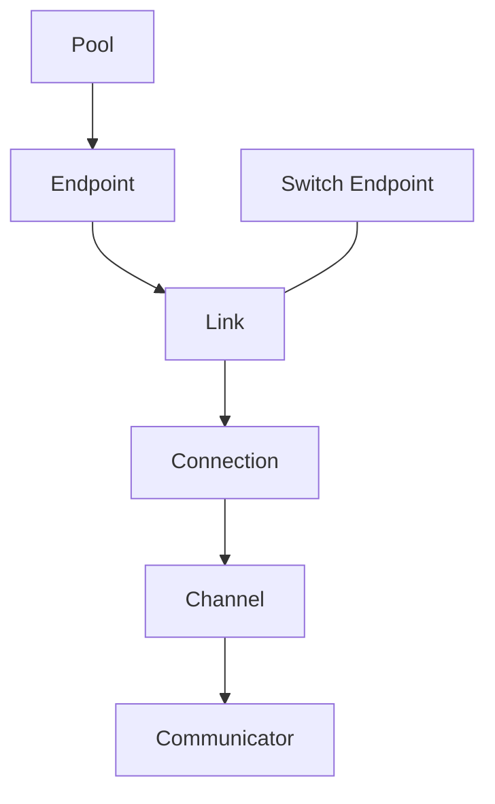

# Summary

建立一套可组合、可搜索的通信拓扑模型，把“可达性”与“执行路径”解耦：

- 以 **Pool / Endpoint / Link** 结构化表达拓扑图。
- 以 **Connection** 封装真实通信实现（RDMA/TCP/SHM 等）。
- 以 **Channel / Communicator** 管理多跳路径、多路径并行与策略选择。
- 引入 **Switch Endpoint / SW Link**，把交换结构压缩为可搜索的图结构，避免端到端组合爆炸。

该模型为后续的 **multipath、拓扑选路、故障切换** 提供统一的数据结构与统计入口，并可在不重写现有传输层的前提下演进。

# Goals / Non-Goals

## Goals

- 明确表达“资源域 + 设备端点 + 链路”的拓扑关系，并可被路径搜索直接消费。
- 用 Switch Endpoint / SW Link 把交换结构压缩进图模型，避免枚举式组合爆炸。
- 在 Communicator 内引入“多路径 + 多跳”的抽象，支持基于统计的路径选择与故障切换。
- 兼容现有 Communicator 传输实现与配置模型，允许渐进式迁移。

## Non-Goals

- 重写 RDMA/TCP/MTCP 传输实现或复制引擎。
- 改变 P2P 选源策略（Global Store 的 replica 选择策略不在本设计范围）。
- 在首版就实现跨节点的全局最优路由（首版以局部图、局部策略为主）。

# Architecture & Interfaces

## 分层结构

- **Topology 表达层**：`Pool / Endpoint / Link` 表达可达性与结构。
- **执行层**：`Connection` 封装真实传输（RDMA/TCP/SHM 等）。
- **调度复用层**：`Channel / Communicator` 管理多跳路径与策略选择。

## 对象模型（字段语义）

### Pool（资源域）
- 作用：描述资源归属与上下文（CPU/GPU/NUMA 等），为端点提供亲和与策略边界。
- 关键字段：
  - `type`：CPU / GPU
  - `uuid`
  - `endpoint_list`

### Endpoint（传输端点）
- 作用：通信单边实体；承载设备能力与拓扑属性。
- 类型：
  - **Client Endpoint**：真实设备端点（NIC/PCIe/NVLink/UPI）。
  - **Switch Endpoint**：仅用于路径搜索的抽象交换节点。
- 关键字段：
  - `type`：NIC / PCIE / NVLINK / UPI + Client 或 Switch
  - `pool`
  - `name` / `uuid`
  - `bw`（用于路径打分与 striping 权重）
  - `communicators_map`：`{ dst: [communicator_list] }`
  - `link_list`：从该端点出发的 Link
  - （可选）`buffer_manager` / `channel_list`

### Link（拓扑边）
- 作用：拓扑图上的“可达性边”；服务于路径搜索，而非直接等同真实连接。
- 关键字段：
  - `name` / `uuid`
  - `bw` / `latency`
  - `src_endpoint` / `dst_endpoint`
  - `type`：`FORWARD / P2P / SW`
  - `connections`：`{ dst: { proto: connection } }`

### Connection（真实连接封装）
- 作用：可执行的通信通道封装（协议 + 端点 + 实现对象）。
- 关键字段：
  - `type`：`POOL_FWD / P2P / SW`
  - `proto`：SHM / RDMA / TCP / ...
  - `src_endpoint` / `dst_endpoint`
  - `link_list`：多跳时的实际 Link 列表
  - `comm_method`：具体通信实现对象（QP / socket / ring）
  - `mct_map`：`{ msg_size: mct }`

### Channel（路径）
- 作用：从 src 到 dst 的一条具体路径（多跳 Connection 序列）。
- 关键字段：
  - `uuid`
  - `src_endpoint` / `dst_endpoint`
  - `hop_list`：`[connection0, connection1, ...]`

### Communicator（点到点聚合）
- 作用：一个 src ↔ dst 对之间的通信能力聚合，管理多条 Channel。
- 关键字段：
  - `uuid`
  - `src_endpoint` / `dst_endpoint`
  - `channel_list`
  - `mct_map`：`{ channel: { msg_size: mct } }`

## Switch Endpoint / SW Link 的作用

交换结构（PCIe switch、NVSwitch、网络交换机、bond/team 等）会导致端到端路径组合爆炸。引入 Switch Endpoint / SW Link 后：

- 拓扑以图形式表达，路径搜索在图上进行。
- Link 代表可达性与属性，不再提前枚举所有端到端组合。
- SW Link 下可挂多个 Connection，用于表达“同一拓扑边的多种实现”。

# Multipath / Topology Routing / Failover 支撑

该模型原生支持后续 TODO：

1. **Multipath**：Communicator 管理多条 Channel，可基于 `mct_map` 做 striping 和权重选择。
2. **拓扑选路**：路径搜索可用 BW/latency/拥塞/失败率等作为代价函数，支持 k-shortest 或多约束搜索。
3. **故障切换**：Link/Connection 健康状态变化时，路径搜索可回避故障边，并在 Communicator 中切换 Channel。
4. **统计闭环**：`mct_map` 作为 per-connection / per-channel 成本缓存，配合 runtime 统计形成自适应路由。

# Error Model & Invariants

- 图必须是可连通的（src/dst 至少存在一条可达路径）。
- Switch Endpoint 只参与路径搜索，不直接承载传输对象。
- Connection 的生命周期与底层传输对象一致，连接不可用应及时从路径候选集中剔除。
- 路由选择失败必须降级：回退到单路径或现有默认直连策略。

# Schema Changes (if any)

无。

# Naming Compliance

- 类/结构体（PascalCase）：`Pool`、`Endpoint`、`Link`、`Connection`、`Channel`、`Communicator`。
- 函数/方法（snake_case）：`build_topology`、`find_channels`、`select_channel`、`update_mct`。
- 常量/枚举（ALL_CAPS）：`SW_LINK`、`P2P_LINK`、`FORWARD_LINK`。

# Trade-offs & Risks

- **复杂度增加**：引入拓扑图与路径搜索，需要严格的可视化与可观测性支撑。
- **配置负担**：需要新的拓扑配置结构，必须提供兼容映射与默认生成策略。
- **运行时开销**：路径搜索与统计更新需要边界控制（缓存、周期更新）。

# Compatibility & Acceptance Criteria

- 现有 `Communicator::read_tensor` 等调用保持可用，默认行为不退化。
- 新拓扑模型可在单机和多机环境下建立可达路径并找到至少一条 Channel。
- 在模拟故障（断链、握手失败）下，路径可自动切换且不导致全局崩溃。
- 统计数据可持续更新，并在路径选择中可见生效。

# References

- `core/communicator/README.md`
- `core/communicator/docs/comm-read-tensor.md`
- `docs/architecture/p2p-transfer-strategies.md`
- `proto/tensorcast/communicator/v1/communicator_config.proto`
