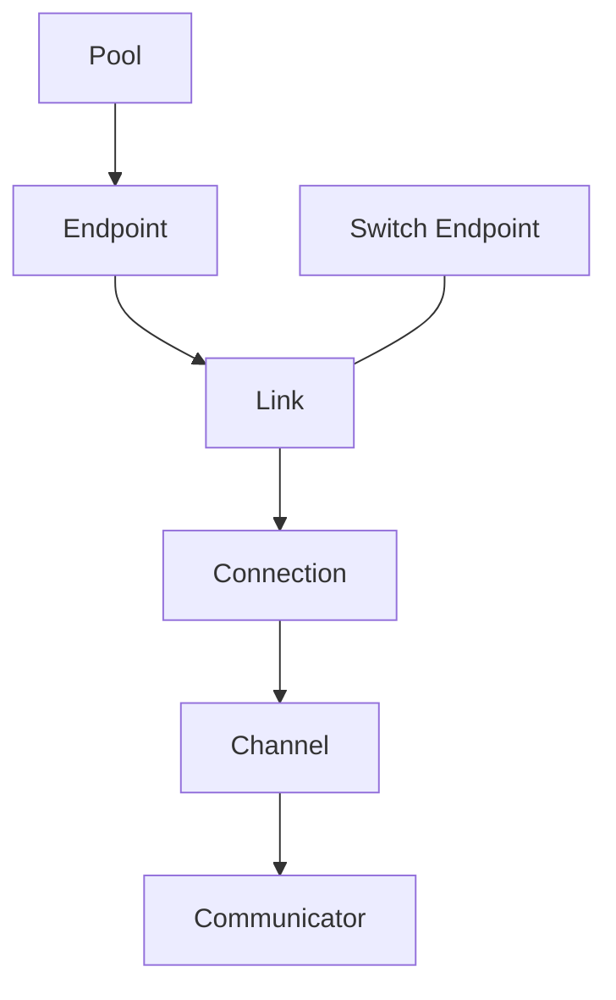

# Summary

Define a composable and searchable communication topology model that decouples
"reachability" from "execution path":

- use **Pool / Endpoint / Link** to express topology as a graph
- use **Connection** to wrap executable transports (RDMA/TCP/SHM, etc.)
- use **Channel / Communicator** to manage multi-hop paths, multipath parallelism,
  and policy selection
- introduce **Switch Endpoint / SW Link** to compress switching structures into a
  searchable graph and avoid end-to-end combination explosion

This model provides a unified data structure and statistics entry point for
future **multipath routing, topology-aware routing, and failover**, while
allowing incremental adoption without rewriting the existing transport stack.

# Goals / Non-Goals

## Goals

- Represent topology relations as "resource domain + device endpoint + link" and
  make them directly consumable by path search.
- Compress switching structures into the graph via Switch Endpoint / SW Link
  instead of pre-enumerating combinations.
- Introduce "multipath + multi-hop" abstractions inside Communicator, with
  stats-aware path selection and failover.
- Stay compatible with existing Communicator transports and config model, and
  support incremental migration.

## Non-Goals

- Rewriting RDMA/TCP/MTCP transport implementations or copy engines.
- Changing P2P source-selection policy (Global Store replica selection is out
  of scope for this design).
- Delivering global optimal cross-node routing in v1 (v1 focuses on local
  graphs and local policies).

# Architecture & Interfaces

## Layered Model

- **Topology expression layer**: `Pool / Endpoint / Link` represent structure
  and reachability.
- **Execution layer**: `Connection` wraps executable transport objects
  (RDMA/TCP/SHM, etc.).
- **Scheduling and reuse layer**: `Channel / Communicator` manage multi-hop
  paths and policy selection.

## Phase 2 Wrapper Refinement

Phase 2 introduces a routing wrapper layer that maps Topology to existing
communication execution without changing current data-plane behavior:

- **RoutingContext**: holds `Topology` and `EndpointBinding`
  (`node_id / ip / port / device_ids`) and builds routed communicators for
  `src -> dst`.
- **RouteChannel**: represents one route path (Phase 2 supports direct 1-hop
  only; multi-hop returns `UNIMPLEMENTED`).
- **ConnectionAdapter**: execution adapter wrapper; `EngineAdapter` reuses
  `engine::Communicator`, and `NvlinkAdapter` is a placeholder implementation.
- **Stats/Health**: `ConnectionStats` / `LinkStats` track success/failure/
  latency/last_error and derive `HealthState` for later routing decisions.

NVLINK selection rule: same-node + NVLINK endpoints + available adapter implies
NVLINK path; otherwise fall back to `AUTO` (engine path). This wrapper is not
yet wired into the P2P read path and will be integrated in Phase 4.

## Object Model (Field Semantics)

### Pool (Resource Domain)

- Role: describes resource ownership and context (CPU/GPU/NUMA), and provides
  affinity and policy boundaries for endpoints.
- Key fields:
  - `type`: CPU / GPU
  - `uuid`
  - `endpoint_list`

### Endpoint (Transfer Endpoint)

- Role: one-side communication entity carrying device capability and topology
  attributes.
- Types:
  - **Client Endpoint**: concrete device endpoint (NIC/PCIe/NVLink).
  - **Switch Endpoint**: abstract switch node used only by path search.
- Key fields:
  - `type`: NIC / PCIE / NVLINK + Client or Switch
  - `pool_ids`
    - NIC/PCIE: at least one CPU pool + one GPU pool
    - NVLINK: GPU pools only (empty CPU pool)
    - Switch: no pool binding
  - `name` / `uuid`
  - `bw` (path scoring and striping weight)
  - `communicators_map`: `{ dst: [communicator_list] }`
  - `link_list`: outgoing links from this endpoint
  - (optional) `buffer_manager` / `channel_list`

### Link (Topology Edge)

- Role: reachability edge in the topology graph; used by path search and not
  equivalent to a concrete connection object.
- Key fields:
  - `name` / `uuid`
  - `bw` / `latency`
  - `src_endpoint` / `dst_endpoint`
  - `type`: `FORWARD / P2P / SW`
  - `connections`: `{ dst: { proto: connection } }`

### Connection (Executable Connection Wrapper)

- Role: executable communication wrapper (protocol + endpoints + implementation
  object).
- Key fields:
  - `type`: `POOL_FWD / P2P / SW`
  - `proto`: SHM / RDMA / TCP / ...
  - `src_endpoint` / `dst_endpoint`
  - `link_list`: concrete link list for multi-hop
  - `comm_method`: concrete implementation object (QP / socket / ring)
  - `mct_map`: `{ msg_size: mct }`

### Channel (Path)

- Role: one concrete path from source to destination (a sequence of Connection
  hops).
- Key fields:
  - `uuid`
  - `src_endpoint` / `dst_endpoint`
  - `hop_list`: `[connection0, connection1, ...]`

### Communicator (Point-to-Point Aggregation)

- Role: communication-capability aggregation for one `src <-> dst` pair,
  managing multiple channels.
- Key fields:
  - `uuid`
  - `src_endpoint` / `dst_endpoint`
  - `channel_list`
  - `mct_map`: `{ channel: { msg_size: mct } }`

## Why Switch Endpoint / SW Link

Switching structures (PCIe switch, NVSwitch, network switch, bond/team, etc.)
otherwise trigger end-to-end path explosion. With Switch Endpoint / SW Link:

- topology is represented as a graph and searched directly
- links represent reachability and attributes without pre-enumerating all
  endpoint pairs
- one SW link can host multiple connections to represent multiple
  implementations on the same topology edge

# Multipath / Topology Routing / Failover Support

This model natively supports future work:

1. **Multipath**: Communicator manages multiple channels and can perform
   striping and weighted selection via `mct_map`.
2. **Topology-aware routing**: path search can use BW/latency/congestion/failure
   rate as cost functions (k-shortest or constrained search).
3. **Failover**: path search can avoid degraded edges and switch channels when
   link/connection health changes.
4. **Stats feedback loop**: `mct_map` acts as per-connection/per-channel cost
   cache and can be combined with runtime stats for adaptive routing.

# Error Model & Invariants

- The graph must remain connected (at least one reachable path for each
  `src/dst` pair).
- Switch Endpoint participates in path search only and does not carry transfer
  objects directly.
- Connection lifecycle must stay aligned with underlying transport object
  lifecycle; unavailable connections must be removed from candidate paths in
  time.
- Routing selection failure must degrade safely to single path or existing
  default direct-connection policy.

# Schema Changes (if any)

None.

# Naming Compliance

- Classes/structs (PascalCase): `Pool`, `Endpoint`, `Link`, `Connection`,
  `Channel`, `Communicator`.
- Functions/methods (snake_case): `build_topology`, `find_channels`,
  `select_channel`, `update_mct`.
- Constants/enums (ALL_CAPS): `SW_LINK`, `P2P_LINK`, `FORWARD_LINK`.

# Trade-offs & Risks

- **Higher complexity**: adding graph modeling and path search requires strong
  observability and visualization support.
- **Configuration overhead**: a new topology config structure is required and
  must provide compatibility mapping and default generation.
- **Runtime overhead**: path search and stats updates require bounded control
  (cache and periodic refresh).

# Compatibility & Acceptance Criteria

- Existing calls such as `Communicator::read_tensor` remain available, with no
  default behavior regression.
- The new topology model can build reachable paths on both single-host and
  multi-host environments and find at least one channel.
- Under simulated failures (link down, handshake failure), route switching
  works without global crash.
- Stats continue to update and are visibly consumed by path selection.

# References

- `core/communicator/README.md`
- `core/communicator/docs/comm-read-tensor.md`
- `docs/architecture/p2p-transfer-strategies.md`
- `proto/tensorcast/communicator/v1/communicator_config.proto`
