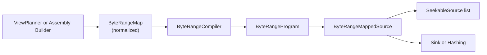

# Summary

Unify all linear byte-range mapping in TensorCast under a single contracts-level IR, `ByteRangeMap`, and a single
compiled execution artifact, `ByteRangeProgram`. This replaces the current parallel structures (`SegmentPiece`,
`AssemblySegment`, `SelectionPlan::Range`) and their duplicated mappers with one canonical mapping + one unified
execution engine, preserving (and in assembly improving) performance by keeping strided and contiguous optimizations
intact while enabling mapped direct-write into UMA **CPU VA** windows.

This is a hard cutover for the mapping IR and executor. There is no legacy-IR compatibility layer; all data-plane paths
(view execution, assembly, hashing, materialize-into-target) move to the unified mapping + program.

This design generalizes the “compiled execution program (runs + index + strided cache)” approach introduced for the view
path in `docs/designs/0054-stride-aware-view-plan-source.md` and makes it the single copy/fill executor across the repo.

# Decisions (Hard Cutover, No Compatibility)

This repository is not yet deployed. Therefore, this design intentionally chooses *strong contracts* over backward
compatibility to reduce long-term complexity and ambiguity.

1. **`SeekableSource` is sized**: all seekable byte streams have a stable length known at construction time. The
   interface MUST expose this (`total_bytes()` or equivalent). Short reads are defined relative to this length.
2. **One direct-write API**: replace the legacy identity direct-write (`supports_direct_write` / `read_into`) with mapped
   direct-write only (`supports_direct_write_at` / `read_into_at(src_offset, dest_va_offset, ...)`). Identity mapping is
   just a special case where `src_offset == dest_va_offset`.
3. **No implicit PAD insertion in normalization**: PAD bytes are part of *ByteSpace semantics* and MUST be represented
   explicitly by builders as `kPad` segments. Normalization is purely structural (sort/merge/validate) and MUST reject
   any destination gaps as `INVALID_ARGUMENT` (builder bug), not paper them over.
4. **Coverage failures do not produce a map**: missing coverage (e.g., missing pieces) is surfaced as `UNAVAILABLE` with
   `PartialCoverageDetail` and *no* `ByteRangeMap` is compiled/executed for those bytes.
5. **Cache keys must be correctness-safe**: `map_fingerprint` is an in-process cache key and debug handle, but it MUST be
   collision-resistant enough that collisions are treated as a bug, not a tolerated risk. Use a stable versioned hash
   over the normalized map.

# Guiding Principles (Normative)

1. **ByteSpace != Coverage**: `ByteRangeMap` describes *a logical ByteSpace mapping* (including PAD=0 semantics). It must
   not silently "invent data" to paper over *missing coverage*; missing coverage is surfaced as `UNAVAILABLE` with
   machine-actionable missing **byte** ranges (units: bytes) (RPC: `PartialCoverageDetail` anchored by `HashSpaceRef`).
2. **Global, sized `SeekableSource` contract**: `SeekableSource` must expose its stable length and has a strong
   short-read contract for both `read_at` and `read_into_at`. Byte-range executors and pipelines rely on it for
   correctness and determinism.
3. **No implicit padding**: PAD bytes are an explicit part of the logical mapping (`kPad` segments / `PadRun`). They are
   never inferred at execution time and MUST NOT be used to paper over missing data.
4. **Composable direct-write**: direct-write is a capability of *sources* and *sinks*; wrappers (like the unified mapper)
   must preserve it when safe and disable it explicitly when not (this cutover does not change `pump_ranges` semantics).
5. **Per-source strided**: strided execution is a per-source local optimization (never merges across sources).
6. **One copy engine**: all range-copy / zero-fill execution MUST go through `ByteRangeProgram` + `ByteRangeMappedSource`
   (the `AssemblyGraph` copy executor). Do not reintroduce per-path mappers.
7. **Observability by design**: metrics are first-class and unified across view/assembly/hash/into-target; no legacy
   metric names are required.

# Goals / Non-Goals

## Goals

1. **Single linear IR**: one canonical byte-range mapping across view selection, assembly, and canonical linearization.
2. **Single execution path**: one mapper from logical output offsets to source reads with explicit PAD semantics.
3. **Performance non-regression**: preserve strided execution behavior, avoid extra memcpy calls, and reduce per-read
   overhead with compiled run metadata and caching.
4. **Mapped direct-write**: enable assembly to write directly into UMA CPU VA windows when sources and sinks support it
   (CPU VA only in this cutover).
5. **Clear invariants**: explicit normalization and validation to prevent silent gaps, overlaps, or ambiguous semantics.
6. **Config-driven heuristics**: all strided thresholds and toggles flow through the unified runtime config system.

## Non-Goals

- Unify or modify control-plane orchestration plans (`PlanSpec`, `PlanStep`, `PlanAction`).
- Change view transform semantics or the ViewSpec language.
- Change Global Store schema or persistent metadata formats.
- Preserve backward compatibility with existing IRs or adapters.

# Scope (This Cutover)

This design is a **hard cutover** target state. Implementation may be phased (see the paired plan), but the end state is
binary: all linear byte mapping executes via `ByteRangeMap` + `ByteRangeProgram` + `ByteRangeMappedSource`.

## In scope (required in this cutover)

- **Contracts + normalization**:
  - Define `ByteRangeSegment` and `ByteRangeMap` (explicit `kPad`; no implicit padding).
  - Make normalization + validation the single gate before compilation/execution (structural canonicalization only:
    sort/merge/validate; destination gaps are rejected).
  - Enforce the “ByteSpace != Coverage” rule: missing coverage is surfaced as `UNAVAILABLE` and does not produce a map.
- **Compiled program + unified mapper**:
  - Implement `ByteRangeCompiler` + `ByteRangeProgram` (runs + indices) and `ByteRangeMappedSource` execution for:
    - `PadRun` (zero fill)
    - `ContiguousRun` (single-source contiguous read)
    - `StridedRun` (single-source strided coalesced read + pack, with per-instance cache)
- **Repo-wide short-read contract**:
  - Make `loader::SeekableSource` a *sized* interface and enforce strong short-read behavior for both `read_at` and
    `read_into_at`; update implementations to comply.
- **Mapped direct-write (CPU VA only)**:
  - Replace the legacy identity direct-write API with mapped direct-write APIs
    (`supports_direct_write_at` / `read_into_at`).
  - Enable mapped direct-write in the unified mapper for `PadRun` and `ContiguousRun` when supported by source + sink.
  - **A1 eligibility**: enable mapped direct-write only when the compiled program contains no `StridedRun` entries
    (program-level gating).
- **Unified config + observability**:
  - Add `engine.byte_mapping` config under unified runtime config and drive compiler heuristics from it.
  - Emit unified `tc_byte_range_*` metrics across all paths.
- **All data-plane paths migrate**:
  - View selection execution, assembly execution, hashing byte streams, and materialize-into-target all use the unified
    mapping + program (no parallel executors remain).

## Explicitly deferred (not part of this cutover)

- **AssemblyGraph implementation**: this design defines the range-copy executor that `AssemblyGraph` can call into, but
  does not require implementing `AssemblyGraph` itself.
- **GPU VA direct-write**: remote → GPU VA grants and semantics are out of scope (CPU VA grants only).
- **Scatter direct-write**: no “scatter RDMA” API for strided writes in this cutover.
- **Window-scoped direct-write fallback**: `pump_ranges` remains range-scoped and sticky; resuming direct-write after a
  window failure within the same range is deferred.
- **Mixed-mode direct-write**: enabling mapped direct-write for programs containing any `StridedRun` (A2/A3) is deferred.
- **Cross-process / cross-version program identity**: `ByteRangeProgram` is a process-local derived execution artifact
  and MUST NOT be serialized/persisted or treated as a stable plan format. `map_fingerprint` is a versioned, in-process
  debug/cache key only.
- **Transform execution unification**: transpose/compute edges remain in dedicated executors; this design only unifies
  linear range mapping for copy/fill.

# Architecture & Interfaces

## Overview

The map is built once, normalized into a canonical form, compiled into execution runs, and executed by a single mapper
that supports both single-source and multi-source (assembly) maps with explicit PAD semantics.

## Layering & Responsibilities (Required)

This cutover draws a hard line between *layout*, *coverage*, and *execution* to prevent silent corruption and to keep the
system evolvable as `AssemblyGraph` grows (transforms, overlaps, proofs).

- **Builders / planners (layout + coverage)**:
  - Produce a full-coverage logical layout as `ByteRangeMap` with explicit `kPad` segments.
  - Detect missing coverage *before* producing a map; on failure return `UNAVAILABLE` with `PartialCoverageDetail`
    anchored by `HashSpaceRef`.
  - Are responsible for mapping missing canonical ranges into a target/view hash-space when applicable.
- **Normalization (structural correctness only)**:
  - Canonicalizes and validates maps (sort/merge/overflow checking).
  - Rejects destination gaps/overlaps as `INVALID_ARGUMENT`.
  - Never “fills PAD” and never returns `UNAVAILABLE`.
- **Compiler (performance only)**:
  - Converts a normalized `ByteRangeMap` to a `ByteRangeProgram` using config-driven heuristics (strided detection,
    cache sizing).
  - Never changes byte semantics; only changes how the same bytes are fetched/packed.
- **Mapper (execution + enforcement)**:
  - Executes `ByteRangeProgram` over sized `SeekableSource` inputs and enforces the global short-read contract.
  - Implements A1 direct-write gating for composability under current `pump_ranges` semantics.

## Relationship to AssemblyGraph (Future Alignment)

This cutover does **not** require implementing `AssemblyGraph`, but it *does* define the long-lived, canonical executor
that `AssemblyGraph` must call for the copy/fill family of nodes. Do not introduce a second range-copy engine later.

`docs/designs/0059-piece-assembly-v2.md` introduces an `AssemblyGraph` IR that composes range-copy and transform nodes.
This design provides the canonical implementation for the **range-copy** family of nodes:

- `CopyRanges` → `ByteRangeMap` + `ByteRangeProgram` + `ByteRangeMappedSource`
- `FillZeros` → `kPad` segments / `PadRun`

Transform nodes (e.g., transpose) remain out of scope and continue to execute via dedicated transform executors.

## Contracts-level IR

### ByteRangeSegment

A single output segment.

- `kind`: `kData` or `kPad`
- `dst_offset`: output offset in the logical byte stream
- `length`: number of bytes
- `src_offset`: source offset, valid only for `kData`
- `source_index`: 0-based selector into the provided `SeekableSource` list
  - Single-source maps use `source_index = 0` everywhere.
  - For `kPad`, execution ignores `source_index` and normalization forces it to `0`.

### Coordinate spaces (Required)

This design uses multiple offset spaces that MUST NOT be conflated:

| Name | Meaning |
| --- | --- |
| `dst_offset` | Offset in the logical *output* byte stream defined by a `ByteSpaceRef` (the map/program “destination”). |
| `src_offset` | Offset in an *input* `SeekableSource` byte stream selected by `source_index` (the map/program “source”). |
| `dest_va_offset` | Offset in the destination replica VA space authorized by a `DirectWriteGrant` (direct-write only). |

Sizing:

- `ByteRangeMap.total_bytes` is the logical output length of the mapped stream.
- Each input `SeekableSource` is *sized* and exposes `total_bytes()` (or equivalent) for its own stream.

### ByteRangeMap

Canonical linear mapping.

- `total_bytes`: total logical output length
- `num_sources`: number of sources referenced by this map (single-source maps use `1`)
- `segments`: ordered, normalized segment list covering `[0, total_bytes)` with **no gaps**
  - Any logical zeros MUST be represented explicitly as `kPad` segments.
  - Any destination gap after normalization is `INVALID_ARGUMENT` (builder bug), not “missing coverage”.

### ByteSpace vs Coverage (Required)

`ByteRangeMap` is a *ByteSpace mapping* (logical layout). Separately, the system may be unable to execute the mapping
because the selected sources do not cover the required ranges (P2P misses, missing pieces, disk hint missing, etc.).

This design follows `docs/designs/0059-piece-assembly-v2.md` terminology:

- `ByteSpaceRef` identifies the logical byte layout domain (canonical vs view).
- `HashSpaceRef` identifies the **verifiable byte stream** for hashing/coverage reporting, and is the anchor for
  `PartialCoverageDetail` and `PartialLeafCoverageDetail`.

Rules:

- **PAD semantics are normative**: `kPad` bytes are defined as zeros and may be materialized via memset/zero-fill.
- **Coverage gaps are not PAD**: uncovered `kData` ranges must not be turned into `kPad`. Instead, the builder must fail
  with `UNAVAILABLE` and provide machine-actionable missing ranges:
  - When surfaced over RPC, missing ranges MUST be represented via `PartialCoverageDetail` (anchored by `HashSpaceRef`,
    units: bytes).
  - Internal helpers may return a typed missing-range structure.
- This design uses **coverage** to mean missing **byte** ranges only. Missing Merkle leaf digests are a separate
  concern and MUST be represented via `PartialLeafCoverageDetail` (units: leaf indices) where applicable.
- Missing ranges are expressed in the byte stream referenced by the attached `HashSpaceRef` (units: bytes). Each
  `PartialCoverageDetail.hash_space` MUST refer to the same byte stream as its `missing_ranges`.
  - Canonical byte stream: `HashSpaceRef.byte_space.kind=CANONICAL` and `canonical_index_multihash` set.
  - View byte stream: `HashSpaceRef.byte_space.kind=VIEW` and `byte_space.id=view_id`.
- **Assembly missing coverage (required)**:
  - The error MUST include missing ranges in the **canonical** hash-space (actionable for scheduling and piece
    selection).
  - If the assembly target is a view ByteSpace and the mapping is selection-only (no transforms), the error SHOULD also
    include the mapped missing ranges in the target/view byte stream for user/debug convenience. Mapping is computed by
    intersecting missing canonical ranges with the selection mapping and translating into output `dst_offset` ranges.

### Normalization & Validation (Required)

Builders may emit a raw, non-canonical segment list. Normalization produces the canonical form that is the only form
accepted by compilation/execution.

Crucially, **normalization does not invent PAD**. It must never convert “unmapped output” into zeros. Any `kPad` bytes
must already exist as explicit segments emitted by the builder.

Missing coverage is handled *before* producing a map:

- If the system cannot cover required `kData` bytes with the selected sources, builders MUST return `UNAVAILABLE` with
  machine-actionable missing ranges (`PartialCoverageDetail` anchored by `HashSpaceRef`) and MUST NOT emit a
  `ByteRangeMap` for those bytes.
- Therefore, any destination gap in a produced map is a malformed mapping and is treated as `INVALID_ARGUMENT`.

Rules for the normalized map:

- Segments are sorted by `dst_offset`, non-overlapping, and bounded within `[0, total_bytes)`.
- The map covers `[0, total_bytes)` with no gaps (gaps are `absl::InvalidArgumentError`).
- Adjacent segments with the same `kind`, `source_index`, and compatible offsets are merged.
- `kPad` segments must have `src_offset = 0` and `source_index = 0`.
- Zero-length segments are dropped.
- For `kData`, `source_index` must satisfy `source_index < num_sources`.
- Any overlap, out-of-bounds range, invalid `num_sources`, invalid source index, or integer overflow yields
  `absl::InvalidArgumentError`.

### Builder requirements by path (Required)

All builders must adhere to the “no implicit PAD” rule and produce an executable logical layout:

- Canonical index → `ByteRangeMap`:
  - The canonical index is authoritative for layout. Any index-defined “holes” are semantic zeros and MUST be emitted as
    explicit `kPad` segments by the builder.
  - Builders MUST produce full coverage of `[0, total_bytes)` with `kData` + `kPad` segments (no gaps).
- View selection → `ByteRangeMap`:
  - View PAD=0 semantics are part of the view ByteSpace and MUST be emitted as explicit `kPad` segments by the builder.
  - Builders MUST produce full coverage of `[0, total_bytes)` with `kData` + `kPad` segments (no gaps).
- Assembly (piece composition) → `ByteRangeMap`:
  - Builders MUST validate source coverage for all required `kData` bytes.
  - On any missing coverage, builders MUST return `UNAVAILABLE` with machine-actionable missing ranges and MUST NOT emit
    a `ByteRangeMap` for those bytes.
  - If the assembly target is selection-only view ByteSpace, builders SHOULD include both:
    - canonical missing ranges (required), and
    - missing ranges mapped into the target/view byte stream (debug convenience).
- Hashing / canonical streaming sources:
  - Use the same canonical/view builders. Hashing MUST not introduce ad-hoc padding rules.

### Worked examples (Layout PAD vs Missing Coverage)

Example A: logical PAD is explicit in the map.

Input (raw, non-canonical builder output):

- `total_bytes = 24`, `num_sources = 1`
- segments:
  - `kData dst_offset=0  length=8  source_index=0  src_offset=100`
  - `kPad  dst_offset=8  length=8`
  - `kData dst_offset=16 length=8  source_index=0  src_offset=116`

Normalization:

- Sort/merge/validate; the output already covers `[0, 24)` with no gaps.

Compilation:

- Emits three runs in `dst_offset` order:
  - `ContiguousRun(dst=[0,8), source_index=0, src_begin=100)`
  - `PadRun(dst=[8,16))`
  - `ContiguousRun(dst=[16,24), source_index=0, src_begin=116)`

Direct-write eligibility (A1):

- This program contains no `StridedRun`, so it is eligible for mapped direct-write when enabled and when the underlying
  source(s) support `supports_direct_write_at/read_into_at`.

Example B: missing coverage fails *before* producing a map.

- If the builder cannot cover required `kData` bytes (e.g., pieces missing `[off=8,len=8]` in canonical space), it
  returns `UNAVAILABLE` and attaches `PartialCoverageDetail{hash_space=..., missing_ranges=[{off=8,len=8}]}` (units:
  bytes). No `ByteRangeMap` is compiled/executed for those bytes.

## Compiled Execution Program

### ByteRangeProgram

Compiled from a normalized `ByteRangeMap` and executed by the mapper. The program is immutable and safe to share across
threads and read calls. Any mutable cache state is owned by the execution instance (`ByteRangeMappedSource`) rather
than stored in the program.

#### Program lifetime and stability (Required)

`ByteRangeProgram` is a process-local derived execution artifact.

- It MUST NOT be persisted, sent over RPC, or treated as a cross-process stable plan format.
- Any debug-dump format is best-effort only and may change without compatibility guarantees.
- System-wide “which bytes” identities MUST continue to use `(logical_layout_hash, selection_hash)` (see
  `docs/designs/0055-programmable-framework.md`), not `map_fingerprint`.

#### Program structure

- `runs`: execution runs (all include `dst_begin`, `dst_end`)
  - `PadRun`
  - `ContiguousRun` (single-source contiguous; includes `source_index` and `src_begin`)
  - `StridedRun` (single-source strided; includes `source_index`, `src_base`, `row_len`, `stride`, `rows`,
    `rows_per_block`)
- `run_starts`: sorted `dst_begin` array for `upper_bound` indexing
- `total_bytes`
- `map_fingerprint`: stable, versioned fingerprint of the normalized map (cache key + debug correlation)
- `config_fingerprint`: fingerprint of the relevant runtime config used by the compiler (cache safety)

### Fingerprints (Required)

This design uses fingerprints for **cache safety and debug correlation only**. They are not system-wide selection
identities (see “Identity alignment”).

`map_fingerprint` requirements:

- MUST be deterministic and derived from the **normalized** map.
- MUST be **versioned**: include an explicit version tag so implementation changes cannot accidentally collide with older
  formats.
- MUST cover all semantics-affecting fields: `total_bytes`, `num_sources`, and every segment’s
  `(kind, dst_offset, length, source_index, src_offset)` (with `kPad` canonicalized to `source_index=0, src_offset=0`).
- MUST be at least **128-bit** and produced by a stable hashing algorithm. Do not use `std::hash` / `absl::Hash` as the
  sole mechanism for the cache key.

`config_fingerprint` requirements:

- MUST be derived only from compiler-relevant fields (strided enable + thresholds + block sizing).
- MUST be versioned in the same sense as `map_fingerprint` (explicit version tag).

### ByteRangeCompiler

A deterministic compiler that builds `ByteRangeProgram` and owns the strided heuristics. It is the single place that
recognizes strided patterns and configures block caching. This preserves the current performance benefits of
`ViewPlanSource`.

Key properties:

- Strided detection logic and thresholds are carried over from
  `core/store/materialization/dataplane/view/view_plan_source.cc`.
- Strided detection is path-agnostic: any `ByteRangeMap` (view/assembly/hash/into-target) may compile into `StridedRun`
  entries when eligible and when `enable_strided_execution=true`.
- All heuristics and toggles are driven by unified runtime config (see "Configuration").
- Normalization performs sorting; compilation is O(n) on the normalized segment list.
- Compiled programs are cacheable and safe to reuse across read calls and threads when keyed by
  `(map_fingerprint, config_fingerprint)`.
- `map_fingerprint` is **not** a system-wide selection identity. It is used for in-process caches and debug correlation
  only, but must still be collision-resistant enough for correctness.
- Any compiled-program cache must be **bounded** (e.g., fixed-size LRU) to avoid unbounded memory growth under diverse
  view/assembly workloads.

### Compiled-program cache (Required, This cutover)

This cutover requires a bounded, in-process cache for compiled programs to avoid per-request recompilation overhead.

Requirements:

- Cache key: `(map_fingerprint, config_fingerprint)`.
- Eviction policy: fixed-size LRU by entry count.
- Capacity: `engine.byte_mapping.program_cache_entries` (fixed-size LRU by entry count; default `256` via config
  normalization).
- Thread safety: concurrent lookups are allowed; insert/eviction are safe under concurrency.
- The cache is process-local only (no persistence, no cross-version stability requirements).
- Cache observability MUST emit `tc_byte_range_program_cache_*` hit/miss/eviction counters.
- Preferred safety check: store cheap map invariants (e.g., `total_bytes`, `num_sources`, segment count) in the cache
  entry and validate them on lookup; treat mismatches as an internal error and recompile.

### Identity alignment (Future Alignment)

This section is **alignment only** and is not required to complete this cutover.

System-level identities for "which bytes" MUST reuse the artifact/view identity scheme (see
`docs/designs/0055-programmable-framework.md` and `docs/designs/0042-region-backed-tensor-dict-into.md`):

- `logical_layout_hash` (base ByteSpace identity)
- `selection_hash` (view/subset selection identity)

`map_fingerprint` exists to support internal caches and debug correlation; it MUST NOT become a third, competing
system-wide selection identity.

### Strided scope (Required)

Strided execution is a **per-source local optimization**:

- `StridedRun` is emitted only when all contributing segments refer to the same `source_index`.
- Multi-source maps may contain multiple `StridedRun`s, but each strided run is single-source and uses a run-local cache.
- No merging across sources is permitted in compilation or execution.

## Unified Mapper

### ByteRangeMappedSource

A unified mapper that executes a `ByteRangeProgram` for both single-source and multi-source maps. It replaces
`PlanBackedSeekableSource`, `AssemblySource`, and the linearized plan adapters.

- Construction validates `sources.size() >= map.num_sources` and fails fast if the map references missing sources.
- Construction validates that all `kData` source reads are in-bounds for each referenced source (e.g.,
  `src_offset + length <= sources[source_index].total_bytes()`); violations are `InvalidArgument` (map/source mismatch).
- `read_at(offset, dst, bytes)` locates the run with `upper_bound` and executes runs in order.
- `kPad` runs zero-fill without touching sources.
- `kContiguous` runs invoke `read_at` on the selected source.
- `kStrided` runs use block cache and packing identical to the existing view path.

### Strided fallback semantics (Required)

Strided execution is an optimization. It must never compromise correctness, and it must degrade safely under memory
pressure.

Two fallback modes are required:

- **Compile-time fallback**: when strided is disabled by config or fails strided eligibility heuristics, the compiler MUST
  emit equivalent baseline `ContiguousRun` execution (no `StridedRun` emitted).
- **Runtime fallback**: even for an emitted `StridedRun`, execution may fail due to transient conditions (e.g., unable to
  allocate a strided block buffer). In that case:
  - The mapper MUST fall back to an equivalent baseline implementation for that run (per-row reads + pack) and MUST
    continue serving the request successfully.
  - Fallback applies only to local execution/resource failures. Source contract violations (short reads, invalid offsets)
    MUST still fail fast (e.g., `DataLoss`) and MUST NOT be “fixed” by falling back.
  - The fallback should be **sticky per run** (disable strided for that run after the first failure) to avoid repeated
    allocation attempts and to keep behavior deterministic under concurrency.
  - A runtime fallback MUST increment `tc_byte_range_strided_fallback_runs_total`.

### Short Read Contract (Strong, Global)

All byte-range execution paths rely on a strict, **repo-wide** contract to avoid silent corruption. This is a contract of
`loader::SeekableSource` itself, not a local convention:

- `SeekableSource` MUST expose a stable stream length (`total_bytes()` or equivalent).
- `read_at(src_offset, dst, bytes)`:
  - If `src_offset >= total_bytes()`, return `0` (EOF).
  - If `src_offset + bytes > total_bytes()`, it may return fewer bytes only due to clamping at EOF.
  - Otherwise (`src_offset + bytes <= total_bytes()`), it MUST return exactly `bytes` or an error.
    - Any short read is treated as `absl::DataLossError`.
- `read_into_at(src_offset, dest_va_offset, bytes, grant)`:
  - Uses the same size/EOF/short-read rules as `read_at` (short direct-write is `absl::DataLossError` except for EOF
    clamping).
  - MUST NOT write outside the granted VA window(s) represented by `grant`.

`ByteRangeMappedSource` enforces this contract for all underlying sources and treats violations as `DataLoss`.
All concrete `SeekableSource` implementations must be updated to satisfy the contract (including mux/fallback sources).

## Direct Write (UMA CPU VA Windows)

This cutover standardizes on a **single** direct-write API on `loader::SeekableSource` that supports non-identity
mappings by separating source offset from destination VA offset:

- `supports_direct_write_at()`: capability check for mapped direct-write
- `read_into_at(src_offset, dest_va_offset, bytes, grant)`: direct-write the requested source range into the
  destination VA window described by `grant`

### Eligibility (A1, This cutover)

Because `pump_ranges` uses **range-scoped** fallback once a direct-write window fails, this cutover uses conservative,
program-level gating:

- `ByteRangeMappedSource` reports mapped direct-write support **only when**:
  - `enable_direct_write_at=true`, and
  - the compiled `ByteRangeProgram` contains **no** `StridedRun` entries (i.e., only `PadRun` + `ContiguousRun`), and
  - the underlying sources used by the program support mapped direct-write for the referenced ranges.
- If the program contains any `StridedRun`, `ByteRangeMappedSource::supports_direct_write_at()` MUST return `false`.

Composability note (This cutover):

- `pump_ranges` chooses direct-write mode for an entire `Range` and uses a **sticky** fallback: one direct-write window
  failure causes staged copy for the remaining bytes of that range.
- Therefore, a wrapper that “sometimes” supports direct-write (e.g., only for some runs/windows) is not composable under
  the current `pump_ranges` semantics: the first `Unimplemented`/failure turns off direct-write for the rest of the
  range, even if later windows would have been eligible.
- Fixing this fundamentally requires changing `pump_ranges` semantics to be window-scoped (non-sticky) or having
  call sites split ranges by run kind. Both are explicitly deferred; A1 is the minimal safe choice that keeps behavior
  deterministic and avoids performance cliffs.

Eligibility alternatives (recorded for future iterations):

- **A1 (chosen)**: program-level gating (no `StridedRun`) → simplest, deterministic, avoids sticky-fallback cliffs, but
  disables direct-write for mixed programs even when some bytes are contiguous.
- **A2 (rejected for this cutover)**: run-level gating (direct-write for `PadRun`/`ContiguousRun` only) under sticky
  fallback → causes “first strided window disables the rest of the range” cliffs unless callers pre-split ranges.
- **A3 (deferred)**: window-level attempts with window-scoped (non-sticky) fallback in `pump_ranges` → best
  composability and maximal direct-write coverage, but requires changing `pump_ranges` semantics and observability.

Execution rules in `ByteRangeMappedSource`:

- For `kPad`, `read_into_at` performs a local `memset(0)` into the granted VA window (no source IO).
- For `kContiguous`, `read_into_at` maps `(dst_offset -> src_offset)` and forwards to the selected underlying source's
  `read_into_at`.
- `kStrided` direct-write is not supported (requires scatter semantics). Programs containing strided runs are therefore
  not eligible for mapped direct-write in this cutover; if `read_into_at` is called anyway, it returns
  `absl::UnimplementedError`.

### Interaction with `pump_ranges` (This cutover)

`pump_ranges` may choose a direct-write mode when the sink is `DirectWriteCapable` and the source reports
`supports_direct_write_at()` support. In this cutover, its fallback semantics remain **range-scoped**:

- If planning a window fails, or if a direct-write window read fails, `pump_ranges` falls back to staged copy for the
  remaining bytes of that range (`read_at` + `write_at`).
- `pump_ranges` does not attempt to resume direct-write within the same range after fallback.

Refining fallback to be window-scoped (continue attempting direct-write on later windows) is explicitly deferred.

### Direct-write scope (This cutover)

Direct-write in this cutover is **CPU VA grant only**:

- `DirectWriteGrant` windows resolve to local CPU addresses (`local_addr`), and direct-write is "remote → local CPU VA"
  (e.g., RDMA into a UMA CPU mapping).
- GPU direct-write (remote → GPU VA) is out of scope for this cutover and requires a separate design (new grant
  semantics + capability gating).

## Concurrency & Thread Safety

`pump_ranges` may call `SeekableSource::read_at` concurrently (multiple producer threads). Therefore:

- `ByteRangeProgram` (runs + indices) is immutable after construction.
- Any mutable cache state (e.g., the strided block cache) is owned by the mapper instance and must be thread-safe.
  - Preferred: a small mutex protecting the cached block, with the lock off the hot path for PAD/contiguous runs.

# Configuration

All byte-range execution knobs are managed by the unified runtime config system
(`docs/designs/0004-unified-runtime-config.md`):

Add a dedicated subsection under `tensorcast.config.v1.DaemonConfig.engine`:

- `engine.byte_mapping` (new message) controls:
  - `enable_strided_execution` (bool)
  - `enable_direct_write_at` (bool; CPU VA only in this cutover)
  - `program_cache_entries` (uint32; must be > 0): capacity for the compiled-program cache (LRU by entry count).
  - Strided thresholds and block sizing (carried over from `ViewPlanSource`):
    - `strided_run_min_ranges`
    - `strided_min_row_len_bytes`
    - `strided_max_amplification`
    - `strided_block_target_bytes`
    - `strided_block_max_bytes`

Presence and defaults (This cutover):

- `engine.byte_mapping` may be omitted from the config file. During config normalization, it MUST be populated with
  defaults (without overriding explicitly set booleans).
- After normalization, `engine.byte_mapping` MUST be present.
- Defaults (must preserve current view-path behavior):
  - `enable_strided_execution = true`
  - `enable_direct_write_at = true`
  - `program_cache_entries = 256`
  - `strided_run_min_ranges = 128`
  - `strided_min_row_len_bytes = 4096`
  - `strided_max_amplification = 8`
  - `strided_block_target_bytes = 16777216` (16 MiB)
  - `strided_block_max_bytes = 67108864` (64 MiB)

Compiler semantics:

- If `enable_strided_execution=false`, the compiler MUST NOT emit `StridedRun`. It emits equivalent baseline
  `ContiguousRun` runs instead.
- `enable_strided_execution` applies to all byte-range execution paths; there is no per-path override in this cutover.

The compiler takes the **normalized config** as an explicit input; compiled program caches are keyed by
`(map_fingerprint, config_fingerprint)`.

`config_fingerprint` MUST be derived only from compiler-relevant fields in `engine.byte_mapping` (strided enable +
thresholds + block sizing). It MUST NOT include direct-write toggles or cache sizing.

# Observability

The unified mapper exposes unified metrics across view/assembly/hash/into-target. No legacy metric names are required.
Any existing dashboards/alerts must be updated as part of the cutover.

Required minimal metric set:

- `tc_byte_range_base_read_calls_total`
- `tc_byte_range_base_read_bytes_total`
- `tc_byte_range_output_bytes_total`
- `tc_byte_range_pad_bytes_total`
- `tc_byte_range_pack_bytes_total` (bytes copied during strided packing)
- `tc_byte_range_strided_runs_total`
- `tc_byte_range_strided_fallback_runs_total` (compile-time + runtime fallbacks)
- `tc_byte_range_strided_cache_hits_total`
- `tc_byte_range_strided_cache_misses_total`
- `tc_byte_range_program_cache_hits_total`
- `tc_byte_range_program_cache_misses_total`
- `tc_byte_range_program_cache_evictions_total`
- `tc_byte_range_amplification_ratio` (derived/gauge or summary)

Attributes (required, low-cardinality):

- `path`: one of `{view, assembly, hash, into_target}`

Direct-write metrics (required when `enable_direct_write_at=true`):

- `tc_byte_range_direct_write_calls_total`
- `tc_byte_range_direct_write_bytes_total`
- `tc_byte_range_direct_write_fallback_calls_total` (e.g., `Unimplemented` or config-disabled)

# Performance Mapping (Current -> Target)

This section explicitly maps each performance-critical path from current logic to the unified mapping program to
ensure no regression.

## View Path (Selection)

Current:
- `ViewPlanSource` builds runs from `SelectionPlan::Range`, detects strided patterns, and uses a block cache to reduce
  amplification (`core/store/materialization/dataplane/view/view_plan_source.cc`).

Target:
- `ViewPlanner` emits `ByteRangeMap` plus selection metadata only.
- `ByteRangeCompiler` performs the same run derivation and strided detection, producing `StridedRun` entries with
  identical thresholds and `rows_per_block` logic.
- `ByteRangeMappedSource` executes the compiled runs and reuses the same block cache strategy.

Performance invariants:
- Strided run eligibility and block sizing remain identical.
- `read_at` call count for contiguous ranges is <= current (runs are merged in the compiler).

## Assembly Path (Multi-source)

Current:
- `AssemblySource` uses `segment_starts_ + upper_bound` to map output to a source, and reads via `read_at`.

Target:
- `ByteRangeMap` encodes `source_index` for each segment.
- `ByteRangeMappedSource` uses `run_starts_ + upper_bound` and per-run source selection; multi-source maps never merge
  across sources.
- `ByteRangeCompiler` may emit `StridedRun` entries for single-source regions within assembly maps (per-source only; no
  cross-source strided merging).
- If required bytes are not covered by the selected sources, assembly fails with `UNAVAILABLE` and attaches
  `PartialCoverageDetail` missing **byte** ranges (units: bytes). The error MUST include canonical missing ranges and
  SHOULD include mapped view/output missing ranges when assembling a view ByteSpace via selection-only mapping.
- When eligible per the mapped direct-write rules (A1) and supported by sink + sources, contiguous assembly bytes are
  written directly into UMA CPU VA windows (eliminating host staging for those bytes).

Performance invariants:
- Indexing stays `O(log N)` per random access.
- No extra per-byte scanning; mapping is run-based rather than per-segment scanning.

## Hashing Path (Canonical + View)

Current:
- Canonical: `LinearizedGpuPlanSource` streams via per-piece scanning and `cudaMemcpy` plus sync.
- View: `ViewPlanSource` replays selection on top of canonical source.

Target:
- Canonical: `GpuMemorySource` + `ByteRangeMappedSource` with compiled contiguous runs to minimize `read_at` calls.
- View: `ByteRangeMappedSource` directly executes the compiled map with strided caching.

Performance invariants:
- Canonical hash never performs more `read_at` calls than the number of contiguous runs.
- View hash preserves strided optimizations and amplification bounds.

## Materialize-into-Target

Current:
- `PlanBackedSeekableSource` uses plan segments with `upper_bound` indexing.

Target:
- `ByteRangeMappedSource` executes compiled runs.
- When eligible per the mapped direct-write rules (A1) and supported, mapped direct-write is used for contiguous runs.

Performance invariants:
- Mapping cost is no worse than existing plan-backed source.
- Direct-write is at least as available as today (only enabled when strictly safe).

## Performance Guardrails

- **Compiler merge rule**: adjacent same-source `kData` segments with contiguous offsets are merged into a single
  `ContiguousRun`.
- **Strided heuristics parity**: thresholds and block sizing logic are carried over from `ViewPlanSource`.
- **Direct-write eligibility (A1)**: mapped direct-write is enabled only when the compiled program contains no
  `StridedRun` entries.
- **Config kill-switch**: strided execution and direct-write are individually disable-able via unified runtime config
  (`enable_strided_execution`, `enable_direct_write_at`; no env vars, no ad-hoc flags).
- **Indexing parity**: all random access paths use `upper_bound` on run starts; no linear scans in execution.
- **Cache parity**: strided block cache is preserved with identical eviction behavior and metrics hooks.

# Source Unification

Introduce explicit memory sources and remove plan-specific sources:

- `GpuMemorySource`: exposes GPU memory as a staged `SeekableSource`.
- `CpuMemorySource`: exposes CPU memory as a `SeekableSource`.

Both memory sources are *sized* and must comply with the global short-read contract.

All byte-range mapping uses `ByteRangeMappedSource` with these sources; no dedicated linearized GPU plan source remains.

# Invariants and Error Model

## Invariants

- All byte-range reads are deterministic given the map and sources.
- The normalized map covers `[0, total_bytes)`; any logical zeros are represented as explicit `kPad` segments emitted by
  builders (not inferred by normalization).
- All `kData` segments map to valid `source_index` values.
- All `kData` bytes are in-bounds for their referenced sources (`src_offset + length <= source.total_bytes()`).
- `total_bytes` is authoritative; reads beyond are treated as EOF (per the sized `SeekableSource` contract).
- Short reads from sources are treated as `DataLoss` (except for EOF clamping behavior).

## Error Model

- Invalid maps yield `absl::InvalidArgumentError` during normalization or compilation.
- Maps that reference out-of-bounds source bytes (e.g., `src_offset + length > source.total_bytes()`) yield
  `absl::InvalidArgumentError` (map/source mismatch). This is distinct from missing coverage: missing coverage must be
  detected before producing a map.
- Missing coverage yields `absl::UnavailableError` with machine-actionable missing ranges (RPC: `PartialCoverageDetail`
  anchored by `HashSpaceRef`, units: bytes).
  - Missing coverage MUST be detected before compilation/execution. Builders MUST NOT emit a partially-covered
    `ByteRangeMap` and rely on normalization/execution to “figure it out”.
  - For assembly, missing ranges MUST include the canonical hash-space; when assembling a view ByteSpace via a
    selection-only mapping, missing ranges SHOULD also include the mapped view/output hash-space.
  - Missing ranges MUST be coalesced (sorted + merged) and MUST be bounded in count before being surfaced over RPC to
    avoid oversized status details:
    - Default bound: at most **256** ranges per `PartialCoverageDetail` after coalescing.
    - If truncation occurs, the status message MUST include a summary: total missing bytes, total coalesced range count,
      returned range count, and that truncation occurred.
- Short reads from sources yield `absl::DataLossError`, except:
  - `read_at(offset, ...)` returns `0` when `offset >= source.total_bytes()` (EOF).
  - `read_at(offset, bytes)` may return `< bytes` only when `offset + bytes > source.total_bytes()` (clamped-at-EOF
    behavior).
  - `read_into_at(src_offset, ...)` follows the same EOF/clamping rule and otherwise MUST return exactly `bytes` or an
    error.
- Missing sources or out-of-range indices yield `absl::InvalidArgumentError` at construction (caller error).

# Naming Compliance

All new interfaces follow repository naming conventions.

Doc note: this file is the **design** doc and is paired 1:1 with `docs/plans/0058-unified-byte-stream-plan.md`. Keep
them in sync even though the filename/slug includes “plan”.

| Name | Kind | Convention |
| --- | --- | --- |
| `ByteRangeSegment` | struct | PascalCase |
| `ByteRangeMap` | struct | PascalCase |
| `ByteRangeProgram` | struct | PascalCase |
| `ByteRangeCompiler` | class | PascalCase |
| `ByteRangeMappedSource` | class | PascalCase |
| `GpuMemorySource` | class | PascalCase |
| `CpuMemorySource` | class | PascalCase |
| `build_byte_range_map_from_canonical_index_json` | function | snake_case |
| `normalize_byte_range_map` | function | snake_case |
| `fingerprint_byte_range_map` | function | snake_case |
| `compile` | method | snake_case |
| `read_at` | method | snake_case |
| `total_bytes` | method | snake_case |
| `supports_direct_write_at` | method | snake_case |
| `read_into_at` | method | snake_case |

# Schema Changes

No Global Store schema changes.

Runtime configuration schema changes (required):

- Add a byte-mapping subsection under `tensorcast.config.v1.DaemonConfig.engine` to carry strided thresholds, block
  sizing, and enable/disable toggles per `docs/designs/0004-unified-runtime-config.md`.

# Trade-offs & Risks

- **Centralization risk**: one IR now backs all linear mapping, so bugs have broader impact. This is offset by explicit
  normalization and compiled program invariants.
- **Compiler complexity**: the compiler is more complex than current ad-hoc run assembly but eliminates duplicated
  logic and enables caching.
- **Strided parity**: strided heuristics must be faithfully migrated; otherwise view performance regresses.
- **Direct-write surface area**: mapped direct-write extends `SeekableSource` and requires updates in sources and
  `pump_ranges`. This is necessary to unlock long-term assembly performance and remove host staging.

# Alternatives & Rationale

## Alternative A: Keep per-path IRs and per-path mappers

This preserves existing behavior but entrenches duplication: every new data path (hashing variant, loader, assembly
variant) tends to grow its own segment structs and mappers, and performance fixes drift across implementations.

## Alternative B: Unify IR only, keep multiple executors

This reduces struct duplication but does not achieve the long-term goal: one place for correctness and
performance-critical behavior (indexing, strided heuristics, direct-write gating).

## Chosen Approach

Unify both IR and execution (compiler + program + mapper), keep the program immutable, and make performance knobs
config-driven. This concentrates complexity in one place with explicit invariants and testability.

# Compatibility & Acceptance Criteria

## Compatibility

- Hard cutover. No compatibility or fallback path is required.
- Old IR structs and adapters are removed once the new execution path is in place.

## Acceptance Criteria

1. **Functional equivalence**: view hashes and canonical data hashes match pre-unification outputs.
2. **Performance non-regression**:
   - Strided view workloads preserve current amplification bounds and block cache behavior.
   - Contiguous reads execute with no more `read_at` calls than prior paths.
3. **Unified execution**: all linear mapping uses `ByteRangeMap` + `ByteRangeMappedSource`.
4. **Assembly direct-write (A1)**: when enabled and eligible (program contains no `StridedRun`) and when sources and
   sinks support CPU VA grants, contiguous assembly bytes avoid host staging by using mapped direct-write into UMA CPU
   VA windows.
5. **No silent padding for missing data**: missing coverage never becomes `kPad`; coverage gaps surface as
   `UNAVAILABLE` with machine-actionable missing **byte** ranges (units: bytes) (RPC: `PartialCoverageDetail` anchored
   by `HashSpaceRef`).

# References

- `core/store/materialization/contracts/view/view_plan.h`
- `core/store/materialization/dataplane/view/view_plan_source.cc`
- `core/store/materialization/dataplane/sources/segment_plan_source.cc`
- `core/store/runtime/ingestion/materialization_facade.cc`
- `core/store/runtime/metadata/registration_backend.cc`
- `docs/designs/0004-unified-runtime-config.md`
- `docs/designs/0054-stride-aware-view-plan-source.md`
- `docs/designs/0059-piece-assembly-v2.md`
