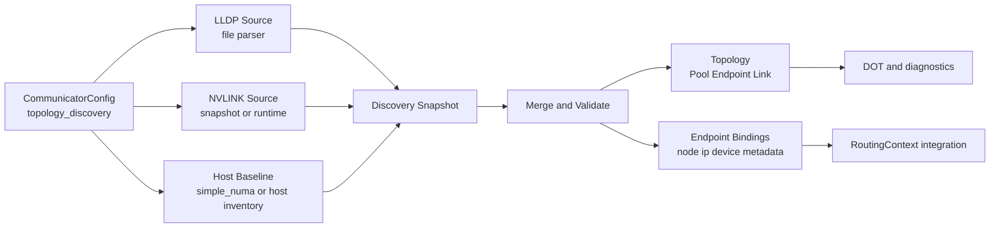

# Summary

Current topology modeling still relies mostly on explicit inputs (`simple_numa`
or manual construction). LLDP is only used as a local input in
`NetDev::read_rail_id()` for RDMA rail selection and is not part of the
unified topology model. NVLINK also does not yet provide a configurable,
testable, and mergeable source.

This design defines a host-local topology discovery and modeling pipeline:

- read NIC rail and PCI information from LLDP input
- read GPU interconnect information from NVLINK input
- merge both sources under deterministic rules to generate the host `Topology`
  (`Pool / Endpoint / Link`) and binding metadata
- preserve compatibility: discovery failures degrade to existing behavior and do
  not block the current read path

# Goals / Non-Goals

## Goals

- Bring LLDP and NVLINK into one unified host-topology data plane instead of
  scattered logic.
- Introduce configurable data sources and strict/relaxed validation policies,
  following unified runtime config principles (no new ad-hoc env vars on the
  main path).
- Produce deterministic topology objects that support DOT export, unit testing,
  and downstream routing consumption.
- Define clear degradation behavior for LLDP missing, NVLINK unavailable, and
  partial field conflicts.

## Non-Goals

- v1 does not implement cluster-wide topology discovery or global optimal
  routing across nodes.
- v1 does not require multi-hop routing (`RoutingContext` remains direct 1-hop).
- v1 does not remove the legacy `TENSORCAST_LLDP_FILE_NAME` behavior; it keeps
  compatibility and plans deprecation separately.

# Architecture & Interfaces

## Discovery Pipeline



## Source 1: LLDP Rail Snapshot

The input file follows the current container-provided format (example):

```text
brainpf0=0000:0e:00.0,mlx5_0,1
brainvf0=0000:0e:00.1,mlx5_9,1
```

Parsing rules:

- ignore empty lines and `#` comment lines
- each line format is `<if_name>=<pci_bdf>,<nic_name>,<rail_id>`
- parse `rail_id` as a positive integer; invalid values follow policy
  (fail or warn+skip)
- use `nic_name` (for example `mlx5_0`) as the primary key, and keep `if_name`
  as a secondary label

Output shape (conceptual):

- `LldpNicRecord { if_name, pci_bdf, nic_name, rail_id }`

## Source 2: NVLINK Topology

Define a unified abstraction with two v1 source modes:

- `snapshot_file`: offline snapshot input (developer and CI friendly,
  reproducible)
- `runtime_probe`: runtime probing (current implementation based on
  `nvidia-smi --query-gpu=index,uuid` and `nvidia-smi topo -m`, with a future
  path to NVML or equivalent APIs)

Output shape (conceptual):

- `NvlinkGpuRecord { gpu_uuid, gpu_index }`
- `NvlinkEdge { src_gpu_uuid, dst_gpu_uuid, link_count, bandwidth_hint_gbps }`

## Baseline Host Inventory

v1 uses a "config-first, discovery-augmented" model:

- CPU/GPU/NIC baseline comes from existing `simple_numa` or a future host
  inventory provider
- LLDP enriches NIC rail and PCI labels
- NVLINK enriches GPU-to-GPU interconnect relations

This avoids the LLDP-only limitation (LLDP alone does not contain GPU
information and cannot produce a complete topology).

## Canonical Merge Model

Introduce conceptual intermediate models:

- `HostDiscoverySnapshot`
- `HostTopologyMergeInput`
- `HostTopologyMergeResult`

Merge rules (deterministic):

1. Build baseline CPU/GPU pools and NIC endpoints first.
2. Attach LLDP labels (`rail_id`, `pci_bdf`, `if_name`) to NIC endpoints.
3. Run NIC<->GPU affinity inference: narrow NIC GPU pool candidates using PCI
   topology distance (longest common PCI-path prefix).
4. Create network switch endpoints by rail (`netsw_rail_<id>`) and generate `SW`
   links.
5. Create NVLINK endpoints per GPU (`nvlink_<gpu_uuid>`) and generate `P2P`
   links from `NvlinkEdge`.
6. Emit a validated `Topology`; allow `require_connected=false` when network and
   NVLINK graphs are not fully connected.

## NIC-GPU Affinity Inference

Inference objective: without changing baseline CPU ownership from `simple_numa`,
keep only the nearest GPU pool subset for each NIC to reduce unnecessary paths
across root complexes or NUMA boundaries.

Input sources and priority:

- GPU PCI path:
  - prefer test hook `HostTopologyBuilderOptions.gpu_pci_path_overrides`
    (deterministic unit tests)
  - default path: use `cudaGetDeviceProperties` for `domain:bus:device`, then
    resolve `/sys/bus/pci/devices/<bdf>` realpath
- NIC PCI path:
  - prefer `HostTopologyBuilderOptions.nic_pci_path_overrides`
  - default path 1: sysfs realpath for LLDP `pci_bdf`
  - default path 2 (degrade): `/sys/class/infiniband/<nic>/device` realpath

Inference rules (deterministic):

1. Apply only to `EndpointKind::kClient && EndpointType::kNic` endpoints.
2. Score only GPU subsets already present in NIC `pool_ids`, without introducing
   non-baseline GPUs.
3. Use longest common prefix length of NIC/GPU PCI realpaths as affinity score,
   and keep all GPUs tied at the top score (supports equal-distance cases).
4. Keep output `pool_ids` stable: original CPU pools first, then filtered GPU
   pools.

Degrade and compatibility behavior:

- if PCI path resolution fails for any NIC or GPU, skip that object and keep
  topology building alive
- if affinity inference partially fails, mark observability degradation and keep
  baseline pools; do not expand fail-fast boundaries unless upper required
  semantics request it
- inference is enabled by default only when `topology_discovery.enable=true`

Observability:

- add fields:
  - `affinity_nic_candidate_count`
  - `affinity_nic_scored_count`
  - `affinity_nic_narrowed_count`
  - `affinity_degraded`
  - `affinity_degrade_reason`
- include affinity summary in `simple_numa_topology_tool` stderr output for
  staged verification

## Topology Projection Rules

- Pool:
  - `cpu_numa_<id>` (`kCpu`)
  - `gpu_<uuid_or_index>` (`kGpu`)
- Endpoint:
  - `nic_<nic_name>` (`kClient`, `kNic`)
  - `netsw_rail_<rail_id>` (`kSwitch`, `kNic`)
  - `nvlink_<gpu_uuid_or_index>` (`kClient`, `kNvlink`)
- Link:
  - `nic_<x> -> netsw_rail_<r>` (`kSwitch`)
  - `nvlink_<a> <-> nvlink_<b>` (`kP2P`, explicit bidirectional edges)

## Config Additions (Proto-Level)

Add a discovery config section under
`tensorcast.communicator.v1.CommunicatorConfig` (illustrative naming):

```proto
message TopologyDiscoveryConfig {
  bool enable = 1;
  LldpDiscoveryConfig lldp = 2;
  NvlinkDiscoveryConfig nvlink = 3;
  TopologyMergePolicy merge_policy = 4;
}
```

Suggested field semantics:

- `lldp.file_path`: defaults to `/host-config/lldp-info.txt`, supports repository
  snapshots on development hosts
- `lldp.required`: fail startup on missing file or parse failure when true
- `nvlink.source`: `DISABLED | SNAPSHOT_FILE | RUNTIME_PROBE`
- `nvlink.required`: fail startup when NVLINK source is unavailable and true
- `merge_policy.emit_rail_switch_endpoints`: whether to model rail switch
  endpoints explicitly

Notes:

- `DaemonConfig` already embeds communicator config; no parallel config entry is
  required
- no new environment variable is introduced for discovery control; legacy env is
  compatibility fallback only

## Integration Points

- add module `core/communicator/topology/discovery/`
  (parser/source/merge/builder)
- keep `RoutingContext` interface stable and inject discovery output through
  `set_topology(...)`
- extend `EndpointBinding` with optional fields (`pci_bdf`, `rail_id`,
  `gpu_uuid`) for future routing policies
- migrate `read_rail_id()` in `core/communicator/transport/net_dev.cc` to reuse
  the unified LLDP parser and avoid duplicated parsing logic

## Cross-Node NIC Rail Matching (Routing Increment)

To align with practical deployment policy (each GPU prefers local NIC/NVLINK
endpoints, and cross-node paths prefer aligned NIC rails), this design adds a
cross-node rail matching policy at routing stage while keeping `RoutingContext`
1-hop semantics unchanged:

1. If a direct link exists for `src -> dst`, keep direct 1-hop behavior.
2. If no direct link exists and `src_binding.node_id != dst_binding.node_id`:
   - select a local NIC for source from local topology (rail match first, then
     GPU-pool affinity)
   - use that NIC rail as preferred rail and choose an available network
     endpoint in destination bindings (score priority:
     preferred rail > destination rail > endpoint/NIC features)
   - use local NIC adjacent link (typically `nic -> netsw_rail_<id>`) as route
     anchor to build a 1-hop channel
3. This policy decouples runtime endpoint ids (for example `node/dev/gpu/<id>`)
   from topology endpoint ids and does not require strict naming equality.
4. If rail matching fails, preserve existing error semantics and let upper
   `RemoteKeySource` continue strict direct fallback.

# Error Model & Invariants

- LLDP parsing invariants:
  - `nic_name` must not be empty
  - the same `nic_name` must not map to conflicting `rail_id` values
  - `pci_bdf` must satisfy base `dddd:bb:ss.f` format
- NVLINK invariants:
  - endpoint GPUs must map to known GPU pools
  - self-loop edges are invalid; duplicate edges are merged by count
- Merge invariants:
  - `Topology::validate()` must pass
  - missing partial source data must not crash; follow required policy for
    fail-fast or degrade

Degrade policy:

- `topology_discovery.enable=false`: fully fall back to existing path
- LLDP unavailable with `lldp.required=false`: rail is unknown and network
  topology degrades to a single switch layer (or no rail layering)
- NVLINK unavailable with `nvlink.required=false`: emit network-side topology
  only, without NVLINK links

# Schema Changes (if any)

Yes. Extend:

- `proto/tensorcast/communicator/v1/communicator_config.proto`
  (add `TopologyDiscoveryConfig` and submessages)

If `.proto` is modified, run:

```bash
bash tools/build_proto_python.sh
```

# Naming Compliance

- Classes/structs (PascalCase):
  - `LldpDiscoveryConfig`
  - `NvlinkDiscoveryConfig`
  - `HostDiscoverySnapshot`
  - `HostTopologyMergeResult`
- Functions/methods (snake_case):
  - `load_lldp_records`
  - `collect_nvlink_edges`
  - `merge_discovery_sources`
  - `build_topology_from_discovery`
- Constants/enums (ALL_CAPS):
  - `NVLINK_SOURCE_DISABLED`
  - `NVLINK_SOURCE_SNAPSHOT_FILE`
  - `NVLINK_SOURCE_RUNTIME_PROBE`

# Trade-offs & Risks

- New config fields increase system complexity.
  - Mitigation: keep disabled by default, roll out in phases, and provide clear
    fallback behavior.
- Runtime NVLINK probing can be unstable across driver environments.
  - Mitigation: prioritize snapshot input in v1 and gate runtime probing behind
    an independent switch.
- LLDP format depends on environment conventions and may drift.
  - Mitigation: strict parser, versioned sample files, and unit tests.

# Compatibility & Acceptance Criteria

- When `topology_discovery` is disabled, behavior matches current version.
- When enabled, LLDP + NVLINK can build host topology and export DOT.
- If any source is missing, behavior follows `required` policy (fail-fast or
  degrade) with diagnosable logs.
- Existing `RoutingContext` and `RemoteKeySource` call chains remain intact; on
  failure, direct read fallback still works.

# References

- `core/communicator/transport/net_dev.cc`
- `core/communicator/topology/topology.h`
- `core/communicator/topology/simple_numa_topology.cc`
- `core/communicator/routing/routing_context.cc`
- `core/store/materialization/dataplane/sources/remote_key_source.cc`
- `proto/tensorcast/communicator/v1/communicator_config.proto`
- `docs/designs/0004-unified-runtime-config.md`
- `docs/designs/0058-communicator-topology-model.md`
