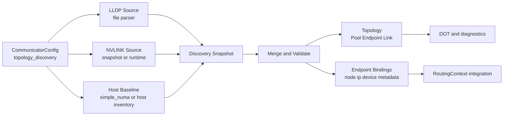

# Summary

当前拓扑建模仍主要依赖显式输入（`simple_numa` 或手工构造），LLDP 信息仅在 `NetDev::read_rail_id()` 中作为 RDMA rail 选择的局部输入使用，未进入统一拓扑模型。NVLINK 也尚未形成可配置、可测试、可合并的数据来源。

本设计定义一条主机内拓扑发现与建模流水线：

- 从 LLDP 文件读取 NIC rail 与 PCI 信息。
- 从 NVLINK 数据源读取 GPU 间链路信息。
- 按统一规则合并，生成当前机器的 `Topology`（`Pool / Endpoint / Link`）与配套绑定信息。
- 保持兼容：发现失败时可回退到现有行为，不阻断当前读路径。

# Goals / Non-Goals

## Goals

- 把 LLDP 与 NVLINK 纳入统一的 host-topology 数据面，而非零散逻辑。
- 引入可配置的数据源与严格/宽松校验策略，遵循统一运行时配置原则（禁止新增 ad-hoc env 作为主路径）。
- 产出确定性的拓扑对象，支持 DOT 导出、单测校验、后续路由策略消费。
- 明确降级路径：LLDP 缺失、NVLINK 不可用、部分字段冲突时都有可预期行为。

## Non-Goals

- 首版不做跨机器全局拓扑发现与全局最优路由。
- 首版不要求完成多跳路由（`RoutingContext` 当前 direct 1-hop 限制保持不变）。
- 首版不移除历史 `TENSORCAST_LLDP_FILE_NAME` 行为，只做兼容并规划弃用。

# Architecture & Interfaces

## Discovery Pipeline



## Source 1: LLDP Rail Snapshot

输入文件沿用当前容器提供格式（示例）：

```text
brainpf0=0000:0e:00.0,mlx5_0,1
brainvf0=0000:0e:00.1,mlx5_9,1
```

解析规则：

- 忽略空行与 `#` 注释行。
- 每行格式为 `<if_name>=<pci_bdf>,<nic_name>,<rail_id>`。
- `rail_id` 解析为正整数；非法值按策略处理（fail 或 warn+skip）。
- 主键以 `nic_name`（如 `mlx5_0`）为准，`if_name` 作为附属标签。

输出结构（概念）：

- `LldpNicRecord { if_name, pci_bdf, nic_name, rail_id }`

## Source 2: NVLINK Topology

定义统一抽象接口，首版支持两类来源：

- `snapshot_file`：离线快照文件（开发机和 CI 友好，便于可重复测试）。
- `runtime_probe`：运行时探测（当前实现基于 `nvidia-smi --query-gpu=index,uuid` 与 `nvidia-smi topo -m`，后续可演进为 NVML 或同等接口）。

输出结构（概念）：

- `NvlinkGpuRecord { gpu_uuid, gpu_index }`
- `NvlinkEdge { src_gpu_uuid, dst_gpu_uuid, link_count, bandwidth_hint_gbps }`

## Baseline Host Inventory

首版采用“配置优先，发现补充”：

- CPU/GPU/NIC 基线由 `simple_numa`（已存在）或后续 host inventory provider 提供。
- LLDP 负责 NIC rail 与 PCI 标签补强。
- NVLINK 负责 GPU-GPU 互联关系补强。

这样可以避免仅靠 LLDP（没有 GPU 信息）无法完成完整拓扑的问题。

## Canonical Merge Model

新增中间模型（概念）：

- `HostDiscoverySnapshot`
- `HostTopologyMergeInput`
- `HostTopologyMergeResult`

合并原则（确定性）：

1. 先建立 CPU/GPU pool 与 NIC endpoint 基线。
2. 用 LLDP 结果为 NIC endpoint 绑定 `rail_id`、`pci_bdf`、`if_name` 标签。
3. 基于 rail 生成网络 switch 端点（`netsw_rail_<id>`）并建立 `SW` 链路。
4. 为每个 GPU 生成 NVLINK endpoint（`nvlink_<gpu_uuid>`），按 `NvlinkEdge` 生成 `P2P` 链路。
5. 最终生成可验证的 `Topology`；如果网络图与 NVLINK 图不连通，允许 `require_connected=false`。

## Topology Projection Rules

- Pool:
  - `cpu_numa_<id>` (`kCpu`)
  - `gpu_<uuid_or_index>` (`kGpu`)
- Endpoint:
  - `nic_<nic_name>` (`kClient`, `kNic`)
  - `netsw_rail_<rail_id>` (`kSwitch`, `kNic`)
  - `nvlink_<gpu_uuid_or_index>` (`kClient`, `kNvlink`)
- Link:
  - `nic_<x> -> netsw_rail_<r>` (`kSwitch`)
  - `nvlink_<a> <-> nvlink_<b>` (`kP2P`, 双向显式边)

## Config Additions (Proto-Level)

在 `tensorcast.communicator.v1.CommunicatorConfig` 下新增发现配置段（命名示意）：

```proto
message TopologyDiscoveryConfig {
  bool enable = 1;
  LldpDiscoveryConfig lldp = 2;
  NvlinkDiscoveryConfig nvlink = 3;
  TopologyMergePolicy merge_policy = 4;
}
```

建议字段语义：

- `lldp.file_path`：默认 `/host-config/lldp-info.txt`，支持在开发机指向仓库快照。
- `lldp.required`：true 时文件缺失/解析失败即启动失败。
- `nvlink.source`：`DISABLED | SNAPSHOT_FILE | RUNTIME_PROBE`。
- `nvlink.required`：true 时 NVLINK 源不可用即启动失败。
- `merge_policy.emit_rail_switch_endpoints`：是否显式建模 rail switch。

说明：

- `DaemonConfig` 已嵌入 `communicator`，无需新增并行配置入口。
- 不新增新的环境变量控制发现逻辑；历史 env 仅作兼容兜底路径。

## Integration Points

- 新增模块：`core/communicator/topology/discovery/`（parser/source/merge/builder）。
- `RoutingContext` 保持接口稳定；通过 `set_topology(...)` 注入发现结果。
- `EndpointBinding` 建议增补可选字段（如 `pci_bdf`、`rail_id`、`gpu_uuid`）以支持后续路由策略。
- `core/communicator/transport/net_dev.cc` 的 `read_rail_id()` 迁移为调用统一 LLDP 解析组件，避免重复解析逻辑。

# Error Model & Invariants

- LLDP 解析不变量：
  - `nic_name` 不可为空。
  - 同 `nic_name` 不允许冲突的 `rail_id`。
  - `pci_bdf` 需符合 `dddd:bb:ss.f` 基本格式。
- NVLINK 不变量：
  - 端点 GPU 必须可映射到已知 GPU pool。
  - 自环边无效；重复边合并计数。
- 合并不变量：
  - `Topology::validate()` 必须通过。
  - 不因部分源缺失导致崩溃；按 required 策略 fail-fast 或 degrade。

降级策略：

- `topology_discovery.enable=false`：完全回退现有路径。
- LLDP 不可用且 `lldp.required=false`：rail 设为 unknown，网络拓扑退化为单 switch 或无 rail 分层。
- NVLINK 不可用且 `nvlink.required=false`：只生成网络侧拓扑，不生成 NVLINK 链路。

# Schema Changes (if any)

有。需要扩展：

- `proto/tensorcast/communicator/v1/communicator_config.proto`（新增 `TopologyDiscoveryConfig` 与子消息）。

若 `.proto` 变更，必须执行：

```bash
bash tools/build_proto_python.sh
```

# Naming Compliance

- 类/结构体（PascalCase）：
  - `LldpDiscoveryConfig`
  - `NvlinkDiscoveryConfig`
  - `HostDiscoverySnapshot`
  - `HostTopologyMergeResult`
- 函数/方法（snake_case）：
  - `load_lldp_records`
  - `collect_nvlink_edges`
  - `merge_discovery_sources`
  - `build_topology_from_discovery`
- 常量/枚举（ALL_CAPS）：
  - `NVLINK_SOURCE_DISABLED`
  - `NVLINK_SOURCE_SNAPSHOT_FILE`
  - `NVLINK_SOURCE_RUNTIME_PROBE`

# Trade-offs & Risks

- 引入新配置字段会提升系统复杂度。
  - 缓解：默认关闭，按阶段启用，提供清晰 fallback。
- 运行时 NVLINK 探测在不同驱动环境下可能不稳定。
  - 缓解：首版优先快照输入，运行时探测独立开关。
- LLDP 文件格式来自环境约定，存在漂移风险。
  - 缓解：定义严格 parser + 版本化样例 + 单元测试。

# Compatibility & Acceptance Criteria

- 不开启 `topology_discovery` 时，行为与当前版本保持一致。
- 开启后可基于 LLDP + NVLINK 构建当前机器拓扑，并可导出 DOT。
- 任一来源缺失时按 `required` 配置执行 fail-fast 或 degrade，且日志可定位。
- `RoutingContext` 与 `RemoteKeySource` 现有调用链不破坏；失败可回退 direct 读路径。

# References

- `core/communicator/transport/net_dev.cc`
- `core/communicator/topology/topology.h`
- `core/communicator/topology/simple_numa_topology.cc`
- `core/communicator/routing/routing_context.cc`
- `core/store/materialization/dataplane/sources/remote_key_source.cc`
- `proto/tensorcast/communicator/v1/communicator_config.proto`
- `docs/designs/0004-unified-runtime-config.md`
- `docs/designs/0058-communicator-topology-model.md`
