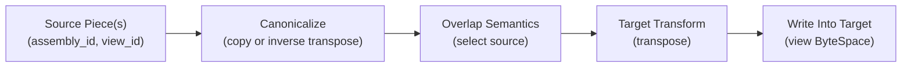
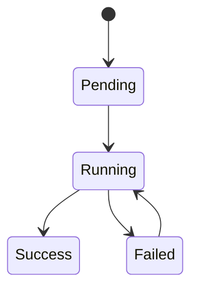

# Summary

Design `0056-dense-piece-assembly-sealing` delivered **dense pieces** (view replicas) for partial coverage and a v1
unsealed-to-sealed lifecycle (`assembly_id` (CGID) -> `mi2:`) with strict constraints:

- Pieces are selection-only (`narrow` only; no `transpose`).
- Assembly is pure copy (no compute edges) and rejects overlaps across different `view_id`.
- No lease-in-place (LIP) pieces.
- View replicas are not indexed in the chunk directory (which is canonical-only).
- Sealing is synchronous and lacks progress tracking / coordinator locks / cleanup policies.

This v2 design makes piece assemblies a **general, long-lived primitive** capable of DTensor/TorchStore-like layouts:

1. **Transform-aware assembly**: assemble with compute edges (starting with transpose) on CPU/GPU, with optional caching.
2. **Overlap tolerance**:
   - `REPLICATE_EQUAL` overlaps at **tensor scope** (full-tensor replication; bytes must be equal; enforced via
     tensor-scoped proof commitments in Global Store).
3. **LIP pieces**: allow `registration_kind=PIECE` on VRAM_LEASED plans by making LIP exports fully ByteSpace-aware.
4. **Replica-level view routing**: treat view replicas as first-class routable objects via `artifact_replicas` and
   `ByteSpaceRef`; v2 does **not** require per-chunk directory entries for view ByteSpaces (defer to future work).
5. **Sealing robustness**: operation lease + progress tracking + policy-driven post-seal cleanup/migration.
6. **Transport optimizations**: strided copy plan nodes and direct-write planning for common reshards.
7. **LayoutSpec + bindings**: a content-addressed `LayoutSpec` (immutable) plus versioned `assembly_id -> layout_id`
   bindings and MI2-scoped `mi2_id -> layout_id` attachments for long-lived DTensor ergonomics; overlap semantics live
   only in `LayoutSpec`.

The unifying idea is to introduce an **AssemblyGraph** IR that composes:

- range copies (selection)
- transforms (e.g., transpose)

and then executes those operations with UMA/P2P primitives while preserving the core v1 invariants: dense replicas,
ByteSpace separation, and deterministic routing keys.

This design builds on `0058-unified-byte-stream-plan`: all copy/fill execution in piece assembly MUST run through the
single byte-range engine (`ByteRangeMap` + `ByteRangeProgram`). `AssemblyGraph` is responsible for graph-level semantics
(transforms, overlap selection, sealing input snapshots), not for introducing another range-copy engine.

# Goals / Non-Goals

## Goals

1. **Generalize assembly** beyond pure-copy:
   - support transpose (forward + inverse) as a first compute edge
   - allow assembly to target views that require transforms
2. **Define overlap semantics** that are explicit, validated, and deterministic:
   - replicated overlaps require equality proofs
3. **Typed chunking and correctness**:
   - canonical coverage remains canonical-byte-range based; overlap equality is enforced via tensor-scoped proof commitments
   - sealing progress is expressed in TreeHash verification leaf space
   - routing/locking/exports and HA inventory stay ByteSpaceRef-aware end-to-end
4. **Make sealing operationally safe**:
   - idempotent, resumable, observable, policy-controlled cleanup
5. **Enable long-term DTensor parity** using TensorCast primitives (no new global collective runtime in v2):
   - reshard copy (already in v1)
   - replicate-style overlap tolerance (new)
   - transform-aware layouts (new)

## Non-Goals

- Arbitrary view ops beyond the existing per-tensor `narrow` and `transpose` families (v2 remains within those ops).
- A new SPMD compiler or a daemon-side collective runtime (orchestration remains client-driven; daemons execute plans).
- Eliminating all staging in every path (v2 focuses on correctness + clear upgrade points for performance).

# Current State (Grounding)

As of 2026-01-26, v1 dense pieces + sealing are implemented (see `docs/plans/0056-dense-piece-assembly-sealing.md`).
Key grounding points in the codebase:

- **Piece registration is selection-only**: `core/store/runtime/metadata/registration_backend.cc` rejects pieces when
  `view_plan->forward.transform.requires_materialization` is true (transpose not allowed).
- **Assembly rejects transforms + overlaps**: `core/store/runtime/ingestion/materialization_facade.cc` rejects variants
  requiring transforms and fails fast on overlapping canonical coverage across view IDs.
- **Global Store rejects overlaps**: `tensorcast/global_store/services/view_state_service.py` checks
  `variant_coverage_ranges` for cross-view overlap and rejects if present.
- **LIP pieces are disallowed**: `daemon/service/controllers/registration_controller.cc` rejects piece registration when
  `RegPlan::LEASE` (VRAM_LEASED/LIP).
- **Chunk directory is canonical-only**: `schema.sql::chunk_directory` does not include ByteSpaceRef and cannot index
  view replicas.

This design keeps all v1 behavior intact and adds v2 capabilities behind explicit new metadata contracts.

# Architecture & Interfaces

## 0) Definitions (v2 terms)

- **Assembly**: a CGID-bound artifact id (`assembly_id="cgid:..."`) with canonical index binding.
- **Piece**: a dense view replica under `(assembly_id, view_id)` in a **view ByteSpace**.
- In v1, pieces were constrained to be partial coverage. In v2, a “piece” is a dense view replica used as an assembly
  input and MAY be partial or full coverage. Partiality is expressed by canonical coverage metadata, not by the name.
- **LayoutSpec**: immutable, content-addressed declaration of expected views and overlap semantics for a canonical index
  (`layout_id`).
- **Assembly layout binding**: versioned pointer `assembly_id -> layout_id` used for unsealed registration validation and
  planning.
- **Artifact layout attachment**: immutable attachment `mi2_id -> layout_id` used for long-lived sealed ergonomics.

### 0.1) Chunking taxonomy (avoid “chunk” overload)

TensorCast currently has multiple, independent “chunk” concepts. v2 makes them explicit to avoid schema/proto drift:

- **VS chunk (`vs_chunk_idx`)**: UMA / transport / eviction granularity (Global Store `chunk_directory*` tables).
  - Size: `artifact_chunk_bytes` (engine option).
  - Used for: routing, locks, movement, residency state.
- **Verification leaf (`hash_leaf_idx`)**: TreeHash leaf index for integrity verification (`leaves` table).
  - Size: verification leaf chunk bytes (default policy ~4 MiB, see design-0016).
  - Used for: computing `data_multihash` / `view_data_hash`.
- **Overlap proof chunk (`proof_chunk_idx`)**: deterministic *tensor-scoped* chunk grid used only for overlap validation.
  - Size: derived deterministically from `proof_schema_version` (v1: fixed 4 MiB, 64-byte aligned; not configurable).
  - Used for: validating `REPLICATE_EQUAL` overlaps and deterministic source selection.

Rule: **Do not reuse the `leaves` table to store overlap proofs.** `leaves` remains “TreeHash verification leaves” only.

### 0.1.1) Offsets and coordinate spaces (required)

v2 uses three different offset domains. These MUST NOT be mixed:

- **Artifact-canonical offsets** (`artifact_canonical_offset`): offsets into the canonical artifact byte stream (the
  concatenation/order defined by the canonical index).
  - Used for: canonical coverage ranges, piece assembly selection, completeness checks.
- **Tensor-canonical offsets** (`tensor_canonical_offset`): offsets into a single tensor’s canonical byte stream, origin
  at 0 for each tensor.
  - Used for: overlap proof chunks (`proof_chunk_idx`) and proof digests.
- **View ByteSpace offsets** (`view_offset`): offsets into a view ByteSpace stream (`ByteSpaceKind=VIEW, id=view_id`).
  - Used for: physical reads/writes of piece bytes and view replica sizing.

Conversions between these domains MUST be derived from the canonical index tensor boundaries (design-0016). In
particular, overlap proofs are **tensor-scoped**: the proof-chunk grid and `proof_chunk_idx` are defined in
**tensor-canonical** space and derived from canonical index tensor boundaries (not from view ByteSpace offsets).

### 0.1.2) DigestGrids (leaves + proofs) (required)

TensorCast uses multiple digest sets for correctness:

- **TreeHash verification leaves** (`leaves`): verifiable byte streams anchored by `HashSpaceRef` (design-0016).
- **Overlap proof chunks** (this design): tensor-scoped digests on a deterministic grid (`proof_schema_version`).

To prevent long-term semantic drift and avoid inventing a new “digest write path” for every feature, v2 standardizes a
single conceptual model:

- **DigestGrid**: a deterministic mapping from `(grid_ref, chunk_idx)` to a raw digest, where:
  - `grid_ref` identifies the *verifiable byte stream* (`HashSpaceRef`) and the *grid policy version*.
  - `chunk_idx` is the grid’s stable chunk index (leaf index, proof chunk index, etc.).

**Important**: this is a **unification of conventions and infrastructure**, not a demand to merge tables. `leaves` stays
TreeHash-only. Overlap proofs remain in dedicated tables (`*_proof_commitments`) with their own scoping rules.

Normative conventions (apply to all digest grids):

- **Digest encoding**: store digests as raw 32-byte SHA-256 (`BLOB` in schema; `bytes` in proto). Any text encoding is
  debug-only.
- **Batch-first APIs**: all digest writes MUST be batched (server-side chunking allowed). Single-entry write RPCs are
  forbidden for performance reasons.
- **Commit semantics**: writes MUST be idempotent:
  - insert when absent
  - otherwise require digest equality and reject conflicts (`FAILED_PRECONDITION`)
- **Limits are config-driven**: GS MUST enforce bounded limits for maximum digests per request and payload size, wired
  through the unified runtime config system (design-0004). Requests exceeding limits fail fast with a clear, structured
  `RESOURCE_EXHAUSTED` error.
- **Observability**: all digest write paths MUST export counters for `entries_written`, `conflicts`, and `requests_rejected`
  (by reason: too_large, conflict, invalid).

### 0.2) ByteSpace naming (VIEW vs VARIANT)

- `tensorcast.common.v1.ByteSpaceKind` uses `CANONICAL` / `VIEW` (canonical term).
- Some schema/docs still use legacy “variant” naming (`variants`, `ListVariants`, `variant_coverage_ranges`). Treat these
  as `VIEW` terminology, not a different concept.

v2 contracts standardize on `tensorcast.common.v1.ByteSpaceRef { kind, id }` for all new APIs and schema.
Avoid introducing new, GS-local ByteSpace enums in future APIs.

#### Convergence strategy (recommended)

Because the project is not yet deployed, v2 can take the clean path:

1. **Standardize on `ByteSpaceRef`**: new and v2-upgraded RPCs (chunk routing/updates, sealing/layout/proofs) should use
   `tensorcast.common.v1.ByteSpaceRef` directly (and avoid introducing parallel enums/messages).
2. **Use `HashSpaceRef` for hashing/proofs**: any API that refers to verification leaves or proofs should use the
   existing `tensorcast.common.v1.HashSpaceRef` to avoid overloading `space_id`.
3. **Rename docs/code to `VIEW`**: treat “variant” as legacy wording in documentation; the byte-space concept is “view”.

### 0.3) Hash-space anchoring (index_multihash vs view_id)

Some existing Global Store APIs use `(space_kind, space_id)` in contexts that are specifically about **hashing /
verification domains** (for example `leaves`, `PartialLeafCoverageDetail`, and `PartialCoverageDetail`). In those contexts, `space_id` is a *hash-space
anchor*, not a `ByteSpaceRef.id`:

- Canonical hash-space anchor: `space_id = index_multihash` (the canonical byte stream is defined by the canonical index).
- View/variant hash-space anchor: `space_id = view_id`.

This is intentionally different from `ByteSpaceRef`, where canonical space typically uses `kind=CANONICAL` with an empty
`id`. To keep the system consistent long-term:

- Use `ByteSpaceRef` for **routing / residency / locks / transport** (physical concerns).
- Use the explicit `HashSpaceRef` message for **verification and proofs**:
  - `hash_space.byte_space: ByteSpaceRef`
  - `hash_space.canonical_index_multihash: string` (required iff `byte_space.kind == CANONICAL`)

This removes the ambiguity of a single `space_id` field serving two different roles.

### 0.4) Normative invariants and trust boundary (required)

These are **system-level invariants** that v2 relies on for long-term correctness and operational safety.

**Byte movement (data-plane)**

- **One copy/fill engine**: all copy/fill in piece assembly MUST compile to `ByteRangeMap` and execute via
  `ByteRangeProgram` (design-0058). `AssemblyGraph` may introduce compute nodes, but must not introduce a parallel
  byte-range executor.
- **No invented data**: missing coverage MUST surface as `UNAVAILABLE` with `PartialCoverageDetail` and MUST NOT be
  “patched” by zero fill. `FillZeros` exists only to represent explicit PAD/zero ranges required by a view mapping
  (i.e., builder-authored `kPad` / `PadRun`), not to paper over missing bytes.

**Overlap proofs (trust boundary)**

- **Daemons are the only proof witnesses**: proof digests and coverage metadata MUST be computed by the daemon/core from
  the bytes it actually ingested/materialized for a piece. SDKs MUST NOT supply proof digests as authoritative inputs.
- **Global Store is an authoritative constraint ledger**: GS validates overlap policy and enforces commitment equality,
  but does not “trust” client-supplied digests that are not derived from daemon-held bytes.

**Metadata contracts (single source of semantics)**

- **LayoutSpec is the only source of overlap semantics**: overlap mode, proof schema version, and any “expected view set”
  semantics MUST live only in an immutable, content-addressed `LayoutSpec` (`layout_id`). Registration/planning APIs must
  not accept a second, parallel `overlap_mode` knob that can conflict with the active layout.

**Sealing is an Operation (long-tail control-plane)**

- **Seal is an `Operation[T]`** (design-0055): sealing uses an idempotent, lease-backed coordinator gate (lock), has a
  stable operation id, exposes status/progress/error via the unified operation surfaces, and is safe under retries.
- **Snapshot-bound execution**: each seal attempt is bound to an immutable input snapshot (layout + piece universe +
  per-piece metadata digests). Retries MUST reuse the same snapshot.

**Post-seal resolution (alias semantics)**

- **`assembly_id` is an alias after sealing**: once bound, reads for `assembly_id` MUST resolve to `mi2_id` for *all*
  ByteSpaces (canonical and view). Any reuse of pre-seal CGID-scoped view replicas is an optimization only and MUST be
  provably safe (via commitments) or performed by explicit migration/publish under `mi2_id`.

## 1) AssemblyGraph (new core IR)

v1 assembly is an implicit list of range copies. v2 makes it explicit as an IR that can place compute edges.

### 1.1 Graph shape (per tensor, then concatenated)

In v2 we keep AssemblyGraph **tensor-scoped** because v2 view ops are tensor-local (`narrow`, `transpose`):



Notes:

- **Canonicalize** produces canonical-order bytes for a tensor into a staging buffer (CPU or GPU).
- **Overlap Semantics** selects a source (and validates equality proofs for replicated overlaps).
- **Target Transform** is optional and is the forward transform needed by the requested view.

### 1.2 Node types (minimal v2 set)

The IR is intentionally small (closed set):

- `ReadViewReplica`: read bytes from a local or remote view replica.
- `CopyRanges`: copy a set of canonical or view ranges.
- `InverseTransform`: currently supports inverse transpose (view -> canonical).
- `ForwardTransform`: currently supports transpose (canonical -> view).
- `FillZeros`: write padding ranges as zeros.

We explicitly do **not** add a general “kernel node” interface in v2. Instead, each compute node maps to a known,
audited executor (Torch on CPU/GPU via LibTorch, similar to `view_transform_executor`).

### 1.3 Execution model

- Graph execution is internal to the daemon/core and uses existing UMA allocations.
- Compute-heavy nodes must run on a **blocking executor** (see concurrency rules in repo `AGENTS.md`).
- Copy/fill nodes MUST compile to `ByteRangeMap` and execute via the unified byte-range engine
  (`ByteRangeProgram`, design-0058). Sources may be remote (`RemoteKeySource`) or local, but there is exactly one
  range-copy executor in the system.
- The graph is built deterministically:
  - stable ordering by `(tensor_name, tensor_canonical_offset, view_id)`
  - stable tie-breakers for source selection

## 2) Overlap semantics (new contract)

v2 lifts the v1 restriction “no overlaps across different `view_id`” by making overlap semantics explicit.

### 2.1 Overlap modes

Overlap policy is declared per tensor by the active `LayoutSpec` bound to the `assembly_id` (unsealed) or attached to
the `mi2_id` (sealed). If no layout is bound/attached, the system uses a conservative default.

- `DISJOINT` (v1 behavior): no overlaps across different `view_id`.
- `REPLICATE_EQUAL`: **tensor-level replication**. Multiple `view_id` may provide bytes for the same tensor, but the
  tensor bytes MUST be identical (proven).

If no policy exists, the system defaults to `DISJOINT` and preserves v1 behavior.

#### v2 scope restriction (required): REPLICATE_EQUAL is tensor-level only

To keep Global Store validation simple, deterministic, and scalable, v2 intentionally does **not** support arbitrary
partial-range replicated overlaps.

For any tensor with `overlap_mode=REPLICATE_EQUAL`, a piece is eligible to participate only if it contributes the
**entire tensor** in canonical byte order (i.e., full tensor coverage). Partial tensor coverage for a replicated tensor
is rejected.

If a workload requires partial-range replicated overlaps (e.g., halos), it MUST be introduced as a future design with
a new `proof_schema_version` and explicit soundness rules.

### 2.2 Equality proofs via tensor-scoped proof chunks (required for REPLICATE_EQUAL)

To avoid a “materialize canonical and memcmp” step at assembly time while keeping the system deterministic, v2 validates
replicated overlaps via a Global Store-backed **proof commitment ledger** on a deterministic tensor-scoped grid.

#### Eligibility: full tensor coverage (required)

For a tensor declared `REPLICATE_EQUAL`, Global Store MUST enforce that any participating piece covers the full tensor
canonical byte interval:

- Let `(tensor_artifact_offset, tensor_total_bytes)` come from the canonical index (design-0016).
- The piece’s canonical coverage ranges (artifact-canonical offsets) MUST fully cover:
  - `[tensor_artifact_offset, tensor_artifact_offset + tensor_total_bytes)`

If the piece does not fully cover that interval, Global Store MUST reject the registration with `FAILED_PRECONDITION`
and a structured explanation (`tensor_name`, missing sub-ranges).

#### Proof schema (fixed, derived; required)

Proofs are computed per tensor in **canonical byte order** on a deterministic chunk grid. The schema is versioned; the
initial schema is:

- `proof_schema_version = "v1"`
- `proof_chunk_bytes = 4 MiB` (fixed, 64-byte aligned)
- `proof_chunk_idx` is tensor-local: offset origin is `0` per tensor
- Proof chunk byte range:
  - `start = proof_chunk_idx * proof_chunk_bytes`
  - `end = min(tensor_total_bytes, start + proof_chunk_bytes)`
- Digest: raw `SHA256(tensor_canonical_bytes[start:end])`

`proof_chunk_bytes` is not operator-configurable. Changing the proof grid is a schema change that requires bumping
`proof_schema_version` and a migration/backfill plan.

Digest representation is fixed:

- Schema: store `digest` as a 32-byte `BLOB` (raw SHA-256).
- Proto: represent `digest` as `bytes` (32 bytes). Human-readable multihash/base32 strings are optional debug-only
  renderings and MUST NOT be treated as canonical storage for commitments.

#### Proof witnesses (required)

Proof digests are a **fact about bytes** and must follow the v2 trust boundary:

- The daemon/core MUST compute proof digests from the piece bytes it actually ingested/materialized (canonical-order,
  tensor-local offsets).
- SDKs MUST NOT be allowed to provide “authoritative” proof digests directly to Global Store.

In v2, because `REPLICATE_EQUAL` is tensor-level, the required digest set for a participating tensor is deterministic:
the daemon submits digests for **all** `proof_chunk_idx` in `[0, ceil(tensor_total_bytes / proof_chunk_bytes))`.

#### Proof commitments (unsealed ledger; required for REPLICATE_EQUAL)

Before sealing, overlap validation needs an assembly-scoped commitment ledger:

- `assembly_proof_commitments(assembly_id, tensor_name, proof_schema_version, proof_chunk_idx) -> digest`

For piece registration governed by `REPLICATE_EQUAL`, the daemon MUST provide the digest for every proof chunk in the
replicated tensor. Global Store then:

- Inserts the commitment when absent (first writer “commits” the chunk digest)
- Otherwise enforces equality by requiring the digest to match the existing commitment

This makes replicated overlaps safe without overloading TreeHash verification leaves.

#### Seal promotion (MI2-scoped commitments; long-lived source of truth)

After a successful seal computes `mi2_id`, the sealer MUST recompute proof digests from the final assembled **canonical**
byte stream and persist them under the sealed identity:

- `tensor_proof_commitments(mi2_id, tensor_name, proof_schema_version, proof_chunk_idx) -> digest`

The sealer SHOULD compute MI2-scoped proof commitments for all tensors/regions of the sealed artifact (not only those
involved in pre-seal overlaps) so future MI2-anchored layouts can safely use `REPLICATE_EQUAL` without a second pass.

If any `assembly_proof_commitments` entry exists for the same chunk and differs, sealing MUST fail with
`FAILED_PRECONDITION` (the assembly contained conflicting bytes under `REPLICATE_EQUAL`).

Implementation note (recommended): compute MI2-scoped proof digests in the same streaming pass as MI2 hashing (no extra
I/O pass over canonical bytes).

After seal success, `assembly_proof_commitments` are eligible for cleanup. Any long-lived proof queries MUST resolve via
the sealed identity (`assembly_id -> mi2_id` binding).

#### Authoritative validation point (required)

Global Store is the authoritative overlap validator:

- Piece registrations under `REPLICATE_EQUAL` (declared by the active `LayoutSpec`) MUST include the required proof
  digests for all proof chunks of the replicated tensor (computed by the daemon/core) so GS can commit/verify them.
- Global Store validates:
  - `DISJOINT`: no overlaps across different `view_id` (v1 behavior).
  - `REPLICATE_EQUAL`: overlaps allowed only when the replicated tensor is fully covered and proof commitments match.
- Daemons may re-check for defense-in-depth during planning, but must not be the only validator.

### 2.3 Deterministic source selection (required)

When multiple sources are eligible for the same canonical region (e.g., replicated overlaps proven equal), assembly must
select deterministically:

- Primary: stable ordering by `(tensor_name, tensor_canonical_offset, view_id)`.
- Tie-breaker: smallest `view_id` (lexicographic) wins.
- Optimization hooks (future): prefer local device/node when it does not change correctness.
Note: `tensor_canonical_offset` is tensor-local and is derived from the canonical index tensor boundaries.
Note: `view_id` is content-addressed (design-0016) and must use a canonical, stable encoding; ordering is defined over
that canonical string form.

## 3) Transform-aware pieces and assembly (transpose)

v2 allows pieces whose `ViewSpec` includes transpose, and allows assembly to satisfy a target view that requires
transpose.

### 3.0 Scope constraint (v2): transpose-only per tensor

v2 adopts the existing ViewSpec op constraints from `ViewPlanner`:

- A tensor’s view ops are either **narrow-only** or **transpose-only**.
- Mixing `narrow` and `transpose` in the same tensor is out of scope for v2 (and currently rejected by the planner).

This keeps v2 transform semantics aligned with the existing planning and executor surfaces. Supporting mixed
`narrow+transpose` tensors requires a future design (v3) with explicit planning and proof semantics.

### 3.1 Piece registration changes (lifting v1 restriction)

Current v1 restriction in `registration_backend.cc`:

- `registration_kind=PIECE` rejects any forward/inverse transform requirement.

v2 changes:

- Allow `transpose` in piece view specs, but require that:
  - the piece is still dense in its view ByteSpace (`total_size_bytes == view_size_bytes`)
  - canonical coverage metadata is computed and persisted
  - tensor-scoped proof digests are computed (canonical-order) for `REPLICATE_EQUAL` commitment validation and later sealing

### 3.2 Canonicalization step (view -> canonical)

To use a transposed piece as an input to canonical-space assembly:

1. Allocate a canonical staging buffer for the tensor (CPU or GPU).
2. Load piece bytes in view order (contiguous view ByteSpace bytes).
3. Apply the inverse transpose to produce canonical-order bytes (reuse existing transform executors).

This yields canonical-order bytes for the tensor, after which assembly reduces to copy/selection logic.

### 3.3 Target transpose (canonical -> view)

If the requested target view requires transpose:

- Assemble canonical tensor bytes into a canonical-order staging buffer for the tensor, then apply the forward transform
  into the target view buffer (reuse existing transform executors).

This mirrors the existing “canonical -> view” materialization pipeline and keeps the transform executor the single source
of truth.

## 4) LIP pieces (VRAM_LEASED)

v2 enables piece registration with `RegPlan::LEASE` by making all LIP bookkeeping and export keys ByteSpace-aware.

Required semantics:

- `LipManager` entries and export keys are keyed by `(artifact_id, view_id, device_id)` (already true in current code),
  and all callers must pass the correct `view_id` / ByteSpaceRef.
- LIP export routing and transport locks must never conflate canonical and view replicas.

Precondition (v2 final state):

- All lock/export/routing paths are ByteSpaceRef-aware (and keyed by `view_id` for view ByteSpaces) so LIP pieces cannot
  collide with canonical replicas or other view replicas.

## 5) View routing and directory scope (v2)

v2 treats view replicas as first-class routable objects but does **not** require per-chunk directory state for view
ByteSpaces.

### 5.1 Canonical chunk directory (unchanged)

`chunk_directory` remains canonical-only and continues to track VS-chunk residency/state for canonical ByteSpace.
This avoids state explosion and keeps high-churn updates scoped to canonical replicas.

### 5.2 Replica-level view routing (required)

View replicas (pieces and cached derived views) are routed via **replica-level discovery**, not chunk-level state:

- Global Store stores view replica presence using existing replica records (`artifact_replicas` scoped by `view_id`).
- Source selection may use replica-level load/capacity signals (`replica_counters`, node load ratio, etc.).
- Data-plane reads remain range-based via sized `SeekableSource` interfaces (design-0058); they do not require a
  view-scoped chunk directory.

### 5.3 Deferred: view chunk directory (optional future work)

If future measurements show that view replicas require chunk-level hot/cold tracking or partial evictions, introduce a
ByteSpace-aware chunk directory for view ByteSpaces as a **separate milestone** with explicit scale targets, TTL/GC, and
write-amplification controls. This is intentionally out of scope for v2.

## 6) Sealing as an Operation (robustness and lifecycle)

v1 sealing is a synchronous call that computes MI2 by streaming assembled canonical bytes. v2 makes sealing operationally
robust and policy-driven.

### 6.1 Sealing coordinator lock (required)

Sealing is a long-tail control-plane workflow and MUST be surfaced as an `Operation[T]` (design-0055). Sealing MUST use
the **project-wide unified Operation model** (shared proto + shared persistence conventions); v2 must not introduce a
sealing-specific `OperationStatus` shape.

Global Store provides a **lease-backed coordinator gate** so only one sealer actively runs for a given `assembly_id`:

- The seal operation id is deterministic from `(kind="seal_assembly", assembly_id)` so callers can retry idempotently.
- `AcquireOperationLease(operation_id)` returns:
  - `OK + lease_token` if acquired
  - `ALREADY_EXISTS` if another worker holds the lease (include owner/expiry)
- `KeepaliveOperationLease(lease_token)` extends TTL.
- `ReleaseOperationLease(lease_token)` releases.

This eliminates races, makes retries safe, and unifies sealing with the system-wide `Operation.status()/wait()` contract.

#### Fencing token (required)

To prevent split-brain writers under retries and lease loss, the coordinator gate MUST provide a monotonic fencing token
(e.g., `lease_generation` scoped to `(operation_id)`):

- Every status/progress/result update MUST include the fencing token.
- Global Store MUST reject updates with a stale token (`FAILED_PRECONDITION`).

### 6.2 Sealing status tracking (required)

Global Store persists seal operation state (an `OperationStatus` projection):



State includes progress (hash leaves), last error, and the bound `mi2_id` on success.

#### Progress semantics (required)

Sealing progress is expressed in **TreeHash verification leaf space** (not VS chunks and not overlap proof chunks):

- `total_hash_leaves`: derived from canonical total bytes and the canonical verification leaf chunking policy.
- `hashed_leaf_count` (or `max_hashed_leaf_idx`): monotonic progress while hashing assembled canonical bytes.

This aligns progress with the MI2 computation boundary and keeps it stable across transports.

#### Status update throttling (required)

Sealing progress can advance at leaf-rate, but Global Store writes must be bounded:

- The sealer MAY update in-memory counters frequently, but MUST only persist status/progress at a throttled rate
  (time-based and/or delta-based), controlled by unified runtime config (design-0004).
- Recommended default: at most one persisted status update per operation per second, plus an additional update on
  terminal transitions (`Running -> Success/Failed`).

### 6.3 Sealing snapshot semantics (required)

To make sealing deterministic and operationally safe, each seal operation binds to an explicit **input snapshot**:

- When the sealer transitions `Pending/Failed -> Running`, it records a snapshot of the piece set it will use:
  - the list of `(view_id)` considered available at start
  - an immutable binding to the chosen layout inputs:
    - `layout_id` (the active `LayoutSpec`)
    - the `assembly_layout_binding_version` (so retries reuse the same binding even if the pointer changes later)
  - per-view immutable metadata digests sufficient to make retries deterministic (for example: a hash over
    `view_coverage_ranges` + `view_data_hash` for that view)
  - this snapshot is immutable for the lifetime of the running task
- Piece registrations MAY continue while a seal is running, but they do not affect the running attempt.
- A restarted sealer that reacquires the lease for an in-progress task MUST reuse the same snapshot (idempotent retry),
  even if more pieces have arrived.

This ensures “resumable” means **safe restart and retry** (no partial side effects), even if not a byte-level resume.

#### 6.3.1 Source liveness / pinning (required)

Seal inputs must remain readable for the lifetime of the running operation.

- The sealer MUST acquire a bounded, renewable read-side pin/lease for every source replica in the snapshot (scoped by
  full replica identity including `ByteSpaceRef` / `view_id`) before streaming bytes for MI2/proof hashing.
- Pin/lease mechanics SHOULD reuse the daemon’s lease/guard/finalizer system (design-0011). Global Store coordinates and
  persists the seal snapshot/status, but does not directly manage replica liveness.
- If any snapshot source is LIP/VRAM_LEASED and cannot be safely pinned for the expected seal duration, the sealer MUST
  first materialize/copy that source into daemon-owned storage (or reject sealing with `FAILED_PRECONDITION` and a clear
  remediation message).

### 6.4 Post-seal policies (required knobs)

Sealing must define what happens to pieces and cached views:

- `redirect_reads`: always resolve `assembly_id -> mi2_id` for *all* ByteSpaces (canonical + view).
- `migrate_views`: optional; copy/publish selected cached/derived views under `mi2_id` and (optionally) attach a layout
  (`layout_id`) to the sealed artifact to advertise expected views.
- `reuse_views_if_safe`: optional; allow reads to reuse CGID-scoped view replicas after redirect **only** when provably
  safe (e.g., when their canonical proof commitments match MI2-scoped commitments for the relevant tensors/regions).
- `retire_pieces`: optional; delete/retire CGID-scoped piece views after seal to reclaim space (recommended when
  `migrate_views` or `reuse_views_if_safe` is enabled so view reads remain fast).

These policies are deployment-configurable and must follow the unified runtime config design (`docs/designs/0004-*`).

### 6.5 Post-seal identity and metadata unification (required)

After a seal succeeds, `mi2_id` is the long-lived, content-addressed identity. The `assembly_id` remains only as an
operational alias via `assembly_id -> mi2_id` (Global Store `artifact_bindings`) and as provenance for the seal task.

Rules:

- Long-lived truth for overlap proofs is MI2-scoped (`tensor_proof_commitments` keyed by `mi2_id`).
- Long-lived layout declarations are attached to the sealed identity (`mi2_id -> layout_id`); `LayoutSpec` payloads are
  immutable and content-addressed by `layout_id`.
- CGID-scoped metadata (e.g., `assembly_layout_bindings`, `assembly_proof_commitments`) may be retained for
  audit/debugging but is not consulted for post-seal correctness once the binding exists.

### 6.6 Retention and cleanup (required)

To keep Global Store scale-bounded, v2 MUST define retention for seal-related, assembly-scoped state:

- `assembly_proof_commitments`: eligible for deletion after successful seal (or after an explicit TTL), because MI2-scoped
  commitments become the long-lived truth.
- `operations` snapshots and intermediate status: retain for a bounded TTL after terminal state (Success/Failed), unless
  explicitly pinned for audit/debugging.
- Any GC policy MUST be config-driven via the unified runtime config system (design-0004) and MUST be observable
  (deletion counters and current row counts).

## 7) Copy/transport optimizations

v2 consumes the unified byte-range engine (design-0058) for performance primitives while preserving semantics:

1. **Strided copy nodes**: represent repeated range patterns without exploding into thousands of segments (common for inner
   dimension `narrow`). In v2 these patterns MUST be expressed as `ByteRangeProgram` strided runs.
2. **Mapped direct-write planning**:
   - when a target region is satisfied by a single source and is VS-chunk-aligned, prefer mapped direct-write into UMA
     **CPU VA** windows (when enabled by the source/sink capabilities, per design-0058)
   - otherwise fall back to staging reads

These are optimizations only; they must not change correctness.

## 8) LayoutSpec and bindings (TP/DTensor ergonomics)

v2 defines overlap/layout semantics via a single immutable record (`LayoutSpec`) and two binding layers:

- **Unsealed binding** (mutable, versioned): `assembly_id -> layout_id`.
- **Sealed attachment** (immutable): `mi2_id -> layout_id` (multiple layouts may be attached to the same sealed artifact).

This removes “manifest vs profile” drift: overlap semantics live only in `LayoutSpec`, and operational knobs live in the
binding/policy records.

### 8.1 LayoutSpec (immutable, content-addressed)

A `LayoutSpec` declares **correctness-relevant semantics**:

- `index_multihash` (required): the canonical index binding this layout is defined against.
- Expected `view_id` set(s) (optional): known shards/caches for completeness checks.
- Per-tensor overlap mode: `DISJOINT` or `REPLICATE_EQUAL`.
- `proof_schema_version` (required if any tensor uses `REPLICATE_EQUAL`).

Identity:

- `layout_id = MH(DETERMINISTIC_PROTO(LayoutSpec))` (or an equivalent versioned hash over a normalized payload).
  - Hash/encoding: use the same multihash defaults as `index_multihash` (design-0007; sha2-256 + multibase base32).
  - Canonicalization (required before hashing):
    - `layout_schema_version` MUST be present and equal to `1`.
    - `expected_view_ids` MUST be sorted lexicographically and de-duplicated.
    - `tensors` keys MUST refer to tensors in the canonical index; unknown tensor names are rejected.
    - Omitted tensor policy defaults to `DISJOINT`.
    - If any tensor uses `REPLICATE_EQUAL`, `proof_schema_version` is required; otherwise it must be empty.
- Any JSON representation is **audit-only** and MUST NOT be used as the canonical identity input.
  - To avoid cross-language drift, `PutLayoutSpec` SHOULD compute and return `layout_id` server-side from the canonical
    proto payload and treat it as the source of truth.

### 8.2 Assembly layout binding (mutable pointer, versioned)

Unsealed assemblies carry a versioned pointer to the active layout:

- `assembly_layout_bindings(assembly_id) -> {layout_id, binding_version, updated_at, ...}`
- Updates MUST be atomic and monotonic in `binding_version`.
- `index_multihash` is immutable for an `assembly_id`: a binding update to a layout with a different `index_multihash`
  MUST be rejected.

Safety rules for binding updates:

- `DISJOINT -> REPLICATE_EQUAL` (relax): allowed. Global Store begins enforcing the replicated-tensor rules for
  subsequent piece registrations:
  - full tensor coverage for `REPLICATE_EQUAL` tensors
  - proof commitment submission/verification for all proof chunks of replicated tensors
- `REPLICATE_EQUAL -> DISJOINT` (tighten): disallowed unless there are no cross-view overlaps in existing registered
  coverage (GS validates).

### 8.3 Sealed layout attachment (immutable, reusable)

Sealed artifacts may attach one or more layouts for long-term DTensor ergonomics:

- `artifact_layout_attachments(mi2_id, layout_id)` is immutable and idempotent.
- Attaching a layout whose `index_multihash` does not match the `mi2_id` index MUST be rejected.

### 8.4 Assembly runtime policy (mutable, non-hashed)

Operational “wait for completeness” knobs are intentionally kept out of `LayoutSpec` so they do not perturb `layout_id`:

- Optional per-assembly policy record (e.g., quorum/timeout/minimum shard set), validated but not content-addressed.

### 8.5 Planning integration

Assembly planning uses:

- **Unsealed (`assembly_id`)**: resolve `layout_id` via `assembly_layout_bindings` to validate overlap semantics and avoid
  full `ListViews` scans; if absent, fall back to `ListViews` with default `DISJOINT`.
- **Sealed (`mi2_id`)**: if the caller provides a `layout_id` (or one is attached), use it for completeness checks and
  semantics; otherwise fall back to `ListViews` under `mi2_id`.

# Schema Changes (proposed)

This design proposes schema changes (do not apply until implementation). Because the repository is not deployed, v2 uses a
clean **final-state schema** (no dual-write compatibility tables).

1. Canonical chunk directory remains canonical-only in v2:
   - `chunk_directory` continues to track canonical VS chunks only.
   - View replica routing/discovery uses replica-level records (`artifact_replicas` scoped by `view_id`) plus view
     metadata (`views` / `view_coverage_ranges`).
   - Deferred: introduce a view chunk directory only with explicit scale targets and TTL/GC controls.
2. Rename legacy “variant” tables to “view” terminology:
   - `variants` -> `views`
   - `variant_coverage_ranges` -> `view_coverage_ranges`
3. `layout_specs` to store immutable, content-addressed `LayoutSpec` payloads:
   - key: `layout_id`
   - includes: `index_multihash`, payload bytes (deterministic proto) and/or audit JSON
4. `assembly_layout_bindings` to store the versioned `assembly_id -> layout_id` pointer used by unsealed planning and
   registration validation.
5. `artifact_layout_attachments` to attach one or more `layout_id` to a sealed artifact (`mi2_id`) for long-lived
   ergonomics (immutable, idempotent).
6. `assembly_runtime_policies` (or similar) to store per-assembly operational knobs (quorum/timeouts), explicitly *not*
   content-addressed.
7. `operations` (and lease fields or a companion `operation_leases` table) to support `Operation[T]` state/progress/error
   for sealing (and future long-tail workflows):
   - key: `operation_id` (stable)
   - includes: `kind`, `target_artifact_id`, `state`, `progress`, `error`, `result`, `snapshot`, lease owner/expiry
8. `assembly_proof_commitments` to store unsealed overlap proof commitments:
   - key includes `(assembly_id, tensor_name, proof_chunk_idx, proof_schema_version)`
   - digest is raw 32-byte SHA-256 (BLOB)
9. `tensor_proof_commitments` to store MI2-scoped overlap proof commitments (long-lived):
   - key includes `(mi2_id, tensor_name, proof_chunk_idx, proof_schema_version)`
   - digest is raw 32-byte SHA-256 (BLOB)
10. `piece_proof_digests` to store per-piece proof digests for audit/debugging and conflict attribution:
   - key includes `(assembly_id, view_id, tensor_name, proof_chunk_idx, proof_schema_version)`
   - digest is raw 32-byte SHA-256 (BLOB)

All schema changes are coordinated through `schema.sql` in the paired plan.

# Proto / API Changes (proposed)

1. View terminology + replica-level view routing:
   - Rename “variant” wording to “view” in schema and new/updated RPCs (e.g., `ListViews`).
   - View replica routing/discovery uses replica records scoped by `view_id` (and view metadata); chunk directory RPCs
     remain canonical-only in v2.
2. Unified `Operation[T]` (required for sealing and future workflows):
   - Introduce and use a shared Operation proto (single message shape + shared persistence conventions).
   - Operation leases MUST provide a fencing token; status updates MUST be throttled (see §6).
   - `StartSealAssembly` returns an `OperationRef` and is idempotent.
3. LayoutSpec + bindings:
   - RPCs to put/get `LayoutSpec` by `layout_id` (idempotent create; immutable payload).
   - RPCs to get/set `assembly_id -> layout_id` with versioning (`GetAssemblyLayoutBinding`, `UpdateAssemblyLayoutBinding`).
   - RPCs to attach/list `mi2_id -> layout_id` (`AttachLayoutToArtifact`, `ListArtifactLayouts`).
   - Optional: RPCs for per-assembly runtime policy (`GetAssemblyPolicy`, `UpdateAssemblyPolicy`).
4. Overlap proofs:
   - Extend piece registration surfaces so daemons can submit proof digests for `REPLICATE_EQUAL` tensors (full tensor)
     using batch-first digest APIs (see §0.1.2).
   - Optional read APIs for MI2-scoped commitments (primarily for debugging; commitments are derivable from bytes).

### Proposed protobuf sketch (final-state; normative shapes)

This sketch is **not** a full proto diff; it captures the minimum message shapes and field semantics needed to make the
contracts unambiguous. The intent is to:

- keep overlap/layout semantics in exactly one immutable object (`LayoutSpec`)
- make binding/attachment semantics explicit
- surface sealing as an `Operation[T]` with a lease gate (design-0055)

```proto
// package tensorcast.layout.v1;
//
// LayoutSpec is immutable and content-addressed.
// layout_id = MH(DETERMINISTIC_PROTO(LayoutSpec)).
//
// NOTE: any JSON form is audit-only and MUST NOT be used as canonical identity input.

syntax = "proto3";

enum OverlapMode {
  OVERLAP_MODE_UNSPECIFIED = 0;
  OVERLAP_MODE_DISJOINT = 1;
  OVERLAP_MODE_REPLICATE_EQUAL = 2;
}

message TensorLayoutPolicy {
  // Default is DISJOINT when omitted.
  OverlapMode overlap_mode = 1;
}

message LayoutSpec {
  // Layout schema version. Must be 1 for this design. A future semantic change MUST bump this.
  uint32 layout_schema_version = 1;

  // Canonical index binding for this layout (design-0016).
  string index_multihash = 2;

  // Optional expected view ids (e.g., TP8 shards). Used for completeness checks and fast planning.
  // MUST be sorted and de-duplicated by the writer before hashing.
  repeated string expected_view_ids = 3;

  // Per-tensor layout policy keyed by tensor name (from the canonical index).
  // Map entries MUST be canonicalized under deterministic proto hashing rules.
  map<string, TensorLayoutPolicy> tensors = 4;

  // Required if any tensor uses REPLICATE_EQUAL.
  string proof_schema_version = 5;
}

message LayoutSpecRecord {
  // Convenience echo; derived from the payload: layout_id = MH(DETERMINISTIC_PROTO(layout)).
  string layout_id = 1;
  LayoutSpec layout = 2;
  // Optional audit JSON form (not hashed).
  string layout_json = 3;
}

// package tensorcast.global_store.v1;

message GetLayoutSpecRequest {
  string layout_id = 1;
}

message GetLayoutSpecResponse {
  Status status = 1;
  tensorcast.layout.v1.LayoutSpecRecord record = 2;
}

message PutLayoutSpecRequest {
  // Idempotent create: GS computes `layout_id = MH(DETERMINISTIC_PROTO(layout))`.
  // If layout_id already exists with an identical payload, return OK.
  tensorcast.layout.v1.LayoutSpec layout = 1;
  // Optional audit JSON form (not hashed).
  string layout_json = 2;
}

message PutLayoutSpecResponse {
  Status status = 1;
  string layout_id = 2;
}

message AssemblyLayoutBinding {
  string assembly_id = 1;  // "cgid:..."
  string layout_id = 2;
  uint64 binding_version = 3;
  google.protobuf.Timestamp updated_at = 4;
}

message GetAssemblyLayoutBindingRequest {
  string assembly_id = 1;
}

message GetAssemblyLayoutBindingResponse {
  Status status = 1;
  AssemblyLayoutBinding binding = 2;
}

message UpdateAssemblyLayoutBindingRequest {
  string assembly_id = 1;
  string layout_id = 2;

  // CAS for safe concurrent updates.
  // - Create: expected_binding_version = 0
  // - Update: expected_binding_version = current binding_version
  uint64 expected_binding_version = 3;
}

message UpdateAssemblyLayoutBindingResponse {
  Status status = 1;
  AssemblyLayoutBinding binding = 2;
}

message AttachLayoutToArtifactRequest {
  string mi2_id = 1;   // "mi2:..."
  string layout_id = 2;
}

message AttachLayoutToArtifactResponse {
  Status status = 1;
}

message ListArtifactLayoutsRequest {
  string mi2_id = 1;
}

message ListArtifactLayoutsResponse {
  Status status = 1;
  repeated string layout_ids = 2;
}

// Sealing as an Operation (design-0055).
//
// Operation messages (OperationRef / OperationStatus / lease RPCs) are shared across long-tail workflows and MUST live
// in a single project-wide proto package (unified shape).
//
// Requirements:
// - Lease acquisition returns a fencing token (lease_generation) used on all writes.
// - Progress updates are throttled (see §6.2).
// - Sealing results are typed (no `bytes result`).

message SealAssemblyResult {
  tensorcast.common.v1.ArtifactDescriptor artifact = 1;  // mi2 descriptor
}

message StartSealAssemblyRequest {
  string assembly_id = 1;
  // Optional explicit layout selection; if absent, sealing uses the current assembly layout binding (if any).
  string layout_id = 2;
}

message StartSealAssemblyResponse {
  Status status = 1;
  tensorcast.operation.v1.OperationRef operation = 2;
}
```

SDK surface changes are additive:

- `put_layout_spec(...) -> layout_id` (idempotent).
- `set_assembly_layout(assembly_id, layout_id, ...)` (versioned).
- `register_piece(..., view_spec=...)` (overlap semantics come only from the active `LayoutSpec`).
- `seal_assembly(..., wait=False) -> Operation[SealedArtifact]`.

# Alternatives considered

- **SDK-supplied proof digests**: rejected because it breaks the trust boundary; GS would only validate “claims match,” not
  “bytes match.”
- **Reuse TreeHash `leaves` as overlap proofs**: rejected because TreeHash leaves are a verification domain with its own
  chunking policy and anchoring; overlap proofs require a tensor-scoped deterministic grid and must not overload
  verification storage.
- **Prove overlaps by “materialize canonical + memcmp” at assembly time**: rejected as a default because it introduces
  large staging costs and pushes correctness onto a non-deterministic executor path; v2 prefers a metadata-backed ledger.
- **Partial-range overlap proofs**: rejected in v2; supporting it requires a new proof schema version and careful
  soundness rules.
- **Separate assembly manifests vs sealed layout profiles**: rejected long-term due to semantic drift; v2 uses a single
  immutable `LayoutSpec` plus bindings/attachments.
- **Schema compatibility / dual-write rollout**: rejected because the repository is not deployed; v2 takes a hard cutover
  to remove ambiguity and reduce long-term complexity.

# Trade-offs & Risks

- **Extra metadata**: overlap commitments add write amplification; mitigate with batching + `LayoutSpec` opt-in + “commit
  once” ledger semantics.
- **Compute cost**: transpose canonicalization can require full-tensor staging; mitigate with caching and placement rules.
- **Complexity**: AssemblyGraph introduces a new internal IR; keep node set small and reuse existing executors.
- **Operational complexity**: sealing becomes an `Operation[T]` with leases/snapshots; mitigate by reusing the unified
  operation model (design-0055) and keeping state minimal.

# Compatibility & Acceptance Criteria

## Compatibility

- Behavior defaults remain conservative: overlaps remain rejected (`DISJOINT`) unless a `LayoutSpec` binding/attachment
  explicitly opts into `REPLICATE_EQUAL`. Selection-only pieces remain supported; transpose pieces are additive.
- Existing MI2 canonical flows and view materialization semantics remain unchanged (v2 extends piece/unsealed semantics).
- This is a **hard cutover** design: schema/API naming converges to `VIEW` directly (no legacy dual-write compatibility).
  Canonical `chunk_directory` remains canonical-only in v2; view routing is replica-level (see §5).

## Acceptance criteria (v2)

1. Pieces may register with transpose and remain dense (no sparse canonical allocation on registration).
2. Assembly can materialize a target view requiring transpose from available pieces (inverse/forward transforms).
3. `REPLICATE_EQUAL` overlaps are accepted only for tensors that are replicated at tensor scope:
   - participating pieces fully cover the tensor’s canonical byte interval
   - tensor-scoped proof commitments match for all proof chunks of that tensor
   - After sealing, MI2-scoped proof commitments are recomputed from canonical bytes and become the long-lived truth.
4. LIP pieces can be registered and exported without ByteSpace collisions (ByteSpaceRef-aware exports and locks).
5. View replicas are discoverable and routable at replica granularity (replica records scoped by `view_id`); canonical
   `chunk_directory` remains canonical-only in v2.
6. Sealing is an idempotent `Operation[T]`, lease-protected (with fencing token), snapshot-bound, and exposes throttled
   hash-leaf progress/status; post-seal alias semantics and cleanup/migration policies behave as configured.
7. `LayoutSpec` is immutable and content-addressed (`layout_id`); `assembly_layout_bindings` are versioned and validated;
   overlap semantics come only from the active layout and accelerate completeness checks.
8. Sealed artifacts may attach one or more `layout_id` layouts (optional, reusable) and may migrate/reuse cached views
   safely under post-seal policy.

# Naming Compliance

Proposed new interfaces must follow repository conventions.

- C++ (examples)
  - Classes: `AssemblyGraph`, `AssemblyPlanner`, `SealStatusTracker`
  - Functions: `build_assembly_graph`, `execute_assembly_graph`, `acquire_operation_lease`
- Proto (examples)
  - Messages: `LayoutSpec`, `UpdateAssemblyLayoutBindingRequest`, `StartSealAssemblyRequest`
  - Fields: `byte_space`, `view_id`, `layout_id`, `binding_version`, `overlap_mode`
- Python (examples)
  - Methods: `register_piece(...)`, `put_layout_spec(...)`, `set_assembly_layout(...)`, `seal_assembly(...)`
- Schema (examples)
  - Tables: `chunk_directory`, `views`, `view_coverage_ranges`, `layout_specs`, `assembly_layout_bindings`,
    `artifact_layout_attachments`, `operations`, `assembly_proof_commitments`, `tensor_proof_commitments`,
    `piece_proof_digests`

# References

- `docs/designs/0056-dense-piece-assembly-sealing.md` (v1 pieces + sealing)
- `docs/designs/0016-artifact-view-v1.md` (views, ByteSpaces, identity)
- `docs/designs/0052-deferred-slice-materialization.md` (slice/materialization patterns)
- `docs/designs/0055-programmable-framework.md` (Operation/Plan scaffolding for async sealing)
- `schema.sql` (Global Store schema)
