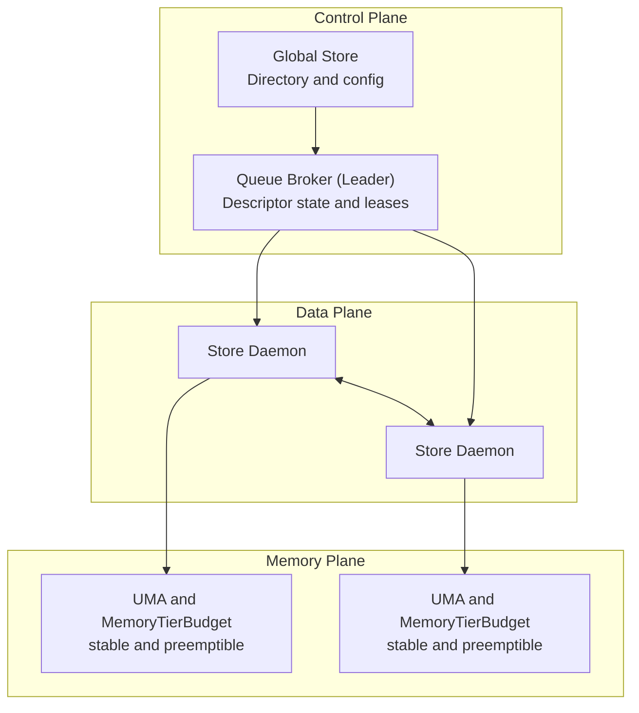
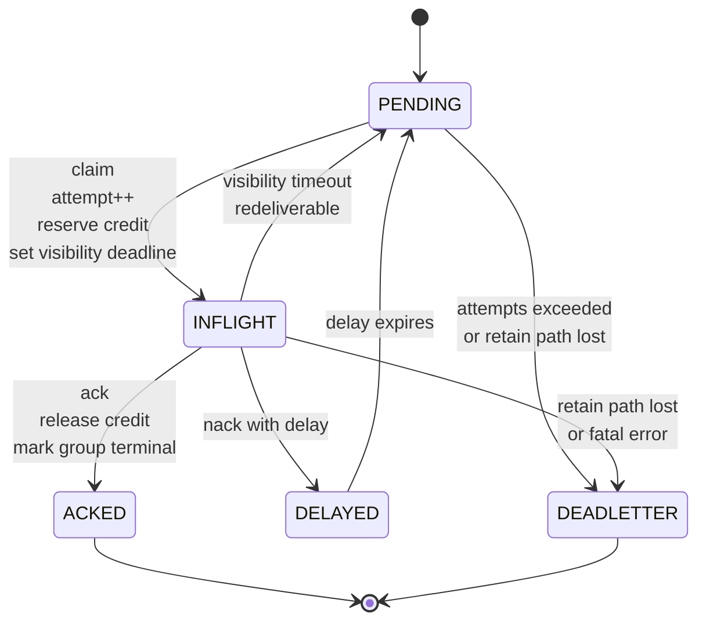
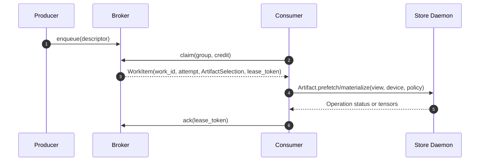
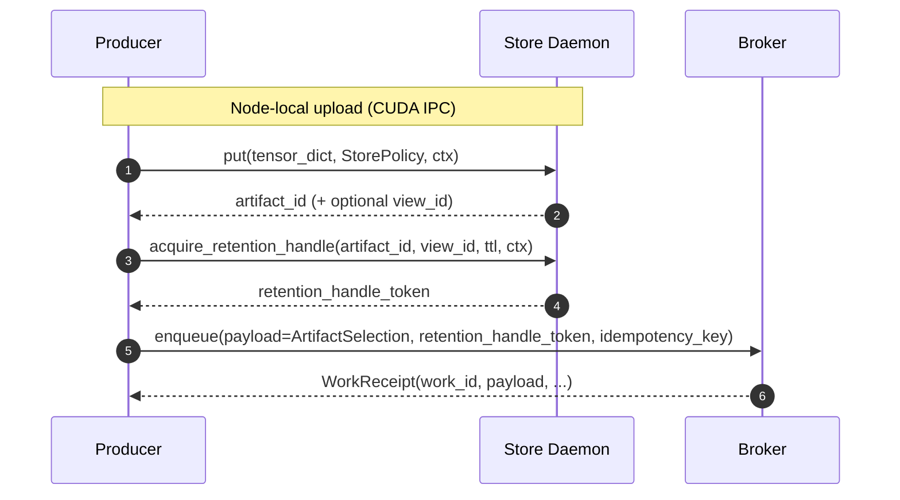

# Summary

TensorCast is already a distributed memory system plus a data movement engine. What is missing for large, temporary
tensor payloads (tens of MB to GB) is a **control-plane work queue** that treats:

- **tensor lifecycle** (who must keep the bytes alive, for how long), and
- **memory-pressure scheduling semantics** (what to do under VRAM/DRAM pressure)

as first-class concepts.

This design introduces a **descriptor-only, at-least-once MPMC work queue** that carries *metadata only* and reuses the
existing TensorCast data plane for bytes (P2P, disk fallback, staging, verification). Queue items reference TensorCast
**Artifacts** (and optional **Views**) so we do not introduce a parallel "data object" abstraction.

**V1 scope (MVP, important):**

- V1 is explicitly **L0 (ephemeral)**: broker state is in-memory only. If the broker leader crashes/restarts, queued
  state MAY be lost. "At-least-once" is scoped to leader liveness; v1 is not a durable message queue.
- Queue identity is namespaced: a queue is identified by `(queue_namespace, queue_name)`; all routing, fencing, and
  idempotency derive from this identity.
- V1 queue-staged payloads (`payload_origin=queue_staged`, `retention_mode=handle`) require **exactly one** configured
  consumer group; multi-group delivery for queue-staged payloads is deferred to v2+.

To prevent producer/consumer OOM, the queue explicitly models two resource contracts:

1. **Retain (producer-side)**
   - A `RetainLease` guarantees that the payload referenced by the descriptor remains re-materializable while a message is
     pending/inflight.
   - `size_bytes` is accounted against a `retained_bytes_limit` for `retention_mode=handle` items (v1: queue-scoped),
     limiting backlog so producers and brokers cannot be permanently pinned by downstream slowness.

2. **Credit (consumer-side)**
   - A `CreditReservation` limits how many bytes a consumer group may have in-flight.
   - Materialization is **pull-first** (consumer controls when bytes move), with explicit claim policies
     (`block/defer/fail`) to define behavior under memory pressure (byte-tier spill/evict is expressed via `StorePolicy`).

Additionally, to decouple upstream VRAM allocation from queue backlog, the queue provides an **Upstream Offload** path:
an optional stage step that converts a producer-owned VRAM tensor dict into a daemon-owned Artifact stored in the
distributed store (v1: stable DRAM on a producer-local daemon via CUDA IPC; optional more flexible placement in v2+),
then enqueues only the resulting
descriptor.

---

# Prior State (Grounding)

This design is intentionally shaped to align with existing TensorCast APIs and invariants:

- **Upstream offload already exists as `put`**: `tensorcast.put(...)` requires CUDA tensors and performs a
  `PlanType.DRAM_STABLE` registration, producing a daemon-owned stable-DRAM replica (CPU) suitable for use as an
  upstream spill buffer.
- **Registration keepalive is PID-bound**: `KeepAliveRegisterArtifactRequest.owner_pid` is required and must equal
  `BeginRegisterArtifactRequest.owner_pid` in `proto/tensorcast/daemon/v2/store_daemon.proto`. Therefore, queue-managed
  retention MUST NOT depend on registration keepalive and instead relies on the platform retention-handle primitive
  described in `docs/designs/0034-stable-memory-tiers.md`.
- **Renewable capability tokens exist**: `CreatePlacementLease` / `RenewPlacementLease` / `ReleasePlacementLease` are
  renewable via an opaque capability token (see `docs/designs/0055-programmable-framework.md`). Queue WorkLease tokens
  and retention-handle tokens MUST follow the unified envelope/validation discipline (see
  `docs/designs/0055-programmable-framework.md`).

# Goals / Non-Goals

## Goals

1. **Descriptor-only queue**
   - Broker never transports tensor bytes. Payload bytes always flow through existing TensorCast data paths.

2. **Artifact-first payload identity**
   - Queue items reference `Artifact` (and optional `View`) handles.
   - No parallel "message payload object" abstraction is introduced.

3. **At-least-once MPMC semantics**
   - Competing consumers within a consumer group.
   - Visibility timeout + redelivery with `work_id` + `attempt` for dedupe ("effectively-once" by user logic).

4. **Lifecycle and memory pressure are first-class**
   - Explicit retention (`RetainLease`) and consumer credit (`CreditReservation`).
   - Explicit claim policies under pressure: `block/defer/fail` (byte-tier spill/evict is expressed via `StorePolicy`).

5. **Partial / delayed pull**
   - A consumer can claim a ticket and materialize later (claim never moves bytes).
   - A consumer can materialize only a subset via `ViewSpec` and existing view planning (`SelectionPlan`).

6. **Composable with the programmable framework**
   - Queue SDK actions accept `CallContext` (qos/deadline/idempotency/tags) following `0055-programmable-framework`.
   - Queue gRPC messages do not embed `CallContext`; SDK maps `ctx.deadline_ms` → RPC deadline and
     `ctx.idempotency_key` → `EnqueueWorkRequest.idempotency_key`.
   - Enqueue is retry-safe when `idempotency_key` is provided (deterministic `work_id`).
   - Long-tail actions expose `Operation[T]` where appropriate.
   - Queue signals integrate into `ExecutionSignals` (queue depth/inflight/age).

7. **Minimal Global Store hot-path impact**
   - High-frequency queue state lives in the broker leader (v1 is single-partition).
   - Global Store is used only for low-frequency directory/discovery/config.

## Non-Goals

- Exactly-once delivery (we are at-least-once).
- A broker that stores or relays tensor bytes.
- A partitioned/sharded queue (v1 is explicitly single-partition; no cross-partition rebalancing).
- A general-purpose distributed function runtime (Ray-like). Queue items are descriptors, not code.
- Replacing TensorCast transport, staging, or ingestion pipelines.
- Hot-reload configuration (follows unified config; restart boundary).

---

# V1 Scope (MVP) (normative)

V1 is intentionally narrow so it can ship safely with existing TensorCast primitives:

- **Consistency level:** L0 (ephemeral), single-partition per queue (no sharding).
- **Correctness boundary:** descriptor delivery is at-least-once **while the broker leader is alive and unfenced**.
  After leader loss, in-memory queue state MAY be lost and `attempt` may reset.
- **Durability boundary:** the queue does not itself provide byte durability. If callers need eventual delivery across
  long backlogs, they MUST choose a `StorePolicy` that provides a durable rematerialization path.

## Supported combinations (v1) (required)

V1 deliberately supports only the combinations that are fully closed under today's primitives (views, retention handles,
capability tokens, unified config). Other combinations are deferred to v2+.

| PayloadOrigin | RetentionMode | v1 support | Rationale / notes |
| --- | --- | --- | --- |
| `queue_staged` | `handle` | **YES (primary path)** | Intended for upstream offload (`stage_and_enqueue`). V1 requires exactly one configured consumer group for queues that accept `queue_staged`. Producer supplies a RetentionHandle token from the staging daemon; broker validates + renews/releases it until delivery completes. `charged_bytes` is authoritative for accounting. |
| `external` | `policy_only` | **YES** | Intended for externally-managed artifacts (weights/ckpts). Queue does not hold explicit retention refs; broker does not have an issuer-side "path lost" signal and dead-letters via attempts-exceeded (or consumer terminal failure in v2+). Bytes remain available only according to the artifact's own `StorePolicy`/durability. |
| `external` | `handle` | NO (v1) | Requires a well-defined issuer-selection rule for retention handles over arbitrary artifacts, plus operator expectations about pinning shared resources. |
| `queue_staged` | `policy_only` | NO (v1) | Creates ambiguous resource/cleanup semantics for queue-staged payloads (no explicit ref to bound leakage and no cleanup hook). |

V1 enforcement rules (normative):

- If an unsupported combination is requested, the broker MUST fail `FAILED_PRECONDITION` (fast, non-retryable).
- V1 retained-bytes accounting (`retained_bytes_limit`, queue-scoped) applies only to `retention_mode=handle`.
- V1 restriction (required): for `payload_origin=queue_staged` work (v1 implies `retention_mode=handle`), the queue MUST
  have exactly one configured consumer group. Multi-group delivery for queue-staged payloads is deferred to v2+ (it
  requires
  explicit delivery-set semantics and/or consumer-group liveness to avoid unbounded retention).
- V1 MUST also bound broker memory/descriptor backlog independent of retention mode (see `max_pending_items` and
  `max_pending_descriptor_bytes` in the config sketch).

# Consistency Contract (normative)

This section defines the **system-wide consistency boundaries** for the work queue. All other semantics (leases, credit,
queue-staged cleanup, dead-lettering) must be derived from these rules.

## State ownership, durability, and write frequency

Queue introduces new state. To keep TensorCast consistent, we must be explicit about which component is the source of
truth (SoT) and what survives failures.

| State | SoT | Durability | Write rate | Notes |
| --- | --- | --- | --- | --- |
| Work item state (`PENDING/INFLIGHT/DELAYED/ACKED/DEADLETTER`) | Broker leader | See levels below | High | Descriptor-only; never stores bytes. |
| Queue leadership + fencing epoch | Global Store `operation.proto` lease | Durable | Low | Used only to fence stale tokens and avoid split-brain writes. |
| Work lease (visibility) | Broker leader | Same as work state | High | Token MUST carry fencing epoch. |
| Consumer credit ledger | Broker leader | Same as work state | High | Per `(queue, group)`; idempotent release on terminal transitions. |
| Retain state (“rematerialization path exists”) | Artifact + StorePolicy + broker retention refs | Depends on StorePolicy | Medium | RetainLease does not create new byte-store; it tracks whether a valid path still exists. |
| Bytes / replicas | Store daemons (StoreEngine) | Per StorePolicy tier | High | The queue never transports bytes and must not become a byte store. |

## Consistency levels (L0/L1/L2)

Queue is explicitly versioned by consistency level so v1 semantics are unambiguous.

- **L0 (ephemeral broker)**: broker state is in-memory only. Restart/leader loss MAY drop queue state.
  - In L0, **at-least-once** is guaranteed only while the broker leader is alive (no crash recovery).
- **L1 (local recovery)**: broker persists its own state locally (e.g., WAL/KV) and replays on restart.
  - Guarantees: no loss from daemon restart on the same node; still at-least-once (duplicates allowed).
- **L2 (HA replicated)**: broker state is replicated (e.g., Raft / primary+replica).
  - Guarantees: no loss under single-node failure; still at-least-once.

V1 scope (recommended MVP): **L0** with explicit fencing (see below), plus a plan to evolve to L1 without changing the
client API surface.

### V1 (L0) semantic boundary (required)

In v1, the broker is explicitly **L0 (ephemeral)** and **single-partition** (no sharding). Therefore:

- **At-least-once delivery is scoped to leader liveness**: while the broker leader process is alive and unfenced, the
  broker provides at-least-once delivery (duplicates allowed). If the leader crashes or restarts, in-memory queue state
  may be lost.
- **`attempt` is best-effort across failures**: `attempt` is monotonic only while the broker leader is alive. After
  leader loss it may reset. Consumers MUST treat `work_id` (not `attempt`) as the stable identity for dedupe and
  idempotent processing.
- **Tokens are epoch-fenced**: all broker-issued capability tokens MUST carry the queue epoch; after a leader change,
  old tokens MUST fail fast with `FAILED_PRECONDITION` (never silently applied).

### V1 (L0) failure semantics matrix (required)

L0 is intentionally explicit about what does *not* survive failures. The table below is normative and is the basis for
SDK retry behavior and operator expectations.

| Failure / partition | Observable behavior | Required handling | Notes |
| --- | --- | --- | --- |
| Broker leader crashes or restarts | Queue state MAY be lost; in-flight `WorkLease` tokens become invalid | Clients retry by re-`claim` / re-`enqueue` (idempotently when possible) | In v1, at-least-once is scoped to leader liveness. `attempt` may reset. |
| Broker cannot keepalive queue leadership lease (Global Store) | Leader self-fences; all write RPCs fail `UNAVAILABLE` | Clients backoff and refresh directory on `UNAVAILABLE`; do not assume tokens can be used while fenced | Self-fencing is a correctness mechanism to avoid split brain writes. |
| Global Store outage | If outage exceeds the broker’s lease keepalive budget, broker self-fences; directory refresh may fail; queue-owned retention renewals stop while fenced | SDK MUST rely on cached directory results with bounded staleness budgets and backoff; callers needing eventual delivery MUST choose durable `StorePolicy` | Directory is advisory; correctness comes from epoch-fenced tokens. For `retention_mode=handle`, prolonged fencing can cause handle expiry and "path lost" dead-lettering in v1. |
| Retention issuer daemon loses the path (evicted/expired/no durable fallback) | `RenewRetentionHandle` fails non-retryably (`FAILED_PRECONDITION`) | Broker MUST transition the affected `queue_staged` work item to a terminal failure path (dead-letter) | This is the “path lost” signal; v1 does not attempt global GC or reconstruction. |
| Policy-only payload is no longer rematerializable | Consumer materialization fails repeatedly (e.g., `NOT_FOUND`, `DATA_LOSS`, `UNAVAILABLE`) | Consumers retry/nack with backoff; broker redelivers until `deadletter_max_attempts` (or a consumer-provided terminal failure signal in v2+) | In v1, the broker does not have an issuer-side "path lost" signal for `retention_mode=policy_only`. |
| Consumer crashes / loses progress | No ack; visibility timeout expires | Broker redelivers (`attempt+1`); credit is released on timeout | Exactly-once is not provided; consumer must dedupe by `work_id`. |

## Identifiers and derived ids (required)

Queue semantics rely on **stable, explicit identifiers**. V1 MUST NOT rely on implicit string concatenation that can
drift across languages.

### Queue identity (QueueId)

A queue is uniquely identified by:

- `queue_namespace`: logical namespace (e.g., `"rl"`)
- `queue_name`: queue name within the namespace (e.g., `"features"`)

We refer to the pair as `QueueId = (queue_namespace, queue_name)`.

### Queue leadership lease principal (required)

Queue leadership fencing reuses Global Store operation leases (`proto/tensorcast/operation/v1/operation.proto`).
For project-wide interface consistency, the queue MUST standardize *all* required `AcquireOperationLeaseRequest` fields
(Global Store rejects empty values):

- `operation_id = queue_operation_id` (canonical principal; see below)
- `kind = "queue_leader_v1"` (constant; bumps when the lease semantics change)
- `target_artifact_id = queue_operation_id` (deterministic and debuggable; this field name is historical)
- `owner_id = daemon_id` of the broker leader

### Deterministic queue_operation_id (required)

Queue leadership fencing reuses Global Store operation leases. To avoid collisions and unbounded IDs, the broker and
SDK MUST derive a deterministic, bounded-length `queue_operation_id` from `QueueId` without ad-hoc string
concatenation (to avoid cross-language drift and delimiter/escaping bugs):

- Define `QueueRef{queue_namespace, queue_name}` exactly as in `proto/tensorcast/queue/v1/...` (v1 proto).
- `queue_operation_id = "queue:v1:" + UUID5("tensorcast.queue.v1", HEX(DETERMINISTIC_PROTO(QueueRef{queue_namespace, queue_name})))`

Notes:

- `UUID5(namespace, name)` is the repo-standard deterministic UUID function used for control-plane identities (see
  `docs/designs/0055-programmable-framework.md`). It returns an RFC 4122 UUID string (lowercase, hyphenated).
- Note: some legacy comments/examples may refer to multihash-derived operation ids; for queue fencing we standardize on
  `UUID5(...)` to keep control-plane ids consistent with `0055-programmable-framework`.
- `HEX(...)` encodes bytes as lowercase hex without separators.
- `DETERMINISTIC_PROTO(...)` means deterministic Protobuf serialization (the same discipline required for capability
  token envelope scopes in `docs/designs/0055-programmable-framework.md`).
- SDK/broker MUST treat `queue_namespace` / `queue_name` as exact strings (no trimming/casefolding/normalization) unless
  the normalization rule is explicit and shared across languages.
- The `queue_operation_id` string is the canonical principal for queue fencing and MUST be embedded in WorkLease
  capability tokens (`QueueEpochFencing.queue_operation_id`).

### Work identity (required)

Within a queue, we standardize:

- `work_id`: stable logical identity of the enqueued work item.
- `attempt`: per-delivery-attempt counter for that `(work_id, consumer_group)`; monotonic only while the broker leader
  is alive in L0.

## Queue leadership and fencing (required)

Because the queue has a write-heavy hot path, we must avoid using Global Store for per-item state, but we still need a
cluster-wide fencing mechanism to prevent split brain (two leaders accepting writes for the same queue).

Design rule (normative):

> Each queue MUST have at most one active leader, and all write tokens MUST be fenced by a queue epoch.

We reuse existing Global Store `operation.proto` leases as a **low-frequency** queue leader lease:

- Each `QueueId` maps to a stable `queue_operation_id` (see “Deterministic queue_operation_id” above).
- The queue leader must hold an active operation lease and treat `lease_generation` as the queue epoch.
- Any broker-issued capability token (ack/nack/extend/renew) MUST embed (directly or indirectly) the queue epoch.
- After leader change, the new leader MUST reject all tokens minted under older epochs with `FAILED_PRECONDITION`.

This matches the fencing guidance in `0055-programmable-framework` (use `operation.proto` only for low-rate global
coordination + fencing; keep hot paths daemon-local).

### Self-fencing (required)

The queue leader MUST fail closed when it cannot prove leadership:

- If the leader cannot keepalive/renew its `operation.proto` lease within a bounded deadline, it MUST transition to a
  **fenced** state and reject all write RPCs (`EnqueueWork`, `ClaimWork`, `AckWork`, `NackWork`, `ExtendVisibility`)
  until it can re-acquire leadership.
- While fenced, the broker MAY serve read-only stats, but it MUST NOT mint or accept capability tokens.
  - While fenced, write RPCs MUST fail fast with `UNAVAILABLE` (not `FAILED_PRECONDITION`).
- While fenced, the broker MUST NOT perform queue-owned side effects that extend or reduce correctness-relevant
  lifetimes (e.g., renewing or releasing `RetainLease` retention handles). Time-bounded handles and deadlines are the
  safety net for bounded resource usage under loss of leadership.

Operational guidance (v1, required):

- Because v1 is L0 and fenced leaders stop renewing retention, operators SHOULD configure RetentionHandle TTL caps such
  that transient Global Store outages and leader transitions do not immediately cause handle expiry (recommendation:
  RetentionHandle TTL >= 5-10x the queue leadership lease keepalive failure budget).

## Leader discovery and routing (required)

The capability directory described in `docs/designs/0055-programmable-framework.md` answers “which daemons can host
brokers”, but it is not sufficient to route to the **current** leader for a specific `queue_name`.

Design rule (normative):

> The Global Store `operation.proto` lease is the source of truth for `(leader_daemon_id, queue_epoch)`, and the Global
> Store worker/instance registry is used only to map stable identities to routable endpoints.

Recommended v1 routing algorithm (SDK/broker clients):

1. Resolve `queue_operation_id` deterministically from `QueueId = (queue_namespace, queue_name)` (see
   “Deterministic queue_operation_id” above).
2. Call `GlobalStoreService.GetOperation(queue_operation_id)` and read:
   - `lease_owner` (MUST be the broker leader’s `daemon_id`)
   - `lease_generation` (the queue epoch)
3. Resolve `lease_owner` → broker endpoint using cached worker registry data (`daemon_id` → `SocketAddress`).
4. Cache `(leader_daemon_id, endpoint, queue_epoch)` with a bounded staleness budget. Refresh is triggered by:
   - staleness expiry,
   - `UNAVAILABLE` from a broker endpoint (leader moved or fenced),
   - `FAILED_PRECONDITION` indicating stale epoch-fenced tokens.

Optional optimization (recommended):

- When a follower receives a write RPC, it SHOULD fail `UNAVAILABLE` and MAY attach a lightweight “leader hint”
  (`leader_daemon_id`) to reduce discovery latency. The hint is advisory only; correctness is still enforced by epoch
  fencing.

## Issuer discovery and routing (required)

Some queue-managed resources are **daemon-scoped issuer capabilities** (not broker-scoped), most notably RetentionHandle
tokens (`docs/designs/0034-stable-memory-tiers.md`). These tokens:

- MUST be validated by the issuing daemon (issuer-only validation).
- MUST be routed to the issuing daemon for renew/release.

Design rule (normative):

> A broker MUST NOT attempt to renew/release a RetentionHandle via the queue leader endpoint unless the leader is also
> the issuer. Retention operations are routed by `issuer_daemon_id`.

Recommended v1 routing algorithm (broker internal):

1. Parse the unified capability token envelope header to read `issuer_daemon_id` (do not assume the token is valid yet).
2. Resolve `issuer_daemon_id` → endpoint using cached worker registry data (`daemon_id` → `SocketAddress`).
3. Call the issuer daemon (`RenewRetentionHandle` / `ReleaseRetentionHandle`) with bounded deadlines/backoff.

Note: SDKs SHOULD continue treating capability tokens as opaque bytes; only system components that must route issuer
RPCs (broker, controller) need envelope parsing, and they MUST treat envelope fields as untrusted until the issuer
validates the token.

## Idempotency and identity (required)

Queue correctness depends on **retry safety**. TensorCast’s programmable framework already standardizes idempotency via
`CallContext.idempotency_key`; queue must follow the same approach. On-wire, this is carried as an explicit
`EnqueueWorkRequest.idempotency_key` field (see proto sketch); SDKs map `ctx.idempotency_key` → that field.

### Work identity

We standardize the identity surface returned to consumers:

- `work_id`: stable identity of the logical work item (within a queue).
- `attempt`: monotonically increasing **delivery attempt** counter for that `(work_id, consumer_group)`.

Note (required):

- `work_id` is an opaque string. V1's recommended deterministic format is `work:v1:<uuid>`; callers MUST NOT parse it or
  assume any UUID version semantics.

Design rule (normative):

> Enqueue MUST be idempotent when `idempotency_key` is provided.

Recommended v1 mechanism:

- If the client provides `idempotency_key` (SDK: `ctx.idempotency_key`), the broker derives `work_id` deterministically using deterministic
  Protobuf serialization (stable across languages) and the repo-standard deterministic UUID:
  - Define `WorkIdDerivationInput` as a deterministic Protobuf message containing:
    - `idempotency_key` (string),
    - `QueueRef{queue_namespace, queue_name}`,
    - `queue_key`,
    - canonicalized payload selection identity (at minimum: `artifact_id`, resolved `view_id`, `logical_layout_hash`,
      `selection_hash`, `view_subset_hash`),
    - lifecycle modes that affect correctness (`payload_origin`, `retention_mode`).
  - `work_id = "work:v1:" + UUID5("tensorcast.work.v1", HEX(DETERMINISTIC_PROTO(WorkIdDerivationInput)))`
- If no idempotency key is provided, the broker generates a random `work_id`, but **enqueue retries are not safe**
  (caller assumes at-least-once enqueue; retries may enqueue duplicates).

Attempt semantics (normative):

- `attempt` is assigned when a claim transitions an item to `INFLIGHT` and a new `WorkLease` token is minted.
- `attempt` starts at `1` for the first successful claim of an item by a given consumer group and increments by `+1`
  for each subsequent successful claim (including redelivery after timeout or after a `nack` delay).
- `attempt` MUST NOT change while an item is `INFLIGHT`. All ack/nack/extend calls are scoped to the `(work_id, attempt)`
  bound in the presented `WorkLease` token.

### RPC idempotency rules

- `EnqueueWork`: idempotent under `(QueueId, work_id)` and returns the existing `work_id` on duplicates.
- `AckWork` / `NackWork` / `ExtendVisibility`: idempotent under the presented `WorkLease` token.
- `ClaimWork`: NOT idempotent (it selects work); clients must tolerate retries returning different items.

Idempotency conflict rule (required):

- If a duplicate enqueue resolves to an existing `work_id`, the broker MUST validate that the canonical enqueue inputs
  match the existing item’s **canonical work descriptor** (selection identity + lifecycle modes + authoritative
  accounting fields). Conflicts MUST fail fast with `FAILED_PRECONDITION` and MUST NOT mutate the existing item.

## Consumer group semantics (required)

TensorCast queues support multiple **consumer groups** per queue:

- A **queue** is identified by `QueueId = (queue_namespace, queue_name)`.
- A **consumer group** is an independent delivery/ack state machine over the same enqueued items.
- Within a group: competing consumers (MPMC).
- Across groups: each group receives the item independently (at-least-once per group).

V1 restriction (required):

- For `payload_origin=queue_staged` (v1 implies `retention_mode=handle`), the delivery set MUST be a singleton: the queue
  MUST have exactly one configured consumer group. This keeps retention + queue-staged cleanup semantics closed under L0
  and avoids unbounded retention when any group stalls indefinitely.
- Multi-group delivery for queue-staged payloads is deferred to v2+ (it requires explicit delivery-set semantics and/or
  consumer-group liveness).

To avoid “future group” ambiguity for queue-staged cleanup, the broker snapshots the **delivery set** at enqueue time:

- `delivery_groups` = the set of consumer groups known/configured for the queue at the moment of enqueue.
- For `retention_mode=handle`, retention is held until all groups in `delivery_groups` reach a terminal state
  (`ACKED` or `DEADLETTER`) for that item.
- For `payload_origin=queue_staged`, post-delivery cleanup is scheduled only after the delivery set reaches terminal
  state.

V1: consumer groups are configured (unified config) and are not created implicitly by `ClaimWork`.

Consumer group mutation rule (v1, required):

- Consumer group identity is **append-only** for a given queue. New groups start receiving items only for enqueues after
  the group is added (because `delivery_groups` is snapped at enqueue).
- Updating per-group limits (e.g., `credit_limit_bytes`) is allowed, but any change that could strand already-enqueued
  work (for example lowering `credit_limit_bytes` below the size of pending items) requires an explicit drain/migration
  plan; v1 does not define an online reconciliation mechanism.
- Removing/renaming groups is not supported in v1 because it creates ambiguous completion semantics for
  `payload_origin=queue_staged` payloads
  (retention cleanup would otherwise wait forever). Group removal requires an explicit, offline migration/drain plan.

# Core Concepts

## ArtifactSelection (payload identity)

Queue payload identity is always an Artifact selection handle:

- `artifact_id` (content-addressed)
- optional `view_id` and selection/subset inputs for partial materialization

Design rule (normative):

> Queue MUST NOT introduce a parallel payload abstraction. Payload is always an Artifact/View.

Payload identity consistency (required):

- If a non-identity `ViewSpec` is provided, the broker MUST ensure a stable `view_id` exists (per
  `docs/designs/0016-artifact-view-v1.md`) before the selection is accepted for enqueue, so `work_id` derivation and
  cache identity cannot drift.

## Selection identity (required)

For deterministic `work_id` derivation and safe retries, queue uses the already-standardized selection fingerprints
used across the programmable framework:

- `logical_layout_hash` (base byte space identity)
- `selection_hash` (view/subset identity on top of the base)

When a queue item carries a `ViewSpec` and/or `tensor_names`, inputs MUST be canonicalized and a stable `view_id` MUST be
resolved (per `docs/designs/0016-artifact-view-v1.md`) before hashing, so cache identity cannot drift.

## CanonicalWorkDescriptor (required)

A queue is descriptor-only, but the broker still needs an **authoritative, immutable** descriptor to make retries safe
and quotas enforceable.

We define a `CanonicalWorkDescriptor` as the broker-owned, canonicalized record of enqueue inputs used for:

- deterministic `work_id` derivation,
- enqueue idempotency conflict detection,
- all byte accounting (retained bytes + consumer credit),
- (v1+) future L1 recovery via a local WAL without changing the public API.

CanonicalWorkDescriptor contains:

- a canonicalized `ArtifactSelection` (including resolved `view_id` and standardized fingerprints),
- an authoritative `size_bytes` for the canonicalized selection,
- lifecycle modes (`payload_origin`, `retention_mode`) and queue routing fields
  (`queue_namespace`, `queue_name`, `queue_key`).

Authority rules (normative):

- Client-provided sizes are hints only; the broker MUST NOT trust `size_bytes` as authoritative for quotas.
- The broker MUST derive an authoritative `size_bytes` before accepting the enqueue, without moving payload bytes.
  Recommended v1 mechanisms:
  - `retention_mode=handle` (primary v1 path): validate the provided RetentionHandle capability with its issuer daemon
    (e.g., `RenewRetentionHandle`) and use the issuer-returned `charged_bytes` as authoritative `size_bytes`. The broker
    MUST treat any client-provided size as a hint only and MUST NOT accept unvalidated sizes for accounting.
  - `retention_mode=policy_only`: derive `size_bytes` via metadata-only planning:
    - identity selection (no view/subset): use `ArtifactDescriptor.total_size` as authoritative size;
    - subset-only (tensor_names, no view): fetch/parse canonical index v3 and sum selected tensor entry sizes;
    - non-identity view and/or view subset: run the existing view planner to obtain a `SelectionPlan` and use
      `SelectionPlan.total_bytes`.
  - The broker SHOULD cache derived sizes by selection identity (hashes) to avoid repeated planning in hot paths.
- If the broker cannot derive/validate an authoritative size within the enqueue deadline budget, enqueue MUST fail
  (do not accept unaccounted work).

## Work queue semantics

We model a **work queue** delivery state machine per `(queue_name, consumer_group)`:

- **MPMC**: multiple producers can enqueue; multiple consumers can claim (competing).
- **At-least-once**: claim moves an item into `INFLIGHT` for `visibility_timeout`; missing ack returns it to `PENDING`.
- **Idempotency surface**: consumers receive explicit `(work_id, attempt)` and MUST assume duplicates.

## Leases and resource contracts

The queue defines three lease-like constructs (implemented by broker logic; may reuse daemon `SessionLifecycleManager`):

1. **RetainLease**
   - Tracks whether there exists at least one valid **rematerialization path** for the payload while the item is not
     terminal (`ACKED`/`DEADLETTER`) for all delivery groups.
   - Implemented via **RetentionHandles** (daemon-issued, renewable + releasable) described in
     `docs/designs/0034-stable-memory-tiers.md`:
     - Renewable and releasable via a daemon-issued capability token (not PID-bound).
     - Release MUST be able to downgrade effective retention when all refs are released.
   - MUST NOT rely on PID-bound registration keepalive.
   - V1 backing for `payload_origin=queue_staged`:
     - Payload is staged via `put` (`PlanType.DRAM_STABLE`) onto a daemon that is node-local to the producer (CUDA IPC).
     - The producer (or node-local agent) acquires a retention handle token from the staging daemon and includes it on
       enqueue, so the broker does not need to guess the ingress daemon from replica directories.
     - The broker stores the token and renews/releases it until the delivery set reaches terminal state.
     - The broker MUST validate the token with the issuer on enqueue (and record issuer-returned `charged_bytes`) so
       accounting cannot be bypassed by a forged client hint.
       - Recommended: perform a `RenewRetentionHandle` during enqueue to both validate and refresh the token, and treat
         `charged_bytes` as authoritative `size_bytes` for both retained-bytes and credit accounting.
     - The retention handle TTL is intentionally **short-lived and renewable**: expiry bounds resource leakage if the
       broker crashes or loses leadership; the issuer clamps TTLs via configured caps (see
       `docs/designs/0034-stable-memory-tiers.md`).
   - Authority and failure classification (required):
     - The retention-handle issuer daemon is the source of truth for whether a rematerialization path still exists.
     - A broker MUST NOT transition to `DEADLETTER` solely due to transient consumer materialization failures; consumer
       failures may trigger an issuer-side re-check (renew/validate), but terminal failure must be driven by an
       issuer-side non-retryable response.
     - Renewal/expiry handling (required):
       - While the item is non-terminal, the broker MUST renew the handle sufficiently ahead of expiry (with jitter) to
         avoid deadline/clock skew flakiness.
       - The broker MUST treat `UNAVAILABLE` / `DEADLINE_EXCEEDED` renew failures as transient and retry with bounded
         backoff, but MUST treat `FAILED_PRECONDITION` as a non-retryable “path lost” signal and transition to
         `DEADLETTER` (for all delivery groups of the affected work item).
       - Token expiry without a successful renew MUST be treated as “path lost” for v1 queue semantics.
   - Optional durability upgrade (v2+):
     - When the broker detects backlog/pressure that risks stable eviction before completion, it may initiate a
       durability upgrade (e.g., persist to shared disk) so the rematerialization path remains valid across time.
       This SHOULD reuse the existing persistence flow (`docs/architecture/api/policy-persistence.md`) and be surfaced as
       an `Operation[...]` when it is long-tail.
       - Note: v1 does not define a durable reclamation model for queue-owned payloads; durable upgrades must not imply
         "delete durable bytes on ack" without an explicit GC design.

2. **WorkLease (VisibilityLease)**
   - Enforces claim exclusivity for the visibility window.
   - Supports `extend_visibility(...)` and fail-safe expiry.
   - MUST be fenced by queue epoch; stale tokens must be rejected.

3. **CreditReservation**
   - An accounting token reserved at claim time and released on ack/nack/timeout.
   - Bounds the consumer's in-flight work.

### Consumer credit model (v1) (required)

V1 credit is a **broker-owned, per-(queue, group) ledger**. It is not a per-consumer "grant" protocol.

- Credit is a control-plane **backpressure / admission** mechanism. It bounds aggregate in-flight bytes for a group, but
  it is not a guarantee that any specific consumer has sufficient VRAM/DRAM at materialization time; daemon-level
  allocation and transport may still fail with `RESOURCE_EXHAUSTED` and must be handled by the consumer.

- **Authoritative limit:** `credit_limit_bytes` is configured per consumer group in unified config and is the hard cap.
- **Reservation unit:** each claim reserves `item.size_bytes` from the group's ledger.
- **Defer still reserves:** `ClaimPolicy=defer` MUST still reserve credit at claim time (ticket claims without byte
  reservation are a correctness risk; materialization may happen later and cause OOM).
- **Release rules (normative):**
  - `AckWork`: releases the reservation.
  - `NackWork` (with or without delay): releases the reservation immediately.
  - Visibility timeout: releases the reservation when the lease expires and the item becomes claimable again.
  - `ExtendVisibility`: does not change credit.
- **Admission rules (normative):** the broker MUST NOT transition an item to `INFLIGHT` unless
  `inflight_credit_bytes + item.size_bytes <= credit_limit_bytes` for that group.

Mapping to existing lifecycle machinery:

- Retain and work leases should reuse the **Lease/Guard/Finalizer** discipline described in `0011-unified-session-lifecycle-leases`,
  including bounded deadlines, idempotent finalizers, and fail-fast semantics.

WorkLease token requirements (normative):

- Token MUST use the unified capability-token envelope described in `docs/designs/0055-programmable-framework.md`,
  including audience binding so WorkLease tokens cannot be confused with retention or placement tokens.
- Token MUST be unforgeable (capability token) and scoped tightly to one claim, including fencing to a stable principal:
  `(queue_operation_id, queue_epoch, queue_namespace, queue_name, group, work_id, attempt, lease_id, visibility_expires_at_ms)`.
- `visibility_expires_at_ms` is a unix-epoch millisecond timestamp (wall clock), consistent with `RetentionHandle.expires_at_ms`
  and `CapabilityTokenEnvelope.expires_at_ms`.
- Broker MUST validate `queue_epoch` fencing (reject stale epochs) and MUST NOT accept ack/nack/extend for a different
  `(work_id, attempt)` than the token binds.
- On retry, ack/nack/extend using the same token MUST be idempotent (no double credit release).

## RetentionMode (handle vs policy-only)

Queue must be explicit about whether the broker holds an **explicit, renewable retention reference** (a retention handle
token), or whether it is relying solely on the payload’s `StorePolicy` durability.

We standardize two modes:

- `handle`: the broker stores a `RetentionHandle` capability token and is responsible for renew + release while the work
  item is non-terminal.
- `policy_only`: the broker does not store any explicit retention reference; rematerialization relies on the artifact’s
  own policy and durability tier(s).

Design rules (normative):

- `retained_bytes_limit` applies to items with `retention_mode=handle` (these are the only items where the queue can
  directly pin stable resources and therefore leak them under loss of broker state). The limit is queue-scoped.
- When `retention_mode=handle`, `retention_handle_token` MUST be present and the broker MUST use issuer-provided `charged_bytes`
  (or validated size) for accounting.

V1 restriction (required):

- In v1, `retention_mode=handle` is supported only for `payload_origin=queue_staged` (see “Supported combinations (v1)”).

## PayloadOrigin (queue-staged vs external)

Queue items must explicitly encode whether the queue is allowed to perform **post-delivery cleanup** side effects.
This field is intentionally named *origin* (not "ownership") to avoid confusion with content-addressed global artifact
identities.

- `queue_staged`: the payload was created for this queue (typically via `stage_and_enqueue`) and the queue is allowed to
  perform best-effort local replica cleanup after the delivery set reaches terminal state (e.g., drop stable DRAM
  retention intent and unload local CPU replicas).
- `external`: the payload references an externally-managed artifact (e.g., weights, checkpoints). The queue MUST NOT
  delete or deregister it. Cleanup MUST remain best-effort and strictly local (never assume global uniqueness for a
  content-addressed `artifact_id`).

Design rule (normative):

> Only `payload_origin=queue_staged` payloads participate in broker-initiated cleanup. Retained-bytes accounting applies
> to `retention_mode=handle` (and v1 supports only `queue_staged+handle`).

Queue-staged payload cleanup (v1 intent; important nuance):

- TensorCast artifacts are content-addressed; the same `artifact_id` may be shared by multiple users/workflows.
  Therefore, `payload_origin=queue_staged` MUST NOT be interpreted as “safe to delete global content”.
- In v1, cleanup means: **release queue-managed retention refs** and request best-effort **local replica** cleanup on
  the daemon(s) that host those refs, without asserting global uniqueness.
  - For stable-DRAM staging (`put` / `PlanType.DRAM_STABLE`), cleanup is primarily “release stable retention intent”
    (drop TTL/pinned retention) and best-effort unload of the local CPU replica, subject to retire gates (refs, uses,
    placement pins, transport locks).
  - `DeregisterArtifact` is a LIP-specific cleanup path and MUST NOT be assumed to apply to all `queue_staged` payloads.
  - V1 does not attempt to delete durable/shared-disk content; durable reclamation requires a separate GC model.

- After the last required ack (per consumer group semantics), the broker schedules best-effort cleanup using the existing
  daemon unload/cleanup paths, with drain safeguards so in-flight exports can complete or fail cleanly. Cleanup should
  run as an idempotent finalizer.

## ClaimPolicy (queue scheduling semantics)

ClaimPolicy defines how `ClaimWork` behaves when there is pending work but **no item is currently admissible** under
admission constraints (credit and/or per-key inflight slots).
It does not change TensorCast's data plane (transport, staging, verification) and it does not redefine `StorePolicy`
semantics (retention/overflow/spill).

Scope rule (required):

> ClaimPolicy is a **consumer-side ClaimWork parameter** (waiting/error behavior). It is not a producer-specified
> attribute of a work item and it MUST NOT participate in `work_id` derivation or `CanonicalWorkDescriptor` identity.

We standardize three policies:

- `defer`: do not wait for admission. If no admissible item exists now, return no item (callers poll/backoff).
- `block`: wait (bounded by deadline) until an admissible item exists, then return it.
- `fail`: fail fast with `RESOURCE_EXHAUSTED` when the queue has pending work but none is currently admissible. If the
  queue is empty, return no item.

Important boundary:

> Claim never moves bytes. ClaimPolicy affects only admission waiting/error behavior; bytes move only through existing
> materialization/transport paths initiated by the consumer.

Note:

- Terminology: `defer` means "do not wait for admission"; it does *not* mean "claim now and defer materialization".
- GPU allocation inside the daemon already attempts eviction and may return `ResourceExhausted` if allocation fails.
  V1 queue semantics do not add daemon-level "wait for GPU to free" behavior; blocking is at the queue scheduler level.
- Byte-tier spill/evict semantics are expressed via `StorePolicy` (`overflow_policy`, stable retention policy, and
  persistence tiers). The queue does not introduce a second "spill" policy namespace.

## UpstreamOffload (producer VRAM decoupling)

Upstream offload addresses the producer backlog risk: if a producer generates a VRAM tensor dict and cannot immediately
handoff to a consumer, it should be able to **move the bytes into the distributed store** and release VRAM.

We standardize on existing TensorCast primitives:

- `tensorcast.put(tensor_dict, policy=...) -> RegisteredArtifact` (daemon-owned stable DRAM; `PlanType.DRAM_STABLE`)

The queue may optionally provide a convenience wrapper:

- `stage_and_enqueue(tensor_dict, ...) -> WorkReceipt`

Idempotency and orphan avoidance (required):

- `stage_and_enqueue` MUST be safe under retries. If the stage step succeeds but enqueue fails, the system must not leak
  unbounded stable DRAM/disk usage.
- V1 strategy: `stage_and_enqueue` is a node-local staging composition (`put` + acquire retention handle) followed by
  broker enqueue. Because `put` is CUDA-IPC constrained, the staging portion MUST run on a producer-local daemon. It MAY
  be executed directly by the SDK on the producer node, or via a node-local agent boundary (recommended) as a small
  Plan step (see `docs/designs/0055-programmable-framework.md`). Retries are made safe by requiring
  `ctx.idempotency_key` and making enqueue idempotent (deterministic `work_id`).
- Orphans (stage succeeded, enqueue failed) MUST be bounded by policy (stable retention TTL and/or stable tier admission
  pressure). Best-effort orphan cleanup SHOULD exist, but is not required for descriptor delivery correctness in L0.

Policy is expressed as:

- `StorePolicy` (durability + retention + overflow semantics), plus
- an ingress rule for which daemon endpoint receives the upload.

V1 scope (recommended MVP):

- **Ingress is node-local to the producer**. `stage_and_enqueue` must upload via `put`, which uses CUDA IPC today and is
  therefore node-local to the daemon receiving the upload.
- After upload, the broker relies on **RetentionHandles** (`docs/designs/0034-stable-memory-tiers.md`) to manage
  retention and cleanup from a different process/node when needed.
- Store policy defaults to stable DRAM with TTL retention; optional disk spill is allowed by policy.

Future scope (v2+):

- Optional async relocation: after producer-local staging, the broker may initiate persistence/replication so the
  rematerialization path no longer depends on a single node’s stable DRAM.

## Durability versus delivery (descriptor-first)

Queue delivery is **at-least-once for descriptors**, not a durability guarantee for bytes.

Implications (normative):

- `retention_mode=handle`: the broker has an authoritative issuer signal for "path lost" (`RenewRetentionHandle`
  returns `FAILED_PRECONDITION`, or the handle expires without a successful renew). In that case, the broker MUST
  dead-letter the item rather than endlessly redelivering it.
- `retention_mode=policy_only`: the broker does not hold an issuer-scoped retention reference and therefore cannot
  authoritatively distinguish "bytes permanently unavailable" from transient materialization/transport failures. In v1,
  dead-lettering for policy-only items is driven by `deadletter_max_attempts` (attempts-exceeded) and/or an explicit
  consumer-provided terminal failure signal (v2+), not by broker-side "path lost" inference.
- If callers require "eventual delivery" across long backlogs, they MUST choose a `StorePolicy` / artifact placement
  that provides a durable re-materialization path (e.g., shared disk), and should use durability-gated spill behavior
  (see `docs/architecture/api/policy-persistence.md`).

---

# Architecture & Interfaces

## Layering and topology



Key rules:

- Broker stores only descriptors and lease/credit state. Any staged bytes are stored as normal Artifacts in the
  StoreEngine on the broker-enabled daemon, not inside broker state.
- Tensor bytes always move through existing daemon materialization (P2P, disk fallback) and communicator staging.
- Broker must not allocate pinned staging memory as "queue storage"; pinned memory remains a transport/staging resource
  (`0043-unified-pinned-memory-authority`).

## Deployment options

This design supports three deployment shapes:

1. **Embedded broker in the daemon (default)**
   - Lowest hop count and easiest access to local resource snapshots.
   - Requires strict internal isolation so control-plane progress is not starved by data-plane load.

2. **Broker-enabled daemon subset**
   - Only some daemons enable the broker runtime (a small logical control-plane cluster).

3. **External broker process**
   - Strong isolation, but adds a new service. Deferred unless needed.

V1 recommendation: option (2), implemented as option (1) with a config allowlist.

Rationale:

- With RetentionHandles (`docs/designs/0034-stable-memory-tiers.md`) and unified capability tokens
  (`docs/designs/0055-programmable-framework.md`), retention is renewable/releasable via capability tokens, so an
  external broker is feasible without relying on PID-bound keepalive.
- Note: `stage_and_enqueue` relies on the existing `put`/registration path which is node-local for CUDA IPC. Therefore,
  v1 deployments that require upstream offload SHOULD enable the broker on nodes where producers run (or provide a
  node-local agent boundary that can execute the staging step).

## Work item state machine

Per `(queue, group)` each item is in exactly one state:

Note: this is a per-group state machine. A single logical `work_id` has one state record per consumer group in the
delivery set.



RetainLease is orthogonal:

- For `retention_mode=handle`, it is created at enqueue (or at stage-and-enqueue) and must remain valid until the work
  item reaches terminal state across the full delivery set (`ACKED` or `DEADLETTER` for all groups).
  - Per-group `ack` only releases credit; it MUST NOT release retention early.
- If RetainLease cannot be maintained (e.g., stable DRAM was evicted and no durable copy exists), the item must
  transition to a terminal failure path (dead letter) rather than being endlessly redelivered.

L0 note (v1, required):

- Because v1 broker state is ephemeral, dead-letter state is not durable. V1 exposes dead-letter **counters and
  aggregated reasons** via stats/metrics; it does not guarantee a persistent, queryable dead-letter log.

## Partitioning, ordering, and fairness

V1 is explicitly **single-partition per queue** (no sharding):

- All work item, lease, and credit state for a given `queue_name` is owned by one broker leader at a time.
- `queue_key` is an application key used for ordering and concurrency control; it does not affect routing.

Ordering constraints apply per `(queue_key, group)`:

- `max_inflight_per_key` limits parallelism per key to prevent out-of-order processing.

Ordering note (consistency boundary):

- Visibility timeout implies that strict in-order processing cannot be guaranteed without `extend_visibility` discipline.
  Therefore, ordering is defined as **best-effort under bounded timeouts**: if a consumer allows a visibility timeout to
  elapse, the broker may redeliver and violate processing order.

Fairness is best-effort:

- V1: best-effort FIFO within each `(queue_name, group)`, with optional priority buckets.
- Cross-key fairness is best-effort (no load migration).

Progress / fit rules (required):

- The broker MUST guarantee progress when there exists at least one pending item that can be admitted under the current
  constraints (credit + per-key inflight gates). The queue MUST NOT “deadlock” due to head-of-line items that cannot be
  admitted.
- If a work item can never be admitted for a delivery group (e.g., `size_bytes` exceeds the group’s configured credit
  limit), the broker MUST reject the enqueue with `FAILED_PRECONDITION` rather than accepting permanently-unprocessable
  work.

### Scheduling algorithm (v1) (required)

To satisfy the progress rule while preserving best-effort FIFO behavior, v1 uses a bounded scan-ahead scheduler:

- Each `(QueueId, group)` maintains a FIFO of `PENDING` work ids.
- On `ClaimWork`, the broker scans forward up to `scan_limit_items` items (or a bounded time budget) to find the first item
  that is currently admissible under:
  - group credit (`credit_limit_bytes` and current in-flight ledger),
  - per-key gate (`max_inflight_per_key`),
  - delay state (`DELAYED` items are not eligible until their delay expires).
- If an admissible item is found, it is claimed and moved to `INFLIGHT` (attempt++, reserve credit, mint WorkLease).
- If no admissible item is found:
  - `ClaimPolicy=fail`: return `RESOURCE_EXHAUSTED` (fast-fail).
  - `ClaimPolicy=defer`: return no item (callers poll/backoff).
  - `ClaimPolicy=block`: wait (bounded by the request timeout/deadline) for a scheduling-relevant event (credit
    release, key gate release, delay expiry), then retry the scan; if the wait budget expires, return no item.

## Data plane integration: pull-first (default)

The default consumption flow is pull-based to avoid receiver OOM:



Push mode (optional, v2+):

- Consumer publishes `TargetSpec` capability (from `0055-programmable-framework`).
- Producer (or broker-dispatched agent) performs an `into` using that capability.
- Requires strict capability validation and resource reservation on the target instance.

## Upstream offload: stage-and-enqueue

To decouple producer VRAM from queue backlog:



V1: staging for `payload_origin=queue_staged` payloads is performed on a producer-local daemon (CUDA IPC).
`stage_and_enqueue` is a
node-local staging composition (`put` + acquire retention handle) plus broker enqueue, executed either directly in the
SDK on the producer node or via a Node Agent Plan step (recommended when available) to align with the programmable
framework’s runtime safety boundary. The broker then renews/releases retention using the issuer-scoped retention token
(see `docs/designs/0034-stable-memory-tiers.md`).

Optional future improvements (non-required for v1 correctness):

- Extend `put`/commit to optionally return a retention-handle token when stable retention is requested, so
  `stage_and_enqueue` reduces a cross-RPC window.
- Define a single node-local “stage+retain+enqueue” transactional helper that can atomically bound orphans (either as a
  Node Agent plan step or as a daemon-side composition), while preserving the descriptor-only broker boundary.

---

## Public Python API (proposed)

API is artifact-first and `0055-programmable-framework` compatible:

```python
import tensorcast as tc
from tensorcast.queue import ClaimPolicy

q = tc.work_queue("features", namespace="rl")

producer = q.producer()
consumer = q.consumer(group="learner")

# Descriptor-only enqueue (payload already an Artifact).
producer.enqueue(
    artifact=tc.artifact(key="feat:step:123"),
    queue_key="step:123",
    # Optional: size_bytes_hint=...  # broker still derives/validates authoritative size_bytes
    ctx=tc.context(
        request_id="enqueue:123",
        idempotency_key="q:rl:features:step:123",
        qos="background",
        deadline_ms=10_000,
    ),
)

item = consumer.claim(
    timeout_s=1.0,
    claim_policy=ClaimPolicy.DEFER,
    ctx=tc.context(request_id="claim", deadline_ms=2_000),
)
if item is not None:
    # Partial pull via view.
    art = item.artifact().view(...)
    op = art.prefetch(device="cuda:0", ctx=tc.context(
        request_id=f"mat:{item.work_id}:{item.attempt}",
        idempotency_key=f"q:{q.name}:{item.work_id}:{item.attempt}",
        deadline_ms=60_000,
    ))
    op.wait()
    item.ack()
```

V1 defaults (recommended):

- `QueueProducer.enqueue(artifact=...)` defaults to `payload_origin=external` and `retention_mode=policy_only`.
- `QueueProducer.stage_and_enqueue(tensor_dict, ...)` produces `payload_origin=queue_staged` and `retention_mode=handle`
  (v1 primary path for upstream offload).

Convenience (optional) APIs:

- `QueueProducer.stage_and_enqueue(tensor_dict, *, store_policy, ...) -> WorkReceipt`
- `WorkItem.materialize(...) -> Operation[PrefetchedReplica]` (thin wrapper over Artifact APIs)

### Naming compliance (required)

| Kind | Examples | Compliance |
| --- | --- | --- |
| Python classes | `WorkQueue`, `QueueProducer`, `QueueConsumer`, `WorkItem`, `ClaimPolicy` | PascalCase |
| Python functions/methods | `work_queue`, `enqueue`, `stage_and_enqueue`, `claim`, `ack`, `nack`, `extend_visibility`, `stats` | snake_case |
| Protobuf messages/services | `WorkItem`, `EnqueueWorkRequest`, `WorkQueueService` | PascalCase |
| Protobuf fields | `queue_name`, `visibility_expires_at_ms`, `size_bytes` | snake_case |
| C++ classes | `QueueBrokerRuntime`, `QueueStateMachine`, `CreditLedger` | PascalCase |
| C++ methods | `enqueue_work`, `claim_work`, `ack_work`, `extend_visibility` | snake_case |

## RPC surfaces (proposed)

We expose a single broker service:

1. **WorkQueueService (broker leader endpoint, typically on broker-enabled daemon)**
   - `EnqueueWork`
   - `ClaimWork`
   - `AckWork`
   - `NackWork`
   - `ExtendVisibility`
   - `GetQueueStats`

Notes:

- Clients discover broker-enabled daemons via the Global Store capability directory described in
  `docs/designs/0055-programmable-framework.md`. Static config remains a backout / bootstrap option, not the primary
  mechanism.
- Directory responses are advisory; correctness is enforced by epoch-fencing on broker-issued tokens (see
  “Consistency Contract”).
- Queue leadership SHOULD be implemented via Global Store `operation.proto` leases (low-frequency) rather than a
  high-frequency directory write path.
- SDKs MUST cache directory results with explicit staleness budgets and backoff, and MUST NOT query Global Store on every
  `enqueue/claim/ack` call. Refresh is triggered by staleness expiry and by `UNAVAILABLE`/`FAILED_PRECONDITION` failures
  that indicate leader transitions or stale tokens.

### SDK CallContext mapping (required)

For interface consistency with existing daemon and Global Store gRPC surfaces, queue RPC messages MUST NOT embed
`CallContext` as a request field. Instead, SDKs map `CallContext` to:

- **Deadline**: `ctx.deadline_ms` sets the gRPC deadline (if unset, server defaults apply).
- **Enqueue idempotency**: `ctx.idempotency_key` maps to `EnqueueWorkRequest.idempotency_key`.
- **Tracing/tags**: `ctx.request_id` and `ctx.tags` are attached to OTel spans / gRPC metadata (not proto fields).

Design rule (required):

> `CallContext` is SDK-local. Proto requests remain minimal and stable; correctness is enforced by deterministic ids and
> capability tokens, not by a per-RPC context message.

### Proto sketch (shape)

This is a shape sketch to fix naming and ownership semantics early; the authoritative `.proto` lives under
`proto/tensorcast/queue/v1/`.

```proto
syntax = "proto3";
package tensorcast.queue.v1;

import "tensorcast/common/v1/common.proto"; // ArtifactSelection (selection identity is standardized)

message QueueRef {
  string queue_namespace = 1;
  string queue_name = 2;
}

enum PayloadOrigin {
  PAYLOAD_ORIGIN_UNSPECIFIED = 0;
  // Payload created by stage_and_enqueue for this queue (allows best-effort local cleanup after delivery completes).
  PAYLOAD_ORIGIN_QUEUE_STAGED = 1;
  // Externally-managed artifact; queue must not request deletion/deregistration.
  PAYLOAD_ORIGIN_EXTERNAL = 2;
}

enum RetentionMode {
  RETENTION_MODE_UNSPECIFIED = 0;
  RETENTION_MODE_HANDLE = 1;      // broker holds a RetentionHandle token (see docs/designs/0034-stable-memory-tiers.md)
  RETENTION_MODE_POLICY_ONLY = 2; // no explicit handle; rely on StorePolicy durability
}

enum ClaimPolicy {
  CLAIM_POLICY_UNSPECIFIED = 0;
  CLAIM_POLICY_DEFER = 1;
  CLAIM_POLICY_BLOCK = 2;
  CLAIM_POLICY_FAIL = 3;
}

message EnqueueWorkRequest {
  QueueRef queue = 1;
  string queue_key = 2;
  tensorcast.common.v1.ArtifactSelection payload = 3;
  optional uint64 size_bytes_hint = 4; // hint only; broker derives/validates authoritative size_bytes
  PayloadOrigin payload_origin = 5;
  RetentionMode retention_mode = 6;
  bytes retention_handle_token = 7; // required when retention_mode=HANDLE (daemon-issued RetentionHandle capability token)
  string idempotency_key = 100; // optional; when set, enqueue is idempotent and broker derives deterministic work_id
}

message EnqueueWorkResponse {
  string work_id = 1;
}

message WorkItem {
  QueueRef queue = 1;
  string queue_key = 2;
  string group = 3;
  string work_id = 4;
  uint32 attempt = 5;
  tensorcast.common.v1.ArtifactSelection payload = 6;
  uint64 size_bytes = 7;
  PayloadOrigin payload_origin = 8;
  RetentionMode retention_mode = 9;
  uint64 visibility_expires_at_ms = 10; // unix epoch milliseconds
  bytes lease_token = 11; // capability token for ack/nack/extend; MUST be fenced by queue epoch
}

message ClaimWorkRequest {
  QueueRef queue = 1;
  string group = 2;
  ClaimPolicy claim_policy = 3; // optional; SDK supplies defaults; server falls back when unspecified
  uint64 wait_timeout_ms = 4; // 0 means "wait until available or RPC deadline"
}

message ClaimWorkResponse {
  WorkItem item = 1; // unset => no item available under the chosen claim policy within timeout
}

message AckWorkRequest {
  bytes lease_token = 1;
}

message AckWorkResponse {
  bool acked = 1;
}

message NackWorkRequest {
  bytes lease_token = 1;
  uint64 delay_ms = 2; // 0 means immediate redelivery
}

message NackWorkResponse {
  bool nacked = 1;
}

message ExtendVisibilityRequest {
  bytes lease_token = 1;
  uint64 extend_ms = 2;
}

message ExtendVisibilityResponse {
  uint64 visibility_expires_at_ms = 1; // unix epoch milliseconds
}

message GetQueueStatsRequest {
  QueueRef queue = 1;
  string group = 2; // optional; empty => queue-level stats
}

message GetQueueStatsResponse {
  uint64 depth = 1;
  uint64 inflight = 2;
  uint64 delayed = 3;
  uint64 credit_bytes_in_use = 4;
  uint64 retained_bytes_in_use = 5;
  uint64 leader_epoch = 6;
  bool leader_fenced = 7;
}

service WorkQueueService {
  rpc EnqueueWork(EnqueueWorkRequest) returns (EnqueueWorkResponse) {}
  rpc ClaimWork(ClaimWorkRequest) returns (ClaimWorkResponse) {}
  rpc AckWork(AckWorkRequest) returns (AckWorkResponse) {}
  rpc NackWork(NackWorkRequest) returns (NackWorkResponse) {}
  rpc ExtendVisibility(ExtendVisibilityRequest) returns (ExtendVisibilityResponse) {}
  rpc GetQueueStats(GetQueueStatsRequest) returns (GetQueueStatsResponse) {}
}
```

---

# Invariants & Error Model

## Invariants (normative)

1. **No bytes through broker**
   - Broker state contains descriptors only.

2. **At-least-once delivery**
   - A claimed item becomes visible again after `visibility_timeout` if not acked.

3. **Idempotency surface**
   - Consumers receive explicit `(work_id, attempt)` and MUST assume duplicates.
   - `work_id` is the stable identity. In L0, `attempt` is best-effort across leader loss.
   - SDK exposes these fields explicitly.

4. **Bounded waiting**
   - Any `block` wait is bounded by explicit deadlines (from the gRPC deadline; SDK sets it from `ctx.deadline_ms`, or
     broker defaults apply).
   - No unbounded waits on shared executors.

5. **Bounded broker state**
   - V1 broker state is in-memory (L0). The broker MUST enforce explicit limits on descriptor backlog (e.g.,
     `max_pending_items` and/or `max_pending_descriptor_bytes`) so a slow consumer cannot OOM the broker.

6. **Budget-backed accounting**
   - `size_bytes` MUST be enforced by broker logic for consumer credit accounting, and for retained-bytes accounting when
     `retention_mode=handle`.
   - Client-provided sizes are hints only; the broker MUST derive/validate an authoritative `size_bytes` before accepting
     work so quotas cannot be bypassed.
   - Definition: `size_bytes` is the byte size of the **canonicalized selection** (resolved `artifact_id` + `view_id`
     + subset), not a device-specific residency size (VRAM vs DRAM).
   - Pinned staging buffers MUST NOT be used as retention.

7. **Progress (no head-of-line deadlock)**
   - The broker MUST guarantee progress when there exists at least one pending item that can be admitted under current
     constraints (credit + per-key inflight gates). Items that can never be admitted for the delivery set MUST be
     rejected at enqueue (do not accept permanently-unprocessable work).

8. **RetainLease correctness**
   - For `retention_mode=handle`, while an item is pending/inflight there must exist at least one re-materialization
     path, or the item must fail terminally (dead-letter) rather than looping.
   - In L0, broker-owned queue state does not survive leader loss; therefore “delivery” correctness is scoped to the
     leader’s lifetime unless the payload’s `StorePolicy` provides durable rematerialization.

## Error model (representative)

- `RESOURCE_EXHAUSTED`
  - retained bytes limit exceeded
  - consumer credit exhausted
  - broker pending/descriptor limits exceeded (L0 protection)
  - pinned staging exhausted during materialization (propagated from data plane)
- `FAILED_PRECONDITION`
  - invalid lease token / expired work lease
  - `retention_mode=handle` retention cannot be maintained and no durable copy exists
  - enqueue idempotency conflict (same `work_id` but non-identical canonical descriptor)
  - work item cannot ever be admitted under configured credit limits (permanently unprocessable)
- `DEADLINE_EXCEEDED`
  - request deadline exceeded (e.g., bounded waits during `ClaimWork`, retention validation, or size derivation)
- `UNAVAILABLE`
  - broker endpoint is not the current leader, or the leader is fenced / transitioning

---

# Security / Trust Model (v1)

V1 assumes the same trust boundary as existing TensorCast daemon APIs:

- Enqueue/claim are authenticated/authorized by the deployment environment (e.g., mTLS identity at the daemon edge).
- WorkLease tokens are bearer capabilities; they MUST be treated as secrets and MUST be audience-bound and tightly
  scoped (see token requirements above).
- V1 does not define multi-tenant ACLs per `(queue_namespace, queue_name, group)`; deployments requiring strict
  multi-tenant isolation must enforce it at the service boundary (separate daemons/namespaces) until a dedicated authz
  design exists.

# Observability

Minimum metrics (per queue + group):

- `tc_queue_depth{queue_namespace,queue_name,group}`
- `tc_queue_inflight{queue_namespace,queue_name,group}`
- `tc_queue_visibility_timeouts_total{queue_namespace,queue_name,group}`
- `tc_queue_attempts_total{queue_namespace,queue_name,group}`
- `tc_queue_credit_bytes_in_use{queue_namespace,queue_name,group}`
- `tc_queue_retained_bytes_in_use{queue_namespace,queue_name}`
- `tc_queue_deadletter_total{queue_namespace,queue_name,group,reason}`
- `tc_queue_unprocessable_total{queue_namespace,queue_name,group,reason}` (enqueue rejected; low rate)
- `tc_queue_work_age_ms{queue_namespace,queue_name,group}` (age at claim; histogram or summary)
- `tc_queue_claim_to_ack_ms{queue_namespace,queue_name,group}` (end-to-end processing latency; histogram or summary)

Leader/retention health (recommended, v1 ops-critical):

- `tc_queue_leader_fenced{queue_namespace,queue_name}` (gauge 0/1)
- `tc_queue_leader_epoch{queue_namespace,queue_name}` (gauge; Global Store lease_generation)
- `tc_queue_retention_renew_errors_total{queue_namespace,queue_name,reason}` (`UNAVAILABLE`, `DEADLINE_EXCEEDED`, `FAILED_PRECONDITION`)

Dead-letter reason taxonomy (v1, recommended):

- `ATTEMPTS_EXCEEDED`
- `PATH_LOST` (RetentionHandle non-retryable failure or expiry without renew; issuer is authoritative)
- `UNPROCESSABLE` (should be rare; ideally rejected at enqueue)
- `INTERNAL`

Tracing:

- SDKs attach `CallContext` metadata (qos, request_id, idempotency_key hash) to OTel spans / gRPC metadata. Broker-side
  spans SHOULD record the resolved queue labels (`queue_namespace`, `queue_name`, `group`, `work_id`, `attempt`) as
  low-cardinality attributes.
- Materialization spans include `queue_work_id` and `queue_attempt` when invoked via WorkItem helpers.

Integration:

- Queue depth/inflight/age should be plumbed into `ExecutionSignals` via an adapter so external schedulers can make
  joint decisions using both engine signals and queue signals.

---

# Configuration

All configuration MUST follow `0004-unified-runtime-config` (no env vars).

V1 config sketch (shape only; authoritative schema lives in proto):

- `DaemonConfig.queue_broker`
  - `enabled: bool`
  - `leader_lease_ttl: Duration` (operation lease TTL requested from Global Store; effective TTL may be clamped by Global Store limits)
  - `leader_keepalive_interval: Duration` (keepalive cadence; must be < `leader_lease_ttl`)
  - `control_plane_threads: uint32` (to isolate from data-plane load)
  - `queues: repeated QueueConfig` (v1; static registry)
    - `queue_namespace: string`
    - `queue_name: string`
    - `visibility_timeout: Duration`
    - `max_inflight_per_key: uint32`
    - `scan_limit_items: uint32` (bounded scan-ahead for progress; see scheduling algorithm)
    - `max_pending_items: uint64` (L0 protection: bound per-queue descriptor backlog)
    - `max_pending_descriptor_bytes: uint64` (L0 protection: bound per-queue broker memory usage)
    - `retained_bytes_limit: uint64` (queue-scoped; applies to `retention_mode=handle`; accounted by authoritative `size_bytes`)
    - `deadletter_max_attempts: uint32`
    - `consumer_groups: repeated ConsumerGroupConfig` (delivery set snapshot; new groups start at tail)
      - v1 restriction: queues that accept `payload_origin=queue_staged` MUST configure exactly one consumer group.
      - `group: string`
      - `credit_limit_bytes: uint64` (authoritative per-group cap; claim admission charges against this)

- `ClientConfig.queue`
  - `claim_timeout: Duration`
  - `default_claim_policy: enum`
  - `directory_staleness_ttl: Duration` (bounded cache for `(leader_daemon_id, endpoint, queue_epoch)`)
  - `directory_mode: enum` (`GLOBAL_STORE_CAPABILITIES` default; `STATIC_BROKERS` backout)
  - `brokers: repeated SocketAddress` (used only for `STATIC_BROKERS`)

Upstream offload defaults (v1):

- `default_offload_store_policy`: stable DRAM with TTL retention; optional disk spill by explicit policy. For
  `payload_origin=queue_staged` payloads, staging is performed on a producer-local daemon and the broker holds a
  `retention_handle_token`.

---

# Schema Changes (if any)

V1: queue item state remains outside Global Store by design. The only required cross-cutting schema/proto surfaces are
the Global Store capability directory (worker/instance capability flags) and daemon-issued retention handles + unified
capability tokens (see `docs/designs/0055-programmable-framework.md` and `docs/designs/0034-stable-memory-tiers.md`).
Queue-specific per-item state does not require Global Store schema changes.

Optional v2+ (directory hardening):

- Add a Global Store directory table for broker membership and queue leadership (low-frequency, not per-item state).
- Queue item state remains outside Global Store (high-frequency by design).

---

# Alternatives Considered

This section records alternatives that were explicitly considered and rejected (or deferred) so the design intent stays
stable as implementation evolves.

1. **Durable per-item queue state in Global Store**
   - Why tempting: survives broker restarts and simplifies recovery.
   - Why rejected for v1: queue state is high-frequency; writing per-item transitions to Global Store would violate the
     programmable-framework guidance for `operation.proto` usage and create unacceptable write amplification and coupling
     on the hot path.

2. **External message queue (Kafka/Rabbit/SQS) + TensorCast payload pointers**
   - Why tempting: mature durability, partitioning, and ops tooling.
   - Why rejected for v1: it splits TensorCast-specific semantics (retention handles, memory-tier budgets, credit gating)
     across systems, making lifecycle and memory pressure non-first-class and harder to reason about end-to-end.

3. **Broker transports or stores tensor bytes**
   - Why tempting: fewer hops and a familiar "message queue" mental model.
   - Why rejected (fundamental): it duplicates the TensorCast data plane, turns the broker into a second byte store, and
     fights UMA/pinned-memory authority. It also undermines P2P, disk fallback, and verification reuse.

4. **Push-based delivery (broker/producer pushes bytes to the consumer)**
   - Why tempting: lower tail latency and fewer consumer polls.
   - Why deferred: it requires consumer-minted `TargetSpec` capabilities and resource reservation to avoid receiver OOM.
     V1 stays pull-first; push is deferred to v2+ under the programmable capability model.

Rationale for the chosen shape:

- Descriptor-only + pull-first keeps byte movement in the existing StoreEngine/Communicator paths.
- Retention is expressed via issuer-scoped RetentionHandles (control-plane only) so the broker can manage lifetimes
  without PID coupling.
- Global coordination is limited to low-frequency leader fencing via Global Store operation leases.

---

# Trade-offs & Risks

## Trade-offs

- Embedded broker reduces hops but increases coupling; mitigated by strict thread/executor isolation.
- At-least-once requires consumer dedupe; mitigated by explicit `(work_id, attempt)` surface.
- Credit is conservative (reservation) and may underutilize memory if sizes are overestimated; mitigated by view-aware
  `size_bytes` accounting and future dynamic credit adjustments.

## Risks and mitigations

- **Control-plane starvation under data-plane load**
  - Mitigation: dedicated control-plane threads + bounded waits; no blocking on shared executors.
- **RetainLease leaks**
  - Mitigation: Lease/Guard/Finalizer discipline with idempotent cleanup; periodic metrics and leak alarms.
- **Pinned pool exhaustion cascades into queue stalls**
  - Mitigation: keep pinned pools as staging only; fail fast with diagnostics; do not use pinned for retention.
- **Global Store outage impacts queue fencing / directory**
  - Mitigation: v1 uses the Global Store capability directory with explicit staleness budgets and fail-closed behavior
    (see `docs/designs/0055-programmable-framework.md`); `STATIC_BROKERS` is a backout option for bootstrap.

---

# Compatibility & Acceptance Criteria

## Compatibility

- No changes to communicator transport protocols are required.
- Works with fake CUDA backend for tests (`TENSORCAST_CUDA_BACKEND=fake`).
- Compatible with artifact-first SDK and `Operation[T]` semantics (`0055-programmable-framework`).

## Acceptance criteria

1. **Functional**
   - MPMC: multiple producers and consumers can enqueue/claim/ack with at-least-once semantics.
   - Enqueue is idempotent when `idempotency_key` is provided (SDK: `ctx.idempotency_key`; duplicate enqueue returns the
     same `work_id`).
   - Visibility timeout makes the item redeliverable; the next successful claim returns `attempt+1`.
   - Per-key ordering and `max_inflight_per_key` are enforced.
   - Stale WorkLease tokens are fenced by queue epoch and rejected (`FAILED_PRECONDITION`).
   - Enqueue rejects permanently-unprocessable work (e.g., `size_bytes` exceeds a delivery group’s configured credit cap).

2. **Resource safety**
   - Retained bytes limit and consumer credit enforce bounded backlog/inflight, using authoritative `size_bytes` (derived/validated).
   - Consumer can safely defer materialization; pull-based default prevents receiver OOM.

3. **Integration**
   - Payload is always an Artifact/View; partial pull works via `ViewSpec`.
   - Upstream offload v1 stages to stable DRAM on a producer-local daemon (CUDA IPC) and allows producer VRAM release.
   - Retain correctness: when a rematerialization path is lost (no durable copy and stable eviction/TTL), the item
     transitions to dead-letter rather than looping.

4. **Operational**
   - Metrics and traces exist for queue depth/inflight/attempts/credit.
   - Bounded waits and clear errors for exhausted budgets.

---

# References

- Programmable framework (CallContext/Operation/Plan): `docs/designs/0055-programmable-framework.md`
- Leases (Lease/Guard/Finalizer): `docs/designs/0011-unified-session-lifecycle-leases.md`
- Views (partial pull): `docs/designs/0016-artifact-view-v1.md`
- Stable memory tiers and budgets: `docs/designs/0034-stable-memory-tiers.md`, `core/store/memory_tier_budget.h`
- Pinned memory authority: `docs/designs/0043-unified-pinned-memory-authority.md`
