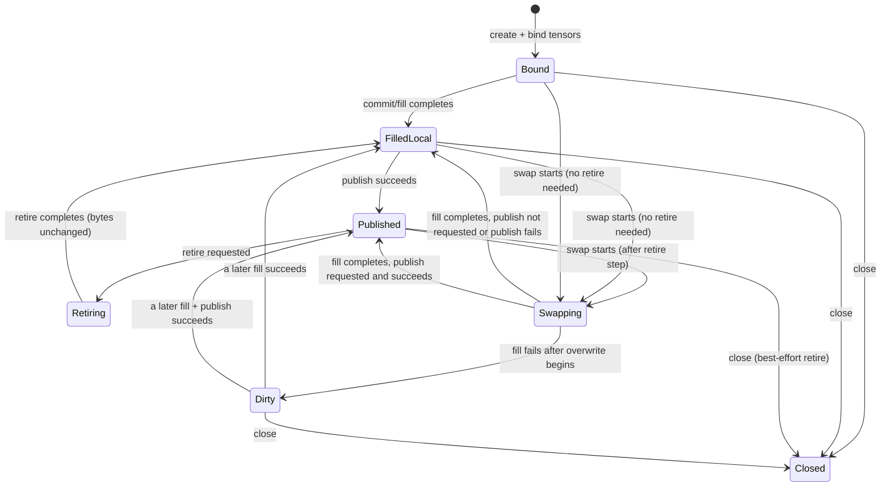
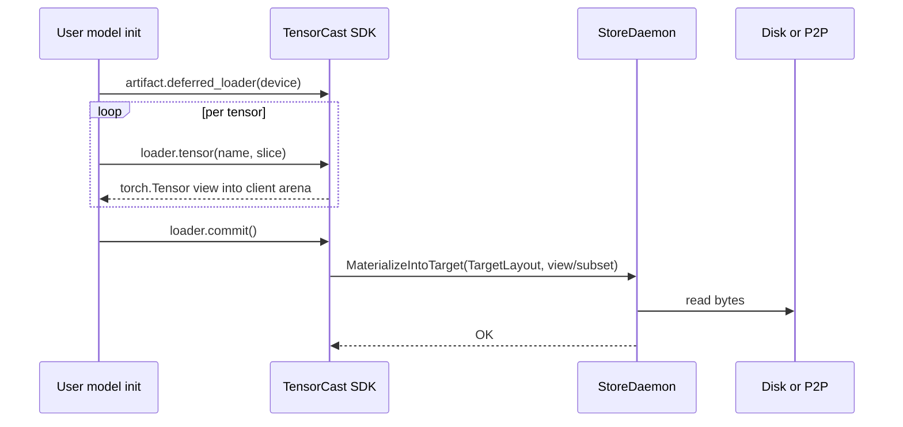
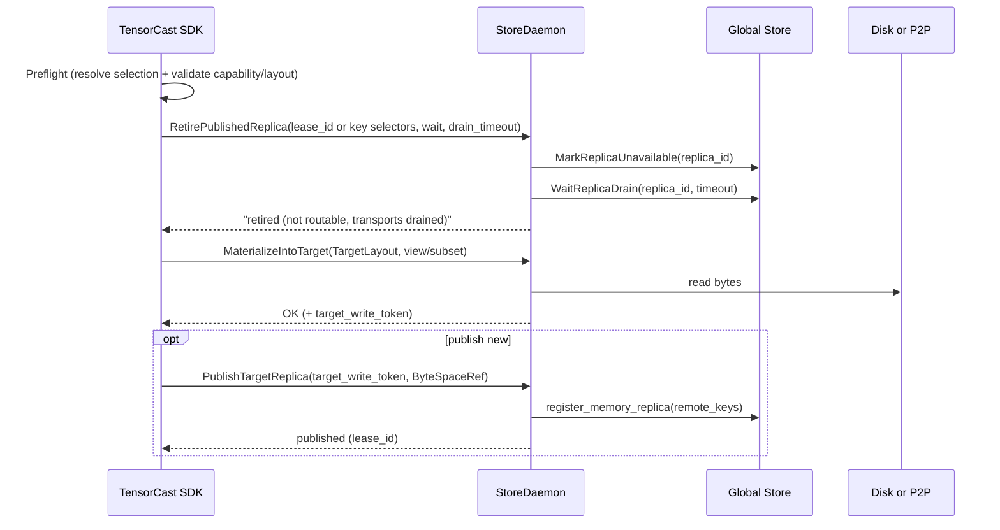

# Summary

Introduce a first-class **slot** abstraction (`InplaceSlot`) that represents a stable, client-owned CUDA **target
layout** (coalesced storages + offsets + tensor views). The slot can be filled (materialized) from different artifacts
over time while keeping PyTorch tensor storage pointers stable. This enables vLLM-style meta-init and supports **safe
inplace swap** of model weights on a single GPU allocation without rebuilding the model or reallocating weights.

This design makes inplace swap **cluster-safe**:

- The old published replica becomes immediately **non-exportable** (cannot be used for P2P) before bytes are overwritten.
- The new contents can be **published as a routable memory replica** so it becomes a first-class cluster member.

Crucially, we make identity explicit to avoid ambiguity and to align with existing selection/lease semantics:

- **Routing identity** is `ByteSpaceRef` (`CANONICAL` or `VIEW(view_id)`).
- **Operation/layout identity** is `ArtifactSelection` (`logical_layout_hash` + `selection_hash`, plus ordered
  `tensor_names`), which fully fingerprints the exact byte stream written into the slot.
- **Selection encoding** is standardized across SDK/daemon/GS: “full coverage” MUST be representable as
  `(tensor_names=[], view_subset_hash=b"")`; subset-packed uses `(tensor_names!=[], view_subset_hash!=b"")`; and packed
  reorder uses `(tensor_names!=[], view_subset_hash=b"")` (local-only). A single normalization rule for proto3
  empty-bytes makes `selection_hash` stable.
- **Publishing** is only supported when the slot’s selection corresponds to a **routable ByteSpaceRef with full
  coverage**. Packed subset layouts remain local-only until Global Store gains selection-aware routing.

North star: slot filling is orchestration over the existing **TargetLayout + MaterializeIntoTarget** primitive (region
backed). Publishing is a **daemon-owned declaration** that a known ByteSpace was written into a target layout, producing
a routable memory replica without re-hashing GPU memory.

Transport correctness is anchored in the system’s real source of truth:

- In-flight P2P transfers are coordinated by **Global Store transport sessions** (`current_requests`), not by daemon-local
  bookkeeping locks. Safe swap uses GS “mark unavailable + drain” as Phase-1 correctness, and may additionally wait on
  daemon-local gates as a best-effort hardening measure.

API ergonomics improvements included:

- Allow `tc.artifact("llama-7b-v2")` as a convenience shorthand for `tc.artifact(key="llama-7b-v2")` while keeping the
  artifact-first shape and avoiding ambiguity.
- Make swap/retire use parameter names consistent with the existing lifecycle API (`wait`, `drain_timeout_s`).
- Split "publish as a cluster replica" (`publish_replica`) from "register a new artifact id" (`register`/`put`).

# Problem Statement

We need to support the following workflow efficiently and safely:

1) Allocate one contiguous VRAM arena, bind per-parameter tensor views into a model (meta-init).
2) Fill the arena from disk/P2P only once at an explicit barrier (deferred copy).
3) Later, **inplace replace** those weights with a different artifact (e.g., `llama-7b` -> `llama-7b-v2`) without
   changing `param.data` pointers.
4) After replacement:
   - the old artifact must not be used as a P2P source (to prevent remote reads of overwritten bytes),
   - the new artifact should become routable and usable by other nodes.

This is the same "same VRAM, different identity over time" concept as region-backed `get_into` (see
`docs/architecture/api/region-backed.md` and `docs/internals/tensor_dict_into_dataflow.md`) and HA safe retire
(`0048`), but applied to **client-owned** VRAM and to repeated re-binding.

# Goals / Non-Goals

## Goals

- **Slot-first API**: represent "a stable VRAM layout bound into a model" as a first-class object.
- **Safe swap semantics**: enforce `preflight -> retire old -> overwrite -> (optional) publish new` ordering.
- **Pointer stability**: `torch.Tensor` storages returned from the slot remain stable across swaps.
- **Single dataplane primitive**: slot filling always uses `MaterializeIntoTarget` (region-backed) to write bytes into
  client memory.
- **Routable client-owned replica**: support publishing a filled slot as a Global Store memory replica with remote keys
  so other nodes can P2P materialize it.
- **ByteSpace correctness**: all publish/retire operations are ByteSpace-aware (`canonical` vs `view`).
- **Selection identity correctness**: swap/publish/retire are defined in terms of `ArtifactSelection`
  (`logical_layout_hash`, `selection_hash`, `view_subset_hash`, ordered `tensor_names`) so the written byte stream is
  fully specified and consistent across SDK/daemon/Global Store.
- **Lifecycle correctness**: publishing and retiring reuse the unified lease lifecycle model (`0011`) and safe retire
  gates (`0048`) rather than inventing a parallel liveness system.

## Non-Goals

- Modifying vLLM or requiring model code changes beyond using TensorCast APIs.
- Supporting arbitrary strided targets: slot tensors must be contiguous (consistent with region-backed into-target).
- General "hot patch" of arbitrary tensors with mismatched shapes/dtypes (swap requires identical selected layout).
- Publishing packed subset layouts as routable replicas. Global Store routing is ByteSpace-based today; selection-aware
  routing (subset routing, arbitrary packed layouts) is a follow-on.
- Coordinating local compute correctness: callers must ensure the bound tensors are not concurrently read/written while a
  swap is in progress.
- Key mapping policy and lifecycle (for example, moving a "latest" key). This remains a separate concern from publishing
  a replica and is handled by Global Store key mapping APIs.

# Core Concepts

## Slot / InplaceSlot

An `InplaceSlot` is a **stable layout contract** plus the concrete CUDA tensors that reference a client allocation.

It owns:
- Tensor views (`torch.Tensor`) carved from a client-owned VRAM allocation.
- A stable name->tensor mapping (for introspection and for passing to `tc.register(...)` when desired).
- A deterministic ordered selection (`tensor_names`) plus view semantics (`view_spec`, resolved `view_id`,
  `view_subset_hash`) captured as a `tensorcast.common.v1.ArtifactSelection`.
- A routing identity (`tensorcast.common.v1.ByteSpaceRef`) derived from selection (`CANONICAL` or `VIEW(view_id)`).
- (Optional) a `layout_spec_id` if the slot template is derived from Global Store layout v2; used for preflight
  consistency checks and future selection-aware routing.
- The current logical identity of the bytes in the slot (`artifact_id`, `selection`, `byte_space`), updated after each
  successful fill.
- The state machine that enforces safe swap and coordinates publish/retire.

## Layout Template vs Region Binding

The slot maintains a **layout template** that is independent of daemon region IDs:

- logical offsets, sizes, and tensor metadata for the selected index byte stream
- storage concatenation rules (single arena or ordered concatenation)
- the selection identity fingerprints (`logical_layout_hash`, `selection_hash`) that bind the template to a specific
  artifact/view/subset contract

For each fill, the SDK binds this template to a short-lived daemon-registered VRAM region and produces a concrete
`TargetLayout` for `MaterializeIntoTarget`.

When the template is derived from Global Store layout v2 (`PutLayoutSpec` / `GetLayoutSpec`), the SDK SHOULD record
`layout_spec_id` in the slot and include it in preflight validation. In Phase 1 this is an optional hint (not required
for correctness), but it provides a stable, cross-process anchor for debugging and for future selection-aware routing.

## ByteSpaceRef

Publishing/retiring must be expressed against a ByteSpace:

- canonical ByteSpace: `(kind=CANONICAL, id="")`
- view ByteSpace: `(kind=VIEW, id=view_id)`

This matches `tensorcast.common.v1.ByteSpaceRef` and avoids implicit "view_id empty means canonical" bugs.

## OperationId (cross-call correlation)

Slot fill/swap/publish is a multi-RPC flow that spans SDK, StoreDaemon, and (for routable replicas) Global Store. To
make this debuggable and safely retryable, requests SHOULD carry an explicit `operation_id` (UUID recommended) that is:

- generated by the SDK at the start of a logical operation (commit/swap/publish/retire),
- propagated to all involved RPCs (retire, materialize, publish, GS drain),
- logged and surfaced in error details for correlation.

`operation_id` is not part of `ArtifactSelection` identity and does not change routing; it is an observability and
idempotency tool.

# Selection Identity and Coverage

TensorCast already has a stable, cross-component selection identity message: `tensorcast.common.v1.ArtifactSelection`.
Slots adopt it as the source of truth for "what bytes did we write?".

## Selection encoding contract (normative)

This section defines a single cross-layer contract for how selection intent is encoded on the wire and inside
`ArtifactSelection`. Without this, “publishability” and `selection_hash` become ambiguous across languages.

### Proto3 normalization rule (required)

Proto3 `bytes` fields do not distinguish “unset” from “empty” in the payload. To make `selection_hash` stable across
Python/C++ and to align with existing `compute_selection_hash(..., view_subset_hash=None)` semantics:

- **Rule:** treat `view_subset_hash == b""` as “unset” and normalize it to `None` before computing `selection_hash`.
  - Python: `view_subset_hash=None` ⇒ hash includes `|all` sentinel. (`tensorcast/common/selection_identity.py`)
  - C++: `view_subset_hash=nullopt` ⇒ hash includes `|all` sentinel. (`core/common/selection_identity.cc`)

This rule is only about the meaning of empty bytes for hashing; it does **not** imply a subset hash can ever be “the
empty digest”.

### View subset hash computation (required)

`view_subset_hash` is a membership hash of the selected tensor *set* (order-independent). It exists to make subset intent
checkable and stable across retries and languages.

Normative requirements:

- `view_subset_hash` MUST be computed over the **set** of `tensor_names` (sorted unique names); it MUST NOT depend on
  the provided order.
- The empty set MUST be encoded as empty bytes (`b""`). Implementations MUST NOT compute a digest for the empty set
  (e.g., sha256 of `[]`).
- Implementations MUST reuse the repo’s existing utilities and keep Python/C++ outputs identical:
  - Python: `tensorcast/common/selection_identity.py:compute_view_subset_hash`
  - C++: `core/common/selection_identity.cc:compute_view_subset_hash_bytes`

### Ordered `tensor_names` semantics (required)

`tensor_names` is an **ordered stream** when present. It encodes the packed byte stream order written into the target
layout:

- Subset-packed selection: `tensor_names` order defines the packed subset stream order.
- Packed reorder (full set): `tensor_names` order defines a permutation of the full canonical set.

Normative requirements:

- The daemon MUST preserve `MaterializeIntoTargetRequest.tensor_names` order when computing the view plan / view index
  bytes and when populating `ArtifactSelection.tensor_names`.
- Any sorting/canonicalization is allowed only for membership validation and computing `view_subset_hash` (the
  order-independent set digest), never for planning.
- `TargetLayout.index_kind=VIEW` MUST be accepted when `tensor_names` is non-empty, even if there is no view transform
  and the selection covers the full canonical set. This is the “packed reorder” intent (local-only in Phase 1).

### Canonical encoding table

| Intent | `TargetLayout.index_kind` | `TargetLayout.view_id` | `MaterializeIntoTargetRequest.tensor_names` | `MaterializeIntoTargetRequest.view_subset_hash` | `ArtifactSelection.view_id` | `ArtifactSelection.tensor_names` | `ArtifactSelection.view_subset_hash` | Derived `ByteSpaceRef` | Publishable (Phase 1) |
|---|---|---|---|---|---|---|---|---|---|
| Canonical full coverage (no packed reorder) | `CANONICAL` | `""` | `[]` | `b""` | `""` | `[]` | `b""` | `CANONICAL` | ✅ |
| View full coverage (non-identity view) | `VIEW` | `view_id` | `[]` | `b""` | `view_id` | `[]` | `b""` | `VIEW(view_id)` | ✅ |
| Subset-only (no view transform, packed subset) | `VIEW` | `""` | `["t0", "t1", ...]` (order = packed stream) | `sha256(sorted_unique(names))` | `""` | `["t0", "t1", ...]` | `sha256(sorted_unique(names))` | `CANONICAL` (routing space; **not** selection-aware) | ❌ (local-only) |
| Packed reorder (full set but custom order) | `VIEW` | `""` | `["tX", "tY", ...]` (custom order) | `b""` | `""` | `["tX", "tY", ...]` | `b""` | `CANONICAL` (routing space; **not** selection-aware) | ❌ (local-only) |

Notes:
- “Subset-only” uses `index_kind=VIEW` but keeps `view_id=""` to avoid pretending this is a routable view ByteSpace.
- “Packed reorder” is **not** a view; it is a local packed layout. It must not be publishable in Phase 1 even though it
  has full coverage of the canonical tensor set.
- `tensor_names` order is authoritative for subset-packed and packed reorder layouts; it must survive SDK → daemon →
  `ArtifactSelection` without being sorted away.
- `view_subset_hash` is optional in `MaterializeIntoTargetRequest`; when present it must match the provided
  `tensor_names` set. For the “full coverage” intents above, it MUST be treated as unset (`b""`).

### ArtifactSelection (what was written)

`ArtifactSelection` carries enough information to make the written byte stream explicit:

- `artifact_id`: content-addressed identity (`mi2:...`) of the source bytes.
- `view_id`: view identity for non-identity views; empty (`""`) for canonical.
- `tensor_names`: ordered selection names used when packing a subset or imposing a custom order.
- `view_subset_hash`: raw digest bytes of the *set* of tensor names (order-independent; computed over sorted unique
  names). Empty means "no subset / full selection" (proto3 convention: empty bytes encodes "unset"). Implementations
  MUST NOT compute a digest for the empty set.
- `logical_layout_hash`: a stable fingerprint of the exact index bytes used for the operation (canonical index bytes or
  derived view index bytes), plus a kind tag. This captures ordering and packing when present.
- `selection_hash`: a stable fingerprint of `(view_id, view_subset_hash)` (plus a version tag), used for idempotency and
  cross-language equality checks.

These fields are already used by the programmable framework (`0055`) and retention/lease machinery; slot publish/swap
must reuse them instead of inventing new ad-hoc identities.

### Coverage and publishability

Global Store routing is **ByteSpace-based** today (`MemoryInfo.byte_space` is `CANONICAL` or `VIEW(view_id)`), and it
cannot express arbitrary packed subset layouts. Therefore:

- A slot may be **filled** with any `ArtifactSelection` supported by `MaterializeIntoTarget` (canonical/view, full or
  subset-packed).
- A slot may be **published** only when its selection is a **routable ByteSpace selection with full coverage**.

Phase-1 publish eligibility (normative):

- `byte_space.kind == CANONICAL` requires the canonical full-coverage encoding:
  - `selection.view_id == ""`
  - `selection.tensor_names` is empty
  - `selection.view_subset_hash` is empty (and MUST be normalized as “unset” for `selection_hash`)
  - `TargetLayout.index_kind == CANONICAL`
- `byte_space.kind == VIEW` requires the view full-coverage encoding:
  - `selection.view_id == byte_space.id` (non-empty)
  - `selection.tensor_names` is empty
  - `selection.view_subset_hash` is empty (and MUST be normalized as “unset” for `selection_hash`)
  - `TargetLayout.index_kind == VIEW` and `TargetLayout.view_id == selection.view_id`

If a slot is filled via subset-packed indexing (non-empty `tensor_names` / `view_subset_hash`), it remains **local-only**
and `publish_replica()` must fail fast with a clear error until selection-aware routing exists.

# User-Facing SDK API

## Primary Flow (meta-init + deferred fill)

```python
import tensorcast as tc

model = build_model_on_meta_device()
artifact = tc.from_disk("/models/llama-7b")  # or: tc.artifact("llama-7b") for key lookup

# For publishable byte-space packing, the view selection must be known up-front so offsets are stable.
# (Per-tensor slice arguments would be order-dependent and are intentionally disallowed in this mode.)
artifact_tp = artifact.view(slices=slices_tp)  # e.g., per-rank tensor-parallel shards

with artifact_tp.deferred_loader(device="cuda:0", packing="byte_space") as loader:
    # slot is a stable VRAM layout bound into the model.
    for name, param in model.named_parameters():
        param.data = loader.tensor(name)

    slot = loader.commit()

# Optional: make this GPU buffer routable as a cluster replica of the source artifact (no GPU re-hash).
# If the daemon does not support publish-target yet, this raises UNIMPLEMENTED.
slot.publish_replica()
```

## Inplace Swap (preflight -> retire old -> overwrite -> publish)

```python
slot.swap(
    "llama-7b-v2",  # Artifact | str ref; swap reuses the slot's selection (including view slices)
    publish=True,  # = publish_replica() after overwrite
    wait=True,
    drain_timeout_s=30.0,
)
```

### Behavioral contract

- `slot.tensors[...]` remain valid CUDA tensors whose storage pointers do not change across swaps.
- A successful `swap()` guarantees:
  - a preflight validates daemon capability + layout compatibility before retiring any published replica
  - old published replica (if any) is retired (not P2P exportable) before overwrite begins
  - slot bytes match the new artifact's selected ByteSpace
  - if `publish=True`, the new replica is published as routable and becomes eligible for P2P routing
- Failure semantics after overwrite begins (non-atomic, cannot roll back):
  - If **materialization fails** after bytes are overwritten, slot bytes are **undefined** and the slot enters `Dirty`.
  - If **publish fails** after materialization succeeds, slot bytes still match the new selection but the slot remains
    `FilledLocal` (local-only, not routable) until `publish_replica()` succeeds.

## API Surface (proposed)

- `tc.artifact(ref=None, *, artifact_id=None, key=None, disk_path=None, fallback=None) -> Artifact`
- `tc.artifact_async(ref=None, *, artifact_id=None, key=None, disk_path=None, fallback=None) -> Artifact`
- `Artifact.deferred_loader(device, *, packing="byte_space" | "append" | "plan", capacity_bytes=None) -> DeferredLoader`
- `DeferredLoader.plan(tensor_names, *, slices=None) -> None` (required when `packing="plan"`)
- `DeferredLoader.tensor(name, *, slice=None) -> torch.Tensor`
- `DeferredLoader.commit() -> InplaceSlot`
- `InplaceSlot.publish_replica(*, ctx=None) -> None`
- `InplaceSlot.swap(artifact, *, publish=False, wait=True, drain_timeout_s=None, ctx=None) -> None`
- `InplaceSlot.retire(*, wait=True, drain_timeout_s=None, ctx=None) -> None`
- `InplaceSlot.close() -> None`

### Packing modes (DeferredLoader)

Deferred loading can bind tensors in two qualitatively different ways:

- `packing="byte_space"`: tensors are placed at the logical offsets of the selected ByteSpace stream (canonical or
  `VIEW(view_id)`). This produces a slot whose byte stream matches `ByteSpaceRef` and is eligible for
  `publish_replica()` when coverage is full. It MUST NOT reinterpret `tensor()` call order as a packed reorder.
- `packing="append"` / `packing="plan"`: tensors are densely packed in a caller-controlled order into a local layout.
  These slots are valid for local binding and swap but are **not publishable** in Phase 1.

Ordering rule (normative):
- `packing="append"`: `tensor_names` order is the order in which the caller first requests tensors.
- `packing="plan"`: `tensor_names` order is exactly the order the caller provides to `plan(tensor_names=[...])`.
- `packing="byte_space"`: `tensor_names` MUST be empty for full coverage (no packed reorder). For subset-only selections,
  `tensor_names` order defines the packed subset stream and is therefore not publishable.

Recommended introspection surface (read-only):

- `InplaceSlot.tensors: Mapping[str, torch.Tensor]`
- `InplaceSlot.artifact_id: str` (identity of the currently loaded bytes)
- `InplaceSlot.selection: tensorcast.common.v1.ArtifactSelection`
- `InplaceSlot.byte_space: tensorcast.common.v1.ByteSpaceRef`
- `InplaceSlot.device: torch.device`

### Artifact ref parsing (SDK ergonomics)

To keep the artifact-first API consistent while reducing boilerplate, we introduce a positional `ref` form:

- `tc.artifact("llama-7b-v2")` is shorthand for `tc.artifact(key="llama-7b-v2")`.
- `tc.artifact_async("llama-7b-v2")` follows the same rules.

Parsing rules (MUST be non-ambiguous, no filesystem probing):

- If `ref` starts with `mi2:` or `cgid:`, it is treated as `artifact_id`.
- If `ref` starts with `disk:`, it is treated as `disk_path` (recommended for explicitness).
- Otherwise, `ref` is treated as a key.

Reserved prefix note: `mi2:`/`cgid:`/`disk:` are treated as reserved in the `ref` shorthand. If a user truly has a key
with one of these prefixes, they MUST use the explicit keyword form (`tc.artifact(key="mi2:...")`).

The following forms are rejected:

- `tc.artifact(ref, key=...)` or any mix of `ref` plus another identity field.
- Auto-detecting `disk_path` by checking the filesystem (too ambiguous vs keys; breaks pure/lazy handle construction).

`InplaceSlot.swap(...)` accepts `Artifact | str` and uses the same parsing rules as `tc.artifact(ref)`.

### Publish terminology (replica publish vs artifact register)

We standardize two distinct user concepts:

1) "Publish this GPU memory as a cluster replica of an existing artifact"
   - API: `InplaceSlot.publish_replica()` (and `swap(..., publish=True)`)
   - Behavior: publishes routable transport keys + registers a Global Store replica for the already-known
     `(artifact_id, byte_space)` identity.
   - Critical property: no GPU re-hash; publish is bound to a daemon-minted `target_write_token`.

2) "Register these bytes as a new artifact identity"
   - API: `tc.register(...)` / `tc.put(...)` (content-addressed ingestion)
   - Behavior: produces a new `artifact_id` (MI2) by hashing/indexing the content and (optionally) writing durable tiers.

This separation avoids the overloaded and confusing interpretation of `publish` as "make it discoverable somehow".

### Naming compliance (SDK)

- Types (PascalCase): `InplaceSlot`, `DeferredLoader`
- Methods (snake_case): `deferred_loader`, `publish_replica`, `swap`, `retire`

# Architecture & Interfaces

## State machine (slot)



## Initial fill (deferred commit)



## Safe swap (preflight -> retire -> overwrite -> publish)



Note: Phase 1 can approximate publishing by using the existing LIP registration flow, but the long-term design uses a
daemon-owned publish step to avoid re-hashing GPU memory and to ensure publish is tied to daemon-written bytes.

## Transport safety during swap (in-flight P2P)

Problem: a published replica may still be used as a P2P source while a swap wants to reuse (overwrite) the same VRAM.
Overwriting bytes while a remote transport is mid-transfer corrupts the receiver.

Design requirement: `swap()` must not start overwrite until the old published replica is guaranteed to be **unused for
transport** (and is blocked for new transports).

### Chosen mechanism (Phase 1): Global Store transport drain (source of truth)

In the current architecture, P2P transfers are assigned and tracked via Global Store transport sessions:

- GS selects a source replica on `RequestReplicaTransport` and increments `current_requests` for the selected `replica_id`.
- The receiver calls `CompleteReplicaTransport(transport_id)` which decrements the same counter.
- GS enforces `is_available` and `current_requests < max_concurrency` during source selection.

Therefore, Phase-1 correctness MUST use GS as the authoritative record of in-flight transfers for routable replicas.

Required behavior:

1) **Stop new transports**: mark the published replica `is_available=false` in GS (by `replica_id`) before attempting to
   drain.
2) **Drain in-flight transports**: wait until GS reports `current_requests==0` for that `replica_id` (bounded by deadline).
3) Only after (1) and (2) succeed may the daemon unexport communicator keys and allow overwrite.

Correctness note (required):

- `WaitReplicaDrain` MUST be observation-only: it MUST NOT “force complete” transports or decrement counters as a way to
  reach `current_requests==0`. Swap safety depends on the receiver actually finishing the transfer and calling
  `CompleteReplicaTransport`.
- Stale-transport cleanup remains a separate, periodic best-effort mechanism; retire/swap must not invoke it as a
  correctness shortcut (it would permit overwrite while a receiver may still be reading).

This matches the intent of the HA retire gates design (`0048`) but provides a synchronous, per-replica drain barrier for
swap.

### Optional hardening gates (daemon-local; best-effort)

Daemon-local gates remain useful as defense-in-depth and for non-GS flows (local-only or legacy staged exports):

- LIP staged exports (local gRPC `LockTransportChunks` path) must be drained.
- Any internal ref/use accounting (`RefTracker`, `SessionLifecycleManager`) must be clear.

However, daemon-local transport locks are currently bookkeeping-only for UMA V3 and are NOT sufficient as the primary
correctness mechanism for routable replicas.

### Retire semantics (must be safe-by-default)

`RetirePublishedReplica(..., wait=True)` (and `swap(wait=True)`) MUST:

1) Quiesce exports and stop new transports for the targeted replica key.
   - Key MUST be ByteSpace-aware: `(artifact_id, view_id, device_id)`.
2) Stop GS routing for the published replica (`replica_id`):
   - Mark `is_available=false` for that specific `replica_id`.
3) Wait until all safety gates are clear:
   - GS drain: `current_requests==0` for that `replica_id`.
   - Any daemon-local staged exports drained for the same key (best-effort, bounded).
4) Only then unregister communicator tensor keys and allow overwrite.

These gates must align with the daemon’s existing safe-retire model (`0048`): ref/use accounting (`RefTracker`,
`SessionLifecycleManager`) plus legacy staged-export visibility (`TransportLockManager`, not GS P2P). Quiesce and lock
rejection must be keyed by `(artifact_id, view_id, device_id)` so canonical and view replicas do not alias.

On drain timeout: return `DEADLINE_EXCEEDED` and DO NOT overwrite.

### Global Store API note

This design requires a small Global Store API extension so daemons can (a) mark a single replica unavailable and (b)
wait for drain by `replica_id`. See “Daemon / Proto Surfaces” below.

## Daemon / Proto Surfaces

### 0) Global Store: retire/drain surfaces (required)

Global Store already stores the required state (`artifact_replicas.is_available` and `replica_counters.current_requests`)
and uses it in transport selection. What is missing is a synchronous RPC surface to drive it for swap.

We add two RPCs (names are illustrative; exact naming can be adjusted):

- `MarkReplicaUnavailable(MarkReplicaUnavailableRequest) -> MarkReplicaUnavailableResponse`
  - Inputs: `artifact_id`, `replica_id`, optional `reason`, optional `operation_id`
  - Effect: `is_available=false` for the replica (idempotent)
- `WaitReplicaDrain(WaitReplicaDrainRequest) -> WaitReplicaDrainResponse`
  - Inputs: `replica_id`, `timeout_ms`, optional `operation_id`
  - Output: `drained` + `current_requests` snapshot (+ optional drain diagnostics to debug timeouts, e.g., the age of
    the oldest in-progress transport)

This avoids overloading `UpdateReplica` (heartbeat) and makes swap’s correctness barrier explicit.

### 1) Make retire ByteSpace-aware

Current `DeregisterArtifact` is canonical-only (cannot target view leases), and it uses a removal path that does not
clean up routable exports. We make it ByteSpace-aware and unify cleanup.

Proposed change (daemon proto):

- Extend `DeregisterArtifactRequest` to include:
  - `tensorcast.common.v1.ByteSpaceRef byte_space` (optional; default canonical)
  - (optional) `operation_id` for cross-call correlation

Daemon semantics:
- Identify the active client-owned lease by `(artifact_id, byte_space, device_id)` and quiesce/drain exports for that
  specific ByteSpace.
- Revoke using a unified path that unregisters:
  - any Global Store replica id associated with the lease
  - any communicator remote keys registered for the lease
  - any region holds associated with routable exports

Implementation note: daemon-local quiesce/lock rejection must be ByteSpace-aware. A quiesce keyed only by `artifact_id`
is insufficient because it can either (a) block unrelated ByteSpaces or (b) allow swaps to overwrite bytes while a
different ByteSpace is still exportable.

### 1.1) Retire published replicas (routable) for safe overwrite

We add a retire surface for published, routable client-owned replicas. Two acceptable shapes:

- Option A: new RPC `RetirePublishedReplica(...)` that targets `lease_id` (preferred, unambiguous).
- Option B: extend `DeregisterArtifact` to also target published replicas when `byte_space` is set and a published lease
  exists for that `(artifact_id, byte_space, device_id)` key.

Regardless of surface, the retire implementation MUST use the "transport safety during swap" semantics above.

All retire surfaces SHOULD accept and propagate `operation_id` for correlation.

### 2) Publish a filled target as a routable memory replica

We add a daemon-owned publish capability for `MaterializeIntoTarget` outputs. Two acceptable shapes:

Option A (preferred): add a new RPC
- `PublishTargetReplica(PublishTargetReplicaRequest) -> PublishTargetReplicaResponse`

Option B: extend `MaterializeIntoTargetRequest` with an optional `publish` block and return `lease_id/replica_id`.

Design preference: Option A keeps `MaterializeIntoTarget` semantics pure and makes the publish lifecycle explicit.

All publish/materialize surfaces SHOULD accept and propagate `operation_id` for correlation.

#### Integrity binding (required to avoid GPU re-hash)

If we publish without re-hashing GPU memory, we must prevent clients from "publishing arbitrary bytes" under an
arbitrary `(artifact_id, byte_space)` identity. We do this by binding publish to a daemon-minted write capability:

- Extend `MaterializeIntoTargetResponse` with an optional `target_write_token` (opaque, short-lived).
- `PublishTargetReplicaRequest` MUST include `target_write_token`.
- The daemon validates:
  - token is unexpired and owned by `(pid, device_uuid)`
  - token matches `ArtifactSelection` (`artifact_id`, `view_id`, `view_subset_hash`, `logical_layout_hash`,
    `selection_hash`) and the requested `ByteSpaceRef`
  - selection is publishable in Phase 1 (canonical/view full coverage only; reject subset-packed and packed reorder with
    `FAILED_PRECONDITION`)
  - the referenced VRAM regions are still present and not poisoned
  - token permits safe retries: `PublishTargetReplica` SHOULD be idempotent for the same `(target_write_token,
    operation_id)` and MAY allow reusing the token within its TTL to retry after GS/transient failures
  - token MUST be rejected if a newer materialization occurred for the same target regions since the token was minted
    (prevents stale-token publish mistakes / ABA)
  - (optional) token records `operation_id` / `layout_spec_id` for auditability and for better error messages

This preserves correctness while keeping the dataplane primitive single-pass, but it is not an integrity proof against a
malicious caller mutating client-owned VRAM after materialization. TensorCast assumes cooperative clients for
client-owned replicas; follow-on work may optionally add a configurable “publish-time verification” mode.

Token format (preferred): reuse the existing `CapabilityTokenEnvelope` machinery (`tensorcast.common.v1`) with a new
audience (e.g., `CAPABILITY_AUDIENCE_TARGET_WRITE_TOKEN`) and a scope message that includes the bound selection
identity. This avoids introducing a parallel ad-hoc token registry and keeps mint/verify semantics uniform.

Publish inputs (conceptual):
- `target_write_token` (minted by the daemon after a successful `MaterializeIntoTarget`)
- `byte_space` (canonical/view; validated against token)
- `target_layout` (optional when token already pins it; otherwise must be region-backed and dense)
- `pid`, `device_uuid`
- `ttl_ms` for the client-owned routable lease keepalive
- `canonical_index_bytes` (or `tensor_index_key`) for Global Store upsert when needed (GS routing stays ByteSpace-based;
  views are referenced by `view_id`)

Publish outputs:
- `lease_id` (registration-like id used for keepalive/revoke)
- `replica_id` (Global Store replica id) when GS is enabled

### Naming compliance (daemon/core)

- C++ functions (snake_case):
  - `publish_target_replica`
  - `revoke_lease_by_key`
  - `refresh_region_ttls_for_lease`
- C++ types (PascalCase):
  - `InplaceSlot` (SDK)
  - `TargetReplicaPublication` (daemon/core internal)
- Proto fields: lower_snake_case; RPC methods: PascalCase (gRPC convention)

# Invariants & Error Model

## Invariants

- Slot tensors are client-owned CUDA buffers; bytes are undefined until fill/commit completes successfully.
- Swap ordering is enforced: if a replica is published, it must be retired (quiesced and non-exportable) before any
  overwrite begins.
- Published client-owned replicas must be routable only if they can provide:
  - stable remote keys (`remote_memory_keys`) and lengths (`buffer_sizes`)
  - a ByteSpace identity (`byte_space`)
- Region-backed LIP correctness: if a published lease references region ids, lease keepalive must refresh region TTLs so
  regions do not expire while the lease is active.

## Errors (representative)

- `INVALID_ARGUMENT`: unknown tensor name, invalid slice, layout mismatch, unsupported ByteSpace kind.
- `FAILED_PRECONDITION`: daemon not ready, comm engine disabled when publish requests routable replica, GS unavailable
  (depending on publish policy), region missing/poisoned.
- `PERMISSION_DENIED`: owner PID mismatch for retire/revoke.
- `DEADLINE_EXCEEDED`: drain timeout (old replica remains quiesced and non-exportable).
- `DATA_LOSS`: materialization failure (disk/P2P verification failure).

# Trade-offs & Risks

- **Inherent non-atomicity**: once overwrite begins, bytes cannot be rolled back. `swap()` is a disruptive operation
  and may temporarily reduce cluster availability for that ByteSpace on this node.
- **Global Store dependency for cluster membership**: publishing a routable replica requires GS connectivity; failure
  should leave the slot usable locally but not routable.
- **Drain robustness**: swap correctness depends on GS `current_requests` reaching zero. Leaked or stalled transports
  can delay drain until GS cleanup runs; mitigate with bounded deadlines, stale-transport cleanup, and drain snapshot
  diagnostics.
- **Lifecycle complexity**: client-owned replicas require careful cleanup of communicator keys and region holds; unifying
  revoke paths reduces this risk.

# Compatibility & Acceptance Criteria

Compatibility:
- The slot API is additive. Existing `Artifact.tensor_dict` / `tensor_dict_into` / `DeferredLoader` semantics remain
  valid; new behavior is accessed via `InplaceSlot`.
- `tc.artifact(ref)` is additive: existing keyword-only usage remains supported; `ref` is rejected when combined with
  other identity fields to avoid ambiguity.
- `DeferredLoader.commit()` changes return shape. To reduce churn, the returned `InplaceSlot` SHOULD expose a
  `commit_result` view compatible with the current `DeferredCommitResult` fields (tensor_names, view_id, view_subset_hash,
  storage_ids, logical_size_bytes) for observability/debugging.
- ByteSpace-aware retire is backward compatible by defaulting missing `byte_space` to canonical.

Acceptance criteria:
- A vLLM-style "meta-init + per-parameter binding + one commit" workflow works with `InplaceSlot`.
- `swap()` keeps tensor pointers stable and overwrites bytes correctly.
- After swap, old replica is not used for P2P export, and the new replica can be published as a routable memory replica.
- `publish_replica()` fails fast (clear `FAILED_PRECONDITION`) when the slot was built from a non-routable packed
  selection (subset-packed or reordered layout).
- Published leases do not break due to region TTL expiry (keepalive refreshes region TTLs).
- `tc.artifact("some-key")` behaves as `tc.artifact(key="some-key")` without ambiguity, and `disk:` remains explicit.

# References

- `docs/designs/0039-artifact-first-sdk.md`
- `docs/designs/0055-programmable-framework.md`
- `docs/designs/0011-unified-session-lifecycle-leases.md`
- `docs/designs/0048-ha-replica-visibility-and-retire.md`
- `docs/internals/tensor_dict_into_dataflow.md`
- `docs/architecture/api/api-design.md`
- `docs/architecture/api/region-backed.md`
- `docs/architecture/artifact-views-and-retrieval.md`
