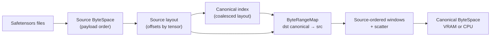

# Summary

Unify safetensors loading with the canonical ByteSpace by separating **identity/layout** (Canonical ByteSpace) from **physical disk layout** (Source ByteSpace). The daemon will:
- Build a **coalesced canonical index** for safetensors (same coalescing rules as other artifact paths).
- Preserve safetensors header-derived offsets as a **source layout** used only for disk read planning.
- Execute disk reads using a **source-ordered window schedule** (sequential I/O) while scattering into the canonical layout.

This makes safetensors compatible with `packing="byte_space"` and region-backed materialization without a data conversion step, while keeping view semantics and identities anchored on canonical bytes.

# Problem Statement / Scope

Safetensors disk loading currently derives the canonical index directly from payload offsets. That conflates:
- **Canonical ByteSpace** (identity + target layout) with
- **Source ByteSpace** (payload order on disk).

Region-backed paths and binding APIs that use `packing="byte_space"` require a coalesced canonical layout with:
- deterministic packing (identity does not depend on the on-disk payload order), and
- element-size aligned tensor starts (so tensors can be bound into a shared arena without misalignment).

Safetensors violates this today because it treats payload offsets as canonical offsets, causing the SDK to reject
`packing="byte_space"` with `INVALID_ARGUMENT` and preventing a unified in-memory representation. If we keep canonical
offsets equal to disk offsets, canonical-ordered reads also devolve into random disk I/O.

Scope:
- Disk-based safetensors loading in the daemon and SDK paths.
- Region-backed materialization and `Artifact.bind(...)` / `bind_into(...)` usage.
- View planning and subset selection for safetensors when source offsets differ from canonical.

Out of scope:
- Full data conversion to `tensor.data_*` partitions.
- Changes to the safetensors file format.
- Cross-node transport protocols or Global Store routing semantics.

# Goals / Non-Goals

Goals:
- Canonical ByteSpace is always the coalesced in-memory layout, regardless of source format.
- Safetensors loading supports region-backed materialization and `packing="byte_space"` without conversion.
- Disk I/O remains as sequential as possible while filling canonical layouts.
- Views and subset selections remain correct and deterministic.

Non-Goals:
- Backward-compatibility for pre-existing safetensors artifact identities (project is pre-launch).
- Introducing new user-facing APIs or changing the safetensors serialization format.
- GPU direct-write from disk (still host-staged for now).

# Architecture & Interfaces

## ByteSpaces and Responsibilities

We distinguish three byte coordinate spaces and keep their responsibilities non-overlapping:

- **Canonical ByteSpace** (identity + destination layout)
  - Defined by canonical index bytes.
  - Anchors `index_multihash`, `artifact_id`, view identities (`view_id`), and region-backed target validation.

- **View ByteSpace** (variant layouts)
  - Defined by view planning over canonical index bytes (`ViewPlanner`).
  - Always anchored on canonical identity (`view_id` derives from canonical index bytes + normalized ViewSpec).

- **Source ByteSpace** (physical disk layout)
  - Defined by how bytes are stored in a specific on-disk format (here: safetensors payload order).
  - Used only to plan efficient reads (sequential windows, bounded amplification).

Critically: **View planning stays purely canonical.** Physical layout information must not leak into `ViewPlanner` or `view_id` computation.

## Index and Layout Model (Safetensors)

For safetensors, we carry two related payloads:

- Canonical index (identity + canonical destination layout)
  - Coalesced offsets computed by the same rule as `put/register`.
  - Used for `index_multihash`, `artifact_id`, ByteSpace identity, and target layout validation.

- Source layout (disk layout)
  - Offset/size derived from safetensors headers and deterministic file ordering.
  - Offsets are in **Source ByteSpace** (payload-only; headers are excluded by `SafetensorsSource` / `MultiSafetensorsSource`).
  - Used only to map disk reads into the Canonical ByteSpace and to drive source-ordered read scheduling.

For non-safetensors disk formats, the source layout is absent and the source is treated as already canonical.

## Metadata Pipeline Updates

1) `index_reader` returns both canonical and source indices for safetensors.
   - The current safetensors index builder becomes a *source layout* builder.
   - A new coalesced canonical index is computed from the source layout using the same packing rules used elsewhere for ByteSpace identity (sorted tensor names + 8B alignment), without depending on source offsets.

2) `MetadataStage` stores canonical identity bytes as usual, and plumbs source layout as a disk-only hint.

3) `DiskMetadata` carries the optional source layout for disk-based load planning.

## Coalescing Authority (Determinism)

To avoid cross-language drift, the safetensors canonical-from-source coalescer is implemented in the C++ core and is
treated as authoritative for daemon disk loads. The algorithm is fully deterministic:
- Sorted tensor names (ascending).
- 8-byte alignment.
- No source-layout dependence: canonical offsets are derived from tensor identity/size, not from safetensors payload offsets.

Python callers may continue to treat canonical index bytes as an opaque, authoritative payload produced by the daemon
and/or core helpers; this design does not introduce new user-facing APIs.

## Canonical→Source ByteRangeMap

Introduce a mapping builder that pairs canonical offsets (dst) with source offsets (src):

- `build_byte_range_map_from_canonical_and_source_index_json(canonical_json, source_json, total_size)`
- Validates:
  - Tensor name sets match.
  - Per-tensor sizes match.
  - Source offsets are within source ByteSpace bounds.
- Generates data segments with `dst_offset = canonical.offset`, `src_offset = source.offset`.
- PAD segments are based on canonical gaps only.

For non-safetensors disk paths, continue to use the existing canonical-only builder.

## Source-Ordered Scheduling (Disk Performance)

The byte-range executor is currently destination-ordered (canonical order), which is correct for semantics but can
cause random disk reads when `src_offset` does not track `dst_offset` (safetensors case).

We add a **source-ordered window schedule** as an execution strategy for disk sources when a source layout is present:

- Build `SourceRun` list by sorting data segments on `(source_index, src_offset)`.
- Merge nearby segments into larger source windows using configurable thresholds.
- Read each source window sequentially, then scatter into canonical destinations.
- Use a pinned host staging buffer when the target is GPU; otherwise scatter directly into CPU memory.

This keeps canonical semantics intact while converting random disk reads into mostly sequential reads. It also reduces syscall count via merged windows.

Scheduling note:
- The *observable* byte stream remains canonical/view ordered (the schedule is an internal execution strategy).
- Hashing/verification continues to hash the canonical/view ByteSpace bytes, not "source order" bytes.

### Source-Ordered Merge Policy and Defaults

Merge policy (per source file):
- Segments are sorted by `src_offset` and merged into a window when:
  - The next segment is in the same `source_index`.
  - The gap between segments is `<= disk_source_merge_max_gap_bytes`.
  - The amplification ratio stays within `disk_source_merge_max_amplification`.
- Amplification ratio is defined as `(window_src_bytes / window_payload_bytes)`.
- Windows larger than the staging cap are split into chunks; each chunk is read sequentially and scattered.

Defaults and rationale:
- `disk_source_ordered_read = true` for disk sources with `source_index_json` present (ignored otherwise). This flips on sequential read optimization only when the source layout is known.
- `disk_source_merge_max_gap_bytes = 256 KiB` to allow small metadata or alignment gaps without inflating reads.
- `disk_source_merge_max_amplification = 4` to cap read amplification while still encouraging window fusion.
- `disk_source_prefetch_depth = 2` (double buffer) to overlap disk reads and scatter/copy.
- `staging_window_cap_bytes = min(hints.max_buffer_bytes, 64 MiB, tx_slice_bytes)` for GPU targets. This caps each sequential disk read window, while pinned staging buffers are allocated in whole pinned-pool slices (`tx_slice_bytes`) and reused; the cap limits read length, not pinned allocation size. CPU targets may set this cap to zero to indicate direct scatter without a dedicated staging window.

## Views: Keep Planning Canonical (No Source Offsets)

`ViewPlanner` and `ViewPlanSource` are defined over the canonical index and the canonical selection semantics (`docs/architecture/artifact-views-and-retrieval.md`).
We keep this contract unchanged.

Implementation rule:
- When a disk source has non-canonical physical layout (safetensors), first wrap it with a **canonicalizing mapping source** (canonical→source map), producing a `SeekableSource` that presents Canonical ByteSpace bytes.
- Apply `ViewPlanSource` on top of that canonicalized source as usual.

Optional performance refinement (follow-up within this design):
- Compose the view selection map (view→canonical) with the canonical→source map to produce a single view→source map, avoiding nested mapping and improving window fusion. Composition must support non-monotonic view order (subset packing / packed reorder), because `tensor_names` order is authoritative.

## Configuration

Add a disk-optimized execution policy to `StoreEngineOptions::ByteMappingConfig` (under the unified runtime config system in `docs/designs/0004-unified-runtime-config.md`):

- `disk_source_ordered_read` (bool, default true when `source_index_json` is present)
- `disk_source_merge_max_gap_bytes` (uint64, default 256 KiB)
- `disk_source_merge_max_amplification` (uint32, default 4)
- `disk_source_prefetch_depth` (uint32, default 2)

When enabled for safetensors disk sources, the source-ordered executor is used; otherwise the existing destination-ordered executor is preserved.

# Invariants & Error Model

Invariants:
- Canonical index always represents the coalesced canonical ByteSpace.
- Source layout is only used for disk read mapping and scheduling; it never defines identity.
- Safetensors source layouts have `storage_offset = 0` (format has no alias semantics).
- Canonical tensor starts must be element-size aligned (SDK/daemon validation must check alignment, not infer
  coalescing from `storage_offset`).
- View identities (`view_id`) are computed from canonical index bytes only.
- Source-ordered scheduling must not change byte semantics: the realized canonical/view ByteSpace bytes are identical to the destination-ordered execution.

Errors:
- `INVALID_ARGUMENT`: mismatched tensor names or sizes between canonical and source indices.
- `DATA_LOSS`: short reads or source bounds violations while executing the map.
- `FAILED_PRECONDITION`: missing canonical index bytes for view planning or target layout.

# Naming Compliance

Proposed new C++ symbols and naming compliance:
- `build_byte_range_map_from_canonical_and_source_index_json` (function, snake_case)
- `SourceWindowScheduler` (class, PascalCase)
- `compose_byte_range_maps` (function, snake_case; optional but recommended)
- `disk_source_ordered_read` (config field, snake_case)
- `disk_source_merge_max_gap_bytes` (config field, snake_case)
- `disk_source_merge_max_amplification` (config field, snake_case)
- `disk_source_prefetch_depth` (config field, snake_case)

# Schema Changes

None. No changes to `schema.sql` or persistent Global Store schema.

# Trade-offs & Risks

Trade-offs:
- Safetensors artifact identity is derived from the coalesced canonical index (hard break vs. disk-offset identity; acceptable pre-launch).
- Source-ordered reads increase memory scatter work but reduce disk seek overhead; the balance depends on storage type and file layout.

Risks:
- Incorrect source-to-canonical mapping could silently corrupt tensors; strict validation is required.
- Nested mapping (canonicalization + view) could reduce window fusion; map composition is the mitigation.
- Source-ordered scheduling adds complexity; needs careful testing with multi-file safetensors and view plans.

Alternatives:
- Full conversion to `tensor.data_*` partitions (rejected due to storage and conversion cost).
- Keep current safetensors canonical identity (rejected because it blocks unified ByteSpace and region-backed paths).

# Follow-ups (System-Wide)

- Consider making "source layout + canonical identity" a first-class pattern for *all* disk formats whose physical layout can drift (e.g., shard ordering), so identity never depends on filenames or payload order.
- Add conformance tests that compare canonical index invariants across SDK and daemon (stable encoding, alignment rules) to prevent cross-language drift.
- Expand observability for disk scheduling: read amplification ratio, merged window histogram, and prefetch effectiveness.

# Compatibility & Acceptance Criteria

Compatibility:
- Non-safetensors disk artifacts are unaffected.
- No backward-compatibility requirements (project pre-launch).

Acceptance criteria:
- `Artifact.bind(..., packing="byte_space")` succeeds for safetensors disk artifacts.
- `MaterializeIntoTarget` passes canonical coalesced layout validation for safetensors.
- Source-ordered executor reduces `tc_byte_range_base_read_calls_total` and increases effective sequential read size for safetensors.
- View materialization yields identical tensor values compared to existing safetensors loading.
- View identities (`view_id`) and view index bytes are derived from canonical index bytes only (no source-layout dependency).

# References

- `docs/designs/0009-safetensors-loader-integration.md`
- `docs/architecture/artifact-views-and-retrieval.md`
- `docs/architecture/api/materialization-flow.md`
- `docs/internals/canonical-index.md`
- `docs/internals/byte-range-mapping-and-execution.md`
- `docs/architecture/api/region-backed.md`
- `core/store/materialization/dataplane/metadata/index_reader.cc`
- `core/store/materialization/dataplane/view/view_planner.cc`
