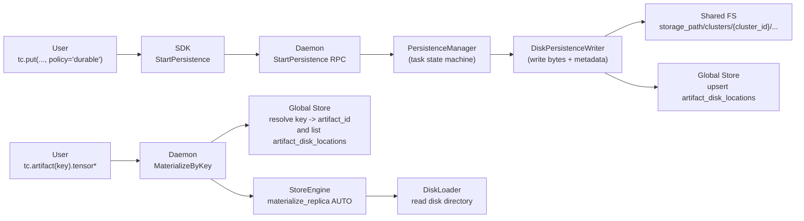
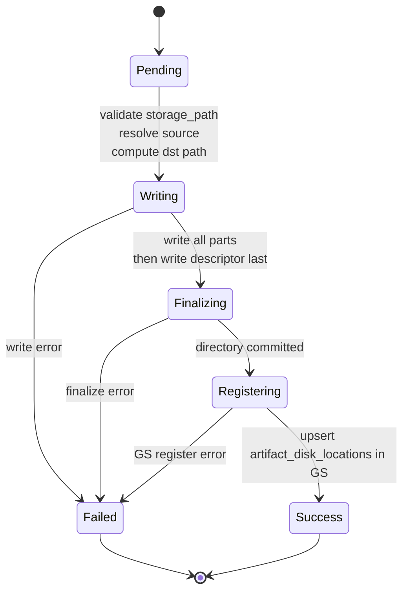

# Summary

Implement **real** asynchronous persistence for `StorePolicy(profile="durable")` and any policy with `shared_disk = MUST|SHOULD`, by writing a **managed disk directory** under a daemon-managed storage root and registering that location in Global Store via a new durable entity: `artifact_disk_locations`.

Retrieval uses disk fallback **without** user-supplied paths: callers only express whether disk is allowed/preferred; TensorCast resolves disk paths internally via `artifact_disk_locations` and only then supplies `hints.disk_path` to the engine.

This design also:
- Adds a Global Store–generated **cluster_id** namespace under `server.storage_path` to avoid cross-cluster collisions when multiple clusters share the same underlying filesystem.
- Allows **multi-part disk data files** (`tensor.data_<n>`) and aligns the parts with persistence shards (byte-range shards), so disk persistence can scale with shard planning.
- Removes `key_mappings.disk_path` entirely (one disk-location mechanism only).
- Keeps `from_disk` as an explicit **import / registration** API (it must not inject fallback disk paths into the normal materialization path).
- Adds an explicit `wait_for_shared_disk_ms` retrieval knob so callers can block until managed shared-disk is ready (without delaying key publication).
- Adds shared-disk hygiene: `deregister_artifact` purges managed shared-disk bytes by default (tombstone + delete).

This design intentionally does **not** preserve compatibility with the current explicit-disk-path surfaces (e.g., `FallbackOptions.for_disk(...)`). Those are removed.

# Problem Statement

Today:
- `daemon/state/persistence_manager.cc` treats shared-disk persistence as a **simulated state machine** (e.g., “COPY→COMPLETE on the next tick to simulate async disk writes”) and does not write artifact bytes to disk.
- Disk fallback in the “get/materialize” path is driven by **explicit disk paths**:
  - SDK `Store.from_disk(...)` / `Store.artifact(disk_path=...)` inject `FallbackOptions.for_disk(disk_path)` (`tensorcast/api/store/__init__.py`).
  - Daemon key-based materialization consumes `mapping.disk_path` from Global Store key mappings (`daemon/service/controllers/materialization_controller.cc`).
- `key_mappings.disk_path` creates a second disk-location mechanism that is hard to reason about and bypasses durability semantics.
- Treating shared disk as a Global Store "replica" is semantically wrong in the current system:
  - Worker cleanup marks all replicas for inactive workers unavailable (`tensorcast/global_store/services/worker_service.py`), which would incorrectly hide shared-disk bytes.
  - Transport selection includes `memory_type=DISK` replicas (`tensorcast/global_store/repositories/replica_repository.py`), which would accidentally route P2P decisions through DISK entries.
  - Replica registration validation requires a worker id, routable address, and node_port (`tensorcast/global_store/services/artifact_service.py`), which does not match shared-disk semantics.
- Multi-part disk directories exist but are unsafe today for large part counts:
  - Partition ordering is lexicographic in `DiskLoader` and in `compute_data_multihash_from_disk_dir`, which misorders `tensor.data_10` before `tensor.data_2` and can silently corrupt loads/hashes.

We need:
- A **real disk persistence pipeline** that produces on-disk artifacts readable by the existing disk loader.
- A **Global Store–backed discovery mechanism** so daemons can automatically locate managed disk directories, without using replica semantics.
- A **cluster namespace** inside `storage_path` for safety and observability.
- A safe way to handle “published but not yet persisted to shared disk”: an explicit wait option that does not require delaying publication.
- A single, explicit disk-location mechanism (`artifact_disk_locations`) and removal of key-mapping disk paths.

# Goals / Non-Goals

## Goals

- Real asynchronous persistence when policy includes `shared_disk` (especially `MUST`).
- Disk fallback without user-provided disk paths:
  - callers only choose whether disk is allowed/preferred
  - daemons find disk paths via Global Store
- Storage root hygiene:
  - require `server.storage_path` to enable persistence-to-disk
  - write all persisted artifacts under `server.storage_path`
  - add a cluster namespace folder under `server.storage_path`
- Shared-disk hygiene:
  - on `deregister_artifact`, purge managed shared-disk bytes by default to avoid unbounded growth
  - do not hard-delete DB rows; mark disk locations as deleted (tombstones)
- Operator-friendly naming:
  - when `key` is present, create a human-friendly path containing the key and persistence timestamp
  - avoid collisions deterministically
- Persist disk locations in Global Store (`artifact_disk_locations`) so any daemon can discover them.
- Atomicity and crash safety: readers must never see partial replicas.
- Multi-part support: allow `tensor.data_<n>` and align parts with shard planning.
- Optional wait for shared-disk readiness during retrieval, without changing publish timing.

## Non-Goals

- Compatibility shims for removed explicit-disk-path APIs.
- A full “remote stable” data-plane replication pipeline (control-plane work may remain best-effort and is separate).
- Making persistence synchronous with `put()` / `register()`; persistence remains async and observable via task state.
- Supporting Windows/macOS (Linux-only project assumption).

# Architecture & Interfaces

## Terminology

- **Storage root**: `server.storage_path` (daemon config). Assumed shared across daemons for shared-disk persistence.
- **Cluster namespace**: `<storage_path>/clusters/<cluster_id>/...` where `cluster_id` is minted by Global Store.
- **Managed disk directory**: an on-disk directory written by a daemon as part of persistence, under the cluster namespace.
- **Disk location**: a Global Store record pointing to a managed disk directory (or an imported one).
- **Shard**: a persistence byte-range unit (`artifact_placement_shards`); in this design, shard `i` maps to disk part `tensor.data_<i>`.

## High-level components



## Disk persistence trigger semantics

Policy interpretation happens in the daemon:
- `policy.profile="durable"` expands to:
  - `shared_disk_requirement = MUST`
  - `local_stable_dram_requirement = SHOULD`
  - no remote stable requirement by default
  - See `daemon/state/store_policy_resolver.cc` (`profile_defaults`).

Trigger rule:
- When `shared_disk_requirement != NONE`, persistence task **must** create shared-disk persistence targets and attempt to satisfy them asynchronously.

Hard requirement:
- If `shared_disk_requirement == MUST`, disk persistence requires `server.storage_path` to be configured and valid; otherwise the persistence task fails fast.

### Key-aware persistence (for friendly naming)

To satisfy the “use key name + persistence time prefix” requirement, the persistence pipeline needs access to the key that the caller used for `put/register`.

Today `StartPersistenceRequest` only carries `artifact_id` and `policy`. This design adds an optional `key_hint` to `StartPersistenceRequest`:
- best-effort hint used for directory naming (best-effort `by_key` symlink only)
- not required for correctness (disk location registration remains authoritative)
- ignored if empty

Note: `key_hint` must not be stored into key mappings (we delete `key_mappings.disk_path`). It is used only for an operator-friendly `by_key` symlink tree under the managed storage root.

## On-disk directory format (must match existing loader)

We persist a managed disk directory compatible with `core/store/materialization/dataplane/loaders/disk_loader.cc`:
- `tensor.data_<part_idx>` (multi-part; we standardize on `tensor.data_0` even for single-part)
- `tensor_index.json` (canonical index JSON, schema v3)
- `artifact_descriptor.json` (RFC-0007; contains `artifact_id`, `index_multihash`, `data_multihash`, `schema_version`, `encoding`, `total_size`)
- Optional: `verification.json` (recommended; used by verification pipeline when present)

No new disk format is introduced.

### Multi-part ordering (MUST be numeric, not lexicographic)

Readers MUST order parts by numeric suffix (`tensor.data_0`, `tensor.data_1`, ..., `tensor.data_10`, ...).
This requires a code fix: today `DiskLoader` and `compute_data_multihash_from_disk_dir` sort filenames lexicographically.
The same numeric ordering is also required by later metadata-first mounted
source contracts such as `0115`; public source snapshot evidence must not invent
its own lexicographic partition ordering.

Writer requirement:
- Parts must be a contiguous sequence from `0..(part_count-1)` with no gaps.
- Concatenating parts in numeric order yields the canonical byte stream (offset 0 at the start of part 0).

## Storage root layout with cluster namespace

We require `server.storage_path` to be set and treat it as a shared filesystem root.

Within that root, the daemon writes under a **cluster namespace**:

```
<storage_path>/
  clusters/
    <cluster_id>/                       # generated by Global Store; includes start time prefix
      objects/
        <artifact_id_sanitized>/        # canonical object directory (unique per artifact_id)
          tensor.data_0
          tensor.data_1                 # when sharded / multi-part
          tensor_index.json
          artifact_descriptor.json
          verification.json             # optional
      by_key/                           # optional, for operator friendliness
        <key_sanitized>/
          <persist_ts>_<short_artifact>/ -> ../../objects/<artifact_id_sanitized>/
```

### Cluster ID

The cluster ID is generated and persisted by Global Store at cluster start. Format:

- `<persist_start_time_utc>_<random>` (example: `20260203T102030Z_7f3a2c1e`)

Properties:
- unique per cluster lifecycle
- stable for the lifetime of the cluster
- human sortable by start time prefix

#### Cluster ID discovery (daemon)

Daemons must fetch `cluster_id` from Global Store at startup and cache it for:
- namespacing disk writes (`<storage_path>/clusters/<cluster_id>/...`)
- filtering/prefering managed disk locations for reads

Decision: add `cluster_id` to Global Store `GetServerInfoResponse` to avoid introducing a new RPC surface.

Note: this is distinct from `HealthCheckResponse.cluster_token` (an operator-supplied or runtime-config token). `cluster_id` is a persisted identity minted by Global Store.

### Collision avoidance

- `objects/<artifact_id_sanitized>/` is inherently collision-free for a given `artifact_id`.
- `by_key/<key>/<persist_ts>_<short_artifact>/` collisions are avoided by:
  - `persist_ts` in UTC with millisecond precision
  - `short_artifact` (e.g., first 12 chars of the artifact id digest portion)
  - if still collides, append a 6–8 hex random suffix

The `by_key` entry is a symlink to the `objects` directory to avoid duplicating large data files.

## Global Store metadata model

We make disk persistence discoverable by writing a single disk-location entity, independent of replicas:

1) Disk location record (authoritative for disk fallback)
- Upsert an `artifact_disk_locations` row for `artifact_id` with a `relative_path` pointing to the managed directory under the cluster namespace (prefer storing a *relative* path inside `<storage_path>/clusters/<cluster_id>/...`).
- The record MUST NOT be tied to worker liveness (no heartbeats, no request counters, no routable address fields).

2) Key mapping
- `key_mappings` stores only `key -> artifact_id` plus optional routing hints (replica_uuid / daemon_address) for non-disk paths.
- `key_mappings.disk_path` is removed.

### Disk location tombstones (soft-delete) and shared-disk purge

To prevent managed shared-disk bloat in "publish many versions + GC old versions" workflows (e.g., `examples/weight_publisher.py`), disk locations support a tombstone state:
- `artifact_disk_locations.is_deleted` and `artifact_disk_locations.deleted_at` mark a location as deleted.
- Normal list/selection for fallback MUST exclude deleted locations by default.
- Tombstoning is **sticky** (once deleted, it cannot be revived by a later upsert) to avoid races where a stale writer
  "re-registers" a path after GC starts.

Deletion trigger and behavior:
- `DeregisterArtifact` (daemon RPC) performs managed shared-disk cleanup directly, so no new Global Store RPC method is needed.
- By default, `DeregisterArtifact`:
  - lists managed disk locations for the artifact (including deleted, for idempotency)
  - tombstones the matching `artifact_disk_locations` rows (`is_deleted=true`)
  - deletes the corresponding on-disk directories under `<storage_path>/clusters/<cluster_id>/objects/...` (best-effort)
- Callers can opt out via `keep_shared_disk_copy=true` on `DeregisterArtifact`.

The Global Store DB rows are not physically deleted; tombstones preserve auditability and make GC idempotent.

### Disk path resolution for reads

Daemons resolve disk paths internally:
- For key-based materialization:
  - resolve `key -> artifact_id`
  - if disk is allowed, list `artifact_disk_locations` for the resolved `artifact_id` and pick a winner
- For artifact-id materialization:
  - list `artifact_disk_locations` for `artifact_id` when disk is allowed

This removes the need for user-specified disk paths.

### Disk path selection (when multiple candidates exist)

In a correctly configured cluster, managed persistence yields exactly one canonical object directory per `artifact_id` under the cluster namespace. However, multiple records can exist transiently (retries, concurrent writers, imports).

Selection rules:
- Prefer a location whose `relative_path` is under `clusters/<cluster_id>/objects/` (managed namespace).
- If multiple match, pick the lexicographically smallest `relative_path` (deterministic).
- If none match, pick any valid location path (best-effort; surfaces degraded signal).

The daemon must still normalize and enforce that the resulting path resolves under `server.storage_path`.

## SDK API surface changes (breaking)

We remove explicit disk-path fallbacks from the public SDK.

### Remove
- `FallbackOptions.disk_path`
- `FallbackOptions.for_disk(...)`
- `FallbackOptions.parse("disk:/path")` shortcuts
- Any public `disk_path=` parameters in `tc.artifact(...)` (disk path is never a retrieval ref)

### Keep (and clarify)

- `from_disk(path, ...)` remains, but becomes an **import / registration** operation:
  - It resolves an artifact id (and canonical index) from a disk directory and registers it under normal identities (artifact_id and optional key mapping).
  - It must not inject fallback disk paths into later materializations.
  - Its on-wire request still includes a disk path because it is an explicit import API (`ResolveArtifactFromDiskRequest`).

#### from_disk and disk locations

Decision: `from_disk` does **not** upsert `artifact_disk_locations` (and we do not support registering from_disk paths as disk locations for now).

Rationale:
- Avoid "disk location injection" from arbitrary user-supplied paths.
- Keep managed persistence as the only producer of shared-disk locations used for fallback.

### Keep (conceptual)

Users still express *policy intent* via fallback preference:
- allow/disallow disk
- prefer disk vs prefer p2p vs local-only

Concrete proposal:
- `FallbackOptions.prefer`: `"auto" | "local" | "p2p" | "disk"`
- `FallbackOptions.allow_p2p`: bool
- `FallbackOptions.allow_disk`: bool

Disk paths are never supplied by the user; they are discovered via Global Store.

### User experience

Typical usage becomes:
- “default”: allow P2P and disk, daemon chooses best source (`prefer="auto"`)
- “local only”: do not use P2P or disk (`prefer="local"` or explicit `allow_disk=false, allow_p2p=false`)
- “disk preferred”: allow disk and flip ordering (`prefer="disk"`)

### Explicit wait for managed shared-disk readiness (new)

We do not change publication semantics (keys/metadata can be visible before shared-disk persistence completes).
Instead, retrieval supports an explicit wait budget:

- Add `GetArtifactOptions.wait_for_shared_disk_ms` (default `0` = disabled).
- When enabled, TensorCast attempts a normal materialize first (P2P/LIP/local-as-usual). Only if that fails, it waits
  for a managed disk location and then retries from disk.
- Waiting is based on Global Store `artifact_disk_locations` (kind must be `DISK_LOCATION_KIND_MANAGED` for the local
  `cluster_id`). Because the location is only upserted after `artifact_descriptor.json` is written, waiting on the
  location implies the directory is committed.
- Once managed disk is ready, the follow-up attempt is disk-only. If disk loading fails, the request fails (no P2P
  fallback after disk becomes ready).

## Daemon RPC/API considerations

Daemon materialization RPCs should not accept user-supplied disk paths for fallback in the public interface.

Internally, the daemon may still have:
- an administrative/testing-only path that loads from a local directory
- but it must not be reachable from the general public SDK surface

`StartPersistenceRequest` is extended with:
- `string key_hint` (optional)

This avoids any need for `PersistenceManager` to “scan Global Store for keys” and keeps the naming/metadata path explicit and deterministic.

# Detailed Design

## Persistence task lifecycle (shared disk leg, multi-part)

Replace the current shared-disk simulation in `PersistenceManager::advance_shard_locked` with:

1) Ensure a persistence source exists
   - Prefer daemon-owned stable DRAM replica
   - Else fall back to an active LIP lease (optional extension; first milestone can require stable DRAM)

2) Compute destination directory path
   - `objects/<artifact_id_sanitized>/` as canonical path
   - If key is known, create `by_key/<key>/<timestamp>_<short_artifact>/` symlink

3) Write shard parts (shard-scoped)
   - Persist `tensor.data_<shard_idx>` by streaming the shard's canonical byte range.
   - Parts may be retried independently (per-shard progress and errors).
   - Shard disk targets must remain non-terminal (e.g., `COPYING`) until the artifact directory is committed.

4) Finalize directory (artifact-scoped, once)
   - Persist `tensor_index.json` (canonical) and (optional) `verification.json`.
   - Persist `artifact_descriptor.json` **last** and treat it as the commit marker.
   - Validate that all expected part files exist (0..shard_count-1) and sizes match the placement plan.
   - `fsync` files + directory as needed to bound crash windows.

5) Publish metadata to Global Store (artifact-scoped, once)
   - Upsert `artifact_disk_locations` with the managed relative path
   - Mark shared-disk persistence COMPLETE only after metadata publication succeeds and the directory is committed

### Progress reporting

Task progress for disk targets should be byte-based:
- `progress = bytes_written / shard.size_bytes` for that disk target

This replaces the current tick-based “complete next tick” behavior.

### Disk persistence state machine (artifact-scoped)



Notes:
- For `shared_disk=MUST`, any `Failed` transition fails the shard/task.
- For `shared_disk=SHOULD`, `Failed` yields a degraded shard/task (policy-dependent).

## Writing bytes: reuse existing streaming/pump infrastructure

Recommended implementation strategy:
- Use existing loader contracts and pumping infrastructure to stream bytes:
  - Source: `loader::CpuMemorySource` over UMA CPU base ptr (preferred)
  - Sink: a new `loader::FilePartitionSink` (PositionedSink) writing to `tensor.data_<shard_idx>` via `pwrite`
  - Pump: `loader::pump_ranges(...)` using the daemon’s pinned buffer pool/executor model

This allows bounded memory usage, good throughput, and consistent telemetry patterns with existing materialization.

Concurrency constraint:
- The daemon `BackgroundScheduler` runs tasks sequentially on a single thread (`daemon/state/background_scheduler.h`).
  Disk IO must not block that thread for long durations; persistence should schedule heavy IO onto an appropriate
  blocking executor and only orchestrate state transitions in the scheduler tick.

## Error model

- `shared_disk = MUST`
  - disk write failure → shard FAILED → task FAILED
  - metadata publication failure (disk location upsert) → shard FAILED → task FAILED
- `shared_disk = SHOULD`
  - disk write failure → shard DEGRADED (or FAILED but task DEGRADED) based on existing policy semantics

Errors must carry:
- `last_error` with a stable, machine-searchable token (e.g., `shared_disk_write_failed`, `storage_path_missing`, `disk_location_upsert_failed`)
- `degraded_reason` when applicable

## Security and path validation

- All disk paths must be under `server.storage_path/clusters/<cluster_id>/...`.
- Key-derived path segments must be sanitized to prevent traversal and invalid characters.
- Daemon continues to normalize disk paths under `server.storage_path` (existing path utils).

## Retrieval-time wait_for_shared_disk_ms behavior (disk readiness gate)

When `wait_for_shared_disk_ms > 0`, retrieval behaves as:

1) Attempt normal materialization (P2P/LIP/local; disk may also be used if already discoverable).
2) If the attempt fails, wait up to the requested budget for Global Store to report a managed disk location:
   - list `artifact_disk_locations(artifact_id)`
   - filter `cluster_id == local_cluster_id`
   - require `kind == DISK_LOCATION_KIND_MANAGED`
3) Once the managed location exists, resolve the on-disk path (enforcing storage_root normalization) and retry
   materialization with `prefer=disk` and `allow_p2p=false`.
4) If the disk retry fails, return the disk failure (do not fall back to P2P).

Error model:
- If managed disk does not become ready within the budget, fail with `DEADLINE_EXCEEDED`.
- If Global Store is unavailable or the daemon cannot resolve `cluster_id`, waiting is not possible and the original
  failure is returned (or `FAILED_PRECONDITION` when appropriate).

# Schema Changes

Global Store must persist:

1) Cluster info (new table):
- A durable (single-row) record for:
  - `cluster_id` (string, includes start time prefix)
  - `created_at` / `start_time_utc`

2) Disk locations (new table):
- `artifact_disk_locations` with at least:
  - `artifact_id`
  - `cluster_id`
  - `relative_path` (relative to `<storage_path>/`, or relative to `clusters/<cluster_id>/`)
  - `kind` (v1: always `MANAGED`; reserve `IMPORTED` for a future explicit admin workflow)
  - tombstone state:
    - `is_deleted` (bool, default false)
    - `deleted_at` (timestamp; set when tombstoned)
  - timestamps

3) Key mappings (schema cleanup):
- Delete `key_mappings.disk_path` entirely.

If the Global Store schema is centralized elsewhere (e.g., DuckDB schema management), the paired plan must include the required schema migration steps.

## Proposed schema (sketch)

```sql
CREATE TABLE IF NOT EXISTS cluster_info (
    singleton_id INTEGER PRIMARY KEY CHECK (singleton_id = 1),
    cluster_id TEXT NOT NULL,
    created_at TIMESTAMP WITH TIME ZONE NOT NULL DEFAULT CURRENT_TIMESTAMP
);

CREATE TABLE IF NOT EXISTS artifact_disk_locations (
    artifact_id TEXT NOT NULL,
    cluster_id TEXT NOT NULL,
    relative_path TEXT NOT NULL,
    kind TEXT CHECK (kind IN ('MANAGED','IMPORTED')) NOT NULL DEFAULT 'MANAGED',
    is_deleted BOOLEAN NOT NULL DEFAULT FALSE,
    deleted_at TIMESTAMP WITH TIME ZONE,
    created_at TIMESTAMP WITH TIME ZONE NOT NULL DEFAULT CURRENT_TIMESTAMP,
    updated_at TIMESTAMP WITH TIME ZONE NOT NULL DEFAULT CURRENT_TIMESTAMP,
    PRIMARY KEY (artifact_id, cluster_id, relative_path)
);
CREATE INDEX IF NOT EXISTS idx_artifact_disk_locations_artifact ON artifact_disk_locations(artifact_id);
CREATE INDEX IF NOT EXISTS idx_artifact_disk_locations_cluster ON artifact_disk_locations(cluster_id);
```

Key mapping cleanup (conceptual):
- remove `key_mappings.disk_path` from `schema.sql`, from key mapping protos, and from all code paths that read/write it.

# Invariants (MUST)

- Disk locations are **durable** and must not be tied to worker liveness (no worker_id, no heartbeats, no request counters).
- Disk locations must never be considered P2P transport candidates.
- `artifact_disk_locations.relative_path` must be:
  - relative (no absolute paths)
  - traversal-safe (no `..`)
  - rooted under the cluster namespace (expected prefix: `clusters/<cluster_id>/objects/<artifact_id_sanitized>/`)
- Deleted disk locations (`is_deleted=true`) MUST NOT be considered fallback candidates by default.
- Tombstones are sticky: once a disk location is marked deleted, later upserts must not un-delete it.
- Managed directories are committed only when `artifact_descriptor.json` exists; writers must write it last.
- Multi-part ordering is numeric by suffix; writers must emit contiguous part indices with no gaps.
- `wait_for_shared_disk_ms` waits only for `DISK_LOCATION_KIND_MANAGED` in the local cluster, and disk is treated as
  authoritative once it becomes ready (no P2P fallback after disk retry starts).

# Configuration

- No new environment variables are introduced.
- Persistence-to-disk requires `server.storage_path` (already part of daemon config).
- Any new config knobs introduced during implementation (e.g., future throttles, concurrency limits) must follow the unified runtime config conventions in `docs/designs/0004-unified-runtime-config.md`.

# Naming Compliance

## C++ (snake_case for functions, PascalCase for classes)

Proposed new/changed C++ identifiers:
- Class: `DiskPersistenceWriter` (PascalCase)
- Class: `FilePartitionSink` (PascalCase)
- Function: `persist_shard_to_disk(...)` (snake_case)
- Function: `finalize_disk_directory(...)` (snake_case)
- Function: `resolve_cluster_id(...)` (snake_case)
- Function: `upsert_artifact_disk_location(...)` (snake_case)
- Function: `wait_for_managed_disk_location(...)` (snake_case)

## Python (snake_case for functions)

Proposed user-facing Python changes are mostly removals. If we introduce a replacement knob:
- `FallbackOptions.allow_disk` (field name: snake_case)
- `GetArtifactOptions.wait_for_shared_disk_ms` (field name: snake_case)

# Trade-offs & Risks

- Breaking API changes: removing explicit disk-path fallbacks requires updating callers.
- Shared filesystem assumption: disk fallback only works if all daemons can access the same `server.storage_path`.
- Consistency gaps: a disk directory can exist without GS metadata (or vice versa) during failures; must be handled with idempotent reconciliation and conservative read behavior.
- Performance: initial CPU stable → disk writes may be bandwidth-heavy; use streaming/pump to bound memory and avoid stalls.
- Multi-part correctness: reader ordering must be numeric to avoid silent corruption.
- Schema rollout risk: Global Store schema changes must be applied to existing DB files (avoid "schema.sql is updated but runtime DB lacks new tables").
- Wait-induced load: `wait_for_shared_disk_ms` can amplify Global Store traffic under load; use backoff + bounded wait,
  and ensure the wait path is opt-in and observable.

# Compatibility & Acceptance Criteria

Compatibility:
- Not required. Explicit disk-path SDK surfaces are removed.

Acceptance criteria:
- When `policy` includes `shared_disk = MUST`, persistence creates a managed disk directory under `server.storage_path/clusters/<cluster_id>/...` and registers an `artifact_disk_locations` entry for it.
- Any daemon, on `tc.artifact(key).tensor*` with disk allowed, can materialize from disk without user-provided disk paths.
- `storage_path` missing produces a fast, clear failure for `shared_disk = MUST`.
- Task status and progress reflect real write progress and errors.
- When `wait_for_shared_disk_ms > 0`, a retrieval that initially fails can succeed once managed shared-disk becomes ready
  within the budget; if disk is ready but disk loading fails, the retrieval fails (no P2P fallback).
- When `tc.deregister_artifact(...)` is called (default `keep_shared_disk_copy=false`), managed shared-disk bytes are
  deleted and the corresponding `artifact_disk_locations` rows are tombstoned (soft-delete).

# Alternatives and Rationale

## Why not store disk persistence in artifact replicas?

Replica records are fundamentally "worker-owned, routable, load-balanced" resources in the current Global Store design:
- Worker cleanup and heartbeat freshness gates replica availability (`tensorcast/global_store/services/worker_service.py`).
- Transport selection is based on `artifact_replicas` and includes `DISK` as a selectable memory_type today (`tensorcast/global_store/repositories/replica_repository.py`).
- Replica validation requires worker identity and routable endpoints (`tensorcast/global_store/services/artifact_service.py`).

Shared disk persistence is durable bytes on a filesystem and must not disappear when a worker dies; it must also never be considered a P2P transport candidate. Therefore it needs a separate durable entity: `artifact_disk_locations`.

## Why remove key_mappings.disk_path?

Two disk location channels (`key_mappings.disk_path` and "disk replicas") make correctness and operations unclear:
- Key mappings are an indirection for *identity* (key -> artifact_id), not a storage-location registry.
- Disk fallback should be governed by durability state and authoritative locations, not by ad-hoc path hints.

`artifact_disk_locations` becomes the single disk location mechanism; key mappings stay minimal.

## Why keep from_disk (but not as fallback injection)?

`from_disk` is valuable for importing an existing on-disk artifact directory into TensorCast, but it must not:
- cause later, unrelated `tc.artifact(key)` operations to implicitly trust and use a user-supplied filesystem path, or
- bypass the unified disk location mechanism.

Keeping `from_disk` as an explicit import API retains utility while preserving a safe default for normal materialization flows.

# Decisions (Confirmed)

- `from_disk` default does not register disk locations; we do not support registering `from_disk` paths into `artifact_disk_locations` for now.
- Expose `cluster_id` by adding a field to Global Store `GetServerInfoResponse`.
- Commit semantics for managed directories uses `artifact_descriptor.json` as the commit marker (write it last).
- Do not delay key publication until shared-disk commit; add an explicit `wait_for_shared_disk_ms` for callers that want
  to block until managed shared-disk is ready.
- `wait_for_shared_disk_ms` waits only for `DISK_LOCATION_KIND_MANAGED`, starts only after a normal materialize attempt
  fails, and fails the request if disk loading fails after readiness (no P2P fallback).
- `DeregisterArtifact` performs managed shared-disk cleanup by default:
  - tombstone `artifact_disk_locations` rows (`is_deleted=true`)
  - delete on-disk directories under the managed namespace
  - opt out via `keep_shared_disk_copy=true`

# References

- Docs system spec: `docs/designs/0001-docs-system-design.md`
- Policy model: `docs/architecture/api/policy-persistence.md`
- Registration lifecycle: `docs/architecture/api/registration-flow.md`
- Disk loader expectations: `core/store/materialization/dataplane/loaders/disk_loader.cc`
- Disk dir hashing: `core/store/materialization/dataplane/metadata/disk_dir_hash.cc`
- Current explicit disk path injection: `tensorcast/api/store/__init__.py`
