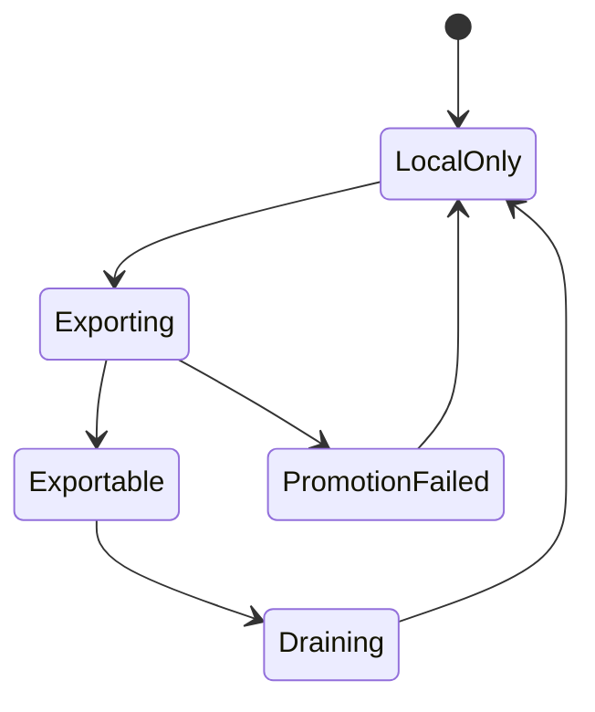
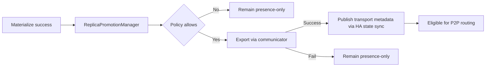
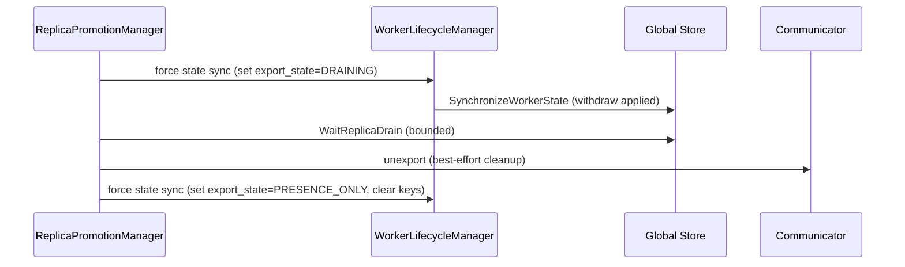

# Summary

Materialization currently publishes *presence-only* replicas: they are reusable locally and visible to HA, but they may be missing the remote-memory metadata required for P2P transport (`remote_memory_keys` + `buffer_sizes`). Global Store routing can still select these replicas today, causing P2P failures, avoidable disk fallbacks, and poor tail latency.

This design introduces **Replica Promotion and Export** as a policy-driven, best-effort capability lifecycle that:

- Defines **exportability** as an explicit, ByteSpace-scoped control-plane state (`export_state` + `export_generation`), rather than inferring it implicitly from “replica exists” or from repeated-field emptiness.
- Promotes selected local replicas into P2P sources by exporting communicator keys and publishing **authoritative transport metadata** through HA state sync (single writer).
- Demotes exports safely with a barriered protocol (**withdraw routing → drain → unexport**) that minimizes in-flight breakage and makes forced demotion observable and bounded.
- Tightens Global Store routing so it **never** selects a replica unless it is explicitly exportable and has valid transport metadata, with fast-fail behavior when no exportable sources exist.

# Context (Project-Wide)

TensorCast data-plane P2P reads use communicator-registered tensor keys (`remote_memory_keys`) and `buffer_sizes` to read remote memory regions. A replica can exist and be locally readable without being a valid P2P source. Long-term correctness requires treating “exportability” as a governed capability with explicit lifecycle, rather than inferring it implicitly from “replica exists”.

# Background: Current Behavior and Systemic Gaps

At a high level:

- **Presence publishing** (local reuse + HA visibility) happens via `RegisterReplica` during materialization completion. This path does *not* export communicator keys.
- **Transport metadata publishing** (remote keys + sizes) is produced during *registration* flows (put/register/LIP), but not for post-materialization replicas.
- **Routing selection** in Global Store is primarily driven by availability, worker heartbeat, and load counters; it must be hardened to avoid selecting replicas that cannot serve P2P reads.

The following gaps are consistency-critical and must be fixed as part of this design:

1) **ByteSpace-scoped identity is not consistently enforced end-to-end.**
   - Project-wide semantics require replicas to be ByteSpace-scoped (canonical vs view). Global Store models and docs already assume this.
   - HA state sync must therefore include `MemoryInfo.byte_space` and Global Store must include ByteSpace in its reconciliation key. Otherwise view replicas can collide with canonical replicas.

2) **Repeated-field semantics are not strong enough for safe withdrawal.**
   - In proto3, repeated fields have no presence; “empty” is ambiguous between “not reported” and “intentionally cleared”.
   - Safe demotion requires “intentional clear” semantics to be unambiguous, otherwise Global Store can retain stale keys and continue routing to revoked exports.

3) **Demotion needs an explicit barrier.**
   - “Request a state sync tick” is not a barrier. Demotion must not proceed to unexport until Global Store has applied the withdraw update (or demotion remains racy).

This design upgrades exportability into an explicit control-plane state to close these gaps in a principled, long-lived way.

# Problem Statement

Materialization currently registers replicas via `register_replica` (presence-only) without remote memory keys. Global Store transport selection can still route to these replicas, leading to:

- **Immediate P2P failures** when a selected source has no usable transport metadata.
- **Timeout-driven tail latency** when replicas exist but none are actually eligible as P2P sources (e.g., all are presence-only).
- **Demotion races** if exported keys are revoked while Global Store can still route new transports (or while existing transports are in flight).

We need a long-term, consistent way to:

- Keep presence-only semantics for local reuse.
- Promote eligible replicas into exportable, P2P-capable sources.
- Ensure Global Store routes only to P2P-capable replicas.
- Avoid exporting every read path by default (resource amplification).
- Make demotion safe and observable, with bounded waiting and predictable failure modes.

# Goals / Non-Goals

Goals
- Make materialized replicas P2P-eligible when policy and runtime conditions allow (best-effort, not required for materialization success).
- Enforce routing invariants: P2P routing must only select replicas that are **explicitly exportable** and have valid transport metadata for the requested ByteSpace.
- Provide explicit policy controls for export, with predictable failure modes and observability.
- Define a demotion protocol that withdraws routing before revoking keys, includes an explicit barrier, and drains in-flight transports with bounded waiting.
- Make “no exportable sources” a fast-fail condition (NOT_FOUND) rather than a timeout loop.

Non-Goals
- Renaming public RPCs in this iteration (naming clarity may follow).
- Introducing new user-facing data models or breaking changes to SDK APIs.
- Guaranteeing P2P availability for all replicas (promotion is best-effort).
- Redesigning Global Store scheduling beyond eligibility, safety, and observability guardrails (fairness and topology-aware routing are follow-ups).

# Consistency Model and Invariants (Authoritative)

This section defines the long-lived correctness constraints that inform the design.

## Control-Plane Replica Identity (ByteSpace-Scoped)

All control-plane operations that reason about “a replica” must disambiguate ByteSpaces.

Define a **ReplicaRoutingKey** (used by routing, HA sync diffing, and safety protocols) as:

- `artifact_id` (content-addressed identity; assembly_id for unsealed flows is still an artifact_id string)
- `byte_space` (`tensorcast.common.v1.ByteSpaceRef`):
  - `kind = CANONICAL` and `id = ""` for canonical
  - `kind = VIEW` and `id = view_id` for view replicas / pieces
- `memory_type` and `device_id` (GPU ordinal for GPU; `device_id=0` for RAM)
- `worker_id` (and/or `daemon_id` as stable identity) plus node endpoints used for routing

**Invariant:** Global Store must never merge or overwrite replicas from distinct ByteSpaces under the same routing key.

## Exportability Is Separate from Presence

- Presence answers: “does a local copy exist and should it be tracked for HA/local reuse?”
- Exportability answers: “may Global Store route new P2P transports to this replica as a source?”

Exportability must be modeled explicitly; it must not be inferred from implicit signals (e.g., “replica exists”) or ambiguous encodings (e.g., empty repeated fields).

## Single Writer for Transport Metadata

To avoid “double writers” and racey partial updates:

- Presence may still be registered through existing `RegisterReplica` / `register_replica_with_global_store` paths.
- The daemon is the **single writer** for “is this replica exportable and what keys does it serve?”. Global Store must treat `MemoryInfo.transport` presence as the explicit intent signal:
  - If `MemoryInfo.transport` is **absent**, the update is presence-only and must not overwrite stored transport metadata.
  - If `MemoryInfo.transport` is **present**, the payload is authoritative (including intentional clears), and Global Store must apply it.

## Routing Invariants

Global Store may select a replica as a P2P source **only if**:

- `export_state == EXPORT_STATE_EXPORTABLE`, and
- transport metadata is valid (keys + sizes, matching lengths, all sizes > 0, sum(sizes) == memory_size), and
- replica and worker availability predicates pass (`stats.is_available`, heartbeat freshness, accepting_new_requests, capacity).

If these predicates fail, the replica is presence-only from a routing perspective.

## Demotion Safety and Barriers

Demotion must be safe by construction:

- **Withdraw barrier:** demotion must not proceed to unexport until Global Store has applied the withdraw update that prevents new routing to this replica.
- **Drain definition:** “drained” requires both:
  - Global Store drain (`WaitReplicaDrain` based on `current_requests`), and
  - daemon-local drain (transport locks / local retire gates) when applicable.
- Waiting is bounded. If timeouts expire and memory must be reclaimed, demotion may proceed with explicit degraded behavior and observability.

# Architecture & Interfaces

## Terminology

- Presence-only replica: Registered for metadata visibility and local reuse, but not eligible as a P2P transport source.
- Exported replica: A local replica with communicator-exported remote-memory keys registered in-process (keys are currently usable by the daemon).
- Exportable replica: A replica that Global Store may route as a P2P source. Concretely, it has `export_state=EXPORT_STATE_EXPORTABLE` and valid transport metadata for the requested ByteSpace.
- Promotion: Transition from presence-only → exported/exportable.
- Demotion: Transition from exportable → presence-only, including withdrawal from routing and eventual unexport.
- Drain: Waiting for in-flight transports to complete before revoking exports.

## State Model



Key notes:
- **Exportable** is defined by *routing eligibility* (Global Store-facing metadata). It is not synonymous with “replica exists”.
- **Draining** represents “do not route new transports” while allowing existing transports to finish.



## Component Responsibilities

ReplicaPromotionManager (StoreEngine runtime)
- Observes materialization completions and relevant lifecycle events.
- Evaluates promotion policy, applying operator-configured guardrails.
- Performs export/unexport using the communicator integration (`Replica::enable_remote_memory_access` and `MemoryExportRegistry`).
- Triggers publication of updated transport metadata (best-effort immediate HA sync tick; demotion uses a barriered sync).

Memory export
- Exports communicator keys for selected replicas and caches export registrations for clean unexport.
- Must be rollback-safe and idempotent under retries.

Global Store routing
- Enforces eligibility: only exportable replicas can be selected as P2P sources.
- Makes “no exportable replicas” a first-class result (fast NOT_FOUND), not a timeout loop.

Lifecycle integration
- Demotion is triggered on eviction/unload/communication disablement.
- Demotion follows a protocol: withdraw routing → drain → unexport.
- HA state sync is the primary mechanism for publishing and withdrawing routing eligibility.

## Data Model: Explicit Transport Metadata (`export_state` + `export_generation`)

### Motivation

Safe withdrawal requires a non-ambiguous control-plane signal that can express:

- “This replica is exportable and here are its keys”
- “This replica is not exportable (presence-only)”
- “This replica is draining (withdrawn from routing, but keys may still exist locally to serve in-flight reads)”
- “This update is authoritative even if keys are empty” (presence)

Proto3 repeated fields cannot express “intentional clear” because they have no presence. Therefore we introduce a transport metadata message with presence.

### Proposed Proto Shape (conceptual)

Add a new message under `tensorcast.common.v1` and embed it in `MemoryInfo`:

```proto
message ReplicaTransportMetadata {
  enum ExportState {
    EXPORT_STATE_UNSPECIFIED = 0;
    EXPORT_STATE_PRESENCE_ONLY = 1;
    EXPORT_STATE_EXPORTABLE = 2;
    EXPORT_STATE_DRAINING = 3;
  }

  ExportState export_state = 1;
  uint64 export_generation = 2;

  repeated string remote_memory_keys = 3;
  repeated uint64 buffer_sizes = 4;

  // Optional, mirrors existing MemoryInfo.verification_json when present.
  string verification_json = 5;
}

message MemoryInfo {
  ...
  ByteSpaceRef byte_space = 16;

  // Presence is critical: when present, the payload is authoritative even if
  // keys/sizes are empty (intentional withdraw/clear).
  optional ReplicaTransportMetadata transport = 17;
}
```

Canonical routing semantics:

- If `memory_info.transport` is present, Global Store uses it as the canonical routing/source-of-truth for exportability and keys (including empty clears).
- If absent, the update is **presence-only**: Global Store must preserve stored transport metadata and must not derive exportability from `MemoryInfo.remote_memory_keys` / `buffer_sizes` (deprecated).

### Export Generation (what it buys)

`export_generation` is a monotonic counter per `ReplicaRoutingKey` that increments on each successful export. It provides:

- A stable “epoch” for debugging and metrics (promotion churn).
- A strong guardrail against stale routes: key names may embed the generation so that an outdated route fails fast (optional but recommended).
- A future hook for CAS-style updates (“apply withdraw only if generation matches”) if needed.

## Publication Channel and Authority (Single Writer)

To minimize distributed “double writers” and make HA behavior predictable:

- **Presence publishing**: materialization continues to register presence-only replicas through existing paths (`register_replica_with_global_store` → `register_replica`).
- **Presence updates must not clobber transport metadata**: Global Store must treat `RegisterReplica` with **absent** `MemoryInfo.transport` as a presence-only update and **must not** overwrite stored transport metadata (`export_state`, `export_generation`, keys/sizes, `verification_json`). Implementation detail: `ArtifactService.register_replica(... preserve_transport=True)` updates only liveness fields and preserves transport fields in the DB.
- **Authoritative transport reconciliation**: promotion/demotion updates transport metadata (`export_state`, `export_generation`, keys/sizes, `verification_json`) primarily through **HA state sync**, and Global Store treats the latest accepted sync as authoritative for routing.
  - Some flows (e.g., LIP routable view leases) may publish transport metadata via `RegisterReplica` by including `MemoryInfo.transport`. Those updates must be treated as authoritative transport updates (not presence-only), and may later be reconciled by HA sync for drift.
- **Authoritative withdrawal**: when the daemon includes `MemoryInfo.transport` (presence), Global Store must treat it as authoritative even when keys are empty, so demotion can reliably withdraw routing eligibility.

Rationale: state sync already handles drift reconciliation and is the natural place to keep Global Store in lock-step with daemon-local truth. Direct “update keys” RPCs can be added later if HA is unavailable, but are out of scope here.

## No Mixed-Version Support (Simplified)

This project does not require mixed-version worker compatibility at this stage. The design therefore treats the new transport metadata model as **mandatory**:

- Daemons publish `MemoryInfo.transport` for all replicas (presence is the authoritative signal, including clears).
- Global Store routing and reconciliation always use `export_state`/`export_generation` + `transport` validity.
- Legacy semantics based on `MemoryInfo.remote_memory_keys` / `buffer_sizes` are considered deprecated.

## Routing Eligibility (Global Store)

Global Store must treat exportability as an explicit eligibility predicate, not an implicit side-effect of “replica exists”.

### Eligibility Predicate (Canonical)

A replica is eligible as a P2P source when all are true:

- Worker is present, accepting new requests, and heartbeat is fresh.
- `is_available = true`.
- `export_state = EXPORT_STATE_EXPORTABLE`.
- `remote_memory_keys` is non-empty.
- `buffer_sizes` is non-empty.
- `len(remote_memory_keys) == len(buffer_sizes)`.
- All `buffer_sizes[i] > 0`.
- `sum(buffer_sizes) == memory_size`.

If any condition fails, the replica is **presence-only** from a routing perspective (still visible for HA/local reuse) and must not be selected for transport.

### `is_available` Semantics (Orthogonal to Exportability)

`ReplicaStats.is_available` remains the coarse “may route new transports” switch:

- `is_available=false` must always exclude a replica from routing, even if it is exported and has valid keys.
- `MarkReplicaUnavailable` continues to be the mechanism to quiesce a replica for swap-safety and retirement flows.

Exportability (`export_state`) is distinct:

- `export_state=PRESENCE_ONLY` means “do not route”, even if `is_available=true` (healthy local presence, not a P2P source).
- `export_state=DRAINING` means “withdrawn from routing”; keys may still exist locally to serve in-flight reads until drain completes.

### Fast-Fail Behavior

When **no exportable replicas exist** for an artifact (and view, if applicable), `RequestReplicaTransport` should return NOT_FOUND quickly rather than waiting until timeout. “Wait for availability” applies only when there exists at least one exportable replica that is temporarily unavailable (capacity/heartbeat).

### Observability

Global Store should expose counters/gauges for:
- Total candidates vs eligible candidates.
- Filter reasons (missing keys, size mismatch, stale heartbeat, over capacity, worker not accepting).
- Transport requests that fail due to “no exportable sources”.

## Demotion Protocol (Safety)

Demotion must avoid the unsafe ordering “unexport keys first, then stop routing”. The recommended protocol is:

1) **Withdraw routing eligibility**: publish `export_state=EXPORT_STATE_DRAINING` (or presence-only) through HA sync.
   - **Barrier requirement:** demotion must wait until Global Store confirms the update was applied (e.g., via sync response/version bump) before proceeding.
2) **Drain**: wait for in-flight transports to complete (bounded timeout).
3) **Unexport**: revoke communicator registrations locally.
4) **Clear export metadata**: publish `export_state=EXPORT_STATE_PRESENCE_ONLY` with empty keys/sizes (authoritative clear) via HA sync.
5) **Proceed with eviction/unload**: only after unexport is complete (or after bounded timeout with explicit degraded behavior).



If drain times out but memory must be reclaimed (eviction/unload), demotion may proceed and break in-flight reads. This must be logged, counted, and surfaced as a user-visible degraded condition (see Error Model).

## HA Synchronization Semantics (ByteSpace + Authoritative Clears)

To make the above protocols implementable, HA state sync must satisfy:

- **ByteSpace correctness:** `MemoryInfo.byte_space` must be populated for all replicas in `WorkerLocalState.local_replicas` so Global Store can reconcile canonical vs view replicas without collision.
- **Authoritative transport updates:** when `MemoryInfo.transport` is present, Global Store must apply it even if keys/sizes are empty (withdraw/clear).
- **Fail-safe on invalid transport metadata:** mismatched lengths or invalid size sums must result in the replica being treated as non-exportable (and should not “skip update” in a way that leaves stale exportable metadata in place).

## Implementation Notes and Refactors (Guidance)

This section is non-normative but highlights refactors that make the design easier to implement correctly.

- **Global Store (routing):** centralize the eligibility predicate so selection and diagnostics use identical rules (avoid drift between `find_available_for_transport` and `get_transport_eligibility_snapshot`).
- **Global Store (HA):** make reconciliation keys ByteSpace-aware (`view_id` / `byte_space`) and treat `MemoryInfo.transport` presence as the switch for authoritative clears.
- **Daemon (HA state sync payload):** always set `MemoryInfo.byte_space` from the local `ReplicaKey` and include transport metadata from runtime state; never “skip update” on invalid metadata—prefer fail-safe withdrawal.
- **Daemon (demotion barrier):** add an internal helper that can run a state-sync tick and wait for the applied response (or for state_version bump) so demotion does not rely on background loops.
- **Core runtime:** introduce a small runtime-owned transport state struct (export_state + export_generation + last export registration) so promotion/demotion is not encoded implicitly via `is_available` or the presence of comm registration alone.

## Policy and Configuration

Promotion policy must be wired into the unified runtime config system (`docs/designs/0004-unified-runtime-config.md`).

Proposed config surface (daemon runtime config; names illustrative, final schema lives in `tensorcast.config.v1.DaemonConfig`):
- `promotion.policy`: `never | on_materialize | on_hotness | on_policy`
- `promotion.require_verified` (gate promotion on available verification metadata)
- `promotion.demotion_drain_timeout` (bounded wait before forced unexport on eviction/unload)

Precedence (operator vs caller):
- Daemon config is authoritative and defines allowed modes.
- Per-call intent from the SDK is advisory (“request”) and must be constrained by daemon policy.

SDK surface (optional):
- Add `GetArtifactOptions.export_policy`: `auto | never | force`
  - Default: `never` (do not promote on read).
  - `auto`: allow policy-driven promotion when daemon policy permits.
  - `force`: request immediate promotion attempt (still bounded by daemon policy).
- (Optional ergonomics) A `publish=` alias on `Artifact.tensor_dict*` may be provided, but should be a thin wrapper around `GetArtifactOptions.export_policy` to avoid two sources of truth.

## Routing Invariants

- Global Store must never route to a replica without valid `remote_memory_keys`.
- Presence-only replicas remain visible for local reuse and HA state but are not transport targets.

## Error Model

- Promotion failures never fail materialization.
- Export failures are logged and exposed via metrics; replicas remain presence-only.
- Demotion withdraws routing eligibility via `export_state` before revoking keys, includes an explicit barrier, drains with a bounded timeout, and may degrade under forced eviction/unload.
- When Global Store has replicas but none are exportable, transport requests fail fast with NOT_FOUND and emit diagnostics.

## Naming Compliance

New interfaces in this design comply with repository naming rules:
- Classes or structs: `ReplicaPromotionManager`, `PromotionPolicy`, `PromotionDecision`
- Functions: `evaluate_promotion`, `promote_replica`, `export_replica`, `demote_replica`
- Constants or enums: `PROMOTION_POLICY_NEVER`, `PROMOTION_POLICY_ON_MATERIALIZE`
- SDK parameters: `export_policy` (snake_case), `publish` (snake_case, optional alias)

# Alternatives Considered

- Export on every materialize by default.
  - Rejected due to resource amplification and unnecessary export overhead on cold reads.
- Allow GS to route to presence-only replicas and rely on fallback.
  - Rejected due to inconsistent behavior and avoidable P2P failures.
- Always require disk fallback for promotion.
  - Rejected because it blocks P2P-only deployments and adds extra IO.
- Use `is_available=false` as the sole demotion mechanism.
  - Rejected because availability conflates “daemon can serve” with “replica is exportable”, and it does not encode safe drain semantics.
- Add an explicit `export_state` column/field immediately.
  - Accepted: explicit state is required for correct withdrawal semantics.

# Schema Changes

Global Store DB schema:
- Add explicit exportability columns to `artifact_replicas`:
  - `export_state` (enum/int or text) to represent `PRESENCE_ONLY | EXPORTABLE | DRAINING`.
  - `export_generation` (BIGINT) for monotonic export epochs.
  - (Optional) `exported_at` timestamp for observability.
- Migration semantics:
  - Existing rows default to `export_state=PRESENCE_ONLY` (or `NULL` treated as presence-only) until updated by an HA-capable worker.

Protocol buffers:
- Add `tensorcast.common.v1.ReplicaTransportMetadata` and `MemoryInfo.transport` (optional message with presence).

Unified runtime config schema:
- Add a `promotion` section to `tensorcast.config.v1.DaemonConfig` (Protobuf + examples/config updates).

Follow-up (optional):
- Add CAS-style guards to withdraw/demotion (`apply only if export_generation matches`) if operators require stricter sequencing under high churn.

# Trade-offs & Risks

Trade-offs
- Exporting after materialization adds latency and resource use, but makes hot replicas P2P-capable.
- Strict routing avoids failures but may reduce available sources if promotion is disabled.

Risks
- Export storms if policy is too permissive.
- Stale exports if demotion is incomplete.
- Increased schema/proto surface area to model exportability explicitly (mitigated by clear invariants).
- Forced demotion under eviction/unload can still break in-flight reads; this must be observable and bounded.

# Compatibility & Acceptance Criteria

Compatibility
- Existing `put/register` behavior unchanged.
- Materialization remains best-effort; promotion is additive and optional.
- SDK defaults do not promote on read (`export_policy=never`).
- No mixed-version support is required at this stage; all daemons/workers are expected to publish/consume `MemoryInfo.transport` for authoritative transport metadata.

Rollout (recommended)
- Phase 0: ByteSpace-scoped HA identity correctness (populate `byte_space`, include `view_id` in reconciliation keys).
- Phase 1: Introduce `transport` (presence) + `export_state`/`export_generation` model and treat `MemoryInfo.transport` presence as authoritative.
- Phase 2: Tighten routing to require `export_state=EXPORTABLE`; add fast-fail NOT_FOUND.
- Phase 3+: Enable promotion behind config (`promotion.policy=never` by default); gradually enable policies in controlled environments.

Acceptance Criteria
- A replica created by materialization becomes a P2P source when policy permits.
- Global Store never routes to a replica unless `export_state=EXPORTABLE` and transport metadata is valid.
- Promotion failure does not break materialization.
- Demotion withdraws routing eligibility with an explicit barrier before unexport, drains with a bounded timeout, and clears export metadata authoritatively.
- When replicas exist but none are exportable, transport requests fail fast with NOT_FOUND (not timeout).
- View replicas (ByteSpace VIEW) never collide with canonical replicas (ByteSpace CANONICAL) in HA sync reconciliation and routing.

# References

- docs/architecture/api/materialization-flow.md
- docs/architecture/p2p-transfer-strategies.md
- docs/architecture/high-availability-design.md
- core/store/materialization/control/materialize_orchestrator.cc
- core/store/runtime/metadata/registration_backend.cc
- core/store/replica/memory_export_registry.cc
- daemon/ha/worker_lifecycle_manager.cc
- tensorcast/global_store/repositories/replica_repository.py
