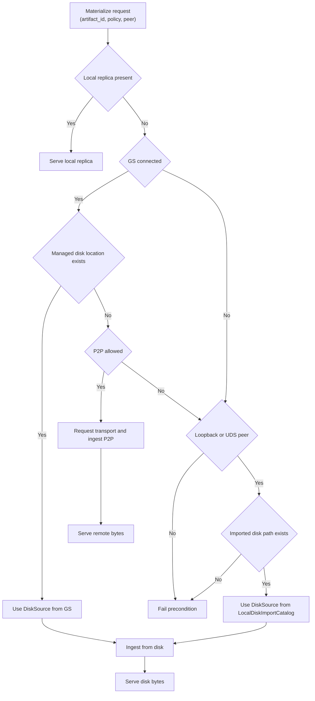

# Summary

Make `tc.from_disk(...)` usable in **standalone daemon mode** (Global Store disconnected) by treating disk directories as an **explicit, local import** step and keeping the resulting disk location **inside the daemon**, keyed by stable content identity (`mi2:`).

This removes the need for:
- `hints.disk_path` as a cross-layer side channel, and
- any explicit “disk tokens”/TTL/eviction knobs.

Instead, we introduce a simple daemon-local catalog (`LocalDiskImportCatalog`) seeded by `ResolveArtifactFromDisk`. When Global Store is unavailable, materialization can still load from disk because the daemon already knows the corresponding disk directory.

This design also fixes a deeper architecture bug: **identity vs. location conflation**. `artifact_id` is always an ID (`mi2:`), never a filesystem path. Disk paths are always treated as locations, never identities.

# Problem Statement

Current behavior:
- Retrieval RPCs intentionally do **not** accept client-provided disk paths (good security posture).
- Core materialization (`AUTO`) fails fast when Global Store is disconnected unless `hints.disk_path` is populated.
- `tc.from_disk(...)` calls `ResolveArtifactFromDisk`, but the disk directory is not retained as a materialization source for later calls.
- `ResolveArtifactFromDisk` can return `artifact_id == normalized_disk_path` when the descriptor is missing.
- Core request building can treat `hints.disk_path` as a stand-in for `canonical_artifact_id`.

Consequences:
- Standalone mode cannot reliably load from disk after `from_disk` (because later materialize calls do not carry a disk path, and should not).
- The system violates RFC-0007 invariants (mi2 identity must never be a path; path must never be an id).
- Disk IO authority becomes implicit and hard to audit (string hints) rather than a typed internal decision.

# Goals / Non-Goals

## Goals

- Standalone disk materialization works after explicit disk import:
  - `tc.from_disk(path)` followed by `artifact.tensor_dict(...)` should work without Global Store.
- Strict identity semantics:
  - `ResolveArtifactFromDiskResponse.artifact_id` is always `mi2:...`.
  - Remove all “path-like artifact id” fallbacks.
- Remove `hints.disk_path` and any identity fallback derived from paths.
- Keep usage simple:
  - no new user-facing concepts (no disk tokens, no TTL, no max-entries knobs).
- Preserve a sane security posture:
  - disk import + local disk catalog are usable only for loopback/UDS callers.
- Path semantics remain consistent with existing code:
  - when `server.storage_path` is **unset**, absolute disk paths are allowed.
  - managed shared-disk locations (Global Store) still require `server.storage_path`.

## Non-Goals

- Cross-daemon discovery of arbitrary local disk directories without Global Store.
- Persisting standalone imports across daemon restarts.
- Making key-based routing (`MaterializeByKey`) work without Global Store.
- Introducing new ad-hoc configuration flags or environment variables.

# Architecture & Interfaces

## Core invariants (normative)

1) **Identity is not a location**
- `artifact_id` MUST be a valid `mi2:` (or `cgid:` where applicable), never a filesystem path.
- Filesystem paths are locations and MUST NOT be interpreted as identities.

2) **Disk location is an internal daemon decision**
- Retrieval RPCs MUST NOT accept disk paths from clients.
- Disk materialization MAY use:
  - Global Store managed disk locations (HA/persistence), or
  - daemon-local imports created by `ResolveArtifactFromDisk` (standalone).

3) **Standalone disk IO is local-only**
- The daemon MUST NOT serve arbitrary disk bytes to non-loopback peers.
- Standalone disk import and standalone disk materialization MUST be loopback/UDS only.

## New daemon component: `LocalDiskImportCatalog`

We add a daemon-local registry that binds identities to locations:

- Key: `artifact_id` (`mi2:...`)
- Value: `DiskImportEntry`:
  - `normalized_disk_path` (string or `std::filesystem::path`)
  - optional metadata derived at import time (recommended but not required for correctness):
    - `index_multihash`, `data_multihash`
    - `generation`
    - `descriptor_present`
    - `created_at`

Properties:
- Always enabled (no feature flag).
- In-memory only (no persistence).
- No TTL/capacity eviction (pre-launch; expected import volume is low).

Rationale:
- The daemon already validates and normalizes the disk directory on import, so it is the right layer to keep the binding.
- This avoids introducing an explicit “token” concept and avoids plumbing additional capability objects through the API.

## Disk source authority chain

When handling a materialization request, the daemon chooses sources in this order:

1) **Local replica / LIP** (fast path)
2) **Managed shared disk** (Global Store + persistence; see design 0071)
3) **P2P transport** (Global Store routing)
4) **Local disk import** (standalone only; `LocalDiskImportCatalog`, loopback/UDS only)

If none applies, return `FAILED_PRECONDITION` with diagnostics describing which authorities were attempted.

## `ResolveArtifactFromDisk` becomes the single “disk import” entrypoint

`ResolveArtifactFromDisk` MUST:

1) Normalize the path using import semantics:
   - introduce `normalize_disk_import_path(disk_path, storage_path)`:
     - if `disk_path` is relative:
       - require `storage_path` to be set
       - resolve as `storage_path / disk_path`
     - if `disk_path` is absolute:
       - allow it even when `storage_path` is set (do not enforce prefix)
     - always canonicalize/normalize (`weakly_canonical` with lexical fallback)

2) Ensure canonical index bytes exist (create `tensor_index.json` when needed for safetensors).

3) Return a real identity:
   - compute `index_multihash = MULTIHASH(canonical_index_bytes)`
   - compute `data_multihash = compute_data_multihash_from_disk_dir(normalized_disk_path)`
   - set `artifact_id = "mi2:" + index_multihash + ":" + data_multihash`

4) Optionally backfill `artifact_descriptor.json` (recommended):
   - writing the computed hashes makes future loads cheaper and more deterministic.

5) Insert/update `LocalDiskImportCatalog[artifact_id] = normalized_disk_path`.

Important: `ResolveArtifactFromDisk` MUST NOT return a filesystem path as `artifact_id`.

## Core refactor: remove `hints.disk_path` (identity/location separation)

The location binding should not travel as a string hint.

Changes:
- Remove `MaterializeHints.disk_path`.
- Remove `MaterializationRequest` fallback:
  - `canonical_artifact_id` must be derived from `hints.artifact_id` or `VariantIdentity.canonical_artifact_id` only.
- Thread a typed `DiskSource` as an explicit, internal source candidate:
  - daemon supplies an optional `DiskSource` derived from either:
    - Global Store managed disk location, or
    - `LocalDiskImportCatalog` (standalone).

Implementation shape (one reasonable option):
- Add `std::optional<loading::DiskSource> disk_source` as an argument on:
  - `StoreEngine::materialize_replica(...)` and
  - `MaterializeOrchestrator::run(...)`
  so disk fallback is based on a typed source rather than `hints.disk_path`.

This keeps the user-facing API unchanged while making the internal architecture correct and auditable.

# Security Model

Hard rules (no knobs):
- `ResolveArtifactFromDisk` MUST be loopback/UDS only.
- `LocalDiskImportCatalog` MUST be consulted only for loopback/UDS peers.
- Non-loopback peers can read disk only via Global Store managed disk locations under `server.storage_path`.

# Trade-offs & Risks

Trade-offs:
- Standalone imports are daemon-local; after daemon restart, callers must re-import via `from_disk`.
- No TTL/eviction: acceptable pre-launch; memory footprint is tiny (path strings + hashes).

Risks:
- Hashing cost on import when descriptor is missing:
  - acceptable for correctness; can be amortized by backfilling `artifact_descriptor.json`.
- Security footguns if loopback gating is weak:
  - add negative tests that simulate non-loopback peers.

# Compatibility & Acceptance Criteria

Compatibility:
- Pre-launch: we intentionally allow breaking internal refactors (core hints model).
- Wire API can remain unchanged (no new proto fields required) because the disk binding is internal.

Acceptance criteria:
- `ResolveArtifactFromDisk` always returns `mi2:` and never a path.
- `tc.from_disk(path)` then `artifact.tensor_dict(...)` works with Global Store disabled.
- No code path derives `canonical_artifact_id` from a disk path.
- Standalone disk IO is denied for non-loopback peers.

# Alternatives Considered

1) **Explicit disk capability tokens** (rejected)
- Adds conceptual and configuration complexity (enable flags, TTLs, eviction).
- Duplicates what the daemon already can do: remember that it validated a disk dir.

2) **Allow clients to send `disk_path` on retrieval RPCs** (rejected)
- Violates the security posture and reintroduces “remote read arbitrary file path” risks.

3) **Eager ingest on `from_disk` (load bytes immediately)** (possible future)
- Would make `from_disk` behave more like “construct from memory” but can be surprising and expensive.
- The catalog approach keeps lazy materialization while still making standalone work.

# Naming Compliance

New C++ API and types proposed by this design:

- `LocalDiskImportCatalog` (class, `PascalCase`)
  - `upsert_import(...)` (method, `snake_case`)
  - `lookup_import(...)` (method, `snake_case`)
- `DiskImportEntry` (struct, `PascalCase`)
- `normalize_disk_import_path(...)` (function, `snake_case`)

# References

- RFC: `docs/designs/0007-content-addressed-artifact-id.md`
- Managed shared disk (Global Store): `docs/designs/0071-managed-shared-disk-persistence.md`
- Current import RPC: `proto/tensorcast/daemon/v2/store_daemon.proto` (`ResolveArtifactFromDisk`)
