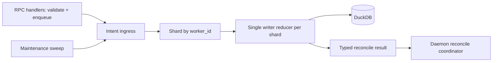
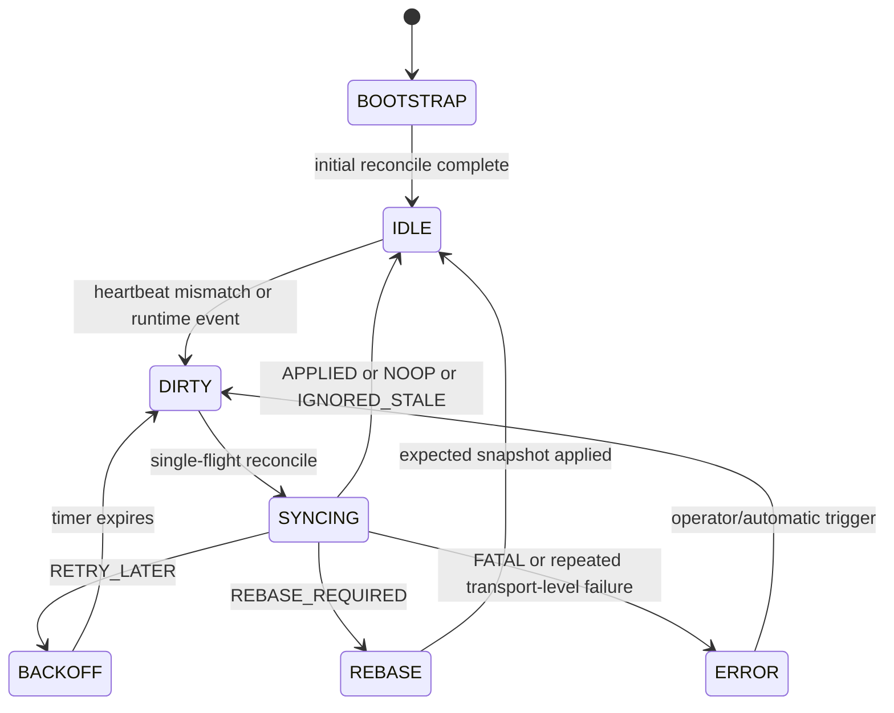

# Summary

Replace worker control-plane multi-writer persistence with a per-`worker_id` single-writer reducer, and replace the legacy dual-RPC worker-state failure path with one typed reconcile RPC.

This revision makes four explicit product decisions:

- `generation` is maintained per `daemon_id`; each successful worker registration creates a new daemon incarnation and increments generation.
- Reducer queue durability is not required; process restart relies on daemon heartbeat/reconcile self-healing.
- Breaking changes are allowed; daemon and global store are upgraded together.
- Per-worker replica cardinality is expected to be at most O(100), so inline expected snapshot payloads are acceptable for V2.

# Problem Statement

Current behavior has systemic write amplification and conflict loops:

1. Multiple code paths update the same worker state concurrently (`heartbeat`, worker-state reconcile path, maintenance, registration lifecycle).
2. Daemon reconcile failure can fall back to immediate same-cycle retry paths, creating a second conflicting write against the same worker state.
3. Heartbeat persistence is fixed-window buffered and detached from explicit control-plane ownership.
4. Test/runtime rebuild paths can instantiate additional heartbeat background writers without explicit shutdown, making hidden concurrent writers possible.

Observed effect: recurring DuckDB `write-write conflict on key: "<worker_id>"` and self-amplifying retry loops.

# Goals / Non-Goals

## Goals

- Eliminate same-worker write conflicts by topology (single writer), not by retries.
- Define a single authoritative reconcile protocol with typed outcomes.
- Preserve startup and re-registration bootstrap correctness after removing the legacy dual-RPC worker-state path.
- Make worker incarnation semantics explicit (`daemon_id` + `generation` + `request_seq`).
- Keep liveness semantics correct under heartbeat coalescing.
- Make replica registration metadata and replica row writes atomic.

## Non-Goals

- Multi-node consensus for Global Store.
- Backward wire/schema compatibility.
- Durable reducer intent WAL in V2.
- Delta-inventory protocol in V2 (full snapshot inventory remains the baseline).

# Authority Model (Normative)

Reconcile correctness is based on one explicit ownership split:

- Daemon is authoritative for **observed local publishable presence** (its current resident/publishable inventory).
- Global Store is authoritative for **desired registry state** (policy, retirement visibility, and persisted control-plane truth).
- `ReconcileWorkerState` computes `observed -> desired` and returns typed convergence actions.

This avoids ambiguous "dual authority" behavior and defines the meaning of `REBASE_REQUIRED`.

# Architecture & Interfaces

## High-level architecture

All worker control-plane writes are reducer-owned.

## Single-Writer Boundary (Required)

The following operations MUST enter reducer intent path; no direct worker-table writes are allowed outside reducer:

- `RegisterWorker`
- `UnregisterWorker`
- `WorkerHeartbeat`
- `ReconcileWorkerState`
- maintenance worker timeout/inactivation
- recovery stale-marking/cleanup touching worker control-plane rows

gRPC handlers perform validation and enqueue only.

## Data Model (V2)

V2 keeps `workers` as identity table and splits hot mutable state out.

- `workers` (identity + routing, low-frequency)
  - `worker_id`, `daemon_id`, `node_id`, `node_address`, `grpc_port`, `p2p_port`, `mem_pool_total_size`, `registered_at`, `inactive_at`
- `worker_liveness` (high-frequency)
  - `worker_id`, `last_heartbeat`, `mem_pool_available_size`, `accepting_new_requests`, `capability_flags`, `updated_at`
- `worker_reconcile_state` (cursor + reconciliation)
  - `worker_id`, `generation`, `request_seq`, `state_version`, `state_checksum`, `last_reconcile_result`, `updated_at`

Rationale: this removes hot-field coupling while minimizing join blast radius compared with introducing an additional `workers_identity` table name.

## Incarnation and Stale-Request Semantics (Required)

`generation` is scoped to `daemon_id` incarnations.

- On every successful `RegisterWorker` for a daemon, generation increments by 1.
- Daemon resets local `request_seq` to 0 for the new generation.
- Each reconcile request carries (`worker_id`, `daemon_id`, `generation`, `request_seq`).

Reducer acceptance rule for reconcile request:

- if `generation < persisted_generation`: `IGNORED_STALE`
- if `generation == persisted_generation` and `request_seq <= persisted_request_seq`: `IGNORED_STALE`
- if `generation == persisted_generation` and `request_seq == persisted_request_seq + 1`: accept
- if `generation > persisted_generation`: `REBASE_REQUIRED` (registration/reconcile ordering issue or stale daemon view)

This replaces legacy cursor-token semantics with explicit daemon incarnation semantics.

## Protocol redesign

Replace the legacy two-RPC worker-state flow with one RPC:

- `ReconcileWorkerStateRequest`
  - `worker_id`
  - `daemon_id`
  - `generation`
  - `request_seq`
  - `inventory` (full snapshot of publishable/resident replicas)
  - `request_kind` (`SNAPSHOT` in V2; `DELTA` reserved)
- `ReconcileWorkerStateResponse`
  - `result_kind`
    - `APPLIED`
    - `NOOP`
    - `IGNORED_STALE`
    - `RETRY_LATER`
    - `REBASE_REQUIRED`
    - `FATAL`
  - `retry_after_ms` (required for `RETRY_LATER`)
  - `new_state_version`, `new_state_checksum`
  - `state_changes`
  - optional `expected_replicas` (for `REBASE_REQUIRED`)

gRPC status usage:

- Transport/system failure: non-OK gRPC status.
- Business reconciliation outcome: OK gRPC status + `result_kind`.

No dual channel (`status` + `result_kind`) is used in V2 business path.

## Daemon reconcile coordinator state machine

Rules:

- Exactly one in-flight reconcile per worker.
- Heartbeat can only mark dirty; heartbeat never launches concurrent reconcile RPC.
- No same-cycle dual-path fallback exists in V2.
- Startup/re-registration bootstrap is explicit: daemon enters `BOOTSTRAP` and completes one reconcile cycle before steady-state.

## Liveness semantics under coalescing (Required)

Heartbeat coalescing is per worker and last-value-wins for mutable liveness fields, with one exception:

- `last_heartbeat` uses **ingress observed timestamp** and reducer writes monotonic `max(existing, observed_ts)`.

This prevents false timeout due to queue delay or out-of-order batch flush.

## Queue durability and restart behavior

Reducer queue is in-memory only in V2.

- On Global Store restart, queued intents are dropped.
- System converges via daemon re-heartbeat + reconcile bootstrap (already required in HA lifecycle).

This is accepted for V2 to keep implementation bounded.

## Replica registration transaction fix

`RegisterReplica` persistence MUST commit atomically in one transaction:

- artifact upsert
- artifact index upsert (when provided)
- replica upsert (+ counters)

Partial warning-only success is forbidden in V2.

# Schema Changes

`schema.sql` V2 changes:

- Keep `workers` table as identity/routing table.
- Remove hot/reconcile fields from `workers`:
  - `mem_pool_available_size`
  - `accepting_new_requests`
  - `capability_flags`
  - `last_heartbeat`
  - `state_version`
  - `state_checksum`
  - legacy reconcile-cursor columns
- Add `worker_liveness` table.
- Add `worker_reconcile_state` table.
- Add indexes:
  - `worker_liveness(last_heartbeat)`
  - `worker_reconcile_state(worker_id, generation, request_seq)`
  - `workers(daemon_id)` remains unique.

Migration policy for V2:

- Breaking cutover is allowed.
- Startup migration is deterministic and idempotent for existing DB files:
  - backfill `worker_liveness` and `worker_reconcile_state` from existing `workers` data when present,
  - then remove legacy columns/writes.
- If migration cannot complete, service fails fast at startup.

# Alternatives and Rationale

- Keep current model and add retries:
  - rejected; preserves multi-writer topology.
- Keep dual RPC and only disable immediate fallback:
  - rejected; still leaves ambiguous bootstrap and duplicated sync surfaces.
- Add durable reducer WAL now:
  - deferred; restart self-heal is sufficient for V2 scope.

# Trade-offs & Risks

- Introduces reducer runtime and intent queue complexity.
- Requires synchronized daemon + global store deployment.
- In-memory queue loses pending intents on process crash.

Mitigations:

- bounded shard queues + overload -> `RETRY_LATER`
- strict single-writer boundary enforcement in code review/tests
- explicit bootstrap state in daemon
- queue depth/latency/result metrics and alerting

# Compatibility & Acceptance Criteria

Compatibility:

- Breaking changes allowed.
- Legacy sync RPCs are removed in V2.

Acceptance criteria:

- no recurring worker-state write-write conflict loops in TP=1 and TP=4 stress tests.
- daemon never emits same-cycle dual-path paired failures.
- all worker control-plane writes route through reducer (including register/unregister/maintenance/recovery).
- stale protection correctness: generation/request-seq rules pass deterministic tests.
- heartbeat/liveness timeout behavior remains correct under coalescing and queue delay.
- replica metadata/index/replica writes are atomic and fail together.

# References

- `tensorcast/global_store/services/worker_service.py`
- `tensorcast/global_store/services/recovery_service.py`
- `tensorcast/global_store/repositories/worker_repository.py`
- `tensorcast/global_store/maintenance_coordinator.py`
- `daemon/ha/worker_lifecycle_manager.cc`
- `core/store/components/global_store_client.cc`
- `proto/tensorcast/global_store/v1/global_store.proto`
- `docs/architecture/high-availability-design.md`
