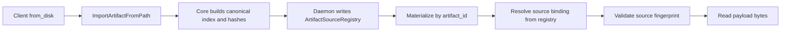

# Summary

Adopt one disk import model only: **Reference-Only Import** with **single source authority**.

`from_disk` becomes a daemon-owned registration flow that never mutates source directories and never performs payload copy/link/reflink. Import writes only daemon-owned metadata and source fingerprints into one registry. Materialization resolves disk bytes only through this registry plus managed shared-disk locations.

This design intentionally removes resolve-style path-return contracts, sidecar/backfill branching, and compatibility wrappers. Pre-launch, we optimize for long-term uniformity and hard deletion of redundant behaviors.

# Problem Statement

Current behavior still carries multiple disk semantics and owners:

- Resolve RPC + stream contracts still expose path-return semantics.
- Sidecar/backfill/source-write branches coexist with reference semantics.
- Stream error model is message-based but not machine-readable.
- Core/daemon responsibilities around canonical index and source mutation are not explicitly unified.
- Runtime root selection for import metadata is described separately from daemon runtime-state topology.

This causes cross-module drift, duplicate code paths, and operational ambiguity that will grow with future features.

# Goals / Non-Goals

## Goals

- One import mode only across daemon/core/sdk.
- One source authority model only across local import and managed shared-disk.
- Core is the only canonical-index/hash authority.
- Source directories are strictly read-only for import/materialization flows.
- Machine-readable, fixed import error taxonomy with deterministic gRPC mapping.
- No client-provided disk path in retrieval/materialization RPCs.
- Single stream progress contract for progress bars.
- Breaking change accepted pre-launch; no compatibility retention.

## Non-Goals

- Snapshot durability independent of source lifecycle for local imports.
- Cross-node discovery for daemon-local imports.
- Compatibility wrappers for resolve/path-return legacy contracts.
- Runtime mode flags that re-enable removed behaviors.

# Architecture & Interfaces

## Normative Invariants

1. `artifact_id` is identity only (`mi2:` for this flow), never a filesystem path.
2. Import is registration only, never source mutation, never payload copy/link/reflink.
3. Source authority is daemon-internal only; retrieval/materialization accepts `artifact_id`, not `disk_path`.
4. Core owns canonicalization and hashing logic; daemon orchestrates and persists decisions.
5. There is exactly one import metadata authority inside daemon runtime state.

## Unified Source Authority: `ArtifactSourceRegistry`

Introduce one daemon-owned registry abstraction:

- `ArtifactSourceRegistry` (single owner in daemon runtime)
  - `ManagedSharedDiskBinding` (Global Store-discovered)
  - `LocalImportBinding` (daemon-local reference import)
- Unified lookup key: `artifact_id`
- Unified value shape:
  - source kind (`MANAGED_SHARED_DISK` | `LOCAL_IMPORT`)
  - canonical source root/path
  - source file fingerprint map (`inode,size,mtime_ns`)
  - canonical index bytes
  - generation
  - lifecycle timestamps

Implementation detail: existing `LocalDiskImportCatalog` can be refactored into this registry in-place, but must not remain as a second semantic owner after cutover.

## RPC And API Contract

Replace resolve-style path APIs with import APIs:

- `ImportArtifactFromPath` (unary)
- `ImportArtifactFromPathStream` (server stream)

Response payload:

- `artifact_id`
- `generation`
- `canonical_index_bytes`
- `import_state` (`READY` on success)

Forbidden in import response:

- `disk_path`
- sidecar/debug path fallback fields

SDK:

- `Store.from_disk(path)` remains entrypoint.
- SDK must consume only import contracts and cache by `artifact_id`.
- SDK/daemon client methods for `ResolveArtifactFromDisk*` are removed, not wrapped.

## Stream Progress Contract

`ImportArtifactFromPathStream` is canonical for progress bars.

Event fields:

- `seq`
- `phase`
- `processed_bytes`
- `total_bytes`
- `percent`
- `done`
- `error`
- `error_code` (machine-readable enum, required when `error=true`)
- optional `message`
- optional `result` (success terminal only)

Terminal rules:

- exactly one terminal event per stream (`done=true`)
- success terminal includes `result`
- error terminal includes stable `error_code`

Fixed global phases:

1. `PREPARE`
2. `SCAN_SOURCE`
3. `READ_HEADERS`
4. `BUILD_CANONICAL_INDEX`
5. `HASH_DATA`
6. `WRITE_REGISTRY`
7. `DONE`
8. `ERROR`

## Core Authority And Source Mutation Policy

Core remains canonical authority for:

- safetensors source-index parsing
- canonical index rebuilding/coalescing
- index/data multihash
- descriptor/index validation

Daemon must reuse core APIs directly (no duplicate builder implementation).

Introduce explicit mutation policy for disk-origin loads:

- `source_mutation_policy=READ_ONLY` for import/materialization reference paths.

`READ_ONLY` requires:

- no writes of `artifact_descriptor.json`
- no writes of `tensor_index.*`
- no writes of `verification*.json`
- no sidecar mirroring/symlinking/write fallback

Any source-write failure modes are removed because writes are not attempted.

## Source Input Rules

- Input path must resolve to local directory.
- Directory must contain at least one `*.safetensors` or `tensor.data*` layout.
- Import RPC is loopback/UDS only.
- Non-loopback import gets `PERMISSION_DENIED`.

## Import Metadata Root (Unified With Runtime Topology)

Import metadata storage must live under daemon runtime root, not a parallel temp-root universe.

Effective root:

- `$TENSORCAST_HOME/hosts/<host_id>/runtime/daemons/<daemon_id>/import`

Startup checks:

- create dir (`0700`)
- create/write/fsync/rename/remove probe
- metadata DB bootstrap check

If unavailable, startup fails fast: `IMPORT_ROOT_UNAVAILABLE`.

No ad-hoc env/flag mode switches are introduced.

## Materialization Read Path

- Materialization disk resolution goes through `ArtifactSourceRegistry` only.
- For each referenced file, validate fingerprint before open/read.
- On fingerprint mismatch or missing file: fail `FAILED_PRECONDITION` with `SOURCE_MUTATED`.
- No self-heal copy/link/backfill path exists.
- Disk source selection is typed and internal; no string path hints crossing layers.

## Error Model (Fixed And Machine-Readable)

- `SOURCE_NOT_FOUND` -> `NOT_FOUND`
- `SOURCE_PERMISSION_DENIED` -> `PERMISSION_DENIED`
- `SOURCE_FORMAT_INVALID` -> `INVALID_ARGUMENT`
- `SOURCE_MUTATED` -> `FAILED_PRECONDITION`
- `IMPORT_ROOT_UNAVAILABLE` -> daemon startup failure
- `REGISTRY_IO_FAILURE` -> `UNAVAILABLE`
- `POLICY_DENIED_NON_LOCAL_PEER` -> `PERMISSION_DENIED`

No fallback mode can change these outcomes.

## Security Model

- Import RPC and import stream RPC are local-only (loopback/UDS).
- Materialization does not accept client disk paths.
- Source path canonicalization + root policy checks are centralized.
- Registry bindings are daemon-local authority and not externally writable.

## Hard Decommission (No Compatibility Retention)

The following are deleted in the same coordinated change set:

- RPC interfaces:
  - `ResolveArtifactFromDisk`
  - `ResolveArtifactFromDiskStream`
- Legacy stream enums/events:
  - `ResolveDiskPhase`
  - `ResolveArtifactFromDiskStreamEvent`
- SDK and daemon client methods for resolve-style APIs.
- Sidecar mirror and fallback helpers.
- Source backfill branches for descriptor/index writes.
- Compatibility env knobs used only by resolve legacy behavior.
- Any remaining code path that treats `disk_path` as retrieval identity.

No adapter layer and no dual runtime semantics are kept.

## Naming Compliance

Proposed interfaces follow repository naming rules:

- Classes/structs (`PascalCase`)
  - `ArtifactSourceRegistry`
  - `ArtifactSourceBinding`
  - `ImportedArtifactEntry`
- Functions/methods (`snake_case`)
  - `import_artifact_from_path`
  - `resolve_artifact_source_binding`
  - `validate_source_fingerprint`
- Constants (`ALL_CAPS`)
  - `IMPORT_ROOT_PROBE_FILENAME`
  - `IMPORT_REGISTRY_SCHEMA_VERSION`

# Schema Changes

- No change to repository root `schema.sql` (Global Store schema unchanged).
- Introduce daemon-local SQLite schema under daemon runtime root for `ArtifactSourceRegistry`.
- This local schema is daemon runtime state, not Global Store canonical schema.

# Trade-offs & Risks

- Pros:
  - single source authority and deterministic behavior
  - no split ownership across local-import vs managed-disk semantics
  - no source-write edge-case matrix
- Cons:
  - local import durability still depends on source continuity
  - stricter behavior removes permissive fallback ergonomics
- Risk:
  - source-file churn increases `FAILED_PRECONDITION`; mitigated via explicit `SOURCE_MUTATED` code and pre-read fingerprint checks.
  - hard deletion scope is large; mitigated by one coordinated merge and full test/doc gates.

# Compatibility & Acceptance Criteria

Compatibility policy:

- Breaking change accepted (pre-launch).
- Resolve/path-return semantics are removed.
- No compatibility wrappers remain in daemon or SDK.

Acceptance criteria:

- Import of safetensors-only directory succeeds without source metadata files.
- Import/materialization on imported sources never writes descriptor/index/verification files to source.
- Materialization never consumes client-provided disk path hints.
- Unary and stream import share one internal phase model and one error mapper.
- Stream import emits exactly one terminal event with machine-readable `error_code` on failure.
- Source mutation after import returns `FAILED_PRECONDITION` with `SOURCE_MUTATED`.
- Daemon startup resolves import root under daemon runtime topology and fails fast with `IMPORT_ROOT_UNAVAILABLE` when unavailable.
- `ResolveArtifactFromDisk*` RPCs and SDK client methods are removed.
- Sidecar/backfill/resolve legacy codepaths are removed.
- Redundant compatibility env knobs for resolve legacy behavior are removed.
- No parallel import subsystem remains after refactor.
- Daemon and Python module docs are updated in the same change set:
  - `daemon/README.md`
  - `tensorcast/api/store/README.md`
- Cross-cutting architecture docs are updated in the same change set:
  - `docs/architecture/architecture-overview.md`
  - `docs/architecture/p2p-transfer-strategies.md`
  - `docs/architecture/high-availability-design.md`
  - `docs/internals/model-loading.md`
  - `docs/architecture/api/materialization-flow.md`

# Alternatives Considered

1. Keep dual authority (`LocalDiskImportCatalog` + managed disk separate)
- Rejected because it preserves duplicated ownership and drift.

2. Keep resolve-style APIs as wrappers
- Rejected because wrappers preserve duplicate interfaces and long-term dead code.

3. Re-implement canonical builder in daemon
- Rejected because canonical authority already belongs to core and duplication invites drift.

4. Separate temp-root import metadata layout
- Rejected because it conflicts with established daemon runtime root topology.

# References

- `docs/designs/0001-docs-system-design.md`
- `docs/designs/0004-unified-runtime-config.md`
- `docs/designs/0007-content-addressed-artifact-id.md`
- `docs/designs/0071-managed-shared-disk-persistence.md`
