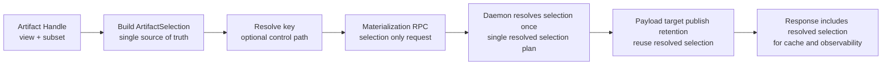

# Summary

Hard-cut retrieval and materialization to one selection model with one identity source:

- `ArtifactSelection` is the only retrieval and materialization selection contract.
- Selection and artifact identity are expressed once on the artifact handle, then propagated unchanged.
- Retrieval call sites no longer re-pass tensor-name filters.
- All materialization RPCs consume the same selection contract and stop accepting duplicated selection and identity fields as independent inputs.
- `MaterializeByKey` is removed from the data path. Key lookup remains `ResolveKeyMapping` before materialization.
- Responses and target publication scopes carry resolved selection identity explicitly to eliminate ambiguity.

This is a deliberate pre-launch breaking change. No dual stack and no compatibility shims are retained.

# Problem Statement

Current retrieval and materialization have overlapping identity and selection channels that can diverge:

- Handle-level selection state (`view_metadata`, `view_spec`) in `Artifact`.
- Call-level selection fields (`names` -> `tensor_names` / `view_subset_hash`) in retrieval and RPC calls.
- Parallel artifact identity channels in requests (`artifact_id` / `key` / `artifact_ref`) separate from selection identity.

Current behavior snapshot:

- `Artifact.tensor_dict(..., names=...)` still controls final payload scope even when handle-level subset already exists (`tensorcast/api/store/artifact.py`).
- `Artifact.view(..., names=...)` overloads transform and subset semantics in one API (`tensorcast/api/store/artifact.py`).
- Materialization requests still include duplicated selection fields (`tensor_names`, `view_subset_hash`, `view/view_id`) (`proto/tensorcast/daemon/v2/store_daemon.proto`).
- `MaterializeIntoMappedTarget` still follows a separate selector shape instead of the same selection contract used elsewhere (`proto/tensorcast/daemon/v2/store_daemon.proto`).
- Daemon descriptor shaping still filters directly on request tensor names (`daemon/service/controllers/materialization_payload_utils.cc`).
- Key-based data-path RPC (`MaterializeByKey`) duplicates materialization semantics (`proto/tensorcast/daemon/v2/store_daemon.proto`, `daemon/service/controllers/replica_materialization_service.cc`).
- Plan and node-agent still reconstruct selection through artifact APIs instead of executing directly from `ArtifactSelection` (`tensorcast/api/plan/plan.py`, `tensorcast/node_agent/executor.py`).

This violates artifact-first intent from `0039` and diverges from selection identity already used in plan/binding/retention paths.

# Goals / Non-Goals

## Goals

- One selection contract only: `ArtifactSelection`.
- One-time selection expression on handle APIs, no duplicated call-level filtering.
- Clear API split:
  - `view` for transforms
  - `subset` for name selection
- One identity source per request:
  - artifact identity comes from `selection.artifact_id`
  - no parallel top-level artifact identity selectors in materialization requests
- Deterministic selection identity across Python/C++:
  - non-identity view yields deterministic `view_id`
  - subset-only selection has empty `view_id`
- Remove key-based data-path RPC and require explicit key resolution before materialization.
- Reuse `ArtifactSelection` uniformly across retrieval, target publish, plan, and node-agent flows.

## Non-Goals

- Preserve legacy signatures through compatibility wrappers.
- Add feature flags or environment switches for old behavior.
- Change `schema.sql` or Global Store persistence model.

# Architecture and Interfaces



## Normative Invariants

1. Retrieval and materialization requests carry selection via `ArtifactSelection` only.
2. Materialization request artifact identity is `selection.artifact_id` only.
3. Materialization data path is artifact-id based only. Keys are resolved before materialization RPC.
4. Subset-only selection is never treated as view identity:
   - `selection.view_id == ""`
   - `selection.view_spec` unset
   - `selection.tensor_names` and `selection.view_subset_hash` carry subset meaning
5. Full selection uses empty subset markers:
   - `selection.tensor_names == []`
   - `selection.view_subset_hash == b""`
6. `selection.tensor_names` is an ordered stream when present and must be preserved end-to-end.
7. `selection.view_subset_hash` is membership hash over sorted unique `tensor_names`; it must not depend on stream order.
8. Selection hashing and layout hashing remain shared Python/C++ behavior (`tensorcast/common/selection_identity.py`, `core/common/selection_identity.cc`).
9. Byte artifacts (see `docs/designs/0087-unified-artifact-runtime-and-routed-byte-artifact-architecture.md`) use a **fixed selection profile**:
   - no views and no subsets,
   - `logical_layout_hash` and `selection_hash` are fixed constants validated by controllers (not derived from index bytes).
10. Daemon controllers parse and validate selection exactly once, then pass one resolved selection plan through control/data path.
11. Responses, target publication scopes, and retention scopes use the same resolved selection identity; no re-encoding from legacy request-local fields.
12. Python selection construction must use one shared contract helper per selection profile:
    - tensor-dict artifacts: `tensorcast/common/selection_contract.py`
    - byte artifacts: a fixed-profile builder (see `0087`)
13. `view_id` is authoritative only when derived from `compute_view_id(view_spec, canonical_index_bytes)`; cached `view_id` values are advisory and must be recomputed for identity validation.
14. Canonical index and selected/view index hints are semantically disjoint; canonical hints must never fallback to selected/view hints.
15. Replica and target/mapped-target daemon flows must share one validation implementation and emit server-resolved `resolved_selection`.

## Canonical Selection Contract

`ArtifactSelection` is the canonical selector envelope for all retrieval and materialization flows.

| Field | Meaning | Validation rule |
| --- | --- | --- |
| `artifact_id` | content identity for routing and load | required and non-empty |
| `view_id` | deterministic id for non-identity transform view | must be empty for subset-only without transform |
| `view_spec` | transform operations | optional; when present must match `view_id` |
| `tensor_names` | ordered packed stream selection | must not contain duplicates |
| `view_subset_hash` | order-independent membership hash | must match sorted unique `tensor_names`; empty when full selection |
| `logical_layout_hash` | hash of selected index bytes plus index kind (or fixed profile hash) | daemon recomputes (or validates fixed profile) and must match |
| `selection_hash` | hash over normalized view and subset identity (or fixed profile hash) | daemon recomputes (or validates fixed profile) and must match |

Proto3 required semantics:

- `required` in this design means server-side validation behavior, not proto keyword.
- Missing/empty required fields fail with `INVALID_ARGUMENT`.
- Empty `view_subset_hash` is normalized to unset for `selection_hash` computation in Python/C++.

### Selection shape matrix

| Scenario | `view_id` | `view_spec` | `tensor_names` / `view_subset_hash` | `logical_layout_hash` input |
| --- | --- | --- | --- | --- |
| Full selection | empty | unset | empty | canonical index + canonical kind |
| Subset-only | empty | unset | non-empty | selected index + view kind |
| View-only (transform) | non-empty | set | optional | selected index + view kind |
| Subset + View | non-empty | set | non-empty | selected index + view kind |
| Prefetch / Plan / Node-agent | same as above | same as above | same as above | same as above |
| Region-backed get_into / mapped-target | same as above | same as above | same as above | same as above |
| Byte artifact (0087) | empty | unset | empty (or normalized `["payload"]`) | fixed profile digest (0087) |

## SDK API Contract Hard Cut

### Public API target state

```python
def view(
    *,
    slices: Mapping[str, Sequence[object]] | None = None,
    transpose: Mapping[str, Sequence[tuple[int, int]]] | None = None,
) -> Artifact

def subset(names: Sequence[str]) -> Artifact

def tensor_dict(
    *,
    device: torch.device | str,
    options: GetArtifactOptions | None = None,
    ctx: CallContext | None = None,
) -> dict[str, torch.Tensor]

async def tensor_dict_async(
    *,
    device: torch.device | str,
) -> dict[str, torch.Tensor]
```

Hard-cut removals:

- `Artifact.view(..., names=...)` removed.
- `Artifact.tensor_dict(..., names=...)` removed.
- `Artifact.tensor_dict_async(..., names=...)` removed.

`Artifact.tensor(name, ...)` remains as convenience and internally derives a single-name subset artifact.

### Internal selection construction

Each tensor-dict retrieval/materialization path builds `ArtifactSelection` through the shared helper
`tensorcast/common/selection_contract.py::build_artifact_selection(...)`.

Byte artifacts use a fixed selection profile (see `docs/designs/0087-unified-artifact-runtime-and-routed-byte-artifact-architecture.md`) and
must not use the tensor-dict selection hashing path.

- `artifact_id`: required.
- `view_id`: deterministic for non-identity transforms only.
- `view_spec`: present only for non-identity transforms.
- `tensor_names`: ordered subset names if subset exists.
- `view_subset_hash`: sha256 digest over sorted unique `tensor_names`; empty bytes when full selection.
- `selection_hash`: `compute_selection_hash(view_id, view_subset_hash)`.
- `logical_layout_hash`: computed over canonical or selected/view index bytes based on index kind.
- Selected/view index bytes are computed with `compute_selected_index_bytes(...)` when subset or transform is active.
- Canonical index hints and selected/view index hints are separate inputs: `canonical_index_bytes_hint` must never fallback from `view_index_bytes_hint`.
- Region-backed, deferred, inplace slot, and direct materialization paths all call the same selection helper and enforce the same validation rules.
- `ViewMetadataCache.selected_index` carries selected/view index material; `ViewMetadataCache.view_id` is not treated as authoritative identity without recomputation from canonical index bytes.

Byte artifact selection construction (required):

- `view_id` must be empty and `view_spec` must be unset.
- subset selection must be rejected.
- `logical_layout_hash` and `selection_hash` are fixed constants and are validated by controllers.

Execution-layer convergence requirements:

- Plan builder and node-agent must execute selection directly from `ArtifactSelection` and stop reconstructing selection via `Artifact.view(..., names=...)`.
- `Binding` and slot flows must use the same selection builder contract for swap/publish validation.
- `ViewSpecComposer.compose(...)` receives identity canonical bytes (`identity_index_bytes`) so chained subset/view operations keep deterministic `view_id` over artifact-canonical identity.

## Proto/RPC Contract Hard Cut

### Materialization requests

All materialization requests become selection-first with the same selector envelope:

| RPC | Required selector field | Keep | Remove |
| --- | --- | --- | --- |
| `MaterializeReplicaRequest` | `ArtifactSelection selection` | `replica_uuid`, device selectors, source policy, lease mode, wait controls | top-level `artifact_id`, `tensor_names`, `view_subset_hash`, `view/view_id`, any key selector |
| `MaterializeIntoTargetRequest` | `ArtifactSelection selection` | `target_layout`, `pid`, device selectors, source policy, operation id | `artifact_ref`, `tensor_names`, `view_subset_hash`, `view/view_id` |
| `MaterializeIntoMappedTargetRequest` | `ArtifactSelection selection` | `target_layout`, `copy_plan`, `dst_tensors`, `pid`, device selectors, source policy, operation id | `artifact_ref`, `view_subset_hash`, `view/view_id`, any parallel selector fields |

### Key data-path removal

- remove RPC: `MaterializeByKey`
- keep RPC: `ResolveKeyMapping`
- all SDK/client/node-agent flows resolve key first, then call artifact-id materialization RPC
- remove client and server surfaces for by-key materialization:
  - `tensorcast/daemon_ctl.py` (`materialize_by_key_v2` and wrappers)
  - `daemon/service/controllers/materialization_controller.*` by-key delegates
  - `daemon/service/grpc_service_impl*.cc` by-key rpc delegate wiring

### Response contract

Responses must expose resolved selection identity explicitly:

- `MaterializeReplicaResponse` includes `resolved_selection`.
- `MaterializeIntoTargetResponse` includes `resolved_selection` (used by both target and mapped-target paths).
- If legacy subset metadata fields remain during the cut, they must be derived from `resolved_selection` and validated to match it exactly.

## Daemon and Core Execution Contract

- Controllers validate `ArtifactSelection` consistency once:
  - `selection.view_subset_hash` matches `selection.tensor_names`
  - view identity and view spec are coherent
- `selection_hash` and `logical_layout_hash` are recomputed (tensor-dict profile) or validated against fixed profile
  constants (byte artifact profile), and must match request values.
- Payload descriptor construction uses resolved selection, not independent request fields.
- Target publication token and retention paths reuse the exact resolved selection object without re-encoding.
- Response metadata exposes resolved selection for observability and cache hydration.
- Replica and target/mapped-target share one validator module (`daemon/service/controllers/selection_validation_utils.{h,cc}`) for tensor-name, subset-hash, logical-layout-hash, and selection-hash checks.
- Replica response `resolved_selection` is server-resolved output, not a request copy-through.

Internal implementation requirement:

- Introduce one internal resolved selector structure (for example `ResolvedSelectionPlan`) and thread it through:
  - replica materialization
  - target materialization
  - payload descriptor builder
  - target publish scope minting
  - retention acquisition backend

## Selection Convergence Scope

This hard cut converges selection handling across:

- retrieval path (`Artifact` + materialization pipeline)
- region-backed materialization (`MaterializeIntoTarget`)
- plan and node-agent execution (`tensorcast/api/plan/plan.py`, `tensorcast/node_agent/executor.py`)
- target publish and retention (`daemon/service/controllers/target_materialization_service.cc`, retention registry)
- mapped-target materialization (`MaterializeIntoMappedTarget`)

## Error Model

Selection contract violations fail fast:

- `INVALID_ARGUMENT`:
  - missing `selection`
  - empty `selection.artifact_id`
  - duplicate `selection.tensor_names`
  - hash mismatches (`view_subset_hash`, `selection_hash`, `logical_layout_hash`)
  - incompatible `view_id` and `view_spec`
- `FAILED_PRECONDITION`:
  - non-publishable selection used in publish flow (packed or subset local-only)
  - requested execution mode incompatible with resolved selection shape
- `NOT_FOUND`:
  - key resolution misses before materialization
- `UNIMPLEMENTED`:
  - removed legacy RPC/method usage after cut

Observability normalization:

- error reason labels are normalized across validator callers: `tensor_name_duplicate`, `subset_hash_mismatch`, `selection_hash_mismatch`, `logical_layout_hash_mismatch`, and `view_identity_mismatch`.
- daemon materialization result metrics should use these reason labels consistently for both replica and target paths.
- replica materialization annotates OpenTelemetry span attribute `tc.selection.error_reason` on validation failures for failure-class aggregation.

## Naming Compliance

| Proposed symbol | Kind | Required style | Result |
| --- | --- | --- | --- |
| `Artifact.subset` | Python method | `snake_case` | pass |
| `Artifact._build_artifact_selection` | Python method | `snake_case` | pass |
| `MaterializationPipeline.materialize_selection` | Python method | `snake_case` | pass |
| `ResolvedSelectionPlan` | C++ struct | `PascalCase` | pass |
| `build_materialize_selection_plan` | C++ function | `snake_case` | pass |
| `validate_artifact_selection` | C++ function | `snake_case` | pass |
| `ReplicaMaterializationService` | C++ class | `PascalCase` | pass |
| `ArtifactSelection` | Proto message | `PascalCase` | pass |
| `selection_hash` | Proto field | `snake_case` | pass |
| `logical_layout_hash` | Proto field | `snake_case` | pass |

# Schema Changes

None. `schema.sql` is unchanged.

## Alternatives and Rationale

Alternative A: keep both handle-level and call-level selector channels.

- Rejected because it preserves ambiguity and repeated intent expression.

Alternative B: keep split identity (`artifact_id` outside selection) while only unifying selector fields.

- Rejected because identity mismatch risk remains and validation logic forks.

Alternative C: keep `MaterializeByKey` as convenience data-path RPC.

- Rejected because key indirection belongs to control path and creates dual materialization semantics.

Chosen direction:

- explicit API split (`view` for transforms, `subset` for name selection)
- single propagation path through `ArtifactSelection`
- single request identity source (`selection.artifact_id`)
- single selector validation path across replica and target materialization RPCs

# Trade-offs and Risks

- Large coordinated change across sdk/daemon/proto/tests.
- Callers using removed signatures fail immediately and must update.
- Existing tests built on duplicated selection fields require full rewrite.
- Merge conflict pressure is higher while materialization work is active.

Mitigation:

- land as one coordinated hard-cut change set
- prefer compile/runtime errors over fallback behavior
- block merge on full C++ + Python suite for retrieval/materialization paths
- add cross-language contract tests and proto/doc lint guards in CI

# Compatibility and Acceptance Criteria

Compatibility policy for this change:

- Pre-launch hard cut only.
- No backward compatibility layer.
- No dual-path behavior.

Acceptance criteria:

1. `Artifact.view` no longer accepts `names`.
2. `Artifact.tensor_dict` and `Artifact.tensor_dict_async` no longer accept `names`.
3. `MaterializeReplicaRequest`, `MaterializeIntoTargetRequest`, and `MaterializeIntoMappedTargetRequest` are selection-first and no longer expose duplicated request-local selector fields.
4. Materialization request identity comes only from `selection.artifact_id`.
5. `MaterializeByKey` RPC and all client/server plumbing are removed.
6. Subset-only selection does not create synthetic view identity (`view_id == ""`).
7. Selection identity (`view_subset_hash`, `selection_hash`, `logical_layout_hash`) is consistent across Python/C++ for:
   - direct retrieval
   - region-backed into-target
   - mapped-target into-target
   - plan/node-agent
   - target publish scope validation
8. Daemon returns `resolved_selection` in materialization responses and publish/retention scopes consume the same resolved selection.
9. Node-agent no longer reconstructs selection via `Artifact.view(..., names=...)`.
10. `view_id` is always recomputed from `view_spec + canonical index bytes`; no path treats cached `view_id` as authoritative without recomputation.
11. Canonical index hints are never synthesized from selected/view index hints in SDK materialization code paths.
12. Replica and target/mapped-target daemon flows use the same selection validation helper and return server-resolved `resolved_selection`.

## Contract Gates

Hard gates for merge:

- No `MaterializeByKey` symbol in proto/sdk/daemon code:
  - `rg "MaterializeByKey" proto tensorcast daemon`
- No duplicated selector fields in materialization request schemas:
  - `rg "tensor_names|view_subset_hash|oneof view_identity|artifact_ref" proto/tensorcast/daemon/v2/store_daemon.proto`
- Cross-language parity tests for selection hash and subset hash:
  - Python and C++ tests share golden vectors for `view_id`, `tensor_names`, `view_subset_hash`, `selection_hash`
- Docs sync checks:
  - architecture docs and API docs no longer describe key-based materialization data path as recommended flow
- Single-builder gate for SDK selection construction:
  - `rg "compute_selection_hash|compute_logical_layout_hash" tensorcast/api/store tensorcast/api/_materialize.py` should only reference `tensorcast/common/selection_contract.py` construction flow.
- Shared-validator gate for daemon materialization:
  - `rg "logical_layout_hash_mismatch|selection_hash_mismatch|subset_hash_mismatch" daemon/service/controllers` should map to `selection_validation_utils` call sites, not per-path ad-hoc recomputation.

# References

- `docs/designs/0039-artifact-first-sdk.md`
- `docs/designs/0055-programmable-framework.md`
- `docs/designs/0061-slot-based-inplace-binding-and-swap.md`
- `docs/designs/0063-binding-first-inplace-updates.md`
- `docs/architecture/artifact-views-and-retrieval.md`
- `docs/architecture/api/materialization-flow.md`
- `docs/architecture/api/region-backed.md`
