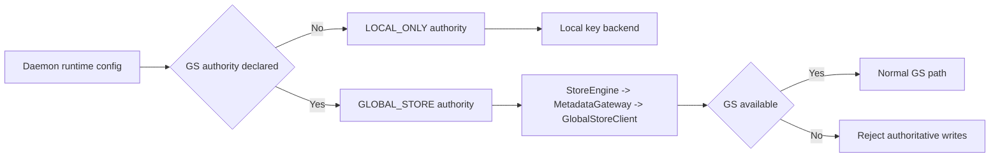

# Summary

Enable key-based publish/resolve/swap in daemon local-only deployments (`global_store_mode=none`) while preserving strict Global Store authority in global mode.

This design defines a single key-mapping contract and requires semantic equivalence between local and Global Store backends. Local-only is not a degraded approximation; it is a backend substitution under the same RPC contract.

# Problem Statement

Current behavior has two contract gaps:

- Local-only daemon workflows are documented as valid (`docs/guides/sdk-startup-user-guide.md`), but key paths can fail when the metadata gateway requires a connected Global Store client.
- Key behavior is not consistently defined as one contract across backends and SDK entry points, which risks long-term semantic drift.

The root issue is contract fragmentation: backend-specific behavior and best-effort client paths create incompatible expectations for publish/resolve/swap, generation, and cache TTL behavior.

# Goals and Non-Goals

## Goals

- Make `put(key=...)`, `from_disk(key=...)`, and key resolution usable in local-only daemon mode.
- Keep Global Store as the only authority when daemon is configured for Global Store.
- Define one normative key-mapping contract for both local and global backends.
- Align local generation/cache behavior with existing Global Store semantics.
- Remove `fail_if_exists` from daemon key publish API and keep publish conflict logic simple and deterministic.
- Keep SDK architecture invariant: SDK key operations remain daemon-mediated only.
- Unify SDK key publish strictness so `key=` behavior is deterministic across surfaces.

## Non-Goals

- Cross-daemon key-map replication in local-only mode.
- Persisting local-only key mappings across daemon restart.
- Changing Global Store key schema.
- Introducing SDK direct Global Store connectivity.

# Architecture and Interfaces

## Decision Set

- D1: Authority mode is configuration-driven and process-lifetime stable.
- D2: `LOCAL_ONLY` backend is contract-equivalent to GS key semantics.
- D3: Global mode never auto-falls back to local authority during GS issues.
- D4: SDK key paths remain daemon-only.
- D5: Local key data is daemon-lifetime scoped.
- D6: `publish` conflict rule is simple and deterministic; no `fail_if_exists` branch.
- D7: `swap` semantics (including missing-key behavior) match GS semantics.
- D8: Key cache TTL behavior is server-driven and consistent with key kind.

## Authority Modes

- `LOCAL_ONLY`
  - Entered when daemon has no GS authority configured (no GS endpoint and no injected GS client).
  - `PublishReplicaKey`/`ResolveKeyMapping`/`SwapKeyMapping` use daemon-local backend.

- `GLOBAL_STORE`
  - Entered when daemon is configured with GS authority (endpoint and/or injected GS client).
  - Key RPCs use existing StoreEngine -> MetadataGateway -> GlobalStoreClient path.
  - If GS is unavailable, authoritative writes fail; no local fallback authority.

Authority detection must be decided once at daemon startup and remain immutable for process lifetime.

## Local Key Store Contract (Normative)

In-memory, daemon-local map keyed by `key`, with row fields:

- `artifact_id`
- `generation` (monotonic per key, initial `0`)
- `kind` (`IMMUTABLE` or `ALIAS`)
- `updated_at` (observability)

### Mutation semantics

- `publish(key, artifact_id)`
  - key missing: insert row `{artifact_id, generation=0, kind=IMMUTABLE}`.
  - key exists and same `artifact_id`: idempotent success; no generation bump.
  - key exists and different `artifact_id`: conflict (`ok=false`, reason set).
  - publish never increments generation.

- `swap(key, new_artifact_id, expected_artifact_id?, expected_generation?)`
  - key missing and any expected guard is set: conflict (`ok=false`, current fields unset).
  - key missing and no expected guards: create `{artifact_id=new_artifact_id, generation=0, kind=ALIAS}` and succeed.
  - key exists, expected guard mismatch: conflict, return current `{artifact_id, generation}`.
  - key exists, `new_artifact_id == current_artifact_id`: succeed, keep generation unchanged, ensure `kind=ALIAS`.
  - key exists, new artifact differs and guards pass: update artifact, set `kind=ALIAS`, increment generation by 1.

### Resolve cache policy

`ResolveKeyMappingResponse.cache_ttl_seconds` is server-driven:

- `kind=ALIAS` -> `0` (no client caching)
- `kind=IMMUTABLE` -> backend hint (default 30s unless explicitly configured)

Local backend must not override alias TTL with controller-local fixed mutation cache values.

### Concurrency and durability

- A controller-level mutex protects each read-modify-write transition.
- Generation monotonicity is required for successful swap updates.
- Scope is daemon process lifetime only; restart clears local mappings.

## RPC Behavior Contract

| RPC | LOCAL_ONLY | GLOBAL_STORE connected | GLOBAL_STORE unavailable |
| --- | --- | --- | --- |
| `PublishReplicaKey` | local publish semantics above | existing GS upsert path | fail (authority/transport error; no local fallback) |
| `ResolveKeyMapping` | local read + TTL hint by kind | existing GS resolve path | cached read may succeed; uncached read fails |
| `SwapKeyMapping` | local swap semantics above | existing GS swap path | fail (authority/transport error; no local fallback) |

Conflict model:

- publish/swap conflicts remain API-level `ok=false` responses (not transport failure).
- guard mismatch or incompatible existing mapping is conflict.

# SDK Behavior Alignment

- `Store.put(..., key=...)` precheck stays strict.
- In `LOCAL_ONLY`, strict precheck is satisfied by local authority.
- In `GLOBAL_STORE`, key writes remain strict and never silently degrade to local writes.
- SDK key publish behavior is unified: all key publish call sites follow the same strict contract (no best-effort swallow).

No SDK direct Global Store channel is introduced.

# Invariants and Error Model

## Invariants

1. SDK key operations must go through daemon APIs.
2. Authority mode is fixed for daemon process lifetime.
3. Global mode disconnect cannot create local-authority writes.
4. Local-only mapping scope is single daemon and daemon lifetime.
5. Generation starts at `0` and is monotonic on successful swap updates only.
6. Publish never bumps generation.
7. Alias keys must resolve with `cache_ttl_seconds=0`.
8. Local and global backends must be contract-equivalent for publish/resolve/swap.

## Error Model

- `INVALID_ARGUMENT`
  - empty key, empty required ids, malformed request.
- `NOT_FOUND`
  - resolve on missing key in active authority backend.
- `FAILED_PRECONDITION`
  - global authority required but no connected GS client is available.
- Transport/service transient errors (`UNAVAILABLE`, `DEADLINE_EXCEEDED`, etc.)
  - propagated from global authority path when applicable.
- Conflict (`ok=false`, reason/current values in response)
  - publish/swap contract preconditions not met.

# API Simplification: Remove `fail_if_exists`

`PublishReplicaKeyRequest.fail_if_exists` is removed from daemon API contract.

Rationale:

- Existing deterministic publish semantics already cover required behavior.
- Additional branches increase complexity without valid operator value.
- Conflict handling remains explicit and simple: existing different mapping -> conflict.

# Naming Compliance

| Proposed symbol | Kind | Required style | Result |
| --- | --- | --- | --- |
| `KeyMappingAuthorityMode` | C++ enum/class | `PascalCase` | pass |
| `LocalKeyMappingStore` | C++ struct/class | `PascalCase` | pass |
| `publish_replica_key` | C++ method | `snake_case` | pass |
| `resolve_key_mapping` | C++ method | `snake_case` | pass |
| `swap_key_mapping` | C++ method | `snake_case` | pass |
| `_precheck_key_mapping` | Python method | `snake_case` | pass |
| `map_registration_error` | Python function | `snake_case` | pass |

# Schema Changes

None. `schema.sql` is unchanged.

# Alternatives and Rationale

Alternative A: require GS for all key paths.

- Rejected: contradicts documented local-only workflows.

Alternative B: auto-fallback to local authority on GS disconnect.

- Rejected: introduces split-brain risk.

Alternative C: keep `fail_if_exists` toggle.

- Rejected: unnecessary semantic branch and complexity.

Chosen approach:

- single contract + authority separation + local backend equivalence + no implicit authority switching.

# Trade-offs and Risks

- Local-only mappings are ephemeral and single-daemon scoped.
- Strict key semantics may convert previously silent best-effort paths into explicit failures.
- Refactor touches daemon proto, SDK client, and tests simultaneously.

Mitigations:

- explicit docs for local-only scope/lifetime.
- conformance tests across local/global backends.
- unified SDK error mapping with actionable hints.

# Compatibility and Acceptance Criteria

Compatibility policy:

- additive capability for local-only mode.
- no semantic regression in global mode.

Acceptance criteria:

1. `Store.put(..., key=...)` succeeds in local-only mode for free key.
2. Local-only publish/swap/resolve semantics match GS contract.
3. Missing-key swap without expected guards creates alias mapping (generation `0`).
4. Publish conflict remains deterministic (`ok=false`) when key maps to different artifact.
5. Alias resolve returns `cache_ttl_seconds=0` in both backends.
6. Global mode with GS unavailable never creates local-authority writes.
7. SDK key publish paths are strict and behavior-consistent across entry points.
8. `fail_if_exists` is removed from daemon key publish API.
9. Startup/API docs clearly state local-only scope and restart behavior.

## Contract Gates

- daemon conformance tests pass for both local and global backends on the same semantic matrix.
- global-disconnected rejection tests pass.
- no SDK direct Global Store usage introduced.
- `fail_if_exists` removed from proto/client/controller contract.
- docs updated in startup guide and API design.

# References

- `docs/guides/sdk-startup-user-guide.md`
- `docs/architecture/api/api-design.md`
- `docs/designs/0063-binding-first-inplace-updates.md`
- `schema.sql`
- `tensorcast/global_store/repositories/key_mapping_repository.py`
- `tensorcast/global_store/rpc/key_mapping_rpc_handler.py`
- `daemon/service/controllers/key_mapping_controller.cc`
- `core/store/runtime/metadata/metadata_gateway.cc`
- `core/store/runtime/context/runtime_context.cc`
