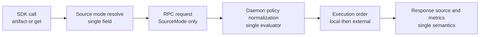

# Summary

Unify source-selection policy into one user-facing concept and one transport contract.

Current behavior splits source policy across multiple fields (`FallbackOptions.prefer`, `allow_p2p`, `allow_disk`, request `preference`, request `source_policy`), which creates semantic drift and user confusion.

This design introduces one normative policy model:

- one user-facing field: `source_mode`
- one daemon transport expression: `SourceMode`
- one execution semantics table shared by replica, target, and mapped-target materialization
- one deterministic legacy normalization function during compat window (and then removed)

# Problem Statement

The current policy model has three fundamental inconsistencies:

1. API duplication in SDK:
   - source intent still appears across multiple legacy knobs in `FallbackOptions`.
   - primary retrieval paths are driven by `fallback`, which leaves the public API with legacy source-selection overlap and weak semantics.

2. Transport duplication in daemon RPC:
   - requests carry both legacy `preference` and `source_policy.preference`.
   - daemon must merge/override two parallel channels.

3. Semantic mismatch:
   - `prefer=local` behaves as hard disallow (`allow_p2p=false`, `allow_disk=false`) instead of soft preference.
   - `prefer=disk` behaves as disk-first soft preference.
   - users cannot infer strictness from naming alone.

This is a model problem, not a wording problem. Long-term consistency requires one source-policy state machine, not more aliases.

# Current Behavior Grounding

This design is grounded in current implementation behavior:

- SDK policy resolution is effectively `FallbackOptions`-driven in materialization paths:
  - `tensorcast/api/store/materialization.py` computes `preference` and `allow_*` from `fallback`.
  - `GetArtifactOptions` is execution-only; source selection is not driven from it.
- Daemon request encoding keeps dual channels:
  - `preference` field plus `source_policy.preference`.
  - `tensorcast/daemon_ctl.py` contains merge precedence logic on the client side.
- Daemon server side merges and validates again:
  - `daemon/service/controllers/materialization_policy_utils.cc` performs second-stage normalization/validation.
- Core execution still consumes legacy tuple semantics:
  - `SourcePreference` plus `allow_p2p`/`allow_disk` in `loading::MaterializeHints`.

Root cause is not one bug in one file. It is cross-layer over-modeling of one decision.

# Goals and Non-Goals

## Goals

- Provide one user-facing source policy abstraction that is easy to choose.
- Remove conflicting policy fields from the public SDK surface.
- Remove dual transport policy channels in daemon RPCs.
- Make source ordering and strictness deterministic and documented.
- Keep local replica reuse semantics explicit and consistent across all modes.
- Keep managed shared-disk wait behavior consistent with selected source mode.

## Non-Goals

- Changing artifact identity, selection identity, or key-mapping architecture.
- Changing persistence schema (`schema.sql`).
- Adding new retrieval sources.
- Supporting legacy dual semantics indefinitely.

# Architecture and Interfaces



## Decision Set

- D1: Source policy has one authoritative user field, `source_mode`.
- D2: `GetArtifactOptions` no longer owns source-selection semantics.
- D3: Daemon RPC uses one source policy channel only.
- D4: Local replica reuse is always attempted first and is mode-independent.
- D5: External source ordering is mode-defined and deterministic.
- D6: Replica, target, and mapped-target materialization share the same mode evaluator.
- D7: Legacy fields are transitional only and have a bounded removal window.

## Normative User Contract

Introduce `SourceMode` with four values:

- `auto`
- `local_only`
- `disk_first`
- `disk_only`

Execution semantics:

| Source mode | External sources allowed | External order | Strictness |
| --- | --- | --- | --- |
| `auto` | P2P + Disk | P2P -> Disk | soft |
| `local_only` | none | n/a | strict local |
| `disk_first` | Disk + P2P | Disk -> P2P | soft |
| `disk_only` | Disk | Disk only | strict disk |

Common rule for all modes:

- Step 0 is always local replica short-circuit (LIP/local loaded replica) when available.

User decision guide:

| If user intent is... | Choose |
| --- | --- |
| fastest default with normal fallback | `auto` |
| never leave local process/host sources | `local_only` |
| prefer managed/shared disk but still allow P2P fallback | `disk_first` |
| only serve from disk (for deterministic disk path workflows) | `disk_only` |

Why no public `p2p_only` mode:

- It is intentionally excluded from long-term public contract to keep choice cardinality low and reduce operator confusion.
- Existing `p2p_only`-like legacy combinations are handled only in a temporary compatibility adapter.

## SDK Surface Simplification

Target-state API:

- Source policy appears only in `FallbackOptions` (or successor alias type) as `source_mode`.
- `GetArtifactOptions` carries no source-selection field.
- `FallbackOptions.prefer`, `allow_p2p`, `allow_disk`, and `prefer_disk` are removed from public contract after migration.

Surface shape:

```python
class SourceMode(StrEnum):
    AUTO = "auto"
    LOCAL_ONLY = "local_only"
    DISK_FIRST = "disk_first"
    DISK_ONLY = "disk_only"

class FallbackOptions(BaseModel):
    source_mode: SourceMode = SourceMode.AUTO
    replica_uuid: str | None = None
```

`GetArtifactOptions` remains execution-only:

- `wait_for_completion`
- `wait_for_shared_disk_ms`
- `region_backed_mode`
- `pinned_allocation_timeout_ms`
- `enable_verification`
- `transport_hold_ms`

No source policy fields remain in `GetArtifactOptions`.

## Legacy Normalization (Compat Window Only)

During Stage 1 and Stage 2, legacy fields are normalized through one deterministic adapter before building transport requests.

Normalization precedence:

1. if `source_mode` is explicitly provided, use it and ignore legacy fields.
2. otherwise derive `effective_prefer`:
   - start with `prefer`
   - if `prefer == "auto"` and `prefer_disk is True`, treat as `effective_prefer = "disk"`
3. map `effective_prefer` plus `allow_p2p`/`allow_disk` with the table below.

Compat mapping table:

| Legacy tuple (`effective_prefer`, `allow_p2p`, `allow_disk`) | Normalized mode / action |
| --- | --- |
| `local`, any, any | `local_only` |
| `disk`, any, `false` | `INVALID_ARGUMENT` |
| `disk`, `false`, `true` | `disk_only` |
| `disk`, `true`, `true` | `disk_first` |
| `auto`, `false`, `false` | `local_only` |
| `auto`, `false`, `true` | `disk_only` |
| `auto`, `true`, `true` | `auto` |
| `auto`, `true`, `false` | temporary internal `p2p_only_compat` (deprecated) |
| `p2p`, `false`, any | `INVALID_ARGUMENT` |
| `p2p`, `true`, `true` | temporary internal `p2p_first_compat` (deprecated) |
| `p2p`, `true`, `false` | temporary internal `p2p_only_compat` (deprecated) |

Compatibility rule:

- `p2p_first_compat` and `p2p_only_compat` are internal-only transitional states, never exposed as public `SourceMode`.

## Daemon RPC Contract Simplification

Target-state proto contract:

```proto
enum SourceMode {
  SOURCE_MODE_UNSPECIFIED = 0;
  SOURCE_MODE_AUTO = 1;
  SOURCE_MODE_LOCAL_ONLY = 2;
  SOURCE_MODE_DISK_FIRST = 3;
  SOURCE_MODE_DISK_ONLY = 4;
}

message SourcePolicy {
  SourceMode mode = 1;
  reserved 2, 3;
  reserved "allow_p2p", "allow_disk";
}
```

Materialization requests remove legacy dual path:

- remove request-level `preference`
- `source_policy.mode` is the only transport policy field

## Execution Contract Convergence

One daemon evaluator normalizes `SourceMode` into engine hints and source ordering.
It is shared by:

- `MaterializeReplica`
- `MaterializeIntoTarget`
- `MaterializeIntoMappedTarget`

Required convergence points:

1. identical disallow behavior for strict modes (`local_only`, `disk_only`).
2. identical fallback ordering between replica and target flows.
3. identical canonical-index source choice logic:
   - `disk_first` and `disk_only` prefer disk index when disk source exists.
   - not gated by per-RPC ad-hoc checks.
4. identical stale-route behavior and disk fallback eligibility.

## Wait-for-Shared-Disk Behavior

`wait_for_shared_disk_ms` applies only when mode includes disk:

- allowed: `auto`, `disk_first`, `disk_only`
- invalid: `local_only` (request rejected with `INVALID_ARGUMENT`)

When wait path triggers:

- retry mode is forced to `disk_only` for the retry attempt.
- no P2P fallback after managed disk readiness is declared.

# Observability Contract

The migration includes source-policy observability convergence:

- Replace legacy attributes (`tc.store.preference`, `tc.store.allow_p2p`, `tc.store.allow_disk`) with one canonical attribute:
  - `tc.store.source_mode`
- Add transition metrics:
  - `tc.store.source_mode.legacy_input_total` with labels `legacy_shape` and `callsite`
  - `tc.store.source_mode.compat_mode_total` with labels `compat_mode`
- Hard-cut gate depends on these metrics (see plan) rather than subjective rollout judgment.

# Invariants and Error Model

## Invariants

1. Exactly one user-facing source policy field controls retrieval source behavior.
2. Exactly one RPC field carries source policy semantics.
3. Local replica short-circuit is mode-independent and always first.
4. `local_only` never uses P2P or disk.
5. `disk_only` never uses P2P.
6. Source mode semantics are identical across replica/target/mapped-target flows.
7. `wait_for_shared_disk_ms` cannot be combined with `local_only`.

## Error Model

- `INVALID_ARGUMENT`
  - invalid `source_mode`
  - invalid option combination (for example `local_only` + `wait_for_shared_disk_ms > 0`)
- `FAILED_PRECONDITION`
  - required source category unavailable by environment constraints
- `NOT_FOUND`
  - no eligible source under strict mode
- source-specific runtime errors
  - propagate from disk/P2P/local materialization attempts

# Naming Compliance

| Proposed symbol | Kind | Required style | Result |
| --- | --- | --- | --- |
| `SourceMode` | C++/Python enum/class | `PascalCase` | pass |
| `ResolvedSourceModePolicy` | C++ struct/class | `PascalCase` | pass |
| `resolve_source_mode_policy` | C++ function | `snake_case` | pass |
| `to_source_mode_hint` | C++ function | `snake_case` | pass |
| `source_mode` | Python field | `snake_case` | pass |
| `SOURCE_MODE_AUTO` | proto/C++ constant | `ALL_CAPS` | pass |

# Schema Changes

None. `schema.sql` is unchanged.

# Compatibility and Migration

Migration is explicit and bounded.

## Stage 1 (compat add)

- Add `source_mode` to SDK and daemon transport.
- Keep legacy fields but mark deprecated in docs and runtime warnings.
- If both legacy and new fields are present, `source_mode` wins.
- Enforce one shared normalization function in SDK and daemon paths.

## Stage 2 (compat freeze)

- SDK public docs and examples switch fully to `source_mode`.
- Legacy fields still accepted but emit warning metrics and logs.
- Any legacy combination mapping to `p2p_first_compat` or `p2p_only_compat` emits explicit deprecation warning with migration guidance.

## Stage 3 (hard cut)

- Keep `GetArtifactOptions` free of source-selection fields.
- Remove `FallbackOptions.prefer`, `allow_p2p`, `allow_disk`, `prefer_disk`.
- Remove RPC legacy `preference` and old `SourcePolicy` fields.
- Remove temporary `p2p_first_compat` and `p2p_only_compat` adapters.
- Reject any legacy p2p-only / p2p-prefer compatibility inputs with `INVALID_ARGUMENT`.

# Alternatives and Rationale

Alternative A: keep current fields and improve docs only.

- Rejected because current state has multiple authoritative paths and semantic drift by implementation.

Alternative B: keep `allow_p2p` and `allow_disk`, remove only `prefer`.

- Rejected because user still composes low-level flags into an implicit state machine.

Alternative C: expose only `auto/local/disk` and hide strict modes.

- Rejected because strict disk-only behavior is operationally useful and currently used internally for readiness retry behavior.

Chosen approach:

- explicit finite modes with deterministic ordering and strictness.

# Trade-offs and Risks

- Short-term migration churn across SDK, daemon, proto, and tests.
- Legacy caller behavior may change when strict invalid combinations are enforced.
- Telemetry cardinality and dashboards need updates from old labels to `source_mode`.
- Some legacy users relying on p2p-only behavior will need migration because p2p-only is not part of the long-term public contract.

Mitigations:

- staged rollout with warning window.
- conformance tests across all three materialization RPC paths.
- explicit grep gates to prevent reintroduction of legacy fields.

# Acceptance Criteria

1. Users can set source behavior via one field (`source_mode`) only.
2. `GetArtifactOptions` contains no source-selection field.
3. Materialization RPC path accepts one source policy channel only.
4. Replica/target/mapped-target flows produce identical source ordering for each mode.
5. `local_only` never uses disk/P2P; `disk_only` never uses P2P.
6. `wait_for_shared_disk_ms` plus `local_only` is rejected.
7. Docs and examples use `source_mode` exclusively.
8. Compat-mode metrics reach hard-cut gate and legacy p2p-only/p2p-first adapters are removed.

# References

- `docs/designs/0039-artifact-first-sdk.md`
- `docs/designs/0071-managed-shared-disk-persistence.md`
- `docs/designs/0078-selection-first-artifact-retrieval.md`
- `docs/architecture/api/api-design.md`
- `docs/architecture/api/materialization-flow.md`
