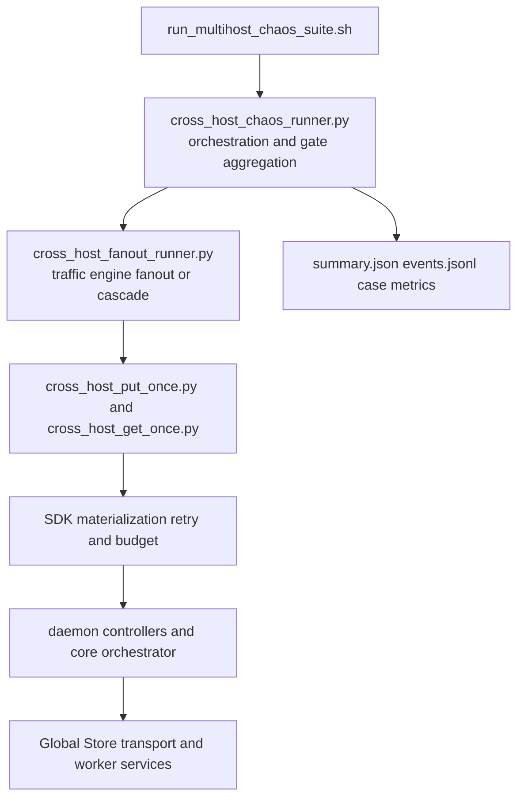

# Summary

Define the owner-level chaos stability contract for multi-host `put/get`.

This design is based on the current implemented baseline and moves directly to hard-gated execution:

- no request-level replay in runner
- no soft pass for required gates
- no compatibility bypass mode in acceptance logic

The framework extends existing runners and keeps multi-mode support in one execution system: phase (`small/medium/large`), traffic mode (`fanout/cascade`), chaos profile (`none/single_fault/combo_fault`), and case outcome (`success/failure`).

# Problem Statement

TensorCast can now run multi-host fanout/cascade and chaos orchestration, but long-term ownership still requires a single normative contract for:

1. hard pass/fail semantics (not report-only metrics)
2. source diffusion observability that stays reliable under DB-probe degradation
3. deterministic recovery SLO validation across fault classes
4. one execution path for all modes without runner fragmentation

Without this contract, results remain hard to compare across phases and easy to reinterpret.

# Goals and Non-Goals

## Goals

- Use current codebase as baseline and execute full chaos program from there.
- Enforce hard gates for required scenarios: any required gate failure fails the run.
- Keep `tensor_dict` single-call contract owned by API/daemon/core.
- Extend existing runners instead of introducing a third independent data-plane runner.
- Keep mode compatibility in one framework:
  - phase: `small`, `medium`, `large`
  - traffic mode: `fanout`, `cascade`
  - chaos profile: `none`, `single_fault`, `combo_fault`
  - case expectation: `success`, `failure`
- Keep responsibility layering explicit and testable:
  - runner observes and gates
  - API/daemon/core converge requests within budget

## Non-Goals

- Redesigning transport architecture.
- Introducing new external orchestration systems.
- Adding new persistent schema tables for chaos state.
- Preserving legacy "soft gate" behavior for required checks.

# Current State Baseline

The following prerequisite capabilities are already implemented and are treated as baseline, not future work:

- fanout/cascade outputs include `all_get_complete`, `source_cardinality_timeline`, `recover_time_sec`, classification, and retry/budget summaries
- helper path uses single API call and exports retry/budget diagnostics without request-level helper replay
- core/daemon path supports request-budget propagation and deadline-aware source reselection
- GS transport path includes create-failure rollback and idempotent complete semantics
- chaos orchestration runner and suite entry are present
- fast-failover and slow-cleanup GS profiles are present

This design therefore focuses on hard-gated execution, not prerequisite feature creation.

# Architecture and Interfaces

## Mode Compatibility Contract

One framework supports all required modes by explicit fields only:

- `phase`: `small | medium | large`
- `mode`: `fanout | cascade`
- `chaos_profile`: `none | single_fault | combo_fault`
- `expected_outcome`: `success | failure`

No mode may bypass hard gate evaluation.

## Retrieval Responsibility Contract

- caller and runner:
  - one business call to `tensor_dict` per request
  - no request-level replay loop
  - optional case-level rerun only for classified infra noise
- API/SDK:
  - transient classification and bounded retry
  - emit retry buckets and budget exit reason
- daemon/core:
  - source selection and reselection
  - transport wait bounded by propagated request budget

## Diffusion Identity Contract

Diffusion gate must be based on source identity, not only source type label.

- preferred source identity: `ticket_replica_uuid`
- secondary source identity: GS transport source address/port when DB probe is healthy
- fallback path must be explicitly marked as degraded observability, never silently equivalent

# Fault Model and Budgets

Fault classes:

- daemon role faults: `daemon_stop`, `daemon_kill`, restart command path
- control-plane faults: short GS outage and recovery
- network faults: delay/loss/reorder (`tc netem` action via event command)
- resource faults: CPU and memory pressure, comm-slice boundary
- retire-window faults: settle matrix (`0s`, `2s`, `10s`)

Global budget constraints:

- at most one daemon down at a time in single-fault profile
- GS outage window bounded to 10-30 seconds in short-outage profile

# Invariants and Error Model

## Invariants

1. `1 put + N get` required scenarios pass only when `all_get_complete=true`.
2. Required scenarios never pass via runner request replay.
3. Every request terminates by deadline with success or explicit error.
4. Diffusion must be observable with source identity progression.
5. `comm_bytes_delta == total_bytes` holds for successful gets.
6. `comm_errors_delta == 0` holds in recovery and final windows.
7. Expected-failure cases pass only via `expected_failure_pass` semantics.

## Error Model

Expected transient classes in fault windows:

- `UNAVAILABLE`
- `NOT_FOUND`
- `FAILED_PRECONDITION`
- `DEADLINE_EXCEEDED`
- transient internal/resource pressure classes recognized by retry policy

Hard failure classes:

- deadline overrun or hang
- gate mismatch (`all_get_complete`, diffusion, correctness, recovery)
- unexpected case status (`unexpected_failure`, `unexpected_success`)

# Configuration Strategy

## Daemon

- baseline profile: `examples/config/store_daemon_config_cross_host_bench.yaml`
- large payload profile: `examples/config/store_daemon_config_cross_host_bench_large_payload.yaml`
- runtime overrides must be logged in output params

## Global Store

- baseline: `examples/config/global_store_config_cross_host_bench.yaml`
- fast failover: `examples/config/global_store_config_cross_host_bench_fast_failover.yaml`
- slow cleanup: `examples/config/global_store_config_cross_host_bench_slow_cleanup.yaml`

# Case Expectations vs Current Code

| Case | Expected behavior (normative) | Current code status | Remaining owner gap |
| --- | --- | --- | --- |
| C1: 3-node function baseline | all requests complete, p2p source, correctness holds | Supported | convert report metrics into strict gate enforcement |
| C2: 4-node cascade retire | hop-by-hop source progression under retire | Supported | strengthen source identity when DB probe is unavailable |
| C3: fanout eventual completion | bounded faults still converge to all-get-complete | Supported | validate across full scale matrix with hard gates |
| C4: fanout diffusion growth | source cardinality grows and rebuilds after faults | Partially supported | replace source-type fallback with replica-identity fallback |
| C5: stale-window convergence | reselection converges within budget | Supported | full settle-matrix evidence at medium and large scales |
| C6: in-transfer daemon fault | transient errors allowed, bounded recovery required | Partially supported | add restart-first-class event templates and gate pack |
| C7: GS short outage | outage tolerated, post-return recovery bounded | Partially supported | lock per-fault SLO thresholds from cluster evidence |
| C8: network perturbation | bounded degradation, eventual recovery | Partially supported | standardize reusable `tc netem` profiles in case schema |
| C9: negative startup boundary | expected failure pattern is pass | Supported | expand negative case catalog and keep zero unexpected status |
| C10: mixed steady-state | multi-seed hotset long-run stability | Not fully supported | add mixed workload generator and long-window analytics |

# Hard Acceptance Criteria

A run is accepted only if all required gates are true.

1. Availability and completion:
   - required positive cases: `all_get_complete=true`
   - required positive cases: `put_success_rate == 1.0`
   - required positive cases: `get_success_rate == 1.0`
2. Correctness:
   - `comm_bytes_delta == total_bytes` for successful gets
   - `comm_errors_delta == 0` in recovery/final windows
   - payload integrity gate enabled for integrity phases
3. Recovery SLO (hard thresholds):
   - daemon stop single fault: `recover_time_sec <= 120`
   - daemon kill single fault: `recover_time_sec <= 180`
   - GS short outage fault: `recover_time_sec <= 240`
   - network perturbation single fault: `recover_time_sec <= 300`
4. Diffusion:
   - positive fanout cases with getter count >= 2 must show `max(unique_source_count) >= 2`
   - post-fault fanout cases must re-establish `unique_source_count >= 2` within recovery SLO
5. Negative-case semantics:
   - all expected-failure cases must be `expected_failure_pass=true`
   - `unexpected_failure` and `unexpected_success` lists must be empty
6. Gate policy:
   - no required gate is soft
   - any required gate failure fails run exit status

# Naming Compliance

Proposed and active interfaces follow repository naming rules:

| Symbol | Kind | Required style | Result |
| --- | --- | --- | --- |
| `CrossHostChaosRunner` | Python class | `PascalCase` | pass |
| `ChaosEventSpec` | Python dataclass | `PascalCase` | pass |
| `run_case` | Python function | `snake_case` | pass |
| `aggregate_summary` | Python function | `snake_case` | pass |
| `source_cardinality_timeline` | output field | `snake_case` | pass |
| `expected_failure_pass` | output field | `snake_case` | pass |

# Schema Changes

No `schema.sql` change is required.

# Trade-offs and Risks

- Trade-off: hard gates increase initial failure rate.
  - rationale: accepted for long-term quality ownership.
- Risk: worker preemption noise can pollute product signal.
  - mitigation: strict classification and case-level rerun policy.
- Risk: diffusion metric quality drops when DB probe is unavailable.
  - mitigation: source identity fallback based on replica ticket fields.
- Risk: mode growth may fragment execution path.
  - mitigation: keep single traffic engine and single orchestration wrapper.

# References

- `docs/plans/0081-multihost-put-get-chaos-stability.md`
- `docs/benchmarks/20260221-multi-host-p2p-fanout-benchmark-report.md`
- `docs/internals/chaos-report-template.md`
- `docs/internals/chaos-gate-checklist.md`
- `examples/cross_host/README.md`
- `docs/designs/0001-docs-system-design.md`
