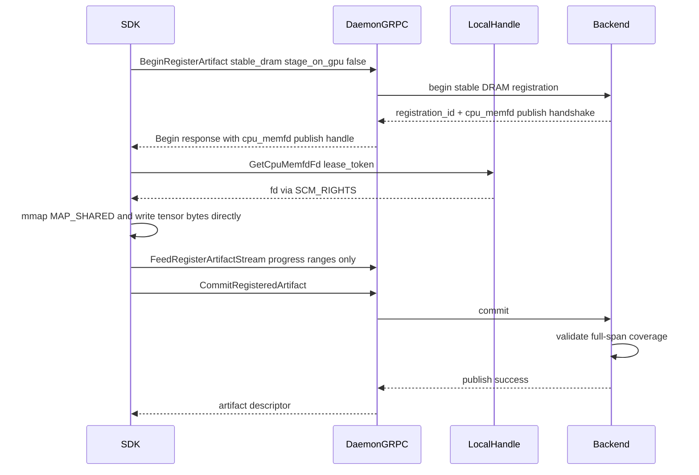

# Summary

Introduce a stable DRAM publish path that writes directly into daemon-owned CPU memfd memory and removes gRPC payload bytes from the hot path.

The target behavior is:

- no daemon-side payload memcpy for `stable_dram + stage_on_gpu=false`
- no model-sized temporary buffers
- only necessary copy operations remain
- key visibility remains commit-gated

This design extends the existing local handle lease model and CPU memfd mechanism from materialization into publish.

# Problem Statement

Current `stable_dram + stage_on_gpu=false` publish still moves payload bytes through gRPC and then copies again inside daemon:

- SDK emits `view_chunk.data = chunk.tobytes()`
- daemon ingests bytes and calls `std::memcpy` into stable DRAM

This introduces avoidable costs:

1. repeated Python/protobuf payload marshaling
2. daemon-side memcpy for every chunk
3. high tail latency under concurrency
4. excess CPU time spent outside useful transfer work

The goal is to make publish behavior approach the local memory-copy bound while preserving correctness and existing lifecycle guarantees.

# Goals and Non-Goals

## Goals

- Keep `publish` commit semantics unchanged: key visible only after successful commit.
- Replace payload streaming for the stable DRAM CPU path with local shared-memory write.
- Preserve correctness checks: full-span coverage, no overlap, no out-of-range writes.
- Avoid new model-sized memory residency in SDK or daemon.
- Keep SDK connectivity local to daemon only; no direct Global Store access.
- Preserve fallback path when CPU memfd publish prerequisites are not met.

## Non-Goals

- Redesigning lease-in-place or coalesced VRAM publish plans.
- Adding cross-host memfd sharing.
- Changing Global Store metadata contract.
- Introducing environment-variable-only behavior toggles that bypass unified config/API.

# Current State Baseline

Current behavior in code:

- Begin stable DRAM handshake only carries `staging_cuda_ipc_handle` when `stage_on_gpu=true`.
- For `stage_on_gpu=false`, SDK streams payload bytes through `FeedRegisterArtifactStream`.
- Daemon `ingest_registration_chunk` does per-chunk memcpy into `stable_dram_cpu_base`.
- Commit validates stream coverage and then publishes.
- CPU memfd lease + local handle FD handoff exists today for materialization, not publish.

This means the project already has the core primitives needed for publish-side memfd:

- UMA memfd-backed CPU arena
- lease-token lifecycle
- local UDS FD exchange (`SCM_RIGHTS`)

# Architecture and Interfaces

## High-Level Flow

## Protocol Changes

### Begin Handshake

Extend stable DRAM handshake to support a CPU publish handle variant.

Normative shape:

- keep existing GPU staging field for `stage_on_gpu=true`
- add CPU memfd publish handle variant for `stage_on_gpu=false` when enabled
- include lease token and region bounds required for local FD handoff and mapping

### Feed Stream

Add a stable DRAM publish progress message that carries only write ranges:

- no payload bytes
- repeated `(offset, length)` ranges
- optional end-of-upload marker for observability

### Commit

Commit semantics are unchanged externally.

Internally, commit checks range coverage from progress metadata instead of requiring daemon-side copied byte counters.

## Daemon and Core Contract

### Registration Begin

For `stable_dram + stage_on_gpu=false`:

- allocate stable DRAM CPU region (existing)
- resolve CPU memfd region from UMA
- mint publish lease token for owner PID
- return CPU memfd publish handshake

Fallback:

- if memfd publish prerequisites fail, daemon may return existing stream path behavior and log reason

### Ingestion

Introduce range-only ingestion API for stable DRAM memfd publish path.

Expected behavior:

- validate range bounds
- reject overlap
- maintain merged coverage map
- track counters for acked bytes and range count
- never copy payload in daemon for this path

### Commit Validation

Before publish:

- range coverage must exactly cover `[0, total_size)`
- no inflight write tokens remain
- registration must still satisfy TTL and owner constraints

If coverage is incomplete, commit fails with clear `FAILED_PRECONDITION` diagnostics.

## SDK Contract

### Upload Implementation

For CPU memfd stable DRAM publish handshake:

1. request fd by lease token through local handle UDS
2. map with `MAP_SHARED`
3. write tensors to canonical offsets directly into mapped target
4. send progress ranges to daemon
5. commit

Implementation requirement:

- avoid constructing model-sized temporary payload buffers
- preserve canonical offset and byte-size checks
- release publish lease deterministically after commit/abort

### Fallback

If CPU memfd publish handshake is not returned, SDK uses existing stream upload path.

# Performance Model

## Necessary Copies by Source Type

| Source tensor location | Necessary copy | Forbidden extra copy |
| --- | --- | --- |
| CPU | source tensor bytes -> mapped memfd target | gRPC payload copy + daemon memcpy |
| GPU | device bytes -> mapped memfd target (D2H) | gRPC payload copy + daemon memcpy |

## Memory Consumption Rule

- No additional model-sized resident buffer is allowed.
- Allowed temporary allocations are small control buffers only (range metadata, bounded request structs).

# Invariants and Error Model

## Invariants

1. Artifact key remains invisible until commit success.
2. Commit success requires full byte-range coverage.
3. Overlapping range acknowledgements are rejected.
4. Out-of-range acknowledgements are rejected.
5. SDK must never bypass daemon for metadata/control-path operations.

## Error Model

- `NOT_FOUND`: lease token missing or expired.
- `FAILED_PRECONDITION`: local handle disabled, wrong handle kind, incomplete coverage, or invalid mode transition.
- `INVALID_ARGUMENT`: malformed range input.
- `DEADLINE_EXCEEDED`: TTL expiration during registration lifecycle.

# Compatibility and Rollout

- Wire compatibility remains backward-compatible through handshake feature detection.
- Existing clients continue to work via stream path.
- New clients prefer CPU memfd publish path when handshake supports it.
- No persistent schema changes.

# Naming Compliance

Proposed interfaces follow repository naming rules.

| Symbol | Kind | Required style | Result |
| --- | --- | --- | --- |
| `CpuMemfdPublishHandle` | protobuf message | `PascalCase` | pass |
| `StableDramWriteProgress` | protobuf message | `PascalCase` | pass |
| `ingest_registration_written_range` | C++ method | `snake_case` | pass |
| `get_publish_cpu_memfd_fd` | local-handle helper function | `snake_case` | pass |
| `cpu_memfd_publish_enabled` | config field | `snake_case` | pass |
| `kMaxPublishRangeBatch` | C++ constant | `ALL_CAPS`-equivalent with `k` prefix policy | pass |

# Schema Changes

None. `schema.sql` is unchanged because this design affects data-plane transport behavior, not persistent relational schema.

# Compatibility and Acceptance Criteria

This design is accepted when all conditions below are true.

1. Correctness
   - publish data hash and index hash match baseline path outputs
   - no partial publish can pass commit

2. Performance
   - daemon-side payload memcpy for this path is eliminated
   - 40GB publish latency improves materially vs stream baseline in the same environment
   - publish throughput is measured against memory-copy microbenchmark and recorded

3. Memory
   - no additional model-sized resident memory in SDK or daemon
   - only bounded small transient buffers are introduced

4. Operability
   - observability includes explicit path label (`cpu_memfd_publish` vs fallback)
   - failure diagnostics identify lease/range/coverage causes clearly

# Post-Implementation Correction (2026-02-25)

During 320GB replay, we observed a deterministic commit failure:

- `Insufficient stable bytes: requested=343597383680 used=343597383680 total=343597383680`

Root cause:

- CPU memfd publish path mints a temporary publish lease that holds stable budget.
- Commit path then attempted stable cache admission again for the same payload.
- This violated the intended single-admission invariant under exact-budget configurations.

Correction:

1. Release stable publish lease before commit admission in controller.
2. Propagate backend commit admission state (`stable_cache_admitted`) so controller does not re-admit local stable tier.
3. Add exact-budget regression tests to lock this behavior.

This correction keeps the design goal unchanged (no extra model-sized copy, commit-gated visibility) while restoring budget correctness for large payload runs.

# References

- Plan: `docs/plans/0082-cpu-memfd-zero-copy-publish.md`
- Existing CPU memfd materialization design: `docs/designs/0049-cpu-shared-memory-materialization.md`
- Current registration proto: `proto/tensorcast/daemon/v2/store_daemon.proto`
- Current stable DRAM backend logic: `core/store/runtime/metadata/registration_backend.cc`
- Current local handle FD exchange: `daemon/state/local_handle_server.cc`
