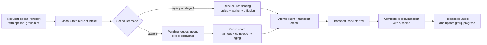

# Summary

Current transport selection is request-local and replica-local. It lacks worker-level balancing, cannot enforce group fairness globally, and conflates transport lease closure with business success.

This design defines a long-term scheduler architecture with a staged rollout:

1. **Stage A (Source-Balance Scheduler)**: improve replica and worker load diffusion within the current request path.
2. **Stage B (Group-Dispatch Scheduler)**: introduce a global pending-request dispatcher that optimizes group completion fairness and tail latency.

A key correction in this design is semantic: **transport completion is lease/counter release, not materialization success**. Group progress is computed from explicit completion outcome, not from "transport completed" rows.

# Current-State Grounding

The current system behavior has five constraints that drive this design:

1. `CompleteReplicaTransport` is called in both materialization success and failure paths.
2. stale in-progress transports are force-completed by Global Store cleanup.
3. transport scheduling is request-local polling plus immediate claim (`request_transport` loop + `find_available_for_transport`).
4. source claim and transport row creation are not one atomic transaction.
5. TP4/TP8 benchmark receiver path is rank-serial inside each receiver process, and one version enforces one resolved `artifact_id` across ranks.

These facts mean current transport records cannot represent "group part success" and current architecture cannot realize global group fairness without a dispatcher.

# Problem Statement

## P1. Semantic Gap

Current `artifact_transports.status=completed` means "lease closed and source concurrency released". It does not mean downstream materialization succeeded.

If group progress is computed from this status, failed transfers, stale routes, and cleanup-expired transfers are miscounted as group progress.

## P2. Topology Gap

Current scheduling happens inside each request loop. Without a global pending queue, fairness floor and completion-biased dispatch are not enforceable at cluster level.

## P3. Reliability Gap

Current request path lacks robust scheduler-grade primitives:

- no request idempotency key for transport request dedupe,
- no strict transaction boundary for claim + transport creation,
- transport repository still has positional `SELECT *` mapping risk under schema evolution.

# Goals and Non-Goals

## Goals

- Separate **transport lease lifecycle** from **materialization outcome** explicitly.
- Improve source utilization by balancing both replica and worker pressure.
- Introduce global group-aware dispatch with fairness floor, completion bias, and starvation aging.
- Keep data path unchanged (RDMA/TCP/CUDA IPC and payload format unchanged).
- Keep backward-compatible behavior when group metadata is absent.
- Roll out in two stages so production risk is bounded and benchmark tuning is incremental.

## Non-Goals

- Changing P2P wire protocol, checksum algorithm, or byte-range mapping format.
- Introducing SDK direct Global Store connectivity.
- Converting this design into a generic distributed queue framework.

# Architecture and Interfaces



## Stage A: Source-Balance Scheduler

Stage A keeps request-local control flow and upgrades source scoring only.

For each eligible source replica:

- `replica_load = current_requests / max_concurrency`
- `worker_load = sum(current_requests on worker) / sum(max_concurrency on worker)`
- `recent_assignment_penalty` from `last_assigned_at`
- `diffusion_bonus` for newly exportable and underused sources

`source_score = w1*replica_load + w2*worker_load + w3*recent_assignment_penalty - w4*diffusion_bonus`

This stage targets source concentration and diffusion utilization without changing dispatch topology.

## Stage B: Group-Dispatch Scheduler

Stage B introduces a global pending request queue and dispatcher.

Dispatch objective:

- fairness floor: every active group gets progress opportunity,
- completion bias: prefer groups closer to completion when spare capacity exists,
- starvation guard: aging bonus for groups with no progress beyond threshold.

This is the first stage that can correctly optimize cluster-level group completion tail.

## Group Contract (v1 Scope)

Group metadata is generic but v1 contract is intentionally constrained:

- key: `(group_kind, group_id, epoch)`
- all parts in one group must target the same `artifact_id` and same requested byte space (`canonical` or same `view_id`)
- `total_parts` is fixed within one `(group_kind, group_id, epoch)`
- `part_id` is unique within the group

Multi-artifact groups are out of v1 scope and reserved for v2+.

## Protocol Changes

### Request Path

```proto
message TransportSchedulingGroup {
  string group_id = 1;
  string group_kind = 2;
  uint32 total_parts = 3;
  string part_id = 4;
  uint32 priority = 5;
  uint64 epoch = 6;
}

message RequestReplicaTransportRequest {
  ...
  TransportSchedulingGroup scheduling_group = 8;
  string requester_worker_id = 9;
  string request_id = 10;
}
```

`request_id` is an idempotency key for transport request dedupe and replay safety.

### Completion Path

```proto
enum TransportCompletionOutcome {
  TRANSPORT_COMPLETION_OUTCOME_UNSPECIFIED = 0;
  TRANSPORT_COMPLETION_OUTCOME_SUCCESS = 1;
  TRANSPORT_COMPLETION_OUTCOME_FAILED = 2;
  TRANSPORT_COMPLETION_OUTCOME_EXPIRED = 3;
  TRANSPORT_COMPLETION_OUTCOME_CANCELLED = 4;
}

message CompleteReplicaTransportRequest {
  string transport_id = 1;
  TransportCompletionOutcome outcome = 2;
  string outcome_detail = 3;
}
```

Group progress uses `outcome=SUCCESS` only.

`FAILED/EXPIRED/CANCELLED` release counters and transport lease, but do not increase group completed parts.

## Scheduler Semantics Invariants

- Transport completion always releases source-side concurrency lease exactly once.
- Group completion is computed from requester-reported success outcomes, not from lease closure.
- If outcome is missing (older client), request is treated as compatibility mode and does not enter group-success accounting.
- Scheduler metadata is additive and cannot alter artifact correctness semantics.

# Schema Changes

## `artifact_transports` extensions

Add nullable columns:

- `request_id` (TEXT)
- `requester_worker_id` (TEXT)
- `group_id` (TEXT)
- `group_kind` (TEXT)
- `group_total_parts` (INTEGER)
- `group_part_id` (TEXT)
- `group_priority` (INTEGER)
- `group_epoch` (BIGINT)
- `completion_outcome` (TEXT)
- `completion_detail` (TEXT)

Add indexes:

- unique index on `request_id` when non-empty
- `(group_kind, group_id, group_epoch, status)`
- `(requester_worker_id, status)`

## Stage B queue table

Add `pending_transport_requests` for dispatcher mode:

- identity: `request_id` (PK)
- routing: `artifact_id`, `requested_view_id`, requester identity
- group metadata (same fields as request)
- state: `enqueued/dispatched/cancelled/expired`
- timestamps: `created_at`, `deadline_at`, `dispatched_at`

Indexes must cover fairness scan and deadline expiration paths.

## Compatibility naming note

`source_node_id/source_address/source_port` are requester-side identity in current request path. They remain for compatibility, but scheduler internals should use requester-oriented naming.

A synchronized `schema.sql` patch is required.

# Configuration and Feature Gating

Scheduler configuration must follow unified runtime config (`tensorcast.config.v1`), with no env-only switches.

Recommended addition in `GlobalStoreConfig.worker_policy`:

- scheduler mode: `LEGACY`, `SOURCE_BALANCE`, `GROUP_DISPATCH`
- score weights (`w1..w4`)
- fairness and aging thresholds
- queue scan and dispatch limits

Rollout must be mode-based, not branch-based.

# Naming Compliance

- **Proto messages**: `TransportSchedulingGroup` (PascalCase), fields snake_case.
- **Proto enum**: `TransportCompletionOutcome` (PascalCase), values `ALL_CAPS`.
- **C++ types**: `TransportSchedulingGroupHint`, `TransportCompletionOutcome` (PascalCase).
- **C++ methods**: `request_replica_transport`, `complete_replica_transport`, `set_transport_scheduling_group` (snake_case).
- **Python models**: `TransportSchedulingGroup` (PascalCase), attributes snake_case.

# Trade-offs and Risks

- Stage B adds complexity (queue state, dispatcher correctness, more metrics).
- Incorrect fairness parameters can hurt large-group latency.
- Queue and score queries can increase DB pressure; indexes and bounded scans are mandatory.
- Mixed-version clients may under-report outcome details; mode gating is required.

# Compatibility and Acceptance Criteria

## Compatibility

- Absent `scheduling_group` means legacy request behavior.
- Absent completion outcome is treated as compatibility mode.
- Mixed-version rollout supports Stage A first; Stage B requires outcome-aware clients for strict group accounting.

## Acceptance Criteria

Quantitative gates (40GB TP4/TP8 baseline first):

- source concentration: top-1 source share reduced by >=20% from baseline.
- source distribution: source HHI reduced by >=25% from baseline.
- group tail: group completion p95 reduced by >=30% from baseline in TP4.
- diffusion: newly exportable source receives first assignment within configured bounded window.
- correctness: no regression in key visibility, final artifact hash checks, or verification paths.
- accounting: failure/expired/cancelled transports do not increase `group_completed_parts`.

# References

- `docs/benchmarks/20260222-weight-publisher-multihost-p2p-report.md`
- `docs/designs/0004-unified-runtime-config.md`
- `docs/designs/0060-tensor-work-queue.md`
- `tensorcast/global_store/repositories/replica_repository.py`
- `tensorcast/global_store/services/transport_service.py`
- `tensorcast/global_store/repositories/transport_repository.py`
- `core/store/materialization/control/materialize_orchestrator.cc`
- `core/store/runtime/ingestion/materialization_facade.cc`
