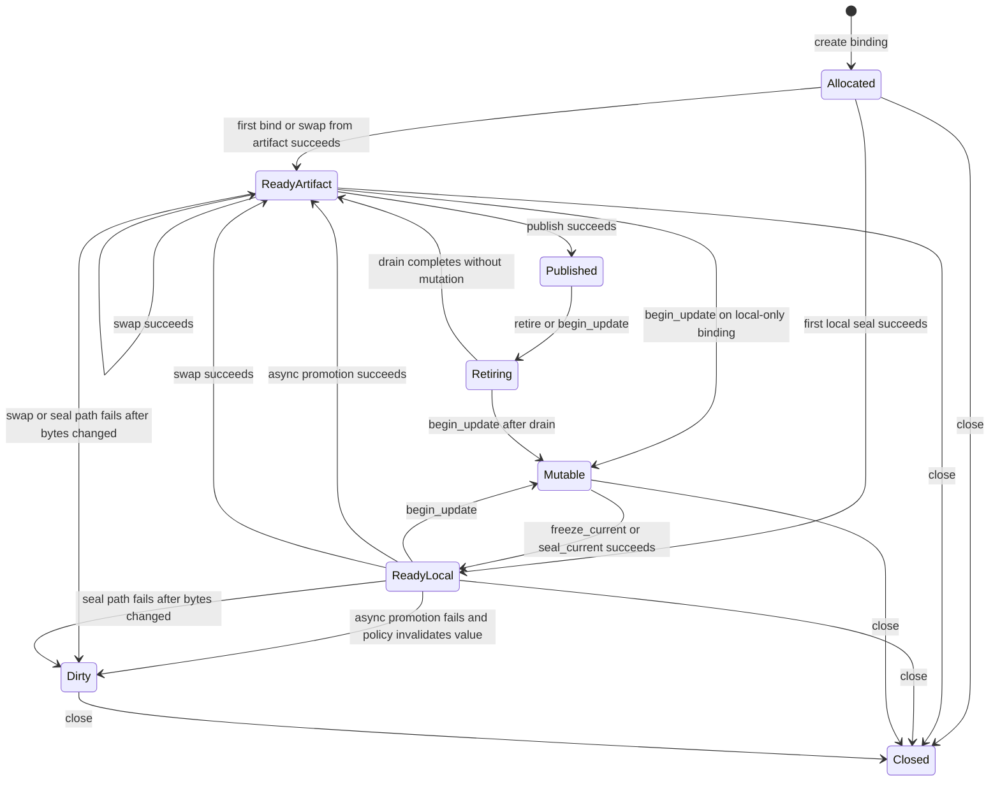

# Summary

Define one canonical **local binding** design for TensorCast.

`Binding` is the stable local weight location. `SealedBindingValue` is the
immutable value currently sealed into that location. The critical correction in
this revision is that a local sealed value is **not automatically a global
artifact**.

The design therefore separates three planes:

- **local binding plane**
  - stable local location
  - mutable window control
  - pointer stability
- **artifact plane**
  - routable artifact ids
  - `ArtifactSelection`
  - publish, key activation, materialization, and retrieval
- **assembly plane**
  - promotion of local sealed values into globally visible artifacts
  - specified in `0085`

Follow-up note:

- `0115` now proposes daemon-attested mounted-source artifacts (`msa1:`) as the
  long-term mounted ingress,
- they are admissible ingress for binding-native realization,
- they may also admit optimistic same-daemon local-ready serving when a typed
  policy and family admission allow it,
- they are artifact identities in the profile sense,
- they keep `msa1:` as the primary mounted identity even when a trusted
  `mi2:` hint is already known,
- but they are not automatically GS-backed, cross-daemon routable, or final
  published `mi2:` identities.

This yields one coherent rule set:

- `swap(...)` installs an existing artifact-backed value into the same stable
  location
- `begin_update(...)` opens a local mutable window after retire/drain
- `freeze_current(...)` closes that window and produces a new immutable
  **binding-local** value without minting a content identity
- `seal_current(...)` is the strict helper that freezes and performs
  identity-forming promotion on the blocking path
- promotion of a locally sealed value into the artifact plane is an explicit
  assembly concern from `0085`, including the single-slot case

After the assembly-side hard cut from `0085` and `0105`, this boundary is
final: local-only sealed values leave the binding plane only through the
assembly attempt domain, never by implicitly minting artifact identity inside
`0084`.

# Goals / Non-Goals

## Goals

- Keep one public `Binding` concept across artifact-seeded owner path,
  artifact-seeded adopt path, layout-first creation, inference reload, and
  training-style update flows.
- Make binding identity depend on the bound local target layout, not on the
  current source artifact.
- Keep one coalesced local weight byte-space per binding.
- Make the distinction between local sealed value identity and global artifact
  identity explicit and enforceable.
- Preserve pointer stability for bound tensors across successful updates.
- Keep publish, retire, drain, and key activation daemon-mediated.
- Reuse existing `ArtifactSelection`, byte-space, publish/retire, and lease
  machinery without inventing a second artifact-routing contract.
- Reserve `layout_id` for the existing Global Store `LayoutSpec` identity and
  stop reusing that name for local binding layout identity.
- Make update epochs explicit so delayed callbacks cannot seal the wrong mutable
  window.

## Non-Goals

- This document does not define distributed multi-binding publish in detail.
  The parent structural direction lives in `0085`, and the executable
  attempt-domain carriers live in `0105`.
- This document does not redefine global `LayoutSpec`.
- This document does not make a local `seal_current(...)` automatically mint a
  globally routable artifact id.
- This document does not define a second artifact-routing or key-mapping plane.
- This document does not require every framework to use meta-device
  initialization; multiple planner frontends remain valid.
- This document does not place optimizer state, gradients, activations, or
  workspaces inside binding-managed slabs.
- This document does not promise a non-blocking `begin_update(...)` in v1.

# Problem Statement

The earlier binding model captured a correct local insight and then overreached
into the global artifact plane.

Correct local insight:

- binding is a stable local location
- training and inference both need pointer-stable replacement at that location

Incorrect extension:

- every sealed local state was implicitly treated as though it already had a
  global artifact identity
- local binding layout identity reused the overloaded name `layout_id`, which in
  the existing repository already means Global Store `LayoutSpec` identity

That extension breaks long-term consistency:

- current publish and key activation are built around artifact-backed
  `ArtifactSelection`
- current selection-first retrieval assumes `artifact_id` and
  `ArtifactSelection` already exist and are authoritative
- current assembly infrastructure already uses `layout_id` for global canonical
  layout contracts

The local binding contract therefore must stay local and explicit:

- local mutation and sealing happen in the binding plane
- artifact routing, key activation, and distributed publish happen only after an
  explicit promotion step in the assembly plane

# Design Principles

## One Name, One Plane

This design makes the following naming rule normative:

- `layout_id` means the content-addressed global `LayoutSpec` id only
- local binding layout identity must use a distinct name: `binding_layout_id`

This is required because the repository already persists `layout_id` in
`layout_specs`, `assembly_layout_bindings`, and post-seal attachments.

## Local Seal Is Not Artifact Promotion

`freeze_current(...)` produces an immutable local value hosted by one binding.
`seal_current(...)` may compose that freeze with strict identity-forming
promotion, but the local freeze itself does **not** by itself create:

- a globally routable `artifact_id`
- a key-mappable version
- a value that can be materialized by unrelated daemons through existing
  artifact APIs

Promotion of a local sealed value into the artifact plane is a separate,
explicit concern. `0085` defines that promotion through the existing
assembly/layout trunk; a single-binding publish is the degenerate one-view case
of the same model. `0105` then hardens the executable attempt-domain carriers
that promotion runs through:

- `AssemblyRequirementSetRef`
- `AssemblyReadinessPolicy`
- `AssemblyCloseoutContract`
- `AssemblyAttemptRecord`
- durable slot occupancy and readiness cut

## Artifact-Backed Values Remain First-Class

The design does not regress current inference flows:

- `Artifact.bind(...)`
- `Artifact.bind_into(...)`
- `Binding.swap(...)`

These continue to produce a current sealed value that is already backed by an
existing artifact and therefore already has authoritative `artifact_id` and
`ArtifactSelection`.

This remains intentionally narrower than mounted metadata-first ingress.
Under the long-term `0115` direction, a daemon-attested mounted-source artifact
(`msa1:`) may already make the current value artifact-backed in the profile
sense while still remaining narrower than a GS-backed or published `mi2:`
artifact. Even when the daemon already knows a trusted `mi2:` hint for the
mounted source, the mounted artifact remains primarily identified by
daemon-session-local `msa1:` until an explicit verify/import/seal promotion
path chooses to adopt `mi2:`.

## One Local Binding, One Coalesced Weight Byte-Space

The intended storage shape for a binding remains one coalesced local weight
byte-space represented as a single logical slab with tensor views.

Reasons:

- minimizes fragmentation and extra model-sized copies
- gives one deterministic local offset space
- matches the current owner-path design already used by `bind()`
- works for both daemon-owned and client-owned storage

# Core Mental Model

## Plane Separation

| Plane | Canonical identities | What it controls | What it must not control |
| --- | --- | --- | --- |
| Local binding plane | `binding_id`, `binding_layout_id`, `binding_value_id`, `seal_generation` | local storage, mutable windows, pointer stability, local current value | global routing, keys, model-family layout contracts |
| Artifact plane | `artifact_id`, `ArtifactSelection`, ByteSpace | publish, key activation, materialization, retrieval | local mutable windows |
| Assembly plane | `attempt_id`, `workspace_assembly_id`, `layout_id`, attempt contract ids from `0085` / `0105` | promotion of sealed local values into globally visible artifacts | local tensor ownership and mutable windows |

## Binding Is Location, `SealedBindingValue` Is Current Local Value

- `Binding` names a stable local target byte-space on one device.
- `SealedBindingValue` names one immutable value currently sealed into that
  location.
- A binding may exist before any sealed value exists.
- A binding in `Mutable` or `Dirty` has no current sealed value.

At any instant, a binding is in exactly one of these categories:

1. **no current sealed value**
   - examples: newly created layout-first binding, `Mutable`, `Dirty`
2. **one current sealed value**
   - the value may be either:
     - **artifact-backed**
     - **local-only**
     - **local-ready pending verification** when an optimistic serving policy
       has admitted same-daemon runtime activation before promotion

## Identity Layers

The local binding plane uses four identities:

- `binding_id`
  - daemon- or process-scoped control identity for the stable local location
- `binding_layout_id`
  - stable identifier derived from `BindingLayout`
- `binding_value_id`
  - identity of one local sealed value hosted by that binding
- `seal_generation`
  - monotonic generation counter for the binding’s current sealed value

The artifact plane remains separate:

- `artifact_id`
  - present only when the current sealed value is backed by an actual artifact
- `selection`
  - present only when artifact-backed routing semantics exist

These identities must not be conflated:

- one binding hosts many local values over time
- two bindings may share a logically equal local layout but remain different
  stable locations
- one local sealed value may or may not have an artifact-backed projection

## Authority Model

The Store Daemon is the sole authority for binding control identity and current
sealed-value identity.

Normative rules:

- `binding_id`, `binding_value_id`, `seal_generation`, and the presence or
  absence of a current sealed value are daemon-authored facts
- successful daemon control-path responses that end in a sealed current value
  must return the authoritative `BindingValue`
- the SDK may cache, mirror, and validate daemon-authored binding state, but it
  must not silently synthesize a replacement `binding_value_id` or current-value
  snapshot when the daemon response is missing one

This rule is required because `0085` / `0105` use
`(binding_id, binding_value_id)` as a durable contributor identity and
mutation-fence anchor.

## State Dimensions

The binding contract has three orthogonal dimensions:

- **value state**
  - `Allocated`, `ReadyArtifact`, `ReadyLocal`, `Mutable`, `Dirty`
- **visibility state**
  - unpublished, published, retiring
- **control state**
  - open, closed

The conceptual state machine below remains valid as an explanatory overlay, but
implementations may expose these dimensions separately rather than forcing one
flattened enum to represent all combinations.

## Current Value Categories

`SealedBindingValue` has three categories:

1. **artifact-backed sealed value**
   - created by artifact-seeded constructors or `swap(...)`
   - has authoritative `artifact_id` and `selection`
   - may use existing publish and key-activation flows
2. **local-only sealed value**
   - created by `seal_current(...)`
   - has no artifact id yet
   - may contribute to assembly in `0085` / `0105`
   - must not use artifact-key publish or retrieval paths directly
3. **local-ready pending-verification value**
   - created by `freeze_current(...)` in an explicitly admitted optimistic
     serving path
   - has a daemon-authored `binding_value_id`, `seal_generation`,
     `local_serving_ref`, source artifact reference, and verification metadata
   - may be used only by same-daemon serving runtime state while
     `verification_state=pending`
   - must not use artifact-key publish, durable key activation, Global Store
     routing, or canonical cache paths until promotion succeeds

This distinction is the main long-term consistency boundary.

# Architecture & Interfaces

## Public Surface

```python
class SealedBindingValue:
    binding_id: str
    binding_layout_id: str
    binding_value_id: str
    seal_generation: int
    source_artifact_id: str | None
    selection: ArtifactSelection | None
    is_artifact_backed: bool
    verification_state: str
    verification_job_id: str | None
    source_artifact_ref: str | None
    local_serving_ref: str | None
    serving_artifact_id: str | None
    is_current: bool
    is_published: bool

    def publish_replica(self, *, ctx: CallContext | None = None) -> None: ...
    def activate_key(
        self,
        key: str,
        *,
        expected_active_artifact_id: str | None = None,
        expected_active_generation: int | None = None,
        ctx: CallContext | None = None,
    ) -> None: ...


class BindingPromotionStatus:
    verification_job_id: str
    binding_id: str
    binding_value_id: str
    state: str
    current_value: SealedBindingValue | None
    serving_artifact_id: str | None
    failure_reason: str | None


class Binding:
    tensors: Mapping[str, torch.Tensor]
    binding_id: str
    binding_layout_id: str
    layout: BindingLayout
    current_value: SealedBindingValue | None
    artifact_id: str | None
    selection: ArtifactSelection | None

    def swap(
        self,
        artifact_or_ref: Artifact | str,
        *,
        publish: bool = False,
        activate_key: str | None = None,
        expected_active_artifact_id: str | None = None,
        expected_active_generation: int | None = None,
        drain_timeout_s: float | None = None,
        ctx: CallContext | None = None,
    ) -> SealedBindingValue: ...

    def begin_update(
        self,
        *,
        wait_events: Sequence[object] | None = None,
        drain_timeout_s: float | None = None,
        ctx: CallContext | None = None,
    ) -> BindingUpdateEpoch: ...

    def seal_current(
        self,
        *,
        update_epoch: BindingUpdateEpoch | str | int,
        wait_events: Sequence[object] | None = None,
        ctx: CallContext | None = None,
    ) -> SealedBindingValue: ...

    def freeze_current(
        self,
        *,
        update_epoch: BindingUpdateEpoch | str | int,
        wait_events: Sequence[object] | None = None,
        ctx: CallContext | None = None,
    ) -> SealedBindingValue: ...

    def start_promote_current_value(
        self,
        *,
        binding_value_id: str | None = None,
        ctx: CallContext | None = None,
    ) -> BindingPromotionStatus: ...

    def get_promotion_status(
        self,
        *,
        verification_job_id: str | None = None,
        binding_value_id: str | None = None,
        ctx: CallContext | None = None,
    ) -> BindingPromotionStatus: ...

    def publish_replica(self, *, ctx: CallContext | None = None) -> SealedBindingValue: ...
    def retire(
        self,
        *,
        drain_timeout_s: float | None = None,
        ctx: CallContext | None = None,
    ) -> None: ...
    def close(self) -> None: ...


class Store:
    def create_binding(
        self,
        layout: BindingLayout,
        *,
        ownership: str = "daemon",
        device: torch.device | str | None = None,
        target_tensors: Mapping[str, torch.Tensor] | None = None,
        mapping: CopyPlan | None = None,
        ctx: CallContext | None = None,
    ) -> Binding: ...


class Artifact:
    def bind(..., publish: bool = False, ctx: CallContext | None = None) -> Binding: ...
    def bind_into(..., publish: bool = False, ctx: CallContext | None = None) -> Binding: ...
```

Important surface rules:

- `Binding.current_value` is the authoritative current local sealed value handle
- `Binding.artifact_id` and `Binding.selection` are convenience mirrors over
  `current_value` and are `None` when the current value is local-only or absent
- `Binding.publish_replica()` is legal only when `current_value` is
  artifact-backed
- `freeze_current(...)` is a mutation fence and local-ready operation; it does
  not mint artifact identity
- `start_promote_current_value(...)` creates or returns an idempotent promotion
  job, but daemon scheduling may delay identity-forming work until critical load
  activity has cleared
- distributed contribution lives on `SealedBindingValue` in `0085`, not on
  mutable `Binding`

## BindingLayout

`BindingLayout` is the declarative description of one local binding’s target
layout:

- ordered tensor descriptors
- alias and tied-weight relationships
- coalesced packing offsets
- local byte-space metadata

It exposes a stable `binding_layout_id`.

`binding_layout_id` must be derived deterministically from the local layout but
must not reuse the name `layout_id`, because `layout_id` is already reserved for
the global `LayoutSpec` identity plane.

## Constructor Families

### 1. Artifact-Seeded Constructors

- `Artifact.bind(...)`
- `Artifact.bind_into(...)`

These create a binding and immediately fill it from an artifact. The resulting
binding starts with an artifact-backed current value.

### 2. Layout-Seeded Constructor

- `Store.create_binding(...)`

This creates a binding from a `BindingLayout` before the first value exists.

Constructor rules:

- `ownership="daemon"`
  - TensorCast allocates the coalesced slab
  - `device` is required
  - `target_tensors` must be absent
- `ownership="client"`
  - caller supplies `target_tensors`
  - `target_tensors` must match `BindingLayout`
  - `device` must be absent or match the supplied tensors exactly
  - `mapping` is optional and only meaningful for mapped or adopted layouts
  - if `mapping` is accepted by the public surface, it must be wired end-to-end
    into the binding’s future overwrite path; unsupported `mapping` must fail
    fast rather than being silently ignored

## `BindingUpdateEpoch`

`BindingUpdateEpoch` is the token returned by `begin_update(...)` and consumed by
`seal_current(...)`.

It exists to make update windows explicit:

- delayed callbacks from an older mutable window must not seal a newer state
- overlapping pipelines must fail cleanly if they race for the same binding
- `0085` must be able to fence stale contributions against sealed value identity

The token is daemon-authored opaque local control identity. It is not artifact
identity.

Normative rules:

- the token must be binding-scoped
- presenting a token for the wrong binding must fail cleanly
- the SDK may wrap the token in `BindingUpdateEpoch`, but must preserve the
  daemon-authored identity rather than reconstructing or normalizing it into a
  weaker local-only form

## Naming Compliance

| Symbol | Kind | Required style | Result |
| --- | --- | --- | --- |
| `Binding` | Python class | `PascalCase` | pass |
| `BindingLayout` | Python class | `PascalCase` | pass |
| `BindingUpdateEpoch` | Python class | `PascalCase` | pass |
| `SealedBindingValue` | Python class | `PascalCase` | pass |
| `binding_layout_id` | Python field | `snake_case` | pass |
| `binding_value_id` | Python field | `snake_case` | pass |
| `Store.create_binding` | Python method | `snake_case` | pass |
| `Binding.begin_update` | Python method | `snake_case` | pass |
| `Binding.seal_current` | Python method | `snake_case` | pass |
| `Binding.swap` | Python method | `snake_case` | pass |
| `Binding.publish_replica` | Python method | `snake_case` | pass |
| `Binding.retire` | Python method | `snake_case` | pass |
| `SealedBindingValue.publish_replica` | Python method | `snake_case` | pass |
| `SealedBindingValue.activate_key` | Python method | `snake_case` | pass |

# Layout Planning and Initialization

## Planning Is Required

A single contiguous binding slab cannot be allocated correctly until the full
local layout is known.

Therefore:

- a naive online storage provider is not sufficient
- the system needs a planning pass that determines the full local tensor layout
  before final allocation or adoption

## Supported Planning Frontends

This design allows multiple frontends that all produce the same `BindingLayout`:

- meta or dry-build frontend
- explicit framework layout planner
- constructor-time external weight injection frontend

The binding protocol must not depend on which planning frontend produced the
layout.

The planner output must also preserve stable canonical tensor naming, ordering,
and local offsets. `0085` / `0105` depend on that stability to compile one
local sealed value into deterministic disjoint contribution views on the
existing assembly/layout trunk without re-planning from live framework objects.

# Artifact Selection, Publishability, and Promotion Boundary

## Artifact Selection Is Optional

For artifact-seeded bindings:

- `current_value.source_artifact_id` and `current_value.selection` are present
  immediately

For layout-seeded bindings and for values returned by `seal_current(...)`:

- `current_value.source_artifact_id` is absent
- `current_value.selection` is absent

This is intentional. `ArtifactSelection` remains the canonical artifact-plane
selection contract from `0078`; it must not be synthesized speculatively for a
local-only value.

## Existing Publish and Key Activation Rules Stay Artifact-Backed

`publish_replica()` and `activate_key(...)` remain legal only for
artifact-backed current values because current publish tokens, key mapping, and
selection validation all assume an existing artifact-backed `ArtifactSelection`.

Therefore:

- `swap(...)` may publish and activate keys as today
- `seal_current(...)` does not make the returned local value immediately
  publishable through the artifact plane
- single-rank training publish must use the explicit one-slot assembly path from
  `0085`, not a binding-local shortcut that silently creates a second artifact
  identity contract

## Assembly Boundary After `0085` / `0105`

The landed assembly direction makes the ownership split explicit:

- `0084` owns local binding identity, mutable-window control, pointer
  stability, and current-value semantics
- `0085` owns the one-trunk parent thesis for distributed binding-backed
  assembly
- `0105` owns the executable attempt-domain carriers and durability model:
  `attempt_id`, `workspace_assembly_id`, `AssemblyRequirementSetRef`,
  readiness policy, closeout contract, readiness cut, and durable slot
  occupancy

Normative rule:

- a local-only `SealedBindingValue` may become globally useful only by entering
  the assembly attempt domain; `Binding` itself does not accumulate attempt
  requirements, slot occupancy state, or closeout semantics
- single-rank publish remains the degenerate `canonical_full` or equivalent
  same-trunk case from `0085` / `0105`, not a binding-local publish shortcut
- local binding APIs may surface the contributor identity needed by assembly,
  but they must not redefine attempt truth or closeout truth

Clarification for builder-hosted serving realization:

- a layout-seeded binding may host the future canonical serving representation
  before any artifact-backed current value exists,
- a later successful assembly / closeout action may upgrade that same current
  sealed value from local-only to artifact-backed without requiring a second
  local byte copy,
- this remains an assembly / closeout transition, not a binding-local publish
  shortcut and not a second artifact-plane truth inside `0084`.

## Wait-Event Barrier

Both `begin_update(...)` and `seal_current(...)` may accept `wait_events`.

This is required for correct GPU semantics:

- TensorCast must wait for framework-issued CUDA work to finish before
  transitioning into or out of the mutable window
- Python call ordering is not proof that device bytes are quiesced

V1 rule:

- `begin_update(...)` is synchronous with respect to visibility exclusion and
  drain completion
- `wait_events` must be honored before the transition RPC is issued; unsupported
  barrier objects must fail with `INVALID_ARGUMENT` rather than being ignored
- a non-blocking variant is deferred until it can return a proper
  `Operation[BindingUpdateEpoch]`

# Lifecycle and State Machine



State meanings:

- `Allocated`
  - layout exists, but no current sealed value exists yet
- `ReadyArtifact`
  - one current sealed value exists and is artifact-backed, but not published
- `ReadyLocal`
  - one current sealed value exists, but it is local-only; it may be
    local-ready for same-daemon serving only when an explicit optimistic policy
    has admitted it and verification state is surfaced
- `Published`
  - the current sealed value is artifact-backed and routable
- `Retiring`
  - current published visibility is draining
- `Mutable`
  - framework may mutate bytes; no current sealed value exists in this state
- `Dirty`
  - bytes changed and there is no known-good current sealed value
- `Closed`
  - control lifetime ended and best-effort cleanup was requested

The implementation must not treat `Dirty` as “old current value plus a dirty
bit”. In `Dirty`, no current sealed value exists.

# Safety Guarantees

## Pointer Stability

A successful `swap(...)`, `freeze_current(...)`, or `seal_current(...)`
guarantees:

- the bound tensors keep the same storage pointers
- `binding_layout_id` is unchanged
- `current_value` changes only after the update succeeds

## One-Current-Value Rule

The binding cannot expose multiple current values at once.

Therefore:

- entering `Mutable` invalidates the binding’s current value
- a later successful `freeze_current(...)`, `seal_current(...)`, or `swap(...)`
  replaces the current value atomically
- entering `Dirty` also invalidates the binding’s current value and clears
  artifact-backed convenience mirrors until a later successful `swap(...)` or
  `seal_current(...)`
- if callers need previous versions to outlive the next mutation, they must be
  retained or promoted elsewhere

## Lifecycle Coherence With Existing Lease Model

Binding control lifetime must integrate with existing daemon lifecycle rules:

- retire and drain stay the visibility exclusion boundary
- owner PID exit or explicit close must retire published visibility and cancel
  any mutable window
- overwrite fencing for contributed local values is rooted in the assembly-side
  mutation-fence authority from `0085` / `0105`: durable slot occupancy plus
  lifecycle-backed liveness, keyed to the current contributor-value identity
- binding overwrite legality must therefore follow daemon authority over
  current `binding_value_id`, live occupancy, and attempt workflow currentness
  rather than any SDK-local approximation

This keeps binding semantics consistent with the repository’s existing
lease/guard/finalizer model rather than inventing a parallel cleanup system.

# Error Model

- `INVALID_ARGUMENT`
  - malformed layout, incompatible constructor arguments, invalid barrier input,
    or invalid publish/key parameters
- `FAILED_PRECONDITION`
  - no current sealed value exists, update epoch mismatch, publish requested for
    a local-only value, owner mismatch, layout invariant drift, or mutation
    requested while live slot occupancy still fences the current
    `binding_value_id`
- `DEADLINE_EXCEEDED`
  - retire or drain wait exceeds the requested budget
- `DATA_LOSS`
  - refill or seal failed after bytes may already have changed; binding
    transitions to `Dirty`
  - successful daemon control-path response is missing the authoritative
    `BindingValue` required by the contract

The dirty rule stays strict:

- once bytes may have changed and the update fails, continuing to treat the old
  value as current is unsafe until a later successful `swap(...)` or
  `seal_current(...)`
- `Binding.current_value`, `Binding.artifact_id`, and `Binding.selection` must
  therefore all become absent in `Dirty`

# Schema Changes

None.

This design requires SDK, daemon, and proto changes, but it does not require new
Global Store persistent tables by itself. Promotion of local sealed values into
the artifact plane is handled by `0085`, and the durable attempt rows used by
that promotion belong to `0105`, not to the local binding plane.

# Alternatives and Rationale

## Reuse `layout_id` For Local Binding Layout Identity

Rejected.

Reasons:

- `layout_id` already names the global content-addressed `LayoutSpec`
- reusing the name would split one identifier across local and global planes
- current schema and coordinator logic already depend on the global meaning

## Let `seal_current(...)` Mint A Default Artifact Id

Rejected.

Reasons:

- current publish and retrieval paths already assume artifact-backed
  `ArtifactSelection`
- silently minting a local-only artifact plane would create a second routing
  contract
- the correct promotion boundary is assembly from `0085` / `0105`

## Put Distributed Contribution Directly On `Binding`

Rejected.

Reasons:

- it conflates stable mutable location with immutable contributor identity
- `Mutable` binding state is not a legal contribution state
- `0085` needs to fence against sealed value identity, not only binding identity

## Preserve Previous Value As Routable During `Mutable`

Rejected.

Reasons:

- once mutation begins, the hosted bytes are no longer safe to route
- the repository’s existing publish and retire flows already assume that source
  visibility closes before overwrite

# Compatibility & Acceptance Criteria

The design is accepted when:

- `Binding` remains the single stable local location abstraction
- `binding_layout_id` replaces local misuse of `layout_id`
- `swap(...)` still preserves existing artifact-backed inference flows
- `freeze_current(...)` produces a local sealed value without silently creating
  a second artifact identity plane; `seal_current(...)` remains the strict
  blocking helper that may additionally promote to artifact-backed identity
- `Binding.artifact_id` and `Binding.selection` are absent when the current value
  is local-only or absent
- publish and key activation remain daemon-mediated and valid only for
  artifact-backed current values
- assembly / closeout may upgrade one local sealed current into an
  artifact-backed current without introducing a second local byte copy or a
  binding-local publish shortcut
- successful create/refill/commit/seal responses return daemon-authored
  authoritative current-value identity rather than relying on SDK synthesis
- `BindingUpdateEpoch` is binding-scoped and wrong-binding token reuse fails
  cleanly
- `Dirty` clears `current_value` and artifact-backed mirrors until a later
  successful overwrite or seal
- `Store.create_binding(..., mapping=...)` is either implemented end-to-end or
  rejected explicitly; it is never silently ignored
- local contiguous slab initialization is expressible without a second
  model-sized persistent weight copy
- mutation fencing for contributed local values is rooted in durable slot
  occupancy plus lifecycle-backed liveness from `0085` / `0105`
- distributed and single-slot promotion of local sealed values is specified in
  `0085` and concretized in `0105` without redefining the local binding
  contract

# References

- `docs/plans/0084-binding-doc-consolidation.md`
- `docs/designs/0085-distributed-binding-assembly-and-coordinator.md`
- `docs/designs/0105-assembly-attempt-hard-cut-spec-runtime-slot-closeout.md`
- `docs/plans/0085-distributed-binding-assembly-and-coordinator.md`
- `docs/plans/0105-assembly-attempt-hard-cut-spec-runtime-slot-closeout.md`
- `docs/guides/steptron-vllm-binding-integration.md`
