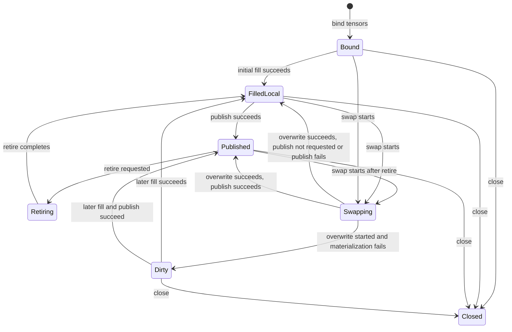
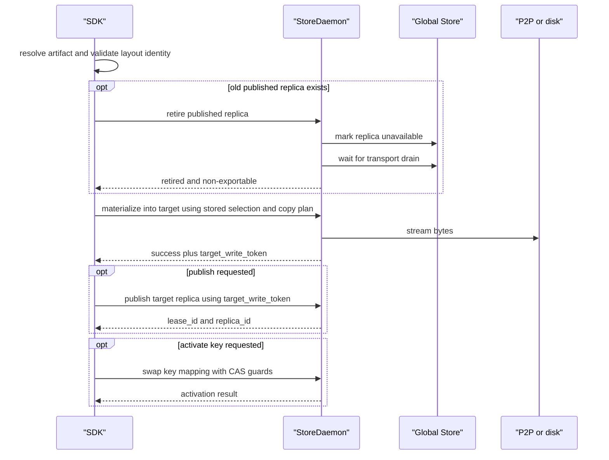

# Summary

Define one canonical design for TensorCast binding.

`Artifact` is the immutable value handle. `Binding` is the mutable location handle
that owns or adopts a stable target layout in CUDA-backed target memory and can be
refilled in place while preserving tensor storage pointers.

This document replaces the earlier split between slot-first inplace swap,
binding-first API design, and mapped binding extension. It captures the current
public contract and the runtime rules that make binding safe:

- one user-facing inplace-update abstraction: `Binding`
- one construction family: `Artifact.bind(...)` and `Artifact.bind_into(...)`
- one public binding capability surface: `mapping` is valid on both constructors
- one primitive external-target write entry point: `bind_into(...)`
- one owner-allocating mapped bind entry point: `bind(..., mapping=...)`
  allocates under bind semantics and uses the same mapped copy-plan model
- one TensorCast-managed serving-buffer model for `bind(...)`: TensorCast owns the
  VRAM and the model process maps borrowed tensor views onto it
- one safe overwrite lifecycle: preflight -> retire/drain -> overwrite ->
  optional publish -> optional activate
- one selection identity model: `ArtifactSelection` plus `ByteSpaceRef`
- one mapped-binding semantic model for trace-driven rename/split/merge plans

# Problem Statement and Scope

TensorCast needs a long-lived, pointer-stable target location for model weights and
other CUDA-backed tensors:

1. allocate or adopt target CUDA storage once
2. fill it from an artifact under explicit constructor ownership semantics
3. later replace the bytes in place without changing `torch.Tensor` storage
   pointers
4. optionally publish the filled target as a routable replica
5. optionally activate a mutable key or alias after the local overwrite succeeds

This design covers:

- the public `Binding` API
- the identity model used by bind, swap, publish, and mapped binding
- publishability rules
- the runtime safety contract around retire, drain, overwrite, publish, and
  activation
- mapped binding for trace-driven copy plans

This design does not redefine the global selection contract, byte-space identity
system, lease framework, or HA retire system. Binding depends on those systems and
profiles them for the inplace-update use case.

# Core Mental Model

## Artifact Is Value, Binding Is Location

- `Artifact` names immutable bytes selected from a canonical artifact or a view.
- `Binding` owns or adopts a stable target location and can mutate what bytes live
  at that location.
- `swap(...)` mutates the binding contents, not the source artifact.

This separation is the key to the whole design. An unbound `Artifact` does not know
where future overwrites should go, so `Artifact.swap(...)` is intentionally not part
of the API.

## Binding Is The Public Surface

The public inplace-update surface is:

- `Artifact.bind(...)`
- `Artifact.bind_into(...)`
- `Binding.swap(...)`
- `Binding.publish_replica(...)`
- `Binding.close()`

`InplaceSlot` remains the internal lifecycle and state-machine implementation. Users
should not need to learn slot-oriented concepts.

## Mapping Is A Binding Option, Not A Separate User Concept

`mapping` is part of the `Binding` construction family, not a separate top-level
abstraction:

- `artifact.bind(device=..., mapping=None, ...)`
- `artifact.bind_into(target_tensors=..., mapping=None, ...)`
- `binding.swap(...)`

Users should not need to reason about a distinct public `MappedBinding` type or a
second inplace-update model. The internal mapped-binding path, copy-plan helpers,
and mapped target RPCs remain implementation details behind `Binding`.

## Binding Owns The Lifecycle For Target Writes

Binding is the lifecycle owner for writes into stable target CUDA memory:

- `bind(...)` is the allocation path: the binding owns the target location it creates
- `bind_into(...)` is the adoption path: the binding attaches to caller-provided
  target storage
- it manages region registration and cleanup
- it persists the captured selection and mapped copy plan
- it handles retire-before-overwrite when a published replica exists
- it tracks dirty state
- it owns the optional publish lease lifecycle
- it performs safe region self-heal when registrations expire or are poisoned

## bind() Is A TensorCast-Managed Serving Buffer

`bind()` is not just "allocate tensors and fill them". Its intended meaning is:

- TensorCast allocates and manages the backing VRAM
- the model process receives shared-memory or CUDA-IPC mapped tensor views
- the model process is a borrower of those tensor views, not the memory owner
- future `swap(...)` calls update the same backing VRAM in place through
  TensorCast-managed control flow

This is the semantic difference between `bind()` and `bind_into(...)`.

# Public API Surface

## User-Facing Types

```python
class Binding:
    tensors: Mapping[str, torch.Tensor]
    artifact_id: str
    selection: ArtifactSelection

    def swap(
        self,
        artifact_or_ref: Artifact | str,
        *,
        publish: bool = False,
        activate_key: str | None = None,
        expected_active_artifact_id: str | None = None,
        expected_active_generation: int | None = None,
        wait: bool = True,
        drain_timeout_s: float | None = None,
        ctx: CallContext | None = None,
    ) -> None: ...

    def publish_replica(self, *, ctx: CallContext | None = None) -> None: ...
    def close(self) -> None: ...
```

Construction APIs:

```python
class Artifact:
    def bind(
        self,
        device: torch.device | str,
        *,
        mapping: CopyPlan | None = None,
        packing: str = "byte_space",
        capacity_bytes: int | None = None,
        publish: bool = False,
        ctx: CallContext | None = None,
    ) -> Binding: ...

    def bind_into(
        self,
        target_tensors: Mapping[str, torch.Tensor],
        *,
        mapping: CopyPlan | None = None,
        packing: str = "byte_space",
        publish: bool = False,
        ctx: CallContext | None = None,
    ) -> Binding: ...
```

## Packing Modes

Binding supports three packing modes:

| `packing` | Meaning | Primary use | Publishability |
| --- | --- | --- | --- |
| `"byte_space"` | place tensors at logical offsets of the selected canonical or view byte-space | default, stable layout identity, routable publish path | publishable only when the selection is routable |
| `"append"` | densely pack tensors in first-request order | local-only quick binding | local-only |
| `"plan"` | densely pack tensors in caller-defined order | local-only stable reorder | local-only |

Mapped binding requires `packing="byte_space"` on both `bind(...)` and
`bind_into(...)`.

## Naming Compliance

| Symbol | Kind | Required style | Result |
| --- | --- | --- | --- |
| `Binding` | Python class | `PascalCase` | pass |
| `Artifact.bind` | Python method | `snake_case` | pass |
| `Artifact.bind_into` | Python method | `snake_case` | pass |
| `Binding.swap` | Python method | `snake_case` | pass |
| `Binding.publish_replica` | Python method | `snake_case` | pass |
| `Binding.close` | Python method | `snake_case` | pass |
| `Range` | Python dataclass | `PascalCase` | pass |
| `CopyPlanEntry` | Python dataclass | `PascalCase` | pass |

# Selection, ByteSpace, and Publishability

## Binding Uses ArtifactSelection As Its Identity Envelope

Every binding is anchored in one `ArtifactSelection`.

For binding, the important fields are:

- `artifact_id`: immutable content identity of the source artifact
- `view_id`: stable id for a routable non-identity view, or a stable mapped view id
- `tensor_names`: ordered packed stream when a subset or custom order is active
- `view_subset_hash`: order-independent membership hash over sorted unique
  `tensor_names`
- `logical_layout_hash`: identity of the selected logical byte-space layout
- `selection_hash`: identity of the chosen subset/view semantics

Binding captures this selection once at construction time and requires future
swaps to resolve to the same layout and selection identity.

## ByteSpaceRef

Publish and retire operate against a `ByteSpaceRef`:

- canonical byte-space: `CANONICAL`
- view byte-space: `VIEW(view_id)`

Binding never publishes or retires an implicit unnamed byte-space. Routing identity
must be explicit.

## What The Two Hashes Mean

- `logical_layout_hash` identifies the logical byte-space layout that the binding
  promises to preserve across swaps.
- `selection_hash` identifies which logical selection was written into that layout.

Neither hash may depend on physical bindings such as region ids, VRAM pointers,
buffer handles, or device-local export state.

## Selection Captured Once

Selection capture is a core promise of binding:

- `artifact.subset(...).view(...).bind(...)` captures the rank-local contract once
- later `binding.swap("model:v2")` applies the same contract to the new artifact
- callers must rebind instead of restating slices or names when the layout contract
  changes

For mapped binding, the same rule extends to the copy plan:

- `bind(..., mapping=copy_plan)` and `bind_into(..., mapping=copy_plan)` capture
  the plan once
- later `binding.swap("model:v2")` accepts only the new artifact reference
- callers do not restate `mapping`, `subset`, or `view` on swap

## Publishability Profile

Binding supports three publishability classes:

1. Canonical full coverage
   - `view_id == ""`
   - `tensor_names == []`
   - `view_subset_hash == b""`
   - publishable as canonical byte-space

2. View full coverage
   - stable non-empty `view_id`
   - `tensor_names == []`
   - `view_subset_hash == b""`
   - publishable as `VIEW(view_id)`

3. Stable mapped view
   - non-empty mapped `view_id`
   - target layout identity and copy plan are stable
   - publishable as `VIEW(mapped_view_id)`

The following remain local-only:

- append-packed bindings
- plan-packed bindings
- subset-packed or reordered bindings without a stable routable `view_id`

This keeps routing semantics honest. A local packed layout must not be published as
if it were canonical full coverage.

# Binding Lifecycle and State Machine



State meanings:

- `Bound`: stable tensors exist, but bytes are not yet known-good
- `FilledLocal`: bytes match the current binding selection, but the result is local-only
- `Published`: bytes match the current selection and the binding has an active routable replica lease
- `Dirty`: overwrite began and failed; bytes are undefined until a later successful refill
- `Closed`: regions and best-effort published state cleanup have been released

# Construction Flows

## Artifact.bind(...)

`Artifact.bind(...)` is the allocation path for `Binding`.

When `mapping is None`:

1. resolve the artifact selection
2. allocate owned target tensors matching the selected layout
3. materialize into that owned target location
4. return the resulting `Binding`

When `mapping is not None`:

1. resolve the artifact selection
2. validate that the mapping belongs to the allocation-inferable subset
3. infer destination tensor specs from source selection plus mapping
4. allocate the owned destination tensors on the requested device through the
   bind owner path
5. materialize through the owner-path mapped-binding pipeline
6. return the resulting `Binding`

Here, "allocate" means `bind(...)` is responsible for creating and owning the
target location promised by the API. In the owner-path design, the daemon is the
allocator and memory owner, and the SDK maps exported handles into tensors while
`Binding` owns the control lifecycle.

`bind(..., mapping=...)` must not silently fall back to the unmapped path,
silently degrade into `bind_into(...)`, or silently relax layout-inference rules.
If the mapping is not allocation-inferable under bind semantics, the call fails.

## Artifact.bind_into(...)

`Artifact.bind_into(...)` adopts caller-owned target tensors:

1. validate the tensors are CUDA, writable, contiguous where required, and on one device
2. require that the target memory is user-owned and exportable from the current process
3. register one or more VRAM regions over the target storages
4. build the region-backed target layout
5. issue one materialization RPC
6. return a `Binding` that can later swap in place

`bind_into(...)` must not silently accept daemon-owned CUDA IPC imports as future
swap targets. If the memory is not user-owned, the call fails.

`bind_into(...)` remains the explicit-target primitive. Any future binding mode
that writes into caller-provided CUDA memory must reduce to `bind_into(...)` plus
the shared binding lifecycle rules.

## One Shared External-Target Write Policy

Binding unifies all target-write paths under one policy surface:

- `Artifact.bind(...)`
- `Artifact.bind_into(...)`
- `Binding.swap(...)`
- region-backed write paths that stream directly into caller memory

The rules for selection validation, region retry, publish token handling, and dirty
semantics must not fork across these paths. Constructor semantics stay explicit:
`bind(...)` allocates, `bind_into(...)` adopts, and requests never silently switch
between those modes.

The internal write pipelines may differ:

- `bind_into(...)` uses explicit-target region-backed materialization
- `bind(...)` may use a daemon-owned binding registry and owner-path RPCs

Public lifecycle guarantees must still match across both constructors.

# Swap Flow and Safety Guarantees

## Safe Swap Contract

A successful `swap(...)` guarantees:

- the target tensors keep the same storage pointers
- the new artifact resolves to the same binding layout identity
- the stored selection envelope and stored copy plan, if any, are replayed
  without the caller restating them
- if an old published replica exists, it becomes non-exportable before overwrite
  begins
- the target bytes match the new binding selection after overwrite completes
- if `publish=True`, the new bytes are published after overwrite succeeds
- if `activate_key=...`, activation happens only after the local binding reaches its
  requested post-swap state

## Swap Sequence



## Drain And Retire Rules

Binding relies on the daemon and Global Store safe-retire model:

- published replicas must stop accepting new transports before overwrite
- in-flight transports must drain before overwrite
- retire is byte-space aware
- drain timeout must fail the swap before any overwrite begins

Binding is not a local compute quiescing mechanism. Callers still must ensure the
model is not being read or mutated locally while overwrite is in progress.

# Publish, Activation, and Ownership Rules

## Publish Means Routable Replica, Not New Artifact

`binding.publish_replica()` and `swap(..., publish=True)` do not register a new
artifact. They publish the already-written bound target as a routable memory
replica for the binding's current artifact and byte-space identity.

## Publish Requires A Daemon-Minted target_write_token

To avoid re-hashing client VRAM on publish:

- the daemon mints a `target_write_token` after a successful target materialization
- publish must present that token back to the daemon
- the daemon validates the token against the written selection and target ownership
- the daemon rejects stale or incompatible tokens

This preserves integrity for cooperative clients while keeping publish single-pass.

## Activation Uses Daemon-Mediated Key Swap

When `activate_key` is provided:

- activation is a daemon-mediated key operation, never a direct SDK-to-GS call
- activation runs after the local overwrite succeeds
- CAS guards may use `expected_active_artifact_id` and/or
  `expected_active_generation`
- alias keys should resolve with server-driven `cache_ttl_seconds=0`

Activation is a control-plane action layered on top of local binding success. It is
not a substitute for publish and does not change artifact immutability.

## Ownership Model

Binding supports two ownership modes:

- `bind(...)`: the binding owns the allocation path and returns daemon-owned
  target storage mapped into SDK tensors
- `bind_into(...)`: the caller owns the target memory and the binding adopts it
- the daemon owns the write token, publication authority, and routing-side metadata
- publish is a while-alive capability, not durable storage

For `bind(...)`, daemon ownership remains hidden behind the `Binding` contract and
must not change the pointer-stable swap semantics exposed to the caller.

# Mapped Binding

## Motivation

Mapped binding extends ordinary name-aligned binding to trace-driven reloads where
the load semantics are discovered once and then reused:

- source and destination tensor names can differ
- one source tensor can be split into many destinations
- many sources can be merged into one destination
- TP or framework-specific slicing can be encoded once and replayed on future swaps

This is the intended path for vLLM-style traced weight loading without Python copy
loops.

## Mapping Is First-Class On Binding Construction

Mapped binding is still part of the `Binding` API family:

- `bind_into(..., mapping=...)` is the primitive for explicit target layouts
- `bind(..., mapping=...)` is the allocate-first convenience for inferable target
  layouts

The user-facing concept stays `Binding`. The mapped materialization path remains an
internal execution choice, and constructor ownership semantics stay intact.

## Full Artifact Id In, Rank-Local Partial Layout Out

Binding captures a replay contract at construction time:

- source selection envelope:
  subset membership/order, view identity or view spec, and selection hashes
- destination layout identity:
  the layout that the binding promises to preserve across swaps
- optional mapped copy plan:
  the source-to-destination transformation used for mapped binding

Because that contract is persisted on the binding, future `swap(...)` calls only
need a new full artifact reference such as an artifact id or key. TensorCast must:

- resolve that full artifact reference
- reapply the stored selection envelope to find the correct partial source bytes
- reapply the stored copy plan, if present
- refill the exact same target layout in place

This is especially important for tensor-parallel serving, where each rank binds a
partial view once and later swaps by full artifact id only.

## Copy Plan Model

Mapped binding uses a copy plan:

```python
@dataclass(frozen=True)
class Range:
    dim: int
    start: int
    end: int

@dataclass(frozen=True)
class CopyPlanEntry:
    ckpt_name: str
    ckpt_range: Range | None
    dst_name: str
    dst_range: Range | None
```

The plan is persisted on the binding and reused on `swap(...)`.

## Coordinate System

Copy-plan ranges are expressed in canonical artifact coordinates.

If the source artifact handle carries a view, binding must translate from canonical
coordinates into the view materialization coordinates internally. Callers should not
rewrite the plan for each bind or swap.

## Mapped Binding Constraints

Mapped binding v1 requires:

- `packing="byte_space"`
- CUDA target tensors only
- contiguous targets with `storage_offset == 0`
- a single device for all targets
- full destination coverage with no gaps or overlaps
- narrow-only view compatibility for mapped source views
- transpose or permutation views rejected

## Allocation-Inferable Mapping Subset For bind(...)

`bind(..., mapping=...)` is intentionally stricter than
`bind_into(..., mapping=...)`.

`mapping` alone does not fully describe an arbitrary destination allocation.
`bind(...)` therefore accepts only the subset where TensorCast can derive one
unambiguous destination tensor layout for every `dst_name`.

The allocation-inferable subset requires:

- every destination tensor has one unambiguous `dtype`
- every destination tensor has one unambiguous rank and one shared non-sliced
  shape profile across all contributing source fragments
- every destination tensor uses one logical slice dimension for the mapping plan
- destination coverage is total and gap-free, so the final extent on the sliced
  dimension is exact rather than a lower bound
- the inferred destination layout is contiguous with `storage_offset == 0` and
  compact stride
- the inferred allocation uses the caller-provided `device`; no per-tensor device
  overrides exist

If any part of destination allocation remains ambiguous, `bind(..., mapping=...)`
fails fast and instructs the caller to use `bind_into(...)` with explicit target
tensors.

Representative rejection cases:

- the desired destination stride is non-contiguous or otherwise custom
- contributing source fragments disagree on non-sliced extents or `dtype`
- the mapping would require reshape, permutation, or an under-specified storage
  contract
- the plan describes only a source-to-destination correspondence but not one
  unique allocation

## Stable Mapped View Identity

Mapped binding derives a stable view identity from:

- canonical index identity
- source view identity, if any
- copy plan contents
- destination layout identity

That derived `mapped_view_id` is the publish and routing identity for mapped
bindings. Mapped binding must not pretend to be canonical full coverage when it is
actually a different byte-space.

## Mapped Binding Runtime Path

Mapped binding executes through the mapped target materialization RPC rather than
ordinary name-aligned target materialization:

- `bind_into(..., mapping=...)` is the explicit-target primitive validation and
  materialization path
- `bind(..., mapping=...)` first infers and allocates an owned target layout, then
  uses the bind owner-path daemon pipeline
- target materialization executes inside the daemon pipeline
- future `swap(...)` reuses the same stored plan and stable mapped view identity
- explicit-target and owner-path bindings may use different internal daemon RPCs
  or registries
- no implicit constructor fallback or public binding subtype is introduced for
  the mapped bind path

# Runtime Contracts

## Pointers Are Stable, Region IDs Are Not

The stable contract is tensor storage identity, not region registration identity.

- tensor pointers must remain stable across swap
- region ids are renewable capabilities
- binding may re-register regions and retry once on safe region failures

## TTL Policy

Binding uses two important TTL defaults:

- binding-managed VRAM regions default to `ttl_ms=0`
- published binding leases default to `ttl_ms=0`

`ttl_ms=0` means lifecycle is driven by explicit retire, explicit close, and PID-exit
cleanup rather than silent expiry during long-lived serving.

If a non-zero TTL is used:

- published leases require keepalive
- region registrations require renewal or must tolerate self-heal retry

## operation_id Propagation

Binding operations span multiple RPCs. One logical operation should carry one
`operation_id` across retire, materialize, publish, and activate so logs and metrics
can be correlated end to end.

# Failure Model

## Dirty Semantics

Binding failures are intentionally non-atomic:

- if overwrite begins and materialization fails, the binding becomes `Dirty`
- a dirty binding must not publish until a later successful refill
- publish failure after a successful overwrite leaves bytes correct but local-only

## Fail-Fast Cases

Binding must fail before overwrite when:

- the new artifact resolves to a different layout identity
- selection order, subset semantics, or view identity no longer match the binding
- mapped binding detects shape, dtype, or range incompatibilities
- publish is requested for a non-routable selection
- retire drain times out

## Error Classes

Representative errors:

- `INVALID_ARGUMENT`: malformed mapping, invalid slice, duplicate names, invalid view
- `FAILED_PRECONDITION`: non-user-owned target memory, non-publishable selection,
  stale runtime state, region/token preconditions not satisfied
- `DEADLINE_EXCEEDED`: retire or publish waits exceed deadline
- `DATA_LOSS`: overwrite started and materialization failed, or daemon returned an
  invalid target-write result

# Typical Usage Patterns

## Meta-Init And Future Swap

```python
binding = tc.artifact("model:v1").bind(device="cuda:0")
for name, param in model.named_parameters():
    param.data = binding.tensors[name]
binding.swap("model:v2")
```

## Fill Pre-Allocated Model Buffers

```python
binding = tc.artifact("model:v1").bind_into(
    {name: param.data for name, param in model.named_parameters()}
)
binding.swap("model:v2")
```

## Rank-Local Tensor-Parallel Selection

```python
binding = (
    tc.artifact("model:v1")
    .subset(materialize_names)
    .view(slices=rank_slices)
    .bind(device="cuda:0")
)
binding.swap("model:v2")
```

## Allocate Serving Layout From Mapping

```python
binding = (
    tc.artifact("model:v1")
    .subset(materialize_names)
    .view(slices=src_hull)
    .bind(device="cuda:0", mapping=copy_plan)
)
binding.swap("model:v2")
```

## Tensor-Parallel Serving Profile

For tensor-parallel serving, the intended construction pattern is one binding per
rank-local layout:

- each rank calls `artifact.subset(...).view(...).bind(...)` or
  `artifact.subset(...).view(...).bind(mapping=...)`
- TensorCast owns the rank-local VRAM for each binding created via `bind(...)`
- the model process maps rank-local tensor views from TensorCast-managed VRAM
- later `binding.swap(full_artifact_id)` replays the captured rank-local partial
  selection and optional mapping without restating either

This profile is strong when:

- the TP degree and rank-local layout stay stable across versions
- the caller wants pointer-stable model parameters backed by TensorCast-managed
  VRAM
- updates should be applied in place without Python copy loops

When the TP degree or rank-local layout contract changes, callers should create a
new binding instead of swapping through the old one.

## vLLM-Style Mapped Reload

```python
binding = (
    tc.artifact("model:v1")
    .subset(materialize_names)
    .view(slices=src_hull)
    .bind_into(dst_tensors, mapping=copy_plan)
)
binding.swap("model:v2")
```

# Non-Goals and Boundaries

This design does not:

- make local compute concurrent with overwrite safe
- redefine artifact immutability
- allow daemon-owned CUDA imports to become inplace binding targets
- make every packed local layout routable
- replace the system-wide `ArtifactSelection` contract
- replace the system-wide lease or safe-retire framework

# Schema Changes

None. Binding documentation consolidation does not change `schema.sql`.

# Trade-offs and Risks

- Binding is inherently non-atomic once overwrite begins.
- Publish of bound target memory relies on a cooperative client/daemon model and
  a daemon write token instead of full publish-time re-hash.
- Mapped binding adds significant validation and identity complexity, but that
  complexity is preferable to re-running Python copy logic or exposing divergent
  swap semantics.
- `bind(..., mapping=...)` intentionally rejects mappings that do not uniquely
  determine destination allocation and never silently falls back; callers needing
  custom layout control must use `bind_into(...)`.
- Tensor-parallel hot reload remains a per-binding local guarantee; cross-rank
  cutover still requires external coordination if the application needs global
  synchronization.
- Keeping publishability strict can make some local layouts non-routable, but it
  preserves honest routing semantics.

# Compatibility and Acceptance Criteria

Compatibility policy:

- `Binding` is the only public inplace-update abstraction.
- `InplaceSlot` remains internal implementation detail.
- `mapping` is a first-class binding capability on both `bind(...)` and
  `bind_into(...)`.
- `bind_into(..., mapping=...)` remains the explicit-target mapped-binding
  primitive.
- `bind(..., mapping=...)` is the owner-allocating mapped-binding entry point.
- owner-path and explicit-target bindings may use different internal daemon
  pipelines while preserving one public `Binding` contract.
- no implicit fallback is allowed between `bind(...)`, `bind_into(...)`, mapped,
  and unmapped binding modes.

Acceptance criteria:

1. `Artifact.bind(...)` and `Artifact.bind_into(...)` return pointer-stable
   `Binding` objects backed by stable CUDA target storage under their respective
   ownership modes.
2. For `bind(...)`, TensorCast owns and manages the backing VRAM; the model
   process observes borrowed mapped tensor views onto that VRAM.
3. `artifact.subset(...).view(...).bind(...).swap(...)` reuses the captured
   selection without restating it.
4. `bind_into(..., mapping=copy_plan)` stores the mapping and reuses it on
   `swap(...)`.
5. `bind(..., mapping=copy_plan)` allocates owned destination tensors only when
   the mapping uniquely determines destination layout, then uses the bind
   owner-path mapped-binding pipeline.
6. `bind(..., mapping=copy_plan)` rejects ambiguous or custom-layout mappings and
   never silently falls back to another binding mode; it directs callers to
   `bind_into(...)`.
7. `swap(...)` never requires the caller to restate `mapping`; the binding reuses
   the plan captured at bind time.
8. `swap(full_artifact_id)` replays the stored selection envelope and, if
   present, the stored copy plan to find the correct partial source bytes inside
   the full artifact.
9. Publishability checks reject local-only packed layouts and accept canonical,
   stable view, and stable mapped-view identities.
10. Swap retires any published old replica before overwrite begins.
11. Overwrite failure marks the binding dirty; publish failure leaves bytes correct
   but local-only.
12. Binding tolerates safe region self-heal by re-registering regions and retrying
   once.
13. Activation remains daemon-mediated and supports compare-and-set guards.

# References

- `docs/designs/0039-artifact-first-sdk.md`
- `docs/designs/0055-programmable-framework.md`
- `docs/designs/0062-safetensors-canonical-bytespace.md`
- `docs/designs/0078-selection-first-artifact-retrieval.md`
- `docs/designs/0079-local-daemon-key-mapping-without-global-store.md`
- `docs/designs/0011-unified-session-lifecycle-leases.md`
- `docs/designs/0048-ha-replica-visibility-and-retire.md`
- `docs/internals/model-loading.md`
- `tensorcast/api/store/README.md`
