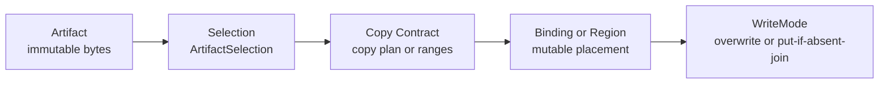
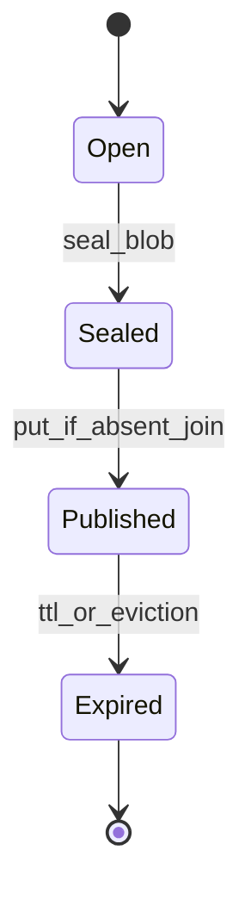

# Summary

TensorCast should not maintain separate core abstractions for weight loading and KV-cache movement.
In core, both reduce to the same artifact model:

- immutable bytes (`Artifact`) as the value layer,
- mutable memory location (`Binding`/region) as the placement layer,
- deterministic copy contract (`CopyPlan`/ranges) as the write contract,
- a write mode (`WriteMode`) that defines overwrite vs join semantics.

Paged KV is a motivating integration, but **core concepts and core APIs must not be KV-specific**.
KV blocks are modeled as a generic **cache blob artifact profile** (a single opaque `uint8` blob with invariants),
so the same runtime supports:

- weight swap (`OVERWRITE`),
- cache blob publication (`PUT_IF_ABSENT_JOIN`),
- batch-first region IO with VRAM-first fast paths (and host staging fallback).

The purpose is to unify semantics and keep long-term performance ceilings high while preserving framework-specific logic
(paged attention virtual table, token->key mapping) in engine adapters, not TensorCast core.

# Current-State Grounding

- `0063` established `Binding` as the mutable lifecycle owner and `Artifact` as immutable value.
- `0070` established mapped binding through `bind_into(..., mapping=...)`.
- Region-backed materialization already supports direct writes into registered CUDA regions.
- `0078` establishes `ArtifactSelection` as the single selection contract for retrieval/materialization.
- `0056` introduces engine integration and plan aliasing, but KV/cache blob **data semantics** must converge here.
- `CGID` suffix grammar allows only `[-._~A-Za-z0-9]`; encodings that include `:` are invalid.
- `0017` defines generic `cgid:` persistence through GS artifact/replica catalogs; this design introduces a required
  namespace-profile override for `cgid:cache_blob~...` to avoid GS hot-path explosion.

# Goals / Non-Goals

Goals

- Unify weights and high-cardinality cache blobs under one core object model and one IO primitive set.
- Keep TensorCast core framework-semantics-free (no paged-attention-specific core object types).
- Define a first-class **blob sealing** boundary (`open` -> `sealed`) to preserve correctness for cache publication.
- Guarantee that high-cardinality KV paths are batch-first and zero-copy-first.
- Keep vLLM/SGLang integration ergonomic through aliases and adapter contracts.

Non-Goals

- Move token->block mapping or block-table ownership into TensorCast core.
- Introduce a second materialization stack for KV.
- Make KV durable storage equivalent to model artifact durability.

# Architecture and Interfaces

## 1. Unified runtime model

Normative model:

- `Artifact`: immutable bytes plus selection identity (`ArtifactSelection`).
- `Binding`/region: mutable placement (destination memory) that can be overwritten safely.
- Copy contract: canonical-coordinate copy plan/ranges (weight mapping, or blob write ranges).
- `WriteMode` chooses overwrite vs join semantics. It must not introduce a new object type.

## 2. Artifact profiles (core must remain domain-neutral)

TensorCast supports multiple **artifact profiles** without introducing domain-specific core concepts.

### 2.1 TensorDict artifacts (baseline)

- Represent a tensor dictionary with canonical index bytes.
- Support views and subsets via `ArtifactSelection` (see `0078`).
- Commonly used for weights/checkpoints and other structured artifacts.

### 2.2 Cache blob artifacts (opaque, high-cardinality)

A cache blob artifact is a generic profile used for high-cardinality caches (paged KV motivating case) where:

- metadata must not become a Global Store hot path,
- selection identity must be derivable without GS catalog lookups,
- IO must be batch-first and per-item outcome-first.

Contract (required):

- Schema: exactly one tensor named `blob`
  - `blob.dtype == uint8`
  - `blob.shape == [byte_length]`
- Selection: canonical-only + full-selection-only
  - `Artifact.view(...)` and non-identity view specs MUST be rejected for cache blob artifacts.
  - subset selection MUST be rejected (except optional compatibility normalization of `["blob"]` to full selection).
  - cache blob selection identity MUST NOT require byte length or payload digest.
  - resolved selection shape for this profile MUST be:
    - `view_id == ""`,
    - `view_spec` absent,
    - `tensor_names` omitted (or input `["blob"]` normalized away),
    - `view_subset_hash` empty.

Selection identity for cache blob artifacts (required):

- `logical_layout_hash = sha256(utf8("tensorcast.cache_blob.layout.v1\\n")).digest()`
- `selection_hash = sha256(utf8("tensorcast.cache_blob.selection.v1\\n")).digest()`

These are profile-fixed digests used only for cache blob artifacts.

Enforcement (required):

- SDK and daemon MUST share one profile helper for deriving/validating the fixed digests and resolved selection shape.
- daemon MUST validate incoming cache blob selections against this profile and return a normalized resolved selection in
  responses.

## 3. Write modes (semantics, not object types)

- `OVERWRITE` (binding swap):
  - used by weight swap and inplace updates.
  - pointer stability and binding Dirty semantics follow `0063`.
- `PUT_IF_ABSENT_JOIN` (cache publish):
  - used by sealed cache blob artifacts.
  - first write establishes invariants; subsequent writes must join if invariants match, otherwise fail fast.

## 4. Sealing lifecycle (adapter-owned, core-enforced)

Cache publication requires a hard boundary between mutable engine state and immutable bytes.

- `Open`: engine-owned mutable state. Not publishable.
- `Sealed`: immutable bytes snapshot plus invariants. Publishable.
- `Published`: routable cache blob artifact in a cache blob CGID namespace.

Only `Sealed` blobs may enter TensorCast publish paths.

## 5. Invariants for `PUT_IF_ABSENT_JOIN` (JoinIfMatch)

To keep core domain-neutral, invariants are expressed as a generic blob contract.

Required invariant tuple for join:

- `layout_id` (layout/version discriminator; KV layout hash is one instance of this)
- `byte_length`
- `payload_digest_alg = "sha256"`
- `payload_digest_hex = sha256(blob_bytes).hexdigest()` (lowercase hex)

TTL rule (required):

- TTL updates are monotonic-increasing:
  - `expires_at = max(expires_at, now + ttl_ms)`
- If a `PUT_IF_ABSENT_JOIN` request includes `ttl_ms`, a successful `join` SHOULD apply the same monotonic TTL bump as a
  successful first write.

## 6. Identity and encoding contract (CGID segments)

Cache blob identity is **client-generated** and must be parseable and validation-safe across languages.

Recommended cache blob identity profile:

`cgid:cache_blob~<namespace>~<engine>~<model_id_enc>~<layout_id>~<engine_key_enc>`

Required rules:

- The full suffix after `cgid:` MUST satisfy the shared CGID suffix grammar (`[-._~A-Za-z0-9]` only).
- Segments are separated by `~`. Each segment MUST be delimiter-safe (MUST NOT contain `~`, `|`, or newlines).
- Recommended encoding for arbitrary bytes/strings:
  - `b64u.<base64url_nopad(raw_bytes)>`
  - avoid `:` delimiters to keep IDs valid (the CGID suffix grammar rejects `:`).
- `model_id` often contains `/` and other invalid characters; prefer `model_id_enc = b64u.<...>` for correctness.
- Python and C++ MUST share one helper and one test-vector set for parse/encode/decode/validation.
- `validate_client_generated_id` length limits apply to cache blob ids as well; adapters MUST maintain a length budget
  for encoded segments and use collision-safe hashing when raw components would exceed limits.

Namespace-profile override over generic CGID behavior (required):

- For `artifact_id` in the `cgid:cache_blob~...` namespace:
  - MUST NOT be inserted into GS per-blob artifact/replica catalogs,
  - MUST NOT use GS per-blob existence/replica lookups as authority,
  - MUST use shard-home routing + fenced home authority as defined in this document.
- This is a namespace-scoped override to the generic `cgid:` behavior in `0017`, not a global override for all `cgid:`.

## 7. Batch IO layers (required, batch-first)

Cache blob IO has two distinct RPC layers that MUST remain separate.

### 7.1 External-target front-door (caller or instance-agent -> local daemon)

Core primitives (daemon/runtime contract), expressed in artifact terms:

- `batch_exists(selections[]) -> per_item_outcome`
- `batch_get_into_region(selections[], dst_layout, source_mode) -> per_item_outcome`
- `batch_put_if_absent_from_region(items[], src_layout, invariants, ttl_ms?) -> per_item_outcome`
- `batch_touch_ttl(artifact_ids[], ttl_ms) -> per_item_outcome`

Rules:

- Batch-first: high-cardinality cache paths MUST not degrade into per-item RPC loops.
- Outcome-first error model (required):
  - cache misses and backend unavailability MUST be represented as per-item outcomes (not RPC-level failure) so callers
    can degrade to recompute/prefill.
  - invariant mismatch on join MUST fail fast with `FAILED_PRECONDITION`.
- External-target safety (required):
  - any RPC that writes into caller-owned regions MUST be loopback/UDS only (same safety boundary as
    `MaterializeIntoTarget`).
- Payload transport (required):
  - above `inline_threshold_bytes`, payload MUST NOT be inlined in gRPC messages.
  - payload movement MUST reuse TensorCast’s data plane (P2P/VRAM-first), with host staging as fallback.

### 7.2 Home-scoped fenced batch (daemon -> shard home daemon)

For routed cache blob authority operations, daemons MUST use home-scoped fenced batch RPCs (names TBD in proto; `0056`
uses `CacheBlobBatch*` as the reference naming), and MUST:

- include `{shard_id, lease_generation}` fencing on every home-scoped request,
- route payloads above threshold via `payload_ref` + data plane transport (no large inline bytes),
- avoid any assumption that a remote home daemon can write directly into caller-owned CUDA regions.

## 8. Authority and routing for cache blob artifacts (required)

Cache blob artifacts are high-cardinality and must not use Global Store as a per-blob catalog.

Normative authority split:

- Global Store is the authority for **shard leases** only (low cardinality).
- The **shard home daemon** (for the current `lease_generation`) is the authority for:
  - exists truth,
  - first-writer invariants (JoinIfMatch),
  - TTL governance.

Sharding (required):

- Derive a stable shard id from blob identity:
  - `shard_id = hash64(utf8(artifact_id)) % S`
  - `S` is a fixed shard count (recommended default: `S = 4096`; configurable).
- `hash64` MUST be specified and stable across languages. Recommended:
  - compute `sha256(utf8(artifact_id)).digest()`,
  - take the first 8 bytes and interpret as little-endian `uint64`.

Fencing (required):

- All home-scoped cache blob operations MUST be fenced by `{shard_id, lease_generation}`.
- If request `{shard_id, lease_generation}` does not match the home’s current generation:
  - return `FAILED_PRECONDITION` and include redirect info (new holder id and generation) when available,
  - MUST NOT execute the operation.

Lease freshness and uncertainty handling (required):

- A daemon MUST only use cached lease routing info while it is within a configured staleness budget.
- If lease freshness cannot be proven within the staleness budget (watch lag, GS unreachable for refresh, or missing
  local proof), the daemon MUST fail open to per-item `miss`/`unavailable` outcomes and MUST NOT claim authoritative
  hit/existence from local cache guesses.

Fail-closed ownership (required):

- If a home daemon cannot keep its shard lease alive, it MUST immediately become NOT_OWNER for that shard and fail
  closed:
  - MUST NOT accept `PUT_IF_ABSENT_JOIN` writes,
  - MUST NOT claim authoritative exists/hit results.

Epoch scoping (required):

- Any daemon-owned cached copy of cache blob bytes MUST be keyed by `(artifact_id, shard_id, lease_generation)`.
- Once a daemon observes a newer `lease_generation` for a shard, cached bytes for older generations MUST be treated as
  absent (miss) and MUST NOT be served.

Non-home hit rule (required):

- A non-home daemon MAY serve a local cached hit only when it can prove fencing equivalence to current home generation
  (for example, `cached_generation == current_generation` under fresh lease knowledge).
- Without such proof, non-home local cache MUST be treated as miss.

Cluster-wide parameter consistency (required):

- The following parameters are cluster-global invariants and MUST be configured through the unified runtime config
  system (`0004`) and kept consistent across all daemons participating in cache blob routing:
  - shard count `S`,
  - `hash64` algorithm/version for shard derivation,
  - `inline_threshold_bytes`,
  - lease policy (`lease_ttl_ms`, keepalive interval, staleness budget),
  - cache retention policy defaults/limits,
  - digest enforcement mode.
- Rolling changes to any invariant that can alter routing/validation semantics MUST be treated as a global cache epoch
  cutover:
  - serving correctness is preserved by allowing cache invalidation/miss,
  - mixed old/new semantics within one active epoch are not allowed.

## 9. Plan IR and aliasing

Introduce generic cache steps in plan IR:

- `cache_manifest`
- `cache_flush`
- `cache_hydrate`
- `cache_evict_local`

`kvcache_*` remains as SDK-friendly aliases for LLM integrations, but daemon/internal IR resolves to generic actions.

Canonicalization requirements (required):

- idempotency fingerprints, operation action names, metrics dimensions, and audit logs MUST use canonical `cache_*`
  action names.
- alias information (`kvcache_*`) SHOULD be retained as metadata/tag for operator ergonomics, but MUST NOT change
  canonical identity.

## 10. Mapped binding and publish alignment

- mapped binding remains v1-constrained (contiguous targets, full dst coverage, no overlaps, narrow-only views).
- mapped binding publish is allowed when:
  - full dst coverage validation passes,
  - daemon mints a valid `target_write_token`.
- if publish fails after successful overwrite, bytes remain applied but routing state is unchanged (local-only until retry).

## 11. Naming Compliance

Python API naming (required):

- functions and methods: `snake_case` (`cache_flush`, `batch_put_if_absent_from_region`).
- classes and dataclasses: `PascalCase` (`CacheManifestResult`, `CacheBlobInvariant`).

C++ API naming (required):

- classes and structs: `PascalCase` (`ShardHomeController`, `CacheBlobInvariant`).
- functions and methods: `snake_case` (`batch_get_into_region`, `batch_put_if_absent_from_region`).
- constants/macros: `ALL_CAPS` (`DEFAULT_INLINE_THRESHOLD_BYTES`).

# Schema Changes

No mandatory relational schema change is required in this design itself.
Schema/proto deltas for shard lease ownership and home-scoped routing remain under `0056` (control-plane realization).
This design introduces the interface and lifecycle constraints that those schemas must satisfy, including the
`cgid:cache_blob~...` namespace override where GS stores shard-lease metadata but not per-blob artifact/replica catalog
rows.

# Trade-offs and Risks

- Additional abstraction can hide hot-path costs if implementations regress to per-item calls.
  - mitigation: batch-first acceptance gates and explicit perf counters.
- `open`/`sealed` split requires adapter discipline.
  - mitigation: require sealed invariants on every `PUT_IF_ABSENT_JOIN` path.
- Aliasing (`kvcache_*` -> `cache_*`) can confuse operators during rollout.
  - mitigation: keep operation metadata with both alias and canonical action names.
- Cluster configuration drift can create split routing/validation semantics.
  - mitigation: keep invariants in unified runtime config and treat incompatible changes as epoch cutover.

# Compatibility and Acceptance Criteria

- Existing `Binding` semantics from `0063` remain valid.
- Existing mapped binding usage remains valid; publish behavior is documented consistently across design and SDK docs.
- KV integration stays framework-agnostic in core and framework-specific in adapters.
- CGID encoding examples in all docs are valid against shared grammar validators.
- New batch IO paths show no regression against existing non-batch paths and improve high-cardinality KV throughput.
- For `cgid:cache_blob~...`, GS is shard-lease authority only; per-blob authority is home daemon under fencing.
- External-target region writes remain loopback/UDS front-door only; home-scoped routing uses daemon-to-daemon fenced
  batch RPCs and data-plane payload refs.
- Ambiguous lease freshness outcomes degrade to miss/unavailable; they never produce unproven hits.

# References

- [Programmable Framework Advanced Design](./0056-programmable-framework-adv.md)
- [Binding First Inplace Updates](./0063-binding-first-inplace-updates.md)
- [Mapped Binding Requirements](./0070-mapped-binding-requirements.md)
- [Client Generated Artifact ID](./0017-client-generated-artifact-id.md)
- [Unified Runtime Configuration](./0004-unified-runtime-config.md)
- [Region-Backed API](../architecture/api/region-backed.md)
