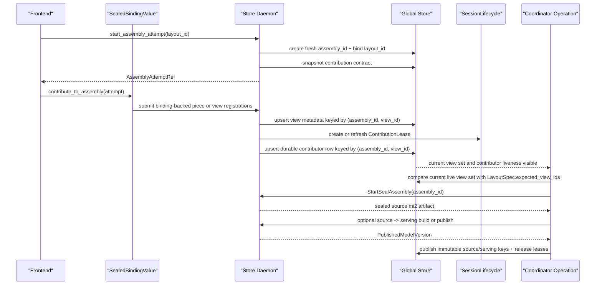

# Summary

Define distributed publish for binding-backed training by **reusing the
repository’s existing assembly and layout trunk**, not by creating a second
assembly model beside it.

This design makes one architectural commitment explicit:

- TensorCast has **one** assembly trunk
- TensorCast has **one** layout contract trunk
- training, inference, `register`, `put`, byte-in, and future frontends must all
  compile onto that same trunk

This revision also makes three long-term decisions explicit:

- the system has one **contribution contract extension point**
  - `LayoutSpec.expected_view_ids` remains the completeness root
  - the per-view semantic contract must still exist explicitly and be
    snapshot-able
- one assembly attempt yields one **published model version** result
  - source assembly and optional serving publication are one lineage, not two
    unrelated outcomes
- contributor liveness reuses the repository’s existing **lease/guard/finalizer
  lifecycle** from `0011`
  - `assembly_contributions` is durable truth
  - it is not a replacement for runtime lease fences

In current TensorCast, the trunk already exists in recognizable form:

- **`LayoutSpec`**
  - canonical layout + overlap/proof rules
  - plus `expected_view_ids` for the expected contribution/view set
- **`ViewSpec` + deterministic `view_id`**
  - contribution or projection identity
- **`assembly_id`**
  - one concrete unsealed assembly workspace
- **view registration keyed by `(artifact_id, view_id)`**
  - contribution submission and partial replacement substrate

This design does not replace those concepts. It deepens them and makes
binding-backed contributors use them directly.

# Goals / Non-Goals

## Goals

- Publish one full distributed model version from many local sealed values.
- Keep `LayoutSpec` as the global canonical layout and overlap/proof contract.
- Reuse the current assembly substrate:
  - `assembly_id`
  - `LayoutSpec`
  - `assembly_layout_bindings`
  - view registration and `view_id`
  - coverage/proof persistence
  - `artifact_bindings`
  - `StartSealAssembly`
- Make binding-backed contribution one frontend of the existing piece/view
  registration trunk, not a second assembly implementation.
- Make completeness depend on the expected view set already carried by the active
  layout contract.
- Define an explicit contribution-contract layer above `LayoutSpec` so the
  system can describe required per-view semantics without forking the trunk.
- Reuse current `(artifact_id, view_id)` identity plane as the basis for partial
  replacement inside one assembly workspace.
- Keep SDK control-path operations daemon-mediated only.
- Make the publish result authoritative at the **model-version** level:
  - source artifact lineage
  - optional serving artifact lineage
  - immutable published keys and manifest metadata
- Reuse the daemon lifecycle system from `0011` for contributor liveness and
  mutation fencing instead of inventing a second cleanup model.
- Preserve a clean extension path for `TP > 1`, ranges, transforms, and future
  frontend sources without splitting the trunk.

## Non-Goals

- This design does not redefine the local binding contract from `0084`.
- This design does not create a second global contract object if current
  `LayoutSpec` + view identity is sufficient.
- This design does not widen `LayoutSpec` with topology ownership metadata.
- This design does not reuse one mutable `assembly_id` across many published
  versions.
- This design does not make distributed publish a training-only concept; binding
  is only one contributing surface.
- This design does not require `TP > 1` in phase 1.
- This design does not require phase 1 to persist a standalone
  `ProjectionContract` table if the same semantics can be carried by attempt
  snapshot plus existing layout storage.

# Phase-1 Scope and Assumptions

Phase 1 is intentionally aligned with what the current assembly trunk already
does well.

## Supported Parallel Modes

- `PP`
  - supported in phase 1
  - each stage or chunk contributes a disjoint subset of the full artifact
- `EP`
  - supported in phase 1
  - each expert group contributes a disjoint subset of the full artifact once
    canonical expert naming is fixed
- `CP`
  - orthogonal to weight ownership for this design
- `TP`
  - not the focus in phase 1
  - current retrieval-side TP view support exists, but assembly-side TP still
    needs more deliberate range or transform design

## Disjoint Contribution Assumption

Phase 1 assumes:

- each required contribution view represents part of the full artifact
- required views do not overlap each other
- together they cover the full canonical artifact at seal time

This is the most realistic first landing because it matches current assembly
behavior:

- piece registration already rejects overlaps across distinct `view_id` under
  the default disjoint policy
- current tests already exercise dense piece assembly from disjoint pieces
- `PP` and `EP` naturally fit the "disjoint partial view" model

This assumption is strong enough for the target production direction and narrow
enough to avoid prematurely inventing a second projection language.

# Problem Statement

The repository already contains the beginnings of the exact decomposition we
want:

- `LayoutSpec` is content-addressed and bound to canonical index multihash
- `LayoutSpec.expected_view_ids` already defines a stable expected view set
- `ViewSpec` canonically maps to a deterministic content-addressed `view_id`
- piece/view registration already writes dense view bytes into an assembly
  workspace
- `view_state_service` already upserts per-view metadata and
  `replace_ranges(...)` for the same `(artifact_id, view_id)`
- `assembly_id` already names an unsealed assembly workspace
- `artifact_bindings` already make `assembly_id -> mi2` the post-seal authority

That means the project already has one trunk in approximate form:

- `LayoutSpec`
  resembles the canonical layout plus contract root
- `ViewSpec` and `view_id`
  resemble projection or contribution specs
- `assembly_id`
  already is the attempt or workspace

The mistake would be to ignore that trunk and build a second one just for
binding-backed training.

The original `0085` draft still leaned too far in that direction:

- it overlaid a new `(assembly_id, version)` model on top of an existing
  assembly workspace model
- it measured completeness by contributor identity instead of by expected view
  satisfaction
- it left contributor liveness too local while the coordinator remained durable

This revision corrects that:

- **view identity is the slot identity**
- **the active `LayoutSpec` already acts as the reusable assembly contract root
  in phase 1**
- **`assembly_id` already is the attempt**
- **published result must be a model-version lineage, not only a sealed
  artifact id**

# One Trunk Mapping

## Conceptual Mapping To Existing Objects

The long-term conceptual decomposition still matters, but in phase 1 it maps
onto current TensorCast objects directly:

| Conceptual role | Existing TensorCast object | Notes |
| --- | --- | --- |
| canonical layout + overlap/proof rule | `LayoutSpec` | already present and content-addressed |
| projection or contribution spec | `ViewSpec` + deterministic `view_id` + canonical coverage | already present in view registration |
| reusable assembly contract | active `LayoutSpec` plus snapped `ContributionContractSnapshot` | phase 1 keeps the root in `LayoutSpec` but snapshots the per-view contract explicitly |
| assembly attempt | `assembly_id` | already the unsealed workspace |

This is the key unification rule for the design:

- do not fork the trunk when the current object already carries the required
  semantics

## Why `expected_view_ids` Matters

`LayoutSpec.expected_view_ids` is currently underused, but it is exactly the
right anchor for phase-1 distributed completeness:

- it is immutable
- it is layout-rooted
- it is deterministic and sorted
- it already names view identities, which are the current per-contribution
  identity key in the assembly pipeline

Therefore, phase-1 completeness should be defined as:

- all required `expected_view_ids` for the bound `layout_id` are present and live
  in the assembly workspace

not:

- some opaque set of contributor ids submitted rows

Those required `expected_view_ids` must be computed once during layout or
contract generation from deterministic partial-view specs. They must not be
re-derived ad hoc on every publish update.

## Contribution Contract Lives Above `expected_view_ids`

`expected_view_ids` is the required **set root**. It is not the whole
contribution contract.

The system also needs explicit, per-view semantic inputs:

- the semantic `ViewSpec` or equivalent canonical contribution mapping
- the required contribution kind
  - `piece_partial`
  - `canonical_full`
  - future range or transform kinds
- planner-derived coverage semantics
- a stable digest of that contribution plan

Therefore this design makes the following rule normative:

- phase 1 completeness is rooted in `LayoutSpec.expected_view_ids`
- phase 1 attempt creation must also snapshot an explicit
  `ContributionContractSnapshot`

The long-term extension point is:

- `LayoutSpec`
  - global layout root
  - expected `view_id` set
- `ContributionContractSnapshot`
  - required per-view semantics for one attempt
  - phase 1 may store it in the coordinator snapshot instead of a new durable
    top-level contract table
- future `ProjectionContract`
  - may become a standalone durable object if the system outgrows the phase-1
    snapshot form

This keeps one trunk while avoiding the mistake of pretending that a sorted list
of ids is sufficient to reconstruct the entire required contribution meaning.

# Core Design

## `LayoutSpec` Stays Narrow, But Deep Enough

`LayoutSpec` continues to answer:

- canonical index binding
- overlap policy
- proof policy
- expected view set

It still must not absorb:

- training topology labels
- local binding identity
- contributor runtime liveness policy
- attempt-specific state

This preserves one narrow but deep trunk:

- global layout contract lives in `LayoutSpec`
- frontend-specific ownership lives outside it

## `ViewSpec` And `view_id` Are Phase-1 `ProjectionSpec`

Current TensorCast already computes deterministic view identity from semantic
view spec and canonical index bytes.

Phase-1 rule:

- the existing `ViewSpec` plus deterministic `view_id` is the reusable
  projection identity
- a binding-backed contributor must map its local sealed bytes to one or more of
  those view identities

That means:

- `register_view(...)`
- future binding contribution
- future byte-in partial registration

all land on the same view-registration substrate.

For phase 1, the projection model is intentionally restricted to the forms that
fit the current trunk:

- deterministic content-addressed `view_id`
- canonical coverage attached to that `view_id`
- disjoint piece semantics across distinct required views

If a future frontend needs richer range or transform composition than the
current view-registration trunk can express cleanly, the project may extend the
projection model. It must still extend the trunk, not fork away from it.

## Contribution Kinds Are Part Of The Contract

Phase 1 needs one more explicit distinction:

- `piece_partial`
  - disjoint partial contribution that registers through the existing dense
    piece path
- `canonical_full`
  - full-canonical contribution that still belongs to the same assembly attempt
    and contract, but must not masquerade as a full-coverage piece

This matters for the degenerate single-rank case:

- a one-rank publish may use:
  - one `canonical_full` contribution
  - or a deterministic multi-view disjoint contract
- it must not rely on an ad hoc "full-coverage piece" shortcut that contradicts
  current piece-registration rules

## `assembly_id` Is The Attempt

This design makes the following explicit:

- one publish attempt uses one fresh `assembly_id`
- once sealed or aborted, that workspace is finished
- a later version uses a different `assembly_id`

This is already how the current assembly workspace behaves. We are aligning with
it, not replacing it.

## `view_id` Is The Slot Identity

There is no need to invent a second slot-id plane in phase 1.

The assembly slot identity is the content-addressed `view_id`.

Reasons:

- current Global Store state is already keyed by `(artifact_id, view_id)`
- current proof digests are keyed by `(assembly_id, view_id, tensor_name, ...)`
- current upsert and replacement behavior is already per `view_id`
- current `LayoutSpec.expected_view_ids` already names the expected contribution
  set in the same identity plane

Therefore:

- view completeness = expected `view_id` set satisfied
- partial replacement = same `view_id` re-registered inside one `assembly_id`

In phase 1, this also means:

- each required `view_id` is assumed to contribute a disjoint part of the full
  artifact
- the final assembly seal succeeds only when the union of those required views
  covers the full canonical artifact

## Binding Contribution Is One Frontend Onto Existing Piece Registration

`SealedBindingValue` from `0084` becomes one frontend onto the existing view or
piece registration trunk.

It must not bypass:

- view identity computation
- coverage validation
- overlap/proof checks
- `view_state_service`
- existing seal flow

Instead, binding contribution should compile down to the same logical operation
as piece registration:

1. determine the target view identity or identities
2. expose the local bytes through the appropriate plan
   - LIP when valid
   - stable-dram or copied buffers otherwise
3. register or update those views under the target `assembly_id`
4. let the existing assembly seal path produce the final `mi2`

This is the core unification guarantee for future frontends.

For `PP` and `EP` in phase 1, this means the binding frontend should compile its
local coverage into the same disjoint partial-view shape the current piece path
already understands, rather than introducing training-specific contributor
objects into the sealing path.

For the single-rank case, this means:

- use the same attempt and contract machinery
- choose a contract that is actually legal on the trunk
  - `canonical_full`
  - or deterministic disjoint multi-view coverage
- do not invent a binding-local publish shortcut outside the assembly model

# Partial Replacement Semantics

## Existing Behavior

Current Global Store behavior already supports **idempotent upsert** for the
same `(artifact_id, view_id)` identity and already scopes canonical coverage to
that same key:

- `view_repository.upsert(...)` keeps one current metadata row per
  `(artifact_id, view_id)`
- `replace_ranges(...)` rewrites the canonical coverage rows for that same
  identity

This is the right identity plane for replacement, but it is not yet sufficient
by itself to define the full open-attempt replacement semantics needed here.

## Required Phase-1 Rule

For distributed publish in phase 1:

- every expected contribution corresponds to one deterministic `view_id`
- re-contributing that same `view_id` within the same `assembly_id` is a legal
  replacement of that slot **only while the assembly attempt is open**
- replacement must be validated against the snapped contribution contract for
  that `view_id`
- once the attempt is sealed or aborted, that slot is finished
- the coordinator must judge completeness against the current set of live
  required `view_id`

This directly answers the long-term concern:

- we can keep `LayoutSpec` narrow
- we can keep one assembly trunk
- we can still express deep partial replacement by leaning on view identity

# Architecture & Interfaces

## Public Surface

```python
class AssemblyAttemptRef:
    assembly_id: str
    layout_id: str
    contribution_contract_hash: str
    coordinator_operation_id: str
    coordinator_generation: int


class PublishedModelVersion:
    assembly_id: str
    source_artifact: Artifact
    source_artifact_id: str
    serving_artifact: Artifact | None
    serving_artifact_id: str | None
    source_version_key: str | None
    serving_version_key: str | None
    representation_contract_hash: str | None
    serving_manifest_ref: str | None


class Store:
    def start_assembly_attempt(
        self,
        *,
        layout_id: str,
        ctx: CallContext | None = None,
    ) -> AssemblyAttemptRef: ...

    def wait_assembly_attempt(
        self,
        attempt: AssemblyAttemptRef | str,
        *,
        ctx: CallContext | None = None,
    ) -> PublishedModelVersion: ...


class SealedBindingValue:
    def contribute_to_assembly(
        self,
        *,
        attempt: AssemblyAttemptRef,
        ctx: CallContext | None = None,
    ) -> PartialSealResult: ...
```

Important surface rules:

- callers reference the active `layout_id`
- callers do not restate per-update tensor subsets in API parameters
- binding uses its captured local contribution plan to determine which required
  view ids it can satisfy
- the contributor surface stays on `SealedBindingValue`, never on mutable
  `Binding`
- attempt creation snapshots the explicit contribution contract and exposes its
  digest through `contribution_contract_hash`
- attempt completion returns a **published model version** result, not a bare
  source artifact

## Coordinator

The coordinator is an `operation.proto`-backed daemon operation.

Responsibilities:

- create a fresh `assembly_id`
- bind that `assembly_id` to the requested `layout_id` via
  `assembly_layout_bindings`
- snapshot coordinator generation, current view metadata, and the explicit
  contribution contract
- wait for all required `expected_view_ids` to become satisfied and live
- call existing `StartSealAssembly`
- record the sealed source artifact lineage
- run the required post-assembly publish stages
  - source publish
  - optional serving builder or publisher
- publish immutable version keys and manifest metadata only after all required
  stages succeed
- release contribution leases and close the attempt

## Contribution Flow



# Source Assembly And Serving Publication

The assembly trunk seals a **source artifact** first.

That is not yet the whole publish result for every consumer.

This design therefore makes the following model normative:

- every attempt seals one source artifact from one `assembly_id`
- the attempt result is one `PublishedModelVersion`
- a `PublishedModelVersion` may contain:
  - source artifact lineage
  - serving artifact lineage
  - immutable published keys
  - manifest metadata such as `representation_contract_hash`

Rules:

- if the serving representation is identical to the source representation, the
  serving artifact may equal the source artifact
- if the serving representation differs, the builder step is part of the same
  publish lineage
- serving-facing workflows, including the StepTron -> vLLM integration, are not
  complete until the serving artifact and immutable serving key exist
- `wait_assembly_attempt(...)` returns the full published lineage so callers do
  not have to infer it from unrelated side effects

# Consistency Model

## One Durable Coordinator Fence

Global fencing remains in `operation.proto`.

That means:

- one live coordinator generation controls one attempt
- stale contributors must be rejected against that coordinator generation
- the coordinator must snapshot the bound `layout_id`, contribution contract,
  and current view set before seal

## One Contributor Identity Plane

Since `view_id` is the slot identity in phase 1, the persisted contributor key
should be:

- `(assembly_id, view_id)`

with current occupant metadata:

- `binding_id`
- `binding_value_id`
- `coverage_plan_hash`
- contributing daemon identity
- lease identity and liveness fence

This is better aligned with the repository than contributor-count keys because
completeness is about satisfying required `view_id`, not about counting submitters.

## Contribution Leases Reuse `0011`

Contributor liveness must reuse the daemon’s existing lease/guard/finalizer
system from `0011`.

Therefore:

- the runtime fence is a `ContributionLease`
- `assembly_contributions` stores the durable current occupant projection
- the durable row is not itself the lease authority

`ContributionLease` follows the same lifecycle model:

- subject
  - `(assembly_id, view_id)`
- principal
  - contributor daemon identity plus session or PID identity as applicable
- guards
  - coordinator-generation fence
  - heartbeat or deadline guard
  - PID guard when the contribution depends on process-owned resources
- finalizers
  - mark durable row `released`, `stale`, or `aborted`
  - release mutation fences on `(binding_id, binding_value_id)`
  - notify the coordinator when required contributors are lost

This keeps contribution cleanup coherent with the rest of the daemon instead of
building a second lifecycle subsystem beside it.

## Binding Mutation Fence

If a `SealedBindingValue` currently occupies one live required `view_id` in an
open attempt, the same binding value must not become mutable again.

Therefore:

- `Binding.begin_update(...)` must block or fail while a live contribution lease
  exists for the current `(binding_id, binding_value_id)`
- lease release happens only after attempt success, failure, or abort

## Frontend-Agnostic Rule

The same trunk must serve all frontends:

- binding-backed training
- direct `register_view`
- future byte-in partial uploads
- future daemon-owned partial assembly feeds

The frontend decides how bytes are produced and exported. The trunk decides:

- view identity
- coverage validation
- overlap/proof rules
- seal semantics

# Invariants and Error Model

## Invariants

- `LayoutSpec` remains the single global layout contract root.
- `LayoutSpec.expected_view_ids` is the phase-1 expected contribution set.
- the explicit contribution contract for those required views is snapped per
  attempt and is part of the coordinator fence.
- `view_id` is the phase-1 contribution or slot identity.
- one publish attempt uses one fresh `assembly_id`.
- partial replacement is scoped to the same `(assembly_id, view_id)`.
- only `SealedBindingValue` may contribute binding-backed bytes.
- a live contributor may not reopen for mutation.
- attempt success means the required **published model version** stages
  completed, not only that source seal produced an `mi2`.
- SDK code never talks to Global Store directly for this workflow.

## Error Model

- `INVALID_ARGUMENT`
  - unknown `layout_id`, malformed view identity mapping, invalid contribution
    plan, malformed coordinator token, or invalid publish lineage request
- `FAILED_PRECONDITION`
  - no current sealed value, local contribution plan does not match the required
    expected view set, attempt contract changed, attempt layout changed, binding
    is already reopening for mutation, or required serving-publication metadata
    is absent
- `ALREADY_EXISTS`
  - same `(assembly_id, view_id)` contribution is resubmitted idempotently
- `ABORTED`
  - coordinator generation advanced, contributor lease expired, or attempt was
    aborted explicitly
- `DATA_LOSS`
  - view registration or final seal observed inconsistent bytes after safe
    recovery was no longer possible
- `FAILED_PRECONDITION` or `INTERNAL`
  - source seal succeeded but required serving-builder or version-publication
    stage failed; the attempt must not report full publish success
- `DEADLINE_EXCEEDED`
  - coordinator wait or seal exceeded the budget

# Schema Changes

This design reuses current assembly and layout persistence and adds only the
missing contributor-liveness layer.

## Existing Tables Reused As-Is

- `layout_specs`
- `assembly_layout_bindings`
- `artifact_layout_attachments`
- `artifact_bindings`
- `operations`
- `views`
- `view_coverage_ranges`
- `assembly_proof_commitments`
- `piece_proof_digests`

## New Table

- `assembly_contributions`
  - one current live occupant per `(assembly_id, view_id)`
  - columns:
    - `assembly_id TEXT`
    - `view_id TEXT`
    - `binding_id TEXT NOT NULL`
    - `binding_value_id TEXT NOT NULL`
    - `coverage_plan_hash TEXT NOT NULL`
    - `contributor_daemon_id TEXT NOT NULL`
    - `coordinator_operation_id TEXT NOT NULL`
    - `coordinator_generation BIGINT NOT NULL`
    - `lease_id TEXT NOT NULL`
    - `lease_generation BIGINT NOT NULL`
    - `lease_expires_at TIMESTAMP WITH TIME ZONE NULL`
    - `state TEXT CHECK (state IN ('accepted','stale','released','aborted'))`
    - `created_at`, `updated_at`
  - primary key:
    - `(assembly_id, view_id)`
  - secondary indexes:
    - `(assembly_id, state)` for completeness checks
    - `(binding_id, binding_value_id)` for mutation-fence cleanup

Notably absent:

- no new persistent `AssemblyContract` table in phase 1
- no second slot-id plane
- no `(assembly_id, version)` overlay

If future requirements exceed what phase-1 `LayoutSpec` plus snapped
contribution contract can express, the design may extend from this trunk. It
must not fork away from it.

## Proto Impact

Phase-1 proto changes should stay incremental:

- daemon RPCs for:
  - starting an assembly attempt from `layout_id`
  - submitting binding-backed contributions
  - waiting on the coordinator result
- daemon result protos should return a model-version lineage, not only a source
  artifact id
- Global Store RPCs or repositories for `assembly_contributions`

No standalone contract proto is required in phase 1 if the attempt snapshot can
carry the explicit contribution contract cleanly.

# Alternatives and Rationale

## Create A Second Persistent `AssemblyContract` Object In Phase 1

Rejected.

Reasons:

- the current repository already has a viable contract root in `LayoutSpec`
  combined with deterministic view identity
- adding a second contract object too early would split the trunk
- phase 1 should first exhaust the existing abstraction before introducing a new
  one

## Extend `LayoutSpec` With Topology Ownership Metadata

Rejected.

Reasons:

- topology ownership is frontend and deployment metadata
- the same canonical model layout should not get a different `layout_id` because
  PP or EP placement changed
- `LayoutSpec` must stay reusable across frontends

## Keep `(assembly_id, version)` As The Main Version Model

Rejected.

Reasons:

- current assembly workspace is already keyed by `assembly_id`
- partial replacement is already expressed by `view_id`
- a fresh `assembly_id` per publish attempt is simpler and safer

## Use Contributor Count Instead Of Required View Set

Rejected.

Reasons:

- completeness is about satisfying required views
- one contributor may satisfy multiple required views
- replacement revisits the same `view_id`

# Compatibility & Acceptance Criteria

Phase-1 acceptance requires:

- distributed publish is implemented on the existing assembly and layout trunk
- `LayoutSpec` remains the global canonical contract root
- `LayoutSpec.expected_view_ids` becomes the phase-1 expected contribution set
- attempt creation snapshots an explicit per-view contribution contract
- binding-backed contribution compiles down to the same view or piece
  registration path used by other frontends
- completeness is checked by required `view_id`
- partial replacement of the same `view_id` inside one `assembly_id` works as an
  open-attempt slot replacement on the same identity plane
- every publish attempt uses a fresh `assembly_id`
- contributor liveness loss prevents false successful seal
- contributor liveness and mutation fencing are implemented through the existing
  lease/guard/finalizer lifecycle model
- publish completion returns a `PublishedModelVersion` lineage rather than only
  a source artifact id
- serving-facing workflows publish immutable serving keys or manifests before the
  attempt reports success
- single-binding publish works on the same trunk through a legal contribution
  kind such as `canonical_full`
- future `register`, `put`, byte-in, and other frontends can reuse the same
  trunk without creating separate assembly implementations

# References

- `docs/designs/0084-binding-unified-model-and-contract.md`
- `docs/plans/0085-distributed-binding-assembly-and-coordinator.md`
- `docs/architecture/view-replicas-and-assembly.md`
- `docs/architecture/api/api-design.md`
- `docs/guides/steptron-vllm-binding-integration.md`
