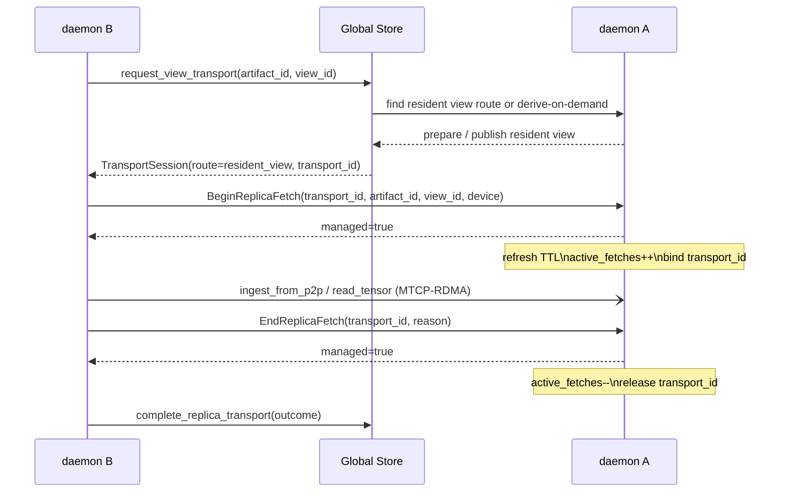
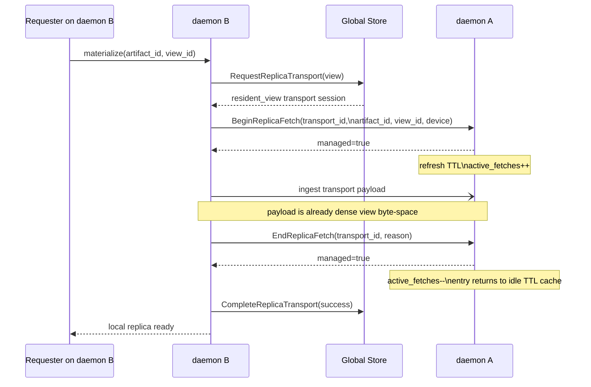
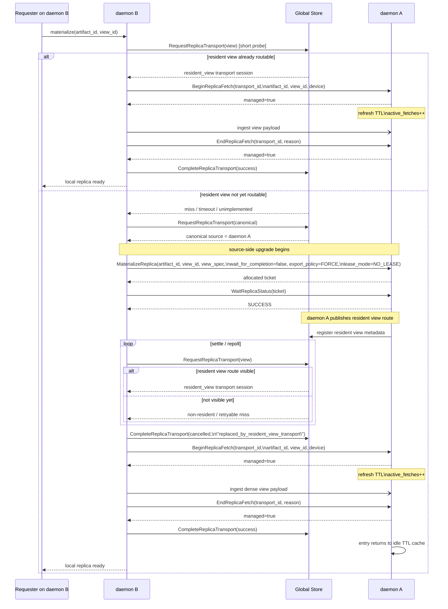
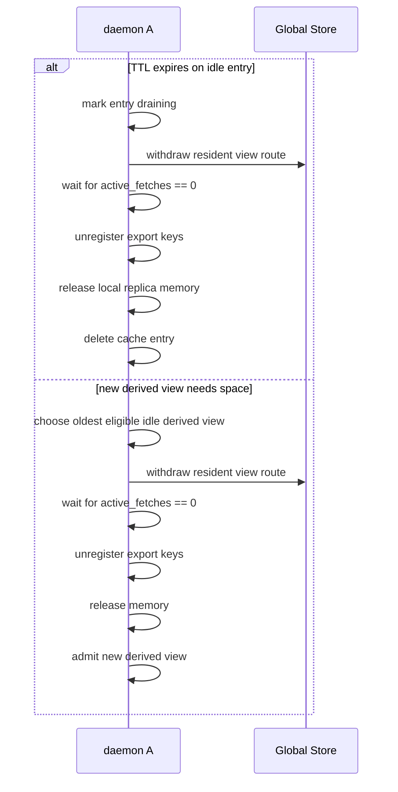
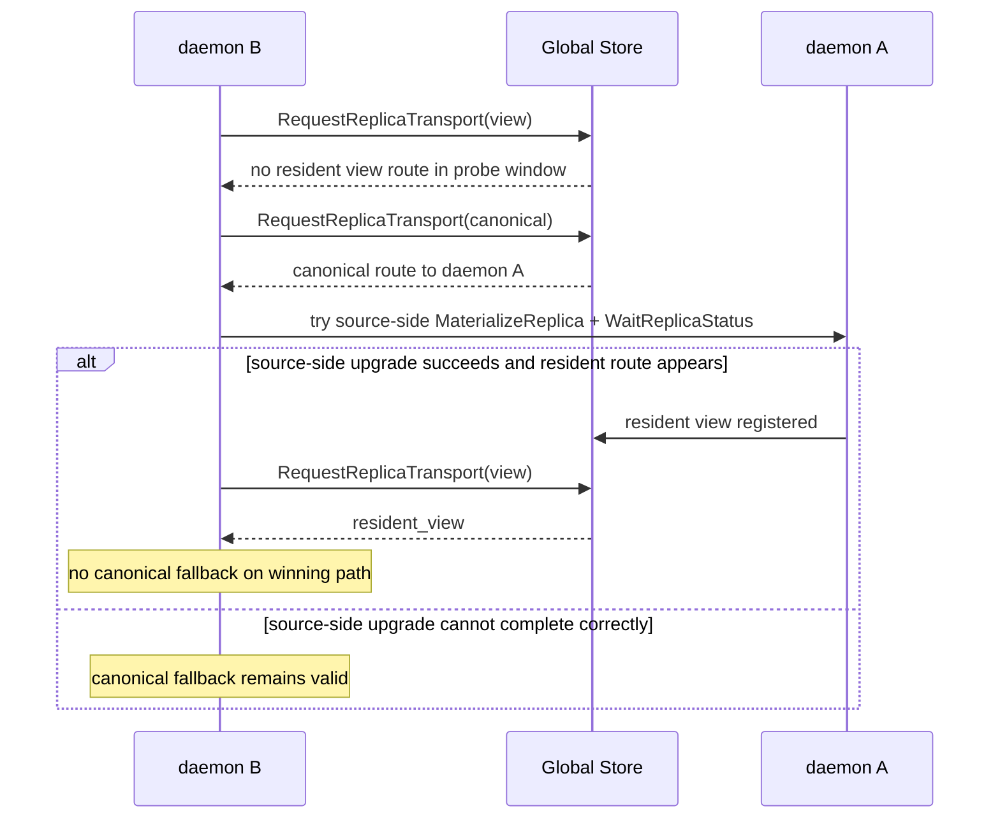

# Summary

Today `request_view_transport` only routes to an already-known remote `view_id` source. When the Global Store cannot route that `view_id`, the requester falls back to canonical transport and reconstructs the requested view locally.

That preserves correctness, but it is the wrong performance shape for TP-sliced model loading:

- the destination daemon reads canonical byte-space instead of dense view bytes;
- the destination daemon pays read amplification plus local strided repack/pack cost;
- the same reconstruction work is repeated on every destination daemon even when the source daemon already has the canonical replica in local DRAM/VRAM.

This design proposes a source-side remote view transport model whose end state is:

- daemon B asks for `artifact_id + view_id`;
- daemon A prepares the requested view byte-space locally from its canonical replica;
- daemon B receives already-reconstructed dense view bytes from daemon A and does not fall back to canonical transport;
- source-side derived views behave as daemon-owned ephemeral cache entries: reusable across repeated fetches for a bounded TTL, but pressure-evictable and never durable by default.

# Goals

- Preserve existing TensorCast view semantics: `view_id` remains the stable identity of a byte-space derived from a canonical artifact plus view spec.
- Make view byte-space a first-class transport target, not only a first-class local materialization result.
- Eliminate destination-side canonical reconstruction when a source daemon can derive the requested view locally.
- Ensure verification is performed against view byte-space metadata when available, and never by incorrectly reusing canonical verification metadata for a view.
- Preserve mixed-version compatibility by keeping canonical fallback available until all required control-plane pieces are implemented.

# Non-Goals

- Changing how `view_id` is computed.
- Publishing every derived view as a durable artifact by default.
- Routing artifact payload bytes through the Global Store.
- Removing canonical fallback before view-aware routing is fully implemented and rolled out.

# Current Behavior and Gap

The current pipeline already carries enough view identity to express the desired route:

- `MaterializeOrchestrator` prefers `request_view_transport` when `view_id` is present.
- `MetadataGateway` attempts to record view residency after successful ingestion.
- registration flows already compute and publish `view_data_hash` and partial canonical coverage for registered views.

However, the control-plane implementation is incomplete:

- `record_view_residency` is still `Unimplemented` in the client;
- `request_view_transport` only works when the Global Store can already route an existing view source;
- when that lookup misses, the requester falls back to canonical routing and performs view reconstruction locally.

The design closes this gap in two phases.

# Phase 1: First-Class Routable View Residency

Phase 1 makes existing view replicas routable.

## Control-Plane Changes

- Implement the Global Store view residency / view state RPCs so daemon-published view metadata becomes queryable instead of best-effort.
- Persist enough metadata to route a view source:
  - `artifact_id`
  - `view_id`
  - `view_size_bytes`
  - `view_data_hash` when available
  - source worker / node identity
  - transport-addressable residency information and device placement
- Keep view metadata immutable with the same conflict rules already used by view registration. `view_id` identity and `view_data_hash` must stay stable.

## Routing Behavior

- `request_view_transport(view)` first looks for an already-resident view replica.
- If found, the response routes directly to that view source.
- If not found, the current canonical fallback behavior is preserved.

## Why Phase 1 Matters

This phase does not yet create view sources on demand, but it makes the existing view byte-space model routable and removes redundant fallback when a matching view was already materialized or registered elsewhere.

# Phase 2: Source-Side Derived View Transport

Phase 2 extends `request_view_transport(view)` from a pure lookup into a lookup-or-derive operation.

## Target Semantics

When daemon B requests `artifact_id + view_id`:

1. If the Global Store already knows a resident view source, route to it.
2. Otherwise, choose a canonical source daemon A that:
   - has a routable canonical replica;
   - can derive the requested `view_id` from local canonical bytes;
   - is eligible under the usual load, heartbeat, and transport guardrails.
3. Ask daemon A to expose the requested view byte-space as the transport source.
4. Return a transport session whose payload is the dense view byte-space, not the canonical byte-space.

The key semantic point is that the selected source still serves the requested byte-space identified by `view_id`; it is not a canonical transport disguised as a view request.

## Source Daemon Behavior

When daemon A is selected as a derivation source:

- it resolves the requested `view_id` against canonical metadata and reconstructs the view locally from its canonical replica;
- the reconstruction should reuse the existing view dataplane primitives such as `ViewPlanner`, `ViewPlanSource`, and `ByteRangeMappedSource` instead of introducing a second view implementation just for transport;
- the derived source is published as a daemon-owned resident-view cache entry, not as a durable artifact and not as a transport-scoped one-shot object.

The required semantics for this derived source are:

- it is ephemeral, but not immediate-release;
- it is keyed by `(artifact_id, view_id, device)` and lives on daemon A;
- it is reusable across repeated fetches for the same byte-space;
- it is retained under a bounded TTL that refreshes on real use;
- it is pressure-evictable and must never compete with canonical pinned replicas as an unbounded peer;
- it is retired by daemon A, not by daemon B.

This keeps the feature aligned with TensorCast semantics: a view can exist as a stable byte-space identity without requiring every transport-time derivation to become durable global state, while still allowing later consumers to reuse the first prepared dense view.

## Destination Daemon Behavior

When daemon B receives a routed view transport:

- it loads dense view bytes from the source transport directly;
- it does not reconstruct the TP slice from canonical byte-space locally;
- it materializes the resulting local replica and exports it to the requester exactly as today.

When daemon B repeats the same request while daemon A still holds a live derived-view cache entry:

- daemon B should receive a resident-view route immediately from the Global Store;
- daemon A should reuse the existing derived view instead of reconstructing it again;
- the data-plane use should refresh daemon A's TTL for that cache entry.

In other words, destination-side `canonical -> view` remapping is replaced with source-side `canonical -> view` derivation.

## Derived View Export Lifecycle Semantics

The runtime behavior above requires an explicit lifecycle model. The important point is that source-side derived view exports are neither:

- durable published replicas; nor
- single-use transport scratch objects that disappear as soon as one consumer finishes.

They are daemon-owned ephemeral resident-view cache entries.

### Ownership

The lifecycle owner is daemon A, not daemon B and not the Global Store.

- daemon B may trigger prepare and consume the resulting transport;
- the Global Store may route or stop routing the resident view;
- daemon A owns the local replica memory, the export keys, the route publication state, TTL, and eviction decisions.

This separation is required because only daemon A has authoritative visibility into:

- whether the local derived view still exists;
- whether it is currently serving in-flight transports;
- how much local stable DRAM budget remains;
- whether an entry should stay hot, become idle, or be retired.

### Logical State Model

Each source-side derived view export should have a daemon-local record keyed by `(artifact_id, view_id, device)`.

The minimum state is:

- `state`: `preparing | live | draining | retired`
- `replica_uuid` / local `ReplicaKey`
- resident-view route identity as advertised to the Global Store
- `size_bytes`
- `expiry`
- `last_access`
- `active_fetches`
- export registration metadata needed for orderly unregister / release

The intended state machine is:

1. `preparing`
   - daemon A is materializing the dense view locally
   - not yet reusable
   - not evictable
2. `live`
   - resident-view route is published
   - `active_fetches > 0` means transport-pinned
   - `active_fetches == 0` means idle-but-reusable
3. `draining`
   - route has been withdrawn
   - no new fetches may attach
   - daemon waits for `active_fetches` to drop to zero
4. `retired`
   - export unregistered
   - route withdrawn
   - local replica memory released

### TTL Retention

Derived view exports should use sliding TTL retention.

- on first successful prepare, daemon A assigns `expiry = now + ttl`;
- when a later fetch actually uses the derived view data-plane, daemon A refreshes `expiry`;
- repeated control-plane probes must not refresh TTL;
- failed or abandoned prepare attempts must not create a long-lived TTL entry.

The refresh point should correspond to real source-side use, not just route visibility:

- preferred: refresh on the first actual read / transport use from the export;
- acceptable fallback: refresh when daemon A commits to serving the resident-view transport;
- not acceptable: refresh on `RequestReplicaTransport(view)` polling alone.

This is what preserves the useful reuse behavior seen in relay benchmarks:

- `trial 1` pays the prepare cost;
- `trial 2` and `trial 3` can reuse the same derived view if they arrive within TTL;
- unused entries still age out naturally.

### Pressure Eviction

TTL alone is not sufficient. Update-style workloads generate different `artifact_id` values, so old derived views must not remain resident until TTL expiry if they block admission of newer ones.

Therefore source-side derived views must also be pressure-evictable:

- expired idle entries are evicted first;
- then non-expired idle entries in oldest-`last_access` order;
- `preparing` entries are never evicted;
- `live` entries with `active_fetches > 0` are never evicted.

Admission of a new derived view should follow this order:

1. reuse an existing live entry for the exact `(artifact_id, view_id, device)` if present;
2. if not present, try to admit a new entry;
3. if admission would exceed the source daemon's cache budget, evict eligible idle derived views;
4. if admission still cannot succeed, stop upgrading and fall back to canonical transport rather than overcommitting daemon A.

This is a semantic requirement, not only a performance optimization:

- canonical model versions may legitimately be pinned in stable DRAM;
- source-side derived views must be lower-priority cache entries;
- otherwise repeated multi-version updates can exhaust daemon A memory and break later fetches.

The design permits two equivalent budgeting implementations:

- a dedicated `derived_view_export_cache_bytes` budget; or
- a lower-priority class inside the existing stable tier, provided eviction can target derived views before canonical pinned replicas.

## Phase 7 Hardening Notes

The first production failure mode after Phase 6 was not a byte-space correctness bug. It was a lifecycle/admission bug: `prepare` admission added an extra throttle on top of the real derived-view budget reservation and could serialize TP-slice prepares even when the derived-view cache still had enough budget for all of them. In practice that caused one TP rank to miss the upgrade wait budget and fall back to canonical transport on the destination daemon.

The hardening rule is therefore:

- prepare-time throttling must never be stricter than the actual derived-view admission budget;
- if admission truly cannot proceed after eviction, the source-side upgrade should fail explicitly and the requester should fall back to canonical transport with an observable reason;
- canonical fallback is a compatibility and pressure backstop, not a side effect of an arbitrary local serialization gate.

### Source-Side Fetch Lifecycle

For ephemeral derived views, source-daemon lifecycle correctness depends on tracking actual source-side data-plane use, not only route publication.

The intended data-plane contract is:

1. `LockTransportChunks(view)` is the first source-daemon operation that proves the routed view is actually being used.
2. Source daemon A increments `active_fetches` for the `(artifact_id, view_id, device)` entry at lock time.
3. TTL refresh happens at the same point, because this is a real data-plane use rather than a control-plane probe.
4. `UnlockTransportChunks(view)` decrements `active_fetches`.
5. If a lock token expires without unlock, the lock TTL sweep must also decrement `active_fetches`.

This gives the manager a local notion of "in flight on daemon A" that is narrower and more precise than Global Store transport-session bookkeeping.

Current implementation note:

- the relay path exercised by `load_weight_remote` and `update_weight_remote` performs direct MTCP/RDMA reads from exported memory keys and does not route those reads through `LockTransportChunks`;
- therefore `LockTransportChunks`-based accounting is not sufficient to implement Phase 7 `active_fetches` semantics for remote relay by itself;
- Phase 7 uses explicit daemon-to-daemon RPCs on the relay hot path:
  - daemon B sends `BeginReplicaFetch(transport_id, artifact_id, view_id, device)` to daemon A immediately before `ingest_from_p2p`;
  - daemon A resolves the source-side derived-view entry keyed by `(artifact_id, view_id, device)`, refreshes TTL, increments `active_fetches`, and records the `transport_id` idempotently;
  - daemon B sends `EndReplicaFetch(transport_id, reason)` immediately after `ingest_from_p2p` returns, regardless of success or failure;
  - daemon A decrements `active_fetches` by `transport_id`, making drain/retire wait on real data-plane lifetime rather than on control-plane route visibility.

### Ordered Retirement

Retirement of a source-side derived view is a two-stage drain:

1. mark the resident-view route unavailable in the Global Store and wait for remote transport-session drain;
2. close local attaches on daemon A, wait for `active_fetches == 0`, then unregister the source route and release local backing memory.

This ordering is intentional:

- route withdrawal happens before local release, so new route selection cannot observe a dead endpoint;
- already-issued transports may still finish during the remote-drain window;
- after remote drain is complete, daemon A stops accepting new attaches for that entry and waits for local `lock/unlock` users to leave;
- only then does daemon A unregister the replica and free the local dense-view backing.

If retirement fails after route withdrawal has already happened, the entry must stay daemon-owned and draining, then retry retirement later. It must not be revived as a normal reusable entry, because the route is already withdrawn.

### Cleanup / Retirement Ordering

Retirement must be source-daemon-owned and ordered.

Correct order:

1. mark the entry `draining`;
2. withdraw the resident-view route from the Global Store;
3. wait for in-flight transports to drain (`active_fetches == 0`);

# Phase 8: Deadline and Wait-Budget Semantics for Source-Side Upgrade

The relay/update regressions observed after Phase 7 were not only lifecycle issues. They also exposed a second, orthogonal problem: the destination daemon and source daemon do not currently use a principled waiting budget for `derived_view_from_canonical -> resident_view` upgrade.

In the failing `update_weight_remote` runs:

- the caller gave TensorCast an end-to-end materialization deadline of about 180s;
- the destination daemon still derived its internal materialization / transport wait budget from `pinned_allocation_timeout_ms`, which defaults to 30s;
- daemon B therefore waited only about 30s for daemon A to finish preparing the source-side dense view;
- when that 30s budget expired, daemon B fell back to canonical transport;
- canonical transport then consumed the rest of the caller deadline and the overall request failed anyway.

This is the wrong semantic layering. `pinned_allocation_timeout_ms` is a local resource-wait knob. It should not decide how long daemon B is willing to wait for daemon A to prepare a routed remote view.

## Design Goal

Use the caller deadline as the authoritative budget for the whole materialization request, and derive source-side upgrade waiting from that budget instead of from unrelated pinned-allocation settings.

The intended hierarchy is:

1. caller deadline:
   - authoritative end-to-end SLA for one materialization request;
   - comes from the client call context / gRPC deadline;
2. source-side upgrade wait budget:
   - bounded by the remaining caller deadline;
   - used when daemon B asks daemon A to prepare and publish a source-side dense view;
3. pinned-allocation timeout:
   - local timeout for pinned buffer / staging allocation only;
   - must not be reused as the source-side upgrade deadline.

## Why the Current Behavior Is Wrong

The current implementation couples unrelated concerns:

- `req.pinned_allocation_timeout_ms` is used to derive `request_budget`;
- `request_budget` is then copied into `transport_wait_timeout`;
- `transport_wait_timeout` is used by the orchestrator as the wait budget for source-side export readiness.

This means a local staging timeout silently becomes a distributed control/data-plane timeout. For large remote updates, that is too strict and not workload-aware.

The result is a pathological fallback pattern:

- the system waits too little on the fast path;
- then falls back to the slower path;
- then still fails under the original caller deadline.

That fallback does not improve correctness or latency. It only obscures the real cause.

## Proposed Semantics

### 1. Authoritative Request Budget

For daemon-side materialization:

- if the incoming gRPC request has a deadline, that remaining deadline is the authoritative `request_budget`;
- if no deadline is provided, the daemon may continue to use a conservative internal default budget for the request as a whole.

`request_budget` therefore means:

- "how long this materialization request is allowed to continue overall",

not:

- "how long pinned allocation is allowed to wait".

### 2. Source-Side Upgrade Wait Budget

When daemon B attempts `derived_view_from_canonical -> resident_view` upgrade:

- the wait budget for source-side prepare and readiness is derived from the remaining authoritative `request_budget`;
- the upgrade may consume most of the remaining request budget if needed;
- the wait budget shrinks naturally as the caller deadline is consumed by earlier work.

This is the intended end-to-end behavior:

- if the caller is willing to wait 180s, daemon B may use that budget for the source-side upgrade path;
- if only 20s remain, daemon B may only use the remaining 20s.

No extra 30s local cap should be injected unless a future API explicitly asks for one.

### 3. Pinned Allocation Timeout Stays Local

`pinned_allocation_timeout_ms` remains meaningful, but only for local resource waits such as:

- pinned host buffer acquisition;
- local staging / allocation guardrails tied to pinned resources.

It should no longer be copied into:

- daemon-side `request_budget`;
- daemon-side `transport_wait_timeout`;
- source-side export readiness wait budget.

### 4. Fallback Policy by Failure Class

Canonical fallback remains necessary, but not for every timeout.

Canonical fallback is still correct when the source-side upgrade cannot safely proceed because of:

- capability mismatch;
- route lookup unavailability;
- source-side admission failure;
- pressure / eviction failure;
- explicit lifecycle race such as a drained or invalidated source entry.

Canonical fallback is not the right response when the upgrade simply consumes the available request deadline.

Therefore:

- compatibility / admission / resource failures may fall back to canonical transport;
- deadline exhaustion while waiting for source-side export readiness should surface as timeout to the caller, not as a late canonical fallback.

This preserves the role of canonical transport as a compatibility and resource backstop, while avoiding "fallback to something slower after the fast path already used up the deadline".

## Minimal-Interface Implementation Strategy

The first implementation should keep interface changes minimal:

- no required public API change in SGLang;
- no immediate proto change;
- no new user-visible config required for correctness.

The internal change is:

1. stop deriving daemon-side `request_budget` from `pinned_allocation_timeout_ms`;
2. derive `request_budget` from the caller deadline;
3. derive orchestrator `transport_wait_timeout` from that request budget;
4. keep `pinned_allocation_timeout_ms` only on the local allocation path;
5. change source-side upgrade timeout handling so deadline exhaustion propagates instead of triggering late canonical fallback.

If future workloads need more tuning, an additive API can later introduce a dedicated explicit knob such as:

- `request_budget_ms`; or
- `source_prepare_wait_timeout_ms`.

But that is not required for the first fix. The current bug is semantic miswiring, not missing API surface.

## Observability Requirements

Budget-related failures must be diagnosable from logs. The orchestrator / daemon should emit enough information to distinguish:

- caller request budget;
- remaining gRPC deadline at request entry;
- pinned allocation timeout;
- transport wait timeout;
- source-side prepare wait budget;
- fallback reason versus terminal timeout reason.

Without this, large-model remote update/load regressions are difficult to attribute correctly.
4. unregister export keys / transport-visible state;
5. release local replica memory;
6. delete the daemon-local entry.

## Relay Control/Data-Plane Sequence

The remote relay path now has three distinct actors:

- daemon A: source daemon that owns canonical residency and any ephemeral derived-view export;
- Global Store: route selector and transport-session coordinator;
- daemon B: destination daemon that receives the view transport and materializes locally.

The steady-state sequence for `request_view_transport(artifact_id, view_id)` is:

Important properties:

- TTL refresh is tied to `BeginReplicaFetch`, not to `request_view_transport` lookup.
- `active_fetches` is keyed by `transport_id`, so duplicate begin/end RPCs are idempotent and drain waits on real in-flight relay fetches.
- `complete_replica_transport` remains a Global Store concern, but it is no longer the only signal used for source-side lifecycle safety.

## When Canonical Fallback Is Still Expected

Canonical fallback remains valid when:

- the Global Store cannot route a resident view and source-side derive-on-demand admission fails under real budget pressure;
- the source or destination daemon does not support view-aware routing or source-side derive-on-demand;
- the source daemon cannot publish a routable resident view in time for the request budget;
- the relay path is forced onto the canonical route for compatibility rollout or explicit policy.

It is no longer acceptable to hit canonical fallback merely because the source daemon lacks fetch-lifecycle visibility for a routed resident view. Phase 7 closes that gap with `BeginReplicaFetch` / `EndReplicaFetch`.

Incorrect order:

- releasing local export state before route withdrawal;
- dropping the transport endpoint while the Global Store can still route to it;
- relying on daemon B's one-shot `ReleaseReplica(ticket)` call as the normal steady-state cleanup mechanism.

This ordering exists to prevent exactly the stale-route failure mode where:

- the Global Store still returns a resident-view source;
- daemon B attempts to connect;
- daemon A has already dropped the underlying transport/export state.

### Reuse versus Immediate Release

The intended steady-state path after a successful transfer is:

- transfer completes;
- daemon A decrements `active_fetches`;
- if it reaches zero, the entry becomes idle and remains reusable until TTL expiry or eviction.

The intended path is not:

- transfer completes;
- daemon B immediately destroys the prepared export;
- the next consumer is forced to reconstruct the same dense view again.

Immediate post-transfer release defeats the purpose of source-side reuse and is incompatible with the observed benchmark behavior where later relay trials intentionally benefit from a previously prepared view.

### Failure and Abort Semantics

`ReleaseReplica(ticket)` still has a role, but only as an exceptional cleanup path:

- to discard an unfinished source-side prepare before a resident-view route becomes live;
- to clean up a failed prepare attempt;
- to handle abort / cancellation before the derived view becomes a reusable resident entry.

Once daemon A has published a resident-view route, normal lifecycle ownership transfers to daemon A's TTL / eviction machinery. Cleanup must no longer depend on daemon B remembering to call `ReleaseReplica(...)`.

## Current Runtime Sequence

The current implementation already has a concrete source-side remote view transport flow. The key point is that daemon B still talks to the Global Store for source selection, but daemon B talks directly to daemon A to force source-side view preparation when the Global Store only has a canonical route.

The missing piece is lifecycle semantics after that prepare succeeds:

- today a successful source-side prepare can publish resident-view metadata;
- but a transport-scoped `ReleaseReplica(ticket)` model is not sufficient to express bounded reuse plus safe retirement;
- the desired design below upgrades this into a daemon-owned TTL cache with ordered route withdrawal and pressure eviction.

### Sequence Diagrams

#### Resident-View Fast Path

#### Source-Side Upgrade Path

#### TTL Expiry / Pressure Eviction

#### Canonical Fallback Boundary

### Actors

- daemon B: the destination daemon serving the local materialize request
- daemon A: the remote source daemon that already has the canonical replica
- Global Store: control plane for route selection and transport session assignment

### Steady-State Resident-View Fast Path

When the requested `view_id` is already resident and routable on daemon A:

1. daemon B calls `RequestReplicaTransport(view)` through `GlobalStoreClient::request_view_transport(...)`.
2. The Global Store returns a transport session with route kind `resident_view`.
3. Immediately before the relay read starts, daemon B calls daemon A `BeginReplicaFetch(...)`.
4. daemon A refreshes TTL, increments `active_fetches`, and binds the `transport_id` idempotently.
5. daemon B ingests the transport payload as view byte-space directly.
6. After ingest finishes, daemon B calls daemon A `EndReplicaFetch(...)`.
7. daemon A decrements `active_fetches`.
8. daemon B calls `CompleteReplicaTransport(success)`.
9. daemon B registers its local replica as usual.

In this path, daemon B never touches canonical byte-space and never performs local `canonical -> view` reconstruction.

### Current Source-Side Upgrade Path

The more interesting path is when daemon B wants `artifact_id + view_id`, but the Global Store cannot immediately route a resident view.

1. daemon B starts with a short `RequestReplicaTransport(view)` probe.
   - This is intentionally short-lived.
   - It is only trying to discover whether a resident view route already exists.
2. If the probe does not return a resident view route quickly enough, daemon B asks the Global Store for canonical transport by calling `RequestReplicaTransport(canonical)`.
3. The Global Store selects daemon A as the canonical source and returns a remote transport session.
4. If the returned route is eligible for source-side upgrade, daemon B directly calls daemon A over daemon RPC:
   - `MaterializeReplica(...)`
   - selection includes `artifact_id`, `view_id`, and `view_spec`
   - `wait_for_completion=false`
   - `lease_mode=NO_LEASE`
   - `export_policy=FORCE`
   - `need_view_data_hash` follows the original materialize request
5. daemon A prepares an ephemeral derived-view export locally from its canonical replica.
6. daemon B calls daemon A `WaitReplicaStatus(...)` until that export is ready, or until the retry / deadline budget is exhausted.
7. Once daemon A has published the derived view, daemon A registers that resident view route back to the Global Store.
8. daemon B then polls the Global Store again with `RequestReplicaTransport(view)` until the Global Store returns route kind `resident_view`.
9. daemon B cancels the superseded canonical transport session with `CompleteReplicaTransport(cancelled, "replaced_by_resident_view_transport")`.
10. Immediately before the winning relay read starts, daemon B calls daemon A `BeginReplicaFetch(...)`.
11. daemon A refreshes TTL, increments `active_fetches`, and records the `transport_id` idempotently.
12. daemon B ingests the resident-view transport payload from daemon A.
13. After ingest finishes, daemon B calls daemon A `EndReplicaFetch(...)`.
14. daemon A decrements `active_fetches`.
15. daemon B calls `CompleteReplicaTransport(success)` for the winning view transport session.
16. If no fetch is active, daemon A keeps the derived view as an idle TTL-scoped cache entry.
17. A background TTL / eviction path later retires the entry by withdrawing the resident-view route first, then releasing local export state and memory.

This is the key behavior that avoids destination-side canonical reconstruction: daemon B uses the canonical route only as a bootstrap to identify a suitable source daemon, then upgrades the transfer into a true resident-view transport before bytes move into daemon B.

### Why the Global Store Is Still in the Loop

Even during source-side upgrade, the Global Store remains the authority for route selection and route visibility:

- daemon B does not pick arbitrary source daemons on its own; it starts from a Global Store-selected canonical source;
- daemon A does not send bytes directly as an out-of-band blind push; it publishes a resident view route that the Global Store can hand back to daemon B;
- daemon B waits for the Global Store to expose that resident view route before switching transports.

This keeps the feature aligned with TensorCast semantics:

- view identity still lives in the control plane as `artifact_id + view_id`;
- the eventual transport session is explicitly a view transport;
- transport completion, cancellation, and observability still flow through the existing transport session lifecycle.

## Current RPC / Control-Plane Breakdown

The following calls are involved in the current source-side remote view transport path.

### daemon B -> Global Store

- `RequestReplicaTransport(view)`
  - probe for an already-routable resident view
- `RequestReplicaTransport(canonical)`
  - bootstrap route selection when the resident-view probe misses
- `RequestReplicaTransport(view)` again
  - poll for the resident-view route after daemon A has prepared the view
- `CompleteReplicaTransport(...)`
  - cancel superseded canonical routes
  - mark the winning transport as success or failure

### daemon B -> daemon A

- `MaterializeReplica(...)`
  - ask daemon A to prepare an ephemeral derived view export
- `WaitReplicaStatus(...)`
  - wait until daemon A reports the export ready
- `BeginReplicaFetch(...)`
  - relay hot-path lifecycle hook for source-side data-plane use
  - refreshes TTL on real use and increments `active_fetches`
- `EndReplicaFetch(...)`
  - relay completion hook
  - decrements `active_fetches` on success, failure, or abort
- `ReleaseReplica(...)`
  - abort / failure cleanup before the prepared export becomes a reusable resident-view cache entry
  - not the normal steady-state cleanup mechanism after a successful transfer

### daemon A -> Global Store

- register resident view metadata once the derived export becomes visible
  - this is what allows later `RequestReplicaTransport(view)` calls from daemon B to return route kind `resident_view`
- withdraw resident view metadata before local retirement
  - this is required before daemon A unregisters export keys or drops local memory

### Byte Movement

In the upgraded path, the wire payload that daemon B finally ingests is the dense view byte-space prepared by daemon A.

That means:

- daemon A pays the local `canonical -> view` derivation cost once;
- daemon B receives final view bytes instead of amplified canonical byte ranges;
- daemon B does not run destination-side canonical remap / strided pack for the winning route;
- later consumers can reuse daemon A's already-prepared dense view within the TTL window without reconstructing it again.

## When Canonical Fallback Is Still Reasonable

Canonical fallback is still a valid compatibility path. It should remain available, but it should only be hit for real capability or availability reasons.

Reasonable fallback cases include:

- no `view_id` was requested, so canonical transport is the intended behavior;
- the initial `RequestReplicaTransport(view)` probe does not find a resident view quickly enough;
- the Global Store is older or view-unaware and cannot route resident views yet;
- the selected source route is not upgradeable:
  - source daemon has no routable daemon gRPC address or port;
  - the selected source is actually local / stale and must be reselected;
  - source-side `MaterializeReplica` fails;
  - source-side `WaitReplicaStatus` fails or does not converge within the request budget;
  - daemon A prepares the view, but the resident-view route does not appear in the Global Store before the settle timeout;
  - daemon A cannot admit a new derived view even after evicting eligible idle derived views;
  - verification or policy requirements for the requested view cannot be satisfied;
- mixed-version rollout requires falling back to canonical transport for correctness.

In short: canonical fallback is correct as a compatibility and recovery path, but it is not the desired steady-state path for TP-sliced remote loads.

If relay benchmarks repeatedly hit canonical fallback while all daemons and the Global Store are new enough, routable, and healthy, that should be treated as a bug or timeout-tuning problem rather than normal behavior.

# Why This Improves Performance

The current canonical fallback path pays for two avoidable costs on daemon B:

- read amplification: more bytes are fetched than the final view output size;
- local repack: strided blocks are gathered and packed on the destination daemon.

With source-side view transport:

- network payload approaches `view_size_bytes` instead of amplified canonical reads;
- local repack on daemon B disappears for the transport path;
- the source daemon can use its local-memory fast paths when deriving the view from a canonical replica already resident in local DRAM/VRAM.

For TP-sliced model loading this is the intended shape: prepare the TP slice where the canonical bytes already live, then ship the slice.

# Interaction With Direct-Write and Local Fast Paths

This proposal is intentionally compatible with existing local fast paths.

- Local replica export already benefits from source-local view derivation because the source daemon has direct access to canonical memory.
- Remote relay should converge to the same shape by making daemon A, not daemon B, own the `canonical -> view` transformation.
- This is particularly important for byte-mapped strided views, where the destination daemon currently pays the amplification and pack overhead that the source daemon could avoid or reduce with local-memory access.

# Verification and Integrity

Verification must remain byte-space correct.

- If view verification metadata is available, the transport should carry view-scoped verification state such as `view_id`, `view_size_bytes`, `view_data_hash`, and any future view verification payloads.
- Canonical verification metadata must not be applied to a view payload.
- If `need_view_data_hash=false`, the system may skip view-hash verification, but it must still preserve view byte-space semantics and must not pretend that canonical proof validates the view payload.

This keeps the transport aligned with the existing rule that view byte-space is distinct from canonical byte-space.

# Lifecycle and Caching

The recommended default is ephemeral derived-view export.

- The source daemon creates a transport-scoped derived view source bound to a transport lease or TTL.
- The destination daemon may materialize and optionally register its own local view replica after ingestion.
- Promotion of source-side derived views to long-lived residency should remain policy-driven, not automatic.

This avoids polluting global metadata with one-off TP slice transports while still allowing explicit caching or prewarm workflows to publish durable view replicas.

# Compatibility and Rollout

The rollout should preserve current mixed-version behavior.

## Phase 1 Rollout

- Implement and enable view residency publication.
- Allow `request_view_transport(view)` to route already-resident views.
- Keep canonical fallback unchanged.

## Phase 2 Rollout

- Extend `request_view_transport(view)` to support derivation-capable canonical sources.
- Add the source-daemon path that exports an ephemeral derived view source.
- Keep canonical fallback as the final compatibility path when either:
  - the Global Store is view-unaware;
  - the selected source daemon does not support derived-view export;
  - verification or capability requirements for the requested view cannot be met.

This preserves correctness during partial rollout while moving the performance-critical path toward source-side view transport.

# Suggested Response Model Changes

`RequestReplicaTransport(view)` can remain the external entrypoint, but the response should distinguish route kind explicitly. For example, the response should identify whether the selected source is:

- `resident_view`
- `derived_view_from_canonical`
- `canonical_fallback`

This route kind should be observable and should feed both metrics and debugging logs. The destination daemon should not need to infer route semantics indirectly from missing metadata.

# Observability Additions

Add route-aware observability so performance debugging becomes straightforward:

- transport route kind: `resident_view`, `derived_view_from_canonical`, `canonical_fallback`
- source byte-space kind and identifier
- source-side derivation duration
- destination-side reconstruction duration, expected to be zero for routed view transport
- bytes sent on the wire versus final view bytes
- fallback reason buckets for view transport misses

The steady-state success signal for this design is:

- `request_view_transport(view)` succeeds without canonical fallback;
- daemon B no longer reports canonical read amplification for TP-sliced remote loads;
- the dominant time moves from destination-side reconstruction to either source-side derivation or pure transport.
